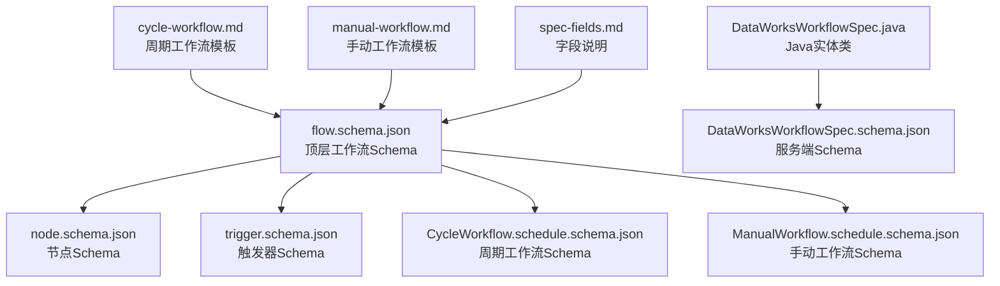
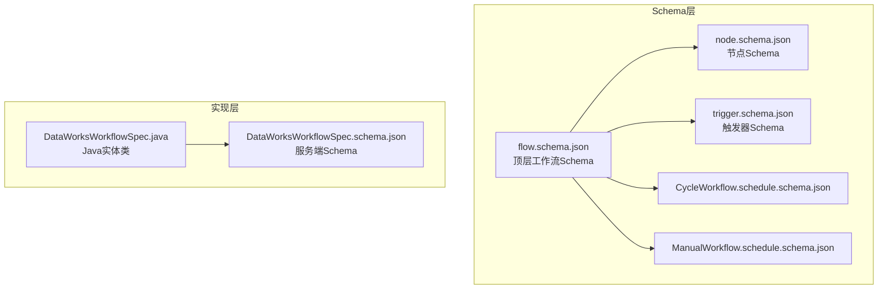
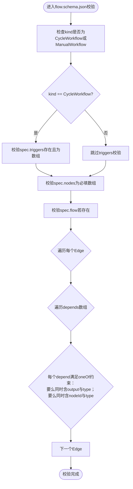
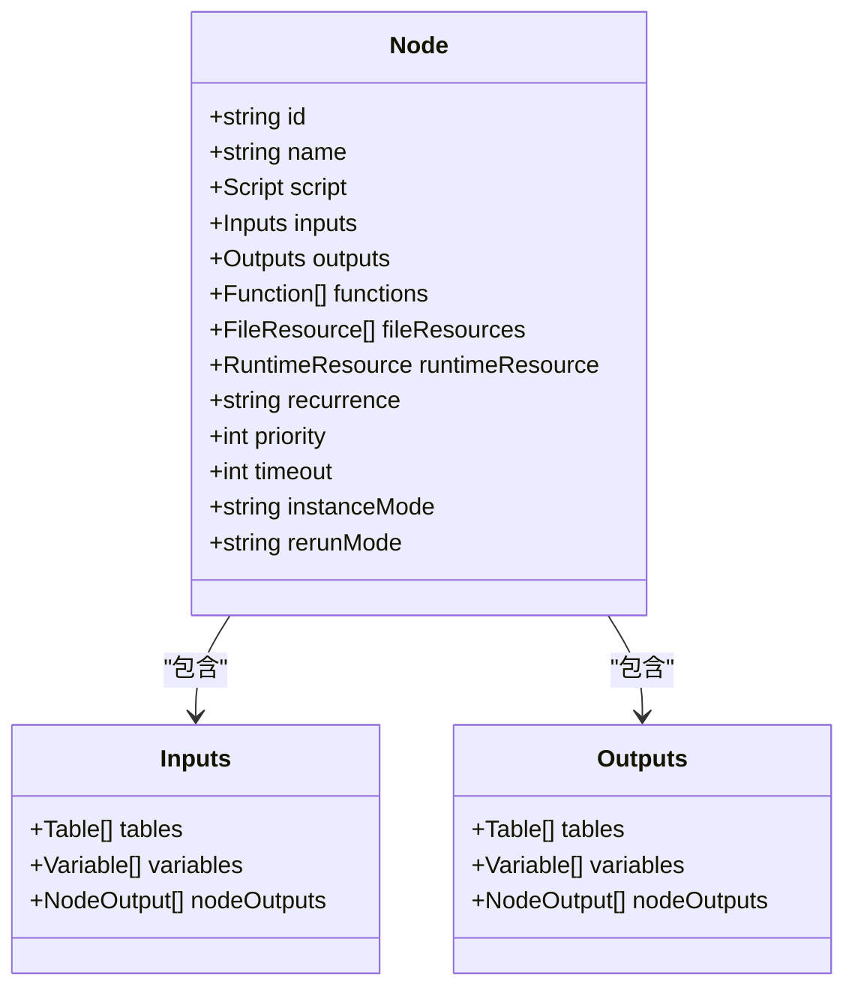
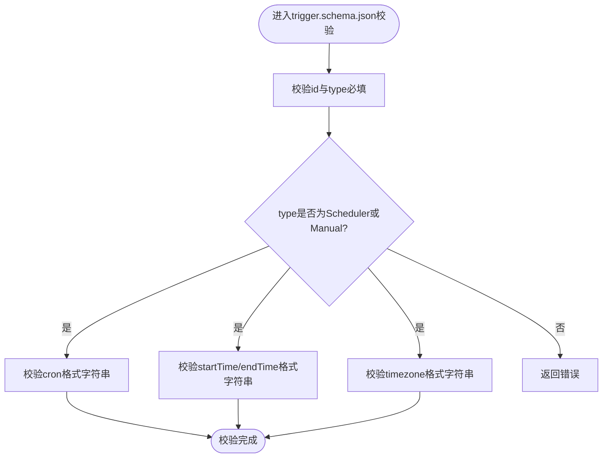
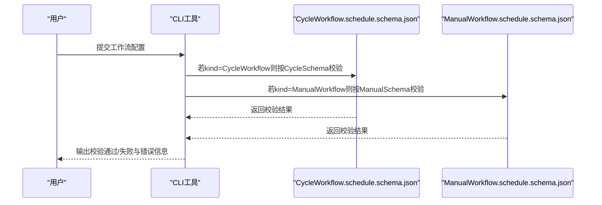
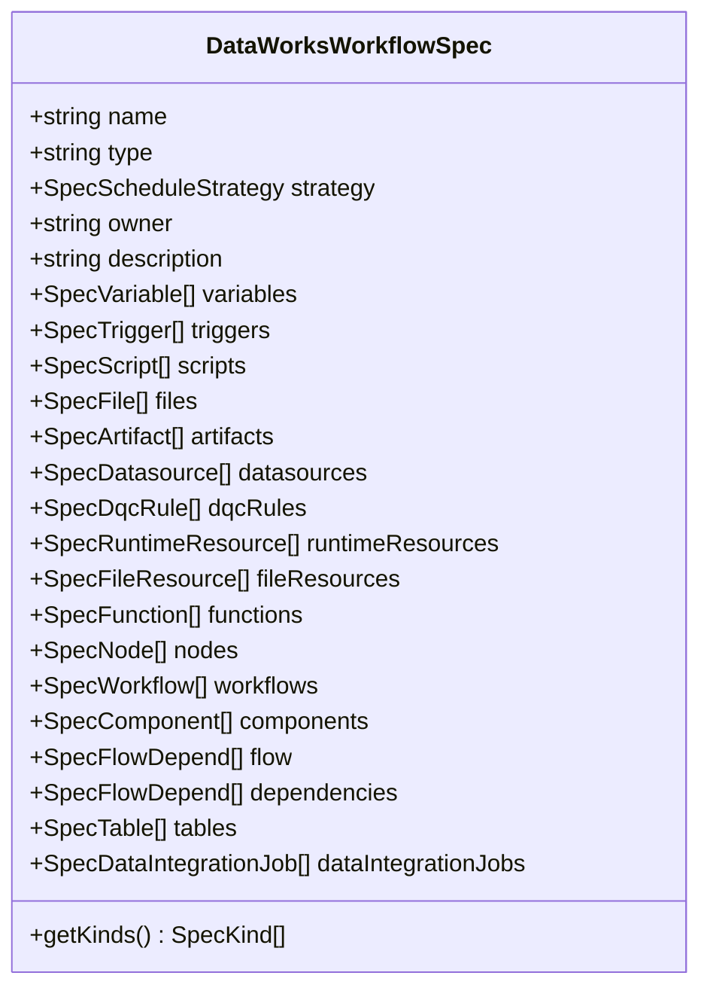
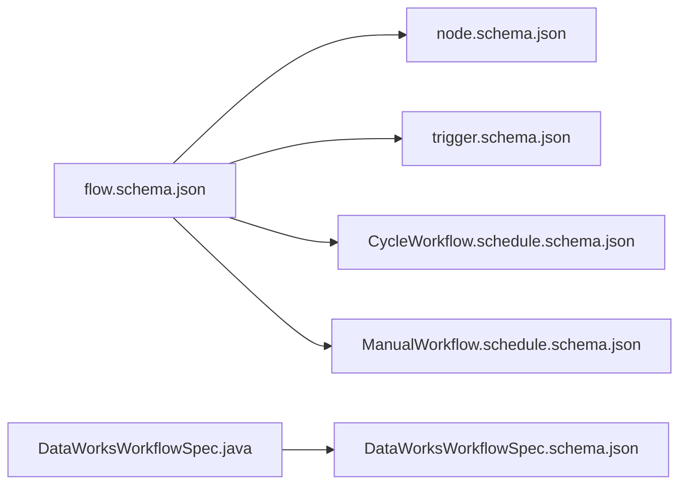

# 工作流定义

<cite>
**本文引用的文件**
- [flow.schema.json](file://schema/flow.schema.json)
- [trigger.schema.json](file://schema/trigger.schema.json)
- [node.schema.json](file://schema/node.schema.json)
- [CycleWorkflow.schedule.schema.json](file://dwcli/dwcli/schemas/CycleWorkflow.schedule.schema.json)
- [ManualWorkflow.schedule.schema.json](file://dwcli/dwcli/schemas/ManualWorkflow.schedule.schema.json)
- [DataWorksWorkflowSpec.java](file://spec/src/main/java/com/aliyun/dataworks/common/spec/domain/DataWorksWorkflowSpec.java)
- [DataWorksWorkflowSpec.schema.json](file://spec/src/main/resources/spec/schema/DataWorksWorkflowSpec.schema.json)
- [cycle-workflow.md](file://docs/spec-templates/workflows/cycle-workflow.md)
- [manual-workflow.md](file://docs/spec-templates/workflows/manual-workflow.md)
- [spec-fields.md](file://docs/spec/spec-fields.md)
- [samples.md](file://docs/spec/samples.md)
</cite>

## 目录
1. [简介](#简介)
2. [项目结构](#项目结构)
3. [核心组件](#核心组件)
4. [架构总览](#架构总览)
5. [详细组件分析](#详细组件分析)
6. [依赖分析](#依赖分析)
7. [性能考虑](#性能考虑)
8. [故障排查指南](#故障排查指南)
9. [结论](#结论)
10. [附录](#附录)

## 简介
本文件面向DataWorks工作流规范（DataWorksWorkflowSpec），系统化梳理工作流的定义结构与执行策略，重点覆盖以下方面：
- 工作流元数据（metadata）、工作流类型（kind）、版本信息（version）与执行策略
- flow.schema.json中定义的JSON Schema验证规则（必填字段、数据类型约束、枚举值限制）
- 工作流生命周期管理（创建、编辑、发布、暂停、归档等状态转换）
- 工作流配置的完整示例与最佳实践（周期性工作流、手动触发工作流）

## 项目结构
围绕工作流定义，仓库中与之相关的关键目录与文件如下：
- schema/flow.schema.json：工作流顶层JSON Schema，定义version、kind、spec、metadata以及CycleWorkflow/ManualWorkflow的条件分支校验
- schema/trigger.schema.json：触发器Schema，定义Scheduler/Manual两类触发器及cron、时间范围与时区等字段
- schema/node.schema.json：节点Schema，定义节点属性（recurrence、priority、timeout、instanceMode、rerunMode等）
- dwcli/dwcli/schemas/CycleWorkflow.schedule.schema.json 与 ManualWorkflow.schedule.schema.json：CLI侧针对两种工作流类型的独立Schema，强调字段约束与示例
- spec/src/main/java/com/aliyun/dataworks/common/spec/domain/DataWorksWorkflowSpec.java：Java实体类，承载工作流对象的属性集合与类型映射
- spec/src/main/resources/spec/schema/DataWorksWorkflowSpec.schema.json：DataWorksWorkflowSpec的JSON Schema（服务端/SDK侧），补充字段约束与最小项要求
- docs/spec-templates/workflows/cycle-workflow.md 与 manual-workflow.md：官方模板文档，给出完整示例与字段说明
- docs/spec/spec-fields.md：字段说明文档，涵盖version、kind、metadata、variables、scripts、triggers、nodes、artifacts、runtimeResources、fileResources、functions、flow等
- docs/spec/samples.md：示例清单，提供真实案例与简单示例的链接

图表来源
- [flow.schema.json](file://schema/flow.schema.json#L1-L202)
- [node.schema.json](file://schema/node.schema.json#L1-L160)
- [trigger.schema.json](file://schema/trigger.schema.json#L1-L36)
- [CycleWorkflow.schedule.schema.json](file://dwcli/dwcli/schemas/CycleWorkflow.schedule.schema.json#L1-L136)
- [ManualWorkflow.schedule.schema.json](file://dwcli/dwcli/schemas/ManualWorkflow.schedule.schema.json#L1-L103)
- [DataWorksWorkflowSpec.java](file://spec/src/main/java/com/aliyun/dataworks/common/spec/domain/DataWorksWorkflowSpec.java#L1-L130)
- [DataWorksWorkflowSpec.schema.json](file://spec/src/main/resources/spec/schema/DataWorksWorkflowSpec.schema.json#L1-L119)
- [cycle-workflow.md](file://docs/spec-templates/workflows/cycle-workflow.md#L1-L199)
- [manual-workflow.md](file://docs/spec-templates/workflows/manual-workflow.md#L1-L236)
- [spec-fields.md](file://docs/spec/spec-fields.md#L1-L569)

章节来源
- [flow.schema.json](file://schema/flow.schema.json#L1-L202)
- [DataWorksWorkflowSpec.java](file://spec/src/main/java/com/aliyun/dataworks/common/spec/domain/DataWorksWorkflowSpec.java#L60-L130)

## 核心组件
- 顶层工作流对象
  - version：字符串，版本号
  - kind：字符串，枚举值为“CycleWorkflow”或“ManualWorkflow”
  - spec：对象，包含nodes、scripts、artifacts、variables、runtimeResources、fileResources、functions、flow等
  - metadata：对象，可选，包含owner、description等扩展元信息
- 工作流类型与执行策略
  - CycleWorkflow：周期调度工作流，必须包含spec.triggers（Scheduler类型）
  - ManualWorkflow：手动触发工作流，不需要spec.triggers，节点trigger.type为Manual
- 节点属性与执行策略
  - recurrence：Normal/Skip/Pause
  - priority：整数，数值越大优先级越高
  - timeout：整数，单位秒
  - instanceMode：T+1/Immediately
  - rerunMode：Allowed/Denied/FailureAllowed
- 触发器
  - type：Scheduler/Manual
  - cron：Cron表达式
  - startTime/endTime：生效时间范围
  - timezone：时区

章节来源
- [flow.schema.json](file://schema/flow.schema.json#L1-L202)
- [trigger.schema.json](file://schema/trigger.schema.json#L1-L36)
- [node.schema.json](file://schema/node.schema.json#L1-L160)
- [spec-fields.md](file://docs/spec/spec-fields.md#L1-L569)

## 架构总览
下图展示了工作流定义在Schema层与实现层的对应关系，以及两种工作流类型的差异点。

图表来源
- [flow.schema.json](file://schema/flow.schema.json#L1-L202)
- [node.schema.json](file://schema/node.schema.json#L1-L160)
- [trigger.schema.json](file://schema/trigger.schema.json#L1-L36)
- [CycleWorkflow.schedule.schema.json](file://dwcli/dwcli/schemas/CycleWorkflow.schedule.schema.json#L1-L136)
- [ManualWorkflow.schedule.schema.json](file://dwcli/dwcli/schemas/ManualWorkflow.schedule.schema.json#L1-L103)
- [DataWorksWorkflowSpec.java](file://spec/src/main/java/com/aliyun/dataworks/common/spec/domain/DataWorksWorkflowSpec.java#L60-L130)
- [DataWorksWorkflowSpec.schema.json](file://spec/src/main/resources/spec/schema/DataWorksWorkflowSpec.schema.json#L1-L119)

## 详细组件分析

### 组件A：工作流顶层Schema（flow.schema.json）
- 结构要点
  - 必填字段：version、kind、spec
  - kind枚举：CycleWorkflow、ManualWorkflow
  - metadata可选
  - 条件分支：当kind为CycleWorkflow时，spec必须包含triggers数组
- spec子结构
  - nodes：必填数组，元素为节点定义
  - scripts、artifacts、variables、runtimeResources、fileResources、functions：可选数组
  - flow：可选数组，定义节点依赖关系
- 依赖关系（flow）的约束
  - 每个边包含nodeId与depends数组
  - depends数组中的元素支持两种形式之一：
    - 同时包含output、type
    - 同时包含nodeId、type
  - type枚举：Normal、CrossCycleDependsOnSelf、CrossCycleDependsOnChildren、CrossCycleDependsOnOtherNode

图表来源
- [flow.schema.json](file://schema/flow.schema.json#L1-L202)

章节来源
- [flow.schema.json](file://schema/flow.schema.json#L1-L202)

### 组件B：节点Schema（node.schema.json）
- 关键字段与约束
  - id/name/script：必填
  - inputs/outputs：可选，支持tables、variables、nodeOutputs
  - functions/fileResources/runtimeResource：可选
  - recurrence：枚举Normal/Skip/Pause
  - priority：整数
  - timeout：整数（秒）
  - instanceMode：枚举T+1/Immediately
  - rerunMode：枚举Allowed/Denied/FailureAllowed

图表来源
- [node.schema.json](file://schema/node.schema.json#L1-L160)

章节来源
- [node.schema.json](file://schema/node.schema.json#L1-L160)

### 组件C：触发器Schema（trigger.schema.json）
- 关键字段与约束
  - id/type：必填
  - type枚举：Scheduler/Manual
  - cron：字符串（Cron表达式）
  - startTime/endTime：字符串（时间范围）
  - timezone：字符串（时区）

图表来源
- [trigger.schema.json](file://schema/trigger.schema.json#L1-L36)

章节来源
- [trigger.schema.json](file://schema/trigger.schema.json#L1-L36)

### 组件D：CLI工作流Schema（CycleWorkflow.schedule.schema.json / ManualWorkflow.schedule.schema.json）
- CycleWorkflow
  - kind固定为“CycleWorkflow”
  - spec.nodes必填，节点type枚举丰富（ODPS_SQL、SHELL、PYTHON、SPARK、FLINK、EMR_HIVE、EMR_SPARK、VIRTUAL等）
  - 支持timeout、recurrence、script.runtime等字段
  - 支持trigger.type为Scheduler或Manual（但CycleWorkflow通常使用Scheduler）
- ManualWorkflow
  - kind固定为“ManualWorkflow”
  - 不包含spec.triggers
  - 节点trigger.type必须为Manual

图表来源
- [CycleWorkflow.schedule.schema.json](file://dwcli/dwcli/schemas/CycleWorkflow.schedule.schema.json#L1-L136)
- [ManualWorkflow.schedule.schema.json](file://dwcli/dwcli/schemas/ManualWorkflow.schedule.schema.json#L1-L103)

章节来源
- [CycleWorkflow.schedule.schema.json](file://dwcli/dwcli/schemas/CycleWorkflow.schedule.schema.json#L1-L136)
- [ManualWorkflow.schedule.schema.json](file://dwcli/dwcli/schemas/ManualWorkflow.schedule.schema.json#L1-L103)

### 组件E：Java实体与服务端Schema（DataWorksWorkflowSpec.java / DataWorksWorkflowSpec.schema.json）
- Java实体类DataWorksWorkflowSpec
  - 字段覆盖：name、type、strategy、owner、description、variables、triggers、scripts、files、artifacts、datasources、dqcRules、runtimeResources、fileResources、functions、nodes、workflows、components、flow、dependencies、tables、dataIntegrationJobs
  - getKinds返回多种工作流/节点类型枚举，包含CYCLE_WORKFLOW、MANUAL_WORKFLOW等
- 服务端Schema DataWorksWorkflowSpec.schema.json
  - 对多个字段添加minItems约束（如nodes、scripts、files、artifacts、datasources、runtimeResources、fileResources、functions、workflows、components、flow、tables）
  - 引用各子Schema文件进行细粒度校验

图表来源
- [DataWorksWorkflowSpec.java](file://spec/src/main/java/com/aliyun/dataworks/common/spec/domain/DataWorksWorkflowSpec.java#L60-L130)
- [DataWorksWorkflowSpec.schema.json](file://spec/src/main/resources/spec/schema/DataWorksWorkflowSpec.schema.json#L1-L119)

章节来源
- [DataWorksWorkflowSpec.java](file://spec/src/main/java/com/aliyun/dataworks/common/spec/domain/DataWorksWorkflowSpec.java#L60-L130)
- [DataWorksWorkflowSpec.schema.json](file://spec/src/main/resources/spec/schema/DataWorksWorkflowSpec.schema.json#L1-L119)

## 依赖分析
- 组件耦合
  - flow.schema.json作为顶层入口，依赖node.schema.json与trigger.schema.json
  - CLI侧的CycleWorkflow.schedule.schema.json与ManualWorkflow.schedule.schema.json分别对两种工作流类型进行细化约束
  - Java实体类DataWorksWorkflowSpec与服务端Schema DataWorksWorkflowSpec.schema.json共同保证对象模型与Schema的一致性
- 外部依赖
  - Cron表达式与时区由trigger.schema.json统一约束
  - 节点类型与属性由node.schema.json统一约束

图表来源
- [flow.schema.json](file://schema/flow.schema.json#L1-L202)
- [node.schema.json](file://schema/node.schema.json#L1-L160)
- [trigger.schema.json](file://schema/trigger.schema.json#L1-L36)
- [CycleWorkflow.schedule.schema.json](file://dwcli/dwcli/schemas/CycleWorkflow.schedule.schema.json#L1-L136)
- [ManualWorkflow.schedule.schema.json](file://dwcli/dwcli/schemas/ManualWorkflow.schedule.schema.json#L1-L103)
- [DataWorksWorkflowSpec.java](file://spec/src/main/java/com/aliyun/dataworks/common/spec/domain/DataWorksWorkflowSpec.java#L60-L130)
- [DataWorksWorkflowSpec.schema.json](file://spec/src/main/resources/spec/schema/DataWorksWorkflowSpec.schema.json#L1-L119)

章节来源
- [flow.schema.json](file://schema/flow.schema.json#L1-L202)
- [node.schema.json](file://schema/node.schema.json#L1-L160)
- [trigger.schema.json](file://schema/trigger.schema.json#L1-L36)
- [DataWorksWorkflowSpec.java](file://spec/src/main/java/com/aliyun/dataworks/common/spec/domain/DataWorksWorkflowSpec.java#L60-L130)
- [DataWorksWorkflowSpec.schema.json](file://spec/src/main/resources/spec/schema/DataWorksWorkflowSpec.schema.json#L1-L119)

## 性能考虑
- 节点超时与重试
  - 通过timeout与rerunMode/rerunTimes/rerunInterval控制任务执行时长与失败重试策略，避免长时间阻塞
- 优先级与并发
  - priority影响调度优先级；maxInternalConcurrency等策略可限制内部并发，避免资源争用
- 资源隔离
  - runtimeResource通过资源组实现隔离，降低相互影响

[本节为通用指导，无需列出章节来源]

## 故障排查指南
- 常见问题定位
  - kind未设置或不在枚举范围内：检查flow.schema.json中的kind约束
  - CycleWorkflow缺少spec.triggers：检查flow.schema.json的条件分支
  - 节点依赖不满足oneOf约束：检查flow.edges.depends中output/nodeId与type的组合
  - 触发器type与工作流类型不匹配：CycleWorkflow应使用Scheduler，ManualWorkflow应使用Manual
- 排查步骤
  1) 使用CLI工具加载对应Schema进行校验
  2) 逐项核对必填字段与枚举值
  3) 检查节点依赖是否存在循环依赖
  4) 确认触发器的时间范围与时区配置正确

章节来源
- [flow.schema.json](file://schema/flow.schema.json#L1-L202)
- [trigger.schema.json](file://schema/trigger.schema.json#L1-L36)
- [node.schema.json](file://schema/node.schema.json#L1-L160)
- [cycle-workflow.md](file://docs/spec-templates/workflows/cycle-workflow.md#L1-L199)
- [manual-workflow.md](file://docs/spec-templates/workflows/manual-workflow.md#L1-L236)

## 结论
- DataWorksWorkflowSpec通过多层Schema（顶层flow.schema.json、节点node.schema.json、触发器trigger.schema.json）与实现层（Java实体类与服务端Schema）共同确保工作流定义的完整性与一致性
- 周期性工作流与手动工作流在触发机制与Schema约束上存在显著差异，需严格区分
- 通过合理的节点属性（recurrence、priority、timeout、instanceMode、rerunMode）与触发器配置（type、cron、时间范围、时区），可实现稳定可靠的调度执行

[本节为总结性内容，无需列出章节来源]

## 附录

### 生命周期管理（创建/编辑/发布/暂停/归档）
- 创建
  - 填写version、kind、spec（nodes、scripts、artifacts、variables、runtimeResources、fileResources、functions、flow等）
  - 对于CycleWorkflow，补充spec.triggers（Scheduler）
- 编辑
  - 修改节点属性（recurrence、priority、timeout、instanceMode、rerunMode）
  - 更新依赖关系（flow）
  - 调整触发器（cron、时间范围、时区）
- 发布
  - 通过CLI或SDK提交并通过Schema校验
  - 设置触发器生效时间（startTime/endTime）
- 暂停
  - 将节点recurrence设为Skip或Pause
  - 或调整触发器生效时间窗口
- 归档
  - 通过元数据（metadata.owner、description）与资源组隔离实现归档策略

[本节为通用指导，无需列出章节来源]

### 配置示例与最佳实践
- 周期性工作流（CycleWorkflow）
  - 完整示例参考：[cycle-workflow.md](file://docs/spec-templates/workflows/cycle-workflow.md#L1-L199)
  - 最佳实践
    - 使用标准Cron表达式
    - 设置合理的timeout与重试策略
    - 使用系统变量参数化日期
    - 通过runtimeResource实现资源隔离
- 手动触发工作流（ManualWorkflow）
  - 完整示例参考：[manual-workflow.md](file://docs/spec-templates/workflows/manual-workflow.md#L1-L236)
  - 最佳实践
    - 清晰命名节点与输出
    - 明确依赖关系（flow）
    - 合理设置超时与重试
    - 完善metadata信息

章节来源
- [cycle-workflow.md](file://docs/spec-templates/workflows/cycle-workflow.md#L1-L199)
- [manual-workflow.md](file://docs/spec-templates/workflows/manual-workflow.md#L1-L236)
- [samples.md](file://docs/spec/samples.md#L1-L63)