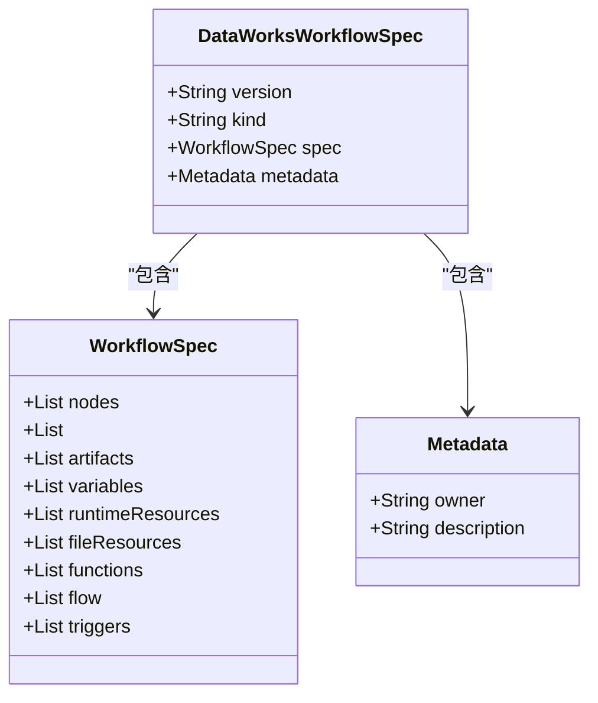
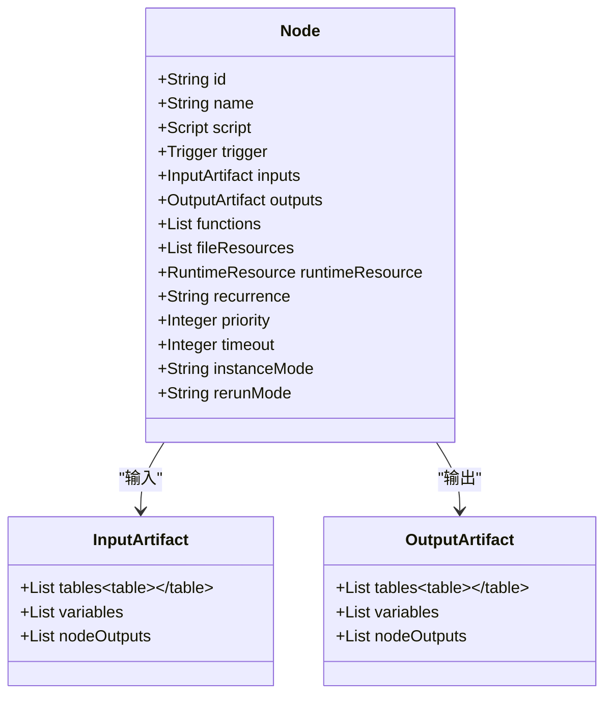
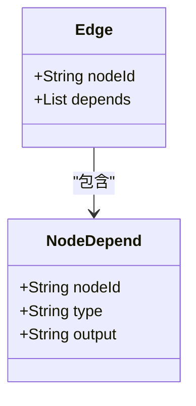
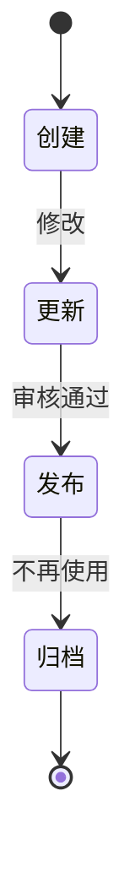
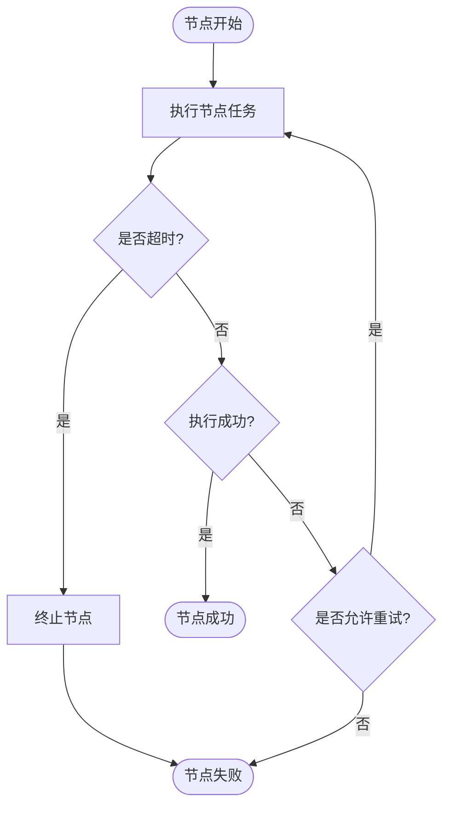
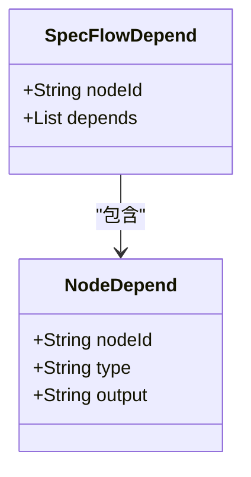
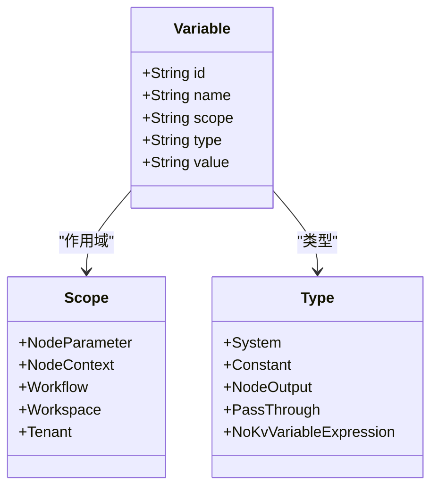

# 工作流结构

<cite>
**本文档引用的文件**   
- [flow.schema.json](file://schema/flow.schema.json)
- [node.schema.json](file://schema/node.schema.json)
- [artifact.schema.json](file://schema/artifact.schema.json)
- [trigger.schema.json](file://schema/trigger.schema.json)
- [function.schema.json](file://schema/function.schema.json)
- [runtimeResource.schema.json](file://schema/runtimeResource.schema.json)
- [fileResource.schema.json](file://schema/fileResource.schema.json)
- [DataWorksWorkflowSpec.java](file://spec/src/main/java/com/aliyun/dataworks/common/spec/domain/DataWorksWorkflowSpec.java)
- [VersionConverterV2Impl.java](file://spec/src/main/java/com/aliyun/dataworks/common/spec/version/VersionConverterV2Impl.java)
- [cycle_workflow_spec.json](file://spec/src/test/resources/copier/cycle_workflow_spec.json)
- [manual.json](file://spec/src/test/resources/nodemodel/manual.json)
- [manual-workflow.template.json](file://dwcli/dwcli/templates/manual-workflow.template.json)
</cite>

## 目录
1. [简介](#简介)
2. [工作流基本结构](#工作流基本结构)
3. [节点定义](#节点定义)
4. [边连接关系和资源依赖](#边连接关系和资源依赖)
5. [工作流版本控制机制和状态管理](#工作流版本控制机制和状态管理)
6. [工作流异常处理机制](#工作流异常处理机制)
7. [工作流依赖管理](#工作流依赖管理)
8. [参数传递机制和执行上下文配置](#参数传递机制和执行上下文配置)
9. [复杂工作流场景配置示例和最佳实践](#复杂工作流场景配置示例和最佳实践)

## 简介
DataWorks工作流规范（DataWorksWorkflowSpec）是一个用于描述数据工作流的通用规范，它定义了工作流的元数据、节点定义、边连接关系、资源依赖等核心结构。该规范通过JSON Schema文件（flow.schema.json）进行定义，并在Java类DataWorksWorkflowSpec中实现。工作流支持周期调度和手动触发两种类型，具有完善的版本控制、状态管理和异常处理机制。

## 工作流基本结构
DataWorks工作流的基本结构由`flow.schema.json`文件定义，包含版本号、工作流类型、规范定义和元数据四个主要部分。



**Diagram sources**
- [flow.schema.json](file://schema/flow.schema.json)
- [DataWorksWorkflowSpec.java](file://spec/src/main/java/com/aliyun/dataworks/common/spec/domain/DataWorksWorkflowSpec.java)

**Section sources**
- [flow.schema.json](file://schema/flow.schema.json#L1-L202)
- [DataWorksWorkflowSpec.java](file://spec/src/main/java/com/aliyun/dataworks/common/spec/domain/DataWorksWorkflowSpec.java#L1-L130)

### 工作流元数据
工作流元数据包含版本号、类型和扩展信息。版本号标识工作流规范的版本，类型分为周期调度工作流（CycleWorkflow）和手动触发工作流（ManualWorkflow）。元数据还包括责任人和描述等扩展信息。

## 节点定义
节点是工作流的基本执行单元，由`node.schema.json`文件定义。每个节点包含唯一标识、名称、脚本、触发器、输入输出、函数、文件资源、运行时资源、调度状态、优先级、超时时间、实例化模式和重试策略等属性。



**Diagram sources**
- [node.schema.json](file://schema/node.schema.json)
- [DataWorksWorkflowSpec.java](file://spec/src/main/java/com/aliyun/dataworks/common/spec/domain/DataWorksWorkflowSpec.java)

**Section sources**
- [node.schema.json](file://schema/node.schema.json#L1-L160)
- [DataWorksWorkflowSpec.java](file://spec/src/main/java/com/aliyun/dataworks/common/spec/domain/DataWorksWorkflowSpec.java#L1-L130)

## 边连接关系和资源依赖
边连接关系定义了工作流中节点之间的依赖关系，由`flow.schema.json`中的`flow`属性定义。每个边包含节点ID和依赖列表，依赖类型包括正常依赖、跨周期自依赖、跨周期子依赖和跨周期其他节点依赖。



**Diagram sources**
- [flow.schema.json](file://schema/flow.schema.json)

**Section sources**
- [flow.schema.json](file://schema/flow.schema.json#L86-L148)

## 工作流版本控制机制和状态管理
工作流版本控制通过`VersionConverter`接口和`VersionConverterV2Impl`类实现，支持不同版本之间的转换。工作流的生命周期包括创建、更新、发布和归档等状态。



**Diagram sources**
- [VersionConverter.java](file://spec/src/main/java/com/aliyun/dataworks/common/spec/version/VersionConverter.java)
- [VersionConverterV2Impl.java](file://spec/src/main/java/com/aliyun/dataworks/common/spec/version/VersionConverterV2Impl.java)

**Section sources**
- [VersionConverter.java](file://spec/src/main/java/com/aliyun/dataworks/common/spec/version/VersionConverter.java#L1-L46)
- [VersionConverterV2Impl.java](file://spec/src/main/java/com/aliyun/dataworks/common/spec/version/VersionConverterV2Impl.java#L1-L210)

## 工作流异常处理机制
工作流异常处理机制包括错误重试策略、超时设置和告警配置。节点的重试策略分为允许重试、禁止重试和失败时允许重试。超时设置定义了节点运行的最大时间，超过该时间后节点将被终止。



**Diagram sources**
- [node.schema.json](file://schema/node.schema.json)

**Section sources**
- [node.schema.json](file://schema/node.schema.json#L140-L153)

## 工作流依赖管理
工作流依赖管理包括跨工作流依赖和内部节点依赖的配置。跨工作流依赖通过`SpecFlowDepend`类实现，内部节点依赖通过`flow`属性中的`depends`列表配置。



**Diagram sources**
- [DataWorksWorkflowSpec.java](file://spec/src/main/java/com/aliyun/dataworks/common/spec/domain/DataWorksWorkflowSpec.java)

**Section sources**
- [DataWorksWorkflowSpec.java](file://spec/src/main/java/com/aliyun/dataworks/common/spec/domain/DataWorksWorkflowSpec.java#L85-L86)

## 参数传递机制和执行上下文配置
参数传递机制包括全局参数、节点参数和环境变量的使用。执行上下文配置定义了参数的作用域和类型，作用域包括节点参数、节点上下文、工作流、工作空间和租户级别。



**Diagram sources**
- [artifact.schema.json](file://schema/artifact.schema.json)

**Section sources**
- [artifact.schema.json](file://schema/artifact.schema.json#L65-L131)

## 复杂工作流场景配置示例和最佳实践
以下是一个复杂工作流场景的配置示例，展示了周期调度工作流的完整配置：

```json
{
  "version": "1.1.0",
  "kind": "CycleWorkflow",
  "spec": {
    "name": "workflow1",
    "id": "7322159560488851894",
    "type": "CycleWorkflow",
    "owner": "1107550004253538",
    "workflows": [
      {
        "script": {
          "path": "克隆测试1/workflow1",
          "runtime": {
            "command": "WORKFLOW"
          },
          "id": "7975172041965086428"
        },
        "id": "7322159560488851894",
        "trigger": {
          "type": "Scheduler",
          "cron": "00 00 00 * * ?",
          "startTime": "1970-01-01 00:00:00",
          "endTime": "9999-01-01 00:00:00",
          "timezone": "GMT+8",
          "delaySeconds": 0
        },
        "strategy": {
          "timeout": 0,
          "instanceMode": "T+1",
          "rerunMode": "Allowed",
          "rerunTimes": 3,
          "rerunInterval": 180000,
          "failureStrategy": "Break",
          "recurrenceType": "Normal"
        },
        "name": "workflow1",
        "owner": "1107550004253538",
        "citable": false,
        "metadata": {
          "owner": "1107550004253538",
          "tenantId": "524257424564736",
          "project": {
            "projectIdentifier": "reg_upgrade0702",
            "projectName": "reg_upgrade0702",
            "projectId": "873483"
          },
          "ownerName": "dw_on_emr_qa3_testcloud_com",
          "projectId": "873483"
        },
        "inputs": {},
        "outputs": {
          "nodeOutputs": [
            {
              "data": "7322159560488851894",
              "artifactType": "NodeOutput",
              "sourceType": "System",
              "refTableName": "workflow1",
              "isDefault": true
            },
            {
              "data": "reg_upgrade0702.workflow1",
              "artifactType": "NodeOutput",
              "refTableName": "workflow1",
              "isDefault": false
            }
          ]
        },
        "nodes": [
          {
            "recurrence": "Normal",
            "id": "5338330707779726879",
            "timeout": 0,
            "instanceMode": "T+1",
            "rerunMode": "Allowed",
            "rerunTimes": 3,
            "rerunInterval": 120000,
            "script": {
              "path": "克隆测试1/workflow1/canshu1",
              "runtime": {
                "command": "PARAM_HUB",
                "commandTypeId": 1115,
                "cu": "0.25"
              },
              "id": "5242230255115979449"
            },
            "trigger": {
              "type": "Scheduler",
              "cron": "00 00 00 * * ?",
              "startTime": "1970-01-01 00:00:00",
              "endTime": "9999-01-01 00:00:00",
              "timezone": "GMT+8",
              "delaySeconds": 0
            },
            "runtimeResource": {
              "resourceGroup": "S_res_group_524257424564736_1751013862820",
              "resourceGroupId": "86214319"
            },
            "name": "canshu1",
            "owner": "1107550004253538",
            "metadata": {
              "owner": "1107550004253538",
              "container": {
                "type": "Flow",
                "uuid": "7322159560488851894"
              },
              "ownerName": "dw_on_emr_qa3_testcloud_com",
              "createTime": "2025-07-08 14:22:29",
              "tenantId": "524257424564736",
              "project": {
                "projectIdentifier": "reg_upgrade0702",
                "projectName": "reg_upgrade0702",
                "projectId": "873483"
              },
              "projectId": "873483"
            },
            "inputs": {},
            "outputs": {
              "nodeOutputs": [
                {
                  "data": "5338330707779726879",
                  "artifactType": "NodeOutput",
                  "sourceType": "System",
                  "refTableName": "canshu1",
                  "isDefault": true
                }
              ],
              "variables": [
                {
                  "artifactType": "Variable",
                  "name": "cc1",
                  "scope": "NodeContext",
                  "type": "Constant",
                  "value": "1111",
                  "id": "5032838759640803314",
                  "node": {
                    "nodeId": "5338330707779726879",
                    "output": "5338330707779726879"
                  },
                  "referenceVariable": {
                    "artifactType": "Variable",
                    "name": "cc1",
                    "scope": "NodeContext",
                    "type": "Constant",
                    "value": "$[yyyymmdd]",
                    "node": {
                      "nodeId": "5338330707779726879",
                      "output": "5338330707779726879",
                      "refTableName": "canshu1"
                    }
                  }
                },
                {
                  "artifactType": "Variable",
                  "name": "pp1",
                  "scope": "NodeContext",
                  "type": "PassThrough",
                  "value": "6513832219288700312:outputs",
                  "id": "4637860600504521571",
                  "node": {
                    "nodeId": "5338330707779726879",
                    "output": "5338330707779726879"
                  },
                  "referenceVariable": {
                    "artifactType": "Variable",
                    "name": "outputs",
                    "scope": "NodeContext",
                    "type": "NodeOutput",
                    "value": "6513832219288700312:outputs",
                    "node": {
                      "output": "6513832219288700312"
                    }
                  }
                },
                {
                  "artifactType": "Variable",
                  "name": "vv1",
                  "scope": "NodeContext",
                  "type": "System",
                  "value": "$[yyyymmdd]",
                  "id": "8641711885350837009",
                  "node": {
                    "nodeId": "5338330707779726879",
                    "output": "5338330707779726879"
                  },
                  "referenceVariable": {
                    "artifactType": "Variable",
                    "name": "vv1",
                    "scope": "NodeContext",
                    "type": "System",
                    "value": "$[yyyymmdd]",
                    "node": {
                      "nodeId": "5338330707779726879",
                      "output": "5338330707779726879",
                      "refTableName": "canshu1"
                    }
                  }
                }
              ]
            },
            "param-hub": {
              "variables": [
                {
                  "artifactType": "Variable",
                  "name": "cc1",
                  "scope": "NodeContext",
                  "type": "Constant",
                  "value": "1111",
                  "description": "1111"
                },
                {
                  "artifactType": "Variable",
                  "name": "vv1",
                  "scope": "NodeContext",
                  "type": "System",
                  "value": "$[yyyymmdd]",
                  "description": "222"
                },
                {
                  "artifactType": "Variable",
                  "name": "pp1",
                  "scope": "NodeContext",
                  "type": "PassThrough",
                  "value": "6513832219288700312:outputs",
                  "description": "333",
                  "referenceVariable": {
                    "artifactType": "Variable",
                    "name": "outputs",
                    "scope": "NodeContext",
                    "type": "NodeOutput",
                    "node": {
                      "output": "6513832219288700312"
                    }
                  }
                }
              ]
            }
          }
        ]
      }
    ]
  }
}
```

**Section sources**
- [cycle_workflow_spec.json](file://spec/src/test/resources/copier/cycle_workflow_spec.json)