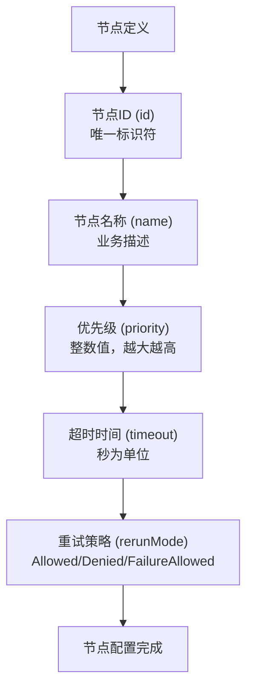
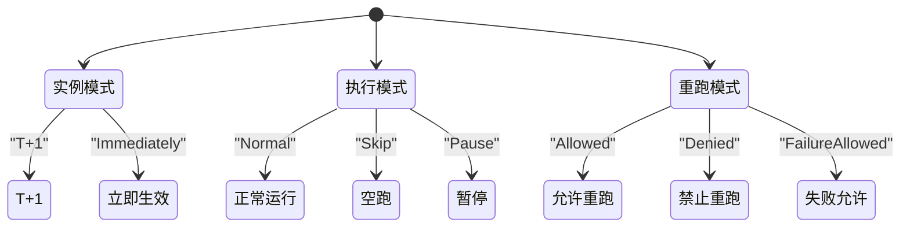
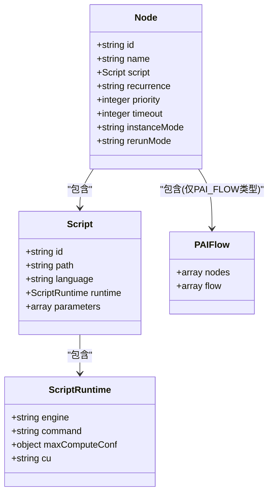
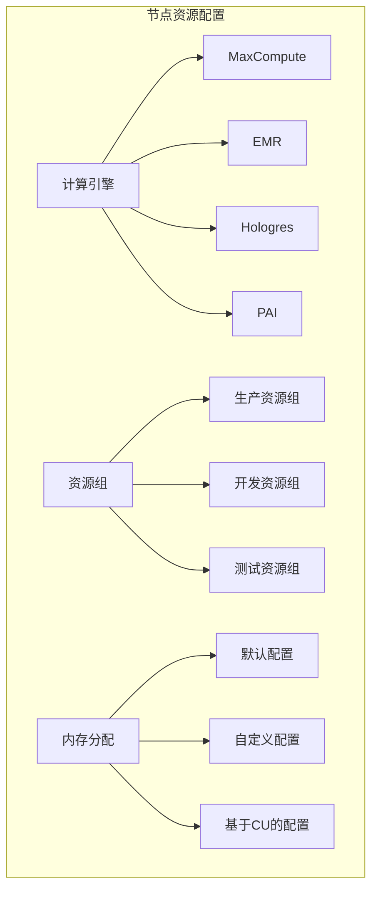

# 节点管理

<cite>
**本文档引用的文件**  
- [node.schema.json](file://schema/node.schema.json)
- [SpecNode.schema.json](file://spec/src/main/resources/spec/schema/SpecNode.schema.json)
- [spec-fields.md](file://docs/spec/spec-fields.md)
- [odps-sql.md](file://docs/spec-templates/nodes/odps-sql.md)
- [pai-flow.md](file://docs/spec-templates/nodes/pai-flow.md)
- [runtimeResource.schema.json](file://schema/runtimeResource.schema.json)
- [script.schema.json](file://schema/script.schema.json)
- [manual.json](file://spec/src/test/resources/nodemodel/manual.json)
- [pyodps2.json](file://spec/src/test/resources/nodemodel/pyodps2.json)
- [dide_shell.json](file://spec/src/test/resources/nodemodel/dide_shell.json)
- [test_node.sql](file://dwcli/myworkspace/test_node/test_node.sql)
</cite>

## 目录
1. [节点基础配置](#节点基础配置)
2. [节点执行模式](#节点执行模式)
3. [节点代码模型](#节点代码模型)
4. [节点资源配置](#节点资源配置)
5. [复杂节点场景示例](#复杂节点场景示例)

## 节点基础配置

工作流中的节点是数据处理的基本单元，每个节点都有唯一的标识和配置属性。节点的基本配置包括节点ID、名称、优先级、重试策略和超时设置等核心属性。

根据节点模式定义文件（node.schema.json），节点的ID和名称是必需字段，其中ID在Spec中必须唯一，名称用于标识节点的业务含义。优先级（priority）是一个整数值，数值越大表示优先级越高，在资源竞争时会优先调度。超时时间（timeout）以秒为单位，当节点运行超过指定时间后会被终止。



**节点基础配置**
- 节点ID和名称是必需字段，确保节点在工作流中的唯一性和可识别性
- 优先级设置应根据业务重要性进行分级，关键业务节点应设置较高优先级
- 超时时间应根据节点处理的数据量和复杂度合理设置，避免过短导致正常任务被终止或过长影响整体调度效率

**节点基础配置来源**
- [node.schema.json](file://schema/node.schema.json#L7-L16)
- [SpecNode.schema.json](file://spec/src/main/resources/spec/schema/SpecNode.schema.json#L6-L91)

## 节点执行模式

节点的执行模式包括实例模式（instancemode）、执行模式（recurrence）和重跑模式（rerunmode）三种配置选项，这些模式决定了节点在工作流中的调度行为和生命周期管理。

实例模式（instanceMode）控制节点配置变更的生效时机，支持"T+1"和"Immediately"两种模式。T+1模式下，节点配置修改将在第二天生效，适用于生产环境的稳定运行；Immediately模式下，配置修改立即生效，适用于开发和测试环境的快速迭代。

执行模式（recurrence）定义了周期调度节点的调度状态，包含"Normal"、"Skip"和"Pause"三种状态。Normal状态表示节点按指定周期正常调度运行；Skip状态表示节点会被实例化但不执行代码，直接标记为成功，常用于临时跳过某些节点；Pause状态表示节点会被实例化但直接标记为失败，用于暂停节点执行。

重跑模式（rerunmode）控制节点的重试策略，有"Allowed"、"Denied"和"FailureAllowed"三种选项。Allowed表示任何情况下都允许重跑；Denied表示任何情况下都不允许重跑；FailureAllowed表示仅在失败情况下允许重跑，这是最常用的重试策略。



**节点执行模式来源**
- [node.schema.json](file://schema/node.schema.json#L128-L153)
- [spec-fields.md](file://docs/spec/spec-fields.md#L336-L354)

## 节点代码模型

节点代码模型定义了不同类型节点的代码嵌入方式和执行环境配置。系统支持多种节点类型，包括SQL节点、Shell节点、PyODPS节点等，每种类型都有特定的代码模型配置。

SQL节点（ODPS_SQL）是最常用的节点类型之一，用于在MaxCompute计算引擎上执行SQL语句。其代码模型通过script属性定义，包含路径、语言和运行时配置。运行时配置中，engine指定为"MaxCompute"，command指定为"ODPS_SQL"，还可以通过maxComputeConf设置特定的SQL参数，如mapper split大小、reducer实例数等。

Shell节点和PyODPS节点的代码模型类似，主要区别在于运行时命令的设置。Shell节点使用"DIDE_SHELL"作为command，而PyODPS节点使用"PYODPS2"。这些节点的代码可以直接内联在content字段中，也可以通过path引用外部文件。

PAI Flow节点（PAI_FLOW）用于执行复杂的机器学习工作流，其代码模型更为复杂，包含嵌套的子节点和工作流定义。PAI Flow节点的paiflow属性定义了内部的工作流结构，包括子节点列表和依赖关系。



**节点代码模型来源**
- [odps-sql.md](file://docs/spec-templates/nodes/odps-sql.md)
- [pai-flow.md](file://docs/spec-templates/nodes/pai-flow.md)
- [script.schema.json](file://schema/script.schema.json)

## 节点资源配置

节点资源配置包括计算引擎、资源组和内存分配的配置方法，这些配置决定了节点运行时的计算能力和资源隔离级别。

计算引擎（engine）在script.runtime中配置，支持MaxCompute、EMR、Hologres等多种引擎类型。不同的计算引擎对应不同的command类型，如MaxCompute对应ODPS_SQL、PYODPS2等，EMR对应EMR_HIVE、EMR_SPARK等。

资源组（resourceGroup）在runtimeResource中配置，用于指定节点运行的资源隔离组。资源组提供了计算资源的逻辑隔离，确保不同业务或重要性的节点不会相互影响。资源组配置需要指定resourceGroup标识符和resourceGroupId。

内存分配和其他资源参数可以通过运行时的扩展属性进行配置。例如，PAI Flow节点可以通过cu属性配置计算单元，MaxCompute SQL节点可以通过maxComputeConf配置各种SQL执行参数。



**节点资源配置来源**
- [runtimeResource.schema.json](file://schema/runtimeResource.schema.json)
- [odps-sql.md](file://docs/spec-templates/nodes/odps-sql.md#L53-L57)
- [pai-flow.md](file://docs/spec-templates/nodes/pai-flow.md#L55-L58)

## 复杂节点场景示例

针对复杂节点场景，提供具体的配置示例和最佳实践，帮助用户理解和应用节点管理的各种配置选项。

### MaxCompute SQL节点示例

MaxCompute SQL节点是数据处理中最常见的节点类型。以下是一个完整的SQL节点配置示例，展示了如何配置一个周期性数据聚合任务：

```json
{
  "id": "node_odps_sql_001",
  "name": "daily_data_aggregation",
  "recurrence": "Normal",
  "priority": 5,
  "timeout": 3600,
  "instanceMode": "T+1",
  "rerunMode": "Allowed",
  "datasource": {
    "name": "odps_first",
    "type": "odps"
  },
  "script": {
    "path": "/业务流程/数据开发/daily_aggregation.sql",
    "language": "odps-sql",
    "runtime": {
      "engine": "MaxCompute",
      "command": "ODPS_SQL",
      "maxComputeConf": {
        "odps.sql.mapper.split.size": "256",
        "odps.sql.reducer.instances": "100"
      }
    },
    "parameters": [
      "{{variables.bizdate}}",
      "{{variables.region}}"
    ]
  }
}
```

**最佳实践**：
1. **分区管理**：输出表使用分区，在SQL中使用`INSERT OVERWRITE TABLE ... PARTITION`
2. **参数化**：使用变量参数化日期、区域等动态值
3. **性能优化**：合理设置`odps.sql.mapper.split.size`和`odps.sql.reducer.instances`，启用PPD(谓词下推)优化
4. **资源隔离**：生产环境使用专用资源组(runtimeResource)
5. **超时设置**：根据SQL复杂度合理设置timeout，建议3600-7200秒

### PAI Flow节点示例

PAI Flow节点用于执行复杂的机器学习工作流，支持多步骤的AI任务编排。以下是一个PAI Flow节点的配置示例：

```json
{
  "recurrence": "Normal",
  "id": "paiflow_1",
  "timeout": 10000,
  "instanceMode": "T+1",
  "rerunMode": "Allowed",
  "script": {
    "path": "paiflows/test_create_paiflow_1739519049",
    "runtime": {
      "command": "PAI_FLOW",
      "cu": "0.25"
    }
  },
  "paiflow": {
    "nodes": [/* PAI工作流中的子节点 */],
    "flow": [/* 子节点间的依赖关系 */]
  }
}
```

**最佳实践**：
1. **流程设计**：设计合理的PAI工作流结构，确保任务间的依赖关系正确
2. **资源规划**：为不同的PAI任务分配合适的计算资源
3. **监控调试**：使用PAI平台提供的监控工具追踪工作流执行状态

**复杂节点场景示例来源**
- [odps-sql.md](file://docs/spec-templates/nodes/odps-sql.md)
- [pai-flow.md](file://docs/spec-templates/nodes/pai-flow.md)
- [dide_shell.json](file://spec/src/test/resources/nodemodel/dide_shell.json)
- [pyodps2.json](file://spec/src/test/resources/nodemodel/pyodps2.json)