# 周期性执行

<cite>
**本文档引用的文件**  
- [trigger.schema.json](file://schema/trigger.schema.json)
- [SpecTrigger.schema.json](file://spec/src/main/resources/spec/schema/SpecTrigger.schema.json)
- [CycleWorkflow.schedule.schema.json](file://dwcli/dwcli/schemas/CycleWorkflow.schedule.schema.json)
- [cycle-workflow.md](file://docs/spec-templates/workflows/cycle-workflow.md)
- [SpecScheduleStrategyParser.java](file://spec/src/main/java/com/aliyun/dataworks/common/spec/parser/impl/SpecScheduleStrategyParser.java)
- [TriggerConverter.java](file://client/migrationx/migrationx-transformer/src/main/java/com/aliyun/dataworks/migrationx/transformer/dataworks/converter/dolphinscheduler/v2/workflow/TriggerConverter.java)
- [DateParser.java](file://client/migrationx/migrationx-transformer/src/main/java/com/aliyun/dataworks/migrationx/transformer/core/common/DateParser.java)
- [DefaultMetricCollector.java](file://client/migrationx/migrationx-common/src/main/java/com/aliyun/migrationx/common/metrics/DefaultMetricCollector.java)
- [Metrics.java](file://client/migrationx/migrationx-common/src/main/java/com/aliyun/migrationx/common/metrics/Metrics.java)
- [MetricsCollector.java](file://client/migrationx/migrationx-common/src/main/java/com/aliyun/migrationx/common/metrics/MetricsCollector.java)
</cite>

## 目录
1. [引言](#引言)
2. [调度机制](#调度机制)
3. [实例化过程](#实例化过程)
4. [补数据功能](#补数据功能)
5. [监控指标](#监控指标)
6. [配置示例](#配置示例)
7. [外部系统集成](#外部系统集成)
8. [结论](#结论)

## 引言

dataworks-spec项目提供了一套完整的周期性工作流执行框架，支持复杂的数据处理任务的自动化调度和执行。该框架通过标准化的规范定义了工作流的结构、调度策略、依赖关系和执行逻辑，实现了跨平台的数据工作流迁移和管理。周期性执行是该框架的核心功能之一，它允许用户定义基于时间触发的工作流，实现数据处理任务的自动化执行。

**本文档引用的文件**  
- [cycle-workflow.md](file://docs/spec-templates/workflows/cycle-workflow.md)

## 调度机制

### Cron表达式配置

周期性工作流的调度基于Cron表达式进行配置，该表达式定义了工作流的执行时间模式。在dataworks-spec中，Cron表达式遵循标准的Quartz Cron格式，由六个字段组成：秒、分、时、日、月、星期。通过`trigger`对象中的`cron`字段进行配置。

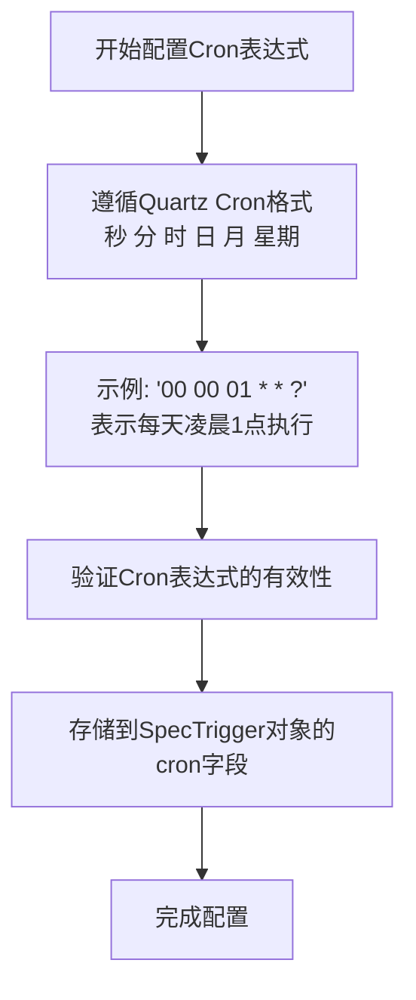

**Diagram sources**
- [SpecTrigger.schema.json](file://spec/src/main/resources/spec/schema/SpecTrigger.schema.json)
- [trigger.schema.json](file://schema/trigger.schema.json)

**本文档引用的文件**  
- [SpecTrigger.schema.json](file://spec/src/main/resources/spec/schema/SpecTrigger.schema.json)
- [trigger.schema.json](file://schema/trigger.schema.json)

### 时间窗口定义

时间窗口定义了周期性工作流的有效执行时间段，通过`startTime`和`endTime`两个字段来指定。工作流只在指定的时间窗口内按照Cron表达式进行调度执行，超出该时间窗口后将停止调度。

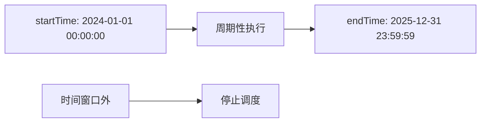

**Diagram sources**
- [SpecTrigger.schema.json](file://spec/src/main/resources/spec/schema/SpecTrigger.schema.json)
- [trigger.schema.json](file://schema/trigger.schema.json)

**本文档引用的文件**  
- [SpecTrigger.schema.json](file://spec/src/main/resources/spec/schema/SpecTrigger.schema.json)
- [trigger.schema.json](file://schema/trigger.schema.json)

### 执行计划生成

执行计划的生成是周期性工作流的核心过程，它将Cron表达式转换为具体的执行时间点序列。系统根据Cron表达式、时间窗口和时区信息，计算出所有满足条件的执行时间点，形成一个有序的执行计划。

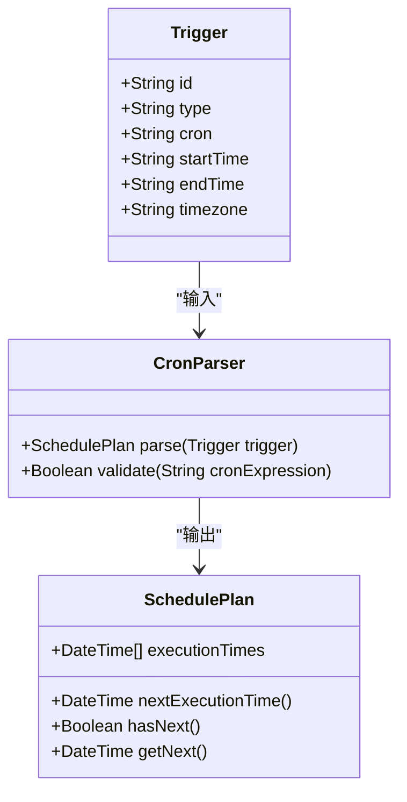

**Diagram sources**
- [SpecTrigger.schema.json](file://spec/src/main/resources/spec/schema/SpecTrigger.schema.json)
- [SpecScheduleStrategyParser.java](file://spec/src/main/java/com/aliyun/dataworks/common/spec/parser/impl/SpecScheduleStrategyParser.java)

**本文档引用的文件**  
- [SpecTrigger.schema.json](file://spec/src/main/resources/spec/schema/SpecTrigger.schema.json)
- [SpecScheduleStrategyParser.java](file://spec/src/main/java/com/aliyun/dataworks/common/spec/parser/impl/SpecScheduleStrategyParser.java)

## 实例化过程

### 依赖解析

在工作流实例化过程中，系统需要解析节点之间的依赖关系，确保任务按照正确的顺序执行。依赖关系分为同周期依赖和跨周期依赖两种类型，系统根据依赖类型构建执行依赖图。

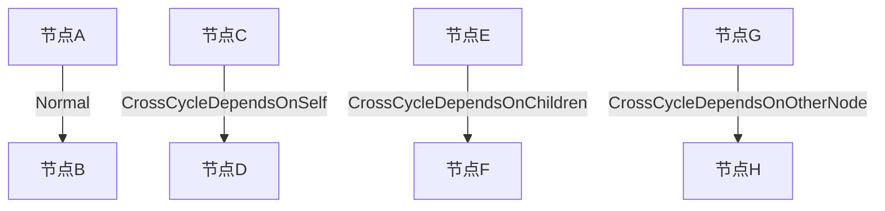

**Diagram sources**
- [cycle-workflow.md](file://docs/spec-templates/workflows/cycle-workflow.md)

**本文档引用的文件**  
- [cycle-workflow.md](file://docs/spec-templates/workflows/cycle-workflow.md)

### 参数替换

参数替换是实例化过程中的关键步骤，它将模板中的变量引用替换为实际的运行时值。系统支持多种类型的变量，包括系统变量（如${yyyymmdd}）和常量变量，通过参数替换实现任务的动态配置。

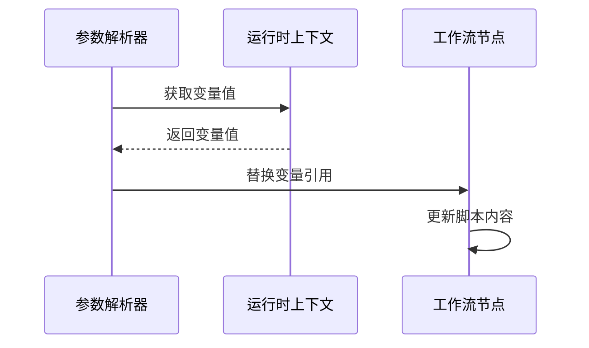

**Diagram sources**
- [DateParser.java](file://client/migrationx/migrationx-transformer/src/main/java/com/aliyun/dataworks/migrationx/transformer/core/common/DateParser.java)

**本文档引用的文件**  
- [DateParser.java](file://client/migrationx/migrationx-transformer/src/main/java/com/aliyun/dataworks/migrationx/transformer/core/common/DateParser.java)

### 资源分配

资源分配确保每个工作流节点在执行时能够获得所需的计算资源。通过`runtimeResource`字段指定资源组，实现资源的隔离和优化利用，避免资源争用导致的性能问题。

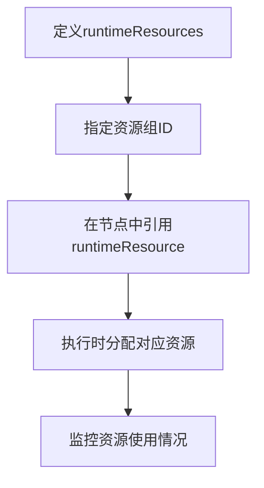

**Diagram sources**
- [CycleWorkflow.schedule.schema.json](file://dwcli/dwcli/schemas/CycleWorkflow.schedule.schema.json)

**本文档引用的文件**  
- [CycleWorkflow.schedule.schema.json](file://dwcli/dwcli/schemas/CycleWorkflow.schedule.schema.json)

## 补数据功能

### 历史数据回溯

补数据功能允许用户对历史数据进行重新处理，通过指定补数据的时间范围，系统会生成对应时间段内的执行实例，实现历史数据的回溯处理。

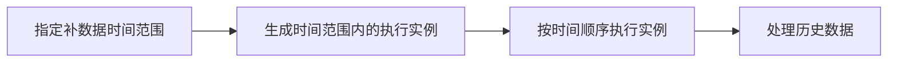

**本文档引用的文件**  
- [Constants.java](file://client/migrationx/migrationx-domain/migrationx-domain-dolphinscheduler/src/main/java/com/aliyun/dataworks/migrationx/domain/dataworks/dolphinscheduler/v1/v139/Constants.java)

### 并行执行控制

为了提高补数据的效率，系统支持并行执行控制，允许用户配置并行度，同时处理多个时间点的数据。系统通过任务队列和资源调度器协调并行任务的执行。

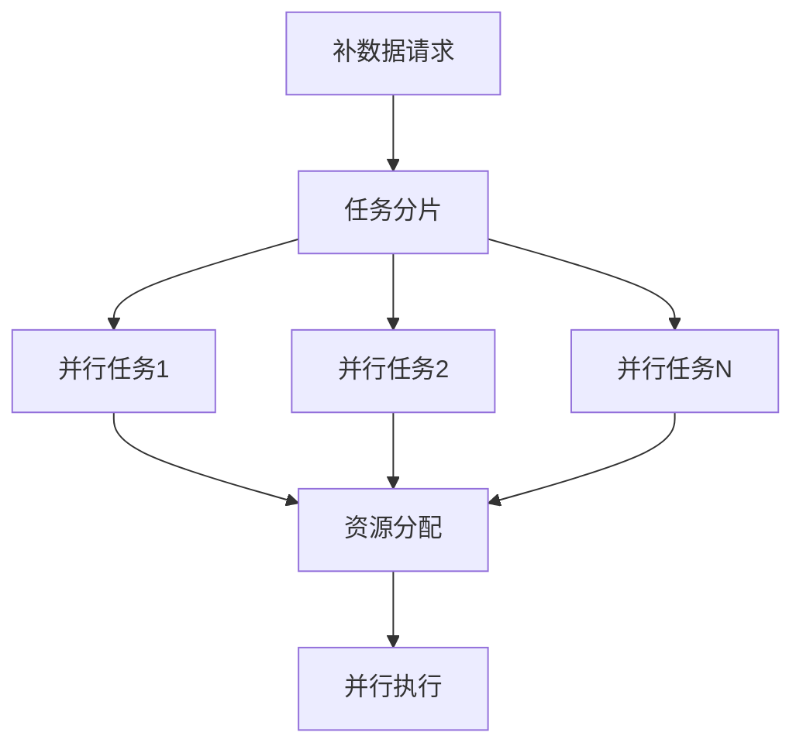

**本文档引用的文件**  
- [Constants.java](file://client/migrationx/migrationx-domain/migrationx-domain-dolphinscheduler/src/main/java/com/aliyun/dataworks/migrationx/domain/dataworks/dolphinscheduler/v1/v139/Constants.java)

### 冲突解决策略

在补数据过程中，可能会遇到与正常调度任务的冲突。系统提供了多种冲突解决策略，包括跳过、覆盖和排队等待，确保数据处理的一致性和完整性。

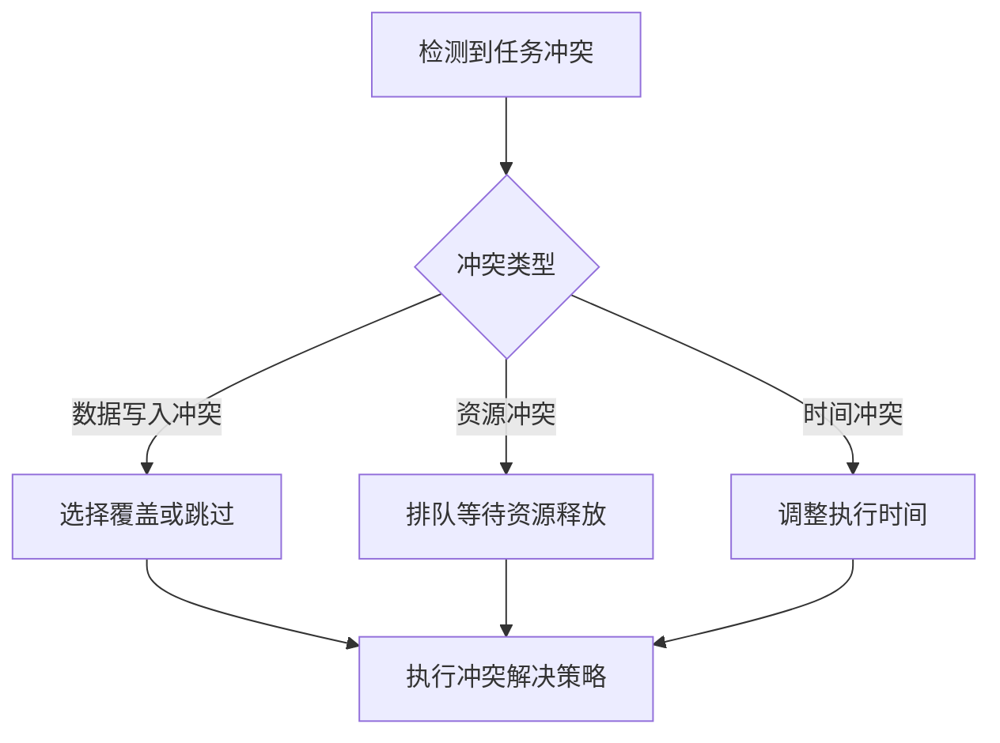

**本文档引用的文件**  
- [Constants.java](file://client/migrationx/migrationx-domain/migrationx-domain-dolphinscheduler/src/main/java/com/aliyun/dataworks/migrationx/domain/dataworks/dolphinscheduler/v1/v139/Constants.java)

## 监控指标

### 执行延迟

执行延迟是衡量工作流调度准时性的重要指标，它表示实际执行时间与计划执行时间之间的差异。系统通过监控执行延迟，帮助用户识别调度性能问题。

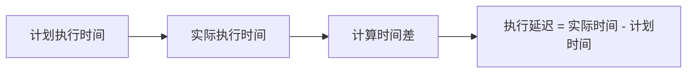

**本文档引用的文件**  
- [Metrics.java](file://client/migrationx/migrationx-common/src/main/java/com/aliyun/migrationx/common/metrics/Metrics.java)

### 成功率

成功率反映了工作流执行的稳定性，它是成功执行次数与总执行次数的比率。通过监控成功率，用户可以及时发现和解决任务失败的问题。

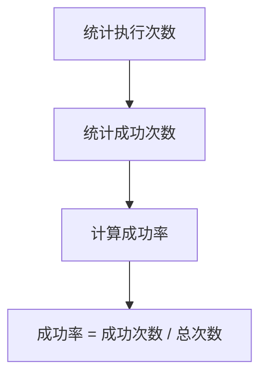

**Diagram sources**
- [MetricsCollector.java](file://client/migrationx/migrationx-common/src/main/java/com/aliyun/migrationx/common/metrics/MetricsCollector.java)

**本文档引用的文件**  
- [MetricsCollector.java](file://client/migrationx/migrationx-common/src/main/java/com/aliyun/migrationx/common/metrics/MetricsCollector.java)

### 资源消耗

资源消耗指标包括CPU使用率、内存占用和I/O吞吐量等，它们反映了工作流执行过程中的资源利用情况。通过监控资源消耗，可以优化资源配置，提高执行效率。

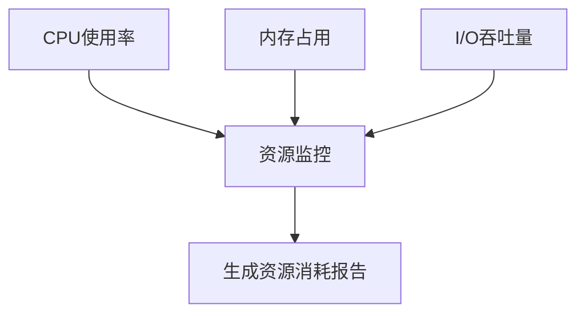

**Diagram sources**
- [DefaultMetricCollector.java](file://client/migrationx/migrationx-common/src/main/java/com/aliyun/migrationx/common/metrics/DefaultMetricCollector.java)

**本文档引用的文件**  
- [DefaultMetricCollector.java](file://client/migrationx/migrationx-common/src/main/java/com/aliyun/migrationx/common/metrics/DefaultMetricCollector.java)

## 配置示例

### 每日批处理

每日批处理是最常见的周期性任务类型，通常在夜间执行，处理前一天的累积数据。

```json
{
  "version": "1.1.0",
  "kind": "CycleWorkflow",
  "spec": {
    "triggers": [
      {
        "id": "daily_trigger",
        "type": "Scheduler",
        "cron": "00 00 01 * * ?",
        "startTime": "2024-01-01 00:00:00",
        "endTime": "2025-12-31 23:59:59",
        "timezone": "Asia/Shanghai"
      }
    ]
  }
}
```

**本文档引用的文件**  
- [cycle-workflow.md](file://docs/spec-templates/workflows/cycle-workflow.md)

### 小时级增量处理

小时级增量处理适用于需要近实时处理的场景，每小时处理一次新增数据。

```json
{
  "version": "1.1.0",
  "kind": "CycleWorkflow",
  "spec": {
    "triggers": [
      {
        "id": "hourly_trigger",
        "type": "Scheduler",
        "cron": "00 00 * * * ?",
        "timezone": "Asia/Shanghai"
      }
    ]
  }
}
```

**本文档引用的文件**  
- [cycle-workflow.md](file://docs/spec-templates/workflows/cycle-workflow.md)

### 分钟级实时处理

分钟级实时处理用于对实时性要求极高的场景，每几分钟处理一次最新数据。

```json
{
  "version": "1.1.0",
  "kind": "CycleWorkflow",
  "spec": {
    "triggers": [
      {
        "id": "minute_trigger",
        "type": "Scheduler",
        "cron": "00 */5 * * * ?",
        "timezone": "Asia/Shanghai"
      }
    ]
  }
}
```

**本文档引用的文件**  
- [cycle-workflow.md](file://docs/spec-templates/workflows/cycle-workflow.md)

## 外部系统集成

### 数据源检查

系统支持与多种外部数据源的集成，通过数据源检查确保数据连接的可用性和数据的完整性。

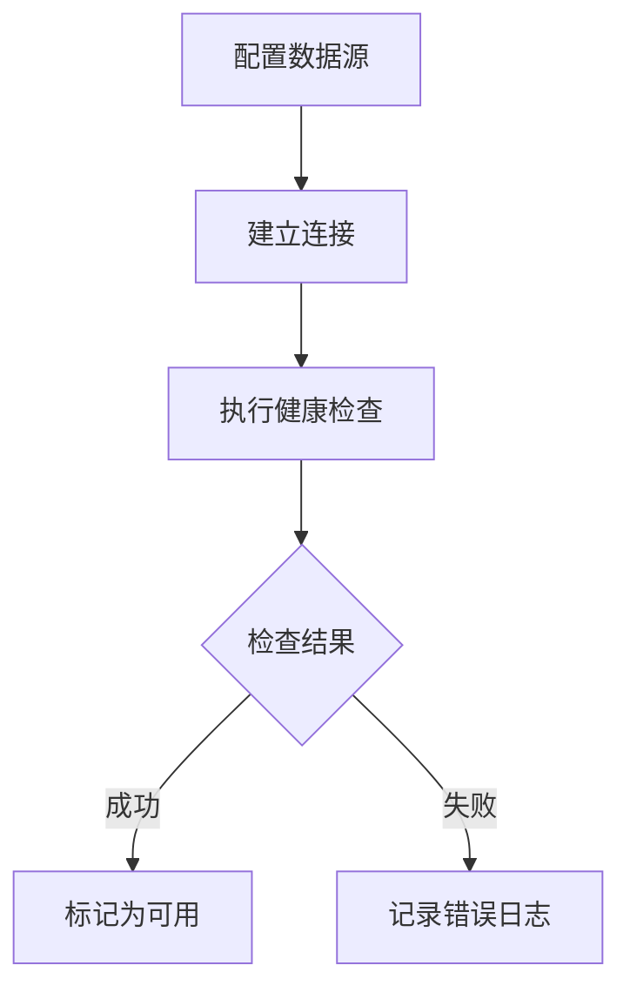

**本文档引用的文件**  
- [DiCodeUtils.java](file://client/migrationx/migrationx-transformer/src/main/java/com/aliyun/dataworks/migrationx/transformer/core/utils/DiCodeUtils.java)

### 消息通知

通过集成消息通知系统，可以在工作流执行的关键时刻发送通知，如执行开始、执行完成或执行失败。

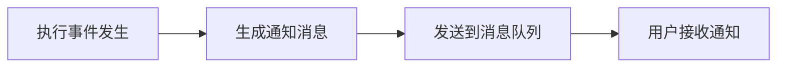

**本文档引用的文件**  
- [MetricsCollector.java](file://client/migrationx/migrationx-common/src/main/java/com/aliyun/migrationx/common/metrics/MetricsCollector.java)

### 监控告警

监控告警系统能够实时监控工作流的执行状态，当出现异常情况时自动触发告警，帮助运维人员及时响应。

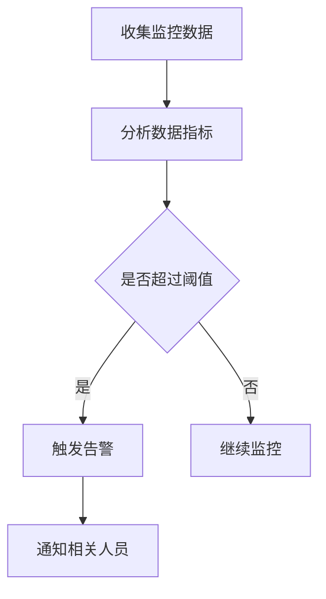

**Diagram sources**
- [Metrics.java](file://client/migrationx/migrationx-common/src/main/java/com/aliyun/migrationx/common/metrics/Metrics.java)

**本文档引用的文件**  
- [Metrics.java](file://client/migrationx/migrationx-common/src/main/java/com/aliyun/migrationx/common/metrics/Metrics.java)

## 结论

dataworks-spec项目的周期性执行功能提供了一套完整的工作流调度和管理解决方案。通过Cron表达式配置、时间窗口定义和执行计划生成，实现了灵活的周期性任务调度。在实例化过程中，系统通过依赖解析、参数替换和资源分配确保任务的正确执行。补数据功能支持历史数据回溯、并行执行控制和冲突解决，满足了数据修复和重处理的需求。丰富的监控指标帮助用户全面了解工作流的执行状态，而与外部系统的集成则增强了系统的实用性和可扩展性。这些功能共同构成了一个强大、可靠的数据工作流管理平台。