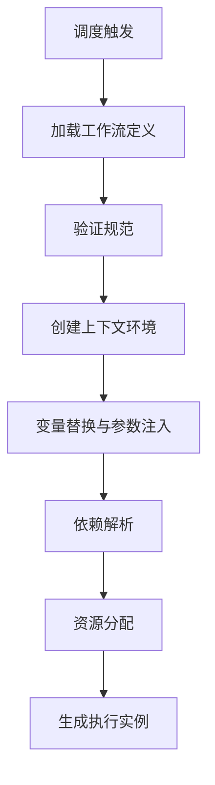
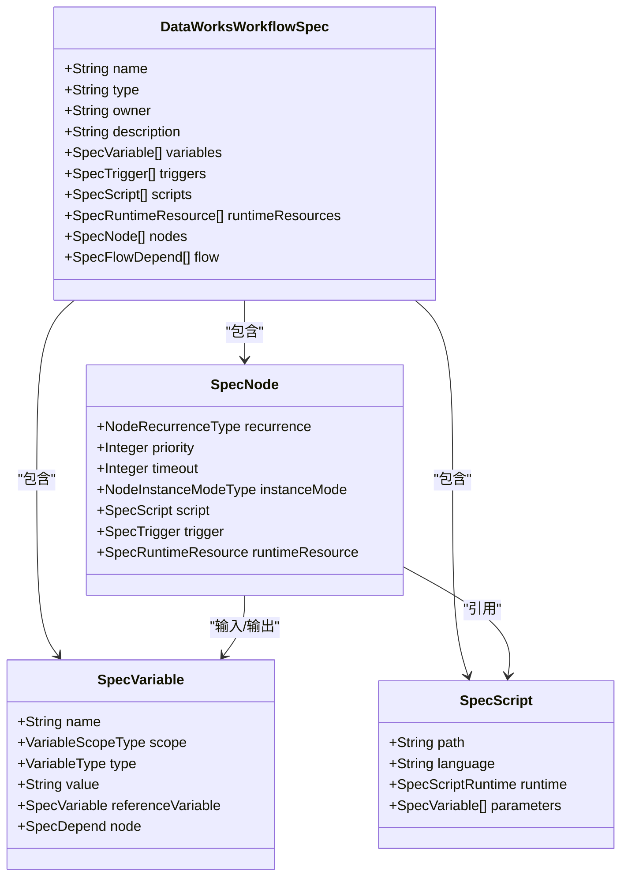
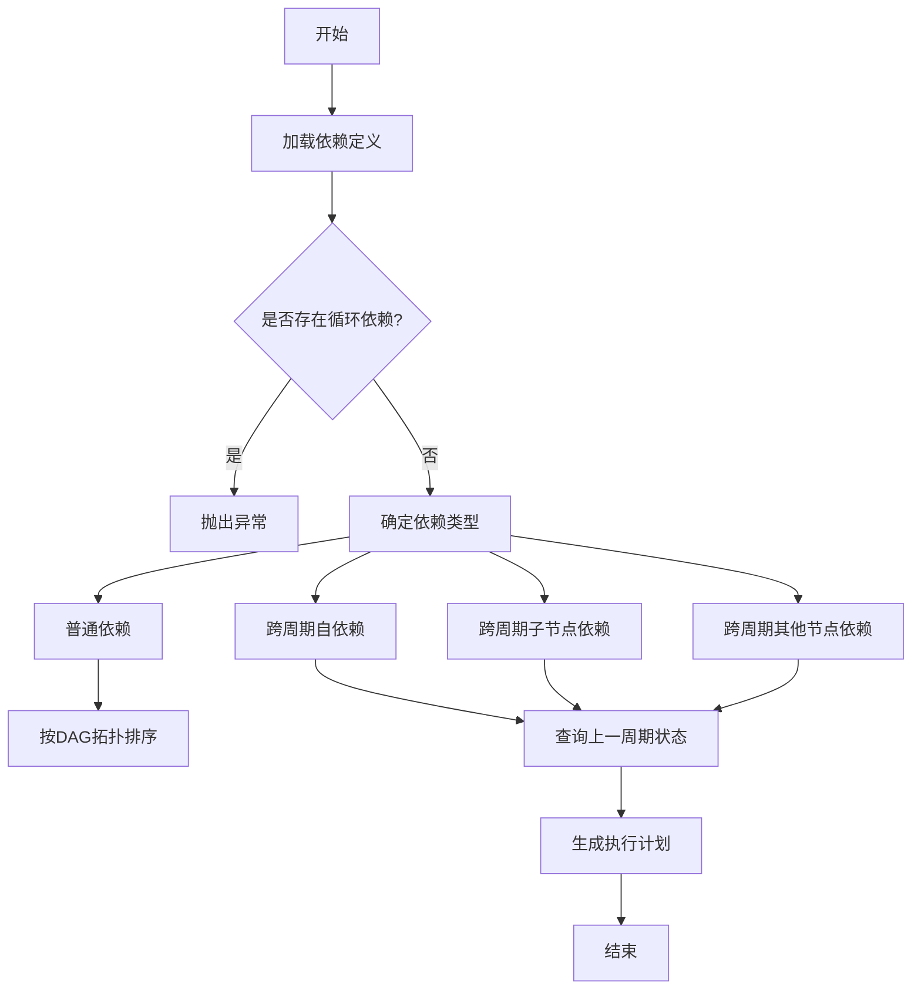
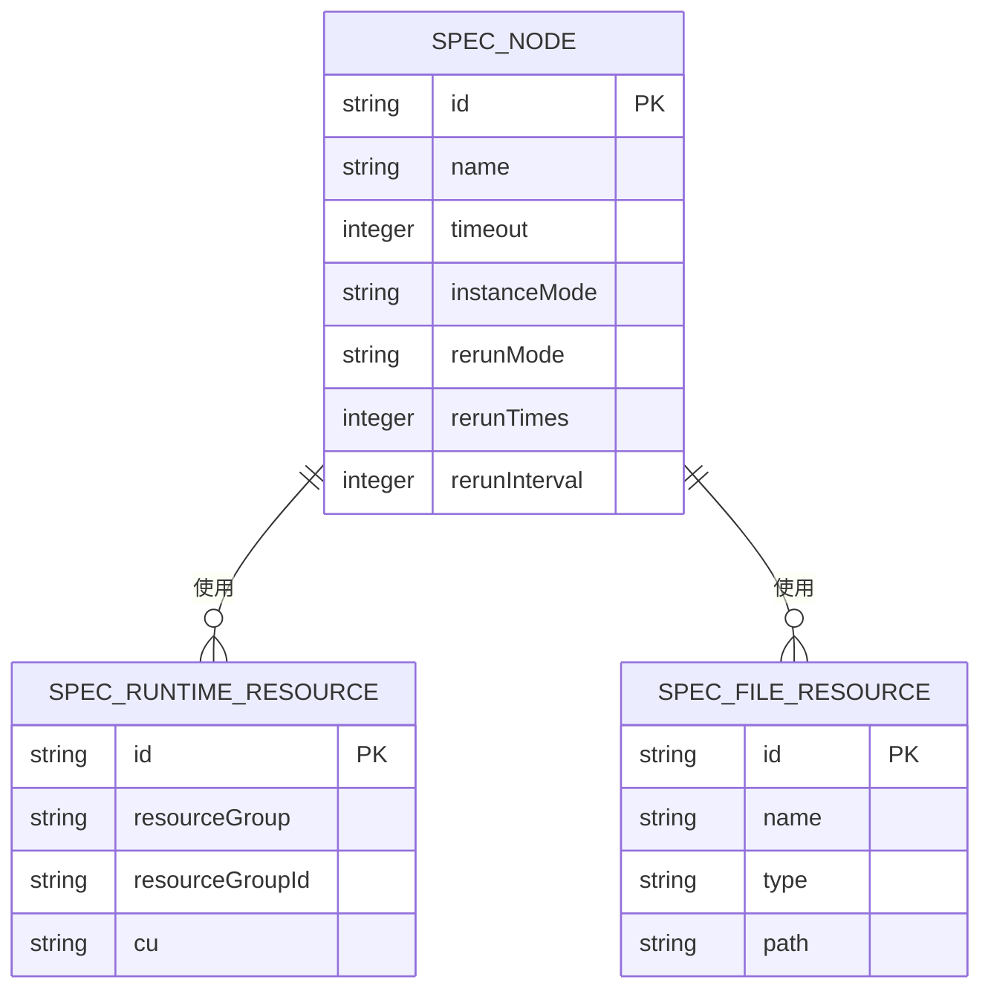
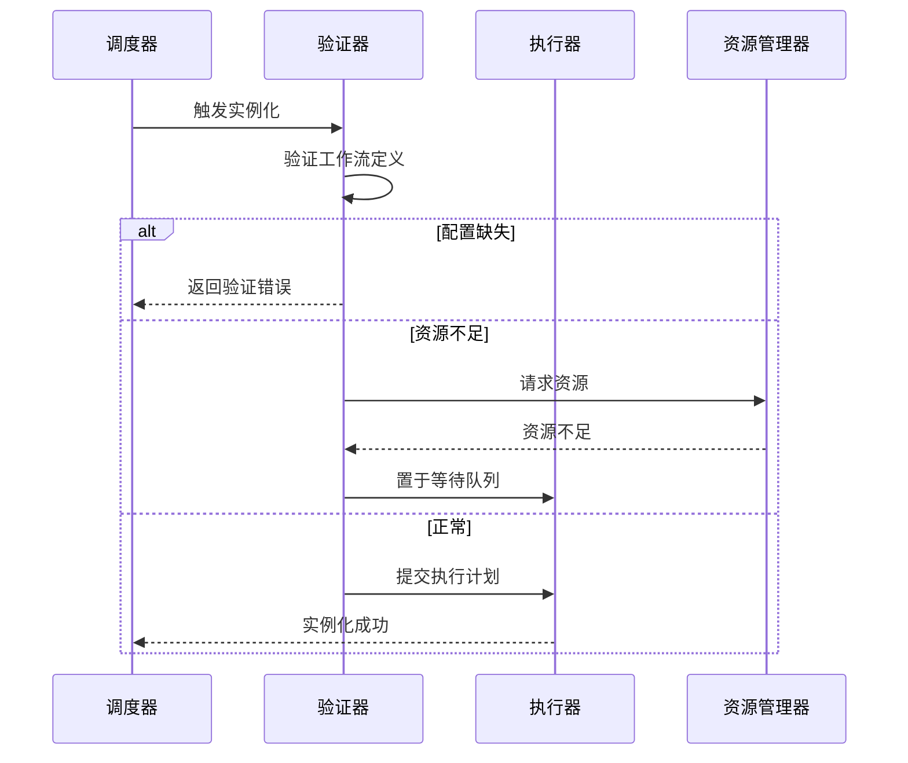
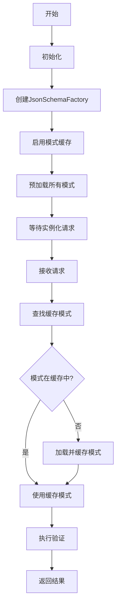

# 实例化机制

<cite>
**本文档引用的文件**  
- [DataWorksWorkflowSpec.java](file://spec/src/main/java/com/aliyun/dataworks/common/spec/domain/DataWorksWorkflowSpec.java)
- [SpecVariable.java](file://spec/src/main/java/com/aliyun/dataworks/common/spec/domain/ref/SpecVariable.java)
- [SpecNode.java](file://spec/src/main/java/com/aliyun/dataworks/common/spec/domain/ref/SpecNode.java)
- [SpecDepend.java](file://spec/src/main/java/com/aliyun/dataworks/common/spec/domain/noref/SpecDepend.java)
- [DependencyType.java](file://spec/src/main/java/com/aliyun/dataworks/common/spec/domain/enums/DependencyType.java)
- [VariableUtils.java](file://spec/src/main/java/com/aliyun/dataworks/common/spec/utils/VariableUtils.java)
- [SpecValidateUtil.java](file://spec/src/main/java/com/aliyun/dataworks/common/spec/utils/SpecValidateUtil.java)
- [SpecRuntimeResource.schema.json](file://spec/src/main/resources/spec/schema/SpecRuntimeResource.schema.json)
- [cycle-workflow.md](file://docs/spec-templates/workflows/cycle-workflow.md)
</cite>

## 目录
1. [引言](#引言)
2. [周期性工作流实例化过程](#周期性工作流实例化过程)
3. [上下文环境创建与变量替换](#上下文环境创建与变量替换)
4. [依赖解析算法](#依赖解析算法)
5. [资源分配策略](#资源分配策略)
6. [错误处理机制](#错误处理机制)
7. [性能优化措施](#性能优化措施)
8. [实例化日志解读指南](#实例化日志解读指南)
9. [结论](#结论)

## 引言

dataworks-spec项目提供了一套标准化的工作流定义规范，用于描述数据处理任务的调度、依赖和执行逻辑。本文档详细说明周期性工作流在调度触发后的实例化机制，包括上下文环境创建、变量替换、参数注入、依赖解析、资源分配、错误处理和性能优化等关键环节。通过深入分析核心组件和实现逻辑，帮助用户理解系统如何将工作流定义转换为可执行的实例。

## 周期性工作流实例化过程

周期性工作流（CycleWorkflow）的实例化始于调度触发器的激活。当cron表达式匹配当前时间时，系统开始实例化过程。首先，系统加载工作流定义，验证其符合`flow.schema.json`规范。然后，创建上下文环境，解析并替换所有变量，为每个节点注入必要的参数。接下来，系统根据DAG拓扑结构解析节点间的依赖关系，确定执行顺序。在资源分配阶段，系统预估并分配计算、存储和网络资源。最后，生成可执行的实例，准备提交给执行引擎。

**图示来源**
- [DataWorksWorkflowSpec.java](file://spec/src/main/java/com/aliyun/dataworks/common/spec/domain/DataWorksWorkflowSpec.java)
- [cycle-workflow.md](file://docs/spec-templates/workflows/cycle-workflow.md)

## 上下文环境创建与变量替换

### 上下文环境创建

上下文环境是实例化过程的基础，它包含了工作流执行所需的所有信息。系统通过`DataWorksWorkflowSpec`类的实例来表示工作流定义，该类包含了名称、类型、所有者、描述、变量、触发器、脚本、资源、节点和依赖关系等属性。在实例化开始时，系统创建一个空的上下文环境，然后逐步填充从工作流定义中解析出的信息。

### 变量替换与参数注入

变量替换是将工作流定义中的占位符替换为实际值的过程。系统支持多种变量类型，包括系统变量（如`${yyyymmdd}`）和常量。变量替换通过`VariableUtils`类实现，该类提供了`getVariables`方法来解析参数值。对于非键值对格式的参数值，系统使用正则表达式`NO_KV_PAIR_PARA_VALUE`进行识别，并创建相应的`SpecVariable`对象。

参数注入是将解析后的变量值注入到具体节点的执行上下文中的过程。系统通过`SpecNode`类的`script.parameters`字段来定义节点的参数。在实例化过程中，系统遍历所有节点，将上下文环境中的变量值替换到脚本参数中。对于引用其他节点输出的变量，系统通过`referenceVariable`字段建立引用关系，并在执行时解析实际值。

**图示来源**
- [DataWorksWorkflowSpec.java](file://spec/src/main/java/com/aliyun/dataworks/common/spec/domain/DataWorksWorkflowSpec.java)
- [SpecVariable.java](file://spec/src/main/java/com/aliyun/dataworks/common/spec/domain/ref/SpecVariable.java)
- [SpecNode.java](file://spec/src/main/java/com/aliyun/dataworks/common/spec/domain/ref/SpecNode.java)

## 依赖解析算法

### 依赖类型

系统支持多种依赖类型，定义在`DependencyType`枚举中：
- **NORMAL**: 普通依赖，依赖同一调度周期的节点
- **CROSS_CYCLE_SELF**: 跨周期自依赖，依赖上一周期的自己
- **CROSS_CYCLE_CHILDREN**: 跨周期子节点依赖，依赖上一周期自己的所有子节点
- **CROSS_CYCLE_OTHER_NODE**: 跨周期其他节点依赖，依赖上一周期的指定节点

### 依赖解析过程

依赖解析算法基于DAG（有向无环图）拓扑结构，确保节点按正确的顺序执行。系统通过`SpecFlowDepend`类来定义节点间的依赖关系，每个`SpecFlowDepend`对象包含一个`nodeId`和一个`depends`列表。`depends`列表中的每个`SpecDepend`对象表示一个具体的依赖，包含依赖类型和上游节点的输出。

在解析过程中，系统首先检查是否存在循环依赖，这是不允许的。然后，根据依赖类型确定节点的执行顺序。对于跨周期依赖，系统需要查询上一周期的执行状态，确保依赖条件满足。系统通过`DataWorksNodeAdapter`类的`getDependentType`方法来获取节点的依赖类型，并进行相应的验证。

**图示来源**
- [DependencyType.java](file://spec/src/main/java/com/aliyun/dataworks/common/spec/domain/enums/DependencyType.java)
- [SpecDepend.java](file://spec/src/main/java/com/aliyun/dataworks/common/spec/domain/noref/SpecDepend.java)
- [DataWorksNodeAdapter.java](file://spec/src/main/java/com/aliyun/dataworks/common/spec/domain/dw/nodemodel/DataWorksNodeAdapter.java)

## 资源分配策略

### 资源类型

系统支持多种资源类型，包括计算资源、存储资源和网络资源。计算资源通过`SpecRuntimeResource`类定义，包含资源组名称和ID。存储资源通过`SpecFileResource`类定义，包含文件路径和存储配置。网络资源通常由执行环境自动分配。

### 资源预估与分配

在实例化过程中，系统需要预估每个节点所需的资源，并进行分配。对于计算资源，系统根据节点的类型和预期负载预估所需的CU（计算单元）。对于存储资源，系统根据输入输出数据的大小预估所需的存储空间。资源分配通过`SpecNode`类的`runtimeResource`字段来指定，该字段引用一个`SpecRuntimeResource`对象。

系统通过`SpecValidateUtil`类的`validate`方法来验证资源配置的完整性。如果`runtimeResource`为空或`resourceGroupId`未配置，系统将抛出异常。这确保了每个节点在执行前都有明确的资源分配。

**图示来源**
- [SpecRuntimeResource.schema.json](file://spec/src/main/resources/spec/schema/SpecRuntimeResource.schema.json)
- [SpecFileResource.java](file://spec/src/main/java/com/aliyun/dataworks/common/spec/domain/ref/SpecFileResource.java)
- [SpecNode.java](file://spec/src/main/java/com/aliyun/dataworks/common/spec/domain/ref/SpecNode.java)

## 错误处理机制

### 配置缺失处理

当工作流定义中缺少必要配置时，系统会抛出相应的异常。例如，如果节点的`script`为空，系统会抛出`IllegalArgumentException`。如果`runtimeResource`为空或`resourceGroupId`未配置，系统会抛出`SpecException`。这些验证通过`SpecValidateUtil`类的`validate`方法实现，确保工作流定义的完整性和正确性。

### 资源不足处理

当系统检测到资源不足时，会将节点置于等待状态，直到资源可用。如果资源长时间不可用，系统会根据重跑策略决定是否重试。重跑策略由`rerunMode`字段定义，可以是"Allowed"（允许）、"Denied"（拒绝）或"FailureAllowed"（失败时允许）。重试次数由`rerunTimes`字段定义，重试间隔由`rerunInterval`字段定义。

### 其他错误处理

系统还处理其他类型的错误，如循环依赖、无效的跨周期依赖等。例如，当一个节点同时配置了`CROSS_CYCLE_CHILDREN`和`CROSS_CYCLE_OTHER_NODE`依赖时，系统会记录错误日志并抛出运行时异常。这些错误处理机制确保了工作流的稳定性和可靠性。

**图示来源**
- [SpecValidateUtil.java](file://spec/src/main/java/com/aliyun/dataworks/common/spec/utils/SpecValidateUtil.java)
- [SpecNode.java](file://spec/src/main/java/com/aliyun/dataworks/common/spec/domain/ref/SpecNode.java)

## 性能优化措施

### 缓存机制

系统使用缓存机制来提高实例化性能。`SpecValidateUtil`类在初始化时创建一个`JsonSchemaFactory`实例，并启用模式缓存。这避免了每次验证时都重新解析JSON模式，显著提高了验证速度。缓存通过`builder.enableSchemaCache(true)`配置，确保模式只加载一次并重复使用。

### 并行处理

在实例化过程中，系统尽可能采用并行处理来提高效率。例如，当解析多个节点的依赖关系时，系统可以并行处理每个节点的依赖解析。同样，当验证多个工作流定义时，系统可以并行执行验证任务。这种并行处理策略充分利用了多核处理器的能力，缩短了实例化时间。

### 预加载技术

系统使用预加载技术来减少实例化延迟。在系统启动时，预编译所有模式文件到内存映射中，并以`kind`为键进行索引。这使得在实例化时可以快速查找和加载相应的模式，而无需从磁盘读取和解析。预加载技术特别适用于频繁实例化的场景，可以显著提高响应速度。

**图示来源**
- [SpecValidateUtil.java](file://spec/src/main/java/com/aliyun/dataworks/common/spec/utils/SpecValidateUtil.java)

## 实例化日志解读指南

### 日志级别

系统使用不同的日志级别来记录实例化过程中的信息：
- **INFO**: 记录正常流程的关键步骤，如"node flow depends source nodeId"
- **ERROR**: 记录严重错误，如"invalid cross cycle depend"
- **WARN**: 记录潜在问题，如资源不足警告

### 关键日志信息

在实例化过程中，系统会生成以下关键日志信息：
- **依赖解析日志**: 记录节点的依赖关系解析过程，帮助诊断依赖配置问题
- **资源分配日志**: 记录资源请求和分配情况，帮助诊断资源瓶颈
- **变量替换日志**: 记录变量替换过程，帮助验证参数注入是否正确
- **错误堆栈日志**: 记录异常的完整堆栈信息，帮助定位问题根源

### 日志分析示例

当出现"invalid cross cycle depend"错误时，应检查节点的依赖配置，确保没有同时配置`CROSS_CYCLE_CHILDREN`和`CROSS_CYCLE_OTHER_NODE`依赖。日志中会包含具体的依赖定义，可以据此进行修正。对于资源不足的情况，应检查`runtimeResource`配置，确保资源组ID正确，并有足够的资源可用。

## 结论

dataworks-spec项目的实例化机制是一个复杂而精密的系统，涵盖了从调度触发到执行实例生成的全过程。通过详细的上下文环境创建、变量替换、依赖解析、资源分配和错误处理，系统确保了工作流的可靠执行。性能优化措施如缓存、并行处理和预加载进一步提高了系统的效率。理解这些机制有助于用户更好地设计和调试工作流，提高数据处理的稳定性和效率。