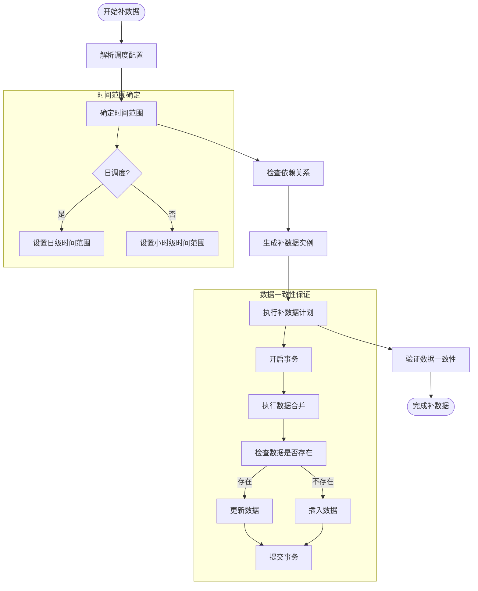
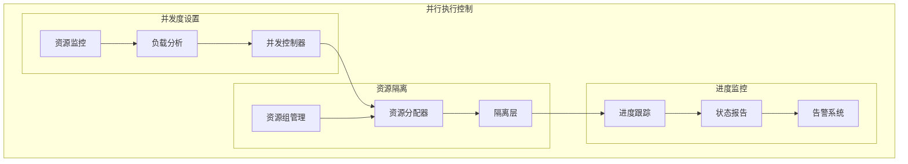
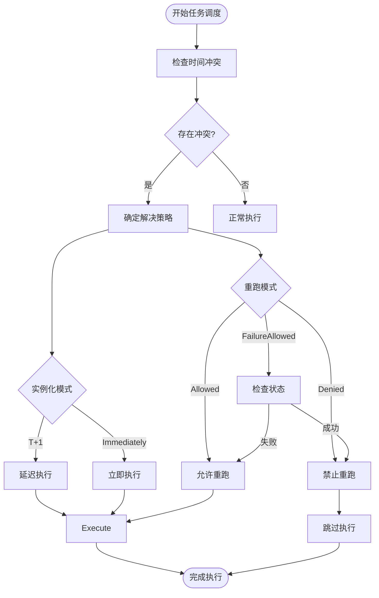
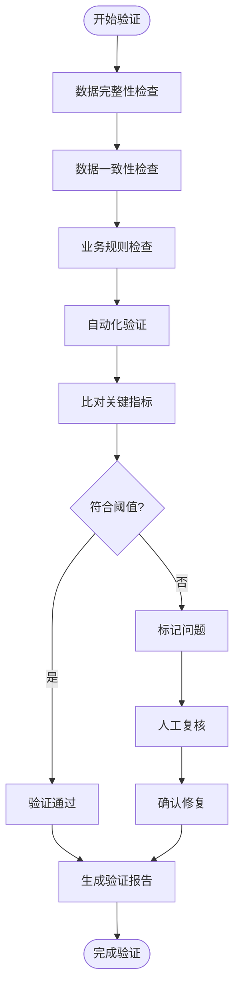

# 补数据功能

<cite>
**本文档引用的文件**
- [MergeSqlUtil.java](file://client/migrationx/migrationx-domain/migrationx-domain-datago/src/main/java/com/aliyun/dataworks/migrationx/domain/dataworks/datago/MergeSqlUtil.java)
- [OldDataX2DI.java](file://client/migrationx/migrationx-domain/migrationx-domain-datago/src/main/java/com/aliyun/dataworks/migrationx/domain/dataworks/datago/model/OldDataX2DI.java)
- [DataImportMethodEnum.java](file://client/migrationx/migrationx-domain/migrationx-domain-datago/src/main/java/com/aliyun/dataworks/migrationx/domain/dataworks/datago/enums/DataImportMethodEnum.java)
- [DataSyncTypeEnum.java](file://client/migrationx/migrationx-domain/migrationx-domain-datago/src/main/java/com/aliyun/dataworks/migrationx/domain/dataworks/datago/enums/DataSyncTypeEnum.java)
- [NodeInstanceModeType.java](file://spec/src/main/java/com/aliyun/dataworks/common/spec/domain/enums/NodeInstanceModeType.java)
- [NodeRerunModeType.java](file://spec/src/main/java/com/aliyun/dataworks/common/spec/domain/enums/NodeRerunModeType.java)
- [node.schema.json](file://schema/node.schema.json)
- [2.json](file://schema/testcase/2.json)
</cite>

## 目录
1. [补数据功能实现原理](#补数据功能实现原理)
2. [历史数据回溯机制](#历史数据回溯机制)
3. [并行执行控制策略](#并行执行控制策略)
4. [冲突解决机制](#冲突解决机制)
5. [数据质量检查和结果验证](#数据质量检查和结果验证)
6. [补数据操作最佳实践](#补数据操作最佳实践)

## 补数据功能实现原理

补数据功能的实现主要涉及时间范围选择、实例生成和执行计划制定三个核心环节。系统通过解析调度配置中的时间参数来确定补数据的时间窗口，根据工作流定义生成相应的实例，并制定详细的执行计划。

在时间范围选择方面，系统支持基于业务日期（bizDate）和执行日期（today）的灵活配置。对于日调度任务，使用`datagoTemplate/merge_template_daily.sql.vm`模板，业务日期通过`DateParser.parsePartition`方法解析；对于小时调度任务，则使用`datagoTemplate/merge_template_hour.sql.vm`模板，支持小时级别的精确控制。

实例生成过程中，系统会根据原始节点的配置创建新的补数据实例。对于增量同步场景，会生成两个节点：一个DI节点用于数据抽取，一个ODPS_SQL节点用于数据合并。这种设计确保了数据处理的完整性和可追溯性。

执行计划制定基于工作流的依赖关系图，通过拓扑排序确定节点的执行顺序。系统会考虑节点间的依赖关系、资源约束和优先级设置，生成最优的执行序列。

**补数据功能实现原理**
- [MergeSqlUtil.java](file://client/migrationx/migrationx-domain/migrationx-domain-datago/src/main/java/com/aliyun/dataworks/migrationx/domain/dataworks/datago/MergeSqlUtil.java#L35-L68)
- [OldDataX2DI.java](file://client/migrationx/migrationx-domain/migrationx-domain-datago/src/main/java/com/aliyun/dataworks/migrationx/domain/dataworks/datago/model/OldDataX2DI.java#L176-L217)
- [node.schema.json](file://schema/node.schema.json)

## 历史数据回溯机制

历史数据回溯机制是补数据功能的核心组成部分，主要解决时间窗口内的依赖关系和数据一致性问题。系统通过精确的时间戳控制和增量合并策略确保数据的完整性和准确性。

对于日调度任务，系统使用`datagoTemplate/where_template_daily.sql.vm`模板生成WHERE条件，将业务日期替换为前一天的值（`bizYesterday`），实现向前追溯一天的数据。例如，当处理2023-01-01的业务数据时，会同时考虑2022-12-31的历史数据，确保数据的连续性。

对于小时调度任务，系统采用`datagoTemplate/where_template_hour.sql.vm`模板，通过`@@[HH -1h]`和`@@[HH -2h]`等占位符实现小时级别的精确控制。这种设计允许系统在处理当前小时数据时，自动关联前一小时和前两小时的数据，确保时间窗口内的数据完整性。

数据一致性通过事务性操作和幂等性设计来保证。系统在执行数据合并操作时，会先检查目标表中是否已存在相同业务日期的数据，如果存在则进行覆盖更新，避免数据重复。同时，所有操作都记录详细的日志信息，便于后续的审计和问题排查。

**图示来源**
- [MergeSqlUtil.java](file://client/migrationx/migrationx-domain/migrationx-domain-datago/src/main/java/com/aliyun/dataworks/migrationx/domain/dataworks/datago/MergeSqlUtil.java#L71-L88)
- [OldDataX2DI.java](file://client/migrationx/migrationx-domain/migrationx-domain-datago/src/main/java/com/aliyun/dataworks/migrationx/domain/dataworks/datago/model/OldDataX2DI.java#L187-L204)

**补数据功能实现原理**
- [MergeSqlUtil.java](file://client/migrationx/migrationx-domain/migrationx-domain-datago/src/main/java/com/aliyun/dataworks/migrationx/domain/dataworks/datago/MergeSqlUtil.java#L71-L88)
- [OldDataX2DI.java](file://client/migrationx/migrationx-domain/migrationx-domain-datago/src/main/java/com/aliyun/dataworks/migrationx/domain/dataworks/datago/model/OldDataX2DI.java#L187-L204)
- [DataImportMethodEnum.java](file://client/migrationx/migrationx-domain/migrationx-domain-datago/src/main/java/com/aliyun/dataworks/migrationx/domain/dataworks/datago/enums/DataImportMethodEnum.java)

## 并行执行控制策略

并行执行控制策略是确保补数据效率和系统稳定性的关键。系统通过并发度设置、资源隔离和进度监控三个维度实现精细化的执行控制。

并发度设置基于系统资源和任务优先级动态调整。系统会根据可用计算资源和当前负载情况，智能分配并发执行的线程数。对于高优先级任务，系统会分配更多的并发资源，确保关键任务的及时完成。

资源隔离通过资源组（resourceGroup）和资源组ID（resourceGroupId）实现。每个补数据任务都会分配到特定的资源组，确保不同任务之间的资源互不干扰。这种设计有效防止了资源争用导致的性能下降和任务失败。

进度监控提供实时的任务执行状态跟踪。系统会记录每个任务的开始时间、结束时间和执行状态，并通过可视化界面展示整体进度。当发现任务执行异常或超时时，系统会自动触发告警并尝试恢复。

**图示来源**
- [node.schema.json](file://schema/node.schema.json)
- [2.json](file://schema/testcase/2.json)

**补数据功能实现原理**
- [node.schema.json](file://schema/node.schema.json)
- [2.json](file://schema/testcase/2.json)
- [SpecRuntimeResource.java](file://spec/src/main/java/com/aliyun/dataworks/common/spec/domain/ref/SpecRuntimeResource.java)

## 冲突解决机制

冲突解决机制处理补数据实例与正常调度实例发生时间重叠的情况，确保数据处理的正确性和系统的稳定性。系统通过实例化模式（instanceMode）和重跑模式（rerunMode）的组合策略来解决潜在的冲突。

实例化模式支持"T+1"和"Immediately"两种模式。T+1模式下，节点配置的修改将在第二天生效，这种延迟生效机制有效避免了配置变更对当前运行实例的影响。立即生效模式则适用于需要即时生效的紧急变更。

重跑模式提供三种策略：允许重跑（Allowed）、禁止重跑（Denied）和仅失败时允许重跑（FailureAllowed）。当补数据实例与正常调度实例发生时间重叠时，系统会根据预设的重跑策略决定如何处理冲突。例如，如果正常调度实例已成功运行，而补数据实例尝试重跑，则根据重跑模式决定是否允许该操作。

系统还实现了智能冲突检测和自动解决机制。在任务调度前，会检查时间窗口内是否存在冲突的实例，如果发现潜在冲突，会根据预设策略自动调整执行计划或提示用户干预。

**图示来源**
- [NodeInstanceModeType.java](file://spec/src/main/java/com/aliyun/dataworks/common/spec/domain/enums/NodeInstanceModeType.java)
- [NodeRerunModeType.java](file://spec/src/main/java/com/aliyun/dataworks/common/spec/domain/enums/NodeRerunModeType.java)
- [2.json](file://schema/testcase/2.json)

**补数据功能实现原理**
- [NodeInstanceModeType.java](file://spec/src/main/java/com/aliyun/dataworks/common/spec/domain/enums/NodeInstanceModeType.java)
- [NodeRerunModeType.java](file://spec/src/main/java/com/aliyun/dataworks/common/spec/domain/enums/NodeRerunModeType.java)
- [2.json](file://schema/testcase/2.json)

## 数据质量检查和结果验证

数据质量检查和结果验证是确保补数据结果准确可靠的关键环节。系统通过多层次的验证机制和自动化检查工具，全面保障数据的完整性和一致性。

在数据质量检查方面，系统实现了基于规则的自动化检查框架。检查规则包括数据完整性检查、数据一致性检查和业务规则检查。数据完整性检查确保所有预期的数据都已成功加载；数据一致性检查验证源数据和目标数据的一致性；业务规则检查确保数据符合预定义的业务逻辑。

结果验证采用双重验证机制。首先，系统会自动比对补数据前后的关键指标，如记录数、汇总值等，确保数据变化符合预期。其次，系统支持人工验证流程，允许用户通过可视化界面查看和确认数据结果。

系统还提供了详细的验证报告，包括验证通过的项目、发现的问题和建议的修复措施。报告以结构化格式输出，便于后续的审计和分析。

**图示来源**
- [DataSynchronizationQualityCheckCodeTest.java](file://spec/src/test/java/com/aliyun/dataworks/common/spec/domain/dw/codemodel/DataSynchronizationQualityCheckCodeTest.java)
- [DataQualityMonitorCodeTest.java](file://spec/src/test/java/com/aliyun/dataworks/common/spec/domain/dw/codemodel/DataQualityMonitorCodeTest.java)

**补数据功能实现原理**
- [DataSynchronizationQualityCheckCodeTest.java](file://spec/src/test/java/com/aliyun/dataworks/common/spec/domain/dw/codemodel/DataSynchronizationQualityCheckCodeTest.java)
- [DataQualityMonitorCodeTest.java](file://spec/src/test/java/com/aliyun/dataworks/common/spec/domain/dw/codemodel/DataQualityMonitorCodeTest.java)

## 补数据操作最佳实践

补数据操作的最佳实践包括小批量测试、监控指标观察和异常处理流程，这些实践有助于确保补数据操作的成功率和效率。

小批量测试是补数据操作的第一步。建议先选择一个小的时间窗口进行测试，验证整个流程的正确性。测试时应重点关注数据完整性、处理性能和资源消耗情况。只有在小批量测试成功后，才应进行大规模的补数据操作。

监控指标观察是确保补数据过程可控的关键。需要重点关注的指标包括：任务执行时间、数据处理速度、资源利用率和错误率。建立实时监控面板，设置合理的告警阈值，当指标异常时能够及时发现和处理。

异常处理流程应预先制定并经过验证。常见的异常包括数据源连接失败、数据格式错误、资源不足等。对于每种异常情况，都应有明确的处理步骤和回滚方案。建议建立异常处理知识库，记录历史问题和解决方案，提高问题处理效率。

定期进行补数据演练也是重要的最佳实践。通过模拟真实场景的补数据操作，验证系统的稳定性和团队的响应能力。演练后应进行复盘，总结经验教训，持续优化补数据流程。

**补数据功能实现原理**
- [MergeSqlUtil.java](file://client/migrationx/migrationx-domain/migrationx-domain-datago/src/main/java/com/aliyun/dataworks/migrationx/domain/dataworks/datago/MergeSqlUtil.java)
- [OldDataX2DI.java](file://client/migrationx/migrationx-domain/migrationx-domain-datago/src/main/java/com/aliyun/dataworks/migrationx/domain/dataworks/datago/model/OldDataX2DI.java)
- [node.schema.json](file://schema/node.schema.json)