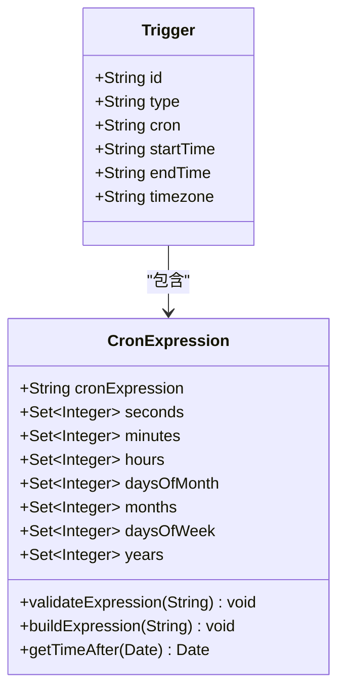
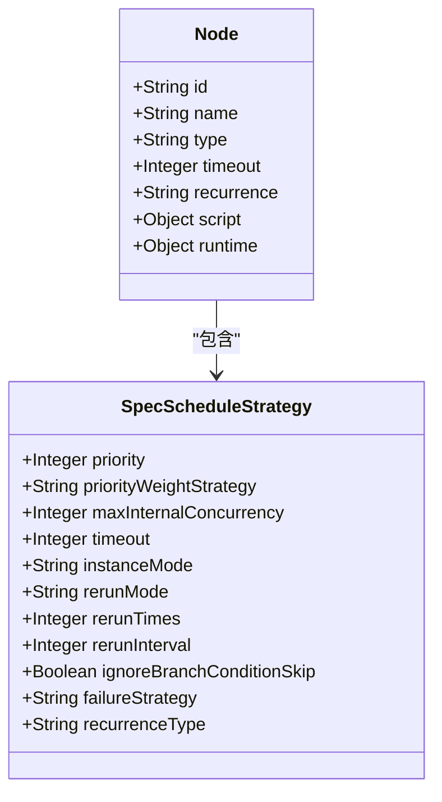
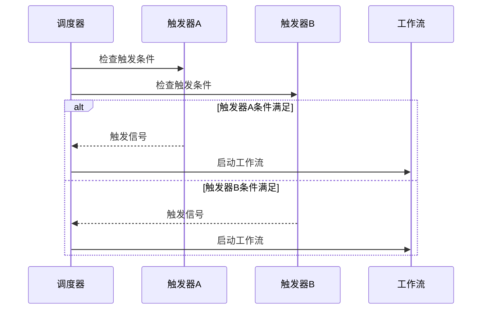
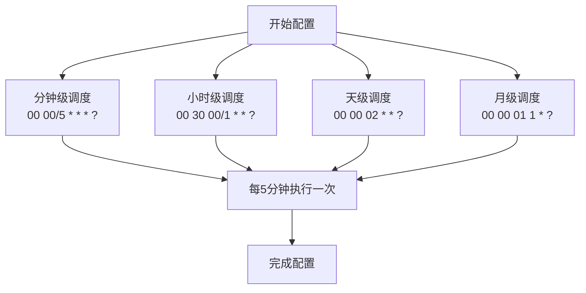
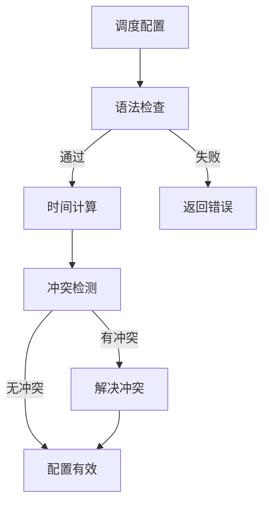
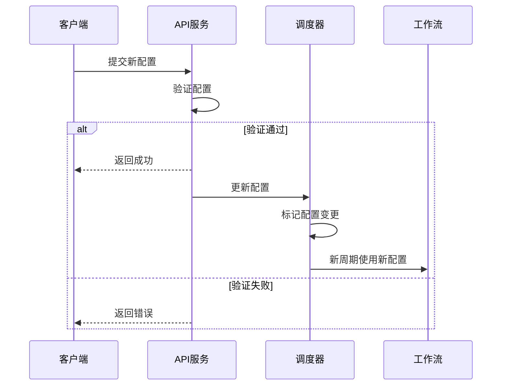

# 调度配置

<cite>
**本文档引用的文件**   
- [trigger.schema.json](file://schema/trigger.schema.json)
- [SpecScheduleStrategy.schema.json](file://spec/src/main/resources/spec/schema/SpecScheduleStrategy.schema.json)
- [CycleWorkflow.schedule.schema.json](file://dwcli/dwcli/schemas/CycleWorkflow.schedule.schema.json)
- [dag_converter.py](file://client/migrationx-transformer/src/main/python/airflow_dag_parser/converter/dag_converter.py)
- [CronExpression.java](file://client/migrationx/migrationx-domain/migrationx-domain-dataworks/src/main/java/com/aliyun/dataworks/migrationx/domain/dataworks/utils/quartz/CronExpression.java)
- [task_converter.py](file://client/migrationx-transformer/src/main/python/airflow_dag_parser/converter/task_converter.py)
- [spec-fields.md](file://docs/spec/spec-fields.md)
</cite>

## 目录
1. [简介](#简介)
2. [Cron表达式语法](#cron表达式语法)
3. [调度策略配置](#调度策略配置)
4. [触发器与工作流绑定](#触发器与工作流绑定)
5. [时间粒度配置示例](#时间粒度配置示例)
6. [调度配置验证机制](#调度配置验证机制)
7. [API动态配置修改](#api动态配置修改)

## 简介
dataworks-spec项目提供了一套完整的调度配置体系，用于定义和管理周期性工作流的执行计划。调度配置主要通过Cron表达式来定义执行时间，结合触发器、调度策略和工作流配置，实现灵活的任务调度。本文档详细说明了调度配置的各项规范和使用方法。

## Cron表达式语法

### 时间格式
Cron表达式由6个字段组成，分别表示秒、分钟、小时、日期、月份和星期，各字段之间用空格分隔。每个字段的取值范围和特殊字符如下表所示：

| 字段 | 允许值 | 允许的特殊字符 |
| :--- | :--- | :--- |
| 秒 | 0-59 | , - * / |
| 分钟 | 0-59 | , - * / |
| 小时 | 0-23 | , - * / |
| 日期 | 1-31 | , - * / ? L W |
| 月份 | 1-12 或 JAN-DEC | , - * / |
| 星期 | 1-7 或 SUN-SAT | , - * / ? L # |

### 时区处理
调度时间的时区通过`timezone`属性指定，采用标准的时区标识符（如"Asia/Shanghai"）。所有时间计算都基于指定的时区进行，确保在不同时区环境下的一致性。

### 特殊字符使用
- `*`：表示任意值，如小时字段的`*`表示每小时
- `?`：表示不指定值，通常用于日期和星期字段的互斥
- `-`：表示范围，如`10-12`表示从10到12
- `,`：表示枚举值，如`1,3,5`表示1、3、5
- `/`：表示增量，如`0/15`表示从0开始每15个单位
- `L`：表示最后，如日期字段的`L`表示当月最后一天
- `W`：表示工作日，如`15W`表示距离15号最近的工作日



**Diagram sources**
- [CronExpression.java](file://client/migrationx/migrationx-domain/migrationx-domain-dataworks/src/main/java/com/aliyun/dataworks/migrationx/domain/dataworks/utils/quartz/CronExpression.java#L22-L459)
- [trigger.schema.json](file://schema/trigger.schema.json#L1-L36)

**Section sources**
- [trigger.schema.json](file://schema/trigger.schema.json#L1-L36)
- [CronExpression.java](file://client/migrationx/migrationx-domain/migrationx-domain-dataworks/src/main/java/com/aliyun/dataworks/migrationx/domain/dataworks/utils/quartz/CronExpression.java#L22-L459)

## 调度策略配置

### 延迟容忍
调度策略中的`maxInternalConcurrency`属性定义了最大内部节点实例并发数，用于控制任务的并发执行。当任务执行延迟时，系统会根据此配置决定是否允许新的实例启动，避免资源过度消耗。

### 重试机制
重试机制通过以下属性配置：
- `rerunMode`：重跑模式，可选值包括"ALL_ALLOWED"（允许重跑）、"ALL_DENIED"（不允许重跑）、"FAILURE_ALLOWED"（失败时允许重跑）
- `rerunTimes`：重试次数
- `rerunInterval`：重试间隔（秒）

### 优先级设置
`priority`属性定义了任务的优先级，取值范围为1-8，数值越大优先级越高。高优先级的任务在资源竞争时会优先获得执行机会。



**Diagram sources**
- [SpecScheduleStrategy.schema.json](file://spec/src/main/resources/spec/schema/SpecScheduleStrategy.schema.json#L1-L48)
- [CycleWorkflow.schedule.schema.json](file://dwcli/dwcli/schemas/CycleWorkflow.schedule.schema.json#L1-L136)

**Section sources**
- [SpecScheduleStrategy.schema.json](file://spec/src/main/resources/spec/schema/SpecScheduleStrategy.schema.json#L1-L48)
- [CycleWorkflow.schedule.schema.json](file://dwcli/dwcli/schemas/CycleWorkflow.schedule.schema.json#L1-L136)

## 触发器与工作流绑定

### 绑定关系
触发器通过`trigger`属性与工作流绑定。在工作流配置中，`spec.trigger`对象定义了触发器的类型、Cron表达式等信息。一个工作流可以配置多个触发器，实现不同的调度策略。

### 多触发器协同
多触发器的协同工作机制如下：
1. 每个触发器独立计算触发时间
2. 当任一触发器的条件满足时，工作流就会被触发
3. 不同触发器可以配置不同的时间规则和生效时段
4. 触发器之间通过优先级和时间规则实现协同



**Diagram sources**
- [task_converter.py](file://client/migrationx-transformer/src/main/python/airflow_dag_parser/converter/task_converter.py#L86-L97)
- [spec-fields.md](file://docs/spec/spec-fields.md#L193-L212)

**Section sources**
- [task_converter.py](file://client/migrationx-transformer/src/main/python/airflow_dag_parser/converter/task_converter.py#L86-L97)
- [spec-fields.md](file://docs/spec/spec-fields.md#L193-L212)

## 时间粒度配置示例

### 分钟级调度
```json
{
  "cron": "00 00/5 * * * ?",
  "timezone": "Asia/Shanghai"
}
```
每5分钟执行一次，精确到秒。

### 小时级调度
```json
{
  "cron": "00 30 00/1 * * ?",
  "timezone": "Asia/Shanghai"
}
```
每小时的30分执行一次。

### 天级调度
```json
{
  "cron": "00 00 02 * * ?",
  "timezone": "Asia/Shanghai"
}
```
每天凌晨2点执行一次。

### 月级调度
```json
{
  "cron": "00 00 01 1 * ?",
  "timezone": "Asia/Shanghai"
}
```
每月1号凌晨1点执行一次。



**Diagram sources**
- [dag_converter.py](file://client/migrationx-transformer/src/main/python/airflow_dag_parser/converter/dag_converter.py#L156-L198)
- [spec-fields.md](file://docs/spec/spec-fields.md#L223-L227)

**Section sources**
- [dag_converter.py](file://client/migrationx-transformer/src/main/python/airflow_dag_parser/converter/dag_converter.py#L156-L198)
- [spec-fields.md](file://docs/spec/spec-fields.md#L223-L227)

## 调度配置验证机制

### 语法检查
系统在配置解析时会进行语法检查，确保Cron表达式的格式正确。`CronExpression`类的`validateExpression`方法负责验证表达式的合法性。

### 时间计算
调度器会根据Cron表达式计算下一次执行时间。`getTimeAfter`方法用于计算指定时间点之后的下一个执行时间，确保调度的准确性。

### 冲突检测
系统会检测调度配置之间的冲突，包括：
- 相同工作流的多个触发器时间重叠
- 资源竞争导致的执行冲突
- 优先级设置不合理导致的调度问题



**Diagram sources**
- [CronExpression.java](file://client/migrationx/migrationx-domain/migrationx-domain-dataworks/src/main/java/com/aliyun/dataworks/migrationx/domain/dataworks/utils/quartz/CronExpression.java#L415-L418)
- [SpecScheduleStrategy.schema.json](file://spec/src/main/resources/spec/schema/SpecScheduleStrategy.schema.json#L1-L48)

**Section sources**
- [CronExpression.java](file://client/migrationx/migrationx-domain/migrationx-domain-dataworks/src/main/java/com/aliyun/dataworks/migrationx/domain/dataworks/utils/quartz/CronExpression.java#L415-L418)
- [SpecScheduleStrategy.schema.json](file://spec/src/main/resources/spec/schema/SpecScheduleStrategy.schema.json#L1-L48)

## API动态配置修改

### 动态修改
通过API可以动态修改调度配置，包括：
- 更新Cron表达式
- 修改触发器的生效时段
- 调整调度策略参数
- 添加或删除触发器

### 配置变更生效机制
配置变更的生效机制如下：
1. 新配置提交后，系统会进行验证
2. 验证通过后，新配置会立即生效
3. 正在执行的任务不受影响，继续使用旧配置
4. 新的调度周期使用新配置



**Diagram sources**
- [task_converter.py](file://client/migrationx-transformer/src/main/python/airflow_dag_parser/converter/task_converter.py#L86-L97)
- [spec-fields.md](file://docs/spec/spec-fields.md#L200-L211)

**Section sources**
- [task_converter.py](file://client/migrationx-transformer/src/main/python/airflow_dag_parser/converter/task_converter.py#L86-L97)
- [spec-fields.md](file://docs/spec/spec-fields.md#L200-L211)