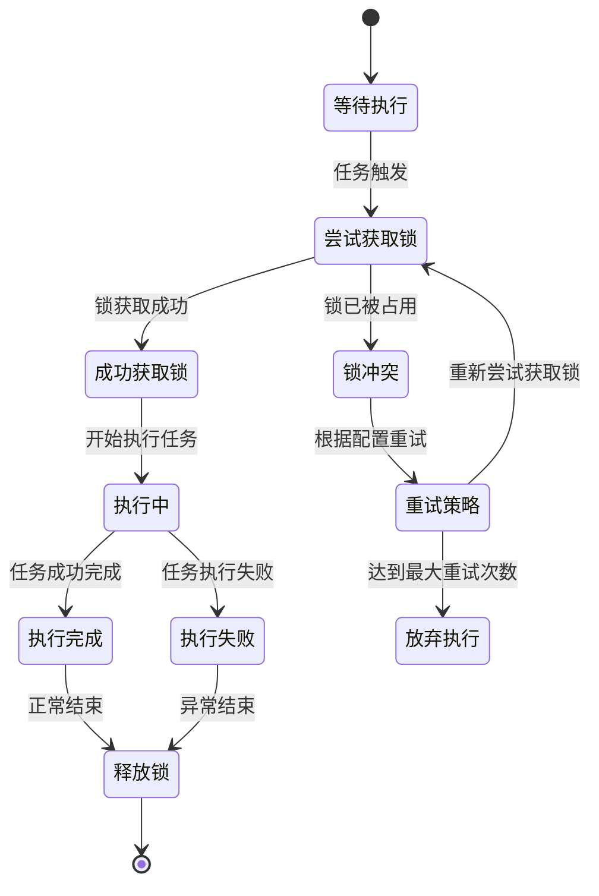
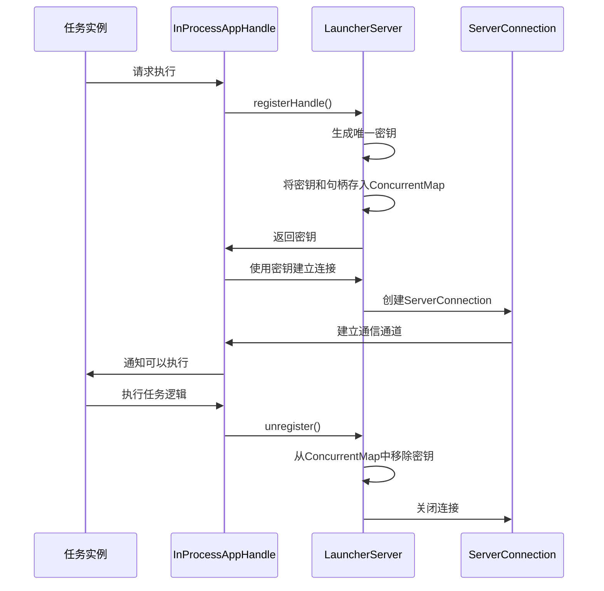
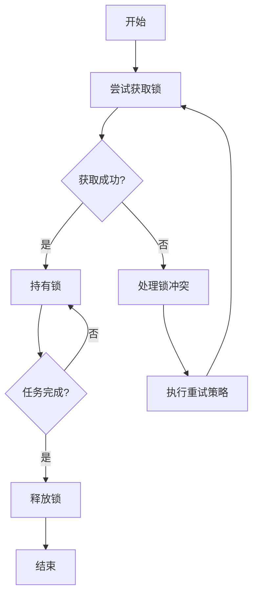
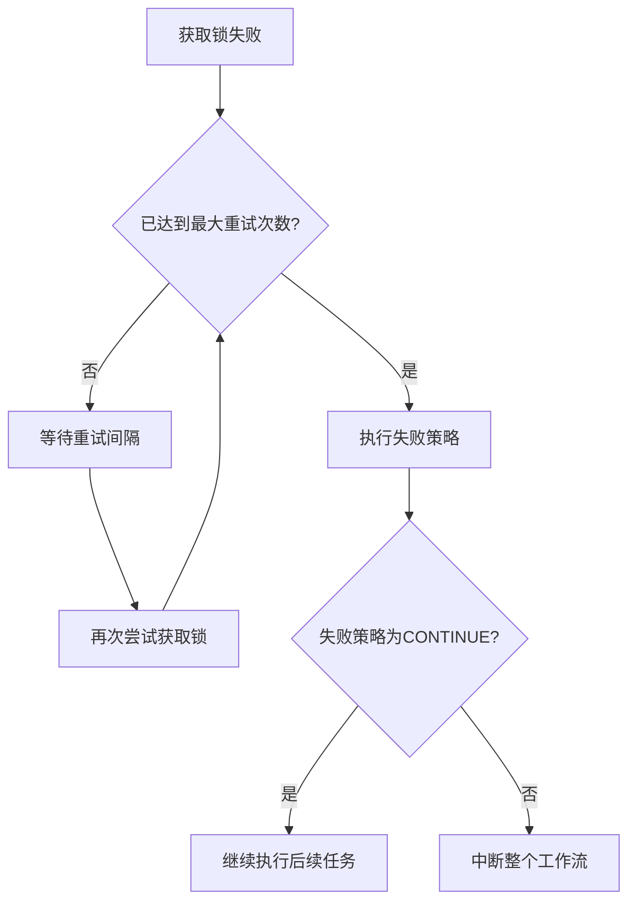
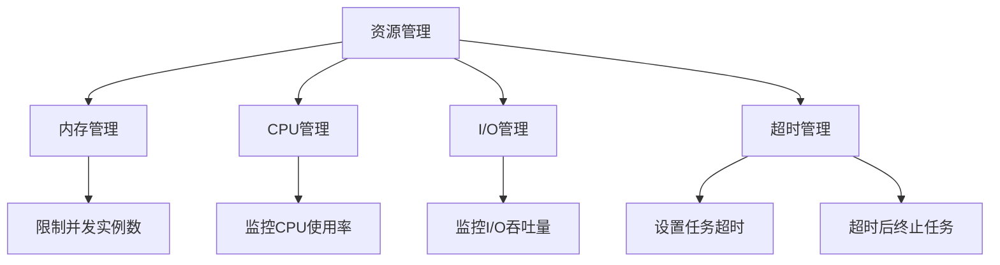

# 单实例模式

<cite>
**本文档引用的文件**
- [NodeInstanceModeType.java](file://spec/src/main/java/com/aliyun/dataworks/common/spec/domain/enums/NodeInstanceModeType.java)
- [SpecScheduleStrategy.java](file://spec/src/main/java/com/aliyun/dataworks/common/spec/domain/ref/SpecScheduleStrategy.java)
- [node.schema.json](file://schema/node.schema.json)
- [LauncherServer.java](file://client/client-spark-utils/src/main/java/com/aliyun/dataworks/client/utils/spark/command/LauncherServer.java)
- [InProcessAppHandle.java](file://client/client-spark-utils/src/main/java/com/aliyun/dataworks/client/utils/spark/command/InProcessAppHandle.java)
- [node-properties-instancemode.md](file://schema/docs/node-properties-instancemode.md)
</cite>

## 目录
1. [简介](#简介)
2. [单实例模式互斥执行机制](#单实例模式互斥执行机制)
3. [分布式锁实现原理](#分布式锁实现原理)
4. [锁生命周期管理](#锁生命周期管理)
5. [锁冲突处理与重试策略](#锁冲突处理与重试策略)
6. [资源管理](#资源管理)
7. [配置参数说明](#配置参数说明)
8. [应用场景与使用示例](#应用场景与使用示例)
9. [性能特征与优化建议](#性能特征与优化建议)

## 简介
单实例模式是dataworks-spec项目中的一个重要执行模式，用于确保特定任务在系统中同一时间只能有一个实例在运行。这种模式通过分布式锁机制来实现互斥执行，防止多个实例同时运行导致的数据不一致或资源竞争问题。文档将详细阐述单实例模式的互斥执行机制、分布式锁的实现原理、锁的生命周期管理、锁冲突处理策略、资源管理以及配置参数等关键方面。

**Section sources**
- [NodeInstanceModeType.java](file://spec/src/main/java/com/aliyun/dataworks/common/spec/domain/enums/NodeInstanceModeType.java)
- [SpecScheduleStrategy.java](file://spec/src/main/java/com/aliyun/dataworks/common/spec/domain/ref/SpecScheduleStrategy.java)

## 单实例模式互斥执行机制
单实例模式的核心在于确保同一任务在同一时间只能有一个实例在运行。该机制通过`NodeInstanceModeType`枚举来定义不同的实例化模式，其中`T_PLUS_1`和`IMMEDIATELY`是两种主要模式。`T_PLUS_1`模式表示节点的配置修改将在T+1天后生效，而`IMMEDIATELY`模式则表示配置修改将立即生效。这种模式通过在任务执行前获取分布式锁来确保互斥性，只有成功获取锁的实例才能继续执行，其他实例将被阻塞或拒绝执行。



**Diagram sources**
- [NodeInstanceModeType.java](file://spec/src/main/java/com/aliyun/dataworks/common/spec/domain/enums/NodeInstanceModeType.java)
- [SpecScheduleStrategy.java](file://spec/src/main/java/com/aliyun/dataworks/common/spec/domain/ref/SpecScheduleStrategy.java)

**Section sources**
- [NodeInstanceModeType.java](file://spec/src/main/java/com/aliyun/dataworks/common/spec/domain/enums/NodeInstanceModeType.java)
- [SpecScheduleStrategy.java](file://spec/src/main/java/com/aliyun/dataworks/common/spec/domain/ref/SpecScheduleStrategy.java)

## 分布式锁实现原理
dataworks-spec项目中的分布式锁实现基于`LauncherServer`和`InProcessAppHandle`类。`LauncherServer`作为服务器端，负责管理客户端连接和锁的分配。它通过`ServerSocket`监听本地回环地址上的端口，为每个客户端创建一个`ServerConnection`实例。`InProcessAppHandle`作为客户端，通过`LauncherServer`注册自身并获取一个唯一的密钥（secret），用于与服务器通信。

锁的获取过程如下：当一个任务需要执行时，它会通过`LauncherServer`的`registerHandle`方法注册一个`AbstractAppHandle`实例，并获取一个唯一的密钥。这个密钥作为锁的标识，只有持有该密钥的客户端才能与服务器通信，从而确保了互斥性。服务器端通过`ConcurrentMap<String, AbstractAppHandle>`来维护所有待处理的客户端句柄，确保同一时间只有一个客户端能够获取到锁。



**Diagram sources**
- [LauncherServer.java](file://client/client-spark-utils/src/main/java/com/aliyun/dataworks/client/utils/spark/command/LauncherServer.java)
- [InProcessAppHandle.java](file://client/client-spark-utils/src/main/java/com/aliyun/dataworks/client/utils/spark/command/InProcessAppHandle.java)

**Section sources**
- [LauncherServer.java](file://client/client-spark-utils/src/main/java/com/aliyun/dataworks/client/utils/spark/command/LauncherServer.java)
- [InProcessAppHandle.java](file://client/client-spark-utils/src/main/java/com/aliyun/dataworks/client/utils/spark/command/InProcessAppHandle.java)

## 锁生命周期管理
锁的生命周期包括获取、持有和释放三个阶段。在获取阶段，任务通过`LauncherServer`的`registerHandle`方法注册自身并获取一个唯一的密钥。在持有阶段，任务通过该密钥与服务器保持通信，确保其对资源的独占访问。在释放阶段，任务通过`unregister`方法通知服务器释放锁，服务器将从`ConcurrentMap`中移除对应的密钥和句柄，允许其他任务获取锁。

锁的持有时间由任务的执行时间决定，服务器通过`ScheduledExecutorService`定期检查连接状态，确保长时间未活动的连接能够被及时清理。此外，`LauncherServer`还提供了`timeout`机制，当客户端在指定时间内未发送心跳消息时，服务器将主动关闭连接，释放锁资源。



**Diagram sources**
- [LauncherServer.java](file://client/client-spark-utils/src/main/java/com/aliyun/dataworks/client/utils/spark/command/LauncherServer.java)
- [InProcessAppHandle.java](file://client/client-spark-utils/src/main/java/com/aliyun/dataworks/client/utils/spark/command/InProcessAppHandle.java)

**Section sources**
- [LauncherServer.java](file://client/client-spark-utils/src/main/java/com/aliyun/dataworks/client/utils/spark/command/LauncherServer.java)
- [InProcessAppHandle.java](file://client/client-spark-utils/src/main/java/com/aliyun/dataworks/client/utils/spark/command/InProcessAppHandle.java)

## 锁冲突处理与重试策略
当多个任务同时尝试获取锁时，可能会发生锁冲突。dataworks-spec项目通过配置化的重试策略来处理锁冲突。`SpecScheduleStrategy`类中的`rerunInterval`和`rerunTimes`字段定义了重试间隔和最大重试次数。当任务获取锁失败时，它将根据配置的重试策略等待一段时间后再次尝试获取锁。

如果达到最大重试次数后仍然无法获取锁，任务将被标记为失败，并根据`failureStrategy`字段定义的失败策略进行处理。`failureStrategy`可以设置为`CONTINUE`（继续执行后续任务）或`BREAK`（中断整个工作流），以适应不同的业务需求。



**Diagram sources**
- [SpecScheduleStrategy.java](file://spec/src/main/java/com/aliyun/dataworks/common/spec/domain/ref/SpecScheduleStrategy.java)
- [NodeRerunModeType.java](file://spec/src/main/java/com/aliyun/dataworks/common/spec/domain/enums/NodeRerunModeType.java)

**Section sources**
- [SpecScheduleStrategy.java](file://spec/src/main/java/com/aliyun/dataworks/common/spec/domain/ref/SpecScheduleStrategy.java)
- [NodeRerunModeType.java](file://spec/src/main/java/com/aliyun/dataworks/common/spec/domain/enums/NodeRerunModeType.java)

## 资源管理
在单实例模式下，资源管理主要涉及内存、CPU和I/O资源的分配与监控。`SpecScheduleStrategy`类中的`maxInternalConcurrency`字段定义了最大内部节点运行实例的并发总数限制，用于控制资源的使用。此外，`timeout`和`timeoutUnit`字段定义了任务的超时时间，防止任务长时间占用资源。

系统通过`LauncherServer`的`ScheduledExecutorService`定期监控任务的执行状态，确保资源的合理分配和及时释放。当任务超时时，系统将自动终止任务并释放相关资源，避免资源泄漏。



**Diagram sources**
- [SpecScheduleStrategy.java](file://spec/src/main/java/com/aliyun/dataworks/common/spec/domain/ref/SpecScheduleStrategy.java)
- [LauncherServer.java](file://client/client-spark-utils/src/main/java/com/aliyun/dataworks/client/utils/spark/command/LauncherServer.java)

**Section sources**
- [SpecScheduleStrategy.java](file://spec/src/main/java/com/aliyun/dataworks/common/spec/domain/ref/SpecScheduleStrategy.java)
- [LauncherServer.java](file://client/client-spark-utils/src/main/java/com/aliyun/dataworks/client/utils/spark/command/LauncherServer.java)

## 配置参数说明
单实例模式的配置参数主要通过`SpecScheduleStrategy`类进行定义，包括超时时间、重试间隔、重试次数等。以下是主要配置参数的说明：

| 参数名称 | 类型 | 说明 |
| :--- | :--- | :--- |
| `timeout` | Integer | 任务超时时间，单位由`timeoutUnit`指定 |
| `timeoutUnit` | TimeUnit | 超时时间单位，如秒、分钟等 |
| `instanceMode` | NodeInstanceModeType | 实例化模式，可选`T_PLUS_1`或`IMMEDIATELY` |
| `rerunMode` | NodeRerunModeType | 重试模式，可选`Allowed`、`Denied`或`FailureAllowed` |
| `rerunTimes` | Integer | 最大重试次数 |
| `rerunInterval` | Integer | 重试间隔时间，单位为毫秒 |
| `failureStrategy` | FailureStrategy | 失败策略，可选`CONTINUE`或`BREAK` |
| `maxInternalConcurrency` | Integer | 最大内部节点运行实例的并发总数限制 |

**Section sources**
- [SpecScheduleStrategy.java](file://spec/src/main/java/com/aliyun/dataworks/common/spec/domain/ref/SpecScheduleStrategy.java)
- [NodeInstanceModeType.java](file://spec/src/main/java/com/aliyun/dataworks/common/spec/domain/enums/NodeInstanceModeType.java)
- [NodeRerunModeType.java](file://spec/src/main/java/com/aliyun/dataworks/common/spec/domain/enums/NodeRerunModeType.java)
- [FailureStrategy.java](file://spec/src/main/java/com/aliyun/dataworks/common/spec/domain/enums/FailureStrategy.java)

## 应用场景与使用示例
单实例模式适用于需要确保任务互斥执行的场景，如数据同步、定时任务、批处理作业等。以下是一个使用单实例模式的配置示例：

```json
{
  "version": "1.0.0",
  "kind": "CycleWorkflow",
  "nodes": [
    {
      "id": "example-node",
      "name": "示例节点",
      "script": {
        "language": "python",
        "runtime": {
          "engine": "Python",
          "command": "python script.py"
        }
      },
      "schedule": {
        "instanceMode": "T+1",
        "timeout": 3600,
        "timeoutUnit": "seconds",
        "rerunMode": "FailureAllowed",
        "rerunTimes": 3,
        "rerunInterval": 180000,
        "failureStrategy": "CONTINUE"
      }
    }
  ]
}
```

在这个示例中，节点配置为`T+1`模式，超时时间为1小时，允许失败后重试3次，每次重试间隔3分钟，失败后继续执行后续任务。

**Section sources**
- [node.schema.json](file://schema/node.schema.json)
- [SpecScheduleStrategy.java](file://spec/src/main/java/com/aliyun/dataworks/common/spec/domain/ref/SpecScheduleStrategy.java)

## 性能特征与优化建议
单实例模式的性能特征主要受锁的获取和释放效率、任务执行时间、重试策略等因素影响。为了优化性能，建议采取以下措施：

1. **合理设置超时时间**：根据任务的实际执行时间设置合理的超时时间，避免过短导致任务频繁超时，或过长导致资源长时间占用。
2. **优化重试策略**：根据业务需求调整重试间隔和最大重试次数，避免因频繁重试导致系统负载过高。
3. **监控资源使用**：定期监控内存、CPU和I/O资源的使用情况，及时发现和解决资源瓶颈。
4. **减少锁持有时间**：尽量缩短任务的执行时间，减少锁的持有时间，提高系统的并发处理能力。
5. **使用异步处理**：对于耗时较长的任务，考虑使用异步处理方式，避免阻塞主线程。

通过以上优化措施，可以有效提升单实例模式的性能和稳定性，确保系统的高效运行。

**Section sources**
- [SpecScheduleStrategy.java](file://spec/src/main/java/com/aliyun/dataworks/common/spec/domain/ref/SpecScheduleStrategy.java)
- [LauncherServer.java](file://client/client-spark-utils/src/main/java/com/aliyun/dataworks/client/utils/spark/command/LauncherServer.java)