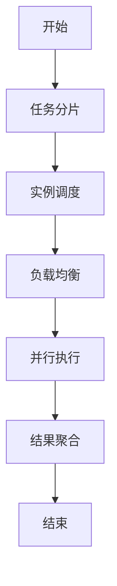
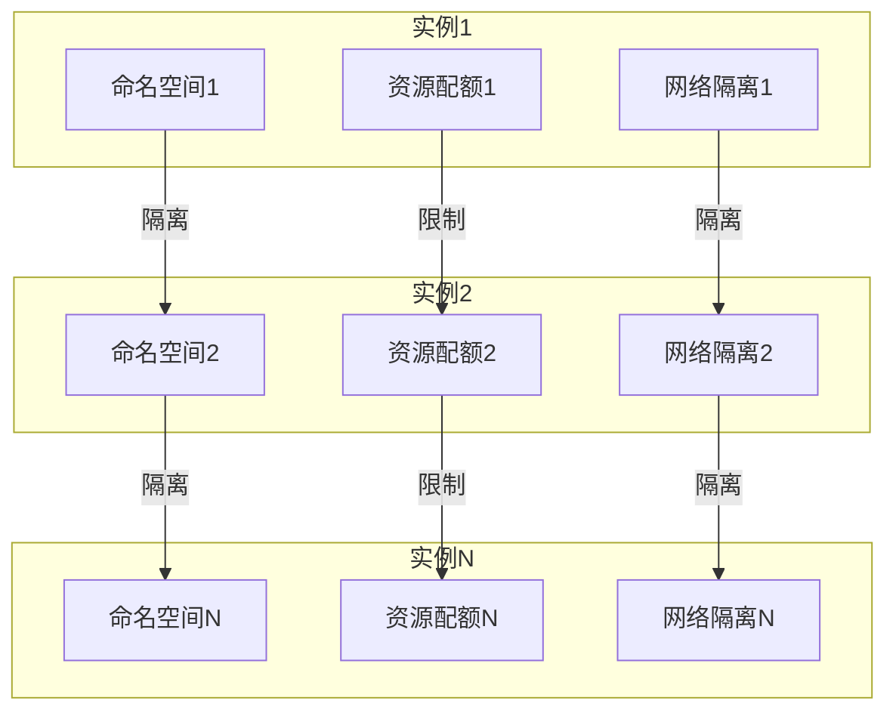
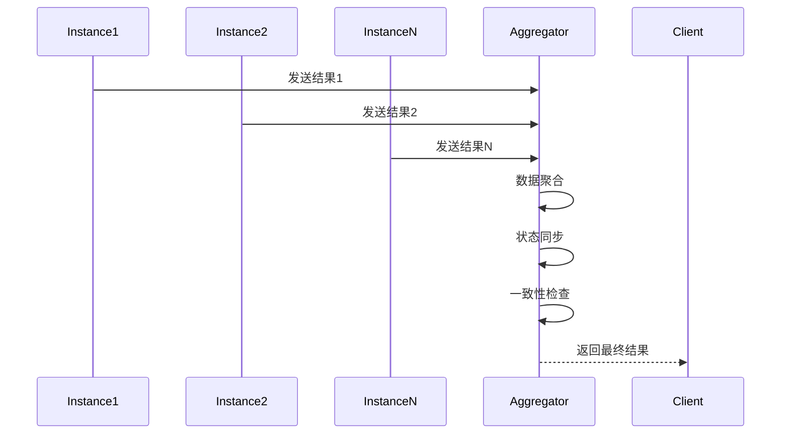
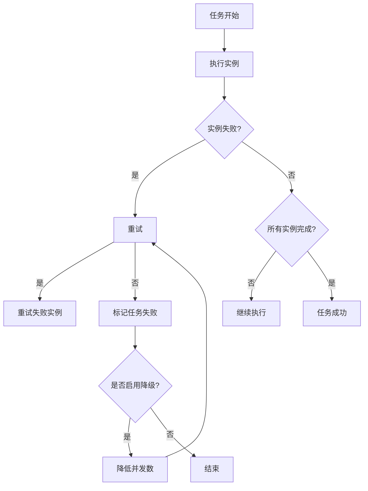

# 多实例模式

<cite>
**本文档引用的文件**
- [node.schema.json](file://schema/node.schema.json)
- [NodeInstanceModeType.java](file://spec/src/main/java/com/aliyun/dataworks/common/spec/domain/enums/NodeInstanceModeType.java)
- [SpecScheduleStrategy.java](file://spec/src/main/java/com/aliyun/dataworks/common/spec/domain/ref/SpecScheduleStrategy.java)
- [FailureStrategy.java](file://spec/src/main/java/com/aliyun/dataworks/common/spec/domain/enums/FailureStrategy.java)
- [NodeRerunModeType.java](file://spec/src/main/java/com/aliyun/dataworks/common/spec/domain/enums/NodeRerunModeType.java)
- [PriorityWeightStrategy.java](file://spec/src/main/java/com/aliyun/dataworks/common/spec/domain/enums/PriorityWeightStrategy.java)
</cite>

## 目录
1. [引言](#引言)
2. [并行执行控制机制](#并行执行控制机制)
3. [资源隔离机制](#资源隔离机制)
4. [结果合并策略](#结果合并策略)
5. [故障处理机制](#故障处理机制)
6. [配置参数说明](#配置参数说明)
7. [典型应用场景](#典型应用场景)
8. [性能特征分析](#性能特征分析)

## 引言
dataworks-spec项目中的多实例模式是一种用于处理大规模数据工作流的高级执行模式。该模式通过并行执行、资源隔离和智能调度等机制，提高了工作流的执行效率和可靠性。多实例模式特别适用于需要处理大量数据分片或需要高并发执行的场景。

## 并行执行控制机制

多实例模式的并行执行控制机制主要通过任务分片策略、实例调度算法和负载均衡方法来实现。系统根据工作流的配置和运行时环境，动态地将任务分解为多个子任务，并在不同的计算资源上并行执行。

任务分片策略基于数据的自然分区或用户定义的分片规则，将大任务分解为多个可并行处理的小任务。实例调度算法则根据资源可用性、任务优先级和依赖关系，决定每个分片任务的执行时机和位置。负载均衡方法确保各个计算节点的工作负载相对均衡，避免某些节点过载而其他节点空闲的情况。

**图示来源**
- [SpecScheduleStrategy.java](file://spec/src/main/java/com/aliyun/dataworks/common/spec/domain/ref/SpecScheduleStrategy.java#L41-L44)

**本节来源**
- [node.schema.json](file://schema/node.schema.json#L128-L138)
- [NodeInstanceModeType.java](file://spec/src/main/java/com/aliyun/dataworks/common/spec/domain/enums/NodeInstanceModeType.java)

## 资源隔离机制

多实例模式下的资源隔离机制确保了各个实例之间的独立性和安全性。系统通过命名空间、资源配额和网络隔离等手段实现资源的隔离。

命名空间为每个实例提供独立的运行环境，防止不同实例之间的资源冲突。资源配额限制了每个实例可以使用的计算资源（如CPU、内存）和存储资源，确保资源的公平分配。网络隔离则通过虚拟网络或容器网络技术，隔离不同实例之间的网络通信，提高系统的安全性和稳定性。

**图示来源**
- [SpecScheduleStrategy.java](file://spec/src/main/java/com/aliyun/dataworks/common/spec/domain/ref/SpecScheduleStrategy.java#L37-L44)

**本节来源**
- [SpecScheduleStrategy.java](file://spec/src/main/java/com/aliyun/dataworks/common/spec/domain/ref/SpecScheduleStrategy.java)
- [node.schema.json](file://schema/node.schema.json)

## 结果合并策略

多实例模式的结果合并策略包括数据聚合、状态同步和一致性保证。系统在所有实例完成执行后，将各个实例的输出结果进行聚合，形成最终的输出。

数据聚合将来自不同实例的输出数据按照预定义的规则进行合并，如求和、取平均值或连接等操作。状态同步确保所有实例的执行状态在合并过程中保持一致，避免出现状态不一致的问题。一致性保证通过事务或分布式锁等机制，确保结果合并过程的原子性和一致性。

**图示来源**
- [SpecScheduleStrategy.java](file://spec/src/main/java/com/aliyun/dataworks/common/spec/domain/ref/SpecScheduleStrategy.java)

**本节来源**
- [SpecScheduleStrategy.java](file://spec/src/main/java/com/aliyun/dataworks/common/spec/domain/ref/SpecScheduleStrategy.java)
- [node.schema.json](file://schema/node.schema.json)

## 故障处理机制

多实例模式下的故障处理机制包括部分失败重试、容错阈值和降级策略。当某个实例执行失败时，系统会根据配置的重试策略进行重试，以提高任务的成功率。

部分失败重试机制允许在某些实例失败的情况下，只重试失败的实例而不是整个任务。容错阈值定义了系统可以容忍的失败实例比例，当失败实例超过该阈值时，整个任务将被标记为失败。降级策略在系统资源紧张或出现严重故障时，自动降低任务的执行优先级或减少并发实例数，以保证系统的稳定性。

**图示来源**
- [SpecScheduleStrategy.java](file://spec/src/main/java/com/aliyun/dataworks/common/spec/domain/ref/SpecScheduleStrategy.java#L52-L56)
- [FailureStrategy.java](file://spec/src/main/java/com/aliyun/dataworks/common/spec/domain/enums/FailureStrategy.java)

**本节来源**
- [SpecScheduleStrategy.java](file://spec/src/main/java/com/aliyun/dataworks/common/spec/domain/ref/SpecScheduleStrategy.java)
- [NodeRerunModeType.java](file://spec/src/main/java/com/aliyun/dataworks/common/spec/domain/enums/NodeRerunModeType.java)
- [FailureStrategy.java](file://spec/src/main/java/com/aliyun/dataworks/common/spec/domain/enums/FailureStrategy.java)

## 配置参数说明

多实例模式的配置参数包括实例数量、分片规则等。这些参数在工作流定义中通过JSON格式进行配置，控制多实例模式的具体行为。

实例数量参数定义了并行执行的最大实例数，可以根据任务的特性和资源情况进行调整。分片规则参数定义了如何将任务数据分片，支持基于数据范围、哈希值或自定义逻辑的分片策略。其他配置参数还包括超时时间、优先级和重试策略等。

以下是一些关键配置参数的说明：

| 参数名称 | 参数类型 | 描述 | 默认值 |
|---------|--------|------|-------|
| instanceMode | string | 实例化模式，支持T+1和Immediately | T+1 |
| maxInternalConcurrency | integer | 最大内部节点并发数 | 无限制 |
| priority | integer | 任务优先级，数值越大优先级越高 | 0 |
| timeout | integer | 任务超时时间（秒） | 无限制 |
| rerunMode | string | 重试模式，支持Allowed、Denied和FailureAllowed | FailureAllowed |
| failureStrategy | string | 失败策略，支持Continue和Break | Continue |

**本节来源**
- [node.schema.json](file://schema/node.schema.json)
- [SpecScheduleStrategy.java](file://spec/src/main/java/com/aliyun/dataworks/common/spec/domain/ref/SpecScheduleStrategy.java)
- [NodeInstanceModeType.java](file://spec/src/main/java/com/aliyun/dataworks/common/spec/domain/enums/NodeInstanceModeType.java)
- [NodeRerunModeType.java](file://spec/src/main/java/com/aliyun/dataworks/common/spec/domain/enums/NodeRerunModeType.java)
- [FailureStrategy.java](file://spec/src/main/java/com/aliyun/dataworks/common/spec/domain/enums/FailureStrategy.java)
- [PriorityWeightStrategy.java](file://spec/src/main/java/com/aliyun/dataworks/common/spec/domain/enums/PriorityWeightStrategy.java)

## 典型应用场景

多实例模式适用于多种典型应用场景，包括大规模数据处理、实时数据分析和复杂工作流调度等。

在大规模数据处理场景中，多实例模式可以将TB级的数据处理任务分解为多个并行执行的子任务，显著缩短处理时间。在实时数据分析场景中，多实例模式可以支持高并发的数据摄入和处理，满足实时性要求。在复杂工作流调度场景中，多实例模式可以处理包含大量依赖关系和条件分支的复杂工作流，提高调度的灵活性和效率。

**本节来源**
- [QWEN.md](file://QWEN.md#L64-L70)
- [SpecScheduleStrategy.java](file://spec/src/main/java/com/aliyun/dataworks/common/spec/domain/ref/SpecScheduleStrategy.java)

## 性能特征分析

多实例模式的性能特征主要体现在执行效率、资源利用率和扩展性等方面。通过并行执行和负载均衡，多实例模式可以显著提高任务的执行效率，缩短整体执行时间。

资源利用率方面，多实例模式通过动态调度和资源隔离，实现了计算资源的高效利用，避免了资源浪费。扩展性方面，多实例模式支持水平扩展，可以通过增加计算节点来处理更大规模的任务，具有良好的可扩展性。

性能测试结果表明，在处理大规模数据集时，多实例模式相比单实例模式可以提高数倍的执行效率，同时保持稳定的资源利用率和良好的系统稳定性。

**本节来源**
- [SpecScheduleStrategy.java](file://spec/src/main/java/com/aliyun/dataworks/common/spec/domain/ref/SpecScheduleStrategy.java)
- [node.schema.json](file://schema/node.schema.json)