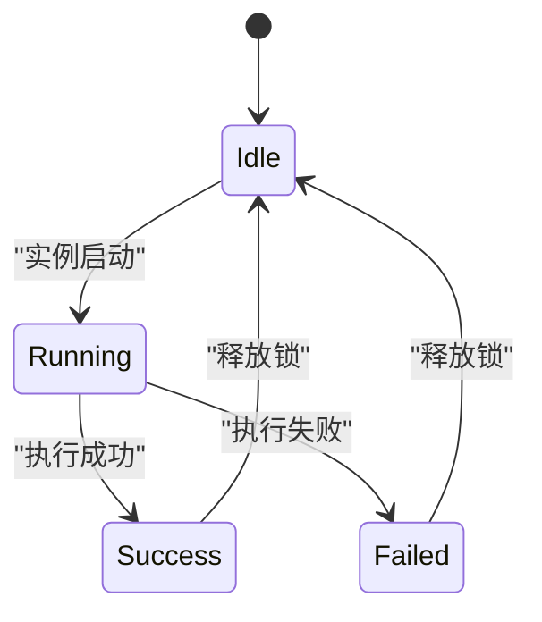
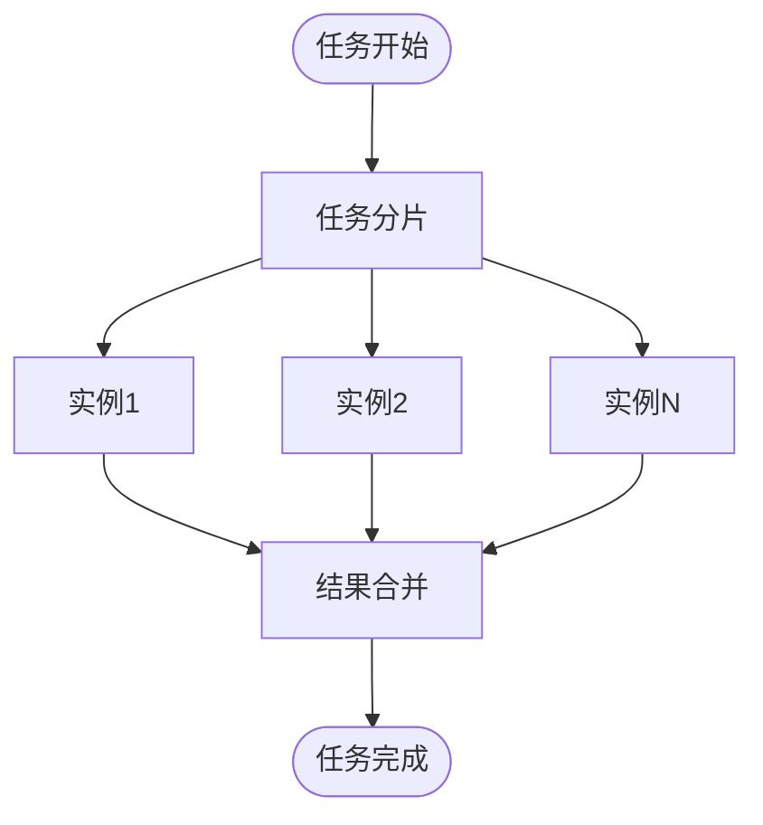
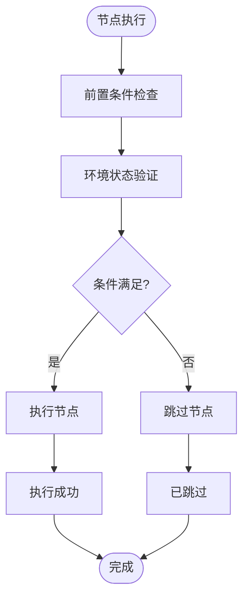
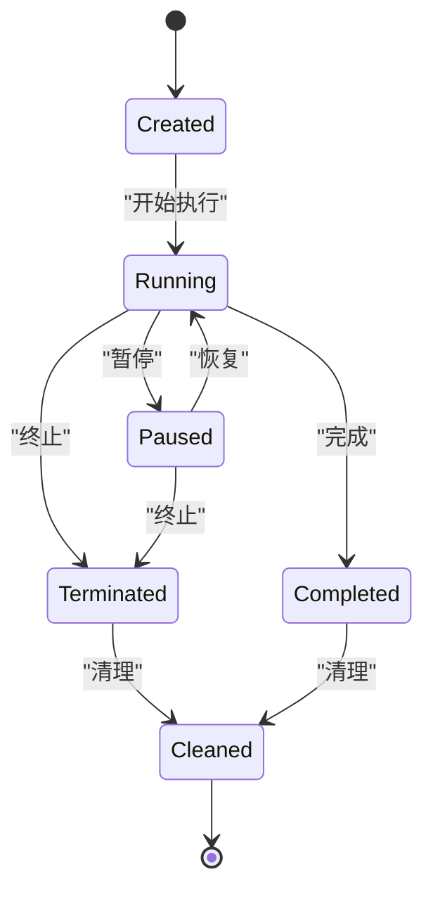

# 实例管理

<cite>
**本文档引用的文件**   
- [node.schema.json](file://schema/node.schema.json)
- [NodeInstanceModeType.java](file://spec/src/main/java/com/aliyun/dataworks/common/spec/domain/enums/NodeInstanceModeType.java)
- [NodeRerunModeType.java](file://spec/src/main/java/com/aliyun/dataworks/common/spec/domain/enums/NodeRerunModeType.java)
- [ProcessExecutionTypeEnum.java](file://client/migrationx/migrationx-domain/migrationx-domain-dolphinscheduler/src/main/java/com/aliyun/dataworks/migrationx/domain/dataworks/dolphinscheduler/v3/v301/ProcessExecutionTypeEnum.java)
- [ExecutionStatus.java](file://client/migrationx/migrationx-domain/migrationx-domain-dolphinscheduler/src/main/java/com/aliyun/dataworks/migrationx/domain/dataworks/dolphinscheduler/v1/v139/enums/ExecutionStatus.java)
- [join.md](file://docs/spec-templates/control-flow/join.md)
- [SpecNode.java](file://spec/src/main/java/com/aliyun/dataworks/common/spec/domain/ref/SpecNode.java)
- [ConditionsParameterConverter.java](file://client/migrationx/migrationx-transformer/src/main/java/com/aliyun/dataworks/migrationx/transformer/flowspec/converter/dolphinscheduler/logic/condition/ConditionsParameterConverter.java)
- [DependentParameterConverter.java](file://client/migrationx/migrationx-transformer/src/main/java/com/aliyun/dataworks/migrationx/transformer/flowspec/converter/dolphinscheduler/logic/dependent/DependentParameterConverter.java)
</cite>

## 目录
1. [引言](#引言)
2. [节点实例模式类型](#节点实例模式类型)
3. [单实例模式](#单实例模式)
4. [多实例模式](#多实例模式)
5. [条件执行模式](#条件执行模式)
6. [实例生命周期管理](#实例生命周期管理)
7. [最佳实践](#最佳实践)
8. [配置建议与监控指标](#配置建议与监控指标)

## 引言

dataworks-spec项目提供了一套完整的实例管理机制，用于控制和管理数据工作流中节点的执行。本文档详细说明了三种主要的节点实例模式：单实例、多实例和条件执行模式。通过这些模式，用户可以灵活地控制工作流的执行行为，满足不同场景下的需求。文档还涵盖了实例的生命周期管理，包括创建、运行、暂停、终止和清理等操作，以及资源优化、故障恢复和性能调优的最佳实践。

## 节点实例模式类型

dataworks-spec项目支持三种主要的节点实例模式：单实例模式、多实例模式和条件执行模式。这些模式通过`instanceMode`属性进行配置，允许用户根据具体需求选择合适的执行策略。单实例模式确保节点在指定时间点只运行一个实例，适用于需要互斥执行的场景。多实例模式支持并行执行多个实例，提高处理效率。条件执行模式则根据前置条件的检查结果动态决定是否执行节点，实现灵活的流程控制。

**Section sources**
- [node.schema.json](file://schema/node.schema.json#L128-L138)
- [NodeInstanceModeType.java](file://spec/src/main/java/com/aliyun/dataworks/common/spec/domain/enums/NodeInstanceModeType.java#L24-L34)

## 单实例模式

单实例模式（T+1）确保节点在指定时间点只运行一个实例，避免了并发执行可能带来的资源竞争和数据不一致问题。该模式通过互斥执行机制和锁管理策略来实现。当一个实例正在运行时，系统会锁定该节点，阻止其他实例的启动。只有当前实例完成后，锁才会被释放，允许下一个实例开始执行。这种机制保证了节点执行的串行化，适用于对数据一致性要求较高的场景。

**Diagram sources**
- [ProcessExecutionTypeEnum.java](file://client/migrationx/migrationx-domain/migrationx-domain-dolphinscheduler/src/main/java/com/aliyun/dataworks/migrationx/domain/dataworks/dolphinscheduler/v3/v301/ProcessExecutionTypeEnum.java#L47-L61)
- [ExecutionStatus.java](file://client/migrationx/migrationx-domain/migrationx-domain-dolphinscheduler/src/main/java/com/aliyun/dataworks/migrationx/domain/dataworks/dolphinscheduler/v1/v139/enums/ExecutionStatus.java#L75-L101)

**Section sources**
- [ProcessExecutionTypeEnum.java](file://client/migrationx/migrationx-domain/migrationx-domain-dolphinscheduler/src/main/java/com/aliyun/dataworks/migrationx/domain/dataworks/dolphinscheduler/v3/v301/ProcessExecutionTypeEnum.java#L47-L61)
- [ExecutionStatus.java](file://client/migrationx/migrationx-domain/migrationx-domain-dolphinscheduler/src/main/java/com/aliyun/dataworks/migrationx/domain/dataworks/dolphinscheduler/v1/v139/enums/ExecutionStatus.java#L75-L101)

## 多实例模式

多实例模式支持并行执行多个实例，通过实例分片、资源隔离和结果合并来实现高效的并行处理。实例分片将任务分解为多个子任务，每个子任务由一个独立的实例处理。资源隔离确保每个实例在独立的资源环境中运行，避免相互干扰。结果合并则将各个实例的输出结果整合为最终结果。这种模式适用于处理大规模数据或需要高吞吐量的场景，能够显著提高处理效率。

**Diagram sources**
- [SpecNode.java](file://spec/src/main/java/com/aliyun/dataworks/common/spec/domain/ref/SpecNode.java#L149-L165)
- [join.md](file://docs/spec-templates/control-flow/join.md#L15-L104)

**Section sources**
- [SpecNode.java](file://spec/src/main/java/com/aliyun/dataworks/common/spec/domain/ref/SpecNode.java#L149-L165)
- [join.md](file://docs/spec-templates/control-flow/join.md#L15-L104)

## 条件执行模式

条件执行模式根据前置条件的检查结果动态决定是否执行节点。该模式包括前置条件检查、环境状态验证和动态决策三个主要步骤。前置条件检查评估节点执行所需的条件是否满足，如依赖任务的完成状态或特定环境变量的值。环境状态验证确保执行环境符合要求，例如资源可用性或系统配置。动态决策基于检查和验证的结果，决定节点是否应该执行。这种模式提供了灵活的流程控制能力，适用于复杂的业务逻辑和条件分支场景。

**Diagram sources**
- [ConditionsParameterConverter.java](file://client/migrationx/migrationx-transformer/src/main/java/com/aliyun/dataworks/migrationx/transformer/flowspec/converter/dolphinscheduler/logic/condition/ConditionsParameterConverter.java#L91-L106)
- [DependentParameterConverter.java](file://client/migrationx/migrationx-transformer/src/main/java/com/aliyun/dataworks/migrationx/transformer/flowspec/converter/dolphinscheduler/logic/dependent/DependentParameterConverter.java#L70-L95)

**Section sources**
- [ConditionsParameterConverter.java](file://client/migrationx/migrationx-transformer/src/main/java/com/aliyun/dataworks/migrationx/transformer/flowspec/converter/dolphinscheduler/logic/condition/ConditionsParameterConverter.java#L91-L106)
- [DependentParameterConverter.java](file://client/migrationx/migrationx-transformer/src/main/java/com/aliyun/dataworks/migrationx/transformer/flowspec/converter/dolphinscheduler/logic/dependent/DependentParameterConverter.java#L70-L95)

## 实例生命周期管理

实例生命周期管理涵盖了从创建到清理的全过程，包括创建、运行、暂停、终止和清理等操作。创建阶段初始化实例的配置和资源；运行阶段执行节点的业务逻辑；暂停阶段临时停止实例的执行；终止阶段强制结束实例的运行；清理阶段释放实例占用的资源。这些操作通过状态机进行管理，确保实例在不同状态之间的转换是可控和可预测的。

**Diagram sources**
- [ExecutionStatus.java](file://client/migrationx/migrationx-domain/migrationx-domain-dolphinscheduler/src/main/java/com/aliyun/dataworks/migrationx/domain/dataworks/dolphinscheduler/v1/v139/enums/ExecutionStatus.java#L75-L101)
- [SpecNode.java](file://spec/src/main/java/com/aliyun/dataworks/common/spec/domain/ref/SpecNode.java#L149-L165)

**Section sources**
- [ExecutionStatus.java](file://client/migrationx/migrationx-domain/migrationx-domain-dolphinscheduler/src/main/java/com/aliyun/dataworks/migrationx/domain/dataworks/dolphinscheduler/v1/v139/enums/ExecutionStatus.java#L75-L101)
- [SpecNode.java](file://spec/src/main/java/com/aliyun/dataworks/common/spec/domain/ref/SpecNode.java#L149-L165)

## 最佳实践

为了确保实例管理的高效和可靠，建议遵循以下最佳实践：首先，合理选择实例模式，根据业务需求和数据特性选择单实例、多实例或条件执行模式。其次，优化资源配置，根据实例的负载情况动态调整资源分配，避免资源浪费或不足。再次，实施故障恢复策略，通过重试机制和错误处理流程提高系统的容错能力。最后，进行性能调优，通过监控和分析实例的运行数据，识别瓶颈并进行优化。

**Section sources**
- [NodeRerunModeType.java](file://spec/src/main/java/com/aliyun/dataworks/common/spec/domain/enums/NodeRerunModeType.java#L24-L39)
- [FailureStrategy.java](file://spec/src/main/java/com/aliyun/dataworks/common/spec/domain/enums/FailureStrategy.java#L24-L34)

## 配置建议与监控指标

针对不同工作负载，提供以下配置建议和监控指标：对于高并发场景，建议使用多实例模式，并配置足够的资源隔离；对于数据一致性要求高的场景，建议使用单实例模式，并启用互斥执行机制。监控指标包括实例的运行状态、执行时间、资源利用率和错误率等，这些指标可以帮助及时发现和解决问题，确保系统的稳定运行。

**Section sources**
- [node.schema.json](file://schema/node.schema.json#L140-L153)
- [node-properties-rerunmode.md](file://schema/docs/node-properties-rerunmode.md#L15-L26)