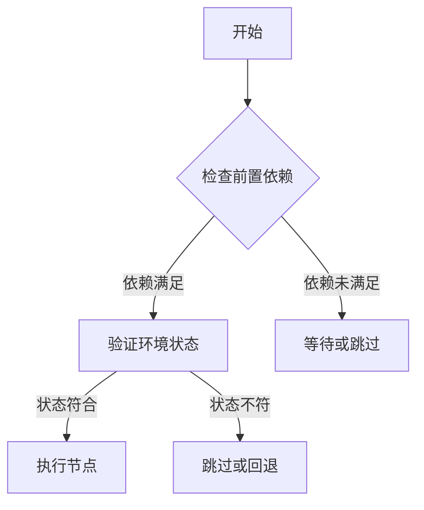
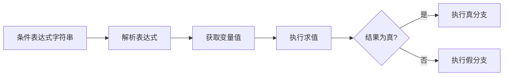
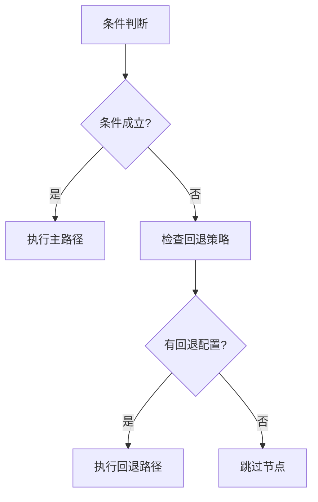

# 条件执行模式

<cite>
**本文档中引用的文件**  
- [SpecFlowDepend.java](file://spec/src/main/java/com/aliyun/dataworks/common/spec/domain/noref/SpecFlowDepend.java)
- [SpecLogic.java](file://spec/src/main/java/com/aliyun/dataworks/common/spec/domain/noref/SpecLogic.java)
- [SpecFlowDepend.schema.json](file://spec/src/main/resources/spec/schema/SpecFlowDepend.schema.json)
- [SpecLogic.schema.json](file://spec/src/main/resources/spec/schema/SpecLogic.schema.json)
- [ConditionsParameterConverter.java](file://client/migrationx/migrationx-transformer/src/main/java/com/aliyun/dataworks/migrationx/transformer/flowspec/converter/dolphinscheduler/logic/condition/ConditionsParameterConverter.java)
- [flow-if.md](file://schema/docs/flow-if.md)
- [flow-then.md](file://schema/docs/flow-then.md)
</cite>

## 目录
1. [引言](#引言)
2. [前置条件检查与环境状态验证](#前置条件检查与环境状态验证)
3. [条件表达式语法与求值过程](#条件表达式语法与求值过程)
4. [条件依赖管理机制](#条件依赖管理机制)
5. [回退策略与默认行为](#回退策略与默认行为)
6. [配置参数说明](#配置参数说明)
7. [典型应用场景与使用示例](#典型应用场景与使用示例)
8. [复杂工作流中的优势分析](#复杂工作流中的优势分析)

## 引言
dataworks-spec项目中的条件执行模式为工作流提供了灵活的控制能力，允许根据运行时状态动态决定执行路径。该模式通过条件表达式、依赖管理和分支控制实现复杂的流程决策，支持在不同条件下执行不同的任务节点，从而满足多样化的业务需求。

## 前置条件检查与环境状态验证
条件执行模式的前置条件检查主要通过`SpecFlowDepend`类实现，该类定义了节点间的依赖关系。每个任务节点可以配置多个前置依赖，系统在执行前会验证所有依赖条件是否满足。环境状态验证则通过`SpecLogic`类中的表达式求值完成，表达式可以引用运行时变量和系统状态，确保只有在特定环境条件下才会触发相应节点的执行。

**Diagram sources**
- [SpecFlowDepend.java](file://spec/src/main/java/com/aliyun/dataworks/common/spec/domain/noref/SpecFlowDepend.java)
- [SpecLogic.java](file://spec/src/main/java/com/aliyun/dataworks/common/spec/domain/noref/SpecLogic.java)

**Section sources**
- [SpecFlowDepend.java](file://spec/src/main/java/com/aliyun/dataworks/common/spec/domain/noref/SpecFlowDepend.java#L34-L39)
- [SpecLogic.java](file://spec/src/main/java/com/aliyun/dataworks/common/spec/domain/noref/SpecLogic.java#L27)

## 条件表达式语法与求值过程
条件表达式的语法结构基于字符串形式的逻辑表达式，定义在`SpecLogic.schema.json`中，要求必须包含`expression`字段。表达式支持基本的比较运算符（如==、!=、>、<）和逻辑运算符（&&、||），可以引用工作流中的变量值。求值过程由系统在运行时解析表达式字符串，结合当前上下文中的变量值进行计算，返回布尔结果以决定分支走向。

**Diagram sources**
- [SpecLogic.schema.json](file://spec/src/main/resources/spec/schema/SpecLogic.schema.json)
- [ConditionsParameterConverter.java](file://client/migrationx/migrationx-transformer/src/main/java/com/aliyun/dataworks/migrationx/transformer/flowspec/converter/dolphinscheduler/logic/condition/ConditionsParameterConverter.java)

**Section sources**
- [SpecLogic.schema.json](file://spec/src/main/resources/spec/schema/SpecLogic.schema.json#L6-L8)
- [SpecLogic.java](file://spec/src/main/java/com/aliyun/dataworks/common/spec/domain/noref/SpecLogic.java#L27)

## 条件依赖管理机制
条件依赖管理通过`SpecFlowDepend`结构实现，包含`nodeId`、`depends`和`variableDepends`三个核心字段。`depends`用于注册节点间的直接依赖关系，`variableDepends`则用于监控变量状态变化。系统通过`replaceNodeId`方法动态更新依赖关系，支持在工作流执行过程中根据条件变化调整依赖链。依赖监控机制会持续跟踪各依赖项的状态，一旦状态更新即触发相应的条件判断。

**Section sources**
- [SpecFlowDepend.java](file://spec/src/main/java/com/aliyun/dataworks/common/spec/domain/noref/SpecFlowDepend.java#L35-L39)
- [SpecFlowDepend.schema.json](file://spec/src/main/resources/spec/schema/SpecFlowDepend.schema.json#L6-L20)

## 回退策略与默认行为
当条件判断失败或依赖无法满足时，系统会执行预设的回退策略。默认行为包括跳过当前节点、执行备用分支或终止工作流。通过`flow-if`和`flow-then`结构可以定义条件分支的走向，其中`if`部分定义判断条件，`then`部分定义满足条件后的执行路径。未明确指定回退策略时，系统将采用静默跳过的方式处理不满足条件的节点。

**Diagram sources**
- [flow-if.md](file://schema/docs/flow-if.md)
- [flow-then.md](file://schema/docs/flow-then.md)

**Section sources**
- [flow-if.md](file://schema/docs/flow-if.md#L43-L46)
- [flow-then.md](file://schema/docs/flow-then.md)

## 配置参数说明
条件执行模式支持多种配置参数以控制其行为。超时设置可通过节点级别的`timeout`参数定义，指定条件等待的最大时长。缓存策略通过`SpecNode`的`instanceMode`属性配置，支持单例模式和每次新建实例两种方式。此外，还可以通过`priority`参数设置条件分支的优先级，影响调度器的执行顺序决策。

**Section sources**
- [SpecNode.java](file://spec/src/main/java/com/aliyun/dataworks/common/spec/domain/ref/SpecNode.java#L141-L192)

## 典型应用场景与使用示例
条件执行模式广泛应用于数据处理工作流中。典型场景包括：根据数据质量检查结果决定是否继续后续处理、基于业务指标阈值触发告警流程、在ETL过程中根据源数据特征选择不同的清洗规则。使用示例中，可通过定义`if $data_volume > 1000000`这样的条件表达式，让系统自动选择高性能处理路径或常规处理路径。

**Section sources**
- [ConditionsParameterConverter.java](file://client/migrationx/migrationx-transformer/src/main/java/com/aliyun/dataworks/migrationx/transformer/flowspec/converter/dolphinscheduler/logic/condition/ConditionsParameterConverter.java#L95-L103)

## 复杂工作流中的优势分析
在复杂工作流中，条件执行模式提供了显著的优势。它使工作流具备了动态适应能力，能够根据运行时环境和数据特征自动调整执行路径。这种灵活性减少了对固定流程的依赖，提高了系统的智能化水平。同时，通过将条件判断与任务调度分离，降低了工作流定义的复杂度，使得业务逻辑更加清晰易懂。在大规模数据处理场景下，条件执行模式能有效优化资源利用，避免不必要的计算开销。