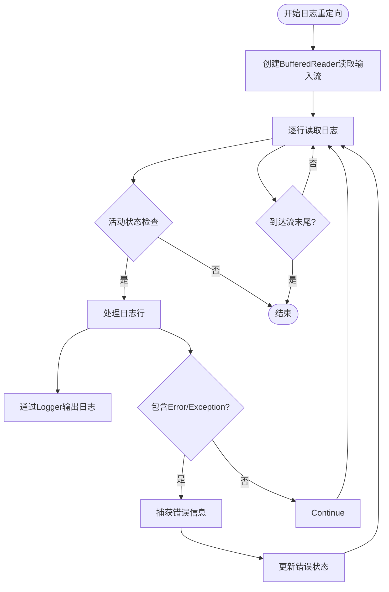
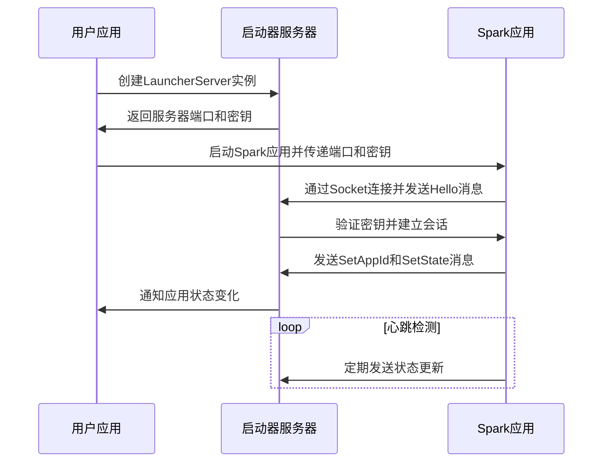
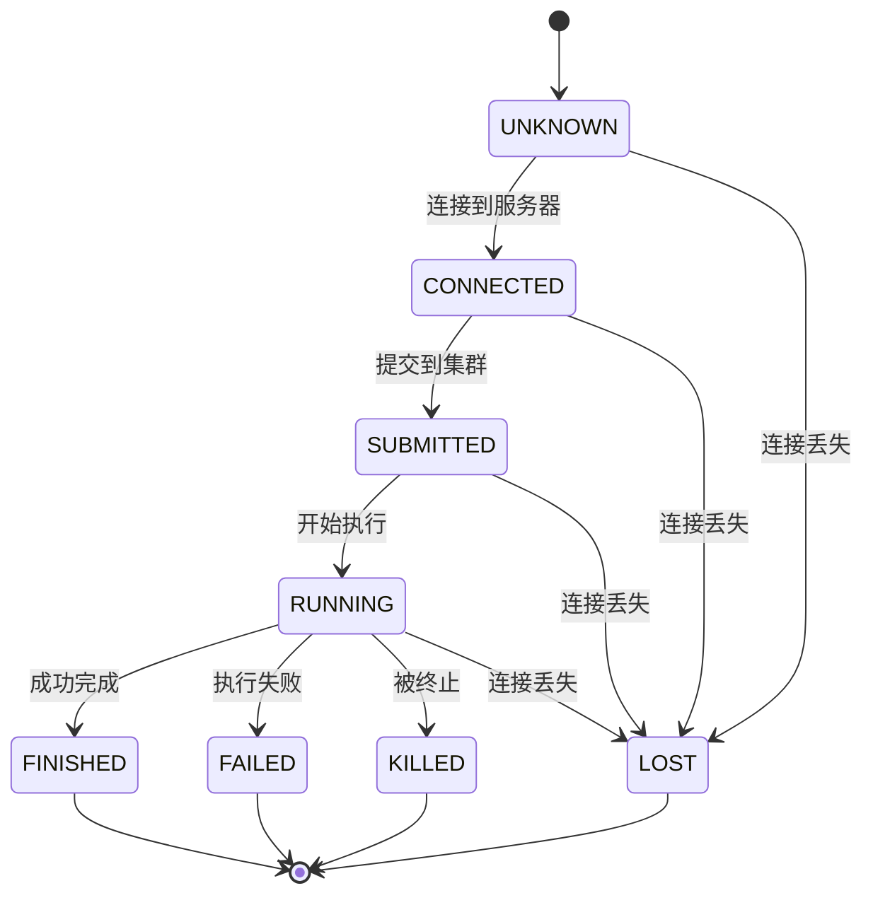
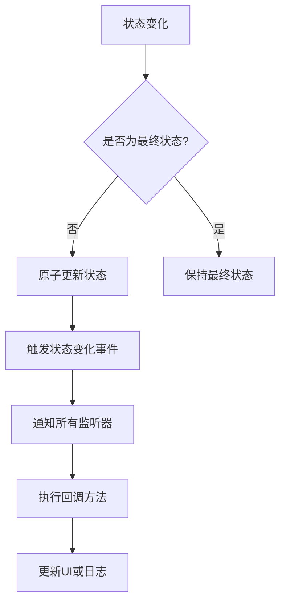
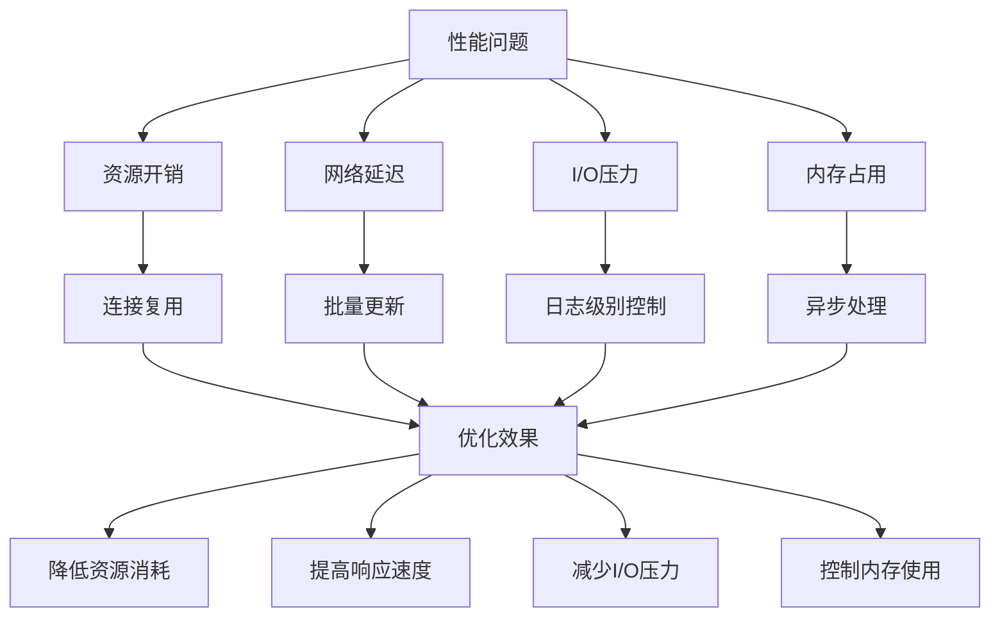

# 交互特性

<cite>
**本文档引用的文件**
- [OutputRedirector.java](file://client/client-spark-utils/src/main/java/com/aliyun/dataworks/client/utils/spark/command/OutputRedirector.java)
- [LauncherProtocol.java](file://client/client-spark-utils/src/main/java/com/aliyun/dataworks/client/utils/spark/command/LauncherProtocol.java)
- [SparkAppHandle.java](file://client/client-spark-utils/src/main/java/com/aliyun/dataworks/client/utils/spark/command/SparkAppHandle.java)
- [ChildProcAppHandle.java](file://client/client-spark-utils/src/main/java/com/aliyun/dataworks/client/utils/spark/command/ChildProcAppHandle.java)
- [AbstractAppHandle.java](file://client/client-spark-utils/src/main/java/com/aliyun/dataworks/client/utils/spark/command/AbstractAppHandle.java)
- [LauncherServer.java](file://client/client-spark-utils/src/main/java/com/aliyun/dataworks/client/utils/spark/command/LauncherServer.java)
- [LauncherConnection.java](file://client/client-spark-utils/src/main/java/com/aliyun/dataworks/client/utils/spark/command/LauncherConnection.java)
- [manual-workflow.md](file://docs/spec-templates/workflows/manual-workflow.md)
- [manual-workflow.template.json](file://dwcli/dwcli/templates/manual-workflow.template.json)
</cite>

## 目录
1. [简介](#简介)
2. [实时日志查看](#实时日志查看)
3. [执行进度监控](#执行进度监控)
4. [结果获取](#结果获取)
5. [使用示例与最佳实践](#使用示例与最佳实践)
6. [性能影响与优化建议](#性能影响与优化建议)
7. [与其他监控系统的集成](#与其他监控系统的集成)

## 简介

dataworks-spec项目提供了手动执行工作流的交互特性，支持实时日志查看、执行进度监控和结果获取功能。手动工作流（ManualWorkflow）是一种无需配置调度策略即可手动触发执行的工作流类型，适用于临时任务、测试任务和一次性数据处理等场景。通过交互特性，用户可以实时监控任务执行状态，查看详细的日志输出，并获取执行结果。

**Section sources**
- [manual-workflow.md](file://docs/spec-templates/workflows/manual-workflow.md)
- [manual-workflow.template.json](file://dwcli/dwcli/templates/manual-workflow.template.json)

## 实时日志查看

### 实时日志生成机制

dataworks-spec项目通过`OutputRedirector`类实现日志的实时生成和重定向。当执行任务时，系统会创建一个`OutputRedirector`实例，将子进程的输出流重定向到Java的`java.util.logging.Logger`。该机制通过读取输入流中的每一行，将其作为INFO级别的日志输出。

日志生成的核心机制如下：
1. 创建`BufferedReader`读取输入流
2. 逐行读取日志内容
3. 将每行日志通过`Logger.info()`方法输出
4. 对包含"Error"或"Exception"的关键字进行检测，识别错误信息



**Diagram sources**
- [OutputRedirector.java](file://client/client-spark-utils/src/main/java/com/aliyun/dataworks/client/utils/spark/command/OutputRedirector.java)

### 传输协议

dataworks-spec项目使用基于Socket的通信协议来传输执行状态和日志信息。该协议通过`LauncherProtocol`类定义，采用Java序列化机制进行消息传递。通信双方包括启动器服务器（LauncherServer）和客户端（LauncherConnection）。

主要传输协议特性：
- 使用环境变量`_SPARK_LAUNCHER_PORT`和`_SPARK_LAUNCHER_SECRET`传递服务器端口和密钥
- 通过`LauncherConnection`建立Socket连接
- 使用`ObjectOutputStream`和`ObjectInputStream`进行序列化通信
- 支持心跳检测和连接超时机制



**Diagram sources**
- [LauncherProtocol.java](file://client/client-spark-utils/src/main/java/com/aliyun/dataworks/client/utils/spark/command/LauncherProtocol.java)
- [LauncherServer.java](file://client/client-spark-utils/src/main/java/com/aliyun/dataworks/client/utils/spark/command/LauncherServer.java)
- [LauncherConnection.java](file://client/client-spark-utils/src/main/java/com/aliyun/dataworks/client/utils/spark/command/LauncherConnection.java)

### 查看接口

实时日志查看接口通过`SparkAppHandle`接口提供，用户可以通过添加监听器来获取日志和状态更新。主要接口方法包括：

- `addListener(Listener l)`: 添加状态变化监听器
- `getState()`: 获取当前应用状态
- `getAppId()`: 获取应用ID
- `getError()`: 获取错误信息

日志查看的实现依赖于`OutputRedirector`类，该类将子进程的输出流重定向到指定的Logger，实现了日志的实时查看功能。

```mermaid
classDiagram
class SparkAppHandle {
<<interface>>
+enum State
+void addListener(Listener l)
+State getState()
+String getAppId()
+void stop()
+void kill()
+void disconnect()
+Optional~Throwable~ getError()
}
class SparkAppHandle$Listener {
<<interface>>
+void stateChanged(SparkAppHandle handle)
+void infoChanged(SparkAppHandle handle)
}
class ChildProcAppHandle {
-Process childProc
-OutputRedirector redirector
+ChildProcAppHandle(LauncherServer server)
+void disconnect()
+Optional~Throwable~ getError()
+void kill()
+void setChildProc(Process childProc, String loggerName, InputStream logStream)
+void monitorChild()
}
class OutputRedirector {
-BufferedReader reader
-Logger sink
-Thread thread
-ChildProcAppHandle callback
-volatile boolean active
-volatile Throwable error
+OutputRedirector(InputStream in, String loggerName, ThreadFactory tf)
+OutputRedirector(InputStream in, String loggerName, ThreadFactory tf, ChildProcAppHandle callback)
+void stop()
+boolean isAlive()
+Throwable getError()
}
class AbstractAppHandle {
-LauncherServer server
-LauncherServer$ServerConnection connection
-Listener[] listeners
-AtomicReference~State~ state
-volatile String appId
-volatile boolean disposed
+AbstractAppHandle(LauncherServer server)
+void addListener(SparkAppHandle$Listener l)
+SparkAppHandle$State getState()
+String getAppId()
+void stop()
+void disconnect()
+void dispose()
+void setState(SparkAppHandle$State s)
+void setAppId(String appId)
}
SparkAppHandle <|-- AbstractAppHandle
AbstractAppHandle <|-- ChildProcAppHandle
ChildProcAppHandle --> OutputRedirector : "使用"
OutputRedirector --> ChildProcAppHandle : "回调"
```

**Diagram sources**
- [SparkAppHandle.java](file://client/client-spark-utils/src/main/java/com/aliyun/dataworks/client/utils/spark/command/SparkAppHandle.java)
- [ChildProcAppHandle.java](file://client/client-spark-utils/src/main/java/com/aliyun/dataworks/client/utils/spark/command/ChildProcAppHandle.java)
- [AbstractAppHandle.java](file://client/client-spark-utils/src/main/java/com/aliyun/dataworks/client/utils/spark/command/AbstractAppHandle.java)
- [OutputRedirector.java](file://client/client-spark-utils/src/main/java/com/aliyun/dataworks/client/utils/spark/command/OutputRedirector.java)

**Section sources**
- [OutputRedirector.java](file://client/client-spark-utils/src/main/java/com/aliyun/dataworks/client/utils/spark/command/OutputRedirector.java)
- [LauncherProtocol.java](file://client/client-spark-utils/src/main/java/com/aliyun/dataworks/client/utils/spark/command/LauncherProtocol.java)
- [SparkAppHandle.java](file://client/client-spark-utils/src/main/java/com/aliyun/dataworks/client/utils/spark/command/SparkAppHandle.java)

## 执行进度监控

### 进度指标采集

dataworks-spec项目的执行进度监控通过`SparkAppHandle.State`枚举实现，定义了应用的各个状态，包括UNKNOWN、CONNECTED、SUBMITTED、RUNNING、FINISHED、FAILED、KILLED和LOST。这些状态指标通过`LauncherProtocol`协议在客户端和服务器之间同步。

进度指标的采集流程：
1. 应用启动时状态为UNKNOWN
2. 连接到服务器后状态变为CONNECTED
3. 提交到集群后状态变为SUBMITTED
4. 开始运行后状态变为RUNNING
5. 执行完成后根据结果变为FINISHED或FAILED



**Diagram sources**
- [SparkAppHandle.java](file://client/client-spark-utils/src/main/java/com/aliyun/dataworks/client/utils/spark/command/SparkAppHandle.java)

### 状态更新频率

状态更新频率由`LauncherServer`的通信机制决定。系统采用事件驱动的方式，在状态发生变化时立即通知监听器。这种机制确保了状态更新的实时性，避免了轮询带来的性能开销。

状态更新的实现方式：
- 使用`AtomicReference<State>`存储当前状态
- 通过`compareAndSet`方法确保状态转换的原子性
- 当状态发生变化时，调用`fireEvent`通知所有监听器
- 监听器在回调方法中处理状态变化



**Diagram sources**
- [AbstractAppHandle.java](file://client/client-spark-utils/src/main/java/com/aliyun/dataworks/client/utils/spark/command/AbstractAppHandle.java)

### 可视化展示

执行进度的可视化展示通过监听器模式实现。用户可以注册`SparkAppHandle.Listener`来接收状态变化通知，并在UI中展示进度信息。系统提供了两种回调方法：

- `stateChanged(SparkAppHandle handle)`: 当应用状态发生变化时调用
- `infoChanged(SparkAppHandle handle)`: 当应用信息（如AppId）发生变化时调用

这种设计模式使得进度展示与业务逻辑分离，提高了系统的可扩展性和可维护性。

```mermaid
classDiagram
class SparkAppHandle$Listener {
<<interface>>
+void stateChanged(SparkAppHandle handle)
+void infoChanged(SparkAppHandle handle)
}
class ProgressMonitor {
-SparkAppHandle appHandle
-JProgressBar progressBar
-JLabel statusLabel
+ProgressMonitor(SparkAppHandle handle)
+void stateChanged(SparkAppHandle handle)
+void infoChanged(SparkAppHandle handle)
+void updateUI()
}
class LogViewer {
-SparkAppHandle appHandle
-JTextArea logArea
+LogViewer(SparkAppHandle handle)
+void stateChanged(SparkAppHandle handle)
+void infoChanged(SparkAppHandle handle)
+void appendLog(String message)
}
SparkAppHandle$Listener <|-- ProgressMonitor
SparkAppHandle$Listener <|-- LogViewer
ProgressMonitor --> SparkAppHandle : "监听"
LogViewer --> SparkAppHandle : "监听"
```

**Diagram sources**
- [SparkAppHandle.java](file://client/client-spark-utils/src/main/java/com/aliyun/dataworks/client/utils/spark/command/SparkAppHandle.java)

**Section sources**
- [SparkAppHandle.java](file://client/client-spark-utils/src/main/java/com/aliyun/dataworks/client/utils/spark/command/SparkAppHandle.java)
- [AbstractAppHandle.java](file://client/client-spark-utils/src/main/java/com/aliyun/dataworks/client/utils/spark/command/AbstractAppHandle.java)

## 结果获取

### 标准输出

标准输出通过`OutputRedirector`类实现，将子进程的标准输出流重定向到Java日志系统。用户可以通过配置日志处理器来捕获和处理标准输出内容。标准输出的获取流程如下：

1. 创建`OutputRedirector`实例，传入子进程的输出流
2. 启动重定向线程，逐行读取输出内容
3. 将每行输出作为日志记录
4. 用户通过日志系统获取标准输出

### 错误输出

错误输出的处理与标准输出类似，但增加了错误检测机制。`OutputRedirector`类会检测包含"Error"或"Exception"的行，并将其作为异常信息捕获。错误输出的获取方式包括：

- 通过`getError()`方法获取最近的错误信息
- 通过日志系统查看详细的错误堆栈
- 通过状态监控获取执行失败的原因

### 结构化结果

结构化结果通过`SparkAppHandle`接口提供，包括应用ID、执行状态和错误信息等。用户可以通过以下方式获取结构化结果：

- `getAppId()`: 获取应用的唯一标识
- `getState()`: 获取当前执行状态
- `getError()`: 获取详细的错误信息（如果存在）

```mermaid
classDiagram
class ExecutionResult {
-String appId
-SparkAppHandle$State state
-Optional~Throwable~ error
-long startTime
-long endTime
+String getAppId()
+SparkAppHandle$State getState()
+Optional~Throwable~ getError()
+long getDuration()
+boolean isSuccess()
+String getSummary()
}
class ResultCollector {
-ExecutionResult[] results
+void addResult(ExecutionResult result)
+ExecutionResult[] getResults()
+ExecutionResult getLastResult()
+Statistics getStatistics()
}
class ResultFormatter {
+String formatAsText(ExecutionResult result)
+String formatAsJSON(ExecutionResult result)
+String formatAsHTML(ExecutionResult result)
}
ExecutionResult --> SparkAppHandle$State
ResultCollector --> ExecutionResult
ResultFormatter --> ExecutionResult
```

**Diagram sources**
- [SparkAppHandle.java](file://client/client-spark-utils/src/main/java/com/aliyun/dataworks/client/utils/spark/command/SparkAppHandle.java)

**Section sources**
- [SparkAppHandle.java](file://client/client-spark-utils/src/main/java/com/aliyun/dataworks/client/utils/spark/command/SparkAppHandle.java)
- [ChildProcAppHandle.java](file://client/client-spark-utils/src/main/java/com/aliyun/dataworks/client/utils/spark/command/ChildProcAppHandle.java)

## 使用示例与最佳实践

### 使用示例

创建和执行手动工作流的示例：

```json
{
  "version": "1.1.0",
  "kind": "ManualWorkflow",
  "spec": {
    "name": "manual_test_workflow",
    "nodes": [
      {
        "id": "node_001",
        "name": "data_processing_task",
        "script": {
          "language": "odps-sql",
          "path": "manual_workflow/data_processing.sql",
          "runtime": {
            "command": "ODPS_SQL",
            "engine": "MaxCompute"
          }
        },
        "trigger": {
          "type": "Manual",
          "id": "trigger_manual_001"
        }
      }
    ],
    "flow": []
  }
}
```

### 最佳实践

1. **命名规范**: 使用清晰的节点名称，便于识别和管理
2. **超时设置**: 根据任务预估时间合理设置timeout
3. **输出定义**: 明确定义nodeOutputs，便于下游节点依赖
4. **元数据**: 完善metadata信息，包括owner、createTime等
5. **依赖管理**: 通过flow部分清晰定义节点间的依赖关系
6. **错误处理**: 实现完善的错误处理机制，确保任务失败时能及时通知
7. **日志记录**: 添加详细的日志记录，便于问题排查和审计

**Section sources**
- [manual-workflow.md](file://docs/spec-templates/workflows/manual-workflow.md)
- [manual-workflow.template.json](file://dwcli/dwcli/templates/manual-workflow.template.json)

## 性能影响与优化建议

### 性能影响

交互特性对系统性能的影响主要体现在以下几个方面：

1. **资源开销**: 每个执行任务都需要维护Socket连接和线程，增加了系统资源消耗
2. **网络延迟**: 状态更新和日志传输依赖网络通信，可能引入延迟
3. **I/O压力**: 大量的日志输出可能造成I/O瓶颈
4. **内存占用**: 缓存状态信息和日志内容会增加内存使用

### 优化建议

1. **连接复用**: 在可能的情况下复用LauncherServer实例，减少连接创建开销
2. **批量更新**: 对于高频状态变化，可以采用批量更新策略，减少通知频率
3. **日志级别控制**: 根据需要调整日志级别，避免过多的调试信息影响性能
4. **异步处理**: 将日志处理和状态更新操作异步化，避免阻塞主执行线程
5. **资源清理**: 及时调用`disconnect()`方法释放资源，防止资源泄漏
6. **监控阈值**: 设置合理的监控阈值，避免对短生命周期任务进行过度监控



**Diagram sources**
- [LauncherServer.java](file://client/client-spark-utils/src/main/java/com/aliyun/dataworks/client/utils/spark/command/LauncherServer.java)
- [AbstractAppHandle.java](file://client/client-spark-utils/src/main/java/com/aliyun/dataworks/client/utils/spark/command/AbstractAppHandle.java)

**Section sources**
- [LauncherServer.java](file://client/client-spark-utils/src/main/java/com/aliyun/dataworks/client/utils/spark/command/LauncherServer.java)
- [AbstractAppHandle.java](file://client/client-spark-utils/src/main/java/com/aliyun/dataworks/client/utils/spark/command/AbstractAppHandle.java)

## 与其他监控系统的集成

dataworks-spec项目的交互特性可以通过多种方式与其他监控系统集成：

1. **日志集成**: 将生成的日志输出到集中式日志系统（如ELK、SLS）
2. **指标暴露**: 通过Prometheus等监控系统暴露执行指标
3. **告警通知**: 集成告警系统，在任务失败时发送通知
4. **可视化展示**: 将执行状态和进度信息展示在统一的监控面板中

集成的关键接口包括：
- `SparkAppHandle.Listener`: 用于接收状态变化通知
- 日志系统接口: 用于捕获和转发日志
- 自定义扩展点: 用于实现特定的集成需求

**Section sources**
- [SparkAppHandle.java](file://client/client-spark-utils/src/main/java/com/aliyun/dataworks/client/utils/spark/command/SparkAppHandle.java)
- [OutputRedirector.java](file://client/client-spark-utils/src/main/java/com/aliyun/dataworks/client/utils/spark/command/OutputRedirector.java)