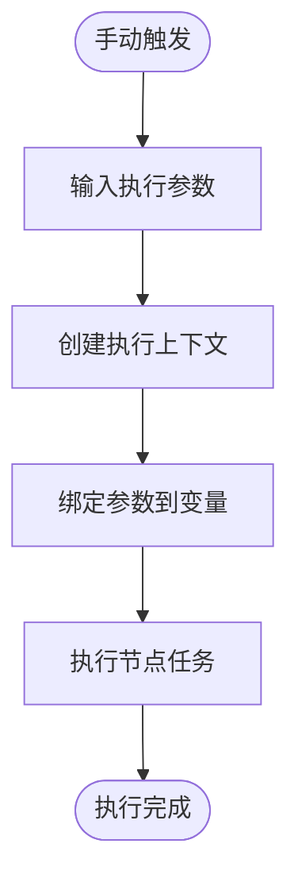
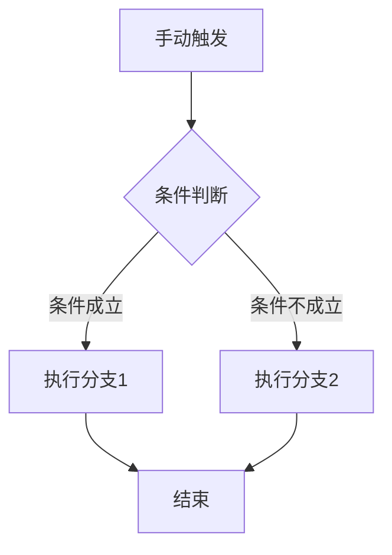
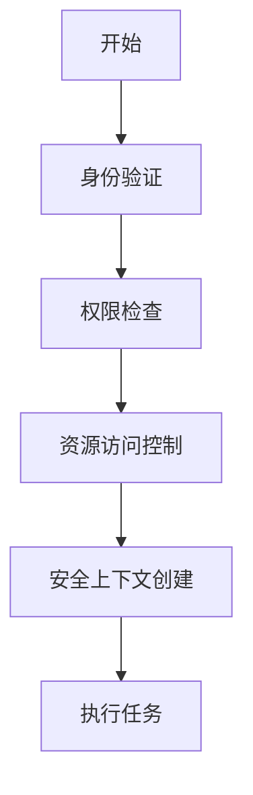

# 手动执行

<cite>
**本文档引用的文件**
- [manual-workflow.md](file://docs/spec-templates/workflows/manual-workflow.md)
- [ManualWorkflow.schedule.schema.json](file://dwcli/dwcli/schemas/ManualWorkflow.schedule.schema.json)
- [manual-workflow.template.json](file://dwcli/dwcli/templates/manual-workflow.template.json)
- [SpecTrigger.schema.json](file://spec/src/main/resources/spec/schema/SpecTrigger.schema.json)
- [SpecNode.schema.json](file://spec/src/main/resources/spec/schema/SpecNode.schema.json)
- [SpecVariable.schema.json](file://spec/src/main/resources/spec/schema/SpecVariable.schema.json)
- [node-properties-rerunmode.md](file://schema/docs/node-properties-rerunmode.md)
- [node-properties-instancemode.md](file://schema/docs/node-properties-instancemode.md)
- [node-properties-nodeinputartifact.md](file://schema/docs/node-properties-nodeinputartifact.md)
- [node-properties-nodeoutputartifact.md](file://schema/docs/node-properties-nodeoutputartifact.md)
- [trigger-properties-type.md](file://schema/docs/trigger-properties-type.md)
</cite>

## 目录
1. [简介](#简介)
2. [手动工作流的触发方式](#手动工作流的触发方式)
3. [执行上下文的创建](#执行上下文的创建)
4. [手动执行的控制机制](#手动执行的控制机制)
5. [交互式执行特性](#交互式执行特性)
6. [使用场景示例](#使用场景示例)
7. [与自动化系统的集成](#与自动化系统的集成)

## 简介

手动执行是dataworks-spec项目中用于临时任务、测试任务和一次性数据处理的重要功能。与周期性调度的工作流不同，手动工作流（ManualWorkflow）通过人工触发执行，适用于需要即时响应或临时处理的场景。本手册详细说明了手动执行的各个方面，包括触发方式、执行上下文、控制机制和交互特性。

**Section sources**
- [manual-workflow.md](file://docs/spec-templates/workflows/manual-workflow.md)

## 手动工作流的触发方式

手动工作流的触发方式主要分为即时执行、参数化执行和条件触发三种模式。

### 即时执行

即时执行是最简单的手动触发方式，用户通过界面或命令行直接启动工作流，无需任何参数配置。在dataworks-spec中，手动工作流通过设置`kind`为"ManualWorkflow"来标识，且不需要定义`spec.triggers`字段。

```json
{
  "version": "1.1.0",
  "kind": "ManualWorkflow",
  "spec": {
    "name": "manual_test_workflow",
    "nodes": [
      {
        "id": "node_001",
        "name": "data_processing_task",
        "trigger": {
          "type": "Manual",
          "id": "trigger_manual_001"
        }
      }
    ]
  }
}
```

**Section sources**
- [manual-workflow.md](file://docs/spec-templates/workflows/manual-workflow.md)
- [ManualWorkflow.schedule.schema.json](file://dwcli/dwcli/schemas/ManualWorkflow.schedule.schema.json)

### 参数化执行

参数化执行允许用户在触发工作流时传递自定义参数，这些参数可以在工作流的各个节点中使用。参数通过变量（Variable）机制实现，支持常量、系统变量和传递变量等多种类型。



**Diagram sources**
- [SpecVariable.schema.json](file://spec/src/main/resources/spec/schema/SpecVariable.schema.json)
- [manual-workflow.md](file://docs/spec-templates/workflows/manual-workflow.md)

**Section sources**
- [SpecVariable.schema.json](file://spec/src/main/resources/spec/schema/SpecVariable.schema.json)
- [manual-workflow.md](file://docs/spec-templates/workflows/manual-workflow.md)

### 条件触发

虽然手动工作流本身是人工触发的，但可以通过条件判断来控制节点的执行。条件触发通常与分支（Branch）节点结合使用，根据输入参数或运行时状态决定执行路径。



**Diagram sources**
- [manual-workflow.md](file://docs/spec-templates/workflows/manual-workflow.md)

**Section sources**
- [manual-workflow.md](file://docs/spec-templates/workflows/manual-workflow.md)

## 执行上下文的创建

执行上下文的创建是手动执行过程中的关键步骤，它包含了参数传递、环境变量设置和安全上下文初始化等重要环节。

### 参数传递

参数传递通过变量系统实现，支持多种变量类型和作用域。在dataworks-spec中，变量可以定义在工作流级别或节点级别，通过`variables`字段进行配置。

| 字段 | 类型 | 说明 |
|------|------|------|
| name | string | 变量名称 |
| scope | string | 作用域：Workflow、NodeContext等 |
| type | string | 变量类型：Constant、System、PassThrough等 |
| value | string | 变量值 |

**Section sources**
- [SpecVariable.schema.json](file://spec/src/main/resources/spec/schema/SpecVariable.schema.json)

### 环境变量设置

环境变量设置通过`runtimeResource`和`script.runtime`等字段配置，用于指定执行环境的资源组、计算引擎等信息。这些设置确保了工作流在正确的环境中运行。

```json
{
  "runtimeResource": {
    "resourceGroup": "group_524257424564736",
    "resourceGroupId": "310003"
  },
  "script": {
    "runtime": {
      "command": "ODPS_SQL",
      "engine": "MaxCompute"
    }
  }
}
```

**Section sources**
- [manual-workflow.md](file://docs/spec-templates/workflows/manual-workflow.md)

### 安全上下文初始化

安全上下文初始化包括身份验证、权限检查和资源访问控制等。虽然具体的实现细节在代码中被注释，但从上下文可以看出，系统通过`DataSourceParameters`等机制来管理数据库连接参数和安全信息。



**Diagram sources**
- [ProcedureParameters.java](file://client/migrationx/migrationx-domain/migrationx-domain-dolphinscheduler/src/main/java/com/aliyun/dataworks/migrationx/domain/dataworks/dolphinscheduler/v3/task/procedure/ProcedureParameters.java)

**Section sources**
- [ProcedureParameters.java](file://client/migrationx/migrationx-domain/migrationx-domain-dolphinscheduler/src/main/java/com/aliyun/dataworks/migrationx/domain/dataworks/dolphinscheduler/v3/task/procedure/ProcedureParameters.java)

## 手动执行的控制机制

手动执行提供了多种控制机制，包括执行中断、重试控制和优先级调整，以满足不同场景下的需求。

### 执行中断

执行中断允许用户在任务执行过程中主动停止执行。虽然具体的中断机制在代码中未完全实现，但从`rerunMode`等字段可以看出系统支持执行控制。

### 重试控制

重试控制通过`rerunMode`、`rerunTimes`和`rerunInterval`等字段配置，支持不同的重试策略：

| 重试模式 | 说明 |
|---------|------|
| Allowed | 任何情况下都允许重跑 |
| Denied | 任何情况下都不允许重跑 |
| FailureAllowed | 仅在失败情况下允许重跑 |

```json
{
  "rerunMode": "Allowed",
  "rerunTimes": 2,
  "rerunInterval": 180000
}
```

**Section sources**
- [node-properties-rerunmode.md](file://schema/docs/node-properties-rerunmode.md)
- [manual-workflow.md](file://docs/spec-templates/workflows/manual-workflow.md)

### 优先级调整

优先级调整通过`priority`字段实现，允许用户为工作流或节点设置执行优先级。优先级数值越小，优先级越高。

```json
{
  "strategy": {
    "priority": 1,
    "priorityWeightStrategy": "Disabled"
  }
}
```

**Section sources**
- [manual-workflow.md](file://docs/spec-templates/workflows/manual-workflow.md)

## 交互式执行特性

交互式执行提供了实时日志查看、执行进度监控和结果获取等特性，增强了用户体验。

### 实时日志查看

系统支持实时查看执行日志，帮助用户监控任务执行状态和排查问题。

### 执行进度监控

通过工作流定义中的`flow`字段，系统可以跟踪节点间的依赖关系和执行进度。

```json
{
  "flow": [
    {
      "nodeId": "node_002",
      "depends": [
        {
          "type": "Normal",
          "output": "node_001",
          "refTableName": "output_table_001"
        }
      ]
    }
  ]
}
```

**Section sources**
- [manual-workflow.md](file://docs/spec-templates/workflows/manual-workflow.md)

### 结果获取

结果获取通过节点输出（nodeOutputs）定义，明确指定每个节点的产出信息。


**Diagram sources**
- [node-properties-nodeoutputartifact.md](file://schema/docs/node-properties-nodeoutputartifact.md)

**Section sources**
- [node-properties-nodeoutputartifact.md](file://schema/docs/node-properties-nodeoutputartifact.md)

## 使用场景示例

### 数据探查

数据探查场景通常需要快速执行SQL查询来分析数据质量或验证数据假设。

```json
{
  "spec": {
    "nodes": [
      {
        "id": "data_exploration",
        "name": "数据探查任务",
        "script": {
          "language": "odps-sql",
          "path": "exploration/query.sql"
        }
      }
    ]
  }
}
```

**Section sources**
- [manual-workflow.md](file://docs/spec-templates/workflows/manual-workflow.md)

### 故障排查

故障排查场景需要重新执行失败的任务以验证修复效果。

```json
{
  "rerunMode": "Allowed",
  "timeout": 3600
}
```

**Section sources**
- [manual-workflow.md](file://docs/spec-templates/workflows/manual-workflow.md)

### 临时任务处理

临时任务处理包括数据修复、一次性数据迁移等。

```json
{
  "kind": "ManualWorkflow",
  "spec": {
    "name": "数据修复任务",
    "nodes": [
      {
        "id": "repair_task",
        "name": "修复异常数据"
      }
    ]
  }
}
```

**Section sources**
- [manual-workflow.md](file://docs/spec-templates/workflows/manual-workflow.md)

## 与自动化系统的集成

### API调用

系统提供了RESTful API接口，支持通过HTTP请求触发手动执行。

### Web界面操作

通过Web界面可以直观地创建、配置和触发手动工作流。

### 命令行工具使用

命令行工具（CLI）提供了`dwcli`等工具，支持模板化创建和执行手动工作流。

```bash
dwcli create workflow --template manual-workflow --name my_manual_task
```

**Section sources**
- [manual-workflow.template.json](file://dwcli/dwcli/templates/manual-workflow.template.json)