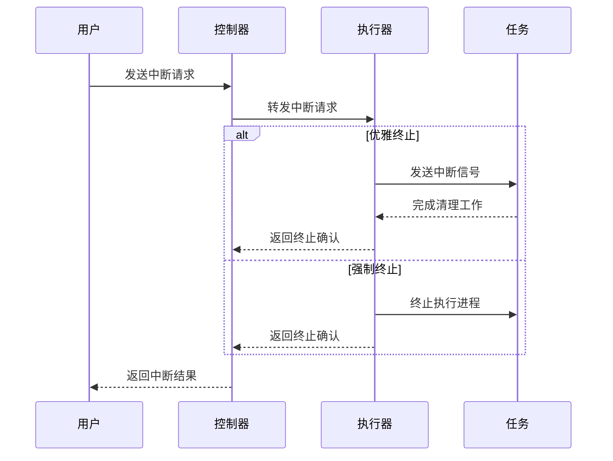
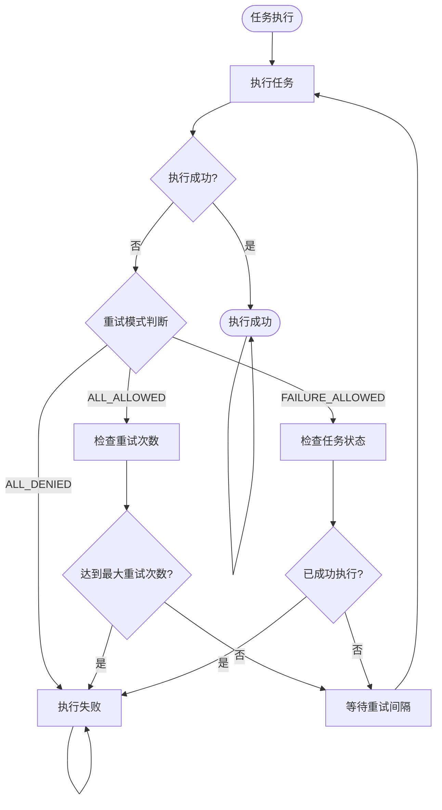
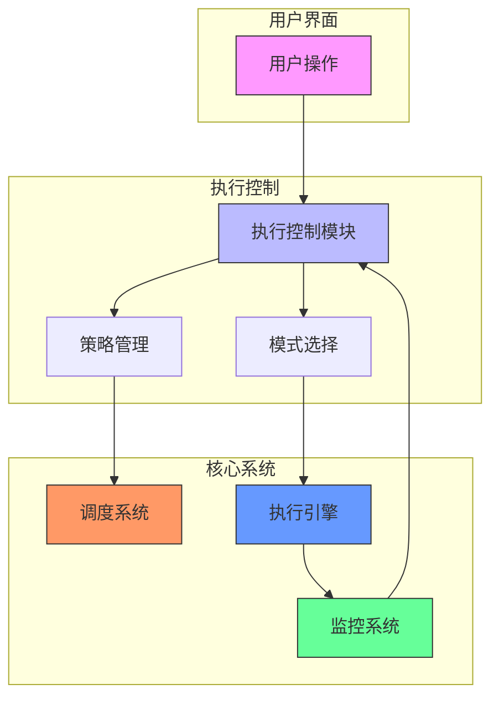

# 执行控制

<cite>
**本文档引用的文件**
- [SpecScheduleStrategy.java](file://spec/src/main/java/com/aliyun/dataworks/common/spec/domain/ref/SpecScheduleStrategy.java)
- [SpecNode.java](file://spec/src/main/java/com/aliyun/dataworks/common/spec/domain/ref/SpecNode.java)
- [SpecWorkflow.java](file://spec/src/main/java/com/aliyun/dataworks/common/spec/domain/ref/SpecWorkflow.java)
- [FailureStrategy.java](file://spec/src/main/java/com/aliyun/dataworks/common/spec/domain/enums/FailureStrategy.java)
- [NodeRerunModeType.java](file://spec/src/main/java/com/aliyun/dataworks/common/spec/domain/enums/NodeRerunModeType.java)
- [PriorityWeightStrategy.java](file://spec/src/main/java/com/aliyun/dataworks/common/spec/domain/enums/PriorityWeightStrategy.java)
- [NodeRecurrenceType.java](file://spec/src/main/java/com/aliyun/dataworks/common/spec/domain/enums/NodeRecurrenceType.java)
- [NodeInstanceModeType.java](file://spec/src/main/java/com/aliyun/dataworks/common/spec/domain/enums/NodeInstanceModeType.java)
- [RerunMode.java](file://client/migrationx/migrationx-domain/migrationx-domain-dataworks/src/main/java/com/aliyun/dataworks/migrationx/domain/dataworks/objects/types/RerunMode.java)
- [InProcessAppHandle.java](file://client/client-spark-utils/src/main/java/com/aliyun/dataworks/client/utils/spark/command/InProcessAppHandle.java)
- [ChildProcAppHandle.java](file://client/client-spark-utils/src/main/java/com/aliyun/dataworks/client/utils/spark/command/ChildProcAppHandle.java)
- [LauncherConnection.java](file://client/client-spark-utils/src/main/java/com/aliyun/dataworks/client/utils/spark/command/LauncherConnection.java)
- [ExecuteUtils.java](file://client/migrationx/migrationx-common/src/main/java/com/aliyun/migrationx/common/utils/ExecuteUtils.java)
- [manual_workflow_spec_with_priority.json](file://spec/src/test/resources/spec/manual_workflow_spec_with_priority.json)
</cite>

## 目录
1. [引言](#引言)
2. [执行中断机制](#执行中断机制)
3. [重试控制策略](#重试控制策略)
4. [优先级调整机制](#优先级调整机制)
5. [执行控制API接口](#执行控制api接口)
6. [安全考虑](#安全考虑)
7. [系统组件交互](#系统组件交互)
8. [结论](#结论)

## 引言

dataworks-spec项目提供了一套完整的执行控制机制，用于管理数据工作流的手动执行过程。该机制涵盖了执行中断、重试控制和优先级调整等核心功能，确保工作流在复杂环境下的可靠执行。执行控制机制通过规范化的数据结构和API接口实现，支持优雅终止和强制终止两种中断模式，提供灵活的重试策略，并允许静态和动态的优先级调整。本文档详细阐述这些控制机制的实现原理、配置方法和使用示例。

**本文档引用的文件**
- [SpecScheduleStrategy.java](file://spec/src/main/java/com/aliyun/dataworks/common/spec/domain/ref/SpecScheduleStrategy.java)
- [SpecNode.java](file://spec/src/main/java/com/aliyun/dataworks/common/spec/domain/ref/SpecNode.java)
- [SpecWorkflow.java](file://spec/src/main/java/com/aliyun/dataworks/common/spec/domain/ref/SpecWorkflow.java)

## 执行中断机制

执行中断机制是dataworks-spec项目中确保执行过程可控性的核心功能。该机制支持两种中断模式：优雅终止和强制终止，以适应不同的执行场景和需求。

### 优雅终止

优雅终止模式旨在以最小的副作用结束执行过程。当触发优雅终止时，系统会向正在执行的任务发送中断信号，允许任务完成当前操作并进行必要的清理工作。在InProcessAppHandle实现中，通过调用`app.interrupt()`方法向执行线程发送中断信号，同时将任务状态设置为KILLED。这种模式确保了资源的正确释放和状态的一致性，避免了数据损坏或资源泄漏的风险。

### 强制终止

强制终止模式用于在紧急情况下立即停止执行过程。与优雅终止不同，强制终止不等待任务完成当前操作，而是直接终止执行进程。在ChildProcAppHandle实现中，通过终止子进程的方式实现强制终止。当子进程返回非零退出码时，系统会将任务状态设置为FAILED，确保执行过程的完整性得到维护。强制终止适用于任务出现死锁或无限循环等无法通过优雅方式解决的异常情况。



**图示来源**
- [InProcessAppHandle.java](file://client/client-spark-utils/src/main/java/com/aliyun/dataworks/client/utils/spark/command/InProcessAppHandle.java#L42-L54)
- [ChildProcAppHandle.java](file://client/client-spark-utils/src/main/java/com/aliyun/dataworks/client/utils/spark/command/ChildProcAppHandle.java#L121-L126)
- [LauncherConnection.java](file://client/client-spark-utils/src/main/java/com/aliyun/dataworks/client/utils/spark/command/LauncherConnection.java#L74-L89)

**本节来源**
- [InProcessAppHandle.java](file://client/client-spark-utils/src/main/java/com/aliyun/dataworks/client/utils/spark/command/InProcessAppHandle.java)
- [ChildProcAppHandle.java](file://client/client-spark-utils/src/main/java/com/aliyun/dataworks/client/utils/spark/command/ChildProcAppHandle.java)
- [LauncherConnection.java](file://client/client-spark-utils/src/main/java/com/aliyun/dataworks/client/utils/spark/command/LauncherConnection.java)

## 重试控制策略

重试控制策略是确保任务可靠执行的重要机制。dataworks-spec项目提供了灵活的重试配置选项，包括重试次数、重试间隔和失败条件判断，以应对各种执行环境中的不确定性。

### 重试次数与间隔

重试控制通过`rerunTimes`和`rerunInterval`两个参数实现。`rerunTimes`定义了任务失败后允许的最大重试次数，而`rerunInterval`指定了重试之间的等待时间间隔（以毫秒为单位）。这些参数可以在节点级别或工作流级别进行配置，为不同任务提供差异化的重试策略。例如，对于可能因临时网络问题失败的任务，可以配置较高的重试次数和较短的重试间隔。

### 失败条件判断

失败条件判断通过`rerunMode`参数实现，支持三种模式：`ALL_ALLOWED`（所有实例均可重跑）、`FAILURE_ALLOWED`（仅失败时可重跑）和`ALL_DENIED`（所有情况下均不可重跑）。这种细粒度的控制允许用户根据任务特性和业务需求选择合适的重试策略。`FAILURE_ALLOWED`模式特别适用于生产环境，确保任务在失败后可以重试，但成功执行后不会被意外重跑。



**图示来源**
- [SpecScheduleStrategy.java](file://spec/src/main/java/com/aliyun/dataworks/common/spec/domain/ref/SpecScheduleStrategy.java#L52-L57)
- [SpecNode.java](file://spec/src/main/java/com/aliyun/dataworks/common/spec/domain/ref/SpecNode.java#L66-L70)
- [NodeRerunModeType.java](file://spec/src/main/java/com/aliyun/dataworks/common/spec/domain/enums/NodeRerunModeType.java)

**本节来源**
- [SpecScheduleStrategy.java](file://spec/src/main/java/com/aliyun/dataworks/common/spec/domain/ref/SpecScheduleStrategy.java)
- [SpecNode.java](file://spec/src/main/java/com/aliyun/dataworks/common/spec/domain/ref/SpecNode.java)
- [NodeRerunModeType.java](file://spec/src/main/java/com/aliyun/dataworks/common/spec/domain/enums/NodeRerunModeType.java)
- [RerunMode.java](file://client/migrationx/migrationx-domain/migrationx-domain-dataworks/src/main/java/com/aliyun/dataworks/migrationx/domain/dataworks/objects/types/RerunMode.java)

## 优先级调整机制

优先级调整机制为任务调度提供了灵活性，支持静态优先级设置和动态优先级调整两种模式，确保关键任务能够获得足够的资源和执行机会。

### 静态优先级设置

静态优先级通过`priority`参数在任务定义时设置。该参数为整数值，数值越大表示优先级越高。优先级设置可以应用于单个节点或整个工作流，为不同任务分配不同的执行优先级。例如，在手动工作流中，可以通过设置`priority`为3来确保该工作流在调度队列中获得较高的执行优先级。

### 动态优先级调整

动态优先级调整通过`priorityWeightStrategy`参数实现，支持`DISABLED`和`UPSTREAM`两种策略。`UPSTREAM`策略允许根据上游任务的优先级动态调整当前任务的优先级，形成优先级传递链。这种机制特别适用于复杂的工作流，确保关键路径上的任务能够获得更高的调度优先级。最大内部并发数`maxInternalConcurrency`参数进一步控制了工作流内部节点的并发执行数量，防止资源过度消耗。

```mermaid
classDiagram
class SpecScheduleStrategy {
+Integer priority
+PriorityWeightStrategy priorityWeightStrategy
+Integer maxInternalConcurrency
+Integer timeout
+TimeUnit timeoutUnit
+FailureStrategy failureStrategy
}
class PriorityWeightStrategy {
+DISABLED
+UPSTREAM
}
class FailureStrategy {
+CONTINUE
+BREAK
}
SpecScheduleStrategy --> PriorityWeightStrategy : "包含"
SpecScheduleStrategy --> FailureStrategy : "包含"
note right of SpecScheduleStrategy
调度策略类，包含优先级、
重试、超时等执行控制参数
end note
```

**图示来源**
- [SpecScheduleStrategy.java](file://spec/src/main/java/com/aliyun/dataworks/common/spec/domain/ref/SpecScheduleStrategy.java)
- [PriorityWeightStrategy.java](file://spec/src/main/java/com/aliyun/dataworks/common/spec/domain/enums/PriorityWeightStrategy.java)
- [manual_workflow_spec_with_priority.json](file://spec/src/test/resources/spec/manual_workflow_spec_with_priority.json)

**本节来源**
- [SpecScheduleStrategy.java](file://spec/src/main/java/com/aliyun/dataworks/common/spec/domain/ref/SpecScheduleStrategy.java)
- [PriorityWeightStrategy.java](file://spec/src/main/java/com/aliyun/dataworks/common/spec/domain/enums/PriorityWeightStrategy.java)
- [manual_workflow_spec_with_priority.json](file://spec/src/test/resources/spec/manual_workflow_spec_with_priority.json)

## 执行控制API接口

执行控制API接口为用户提供了对执行过程的编程控制能力。这些接口通过规范化的数据结构和方法实现，支持对执行参数的查询、设置和修改。

### API接口说明

执行控制API主要通过`SpecScheduleStrategy`和`SpecNode`类提供。`SpecScheduleStrategy`类定义了调度策略相关的所有参数，包括优先级、重试策略、超时设置等。`SpecNode`类则提供了对单个任务节点的控制接口，允许用户查询和修改节点的执行状态和参数。通过这些API，用户可以实现对执行过程的精细控制，如动态调整重试次数、修改超时时间等。

### 使用示例

使用执行控制API的典型示例如下：首先创建`SpecScheduleStrategy`实例，然后设置所需的执行控制参数，最后将策略应用到工作流或节点。例如，可以通过设置`failureStrategy`为`CONTINUE`来实现失败继续策略，或通过设置`timeout`和`timeoutUnit`来定义任务超时时间。这些API接口的设计遵循了面向对象的原则，提供了良好的封装性和易用性。

**本节来源**
- [SpecScheduleStrategy.java](file://spec/src/main/java/com/aliyun/dataworks/common/spec/domain/ref/SpecScheduleStrategy.java)
- [SpecNode.java](file://spec/src/main/java/com/aliyun/dataworks/common/spec/domain/ref/SpecNode.java)
- [SpecWorkflow.java](file://spec/src/main/java/com/aliyun/dataworks/common/spec/domain/ref/SpecWorkflow.java)

## 安全考虑

执行控制机制在设计时充分考虑了安全性，通过权限验证和操作审计等措施确保执行过程的安全可控。

### 权限验证

权限验证机制确保只有授权用户才能执行关键的控制操作。在执行中断、重试等敏感操作前，系统会验证用户的身份和权限。这种验证通常通过API网关或服务层的认证机制实现，确保操作的安全性。对于高优先级任务或关键工作流，可能需要更严格的权限验证，如多因素认证或审批流程。

### 操作审计

操作审计功能记录所有执行控制操作的详细信息，包括操作时间、操作用户、操作类型和操作结果。这些审计日志对于故障排查、安全分析和合规性检查至关重要。通过分析审计日志，管理员可以追踪执行过程中的所有变更，识别潜在的安全风险，并确保操作的可追溯性。审计日志通常存储在安全的集中式日志系统中，防止篡改和丢失。

**本节来源**
- [ExecuteUtils.java](file://client/migrationx/migrationx-common/src/main/java/com/aliyun/migrationx/common/utils/ExecuteUtils.java)
- [SpecNode.java](file://spec/src/main/java/com/aliyun/dataworks/common/spec/domain/ref/SpecNode.java)

## 系统组件交互

执行控制机制与dataworks-spec项目的其他系统组件紧密交互，形成一个完整的执行管理体系。

### 与调度系统的交互

执行控制机制与调度系统紧密集成，将用户定义的控制策略转换为调度指令。当工作流被提交执行时，调度系统会读取`SpecScheduleStrategy`中的参数，如优先级、超时时间等，并据此安排任务的执行顺序和资源分配。这种交互确保了控制策略能够有效影响实际的执行过程。

### 与监控系统的交互

执行控制机制与监控系统协同工作，实现对执行过程的实时监控和动态调整。监控系统收集任务的执行状态、资源使用情况等信息，并将这些信息反馈给执行控制机制。基于这些反馈，执行控制机制可以动态调整重试策略、优先级等参数，优化执行效果。例如，当监控系统检测到资源紧张时，执行控制机制可以自动降低非关键任务的优先级。



**图示来源**
- [SpecScheduleStrategy.java](file://spec/src/main/java/com/aliyun/dataworks/common/spec/domain/ref/SpecScheduleStrategy.java)
- [SpecNode.java](file://spec/src/main/java/com/aliyun/dataworks/common/spec/domain/ref/SpecNode.java)
- [SpecWorkflow.java](file://spec/src/main/java/com/aliyun/dataworks/common/spec/domain/ref/SpecWorkflow.java)

**本节来源**
- [SpecScheduleStrategy.java](file://spec/src/main/java/com/aliyun/dataworks/common/spec/domain/ref/SpecScheduleStrategy.java)
- [SpecNode.java](file://spec/src/main/java/com/aliyun/dataworks/common/spec/domain/ref/SpecNode.java)
- [SpecWorkflow.java](file://spec/src/main/java/com/aliyun/dataworks/common/spec/domain/ref/SpecWorkflow.java)

## 结论

dataworks-spec项目的执行控制机制提供了一套完整、灵活且安全的执行管理方案。通过优雅终止和强制终止两种中断模式，系统能够在保证数据完整性的同时应对各种异常情况。灵活的重试控制策略和优先级调整机制确保了任务在复杂环境下的可靠执行和资源的合理分配。规范化的API接口和严格的安全考虑使得执行控制既易于使用又安全可靠。这些机制的协同工作，为数据工作流的稳定运行提供了坚实保障。