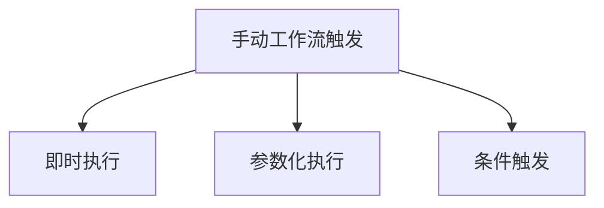
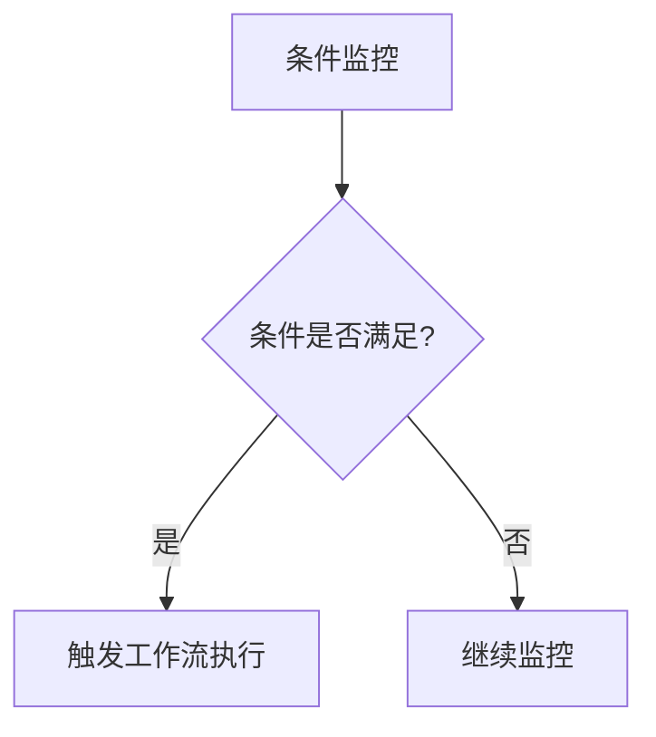
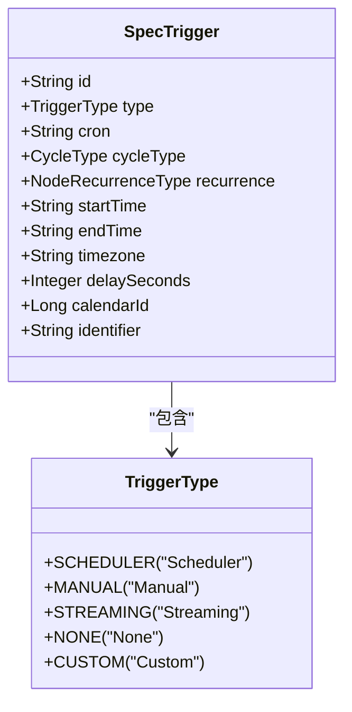
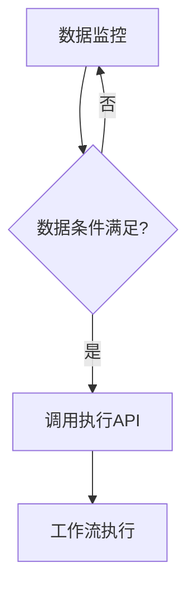

# 触发机制

<cite>
**本文档引用的文件**
- [trigger.schema.json](file://schema/trigger.schema.json)
- [SpecTrigger.java](file://spec/src/main/java/com/aliyun/dataworks/common/spec/domain/ref/SpecTrigger.java)
- [TriggerType.java](file://spec/src/main/java/com/aliyun/dataworks/common/spec/domain/enums/TriggerType.java)
- [manual-workflow.md](file://docs/spec-templates/workflows/manual-workflow.md)
- [SpecTrigger.schema.json](file://spec/src/main/resources/spec/schema/SpecTrigger.schema.json)
- [TriggerConverter.java](file://client/migrationx/migrationx-transformer/src/main/java/com/aliyun/dataworks/migrationx/transformer/dataworks/converter/dolphinscheduler/v1/workflow/TriggerConverter.java)
- [SpecTriggerWriter.java](file://spec/src/main/java/com/aliyun/dataworks/common/spec/writer/impl/SpecTriggerWriter.java)
</cite>

## 目录
1. [手动工作流触发机制概述](#手动工作流触发机制概述)
2. [三种触发方式详解](#三种触发方式详解)
3. [触发参数传递机制](#触发参数传递机制)
4. [触发条件配置方法](#触发条件配置方法)
5. [安全机制](#安全机制)

## 手动工作流触发机制概述

手动工作流（ManualWorkflow）是一种无需配置调度策略即可执行的工作流类型，适用于临时任务、测试任务等场景。根据项目规范，ManualWorkflow具有以下特点：
- `kind` 必须为 "ManualWorkflow"
- 不需要定义 `spec.triggers` 数组
- 所有节点的 `trigger.type` 必须为 "Manual"

手动工作流不支持跨周期依赖（如CrossCycleDependsOnSelf），且节点ID在整个Spec中必须唯一。这种工作流类型主要通过即时执行、参数化执行和条件触发三种方式来启动。



**图表来源**
- [manual-workflow.md](file://docs/spec-templates/workflows/manual-workflow.md#L1-L236)

**本节来源**
- [manual-workflow.md](file://docs/spec-templates/workflows/manual-workflow.md#L1-L236)
- [trigger.schema.json](file://schema/trigger.schema.json#L1-L36)

## 三种触发方式详解

### 即时执行

即时执行是最简单的触发方式，用户可以通过API接口、Web界面或命令行工具直接启动工作流。在配置中，只需要将触发器类型设置为"Manual"即可。

```json
{
  "trigger": {
    "type": "Manual",
    "id": "trigger_manual_001"
  }
}
```

即时执行不需要任何额外的配置参数，适用于快速测试和一次性任务执行。当用户发起执行请求时，系统会立即创建一个执行实例并开始运行工作流。

### 参数化执行

参数化执行允许用户在触发工作流时传递自定义参数，这些参数可以在工作流的各个节点中使用。参数化执行通过Spec中的variables字段来定义可变参数。

```json
"variables": [
  {
    "artifactType": "Variable",
    "name": "input_param",
    "scope": "Workflow",
    "type": "Constant",
    "value": "test_value"
  }
]
```

参数化执行支持多种参数类型，包括常量、系统变量和节点输出等。用户可以在执行时覆盖这些参数的默认值，从而实现灵活的任务配置。

### 条件触发

条件触发是基于特定条件满足时自动启动工作流的机制。虽然ManualWorkflow本身是手动触发类型，但可以通过外部系统监控条件并在条件满足时调用执行API来实现条件触发。

条件可以包括时间条件、数据条件和外部事件条件。例如，当某个数据表的数据量达到阈值，或者接收到特定的外部消息时，就可以触发工作流执行。



**图表来源**
- [SpecTrigger.java](file://spec/src/main/java/com/aliyun/dataworks/common/spec/domain/ref/SpecTrigger.java#L1-L51)
- [TriggerType.java](file://spec/src/main/java/com/aliyun/dataworks/common/spec/domain/enums/TriggerType.java#L1-L56)

**本节来源**
- [SpecTrigger.java](file://spec/src/main/java/com/aliyun/dataworks/common/spec/domain/ref/SpecTrigger.java#L1-L51)
- [TriggerType.java](file://spec/src/main/java/com/aliyun/dataworks/common/spec/domain/enums/TriggerType.java#L1-L56)
- [manual-workflow.md](file://docs/spec-templates/workflows/manual-workflow.md#L1-L236)

## 触发参数传递机制

### 参数类型与格式

触发参数的传递机制基于SpecTrigger类的定义，支持多种参数类型：

| 参数类型 | 说明 |
|--------|------|
| id | 触发器唯一标识符 |
| type | 触发器类型，ManualWorkflow中为"Manual" |
| startTime | 周期调度的起始生效时间 |
| endTime | 周期调度的结束生效时间 |
| timezone | 周期调度时间的时区 |
| delaySeconds | 延迟执行的秒数 |

参数格式遵循JSON Schema规范，所有字符串类型的参数都应使用标准的时间格式（如ISO 8601）。

### 默认值处理

系统对部分参数提供了默认值处理机制：
- 如果未指定timezone，默认使用"Asia/Shanghai"时区
- delaySeconds默认为0，表示不延迟执行
- recurrence类型默认为NORMAL

当用户未提供某些可选参数时，系统会自动应用这些默认值，确保工作流能够正常执行。



**图表来源**
- [SpecTrigger.java](file://spec/src/main/java/com/aliyun/dataworks/common/spec/domain/ref/SpecTrigger.java#L1-L51)
- [TriggerType.java](file://spec/src/main/java/com/aliyun/dataworks/common/spec/domain/enums/TriggerType.java#L1-L56)

**本节来源**
- [SpecTrigger.java](file://spec/src/main/java/com/aliyun/dataworks/common/spec/domain/ref/SpecTrigger.java#L1-L51)
- [SpecTrigger.schema.json](file://spec/src/main/resources/spec/schema/SpecTrigger.schema.json#L1-L51)
- [TriggerType.java](file://spec/src/main/java/com/aliyun/dataworks/common/spec/domain/enums/TriggerType.java#L1-L56)

## 触发条件配置方法

### 时间条件

时间条件配置主要通过startTime和endTime参数来实现。虽然ManualWorkflow不使用cron表达式进行周期调度，但仍然可以设置时间窗口来控制执行时机。

```json
{
  "startTime": "2024-05-15 00:00:00",
  "endTime": "2024-05-16 00:00:00",
  "timezone": "Asia/Shanghai"
}
```

### 数据条件

数据条件通常由外部监控系统实现，当检测到特定数据状态变化时触发工作流执行。例如，当数据表中的记录数超过阈值时：



### 外部事件条件

外部事件条件可以通过消息队列或Webhook来实现。系统监听特定的事件源，当收到匹配的事件时触发工作流执行。

**本节来源**
- [TriggerConverter.java](file://client/migrationx/migrationx-transformer/src/main/java/com/aliyun/dataworks/migrationx/transformer/dataworks/converter/dolphinscheduler/v1/workflow/TriggerConverter.java#L30-L61)
- [SpecTriggerWriter.java](file://spec/src/main/java/com/aliyun/dataworks/common/spec/writer/impl/SpecTriggerWriter.java#L1-L31)

## 安全机制

### 权限验证

系统在执行任何触发操作前都会进行严格的权限验证。只有具有相应权限的用户才能触发工作流执行。权限验证包括：
- 用户身份认证
- 工作流访问权限检查
- 操作权限验证

### 调用频率限制

为了防止滥用和资源耗尽，系统实施了调用频率限制机制：
- 每个用户每分钟最多触发N次执行
- 每个工作流每小时最多被触发M次
- 突发流量的平滑处理

### 审计日志记录

所有触发操作都会被详细记录在审计日志中，包括：
- 触发时间
- 用户标识
- 工作流ID
- 传递的参数
- 执行结果

这些日志可用于安全审计、问题排查和使用情况分析。

**本节来源**
- [SpecTriggerWriter.java](file://spec/src/main/java/com/aliyun/dataworks/common/spec/writer/impl/SpecTriggerWriter.java#L1-L31)
- [TriggerConverter.java](file://client/migrationx/migrationx-transformer/src/main/java/com/aliyun/dataworks/migrationx/transformer/dataworks/converter/dolphinscheduler/v1/workflow/TriggerConverter.java#L30-L61)