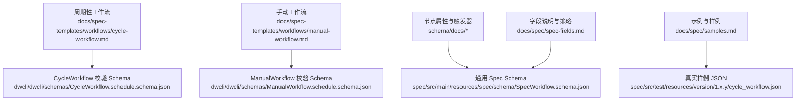
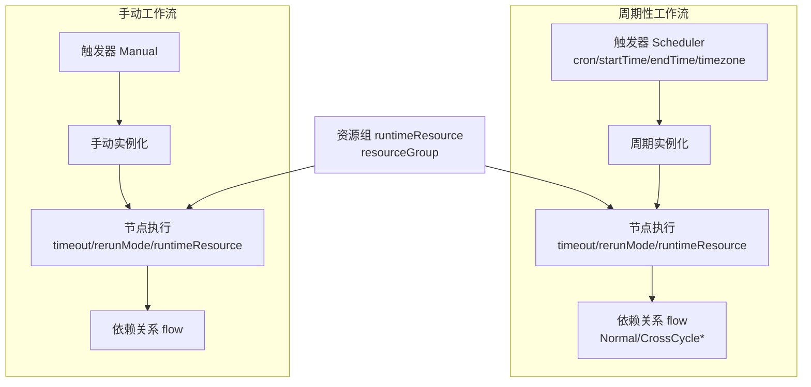
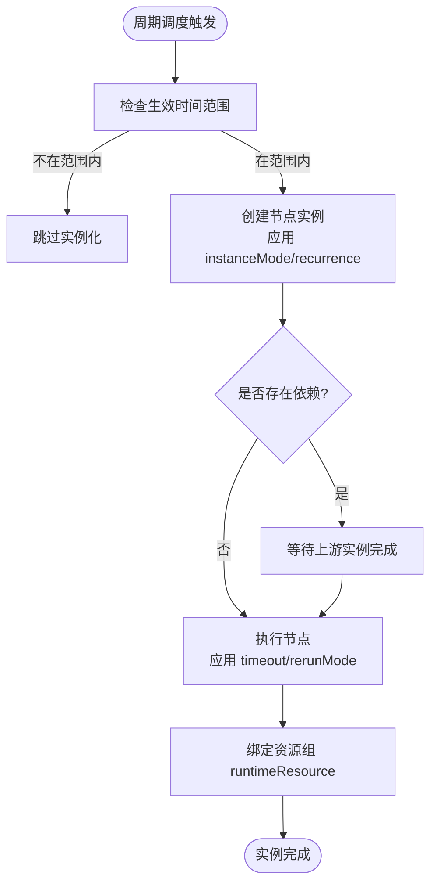
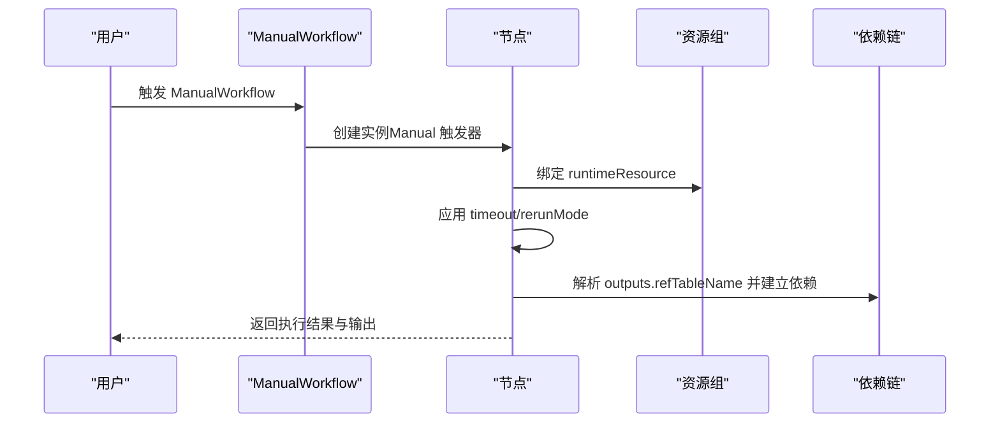
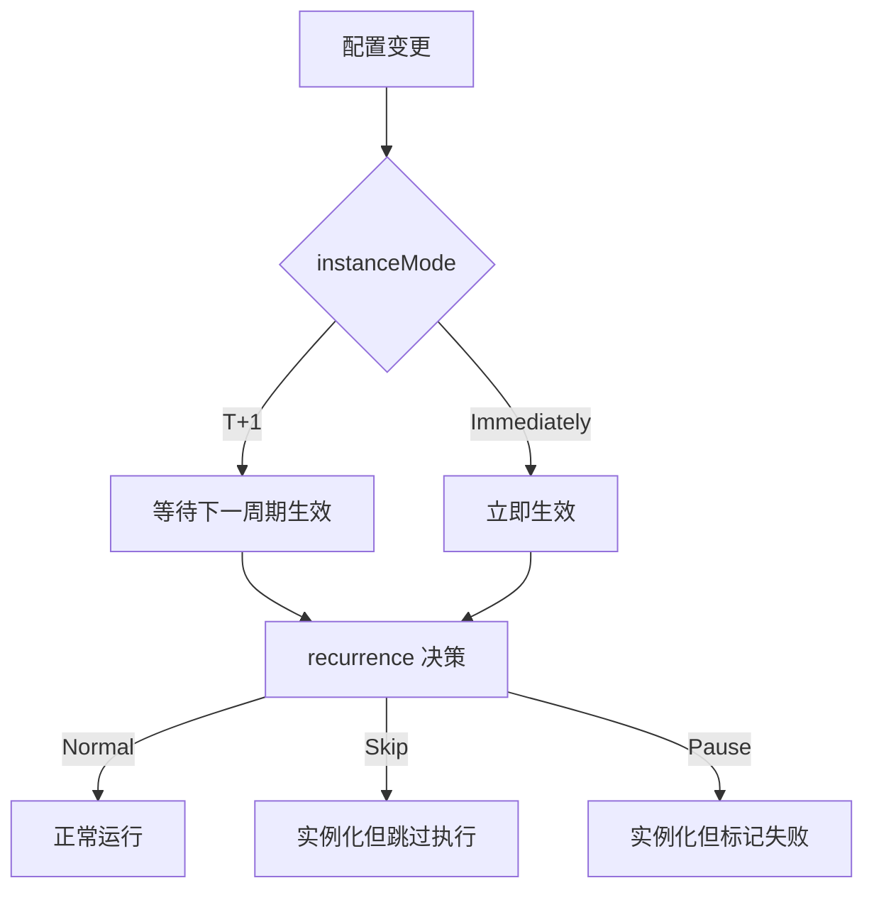
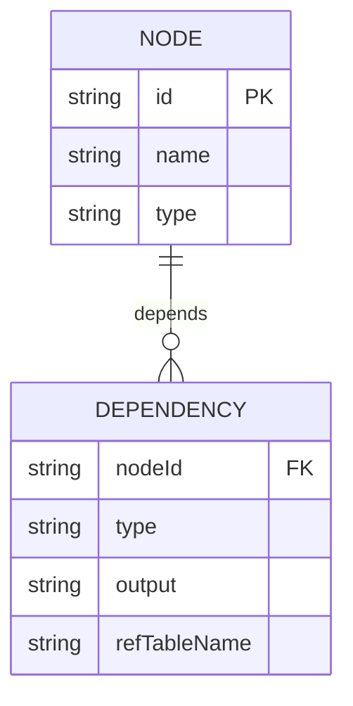

# 执行模式

<cite>
**本文引用的文件**
- [cycle-workflow.md](file://docs/spec-templates/workflows/cycle-workflow.md)
- [manual-workflow.md](file://docs/spec-templates/workflows/manual-workflow.md)
- [node-properties-instancemode.md](file://schema/docs/node-properties-instancemode.md)
- [node-properties-recurrence.md](file://schema/docs/node-properties-recurrence.md)
- [trigger-properties-type.md](file://schema/docs/trigger-properties-type.md)
- [node-properties-rerunmode.md](file://schema/docs/node-properties-rerunmode.md)
- [node-properties-timeout.md](file://schema/docs/node-properties-timeout.md)
- [runtimeresource-properties-resourcegroup.md](file://schema/docs/runtimeresource-properties-resourcegroup.md)
- [CycleWorkflow.schedule.schema.json](file://dwcli/dwcli/schemas/CycleWorkflow.schedule.schema.json)
- [ManualWorkflow.schedule.schema.json](file://dwcli/dwcli/schemas/ManualWorkflow.schedule.schema.json)
- [SpecWorkflow.schema.json](file://spec/src/main/resources/spec/schema/SpecWorkflow.schema.json)
- [spec-fields.md](file://docs/spec/spec-fields.md)
- [samples.md](file://docs/spec/samples.md)
- [cycle_workflow.json](file://spec/src/test/resources/version/1.x.y/cycle_workflow.json)
</cite>

## 目录
1. [简介](#简介)
2. [项目结构](#项目结构)
3. [核心组件](#核心组件)
4. [架构总览](#架构总览)
5. [详细组件分析](#详细组件分析)
6. [依赖分析](#依赖分析)
7. [性能考虑](#性能考虑)
8. [故障排查指南](#故障排查指南)
9. [结论](#结论)
10. [附录](#附录)

## 简介
本文件面向 dataworks-spec 项目，系统化阐述两类工作流的执行模式：周期性工作流与手动工作流。内容覆盖实例化机制、实例依赖与补数据、手动触发与参数传递、节点实例模式配置、执行上下文与资源分配、以及执行监控与诊断方法，并提供针对大规模数据处理、实时数据处理与交互式分析的最佳实践与配置示例路径。

## 项目结构
围绕“执行模式”的关键资料分布于以下位置：
- 文档模板与字段说明：docs/spec-templates/workflows、docs/spec/spec-fields.md
- Schema 定义与校验：dwcli/schemas、spec/src/main/resources/spec/schema
- 示例与样例：spec/src/test/resources/version/1.x.y、docs/spec/samples.md

图表来源
- [cycle-workflow.md](file://docs/spec-templates/workflows/cycle-workflow.md#L1-L199)
- [manual-workflow.md](file://docs/spec-templates/workflows/manual-workflow.md#L1-L236)
- [CycleWorkflow.schedule.schema.json](file://dwcli/dwcli/schemas/CycleWorkflow.schedule.schema.json#L1-L136)
- [ManualWorkflow.schedule.schema.json](file://dwcli/dwcli/schemas/ManualWorkflow.schedule.schema.json#L1-L103)
- [SpecWorkflow.schema.json](file://spec/src/main/resources/spec/schema/SpecWorkflow.schema.json#L1-L57)
- [spec-fields.md](file://docs/spec/spec-fields.md#L1-L569)
- [cycle_workflow.json](file://spec/src/test/resources/version/1.x.y/cycle_workflow.json#L1-L784)

章节来源
- [cycle-workflow.md](file://docs/spec-templates/workflows/cycle-workflow.md#L1-L199)
- [manual-workflow.md](file://docs/spec-templates/workflows/manual-workflow.md#L1-L236)
- [SpecWorkflow.schema.json](file://spec/src/main/resources/spec/schema/SpecWorkflow.schema.json#L1-L57)

## 核心组件
- 周期性工作流（CycleWorkflow）
  - 以调度触发器驱动，按 cron 表达式周期实例化节点，支持跨周期依赖与实例模式控制。
  - 关键字段：triggers（Scheduler）、nodes、flow、variables、scripts、runtimeResources。
- 手动工作流（ManualWorkflow）
  - 无需调度触发器，节点触发器类型为 Manual，适合临时、测试与交互式任务。
  - 关键字段：nodes、flow、strategy（优先级、并发策略）。
- 节点属性与执行控制
  - instanceMode：T+1/Immediately，用于配置修改生效时机。
  - recurrence：Normal/Skip/Pause，控制节点是否运行或仅实例化。
  - rerunMode：Allowed/Denied/FailureAllowed，控制重跑策略。
  - timeout：节点超时秒数。
  - runtimeResource：资源组标识，用于资源隔离与配额控制。
- 触发器类型
  - Scheduler（周期调度）、Manual（手动触发）。

章节来源
- [cycle-workflow.md](file://docs/spec-templates/workflows/cycle-workflow.md#L1-L199)
- [manual-workflow.md](file://docs/spec-templates/workflows/manual-workflow.md#L1-L236)
- [node-properties-instancemode.md](file://schema/docs/node-properties-instancemode.md#L1-L25)
- [node-properties-recurrence.md](file://schema/docs/node-properties-recurrence.md#L1-L26)
- [node-properties-rerunmode.md](file://schema/docs/node-properties-rerunmode.md#L1-L26)
- [node-properties-timeout.md](file://schema/docs/node-properties-timeout.md#L1-L16)
- [runtimeresource-properties-resourcegroup.md](file://schema/docs/runtimeresource-properties-resourcegroup.md#L1-L16)
- [trigger-properties-type.md](file://schema/docs/trigger-properties-type.md#L1-L25)

## 架构总览
下图展示两类工作流在执行阶段的关键交互：调度触发器生成实例、节点执行受 timeout/rerunMode 控制、资源由 runtimeResource 分配、依赖关系决定执行顺序。

图表来源
- [cycle-workflow.md](file://docs/spec-templates/workflows/cycle-workflow.md#L133-L199)
- [manual-workflow.md](file://docs/spec-templates/workflows/manual-workflow.md#L142-L236)
- [SpecWorkflow.schema.json](file://spec/src/main/resources/spec/schema/SpecWorkflow.schema.json#L1-L57)

## 详细组件分析

### 周期性工作流（CycleWorkflow）
- 实例化机制
  - 通过 Scheduler 触发器按 cron 表达式周期实例化节点；支持 startTime/endTime/timezone 精确控制生效窗口。
  - 节点属性支持 instanceMode（T+1/Immediately）与 recurrence（Normal/Skip/Pause），用于控制配置变更生效时机与是否实际运行。
- 实例依赖与补数据
  - 支持 Normal、CrossCycleDependsOnSelf、CrossCycleDependsOnChildren、CrossCycleDependsOnOtherNode 等依赖类型，满足跨周期补数据与自依赖场景。
  - 补数据通常通过“补录日期范围”与“调度日期列表”参数实现，结合 CrossCycle 依赖完成历史数据回填。
- 重试与超时
  - rerunMode 控制重跑策略；timeout 控制节点最长运行时间，超时将终止执行。
- 资源与上下文
  - runtimeResource 通过 resourceGroup 实现资源隔离；variables/scripts 提供参数化与脚本注入。
- Schema 与字段约束
  - CycleWorkflow.schedule.schema.json 定义了节点类型、脚本路径、运行时配置、依赖关系与触发器类型等约束。

图表来源
- [cycle-workflow.md](file://docs/spec-templates/workflows/cycle-workflow.md#L133-L199)
- [node-properties-instancemode.md](file://schema/docs/node-properties-instancemode.md#L1-L25)
- [node-properties-recurrence.md](file://schema/docs/node-properties-recurrence.md#L1-L26)
- [node-properties-rerunmode.md](file://schema/docs/node-properties-rerunmode.md#L1-L26)
- [node-properties-timeout.md](file://schema/docs/node-properties-timeout.md#L1-L16)
- [runtimeresource-properties-resourcegroup.md](file://schema/docs/runtimeresource-properties-resourcegroup.md#L1-L16)

章节来源
- [cycle-workflow.md](file://docs/spec-templates/workflows/cycle-workflow.md#L1-L199)
- [CycleWorkflow.schedule.schema.json](file://dwcli/dwcli/schemas/CycleWorkflow.schedule.schema.json#L1-L136)
- [spec-fields.md](file://docs/spec/spec-fields.md#L193-L240)

### 手动工作流（ManualWorkflow）
- 触发方式与参数传递
  - 节点触发器 type 为 Manual；ManualWorkflow 不包含 spec.triggers。
  - 通过 variables/scripts/inputs/outputs 定义参数与输出，下游节点可通过 outputs.nodeOutputs 的 refTableName 建立依赖。
- 执行控制
  - strategy.priority、strategy.priorityWeightStrategy、strategy.maxInternalConcurrency 控制优先级与并发策略。
  - 节点层面 timeout/rerunMode/runtimeResource 控制执行行为与资源占用。
- Schema 与字段约束
  - ManualWorkflow.schedule.schema.json 定义节点类型、脚本路径与依赖关系等约束。

图表来源
- [manual-workflow.md](file://docs/spec-templates/workflows/manual-workflow.md#L142-L236)
- [ManualWorkflow.schedule.schema.json](file://dwcli/dwcli/schemas/ManualWorkflow.schedule.schema.json#L1-L103)

章节来源
- [manual-workflow.md](file://docs/spec-templates/workflows/manual-workflow.md#L1-L236)
- [ManualWorkflow.schedule.schema.json](file://dwcli/dwcli/schemas/ManualWorkflow.schedule.schema.json#L1-L103)

### 节点实例模式配置
- instanceMode
  - T+1：配置修改将在下一个周期生效，适合生产变更平滑过渡。
  - Immediately：配置修改立即生效，适合快速验证与调试。
- recurrence
  - Normal：正常调度且运行。
  - Skip：实例化但跳过执行，常用于“空跑”或维护窗口。
  - Pause：实例化但标记失败，常用于暂停调度。
- rerunMode
  - Allowed：允许任意重跑。
  - Denied：禁止重跑。
  - FailureAllowed：仅失败时允许重跑。

图表来源
- [node-properties-instancemode.md](file://schema/docs/node-properties-instancemode.md#L1-L25)
- [node-properties-recurrence.md](file://schema/docs/node-properties-recurrence.md#L1-L26)
- [node-properties-rerunmode.md](file://schema/docs/node-properties-rerunmode.md#L1-L26)

章节来源
- [node-properties-instancemode.md](file://schema/docs/node-properties-instancemode.md#L1-L25)
- [node-properties-recurrence.md](file://schema/docs/node-properties-recurrence.md#L1-L26)
- [node-properties-rerunmode.md](file://schema/docs/node-properties-rerunmode.md#L1-L26)

### 执行上下文管理
- 执行环境
  - 通过 scripts.runtime.engine/command 注入运行时引擎与命令；通过 variables 提供系统变量与常量参数。
- 资源分配
  - runtimeResource.resourceGroup 用于绑定资源组，实现计算资源隔离与配额控制。
- 日志收集
  - 节点执行日志与输出通过 outputs.nodeOutputs/refTableName 与 artifacts 表关联，便于后续查询与审计。

章节来源
- [spec-fields.md](file://docs/spec/spec-fields.md#L148-L193)
- [runtimeresource-properties-resourcegroup.md](file://schema/docs/runtimeresource-properties-resourcegroup.md#L1-L16)
- [cycle-workflow.md](file://docs/spec-templates/workflows/cycle-workflow.md#L1-L199)

### 执行监控与诊断
- 执行状态查询
  - 通过节点 outputs.nodeOutputs/refTableName 与 artifacts 表 GUID 建立映射，结合工作流 metadata 与依赖关系定位实例状态。
- 日志查看
  - 结合 runtimeResource 与节点脚本路径，定位运行时日志输出位置。
- 性能分析
  - 依据 timeout 设置评估节点耗时；结合 rerunMode 与 rerunTimes 评估重试对整体性能的影响；通过 runtimeResource 调整资源组 CU/配额优化吞吐。

章节来源
- [spec-fields.md](file://docs/spec/spec-fields.md#L310-L354)
- [cycle-workflow.md](file://docs/spec-templates/workflows/cycle-workflow.md#L1-L199)

## 依赖分析
- 依赖类型
  - Normal：同周期普通依赖。
  - CrossCycleDependsOnSelf：依赖上一周期自身。
  - CrossCycleDependsOnChildren：依赖上一周期所有子节点。
  - CrossCycleDependsOnOtherNode：依赖上一周期指定节点。
- 依赖关系建模
  - flow.nodeId 与 depends[].type/depends[].output/refTableName 共同定义依赖拓扑。

图表来源
- [cycle-workflow.md](file://docs/spec-templates/workflows/cycle-workflow.md#L158-L199)
- [spec-fields.md](file://docs/spec/spec-fields.md#L533-L569)

章节来源
- [cycle-workflow.md](file://docs/spec-templates/workflows/cycle-workflow.md#L158-L199)
- [spec-fields.md](file://docs/spec/spec-fields.md#L533-L569)

## 性能考虑
- 超时与重试
  - 合理设置 timeout，避免长时间阻塞；rerunMode 与 rerunTimes 需平衡可靠性与资源消耗。
- 资源隔离
  - 使用 runtimeResource.resourceGroup 将高负载任务与普通任务隔离，降低相互影响。
- 依赖拓扑
  - 优化 flow 依赖，减少长链路与不必要的跨周期依赖，提升整体吞吐。

章节来源
- [node-properties-timeout.md](file://schema/docs/node-properties-timeout.md#L1-L16)
- [node-properties-rerunmode.md](file://schema/docs/node-properties-rerunmode.md#L1-L26)
- [runtimeresource-properties-resourcegroup.md](file://schema/docs/runtimeresource-properties-resourcegroup.md#L1-L16)

## 故障排查指南
- 常见问题定位
  - 触发器类型错误：确保 CycleWorkflow 使用 Scheduler，ManualWorkflow 使用 Manual。
  - 依赖循环：检查 flow 中是否存在环状依赖。
  - 资源不足：确认 runtimeResource.resourceGroup 配额与 CU 设置。
  - 超时导致失败：适当提高 timeout 或优化节点逻辑。
- 诊断步骤
  - 核对 variables/scripts/outputs 的引用一致性。
  - 查看节点 outputs.nodeOutputs/refTableName 与 artifacts 表映射。
  - 结合依赖关系与 CrossCycle 依赖类型判断补数据是否正确回填。

章节来源
- [trigger-properties-type.md](file://schema/docs/trigger-properties-type.md#L1-L25)
- [cycle-workflow.md](file://docs/spec-templates/workflows/cycle-workflow.md#L185-L199)
- [manual-workflow.md](file://docs/spec-templates/workflows/manual-workflow.md#L230-L236)

## 结论
dataworks-spec 的执行模式以“触发器 + 节点属性 + 依赖关系 + 资源组”为核心，既支持周期性批量处理，也支持手动与交互式任务。通过合理配置 instanceMode/recurrence/rerunMode/timeout/runtimeResource，可在保证稳定性的同时提升性能与可观测性。补数据场景建议结合 CrossCycle 依赖与补录日期参数实现闭环。

## 附录
- 配置示例与最佳实践参考
  - 周期性工作流完整示例与字段说明：[cycle-workflow.md](file://docs/spec-templates/workflows/cycle-workflow.md#L1-L199)
  - 手动工作流完整示例与字段说明：[manual-workflow.md](file://docs/spec-templates/workflows/manual-workflow.md#L1-L236)
  - 字段与策略说明：[spec-fields.md](file://docs/spec/spec-fields.md#L193-L240)
  - 真实样例 JSON：[cycle_workflow.json](file://spec/src/test/resources/version/1.x.y/cycle_workflow.json#L1-L784)
  - 示例索引：[samples.md](file://docs/spec/samples.md#L1-L63)