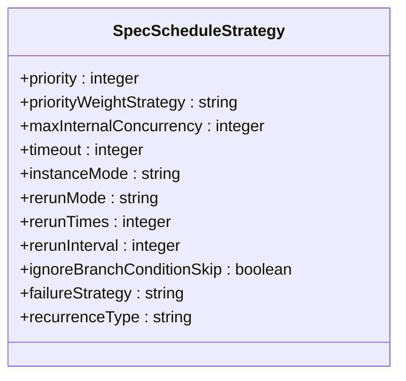
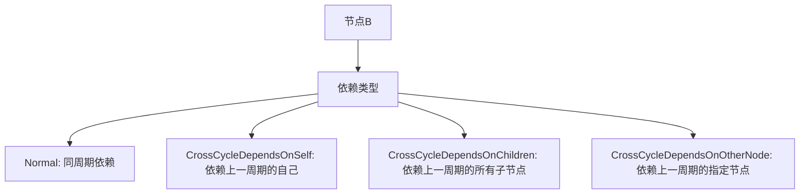

# 周期调度

<cite>
**本文档引用的文件**   
- [cycle-workflow.md](file://docs/spec-templates/workflows/cycle-workflow.md)
- [trigger.md](file://schema/docs/trigger.md)
- [trigger.schema.json](file://schema/trigger.schema.json)
- [SpecScheduleStrategy.schema.json](file://spec/src/main/resources/spec/schema/SpecScheduleStrategy.schema.json)
- [cycle_workflow.json](file://spec/src/test/resources/version/1.x.y/cycle_workflow.json)
- [shell-daily.template.json](file://dwcli/dwcli/templates/shell-daily.template.json)
- [python-daily.template.json](file://dwcli/dwcli/templates/python-daily.template.json)
- [cycle_workflow_spec.json](file://spec/src/test/resources/copier/cycle_workflow_spec.json)
</cite>

## 目录
1. [周期调度概述](#周期调度概述)
2. [Cron表达式配置](#cron表达式配置)
3. [调度策略配置](#调度策略配置)
4. [依赖关系配置](#依赖关系配置)
5. [周期调度模式示例](#周期调度模式示例)
6. [调度时间范围与控制](#调度时间范围与控制)

## 周期调度概述

在dataworks-spec项目中，周期调度是通过`CycleWorkflow`类型的工作流实现的，该工作流按照指定的Cron表达式定期执行。周期调度工作流包含任务节点和它们之间的依赖关系，通过`spec.triggers`字段定义调度触发器。

周期调度工作流的核心特性包括：
- 使用标准的Cron表达式定义执行频率
- 支持设置生效时间范围（开始时间和结束时间）
- 可配置时区以适应不同地区的调度需求
- 支持多种调度策略，如重跑策略、超时设置等
- 提供丰富的依赖关系配置选项

**Section sources**
- [cycle-workflow.md](file://docs/spec-templates/workflows/cycle-workflow.md#L1-L199)

## Cron表达式配置

### Cron表达式语法结构

周期调度使用标准的Quartz Cron格式，由六个字段组成，按以下顺序排列：

```
秒 分 时 日 月 星期
```

每个字段的含义和取值范围如下：

| 字段 | 含义 | 取值范围 | 特殊字符 |
|------|------|---------|---------|
| 秒 | 执行的秒数 | 0-59 | *, /, -, ? |
| 分 | 执行的分钟数 | 0-59 | *, /, -, ? |
| 时 | 执行的小时数 | 0-23 | *, /, -, ? |
| 日 | 月份中的日期 | 1-31 | *, /, -, ?, L, W |
| 月 | 月份 | 1-12 或 JAN-DEC | *, /, - |
| 星期 | 周几 | 1-7 或 SUN-SAT | *, /, -, ?, L, # |

### 时间字段含义

- `*`：表示"每"，即该字段的所有可能值
- `?`：表示"无特定值"，通常用于日和星期字段的互斥
- `-`：表示范围，如`9-17`表示从9到17
- `,`：表示枚举值，如`MON,WED,FRI`表示周一、周三、周五
- `/`：表示增量，如`0/15`表示从0开始每隔15个单位
- `L`：表示"最后"，如`L`在日字段中表示当月的最后一天
- `W`：表示"工作日"，如`15W`表示距离15号最近的工作日

### 执行频率设置

通过组合不同的Cron表达式，可以实现各种执行频率的调度：

- 每分钟：`* * * * * ?`
- 每小时：`0 0 * * * ?`
- 每天零点：`0 0 0 * * ?`
- 每周日：`0 0 0 ? * 1`
- 每月1号：`0 0 0 1 * ?`

**Section sources**
- [cycle-workflow.md](file://docs/spec-templates/workflows/cycle-workflow.md#L135-L145)
- [trigger.md](file://schema/docs/trigger.md#L73-L90)

## 调度策略配置

### 基本调度策略

周期调度支持多种调度策略配置，这些策略通过`SpecScheduleStrategy`模式定义：



**Diagram sources **
- [SpecScheduleStrategy.schema.json](file://spec/src/main/resources/spec/schema/SpecScheduleStrategy.schema.json#L1-L48)

### 优先级与并发控制

- `priority`：任务优先级，数值越大优先级越高
- `maxInternalConcurrency`：最大内部节点实例并发数，用于控制资源使用
- `priorityWeightStrategy`：优先级权重策略，决定如何计算任务的执行顺序

### 超时与重跑策略

- `timeout`：任务超时时间（秒），超过此时间任务将被终止
- `rerunMode`：重跑模式，可选值包括：
  - `Allowed`：允许重跑
  - `Denied`：拒绝重跑
  - `FailureAllowed`：仅失败时允许重跑
- `rerunTimes`：最大重跑次数
- `rerunInterval`：重跑间隔时间（毫秒）

### 实例化模式

- `instanceMode`：实例化模式，支持：
  - `T+1`：次日生效模式
  - `Immediately`：立即生效模式

**Section sources**
- [SpecScheduleStrategy.schema.json](file://spec/src/main/resources/spec/schema/SpecScheduleStrategy.schema.json#L1-L48)
- [cycle_workflow.json](file://spec/src/test/resources/version/1.x.y/cycle_workflow.json#L27-L36)

## 依赖关系配置

### 节点间依赖

节点间的依赖关系通过`flow`字段定义，支持多种依赖类型：



**Diagram sources **
- [cycle-workflow.md](file://docs/spec-templates/workflows/cycle-workflow.md#L158-L184)

### 依赖配置示例

```json
{
  "flow": [
    {
      "nodeId": "node_b",
      "depends": [
        {
          "type": "Normal",
          "nodeId": "node_a"
        },
        {
          "type": "CrossCycleDependsOnSelf"
        }
      ]
    }
  ]
}
```

依赖类型说明：
- **Normal**：同周期依赖，依赖同一调度周期的节点
- **CrossCycleDependsOnSelf**：依赖上一周期的自己
- **CrossCycleDependsOnChildren**：依赖上一周期自己的所有子节点
- **CrossCycleDependsOnOtherNode**：依赖上一周期的指定节点

**Section sources**
- [cycle-workflow.md](file://docs/spec-templates/workflows/cycle-workflow.md#L158-L184)

## 周期调度模式示例

### 每日零点调度

每日零点调度是最常见的调度模式，用于处理前一天的数据：

```json
{
  "trigger": {
    "type": "Scheduler",
    "cron": "00 00 00 * * ?",
    "timezone": "Asia/Shanghai"
  }
}
```

此配置表示每天凌晨0点0分0秒执行，适用于日终数据处理任务。

### 每小时整点调度

每小时整点调度适用于需要频繁处理数据的场景：

```json
{
  "trigger": {
    "type": "Scheduler",
    "cron": "00 00 * * * ?",
    "timezone": "Asia/Shanghai"
  }
}
```

此配置表示每小时的整点执行，适用于实时性要求较高的数据处理任务。

### 每周一调度

每周一调度常用于周报生成或周度数据分析：

```json
{
  "trigger": {
    "type": "Scheduler",
    "cron": "00 00 00 ? * 2",
    "timezone": "Asia/Shanghai"
  }
}
```

此配置表示每周一凌晨0点执行，星期字段的`2`代表周一（1代表周日）。

### 每月最后一天调度

每月最后一天调度适用于月度结算或报表生成：

```json
{
  "trigger": {
    "type": "Scheduler",
    "cron": "00 00 00 L * ?",
    "timezone": "Asia/Shanghai"
  }
}
```

此配置使用`L`特殊字符表示当月的最后一天，确保在每个月的最后一天执行。

**Section sources**
- [cycle_workflow_spec.json](file://spec/src/test/resources/copier/cycle_workflow_spec.json#L20-L25)
- [shell-daily.template.json](file://dwcli/dwcli/templates/shell-daily.template.json#L1-L29)
- [python-daily.template.json](file://dwcli/dwcli/templates/python-daily.template.json#L1-L29)

## 调度时间范围与控制

### 生效时间范围设置

通过`startTime`和`endTime`字段可以精确控制调度的生效时间范围：

```json
{
  "trigger": {
    "type": "Scheduler",
    "cron": "00 00 00 * * ?",
    "startTime": "2024-01-01 00:00:00",
    "endTime": "2025-12-31 23:59:59",
    "timezone": "Asia/Shanghai"
  }
}
```

- `startTime`：调度开始生效的时间
- `endTime`：调度结束生效的时间
- 节点只在`startTime`到`endTime`时间段内执行周期调度

### 调度暂停与恢复

通过`recurrence`字段可以控制节点的调度状态：

- `Normal`：正常调度
- `Skip`：跳过调度
- `Pause`：暂停调度

当需要临时停止某个节点的执行时，可以将其`recurrence`设置为`Pause`，待需要恢复时再改回`Normal`。

### 调度历史查看

虽然调度历史查看的具体实现不在配置文件中体现，但系统会自动记录每次调度的执行情况，包括：
- 调度时间
- 执行状态（成功、失败、超时等）
- 执行日志
- 资源使用情况

这些信息可用于监控调度任务的运行状况和故障排查。

**Section sources**
- [trigger.md](file://schema/docs/trigger.md#L91-L125)
- [cycle_workflow.json](file://spec/src/test/resources/version/1.x.y/cycle_workflow.json#L22-L23)
- [cycle-workflow.md](file://docs/spec-templates/workflows/cycle-workflow.md#L146-L149)