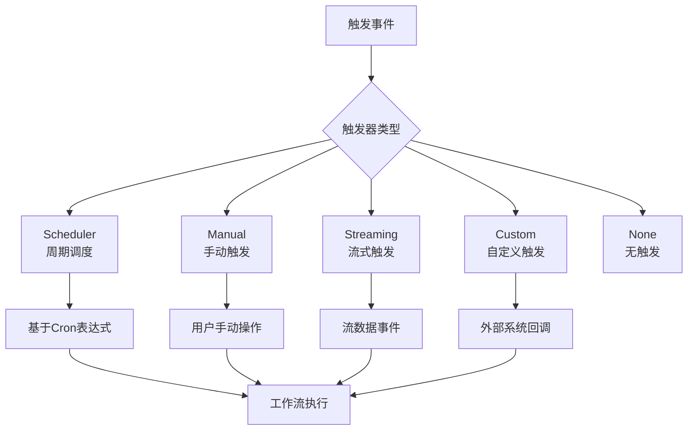
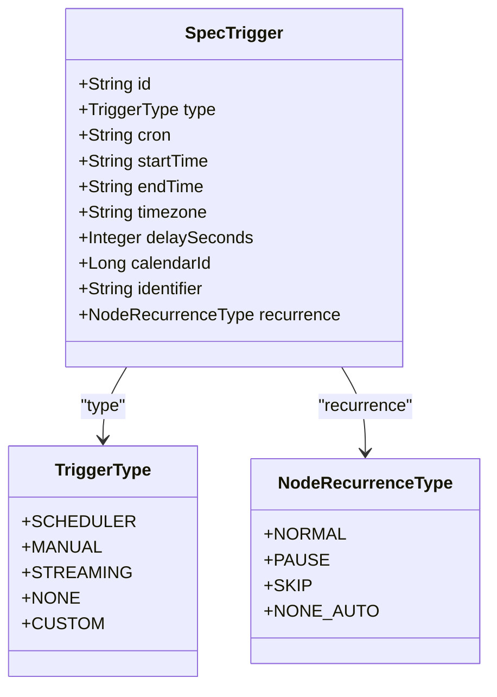
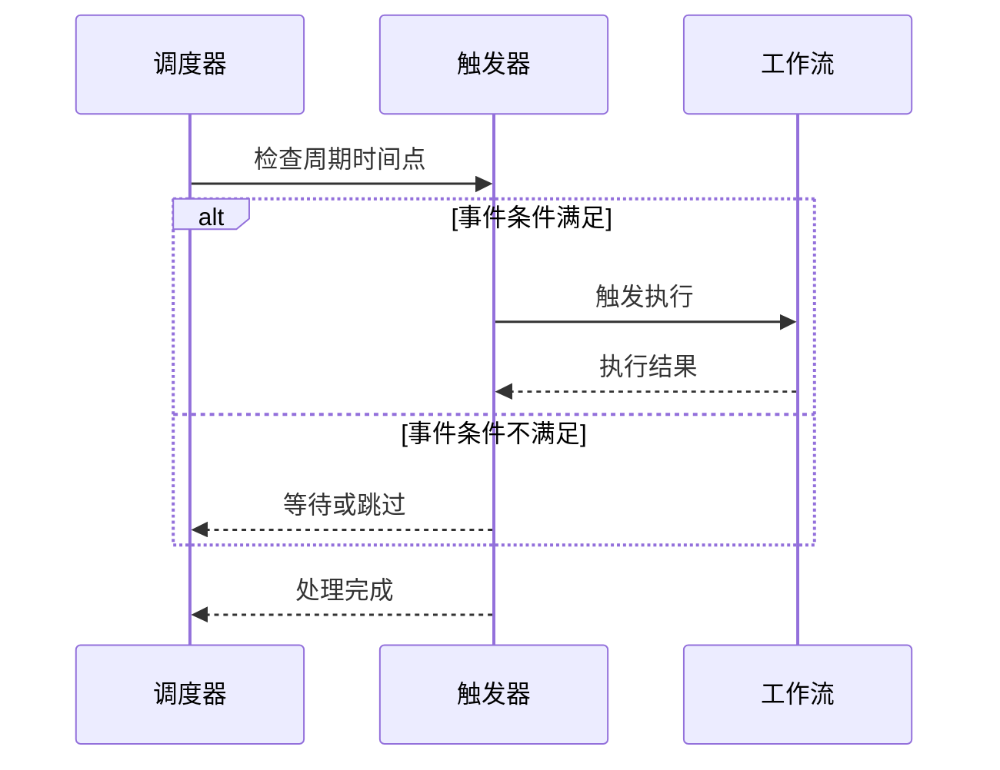
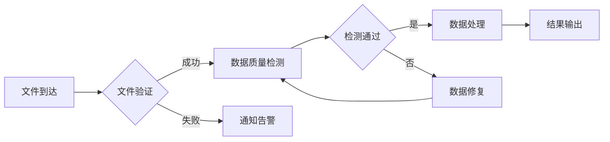
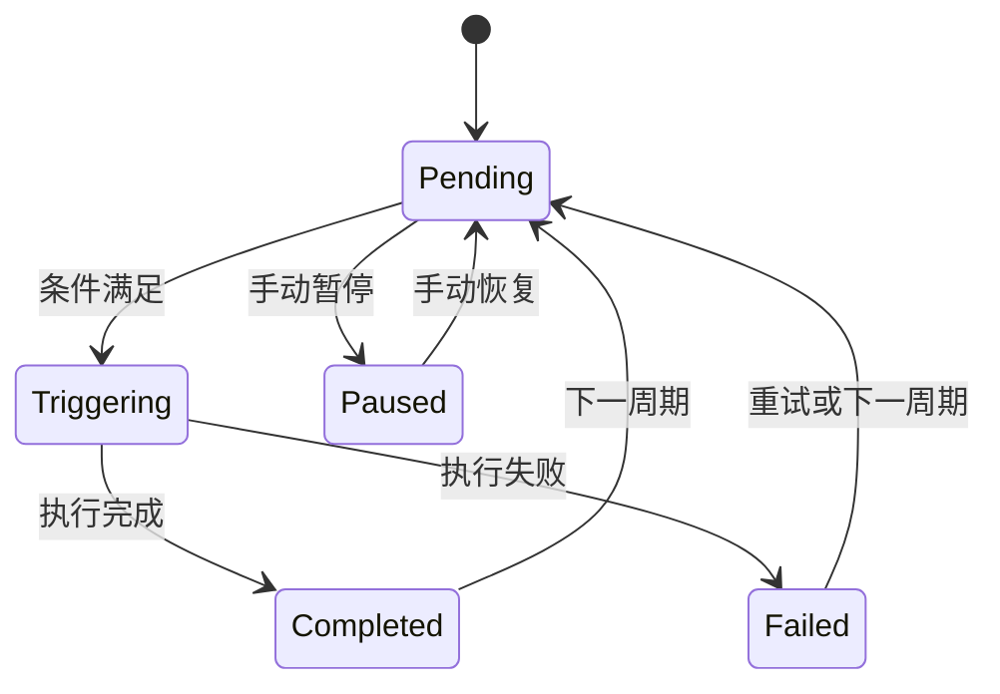

# 触发器调度

<cite>
**本文档引用的文件**   
- [trigger.schema.json](file://schema/trigger.schema.json)
- [SpecTrigger.java](file://spec/src/main/java/com/aliyun/dataworks/common/spec/domain/ref/SpecTrigger.java)
- [TriggerType.java](file://spec/src/main/java/com/aliyun/dataworks/common/spec/domain/enums/TriggerType.java)
- [NodeRecurrenceType.java](file://spec/src/main/java/com/aliyun/dataworks/common/spec/domain/enums/NodeRecurrenceType.java)
- [SpecTrigger.schema.json](file://spec/src/main/resources/spec/schema/SpecTrigger.schema.json)
- [trigger_workflow.json](file://spec/src/test/resources/version/1.x.y/trigger_workflow.json)
- [trigger_workflow_inner_foreach_inner_node.json](file://spec/src/test/resources/version/1.x.y/trigger_workflow_inner_foreach_inner_node.json)
- [newSimple.json](file://spec/src/test/resources/newSimple.json)
- [manual-workflow.md](file://docs/spec-templates/workflows/manual-workflow.md)
- [cycle-workflow.md](file://docs/spec-templates/workflows/cycle-workflow.md)
- [SpecTriggerWriter.java](file://spec/src/main/java/com/aliyun/dataworks/common/spec/writer/impl/SpecTriggerWriter.java)
- [TriggerConverter.java](file://client/migrationx/migrationx-transformer/src/main/java/com/aliyun/dataworks/migrationx/transformer/dataworks/converter/dolphinscheduler/v3/workflow/TriggerConverter.java)
- [task_converter.py](file://client/migrationx-transformer/src/main/python/airflow_dag_parser/converter/task_converter.py)
</cite>

## 目录
1. [引言](#引言)
2. [触发器调度机制](#触发器调度机制)
3. [触发器配置参数](#触发器配置参数)
4. [触发器与周期调度的组合使用](#触发器与周期调度的组合使用)
5. [触发链的构建方法](#触发链的构建方法)
6. [触发器状态管理](#触发器状态管理)
7. [典型触发器调度场景配置示例](#典型触发器调度场景配置示例)
8. [结论](#结论)

## 引言
dataworks-spec项目提供了一套完整的触发器调度机制，支持基于事件触发的调度模式。该机制允许工作流在特定事件发生时被触发执行，包括文件到达、数据质量检测完成和外部系统回调等场景。本文档全面记录了触发器调度的相关概念、配置参数、使用模式和状态管理机制，为开发者和用户提供详细的指导。

## 触发器调度机制
dataworks-spec的触发器调度机制基于事件驱动架构，支持多种触发类型。触发器定义了工作流的执行条件，当满足特定条件时，工作流将被触发执行。

触发器主要分为以下几种类型：
- **Scheduler**: 周期调度触发器，基于cron表达式定时触发
- **Manual**: 手动触发器，通过用户操作触发
- **Streaming**: 流式触发器，基于流数据事件触发
- **Custom**: 自定义触发器，支持外部系统回调等场景
- **None**: 无触发器，用于特殊场景

触发器可以应用于整个工作流或单个节点，实现灵活的调度控制。在周期工作流(CycleWorkflow)中，必须定义`spec.triggers`数组，而在手动工作流(ManualWorkflow)中则不能包含此定义。



**Diagram sources**
- [TriggerType.java](file://spec/src/main/java/com/aliyun/dataworks/common/spec/domain/enums/TriggerType.java)
- [SpecTrigger.java](file://spec/src/main/java/com/aliyun/dataworks/common/spec/domain/ref/SpecTrigger.java)

**Section sources**
- [TriggerType.java](file://spec/src/main/java/com/aliyun/dataworks/common/spec/domain/enums/TriggerType.java)
- [SpecTrigger.java](file://spec/src/main/java/com/aliyun/dataworks/common/spec/domain/ref/SpecTrigger.java)

## 触发器配置参数
触发器的配置参数定义了触发行为的具体细节，包括触发条件、时间设置和重试策略等。

### 基础配置参数
触发器的基础配置参数包括：

- **id**: 触发器的唯一标识符
- **type**: 触发器类型，如Scheduler、Manual等
- **cron**: 周期调度的定时表达式，仅适用于Scheduler类型
- **startTime**: 调度的起始生效时间
- **endTime**: 调度的结束生效时间
- **timezone**: 调度时间的时区设置

```json
{
  "id": "daily",
  "type": "scheduler",
  "cron": "00 00 00 * * ?",
  "startTime": "2023-01-01T00:00:00",
  "endTime": "2024-01-01T00:00:00"
}
```

### 高级配置参数
除了基础参数外，触发器还支持以下高级配置：

- **delaySeconds**: 触发延迟时间（秒），用于在事件发生后延迟执行
- **calendarId**: 自定义日历ID，用于特殊调度需求
- **identifier**: 自定义触发器标识符，用于区分不同触发器
- **recurrence**: 周期类型，定义调度的重复模式



**Diagram sources**
- [SpecTrigger.java](file://spec/src/main/java/com/aliyun/dataworks/common/spec/domain/ref/SpecTrigger.java)
- [TriggerType.java](file://spec/src/main/java/com/aliyun/dataworks/common/spec/domain/enums/TriggerType.java)
- [NodeRecurrenceType.java](file://spec/src/main/java/com/aliyun/dataworks/common/spec/domain/enums/NodeRecurrenceType.java)

**Section sources**
- [SpecTrigger.schema.json](file://spec/src/main/resources/spec/schema/SpecTrigger.schema.json)
- [trigger.schema.json](file://schema/trigger.schema.json)

## 触发器与周期调度的组合使用
触发器与周期调度可以组合使用，实现复杂的调度逻辑。这种组合模式允许在周期调度的基础上添加事件触发条件，提高调度的灵活性。

### 组合使用模式
在dataworks-spec中，触发器与周期调度的组合使用主要有以下几种模式：

1. **纯周期调度**: 仅使用cron表达式进行周期性调度
2. **周期+事件触发**: 在周期时间点检查事件状态，事件满足时才触发
3. **事件+周期约束**: 事件触发但受周期时间窗口约束



### 时间窗口配置
通过`startTime`和`endTime`参数可以定义调度的时间窗口，节点只在指定时间段内执行周期调度运行。这在需要限制执行时间的场景中非常有用。

```json
{
  "trigger": {
    "type": "Scheduler",
    "cron": "00 00 00 * * ?",
    "startTime": "2023-01-01 00:00:00",
    "endTime": "2024-01-01 00:00:00",
    "timezone": "Asia/Shanghai"
  }
}
```

**Diagram sources**
- [newSimple.json](file://spec/src/test/resources/newSimple.json)
- [SpecTrigger.java](file://spec/src/main/java/com/aliyun/dataworks/common/spec/domain/ref/SpecTrigger.java)

**Section sources**
- [newSimple.json](file://spec/src/test/resources/newSimple.json)
- [cycle-workflow.md](file://docs/spec-templates/workflows/cycle-workflow.md)

## 触发链的构建方法
触发链是多个触发器按特定顺序和条件连接形成的执行链路，用于实现复杂的事件驱动流程。

### 触发链结构
触发链由多个触发器节点组成，每个节点可以有不同的触发类型和条件。触发链的执行遵循以下规则：

1. 按照定义的顺序依次检查触发条件
2. 当某个触发器条件满足时，触发相应的工作流或节点
3. 可以设置条件表达式控制触发链的执行路径



### 条件表达式
触发链支持使用条件表达式来控制执行流程，表达式可以基于前序节点的执行状态、输出结果等。

```json
{
  "join": {
    "branches": [
      {
        "nodeId": "data_validation",
        "assertion": {
          "field": "status",
          "in": ["SUCCESS"]
        }
      },
      {
        "nodeId": "quality_check",
        "assertion": {
          "field": "result",
          "in": ["PASS"]
        }
      }
    ],
    "logic": {
      "expression": "data_validation and quality_check"
    }
  }
}
```

**Diagram sources**
- [join.json](file://spec/src/test/resources/join.json)
- [trigger_workflow_inner_foreach_inner_node.json](file://spec/src/test/resources/version/1.x.y/trigger_workflow_inner_foreach_inner_node.json)

**Section sources**
- [join.json](file://spec/src/test/resources/join.json)
- [trigger_workflow_inner_foreach_inner_node.json](file://spec/src/test/resources/version/1.x.y/trigger_workflow_inner_foreach_inner_node.json)

## 触发器状态管理
触发器状态管理机制负责跟踪和控制触发器的生命周期，确保调度的可靠性和可追溯性。

### 状态转换逻辑
触发器的状态转换遵循以下逻辑：

- **待触发(Pending)**: 触发器已定义但尚未满足触发条件
- **触发中(Triggering)**: 触发条件已满足，正在执行触发操作
- **触发完成(Completed)**: 触发操作已完成，无论成功或失败
- **暂停(Paused)**: 触发器被手动暂停，不响应触发事件



### 状态管理实现
触发器状态通过`recurrence`字段进行管理，支持以下状态类型：

- **NORMAL**: 正常调度
- **PAUSE**: 暂停调度
- **SKIP**: 跳过调度
- **NONE_AUTO**: 无自动调度

```java
public enum NodeRecurrenceType implements LabelEnum {
    NORMAL("Normal"),
    PAUSE("Pause"),
    SKIP("Skip"),
    NONE_AUTO("NoneAuto");
}
```

**Diagram sources**
- [NodeRecurrenceType.java](file://spec/src/main/java/com/aliyun/dataworks/common/spec/domain/enums/NodeRecurrenceType.java)
- [SpecNodeEntityAdapter.java](file://client/migrationx/migrationx-domain/migrationx-domain-dataworks/src/main/java/com/aliyun/dataworks/migrationx/domain/dataworks/service/spec/entity/SpecNodeEntityAdapter.java)

**Section sources**
- [NodeRecurrenceType.java](file://spec/src/main/java/com/aliyun/dataworks/common/spec/domain/enums/NodeRecurrenceType.java)
- [SpecNodeEntityAdapter.java](file://client/migrationx/migrationx-domain/migrationx-domain-dataworks/src/main/java/com/aliyun/dataworks/migrationx/domain/dataworks/service/spec/entity/SpecNodeEntityAdapter.java)

## 典型触发器调度场景配置示例
本节提供几种典型触发器调度场景的配置示例，展示如何在实际应用中使用触发器。

### 文件监听触发
文件监听触发器在指定目录有新文件到达时触发工作流执行。

```json
{
  "trigger": {
    "type": "Custom",
    "identifier": "file_arrival_trigger",
    "startTime": "1970-01-01 00:00:00",
    "endTime": "9999-01-01 00:00:00",
    "timezone": "Asia/Shanghai"
  },
  "nodes": [
    {
      "id": "file_processing",
      "trigger": {
        "type": "Custom",
        "identifier": "file_arrival_trigger"
      }
    }
  ]
}
```

### API调用触发
API调用触发器通过外部系统调用特定接口来触发工作流执行。

```json
{
  "trigger": {
    "type": "Custom",
    "identifier": "api_callback_trigger",
    "startTime": "2023-01-01 00:00:00",
    "endTime": "2024-01-01 00:00:00",
    "timezone": "Asia/Shanghai"
  }
}
```

### 消息队列触发
消息队列触发器监听特定主题的消息，当收到消息时触发工作流执行。

```json
{
  "trigger": {
    "type": "Custom",
    "identifier": "kafka0903",
    "startTime": "1970-01-01 00:00:00",
    "endTime": "9999-01-01 00:00:00",
    "timezone": "Asia/Shanghai"
  }
}
```

**Section sources**
- [trigger_workflow.json](file://spec/src/test/resources/version/1.x.y/trigger_workflow.json)
- [trigger_workflow_inner_foreach_inner_node.json](file://spec/src/test/resources/version/1.x.y/trigger_workflow_inner_foreach_inner_node.json)

## 结论
dataworks-spec项目的触发器调度机制提供了一套灵活、可靠的事件驱动调度解决方案。通过支持多种触发类型、丰富的配置参数和复杂的状态管理，该机制能够满足各种业务场景的调度需求。开发者可以根据具体需求选择合适的触发模式，构建高效的工作流调度系统。