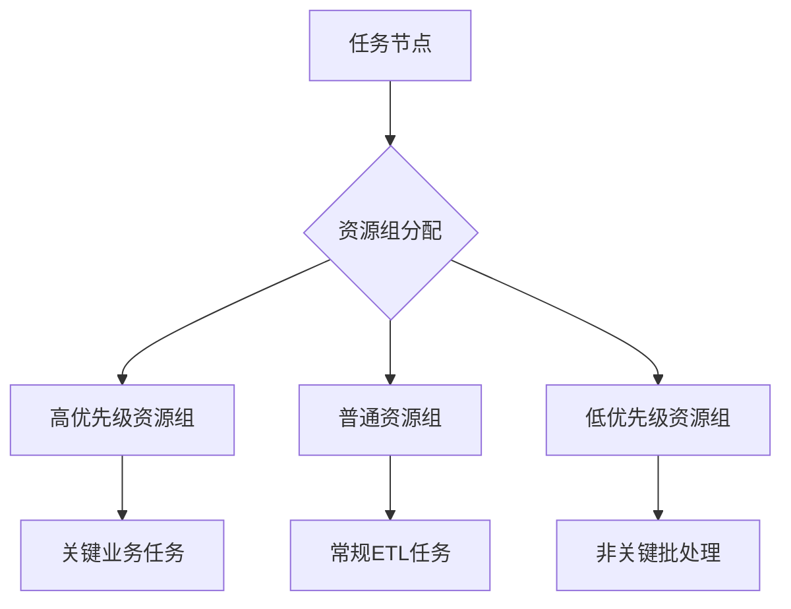
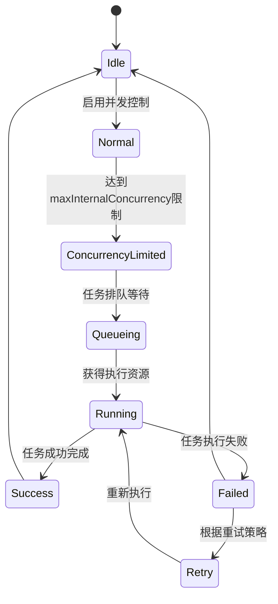
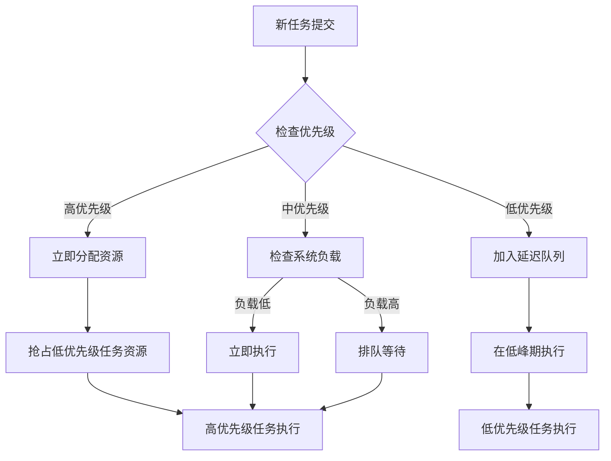
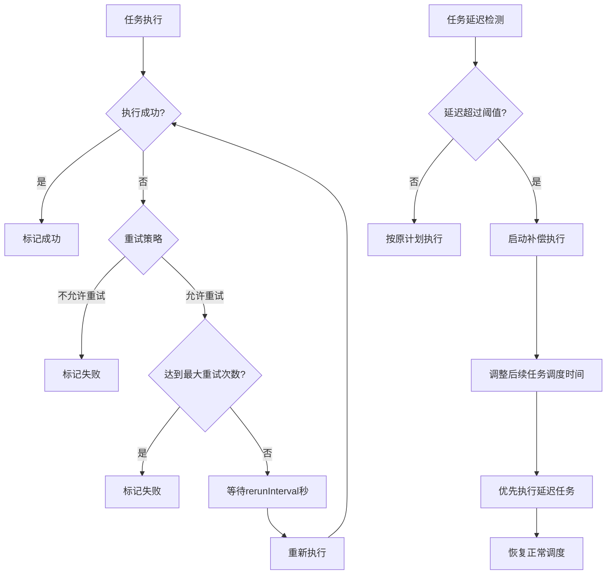
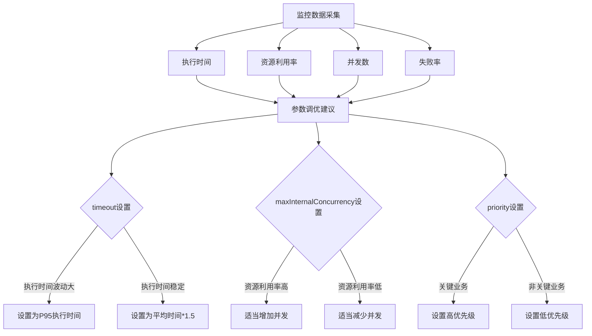

# 调度优化

<cite>
**本文档引用的文件**  
- [node.schema.json](file://schema/node.schema.json)
- [trigger.schema.json](file://schema/trigger.schema.json)
- [runtimeresource.schema.json](file://schema/runtimeresource.schema.json)
- [SpecScheduleStrategy.schema.json](file://spec/src/main/resources/spec/schema/SpecScheduleStrategy.schema.json)
- [SpecScheduleStrategy.java](file://spec/src/main/java/com/aliyun/dataworks/common/spec/domain/ref/SpecScheduleStrategy.java)
- [PriorityWeightStrategy.java](file://spec/src/main/java/com/aliyun/dataworks/common/spec/domain/enums/PriorityWeightStrategy.java)
- [FailureStrategy.java](file://spec/src/main/java/com/aliyun/dataworks/common/spec/domain/enums/FailureStrategy.java)
- [NodeRerunModeType.java](file://spec/src/main/java/com/aliyun/dataworks/common/spec/domain/enums/NodeRerunModeType.java)
- [NodeInstanceModeType.java](file://spec/src/main/java/com/aliyun/dataworks/common/spec/domain/enums/NodeInstanceModeType.java)
- [NodeRecurrenceType.java](file://spec/src/main/java/com/aliyun/dataworks/common/spec/domain/enums/NodeRecurrenceType.java)
- [CycleWorkflow.schedule.schema.json](file://dwcli/dwcli/schemas/CycleWorkflow.schedule.schema.json)
- [task_converter.py](file://client/migrationx-transformer/src/main/python/airflow_dag_parser/converter/task_converter.py)
</cite>

## 目录
1. [调度负载均衡与资源配额](#调度负载均衡与资源配额)
2. [调度并发控制机制](#调度并发控制机制)
3. [调度优先级与抢占策略](#调度优先级与抢占策略)
4. [调度异常处理最佳实践](#调度异常处理最佳实践)
5. [调度效率监控与参数调优](#调度效率监控与参数调优)

## 调度负载均衡与资源配额

dataworks-spec项目通过运行时资源定义和调度策略配置实现调度负载均衡和资源配额分配。系统使用`runtimeResource`对象来定义节点的运行时资源，其中`resourceGroup`字段标识资源组唯一标识，实现资源隔离和配额管理。

调度策略通过`SpecScheduleStrategy`类进行配置，支持优先级、最大并发数、超时时间等关键参数的设置。资源配额分配通过将任务分配到不同的资源组来实现，确保关键任务能够获得足够的计算资源。

**图示来源**
- [runtimeresource.schema.json](file://schema/runtimeresource.schema.json#L1-L20)
- [SpecScheduleStrategy.java](file://spec/src/main/java/com/aliyun/dataworks/common/spec/domain/ref/SpecScheduleStrategy.java#L37-L46)

**本节来源**
- [runtimeresource.schema.json](file://schema/runtimeresource.schema.json#L1-L20)
- [SpecScheduleStrategy.schema.json](file://spec/src/main/resources/spec/schema/SpecScheduleStrategy.schema.json#L1-L47)

## 调度并发控制机制

dataworks-spec项目通过`maxInternalConcurrency`参数实现调度并发控制，该参数定义了最大内部节点运行实例的并发总数限制。系统在调度器层面实施并发控制，确保不会因过多并发任务导致系统资源耗尽。

并发控制机制与任务的`recurrence`状态相结合，支持三种调度状态：正常(Normal)、跳过(Skip)和暂停(Pause)。当任务处于暂停状态时，虽然会按周期实例化，但状态直接设置为失败；当处于跳过状态时，任务实例化但不执行代码，状态直接设置为成功。

**图示来源**
- [SpecScheduleStrategy.java](file://spec/src/main/java/com/aliyun/dataworks/common/spec/domain/ref/SpecScheduleStrategy.java#L44)
- [node.schema.json](file://schema/node.schema.json#L106-L118)

**本节来源**
- [SpecScheduleStrategy.java](file://spec/src/main/java/com/aliyun/dataworks/common/spec/domain/ref/SpecScheduleStrategy.java#L44)
- [node.schema.json](file://schema/node.schema.json#L106-L118)
- [NodeRecurrenceType.java](file://spec/src/main/java/com/aliyun/dataworks/common/spec/domain/enums/NodeRecurrenceType.java#L24-L44)

## 调度优先级与抢占策略

dataworks-spec项目通过`priority`字段实现调度优先级设置，数值越大优先级越高。系统支持两种优先级权重策略：禁用(DISABLED)和上游(UPSTREAM)，通过`priorityWeightStrategy`参数进行配置。

高优先级任务的抢占式调度通过资源组优先级和任务优先级双重机制实现。当高优先级任务需要执行时，系统会优先分配资源，必要时可抢占低优先级任务的执行资源。低优先级任务则采用延迟执行策略，在系统负载较低时才被调度执行。

**图示来源**
- [node.schema.json](file://schema/node.schema.json#L120-L123)
- [SpecScheduleStrategy.java](file://spec/src/main/java/com/aliyun/dataworks/common/spec/domain/ref/SpecScheduleStrategy.java#L37-L39)
- [PriorityWeightStrategy.java](file://spec/src/main/java/com/aliyun/dataworks/common/spec/domain/enums/PriorityWeightStrategy.java#L24-L27)

**本节来源**
- [node.schema.json](file://schema/node.schema.json#L120-L123)
- [SpecScheduleStrategy.java](file://spec/src/main/java/com/aliyun/dataworks/common/spec/domain/ref/SpecScheduleStrategy.java#L37-L39)
- [PriorityWeightStrategy.java](file://spec/src/main/java/com/aliyun/dataworks/common/spec/domain/enums/PriorityWeightStrategy.java#L24-L27)

## 调度异常处理最佳实践

dataworks-spec项目提供完善的调度异常处理机制，包括自动重试、延迟补偿和分批执行等策略。系统通过`rerunMode`参数定义重试策略，支持三种模式：允许重跑(Allowed)、禁止重跑(Denied)和仅失败时允许重跑(FailureAllowed)。

调度失败的自动重试间隔通过`rerunInterval`参数设置，单位为秒。系统还支持调度延迟的补偿执行策略，当任务因系统原因延迟时，可自动调整执行计划以补偿延迟。对于大规模调度任务，系统提供分批执行方案，通过`maxInternalConcurrency`参数控制并发数，避免系统过载。

**图示来源**
- [SpecScheduleStrategy.schema.json](file://spec/src/main/resources/spec/schema/SpecScheduleStrategy.schema.json#L28-L32)
- [NodeRerunModeType.java](file://spec/src/main/java/com/aliyun/dataworks/common/spec/domain/enums/NodeRerunModeType.java#L24-L39)
- [FailureStrategy.java](file://spec/src/main/java/com/aliyun/dataworks/common/spec/domain/enums/FailureStrategy.java#L24-L34)

**本节来源**
- [SpecScheduleStrategy.schema.json](file://spec/src/main/resources/spec/schema/SpecScheduleStrategy.schema.json#L28-L32)
- [NodeRerunModeType.java](file://spec/src/main/java/com/aliyun/dataworks/common/spec/domain/enums/NodeRerunModeType.java#L24-L39)
- [FailureStrategy.java](file://spec/src/main/java/com/aliyun/dataworks/common/spec/domain/enums/FailureStrategy.java#L24-L34)

## 调度效率监控与参数调优

dataworks-spec项目提供全面的调度效率监控指标，包括任务执行时间、资源利用率、并发数、失败率等。系统通过`timeout`参数定义节点超时时间，单位为秒，超过指定时间后节点将被终止。

基于监控数据的调度参数调优建议包括：根据历史执行时间合理设置`timeout`值，避免过短导致正常任务被误杀或过长导致资源浪费；根据系统负载动态调整`maxInternalConcurrency`值，在保证系统稳定的同时最大化资源利用率；根据业务重要性合理分配`priority`值，确保关键任务优先执行。

**图示来源**
- [node.schema.json](file://schema/node.schema.json#L124-L127)
- [SpecScheduleStrategy.schema.json](file://spec/src/main/resources/spec/schema/SpecScheduleStrategy.schema.json#L17-L19)
- [CycleWorkflow.schedule.schema.json](file://dwcli/dwcli/schemas/CycleWorkflow.schedule.schema.json#L68-L73)

**本节来源**
- [node.schema.json](file://schema/node.schema.json#L124-L127)
- [SpecScheduleStrategy.schema.json](file://spec/src/main/resources/spec/schema/SpecScheduleStrategy.schema.json#L17-L19)
- [CycleWorkflow.schedule.schema.json](file://dwcli/dwcli/schemas/CycleWorkflow.schedule.schema.json#L68-L73)