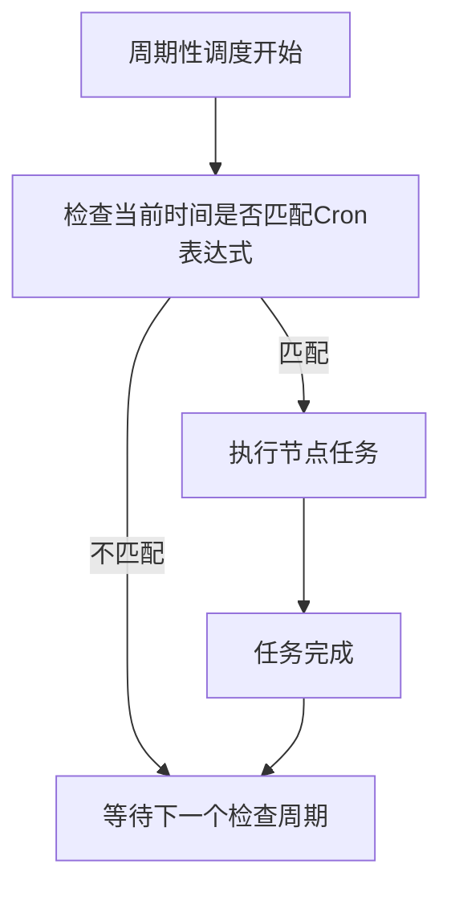
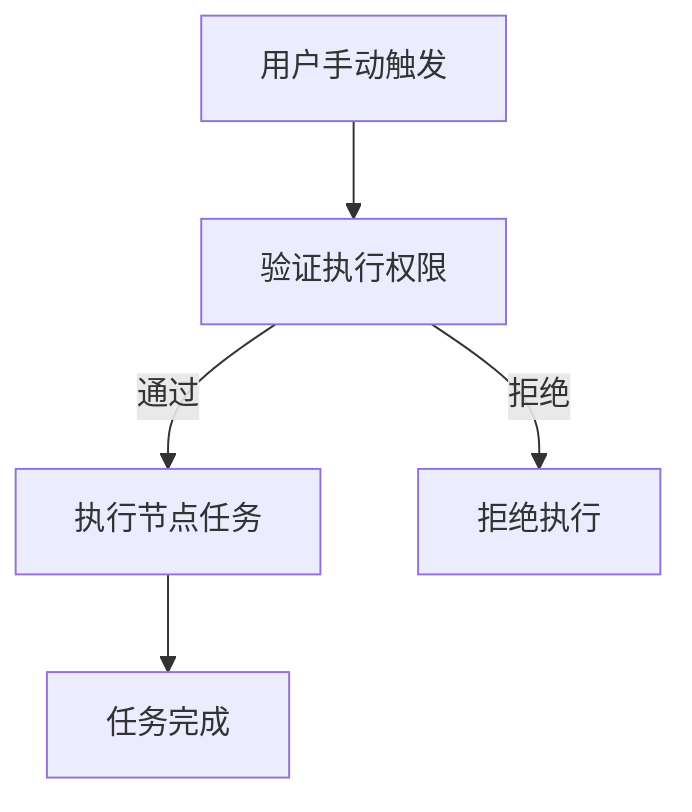
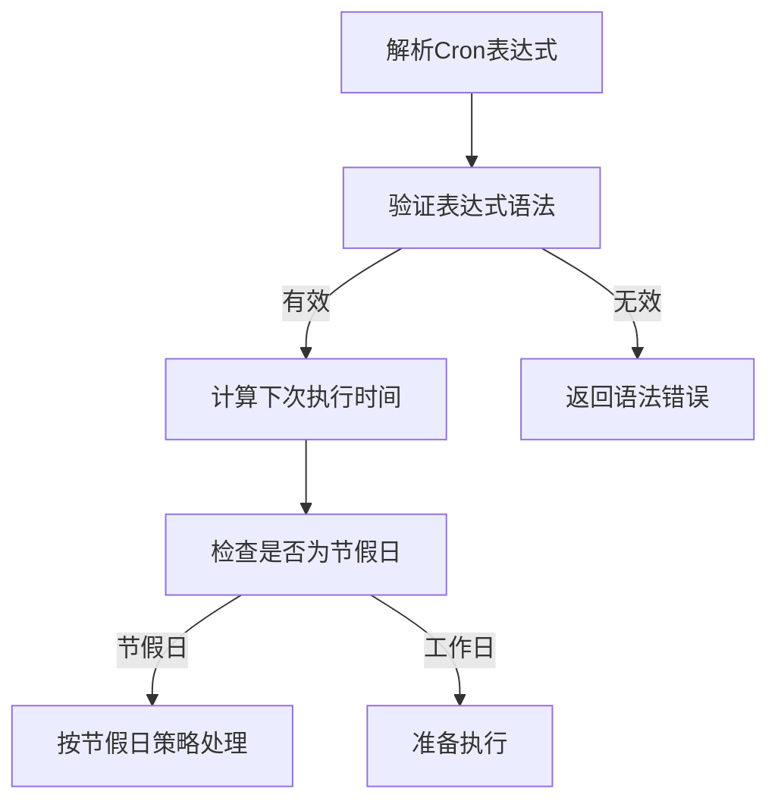
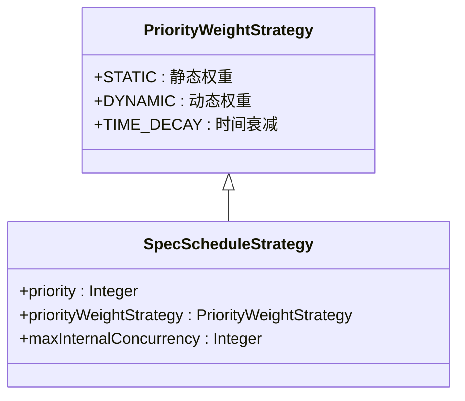
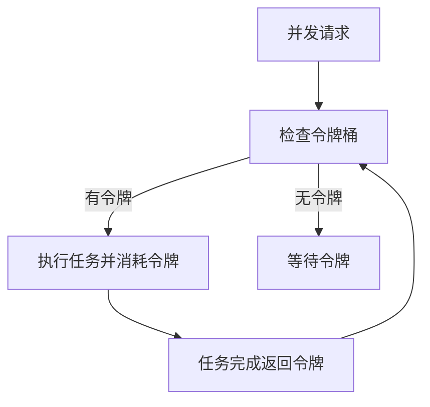
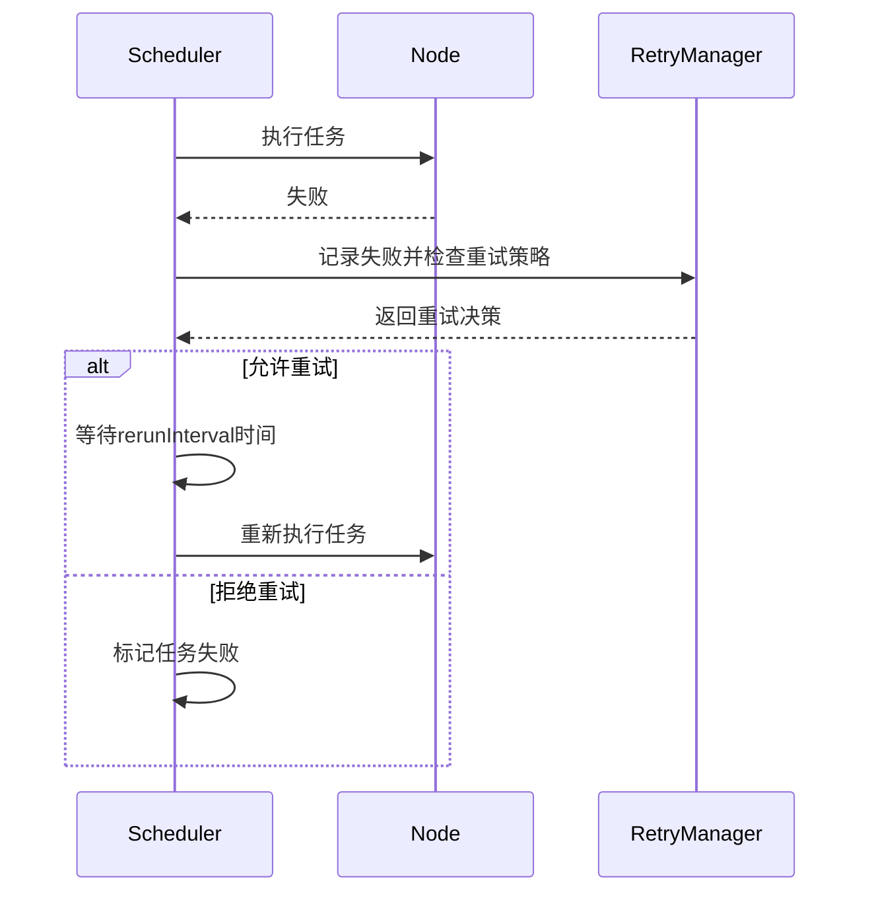
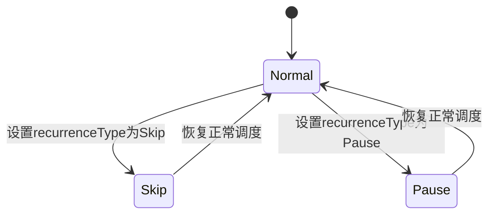
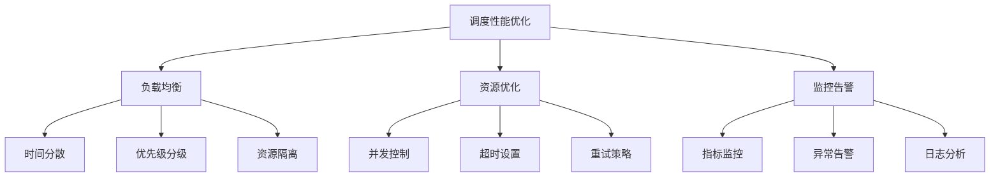

# 调度策略

<cite>
**本文档引用文件**   
- [SpecScheduleStrategy.schema.json](file://spec/src/main/resources/spec/schema/SpecScheduleStrategy.schema.json)
- [SpecScheduleStrategy.java](file://spec/src/main/java/com/aliyun/dataworks/common/spec/domain/ref/SpecScheduleStrategy.java)
- [SpecScheduleStrategyParser.java](file://spec/src/main/java/com/aliyun/dataworks/common/spec/parser/impl/SpecScheduleStrategyParser.java)
- [trigger.schema.json](file://schema/trigger.schema.json)
- [CycleWorkflow.schedule.schema.json](file://dwcli/dwcli/schemas/CycleWorkflow.schedule.schema.json)
- [ManualWorkflow.schedule.schema.json](file://dwcli/dwcli/schemas/ManualWorkflow.schedule.schema.json)
- [NodeRecurrenceType.java](file://spec/src/main/java/com/aliyun/dataworks/common/spec/domain/enums/NodeRecurrenceType.java)
- [NodeRerunModeType.java](file://spec/src/main/java/com/aliyun/dataworks/common/spec/domain/enums/NodeRerunModeType.java)
- [NodeInstanceModeType.java](file://spec/src/main/java/com/aliyun/dataworks/common/spec/domain/enums/NodeInstanceModeType.java)
- [FailureStrategy.java](file://spec/src/main/java/com/aliyun/dataworks/common/spec/domain/enums/FailureStrategy.java)
- [PriorityWeightStrategy.java](file://spec/src/main/java/com/aliyun/dataworks/common/spec/domain/enums/PriorityWeightStrategy.java)
- [cycle_workflow_spec.json](file://spec/src/test/resources/copier/cycle_workflow_spec.json)
- [manual_workflow_spec.json](file://spec/src/test/resources/copier/manual_workflow_spec.json)
- [CronExpression.java](file://client/migrationx/migrationx-domain/migrationx-domain-dataworks/src/main/java/com/aliyun/dataworks/migrationx/domain/dataworks/utils/quartz/CronExpression.java)
</cite>

## 目录
1. [调度策略概述](#调度策略概述)
2. [调度模式类型](#调度模式类型)
3. [Cron表达式语法](#cron表达式语法)
4. [调度策略配置](#调度策略配置)
5. [优先级与并发控制](#优先级与并发控制)
6. [异常处理机制](#异常处理机制)
7. [调度场景配置示例](#调度场景配置示例)
8. [性能优化最佳实践](#性能优化最佳实践)

## 调度策略概述

DataWorks调度策略定义了工作流节点的执行计划和行为控制机制。调度策略通过`SpecScheduleStrategy`类实现，包含周期性调度、触发器调度和手动调度三种模式。调度策略的核心是控制节点的执行频率、优先级、重试机制和失败处理策略。

调度系统支持基于Cron表达式的周期性调度，允许用户定义精确的时间计划。同时提供手动触发模式，满足临时执行需求。调度策略还包含丰富的异常处理机制，确保在节点执行失败时能够自动重试或按预设策略处理。

**Section sources**
- [SpecScheduleStrategy.java](file://spec/src/main/java/com/aliyun/dataworks/common/spec/domain/ref/SpecScheduleStrategy.java)
- [SpecScheduleStrategy.schema.json](file://spec/src/main/resources/spec/schema/SpecScheduleStrategy.schema.json)

## 调度模式类型

DataWorks支持三种主要的调度模式：周期性调度、触发器调度和手动调度。

### 周期性调度

周期性调度是最常用的调度模式，通过Cron表达式定义执行计划。节点按照预设的时间间隔自动执行。周期性调度适用于数据处理、报表生成等需要定期执行的任务。

周期性调度通过`CycleWorkflow`类型的工作流实现，包含`trigger`配置，其中`type`设置为"Scheduler"，并指定Cron表达式。



**Diagram sources**
- [CycleWorkflow.schedule.schema.json](file://dwcli/dwcli/schemas/CycleWorkflow.schedule.schema.json)
- [cycle_workflow_spec.json](file://spec/src/test/resources/copier/cycle_workflow_spec.json)

### 触发器调度

触发器调度基于特定事件或条件触发节点执行。触发器可以是外部系统事件、数据到达通知或其他工作流的完成状态。这种模式适用于事件驱动的处理场景。

触发器调度通过`trigger`对象的`type`属性设置为"Trigger"来实现，需要配置触发条件和关联事件。

### 手动调度

手动调度模式允许用户通过界面或API手动触发节点执行。这种模式适用于测试、调试或一次性任务执行。

手动调度通过`ManualWorkflow`类型的工作流实现，`trigger`的`type`设置为"Manual"。



**Diagram sources**
- [ManualWorkflow.schedule.schema.json](file://dwcli/dwcli/schemas/ManualWorkflow.schedule.schema.json)
- [manual_workflow_spec.json](file://spec/src/test/resources/copier/manual_workflow_spec.json)

**Section sources**
- [trigger.schema.json](file://schema/trigger.schema.json)
- [CycleWorkflow.schedule.schema.json](file://dwcli/dwcli/schemas/CycleWorkflow.schedule.schema.json)
- [ManualWorkflow.schedule.schema.json](file://dwcli/dwcli/schemas/ManualWorkflow.schedule.schema.json)

## Cron表达式语法

Cron表达式是调度系统的核心时间定义语言，用于精确控制任务的执行时间。

### 基本语法结构

Cron表达式由五个或六个字段组成，分别表示秒、分、小时、日、月和星期。DataWorks的Cron表达式格式如下：

```
秒 分 小时 日 月 星期 [年]
```

各字段的取值范围和特殊字符含义如下表所示：

| 字段 | 取值范围 | 特殊字符 | 说明 |
|------|--------|--------|------|
| 秒 | 0-59 | *, /, -, ? | 指定秒数 |
| 分 | 0-59 | *, /, -, ? | 指定分钟 |
| 小时 | 0-23 | *, /, -, ? | 指定小时 |
| 日 | 1-31 | *, /, -, ?, L, W | 指定日期 |
| 月 | 1-12 | *, /, -, ? | 指定月份 |
| 星期 | 1-7 | *, /, -, ?, L, # | 指定星期（1=周日） |
| 年 | 可选 | *, /, -, ? | 指定年份 |

### 扩展用法

#### 时间偏移

支持在Cron表达式中使用随机偏移，避免大量任务同时执行造成资源竞争。例如`00:00:12 * * *`表示在每小时的12秒时执行。

#### 节假日处理

系统提供节假日识别功能，可以在调度策略中配置节假日跳过或特殊处理。通过`recurrenceType`设置为"Skip"或"Pause"来控制节假日行为。

#### 工作日计算

支持工作日相关的调度配置，如"L"表示每月最后一天，"W"表示最近的工作日，"#"表示第几个星期几。



**Diagram sources**
- [CronExpression.java](file://client/migrationx/migrationx-domain/migrationx-domain-dataworks/src/main/java/com/aliyun/dataworks/migrationx/domain/dataworks/utils/quartz/CronExpression.java)
- [SpecScheduleStrategy.java](file://spec/src/main/java/com/aliyun/dataworks/common/spec/domain/ref/SpecScheduleStrategy.java)

**Section sources**
- [CronExpression.java](file://client/migrationx/migrationx-domain/migrationx-domain-dataworks/src/main/java/com/aliyun/dataworks/migrationx/domain/dataworks/utils/quartz/CronExpression.java)
- [SpecScheduleStrategy.schema.json](file://spec/src/main/resources/spec/schema/SpecScheduleStrategy.schema.json)

## 调度策略配置

调度策略通过`SpecScheduleStrategy`对象进行配置，包含多个关键属性。

### 核心配置属性

| 属性 | 类型 | 说明 |
|------|------|------|
| priority | integer | 优先级，数值越大优先级越高 |
| instanceMode | string | 实例化模式：T+1(次日生效)或Immediately(立即生效) |
| rerunMode | string | 重跑策略：Allowed(允许)、Denied(拒绝)或FailureAllowed(失败时允许) |
| rerunTimes | integer | 重试次数 |
| rerunInterval | integer | 重试间隔(毫秒) |
| failureStrategy | string | 失败策略：Break(中断)或Continue(继续) |
| recurrenceType | string | 调度状态：Normal(正常)、Skip(跳过)或Pause(暂停) |
| timeout | integer | 超时时间(秒) |
| maxInternalConcurrency | integer | 最大内部并发数 |

### 配置示例

```json
{
  "priority": 5,
  "instanceMode": "T+1",
  "rerunMode": "FailureAllowed",
  "rerunTimes": 3,
  "rerunInterval": 180000,
  "failureStrategy": "Break",
  "recurrenceType": "Normal",
  "timeout": 3600,
  "maxInternalConcurrency": 10
}
```

**Section sources**
- [SpecScheduleStrategy.java](file://spec/src/main/java/com/aliyun/dataworks/common/spec/domain/ref/SpecScheduleStrategy.java)
- [SpecScheduleStrategy.schema.json](file://spec/src/main/resources/spec/schema/SpecScheduleStrategy.schema.json)

## 优先级与并发控制

调度系统提供完善的优先级设置和并发控制机制，确保关键任务优先执行并合理分配资源。

### 优先级设置

优先级通过`priority`属性配置，数值越大优先级越高。系统支持多种优先级权重策略，通过`priorityWeightStrategy`属性定义。



**Diagram sources**
- [PriorityWeightStrategy.java](file://spec/src/main/java/com/aliyun/dataworks/common/spec/domain/enums/PriorityWeightStrategy.java)
- [SpecScheduleStrategy.java](file://spec/src/main/java/com/aliyun/dataworks/common/spec/domain/ref/SpecScheduleStrategy.java)

### 并发控制

通过`maxInternalConcurrency`属性限制最大并发实例数，防止资源过度消耗。系统采用令牌桶算法进行并发控制。



**Diagram sources**
- [SpecScheduleStrategy.java](file://spec/src/main/java/com/aliyun/dataworks/common/spec/domain/ref/SpecScheduleStrategy.java)

### 资源配额管理

系统支持资源配额管理，通过资源组和配额限制确保不同项目和用户的资源使用公平性。

**Section sources**
- [SpecScheduleStrategy.java](file://spec/src/main/java/com/aliyun/dataworks/common/spec/domain/ref/SpecScheduleStrategy.java)
- [PriorityWeightStrategy.java](file://spec/src/main/java/com/aliyun/dataworks/common/spec/domain/enums/PriorityWeightStrategy.java)

## 异常处理机制

调度系统提供完善的异常处理机制，确保任务执行的可靠性和稳定性。

### 调度失败重试

当节点执行失败时，根据`rerunMode`和`rerunTimes`配置进行重试。重试策略包括：

- **Allowed**: 任何情况下都允许重试
- **Denied**: 任何情况下都不允许重试  
- **FailureAllowed**: 仅在失败时允许重试

重试间隔通过`rerunInterval`配置，单位为毫秒。



**Diagram sources**
- [SpecScheduleStrategy.java](file://spec/src/main/java/com/aliyun/dataworks/common/spec/domain/ref/SpecScheduleStrategy.java)
- [NodeRerunModeType.java](file://spec/src/main/java/com/aliyun/dataworks/common/spec/domain/enums/NodeRerunModeType.java)

### 调度延迟补偿

系统支持调度延迟补偿机制，当任务因系统原因延迟执行时，可以自动调整后续执行计划或触发补偿执行。

### 调度暂停恢复

通过`recurrenceType`属性控制调度状态：
- **Normal**: 正常调度
- **Skip**: 跳过执行，实例化但直接标记成功
- **Pause**: 暂停调度，实例化但直接标记失败



**Diagram sources**
- [NodeRecurrenceType.java](file://spec/src/main/java/com/aliyun/dataworks/common/spec/domain/enums/NodeRecurrenceType.java)
- [SpecScheduleStrategy.java](file://spec/src/main/java/com/aliyun/dataworks/common/spec/domain/ref/SpecScheduleStrategy.java)

**Section sources**
- [SpecScheduleStrategy.java](file://spec/src/main/java/com/aliyun/dataworks/common/spec/domain/ref/SpecScheduleStrategy.java)
- [NodeRerunModeType.java](file://spec/src/main/java/com/aliyun/dataworks/common/spec/domain/enums/NodeRerunModeType.java)
- [NodeRecurrenceType.java](file://spec/src/main/java/com/aliyun/dataworks/common/spec/domain/enums/NodeRecurrenceType.java)
- [FailureStrategy.java](file://spec/src/main/java/com/aliyun/dataworks/common/spec/domain/enums/FailureStrategy.java)

## 调度场景配置示例

### 每日调度

每日凌晨1点执行的配置示例：

```json
{
  "trigger": {
    "type": "Scheduler",
    "cron": "00 00 01 * * ?",
    "timezone": "Asia/Shanghai"
  },
  "strategy": {
    "recurrenceType": "Normal",
    "rerunMode": "FailureAllowed",
    "rerunTimes": 3,
    "rerunInterval": 180000
  }
}
```

### 每小时调度

每小时整点执行的配置示例：

```json
{
  "trigger": {
    "type": "Scheduler",
    "cron": "00 00 * * * ?",
    "timezone": "Asia/Shanghai"
  }
}
```

### 按月调度

每月1号凌晨2点执行的配置示例：

```json
{
  "trigger": {
    "type": "Scheduler",
    "cron": "00 00 02 1 * ?",
    "timezone": "Asia/Shanghai"
  }
}
```

### 复杂周期调度

工作日每天上午9点到下午6点，每30分钟执行一次：

```json
{
  "trigger": {
    "type": "Scheduler",
    "cron": "00 */30 09-18 ? * MON-FRI",
    "timezone": "Asia/Shanghai"
  }
}
```

**Section sources**
- [cycle_workflow_spec.json](file://spec/src/test/resources/copier/cycle_workflow_spec.json)
- [CycleWorkflow.schedule.schema.json](file://dwcli/dwcli/schemas/CycleWorkflow.schedule.schema.json)

## 性能优化最佳实践

### 调度负载均衡

1. **时间分散**: 避免大量任务在同一时间点执行，使用随机偏移分散执行时间
2. **优先级分级**: 合理设置任务优先级，确保关键任务优先执行
3. **资源隔离**: 使用不同的资源组隔离不同类型的任务

### 调度资源优化

1. **并发控制**: 合理设置`maxInternalConcurrency`，避免资源过度消耗
2. **超时设置**: 为每个任务设置合理的超时时间，防止长时间运行任务占用资源
3. **重试策略**: 根据任务特性配置适当的重试次数和间隔



**Diagram sources**
- [SpecScheduleStrategy.java](file://spec/src/main/java/com/aliyun/dataworks/common/spec/domain/ref/SpecScheduleStrategy.java)

**Section sources**
- [SpecScheduleStrategy.java](file://spec/src/main/java/com/aliyun/dataworks/common/spec/domain/ref/SpecScheduleStrategy.java)
- [SpecScheduleStrategy.schema.json](file://spec/src/main/resources/spec/schema/SpecScheduleStrategy.schema.json)