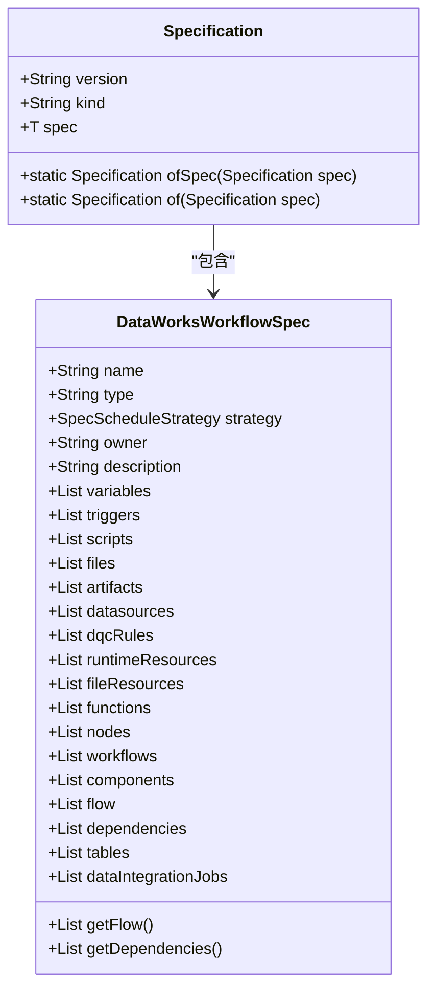
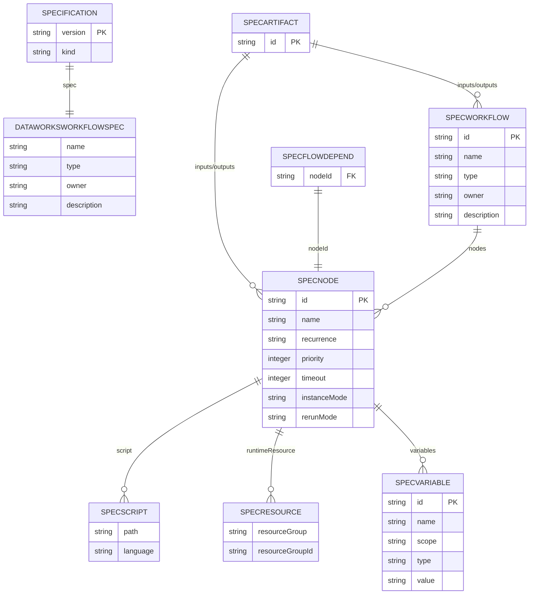
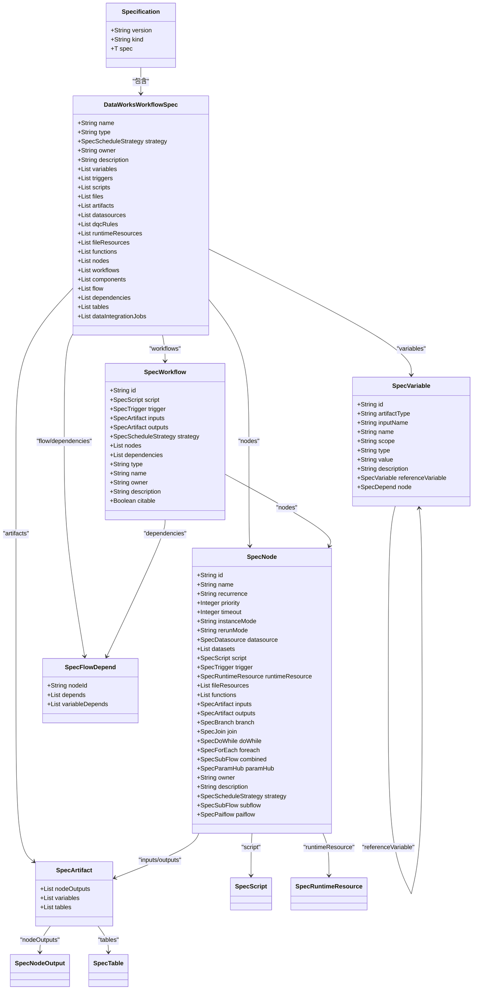
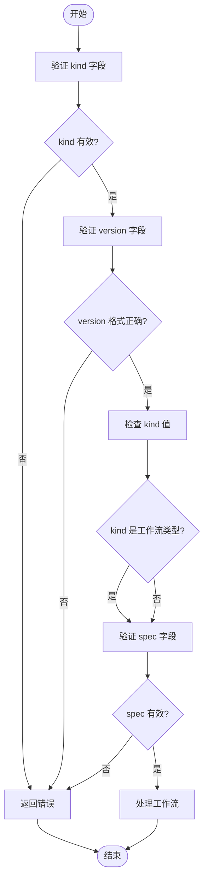
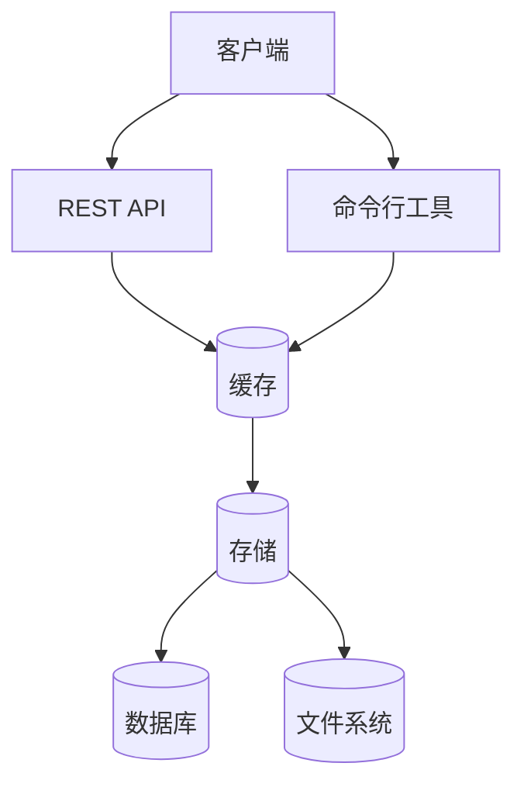
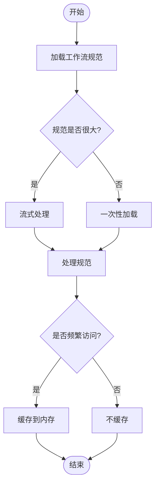
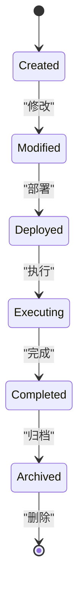
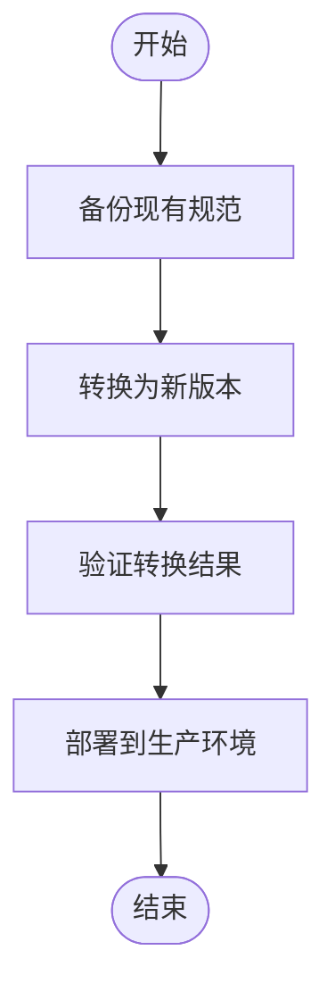
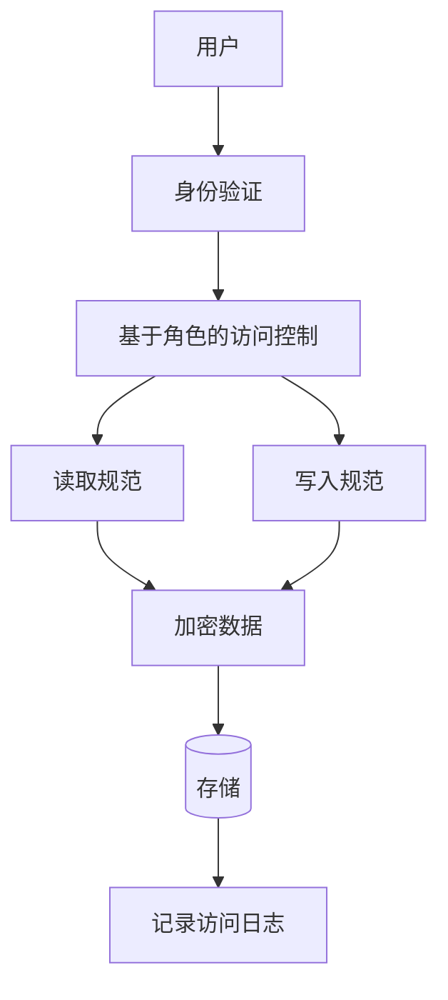

# 数据模型

<cite>
**本文档引用的文件**
- [DataWorksWorkflowSpec.java](file://spec/src/main/java/com/aliyun/dataworks/common/spec/domain/DataWorksWorkflowSpec.java)
- [Specification.java](file://spec/src/main/java/com/aliyun/dataworks/common/spec/domain/Specification.java)
- [Specification.schema.json](file://spec/src/main/resources/spec/schema/Specification.schema.json)
- [DataWorksWorkflowSpec.schema.json](file://spec/src/main/resources/spec/schema/DataWorksWorkflowSpec.schema.json)
- [SpecVariable.schema.json](file://spec/src/main/resources/spec/schema/SpecVariable.schema.json)
- [SpecNode.schema.json](file://spec/src/main/resources/spec/schema/SpecNode.schema.json)
- [SpecWorkflow.schema.json](file://spec/src/main/resources/spec/schema/SpecWorkflow.schema.json)
- [SpecTrigger.schema.json](file://spec/src/main/resources/spec/schema/SpecTrigger.schema.json)
- [SpecScript.schema.json](file://spec/src/main/resources/spec/schema/SpecScript.schema.json)
- [SpecFlowDepend.schema.json](file://spec/src/main/resources/spec/schema/SpecFlowDepend.schema.json)
- [SpecArtifact.schema.json](file://spec/src/main/resources/spec/schema/SpecArtifact.schema.json)
- [SpecTable.schema.json](file://spec/src/main/resources/spec/schema/SpecTable.schema.json)
- [SpecKind.java](file://spec/src/main/java/com/aliyun/dataworks/common/spec/domain/enums/SpecKind.java)
- [1.json](file://schema/testcase/1.json)
- [2.json](file://schema/testcase/2.json)
</cite>

## 目录
1. [介绍](#介绍)
2. [核心数据模型](#核心数据模型)
3. [实体关系与数据类型](#实体关系与数据类型)
4. [主键/外键、索引与约束](#主键外键索引与约束)
5. [数据验证规则与业务规则](#数据验证规则与业务规则)
6. [数据库模式图](#数据库模式图)
7. [示例数据](#示例数据)
8. [数据访问模式与缓存策略](#数据访问模式与缓存策略)
9. [性能考虑因素](#性能考虑因素)
10. [数据生命周期与保留策略](#数据生命周期与保留策略)
11. [数据迁移路径与版本管理](#数据迁移路径与版本管理)
12. [数据安全与访问控制](#数据安全与访问控制)

## 介绍
dataworks-spec项目定义了一套用于DataWorks工作流规范的数据模型，主要通过`DataWorksWorkflowSpec`和`Specification`两个核心类来描述工作流的结构和行为。该数据模型支持多种工作流类型，包括周期性工作流、手动工作流和触发式工作流等。模型采用JSON Schema进行定义，确保了数据的完整性和一致性。通过这套数据模型，用户可以以声明式的方式定义复杂的数据处理流程，包括节点依赖、调度策略、资源分配等。

**Section sources**
- [DataWorksWorkflowSpec.java](file://spec/src/main/java/com/aliyun/dataworks/common/spec/domain/DataWorksWorkflowSpec.java)
- [Specification.java](file://spec/src/main/java/com/aliyun/dataworks/common/spec/domain/Specification.java)

## 核心数据模型
dataworks-spec项目的核心数据模型由`Specification`和`DataWorksWorkflowSpec`两个主要实体构成。`Specification`是顶层实体，定义了工作流的元信息，如版本、类型和具体规范。`DataWorksWorkflowSpec`则包含了工作流的具体内容，如节点、变量、触发器等。



**Diagram sources**
- [Specification.java](file://spec/src/main/java/com/aliyun/dataworks/common/spec/domain/Specification.java)
- [DataWorksWorkflowSpec.java](file://spec/src/main/java/com/aliyun/dataworks/common/spec/domain/DataWorksWorkflowSpec.java)

**Section sources**
- [Specification.java](file://spec/src/main/java/com/aliyun/dataworks/common/spec/domain/Specification.java)
- [DataWorksWorkflowSpec.java](file://spec/src/main/java/com/aliyun/dataworks/common/spec/domain/DataWorksWorkflowSpec.java)

## 实体关系与数据类型
dataworks-spec项目的数据模型定义了多个实体及其关系。`Specification`是顶层实体，包含一个`DataWorksWorkflowSpec`实例。`DataWorksWorkflowSpec`又包含多个子实体，如`SpecNode`、`SpecWorkflow`、`SpecVariable`等。这些实体通过引用关系相互连接，形成一个复杂的工作流图。



**Diagram sources**
- [DataWorksWorkflowSpec.java](file://spec/src/main/java/com/aliyun/dataworks/common/spec/domain/DataWorksWorkflowSpec.java)
- [Specification.java](file://spec/src/main/java/com/aliyun/dataworks/common/spec/domain/Specification.java)
- [SpecNode.java](file://spec/src/main/java/com/aliyun/dataworks/common/spec/domain/ref/SpecNode.java)
- [SpecWorkflow.java](file://spec/src/main/java/com/aliyun/dataworks/common/spec/domain/ref/SpecWorkflow.java)
- [SpecVariable.java](file://spec/src/main/java/com/aliyun/dataworks/common/spec/domain/ref/SpecVariable.java)
- [SpecArtifact.java](file://spec/src/main/java/com/aliyun/dataworks/common/spec/domain/ref/SpecArtifact.java)
- [SpecFlowDepend.java](file://spec/src/main/java/com/aliyun/dataworks/common/spec/domain/noref/SpecFlowDepend.java)
- [SpecScript.java](file://spec/src/main/java/com/aliyun/dataworks/common/spec/domain/ref/SpecScript.java)
- [SpecRuntimeResource.java](file://spec/src/main/java/com/aliyun/dataworks/common/spec/domain/ref/SpecRuntimeResource.java)

**Section sources**
- [DataWorksWorkflowSpec.java](file://spec/src/main/java/com/aliyun/dataworks/common/spec/domain/DataWorksWorkflowSpec.java)
- [Specification.java](file://spec/src/main/java/com/aliyun/dataworks/common/spec/domain/Specification.java)

## 主键/外键、索引与约束
在dataworks-spec项目的数据模型中，主键和外键通过`id`字段来实现。每个实体都有一个唯一的`id`作为主键，其他实体通过引用这个`id`来建立外键关系。例如，`SpecFlowDepend`实体中的`nodeId`字段就是对`SpecNode`实体的`id`字段的引用。

数据模型中的约束主要通过JSON Schema来定义。例如，`Specification`实体的`kind`字段必须是预定义的枚举值之一，`version`字段必须符合`^\\d+\\.\\d+\\.\\d+$`的正则表达式模式。`DataWorksWorkflowSpec`实体中的`nodes`、`workflows`等字段都有最小项数的约束，确保工作流至少包含一个节点或子工作流。



**Diagram sources**
- [Specification.schema.json](file://spec/src/main/resources/spec/schema/Specification.schema.json)
- [DataWorksWorkflowSpec.schema.json](file://spec/src/main/resources/spec/schema/DataWorksWorkflowSpec.schema.json)
- [SpecNode.schema.json](file://spec/src/main/resources/spec/schema/SpecNode.schema.json)
- [SpecWorkflow.schema.json](file://spec/src/main/resources/spec/schema/SpecWorkflow.schema.json)
- [SpecVariable.schema.json](file://spec/src/main/resources/spec/schema/SpecVariable.schema.json)
- [SpecArtifact.schema.json](file://spec/src/main/resources/spec/schema/SpecArtifact.schema.json)
- [SpecFlowDepend.schema.json](file://spec/src/main/resources/spec/schema/SpecFlowDepend.schema.json)

**Section sources**
- [Specification.schema.json](file://spec/src/main/resources/spec/schema/Specification.schema.json)
- [DataWorksWorkflowSpec.schema.json](file://spec/src/main/resources/spec/schema/DataWorksWorkflowSpec.schema.json)

## 数据验证规则与业务规则
dataworks-spec项目的数据模型通过JSON Schema定义了严格的数据验证规则。这些规则确保了数据的完整性和一致性。例如，`Specification`实体的`kind`字段必须是预定义的枚举值之一，`version`字段必须符合`^\\d+\\.\\d+\\.\\d+$`的正则表达式模式。

业务规则主要通过`allOf`、`if`、`then`等条件语句来实现。例如，当`kind`字段的值为`CycleWorkflow`、`ManualWorkflow`或`TriggerWorkflow`时，`spec`字段中必须包含`nodes`或`workflows`字段。这些规则确保了不同类型的工作流具有相应的结构。



**Diagram sources**
- [Specification.schema.json](file://spec/src/main/resources/spec/schema/Specification.schema.json)

**Section sources**
- [Specification.schema.json](file://spec/src/main/resources/spec/schema/Specification.schema.json)

## 数据库模式图
dataworks-spec项目的数据模型可以映射到关系型数据库的表结构。每个核心实体对应一个数据库表，表之间的关系通过外键来实现。


**Diagram sources**
- [DataWorksWorkflowSpec.java](file://spec/src/main/java/com/aliyun/dataworks/common/spec/domain/DataWorksWorkflowSpec.java)
- [Specification.java](file://spec/src/main/java/com/aliyun/dataworks/common/spec/domain/Specification.java)

**Section sources**
- [DataWorksWorkflowSpec.java](file://spec/src/main/java/com/aliyun/dataworks/common/spec/domain/DataWorksWorkflowSpec.java)
- [Specification.java](file://spec/src/main/java/com/aliyun/dataworks/common/spec/domain/Specification.java)

## 示例数据
以下是两个示例数据，展示了`Specification`实体的具体内容。

```json
{
  "$schema": ".././flow.schema.json",
  "version": "1.1.0",
  "kind": "CycleWorkflow",
  "spec": {
    "nodes": [
      {
        "recurrence": "Normal",
        "id": "27766077",
        "timeout": 0,
        "instanceMode": "T+1",
        "rerunMode": "Allowed",
        "rerunTimes": 0,
        "rerunInterval": 0,
        "datasource": {
          "name": "odps_first",
          "type": ""
        },
        "script": {
          "path": "业务流程/数据分析/MaxCompute/数据开发/webexcel_save_queries_draft_fdt",
          "runtime": {
            "command": "ODPS_SQL"
          },
          "parameters": [
            {
              "name": "bizdate",
              "artifactType": "Variable",
              "scope": "NodeParameter",
              "type": "System",
              "value": "$[yyyymmdd-1]"
            },
            {
              "name": "region",
              "artifactType": "Variable",
              "scope": "NodeParameter",
              "type": "System",
              "value": "group"
            }
          ]
        },
        "trigger": {
          "type": "Scheduler",
          "cron": "00 26 00 * * ?",
          "startTime": "1970-01-01 00:00:00",
          "endTime": "9999-01-01 00:00:00",
          "timezone": "Asia/Shanghai"
        },
        "runtimeResource": {
          "resourceGroup": "group_83452228",
          "resourceGroupId": "617010594644417"
        },
        "name": "webexcel_save_queries_draft_fdt",
        "owner": "082744",
        "inputs": {
          "nodeOutputs": [
            {
              "data": "dataworks_analyze.ods_dw_excel_da_sys_user_config_fdt_group",
              "artifactType": "NodeOutput"
            },
            {
              "data": "dataworks_analyze.ods_dw_webexcel_da_storage_block_fdt_group",
              "artifactType": "NodeOutput"
            },
            {
              "data": "odps.dataworks_analyze.ods_dw_webexcel_da_sys_file_fdt_group",
              "artifactType": "NodeOutput"
            },
            {
              "data": "dataworks_analyze.ods_dw_excel_da_sys_sql_draft_fdt_group",
              "artifactType": "NodeOutput"
            },
            {
              "data": "dataworks_analyze.ods_dw_webexcel_da_storage_router_fdt_group",
              "artifactType": "NodeOutput"
            }
          ]
        },
        "outputs": {
          "nodeOutputs": [
            {
              "data": "dataworks_meta.27766077_out",
              "artifactType": "NodeOutput"
            },
            {
              "data": "dataworks_meta.webexcel_saved_queries_draft_fdt",
              "artifactType": "NodeOutput",
              "refTableName": "dataworks_meta.webexcel_saved_queries_draft_fdt"
            },
            {
              "data": "dataworks_meta.webexcel_save_queries_draft_fdt",
              "artifactType": "NodeOutput"
            }
          ]
        }
      }
    ],
    "flow": [
      {
        "nodeId": "27766077",
        "depends": [
          {
            "type": "Normal",
            "output": "dataworks_analyze.ods_dw_excel_da_sys_user_config_fdt_group"
          },
          {
            "type": "Normal",
            "output": "dataworks_analyze.ods_dw_webexcel_da_storage_block_fdt_group"
          },
          {
            "type": "Normal",
            "output": "dataworks_analyze.ods_dw_webexcel_da_storage_router_fdt_group"
          },
          {
            "type": "Normal",
            "output": "odps.dataworks_analyze.ods_dw_webexcel_da_sys_file_fdt_group"
          },
          {
            "type": "Normal",
            "output": "dataworks_analyze.ods_dw_excel_da_sys_sql_draft_fdt_group"
          }
        ]
      }
    ]
  }
}
```

```json
{
  "$schema": ".././flow.schema.json",
  "version": "1.1.0",
  "kind": "CycleWorkflow",
  "spec": {
    "nodes": [
      {
        "recurrence": "Normal",
        "id": "7064438951033445660",
        "timeout": 0,
        "instanceMode": "T+1",
        "rerunMode": "Allowed",
        "rerunTimes": 3,
        "rerunInterval": 180000,
        "script": {
          "path": "业务流程/数据分析/MaxCompute/数据开发/dws_chat_history_fdt",
          "language": "odps-sql",
          "runtime": {
            "engine": "MaxCompute",
            "command": "ODPS_SQL"
          }
        },
        "trigger": {
          "type": "Scheduler",
          "cron": "00 00 00 * * ?",
          "startTime": "1970-01-01 00:00:00",
          "endTime": "9999-01-01 00:00:00",
          "timezone": "Asia/Shanghai"
        },
        "runtimeResource": {
          "resourceGroup": "group_83452228",
          "resourceGroupId": "83452228"
        },
        "name": "dws_chat_history_fdt",
        "owner": "082744",
        "inputs": {
          "tables": [
            {
              "artifactType": "Table",
              "guid": ""
            }
          ],
          "variables": [
            {
              "artifactType": "Variable",
              "id": "",
              "name": "",
              "scope": "NodeContext",
              "type": "Constant",
              "value": ""
            }
          ],
          "nodeOutputs": [
            {
              "artifactType": "NodeOutput",
              "output": ""
            }
          ]
        },
        "outputs": {
          "nodeOutputs": [
            {
              "data": "7064438951033445660",
              "artifactType": "NodeOutput",
              "refTableName": "dws_chat_history_fdt"
            }
          ]
        }
      }
    ]
  }
}
```

**Section sources**
- [1.json](file://schema/testcase/1.json)
- [2.json](file://schema/testcase/2.json)

## 数据访问模式与缓存策略
dataworks-spec项目的数据模型支持多种数据访问模式。客户端可以通过REST API或命令行工具来读取和写入工作流规范。数据通常以JSON格式存储在文件系统或数据库中。

缓存策略方面，系统可能会在内存中缓存频繁访问的工作流规范，以提高性能。此外，还可以使用分布式缓存系统（如Redis）来缓存工作流的元数据，减少对后端存储的访问压力。



**Diagram sources**
- [DataWorksWorkflowSpec.java](file://spec/src/main/java/com/aliyun/dataworks/common/spec/domain/DataWorksWorkflowSpec.java)
- [Specification.java](file://spec/src/main/java/com/aliyun/dataworks/common/spec/domain/Specification.java)

**Section sources**
- [DataWorksWorkflowSpec.java](file://spec/src/main/java/com/aliyun/dataworks/common/spec/domain/DataWorksWorkflowSpec.java)
- [Specification.java](file://spec/src/main/java/com/aliyun/dataworks/common/spec/domain/Specification.java)

## 性能考虑因素
在设计和实现dataworks-spec项目的数据模型时，需要考虑以下几个性能因素：

1. **数据序列化和反序列化**：由于工作流规范通常以JSON格式存储，序列化和反序列化的性能对系统整体性能有重要影响。建议使用高效的JSON库（如Fastjson2）来处理数据。
2. **内存使用**：大型工作流规范可能会占用大量内存。建议在处理大型规范时采用流式处理方式，避免一次性加载整个规范到内存中。
3. **缓存策略**：合理使用缓存可以显著提高系统性能。建议对频繁访问的工作流规范进行缓存，并设置合适的缓存过期策略。
4. **数据库查询优化**：如果工作流规范存储在数据库中，需要对查询进行优化，如创建适当的索引，避免全表扫描。



**Diagram sources**
- [DataWorksWorkflowSpec.java](file://spec/src/main/java/com/aliyun/dataworks/common/spec/domain/DataWorksWorkflowSpec.java)
- [Specification.java](file://spec/src/main/java/com/aliyun/dataworks/common/spec/domain/Specification.java)

**Section sources**
- [DataWorksWorkflowSpec.java](file://spec/src/main/java/com/aliyun/dataworks/common/spec/domain/DataWorksWorkflowSpec.java)
- [Specification.java](file://spec/src/main/java/com/aliyun/dataworks/common/spec/domain/Specification.java)

## 数据生命周期与保留策略
dataworks-spec项目的数据模型支持完整的工作流生命周期管理。工作流规范从创建、修改、部署到归档的整个过程都可以通过数据模型来描述。

保留策略方面，系统可以根据业务需求设置不同的保留期限。例如，可以设置工作流规范在完成执行后保留30天，然后自动归档。归档的数据可以存储在低成本的存储系统中，以节省存储成本。



**Diagram sources**
- [DataWorksWorkflowSpec.java](file://spec/src/main/java/com/aliyun/dataworks/common/spec/domain/DataWorksWorkflowSpec.java)
- [Specification.java](file://spec/src/main/java/com/aliyun/dataworks/common/spec/domain/Specification.java)

**Section sources**
- [DataWorksWorkflowSpec.java](file://spec/src/main/java/com/aliyun/dataworks/common/spec/domain/DataWorksWorkflowSpec.java)
- [Specification.java](file://spec/src/main/java/com/aliyun/dataworks/common/spec/domain/Specification.java)

## 数据迁移路径与版本管理
dataworks-spec项目的数据模型支持版本管理。每个工作流规范都有一个`version`字段，用于标识其版本。当需要对数据模型进行升级时，可以通过版本转换器来实现平滑迁移。

数据迁移路径通常包括以下几个步骤：
1. **备份**：在进行任何迁移操作之前，首先备份现有的工作流规范。
2. **转换**：使用版本转换器将旧版本的规范转换为新版本。
3. **验证**：验证转换后的规范是否符合新的数据模型。
4. **部署**：将转换后的规范部署到生产环境。



**Diagram sources**
- [DataWorksWorkflowSpec.java](file://spec/src/main/java/com/aliyun/dataworks/common/spec/domain/DataWorksWorkflowSpec.java)
- [Specification.java](file://spec/src/main/java/com/aliyun/dataworks/common/spec/domain/Specification.java)
- [VersionConverter.java](file://spec/src/main/java/com/aliyun/dataworks/common/spec/version/VersionConverter.java)

**Section sources**
- [DataWorksWorkflowSpec.java](file://spec/src/main/java/com/aliyun/dataworks/common/spec/domain/DataWorksWorkflowSpec.java)
- [Specification.java](file://spec/src/main/java/com/aliyun/dataworks/common/spec/domain/Specification.java)

## 数据安全与访问控制
dataworks-spec项目的数据模型内置了数据安全和访问控制机制。每个工作流规范都有一个`owner`字段，用于标识其所有者。系统可以根据所有者信息来控制对规范的访问权限。

此外，还可以通过加密存储、访问日志记录等方式来增强数据安全性。例如，可以对敏感信息（如数据库密码）进行加密存储，并记录所有对工作流规范的访问和修改操作。



**Diagram sources**
- [DataWorksWorkflowSpec.java](file://spec/src/main/java/com/aliyun/dataworks/common/spec/domain/DataWorksWorkflowSpec.java)
- [Specification.java](file://spec/src/main/java/com/aliyun/dataworks/common/spec/domain/Specification.java)

**Section sources**
- [DataWorksWorkflowSpec.java](file://spec/src/main/java/com/aliyun/dataworks/common/spec/domain/DataWorksWorkflowSpec.java)
- [Specification.java](file://spec/src/main/java/com/aliyun/dataworks/common/spec/domain/Specification.java)