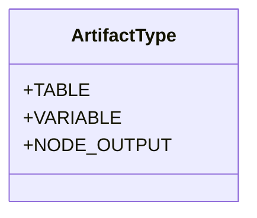
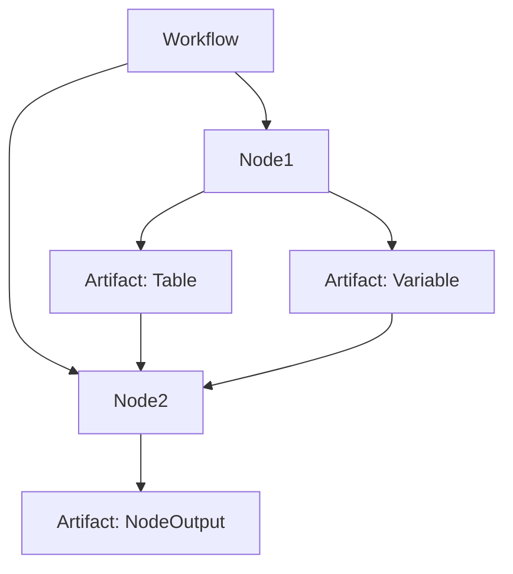
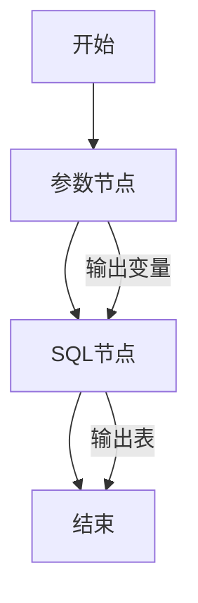

# Artifact模型

<cite>
**本文档引用的文件**
- [artifact.schema.json](file://schema/artifact.schema.json)
- [ArtifactType.java](file://spec/src/main/java/com/aliyun/dataworks/common/spec/domain/enums/ArtifactType.java)
- [node.schema.json](file://schema/node.schema.json)
- [cycle_workflow_spec.json](file://spec/src/test/resources/copier/cycle_workflow_spec.json)
- [manual.json](file://spec/src/test/resources/nodemodel/manual.json)
</cite>

## 目录
1. [引言](#引言)
2. [核心字段定义](#核心字段定义)
3. [ArtifactType枚举值](#artifacttype枚举值)
4. [与Node和Workflow的关联关系](#与node和workflow的关联关系)
5. [JSON Schema定义示例](#json-schema定义示例)
6. [生命周期管理](#生命周期管理)
7. [权限控制规则](#权限控制规则)
8. [应用示例与最佳实践](#应用示例与最佳实践)

## 引言
Artifact模型是数据工作流系统中的核心实体，用于定义工作流节点的输入和输出。它作为数据流和控制流的载体，支持不同类型的数据资产在工作流中的传递和引用。本文档详细说明了Artifact的结构、类型、关联关系以及实际应用。

**Section sources**
- [artifact.schema.json](file://schema/artifact.schema.json)

## 核心字段定义
Artifact实体包含以下核心属性：

- **id**: 唯一标识符，字符串类型，用于唯一识别一个Artifact实例
- **name**: 名称，字符串类型，表示Artifact的可读名称
- **type**: 类型，字符串类型，表示Artifact的分类，其值必须是预定义的枚举值之一
- **guid**: 全局唯一标识符，字符串类型，用于标识产出表等资源的唯一性

这些字段共同构成了Artifact的基本信息，确保了在复杂工作流中能够准确地识别和引用各种数据资产。

**Section sources**
- [artifact.schema.json](file://schema/artifact.schema.json)

## ArtifactType枚举值
ArtifactType枚举定义了Artifact的三种主要类型：

| 值 | 含义 |
|----|------|
| `"Table"` | 表，表示数据库或数据仓库中的表资源 |
| `"Variable"` | 变量，表示工作流中使用的变量 |
| `"NodeOutput"` | 节点输出，表示工作流节点的输出结果 |

这些枚举值在系统中用于区分不同类型的Artifact，确保类型安全和语义清晰。每种类型都有其特定的使用场景和处理逻辑。



**Diagram sources**
- [ArtifactType.java](file://spec/src/main/java/com/aliyun/dataworks/common/spec/domain/enums/ArtifactType.java)

**Section sources**
- [ArtifactType.java](file://spec/src/main/java/com/aliyun/dataworks/common/spec/domain/enums/ArtifactType.java)

## 与Node和Workflow的关联关系
Artifact与Node和Workflow之间存在紧密的依赖机制。Node通过inputs和outputs字段引用Artifact，形成数据流的依赖关系。Workflow则通过组织多个Node及其Artifact依赖，构建完整的数据处理流程。

在Node的定义中，inputs字段包含tables、variables和nodeOutputs三个子字段，分别对应不同类型的输入Artifact。同样，outputs字段也包含相应的输出定义。这种设计使得数据流的依赖关系清晰可见，便于调度和执行。



**Diagram sources**
- [node.schema.json](file://schema/node.schema.json)

**Section sources**
- [node.schema.json](file://schema/node.schema.json)

## JSON Schema定义示例
以下是Artifact的JSON Schema定义示例：

```json
{
  "artifactType": "Variable",
  "id": "unique-id-123",
  "name": "example_variable",
  "scope": "Workflow",
  "type": "System",
  "value": "$[yyyymmdd]"
}
```

该示例展示了一个工作流级别的系统变量定义，其值为日期格式的系统变量。Schema定义确保了数据结构的规范性和一致性。

**Section sources**
- [artifact.schema.json](file://schema/artifact.schema.json)

## 生命周期管理
Artifact的生命周期与其所属的Node和Workflow紧密相关。当Workflow被创建时，相关的Artifact也随之创建；当Node执行完成时，其输出Artifact被标记为可用；当Workflow结束时，临时的Artifact可能会被清理。

版本控制机制通过在Artifact定义中包含版本信息来实现，确保在工作流的不同版本中能够正确引用相应的Artifact实例。

**Section sources**
- [cycle_workflow_spec.json](file://spec/src/test/resources/copier/cycle_workflow_spec.json)

## 权限控制规则
Artifact的权限控制基于其作用域(scope)属性实现。不同作用域的Artifact具有不同的访问权限：

- NodeParameter: 仅限节点内部使用
- NodeContext: 可被下游节点使用
- Workflow: 可被工作流内所有节点使用
- Workspace: 可被工作空间内所有节点使用
- Tenant: 可被租户内所有节点使用

这种分级的权限控制机制确保了数据的安全性和隔离性。

**Section sources**
- [artifact.schema.json](file://schema/artifact.schema.json)

## 应用示例与最佳实践
### 数据表Artifact
数据表类型的Artifact通常用于ETL流程中，作为数据源或目标表的引用。最佳实践是使用GUID来确保表的唯一性，避免命名冲突。

### 变量Artifact
变量类型的Artifact广泛应用于参数化工作流。系统变量如$[yyyymmdd]可用于日期分区处理，常量变量可用于配置参数。

### 节点输出Artifact
节点输出类型的Artifact用于实现节点间的依赖传递。通过将前序节点的输出作为后续节点的输入，构建复杂的数据处理流水线。



**Diagram sources**
- [manual.json](file://spec/src/test/resources/nodemodel/manual.json)

**Section sources**
- [manual.json](file://spec/src/test/resources/nodemodel/manual.json)