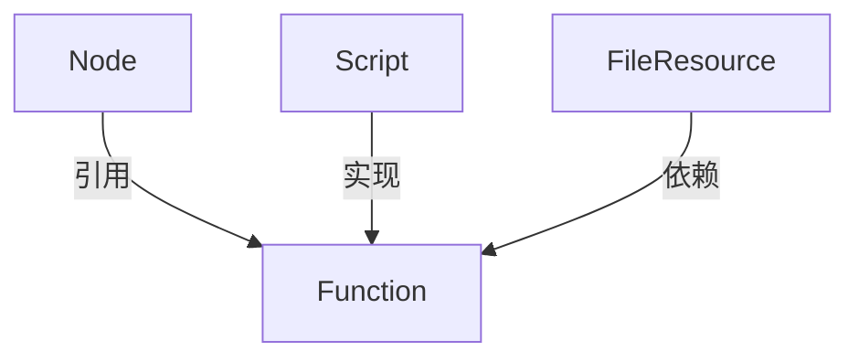

# Function模型

<cite>
**本文档中引用的文件**   
- [Function.java](file://client/migrationx/migrationx-domain/migrationx-domain-dataworks/src/main/java/com/aliyun/dataworks/migrationx/domain/dataworks/objects/entity/Function.java)
- [SpecFunction.java](file://spec/src/main/java/com/aliyun/dataworks/common/spec/domain/ref/SpecFunction.java)
- [FunctionType.java](file://spec/src/main/java/com/aliyun/dataworks/common/spec/domain/enums/FunctionType.java)
- [function.schema.json](file://schema/function.schema.json)
- [SpecFunction.schema.json](file://spec/src/main/resources/spec/schema/SpecFunction.schema.json)
- [node.md](file://schema/docs/node.md)
- [spec-fields.md](file://docs/spec/spec-fields.md)
</cite>

## 目录
1. [简介](#简介)
2. [核心字段定义](#核心字段定义)
3. [FunctionType枚举](#functiontype枚举)
4. [关联关系与调用机制](#关联关系与调用机制)
5. [JSON Schema定义](#json-schema定义)
6. [注册与权限控制](#注册与权限控制)
7. [计算引擎应用示例](#计算引擎应用示例)
8. [最佳实践](#最佳实践)

## 简介
Function实体模型是DataWorks工作流系统中的核心组件之一，用于定义和管理用户自定义函数（UDF）及其他内置函数。该模型支持在工作流节点中引用和使用各种函数，为数据处理和转换提供灵活的扩展能力。Function模型不仅支持从外部资源文件引用函数，还支持内嵌代码定义，满足不同场景下的函数使用需求。

## 核心字段定义

Function模型包含多个核心属性，用于完整描述一个函数的特征和行为。主要字段包括：

- **id**: 字符串类型，函数的唯一标识符
- **name**: 字符串类型，函数名称，用于在工作流中引用
- **type**: 字符串类型，函数类型，对应FunctionType枚举值
- **resource**: 字符串类型，函数资源路径或标识
- **script**: 对象类型，关联的脚本定义
- **fileResources**: 对象类型，使用的资源列表
- **className**: 字符串类型，Java类名（适用于Java UDF）
- **embeddedCode**: 字符串类型，内嵌的函数代码
- **resourceType**: 字符串类型，资源类型（file或embedded）
- **embeddedCodeType**: 字符串类型，内嵌代码类型（如python2, java8等）
- **argumentsDescription**: 字符串类型，参数描述
- **returnValueDescription**: 字符串类型，返回值描述
- **usageExample**: 字符串类型，使用示例
- **connection**: 字符串类型，连接信息
- **owner**: 字符串类型，函数所有者
- **ownerName**: 字符串类型，所有者名称
- **folder**: 字符串类型，函数所属文件夹
- **command**: 字符串类型，执行命令
- **description**: 字符串类型，函数描述

这些字段共同构成了Function实体的完整定义，支持在不同计算引擎和场景下的函数使用需求。

**Section sources**
- [Function.java](file://client/migrationx/migrationx-domain/migrationx-domain-dataworks/src/main/java/com/aliyun/dataworks/migrationx/domain/dataworks/objects/entity/Function.java#L34-L240)
- [SpecFunction.java](file://spec/src/main/java/com/aliyun/dataworks/common/spec/domain/ref/SpecFunction.java#L36-L55)

## FunctionType枚举

FunctionType枚举定义了系统支持的函数类型分类，每种类型对应特定的使用场景和功能特性：

- **MATH (数学运算函数)**: 用于执行基本数学运算和复杂数学计算，如加减乘除、三角函数、对数运算等
- **AGGREGATE (聚合函数)**: 用于数据聚合操作，如SUM、AVG、COUNT、MAX、MIN等统计函数
- **STRING (字符串处理函数)**: 用于字符串操作和处理，如字符串拼接、截取、替换、正则表达式匹配等
- **DATE (日期处理函数)**: 用于日期和时间的处理，如日期格式化、日期计算、时区转换等
- **ANALYTIC (窗口函数)**: 用于执行窗口分析操作，支持在数据窗口内进行排序、排名、累计计算等复杂分析
- **OTHER (其他函数)**: 用于归类不属于上述类型的其他函数，包括自定义函数和特殊用途函数

这些枚举值不仅用于函数分类，还在系统内部用于权限控制、资源分配和执行优化，确保不同类型的函数能够得到适当的处理和管理。

**Section sources**
- [FunctionType.java](file://spec/src/main/java/com/aliyun/dataworks/common/spec/domain/enums/FunctionType.java#L24-L55)

## 关联关系与调用机制

Function模型与Node、Script等核心组件存在紧密的关联关系，构成了工作流执行的基础架构。

### 与Node的关联
Function通过节点的`functions`属性与Node建立关联。在工作流定义中，节点可以引用一个或多个函数，这些函数在节点执行时被调用。Node模型中的`functions`字段是一个对象数组，每个元素引用一个已定义的Function实体。



**Diagram sources**
- [node.md](file://schema/docs/node.md#L144-L161)
- [spec-fields.md](file://docs/spec/spec-fields.md#L286-L291)

### 与Script的关联
Function通过`script`属性与Script建立关联。Script定义了函数的具体实现代码或引用的脚本文件。当函数类型为内嵌代码时，`embeddedCode`字段直接包含函数代码；当函数类型为外部资源时，`script`字段引用外部脚本文件。

### 调用机制
Function的调用机制遵循以下流程：
1. 工作流引擎解析节点定义，识别引用的函数
2. 加载函数定义，包括代码和依赖资源
3. 根据函数类型和计算引擎准备执行环境
4. 在节点执行上下文中调用函数
5. 处理函数返回值并继续工作流执行

这种机制确保了函数能够在正确的上下文中被安全调用，同时支持跨节点和跨工作流的函数复用。

**Section sources**
- [node.md](file://schema/docs/node.md#L144-L161)
- [spec-fields.md](file://docs/spec/spec-fields.md#L286-L291)

## JSON Schema定义

Function模型的JSON Schema定义提供了结构化的数据验证规则，确保函数定义的正确性和一致性。

### 基础Schema
```json
{
  "id": "https://dataworks.data.aliyun.com/schemas/1.1.0/script.schema.json",
  "title": "Function",
  "description": "定义工作流节点使用的UDF",
  "type": "object",
  "properties": {
    "id": {
      "description": "唯一标识",
      "type": "string"
    },
    "name": {
      "description": "函数名称",
      "type": "string"
    },
    "script": {
      "description": "使用的脚本",
      "$ref": "script.schema.json"
    },
    "fileResources": {
      "description": "使用的资源列表",
      "$ref": "fileResource.schema.json"
    }
  },
  "required": [
    "id",
    "name",
    "script"
  ]
}
```

### 扩展Schema
```json
{
  "$schema": "https://json-schema.org/draft/2020-12/schema",
  "title": "SpecFunction json schema",
  "type": "object",
  "properties": {
    "id": { "type": "string" },
    "name": { "type": "string" },
    "script": { "$ref": "classpath:spec/schema/SpecScript.schema.json" },
    "type": {
      "type": "string",
      "enum": [
        "math",
        "aggregate",
        "string",
        "date",
        "analytic",
        "other"
      ]
    },
    "className": { "type": "string" },
    "datasource": { "$ref": "classpath:spec/schema/SpecDatasource.schema.json" },
    "runtimeResource": { "$ref": "classpath:spec/schema/SpecRuntimeResource.schema.json" },
    "fileResources": {
      "type": "array",
      "items": { "$ref": "classpath:spec/schema/SpecFileResource.schema.json" }
    },
    "armResource": { "type": "string" },
    "usageDescription": { "type": "string" },
    "argumentsDescription": { "type": "string" },
    "returnValueDescription": { "type": "string" },
    "usageExample": { "type": "string" },
    "embeddedCodeType": {
      "type": "string",
      "description": "Embedded code type, e.g., python2, java8.",
      "enum": [
        "python2",
        "python3",
        "java8",
        "java11",
        "java17"
      ]
    },
    "resourceType": {
      "type": "string",
      "description": "Resource type, e.g., file, embedded.",
      "enum": [
        "file",
        "embedded"
      ]
    },
    "embeddedCode": { "type": "string" }
  },
  "required": [
    "name",
    "script"
  ]
}
```

这些Schema定义确保了Function实体在不同场景下的数据完整性和一致性，为系统集成和数据交换提供了标准化的基础。

**Section sources**
- [function.schema.json](file://schema/function.schema.json#L1-L29)
- [SpecFunction.schema.json](file://spec/src/main/resources/spec/schema/SpecFunction.schema.json#L1-L84)

## 注册与权限控制

Function的注册和管理遵循严格的权限控制机制，确保系统的安全性和稳定性。

### 注册流程
1. 用户提交函数定义，包括函数名称、类型、代码或资源引用
2. 系统验证函数定义的完整性和正确性
3. 检查函数名称的唯一性，避免命名冲突
4. 验证用户对指定资源组和数据源的访问权限
5. 将函数元数据存储到系统中
6. 如果是Java UDF，进行代码编译和验证
7. 返回注册结果和函数唯一标识

### 权限控制
Function的权限控制基于多层次的安全模型：

- **所有者权限**: 函数创建者拥有完全控制权，包括修改、删除和权限分配
- **资源组权限**: 函数只能在授权的资源组中使用，确保资源隔离
- **数据源权限**: 函数访问的数据源必须在用户权限范围内
- **执行权限**: 只有授权用户才能在工作流中引用和执行函数
- **审计日志**: 所有函数操作都被记录，支持安全审计和问题追溯

这种权限控制机制确保了函数的安全使用，防止未经授权的访问和潜在的安全风险。

**Section sources**
- [Function.java](file://client/migrationx/migrationx-domain/migrationx-domain-dataworks/src/main/java/com/aliyun/dataworks/migrationx/domain/dataworks/objects/entity/Function.java#L99-L113)
- [SpecFunctionEntityAdapter.java](file://client/migrationx/migrationx-domain/migrationx-domain-dataworks/src/main/java/com/aliyun/dataworks/migrationx/domain/dataworks/service/spec/entity/SpecFunctionEntityAdapter.java#L41-L82)

## 计算引擎应用示例

### MaxCompute引擎
在MaxCompute引擎中，Function通常用于定义UDF（用户自定义函数），支持Java和Python语言。

```json
{
  "id": "udf_geo_loc",
  "name": "geo_loc",
  "type": "other",
  "script": {
    "id": "script_geo_py",
    "path": "/scripts/geo_location.py",
    "language": "python",
    "runtime": {
      "engine": "MaxCompute",
      "command": "PYODPS"
    }
  },
  "fileResources": [
    {
      "id": "res_geo_py",
      "name": "geo_location.py",
      "script": "{{script_geo_py}}"
    }
  ],
  "embeddedCodeType": "python3",
  "resourceType": "file"
}
```

### Hologres引擎
在Hologres引擎中，Function可用于定义SQL函数或存储过程，支持复杂的数据处理逻辑。

```json
{
  "id": "func_analytic",
  "name": "window_rank",
  "type": "analytic",
  "script": {
    "id": "script_rank_sql",
    "path": "/scripts/window_rank.sql",
    "language": "sql",
    "runtime": {
      "engine": "Hologres",
      "command": "HologresSQL"
    }
  },
  "resourceType": "file"
}
```

这些示例展示了Function模型在不同计算引擎中的具体应用，体现了其灵活性和可扩展性。

**Section sources**
- [spec-fields.md](file://docs/spec/spec-fields.md#L114-L144)
- [node.md](file://schema/docs/node.md#L72-L88)

## 最佳实践

### 函数设计最佳实践
1. **命名规范**: 使用清晰、描述性的函数名称，避免使用缩写和模糊词汇
2. **参数设计**: 合理设计函数参数，确保参数类型明确，提供详细的参数描述
3. **错误处理**: 实现完善的错误处理机制，提供有意义的错误信息
4. **性能优化**: 避免在函数中执行耗时操作，合理使用缓存机制
5. **安全性**: 验证输入参数，防止注入攻击和其他安全漏洞

### 使用最佳实践
1. **复用优先**: 尽量复用已有的函数，避免重复定义相同功能的函数
2. **版本管理**: 对重要函数进行版本管理，确保向后兼容性
3. **文档完善**: 提供完整的函数文档，包括使用示例和参数说明
4. **测试验证**: 在生产环境使用前，进行充分的测试验证
5. **监控告警**: 对关键函数设置监控和告警，及时发现和解决问题

### 性能最佳实践
1. **资源优化**: 根据函数复杂度合理分配计算资源
2. **并发控制**: 对于高并发场景，考虑函数的并发执行能力
3. **缓存策略**: 对于计算结果不变的函数，使用缓存减少重复计算
4. **批处理**: 对于大量数据处理，考虑使用批处理模式
5. **异步执行**: 对于耗时较长的函数，考虑使用异步执行模式

遵循这些最佳实践，可以确保Function模型在实际应用中的高效、安全和可靠运行。

**Section sources**
- [spec-fields.md](file://docs/spec/spec-fields.md#L114-L144)
- [node.md](file://schema/docs/node.md#L72-L88)