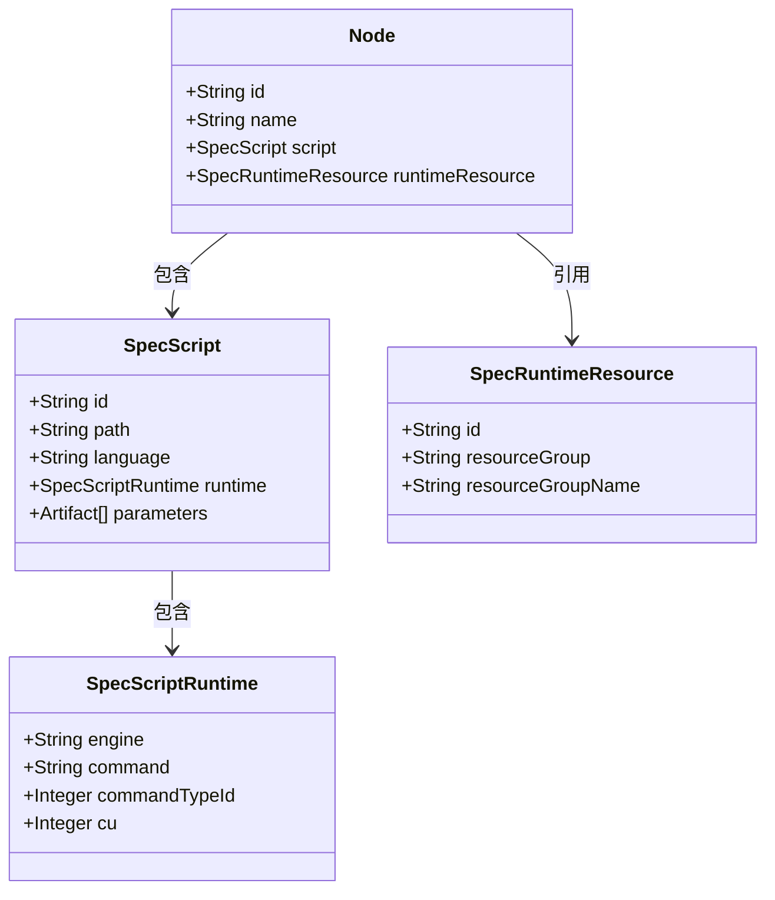

# Script模型

<cite>
**本文档中引用的文件**  
- [script.schema.json](file://schema/script.schema.json)
- [LanguageEnum.java](file://spec/src/main/java/com/aliyun/dataworks/common/spec/domain/dw/types/LanguageEnum.java)
- [SpecScriptRuntime.java](file://spec/src/main/java/com/aliyun/dataworks/common/spec/domain/ref/SpecScriptRuntime.java)
- [SpecScript.java](file://spec/src/main/java/com/aliyun/dataworks/common/spec/domain/ref/SpecScript.java)
- [ResourceSpecUpdateAdapter.java](file://client/migrationx/migrationx-domain/migrationx-domain-dataworks/src/main/java/com/aliyun/dataworks/migrationx/domain/dataworks/service/spec/ResourceSpecUpdateAdapter.java)
- [SpecComponentEntityAdapter.java](file://client/migrationx/migrationx-domain/migrationx-domain-dataworks/src/main/java/com/aliyun/dataworks/migrationx/domain/dataworks/service/spec/entity/SpecComponentEntityAdapter.java)
- [DataWorksSpecPackageFileService.java](file://client/migrationx/migrationx-domain/migrationx-domain-dataworks/src/main/java/com/aliyun/dataworks/migrationx/domain/dataworks/service/impl/DataWorksSpecPackageFileService.java)
- [NodeSpecUpdateAdapter.java](file://client/migrationx/migrationx-domain/migrationx-domain-dataworks/src/main/java/com/aliyun/dataworks/migrationx/domain/dataworks/service/spec/NodeSpecUpdateAdapter.java)
</cite>

## 目录
1. [简介](#简介)
2. [Script字段定义](#script字段定义)
3. [Language枚举值与使用场景](#language枚举值与使用场景)
4. [Script与Node、RuntimeResource的关联关系](#script与node、runtimeresource的关联关系)
5. [JSON Schema定义示例](#json-schema定义示例)
6. [实际使用案例](#实际使用案例)
7. [存储管理与版本控制](#存储管理与版本控制)
8. [安全执行策略](#安全执行策略)
9. [不同类型脚本任务的应用示例](#不同类型脚本任务的应用示例)
10. [最佳实践](#最佳实践)

## 简介
Script实体模型是DataWorks工作流系统中的核心组件之一，用于定义和引用在工作流节点中执行的脚本。它不仅包含了脚本的基本信息（如路径、语言类型），还通过运行时配置（runtime）指定了执行环境和命令标识，支持多种脚本语言和计算引擎。Script模型的设计旨在实现灵活的任务调度、跨平台迁移以及统一的资源管理。

本文档将详细阐述Script模型的结构、字段含义、与其他实体的关系，并提供实际应用示例和最佳实践建议。

**Section sources**
- [script.schema.json](file://schema/script.schema.json)
- [SpecScript.java](file://spec/src/main/java/com/aliyun/dataworks/common/spec/domain/ref/SpecScript.java)

## Script字段定义
Script模型由多个关键字段构成，每个字段都有其特定的数据类型和语义含义。以下是各字段的详细说明：

| 字段名 | 类型 | 是否必填 | 描述 |
|-------|------|--------|------|
| id | string | 是 | 脚本的唯一标识符，用于在系统中唯一识别该脚本实例 |
| path | string | 是 | 脚本文件的存储路径，通常为相对路径，指向具体的脚本内容文件 |
| language | string | 否 | 脚本语言类型，表示脚本使用的编程或查询语言，取值来自LanguageEnum枚举 |
| runtime | object | 是 | 运行时配置对象，包含执行所需的引擎和命令信息 |
| parameters | array[Artifact] | 否 | 脚本参数列表，每个参数为一个Artifact对象，用于传递输入参数 |

其中，`runtime`对象包含以下子字段：
- `engine`: 字符串类型，表示运行时所依赖的计算引擎（如ODPS、EMR等）
- `command`: 字符串类型，表示运行时环境的命令标识，用于确定执行方式
- `commandTypeId`: 整数类型，可选，用于标识特定类型的命令编号
- `cu`: 整数类型，可选，表示计算单元数量

**Section sources**
- [script.schema.json](file://schema/script.schema.json)
- [SpecScript.java](file://spec/src/main/java/com/aliyun/dataworks/common/spec/domain/ref/SpecScript.java)
- [SpecScriptRuntime.java](file://spec/src/main/java/com/aliyun/dataworks/common/spec/domain/ref/SpecScriptRuntime.java)

## Language枚举值与使用场景
`language`字段的取值来源于`LanguageEnum`枚举类，定义了系统支持的所有脚本语言类型。每种语言对应不同的使用场景和技术栈。

```java
public enum LanguageEnum implements Language {
    CLICKHOUSE_SQL("clickhouse_sql", "ClickHouse SQL"),
    DORIS_SQL("doris_sql", "Doris SQL"),
    FLINK_SQL("flink_sql", "Flink SQL"),
    HIVE_SQL("hive_sql", "Hive SQL"),
    HOLOGRES_SQL("hologres_sql", "Hologres SQL"),
    IMPALA_SQL("impala_sql", "Impala SQL"),
    JSON("json", "Json"),
    JAVA("java", "Java"),
    MYSQL_SQL("mysql_sql", "Mysql SQL"),
    ADB_MYSQL_SQL("adb_mysql_sql", "Adb Mysql SQL"),
    ODPS_SQL("odps_sql", "ODPS SQL"),
    ODPS_SCRIPT("odps_script", "ODPS Script"),
    OB_MYSQL_SQL("ob_mysql_sql", "OceanBase MySQL"),
    OB_ORACLE_SQL("ob_oracle_sql", "OceanBase Oracle"),
    TRANSACT_SQL("transact_sql", "T-SQL"),
    PLSQL("plsql", "PL/SQL"),
    POSTGRESQL_SQL("postgresql_sql", "PostgreSQL SQL"),
    SHELL_SCRIPT("shell_script", "Shell Script"),
    SPARK_SQL("spark_sql", "Spark SQL"),
    SQL("sql", "SQL"),
    PRESTO_SQL("presto_sql", "Presto SQL"),
    PYTHON2("python2", "Python2"),
    PYTHON3("python3", "Python3"),
    TRINO_SQL("trino_sql", "Trino SQL"),
    STARROCKS_SQL("starrocks_sql", "StarRocks SQL"),
    YAML("yaml", "Yaml");
}
```

### 常见语言使用场景
- **ODPS SQL / ODPS Script**: 适用于阿里云MaxCompute平台上的数据处理任务，常用于大数据批处理作业
- **Python2 / Python3**: 用于编写通用数据处理逻辑、机器学习任务或调用API接口
- **Shell Script**: 用于执行系统级操作、文件管理或调用外部工具
- **Spark SQL / Flink SQL**: 用于流式计算和大规模并行处理任务，适合实时数据分析
- **Hive SQL / Presto SQL**: 适用于Hadoop生态中的数据仓库查询任务
- **Java**: 用于开发复杂的自定义函数或高性能计算任务

**Section sources**
- [LanguageEnum.java](file://spec/src/main/java/com/aliyun/dataworks/common/spec/domain/dw/types/LanguageEnum.java)
- [script.schema.json](file://schema/script.schema.json)

## Script与Node、RuntimeResource的关联关系
Script模型在工作流中通常与`Node`和`RuntimeResource`两个核心实体紧密关联，形成完整的任务执行链条。

### 关联结构


**Diagram sources**
- [SpecScript.java](file://spec/src/main/java/com/aliyun/dataworks/common/spec/domain/ref/SpecScript.java)
- [SpecScriptRuntime.java](file://spec/src/main/java/com/aliyun/dataworks/common/spec/domain/ref/SpecScriptRuntime.java)
- [SpecRuntimeResource.java](file://spec/src/main/java/com/aliyun/dataworks/common/spec/domain/ref/SpecRuntimeResource.java)

### 执行机制
1. **Node定义任务逻辑**：每个Node代表工作流中的一个执行节点，通过`script`字段引用具体的Script实例
2. **Script提供执行内容**：Script包含实际的脚本代码路径和语言类型，并通过`runtime`指定执行引擎和命令
3. **RuntimeResource分配资源**：Node通过`runtimeResource`字段指定运行时资源组，决定任务在哪个集群或环境中执行
4. **调度器协调执行**：工作流调度器根据Node配置，加载Script内容，结合RuntimeResource的资源配置，启动相应的执行引擎来运行脚本

这种设计实现了**代码与资源分离**、**配置与执行解耦**的良好架构模式。

**Section sources**
- [NodeSpecUpdateAdapter.java](file://client/migrationx/migrationx-domain/migrationx-domain-dataworks/src/main/java/com/aliyun/dataworks/migrationx/domain/dataworks/service/spec/NodeSpecUpdateAdapter.java)
- [ResourceSpecUpdateAdapter.java](file://client/migrationx/migrationx-domain/migrationx-domain-dataworks/src/main/java/com/aliyun/dataworks/migrationx/domain/dataworks/service/spec/ResourceSpecUpdateAdapter.java)

## JSON Schema定义示例
以下是Script模型的JSON Schema定义片段，展示了其结构规范：

```json
{
  "$id": "https://dataworks.data.aliyun.com/schemas/1.1.0/script.schema.json",
  "title": "Script",
  "description": "节点所需的脚本定义或者引用",
  "type": "object",
  "properties": {
    "id": {
      "description": "唯一标识",
      "type": "string"
    },
    "path": {
      "description": "脚本路径",
      "type": "string"
    },
    "language": {
      "description": "脚本语言",
      "type": "string"
    },
    "runtime": {
      "title": "Script.Runtime",
      "description": "脚本运行时配置",
      "type": "object",
      "properties": {
        "engine": {
          "description": "运行时引擎",
          "type": "string"
        },
        "command": {
          "description": "运行时环境的命令标识",
          "type": "string"
        }
      },
      "required": ["command"]
    },
    "parameters": {
      "title": "Script.Parameters",
      "description": "脚本参数列表",
      "type": "array",
      "items": {
        "$ref": "artifact.schema.json"
      }
    }
  },
  "required": ["id", "path", "runtime"]
}
```

**Section sources**
- [script.schema.json](file://schema/script.schema.json)

## 实际使用案例
以下是一个在工作流中定义和执行Script的实际示例：

### 示例：ODPS SQL任务
```json
{
  "id": "script-odps-001",
  "path": "sql/odps_etl.sql",
  "language": "odps_sql",
  "runtime": {
    "engine": "ODPS",
    "command": "ODPS_SQL",
    "cu": 4
  },
  "parameters": [
    {
      "id": "param-date",
      "name": "bizdate",
      "type": "STRING",
      "value": "${yyyymmdd}"
    }
  ]
}
```

### 示例：Python任务
```json
{
  "id": "script-python-001",
  "path": "py/data_clean.py",
  "language": "python3",
  "runtime": {
    "engine": "EMR",
    "command": "PYTHON3"
  },
  "parameters": [
    {
      "id": "param-input",
      "name": "input_path",
      "type": "STRING",
      "value": "/data/raw/${yyyymmdd}"
    }
  ]
}
```

这些Script实例被嵌入到Node定义中，由工作流引擎解析并执行。

**Section sources**
- [DataWorksSpecPackageFileService.java](file://client/migrationx/migrationx-domain/migrationx-domain-dataworks/src/main/java/com/aliyun/dataworks/migrationx/domain/dataworks/service/impl/DataWorksSpecPackageFileService.java)
- [NodeSpecUpdateAdapter.java](file://client/migrationx/migrationx-domain/migrationx-domain-dataworks/src/main/java/com/aliyun/dataworks/migrationx/domain/dataworks/service/spec/NodeSpecUpdateAdapter.java)

## 存储管理与版本控制
Script的存储管理遵循以下原则：
- **路径管理**：脚本文件存储在指定的目录结构中，`path`字段记录相对路径，便于迁移和引用
- **内容分离**：脚本内容通常不直接嵌入JSON中，而是通过外部文件引用，保持配置轻量化
- **版本控制**：通过Git等版本控制系统对脚本文件进行管理，确保变更可追溯
- **资源同步**：在导入/导出工作流时，Script文件会随同Spec一起打包，保证完整性

系统通过`ResourceSpecUpdateAdapter`等组件确保脚本路径与文件资源名称的一致性，避免逻辑冲突。

**Section sources**
- [ResourceSpecUpdateAdapter.java](file://client/migrationx/migrationx-domain/migrationx-domain-dataworks/src/main/java/com/aliyun/dataworks/migrationx/domain/dataworks/service/spec/ResourceSpecUpdateAdapter.java)
- [DataWorksSpecPackageFileService.java](file://client/migrationx/migrationx-domain/migrationx-domain-dataworks/src/main/java/com/aliyun/dataworks/migrationx/domain/dataworks/service/impl/DataWorksSpecPackageFileService.java)

## 安全执行策略
为保障Script的安全执行，系统实施了多层次的安全策略：
- **权限控制**：只有授权用户才能创建、修改或执行特定Script
- **沙箱环境**：脚本在隔离的运行时环境中执行，限制对系统资源的直接访问
- **参数校验**：所有输入参数经过严格校验，防止注入攻击
- **资源配额**：通过`cu`字段限制计算资源使用，防止资源滥用
- **审计日志**：记录所有Script的执行历史，支持事后追溯和分析

这些策略共同构成了一个安全可靠的脚本执行环境。

**Section sources**
- [NodeSpecUpdateAdapter.java](file://client/migrationx/migrationx-domain/migrationx-domain-dataworks/src/main/java/com/aliyun/dataworks/migrationx/domain/dataworks/service/spec/NodeSpecUpdateAdapter.java)
- [SpecScriptRuntime.java](file://spec/src/main/java/com/aliyun/dataworks/common/spec/domain/ref/SpecScriptRuntime.java)

## 不同类型脚本任务的应用示例
### ODPS SQL任务
适用于大规模数据清洗、聚合分析等场景。配置示例如下：
```json
"runtime": {
  "engine": "ODPS",
  "command": "ODPS_SQL",
  "cu": 8
}
```

### EMR Spark任务
适用于复杂的数据处理流水线，支持Scala、Python等多种语言：
```json
"runtime": {
  "engine": "EMR",
  "command": "SPARK",
  "cu": 16
}
```

### Shell脚本任务
用于执行系统命令、文件操作或调用外部程序：
```json
"runtime": {
  "engine": "SHELL",
  "command": "SHELL_SCRIPT"
}
```

### PyODPS任务
结合Python与ODPS API，实现灵活的数据操作：
```json
"runtime": {
  "engine": "ODPS",
  "command": "PYODPS",
  "cu": 4
}
```

**Section sources**
- [SpecComponentEntityAdapter.java](file://client/migrationx/migrationx-domain/migrationx-domain-dataworks/src/main/java/com/aliyun/dataworks/migrationx/domain/dataworks/service/spec/entity/SpecComponentEntityAdapter.java)
- [LanguageEnum.java](file://spec/src/main/java/com/aliyun/dataworks/common/spec/domain/dw/types/LanguageEnum.java)

## 最佳实践
1. **命名规范**：Script的`id`应具有业务语义，`path`应反映目录结构
2. **参数化设计**：尽可能使用`parameters`传递动态值，提高脚本复用性
3. **资源合理分配**：根据任务复杂度设置合适的`cu`值，避免资源浪费
4. **错误处理**：在脚本中添加异常捕获和日志输出，便于调试
5. **版本管理**：定期提交脚本变更到版本控制系统，保留历史记录
6. **安全性检查**：避免在脚本中硬编码敏感信息，使用变量注入方式传递

遵循这些最佳实践可以显著提升脚本的可维护性和执行效率。

**Section sources**
- [NodeSpecUpdateAdapter.java](file://client/migrationx/migrationx-domain/migrationx-domain-dataworks/src/main/java/com/aliyun/dataworks/migrationx/domain/dataworks/service/spec/NodeSpecUpdateAdapter.java)
- [ResourceSpecUpdateAdapter.java](file://client/migrationx/migrationx-domain/migrationx-domain-dataworks/src/main/java/com/aliyun/dataworks/migrationx/domain/dataworks/service/spec/ResourceSpecUpdateAdapter.java)