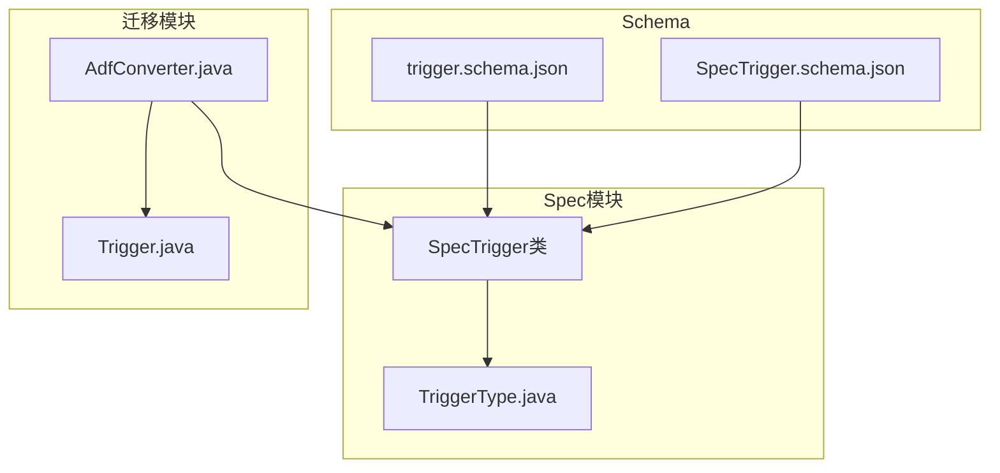
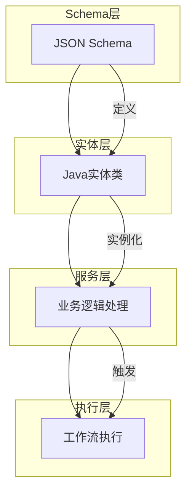
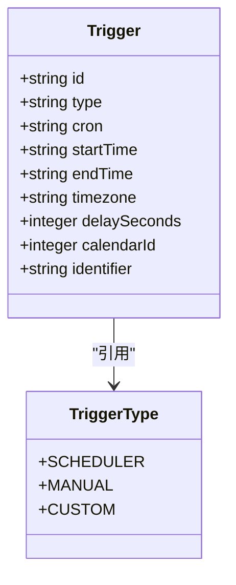
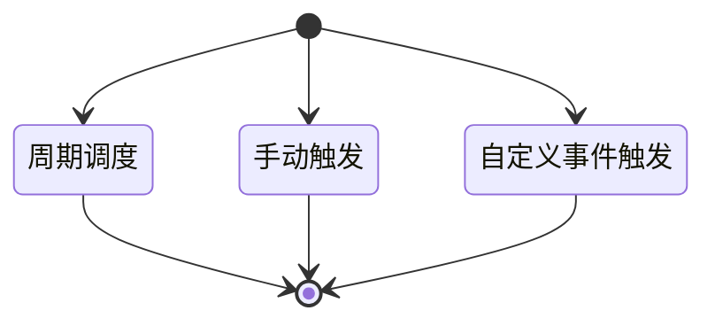
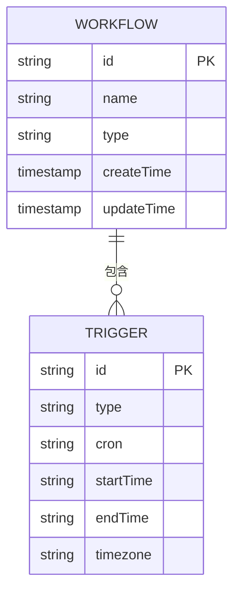
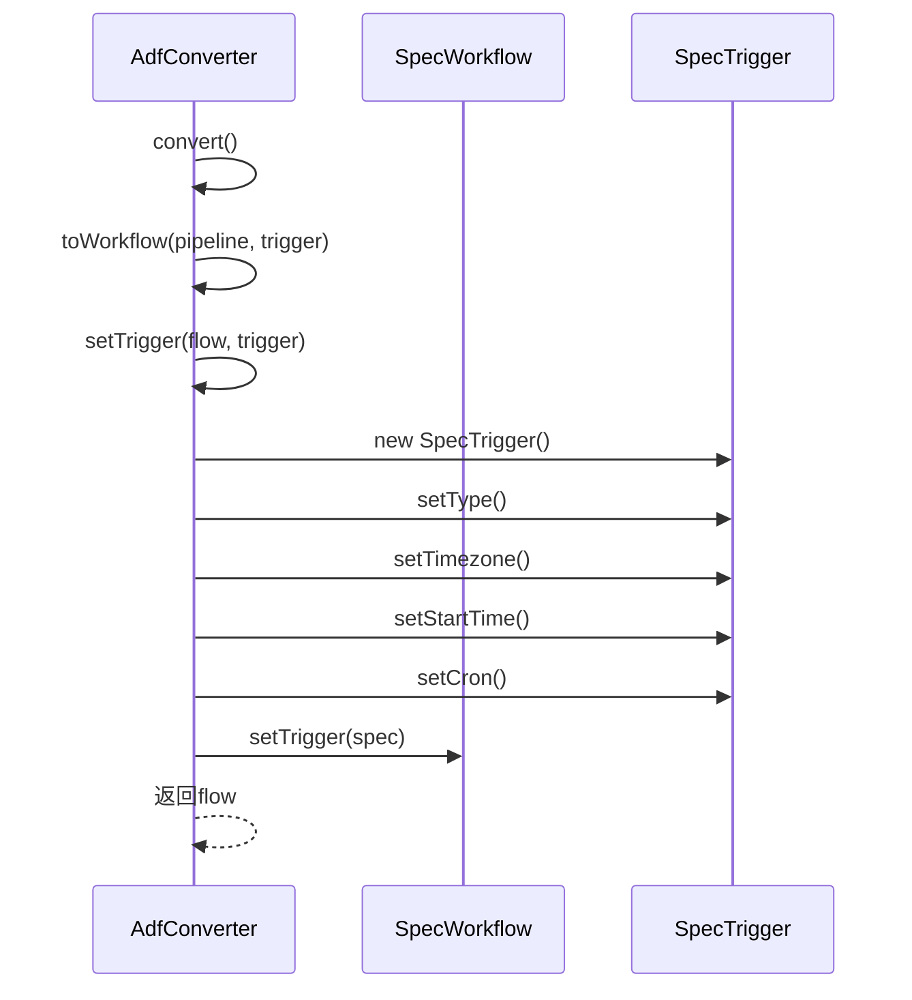
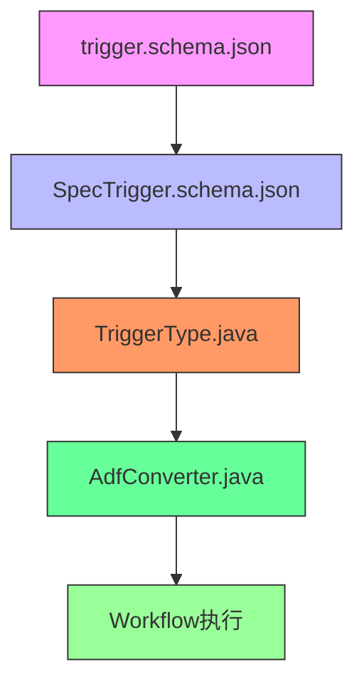

# Trigger模型

<cite>
**本文档引用的文件**
- [trigger.schema.json](file://schema/trigger.schema.json)
- [SpecTrigger.schema.json](file://spec/src/main/resources/spec/schema/SpecTrigger.schema.json)
- [Trigger.java](file://client/migrationx/migrationx-domain/migrationx-domain-adf/src/main/java/com/aliyun/dataworks/migrationx/domain/adf/Trigger.java)
- [AdfConverter.java](file://client/migrationx/migrationx-transformer/src/main/java/com/aliyun/dataworks/migrationx/transformer/dataworks/converter/adf/AdfConverter.java)
- [TriggerType.java](file://spec/src/main/java/com/aliyun/dataworks/common/spec/domain/enums/TriggerType.java)
- [trigger_workflow.json](file://spec/src/test/resources/version/1.x.y/trigger_workflow.json)
- [trigger.md](file://schema/docs/trigger.md)
</cite>

## 目录
1. [简介](#简介)
2. [项目结构](#项目结构)
3. [核心组件](#核心组件)
4. [架构概述](#架构概述)
5. [详细组件分析](#详细组件分析)
6. [依赖分析](#依赖分析)
7. [性能考虑](#性能考虑)
8. [故障排除指南](#故障排除指南)
9. [结论](#结论)
10. [附录](#附录)（如有必要）

## 简介
本文档详细描述了Trigger实体模型，包括其字段定义、触发类型、与工作流的关联关系以及调度机制。文档涵盖了Trigger的核心属性如id、type、cron、startTime、endTime、timezone等，并解释了TriggerType枚举值的含义和各种触发类型的使用场景。此外，文档还提供了JSON Schema定义示例和实际使用案例，展示了如何在工作流中配置周期调度和事件驱动。

## 项目结构
Trigger模型主要分布在schema和spec模块中，其中schema定义了Trigger的JSON Schema，而spec模块包含了Trigger的Java实现和相关枚举类型。



**图表来源**
- [trigger.schema.json](file://schema/trigger.schema.json)
- [SpecTrigger.schema.json](file://spec/src/main/resources/spec/schema/SpecTrigger.schema.json)
- [TriggerType.java](file://spec/src/main/java/com/aliyun/dataworks/common/spec/domain/enums/TriggerType.java)
- [AdfConverter.java](file://client/migrationx/migrationx-transformer/src/main/java/com/aliyun/dataworks/migrationx/transformer/dataworks/converter/adf/AdfConverter.java)

**章节来源**
- [trigger.schema.json](file://schema/trigger.schema.json)
- [SpecTrigger.schema.json](file://spec/src/main/resources/spec/schema/SpecTrigger.schema.json)

## 核心组件
Trigger模型的核心组件包括触发器的基本属性定义、触发类型枚举以及与工作流的关联机制。这些组件共同构成了一个完整的调度系统，支持周期调度和事件驱动两种主要模式。

**章节来源**
- [trigger.schema.json](file://schema/trigger.schema.json)
- [SpecTrigger.schema.json](file://spec/src/main/resources/spec/schema/SpecTrigger.schema.json)
- [TriggerType.java](file://spec/src/main/java/com/aliyun/dataworks/common/spec/domain/enums/TriggerType.java)

## 架构概述
Trigger模型的架构设计遵循了清晰的分层原则，从JSON Schema定义到Java实体类，再到实际的业务逻辑处理，每一层都有明确的职责。



**图表来源**
- [trigger.schema.json](file://schema/trigger.schema.json)
- [SpecTrigger.schema.json](file://spec/src/main/resources/spec/schema/SpecTrigger.schema.json)
- [AdfConverter.java](file://client/migrationx/migrationx-transformer/src/main/java/com/aliyun/dataworks/migrationx/transformer/dataworks/converter/adf/AdfConverter.java)

## 详细组件分析

### Trigger字段定义分析
Trigger模型包含多个核心字段，每个字段都有特定的含义和用途。

#### 字段定义


**图表来源**
- [trigger.schema.json](file://schema/trigger.schema.json)
- [SpecTrigger.schema.json](file://spec/src/main/resources/spec/schema/SpecTrigger.schema.json)
- [TriggerType.java](file://spec/src/main/java/com/aliyun/dataworks/common/spec/domain/enums/TriggerType.java)

#### 字段说明
| 字段 | 类型 | 必需 | 描述 |
|------|------|------|------|
| id | string | 是 | 唯一标识符 |
| type | string | 是 | 触发器类型 |
| cron | string | 否 | 周期调度触发器的定时表达式 |
| startTime | string | 否 | 周期调度的起始生效时间 |
| endTime | string | 否 | 周期调度的结束生效时间 |
| timezone | string | 否 | 周期调度时间的时区 |
| delaySeconds | integer | 否 | 延迟执行的秒数 |
| calendarId | integer | 否 | 日历ID |
| identifier | string | 否 | 标识符 |

**章节来源**
- [trigger.schema.json](file://schema/trigger.schema.json)
- [SpecTrigger.schema.json](file://spec/src/main/resources/spec/schema/SpecTrigger.schema.json)

### TriggerType枚举分析
TriggerType枚举定义了系统支持的各种触发类型，每种类型对应不同的调度策略。



**图表来源**
- [TriggerType.java](file://spec/src/main/java/com/aliyun/dataworks/common/spec/domain/enums/TriggerType.java)

#### 枚举值说明
- **SCHEDULER**: 周期调度触发器，使用cron表达式定义调度时间
- **MANUAL**: 手动触发器，需要人工干预才能执行
- **CUSTOM**: 自定义事件触发器，响应特定事件而触发

**章节来源**
- [TriggerType.java](file://spec/src/main/java/com/aliyun/dataworks/common/spec/domain/enums/TriggerType.java)

### Trigger与Workflow关联分析
Trigger与Workflow之间存在明确的关联关系，一个Workflow可以有一个Trigger来定义其执行策略。



**图表来源**
- [AdfConverter.java](file://client/migrationx/migrationx-transformer/src/main/java/com/aliyun/dataworks/migrationx/transformer/dataworks/converter/adf/AdfConverter.java)
- [trigger_workflow.json](file://spec/src/test/resources/version/1.x.y/trigger_workflow.json)

#### 关联机制
在AdfConverter中，通过setTrigger方法将Trigger与Workflow关联：



**图表来源**
- [AdfConverter.java](file://client/migrationx/migrationx-transformer/src/main/java/com/aliyun/dataworks/migrationx/transformer/dataworks/converter/adf/AdfConverter.java)

**章节来源**
- [AdfConverter.java](file://client/migrationx/migrationx-transformer/src/main/java/com/aliyun/dataworks/migrationx/transformer/dataworks/converter/adf/AdfConverter.java)

## 依赖分析
Trigger模型的依赖关系清晰，主要依赖于枚举类型和配置模式。



**图表来源**
- [trigger.schema.json](file://schema/trigger.schema.json)
- [SpecTrigger.schema.json](file://spec/src/main/resources/spec/schema/SpecTrigger.schema.json)
- [TriggerType.java](file://spec/src/main/java/com/aliyun/dataworks/common/spec/domain/enums/TriggerType.java)
- [AdfConverter.java](file://client/migrationx/migrationx-transformer/src/main/java/com/aliyun/dataworks/migrationx/transformer/dataworks/converter/adf/AdfConverter.java)

**章节来源**
- [trigger.schema.json](file://schema/trigger.schema.json)
- [SpecTrigger.schema.json](file://spec/src/main/resources/spec/schema/SpecTrigger.schema.json)
- [TriggerType.java](file://spec/src/main/java/com/aliyun/dataworks/common/spec/domain/enums/TriggerType.java)
- [AdfConverter.java](file://client/migrationx/migrationx-transformer/src/main/java/com/aliyun/dataworks/migrationx/transformer/dataworks/converter/adf/AdfConverter.java)

## 性能考虑
Trigger模型的设计考虑了性能因素，通过合理的字段定义和类型选择来优化存储和查询效率。JSON Schema的严格定义确保了数据的一致性，减少了运行时验证的开销。

## 故障排除指南
当遇到Trigger相关问题时，可以检查以下方面：
1. 确认Trigger的type字段值是否正确
2. 检查cron表达式是否符合规范
3. 验证startTime和endTime的时间格式
4. 确认timezone设置是否正确

**章节来源**
- [trigger.schema.json](file://schema/trigger.schema.json)
- [SpecTrigger.schema.json](file://spec/src/main/resources/spec/schema/SpecTrigger.schema.json)

## 结论
Trigger模型是一个关键的调度组件，它通过清晰的字段定义和类型系统支持多种调度模式。模型设计考虑了可扩展性和性能，为工作流的自动化执行提供了可靠的基础。

## 附录
### JSON Schema示例
```json
{
  "id": "daily_trigger",
  "type": "Scheduler",
  "cron": "0 0 0 * * ?",
  "startTime": "2023-01-01T00:00:00",
  "endTime": "2024-01-01T00:00:00",
  "timezone": "Asia/Shanghai"
}
```

**章节来源**
- [trigger.schema.json](file://schema/trigger.schema.json)