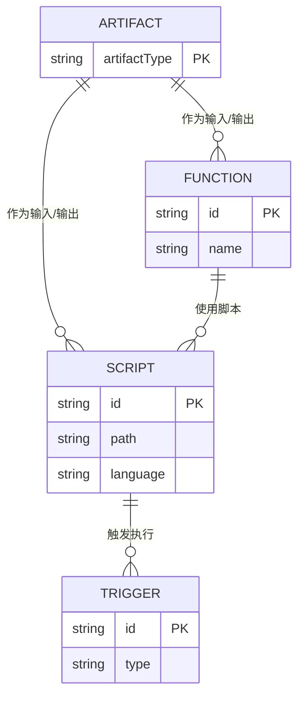
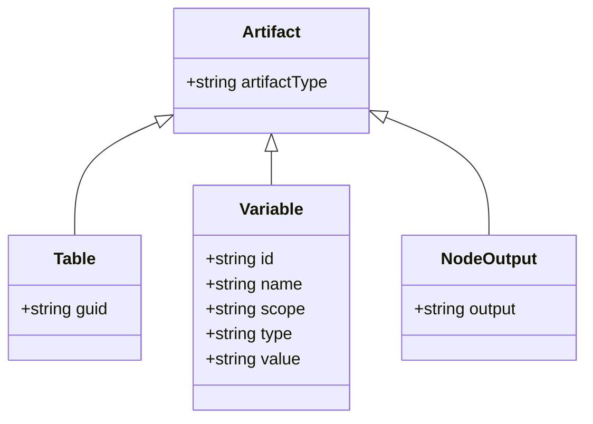
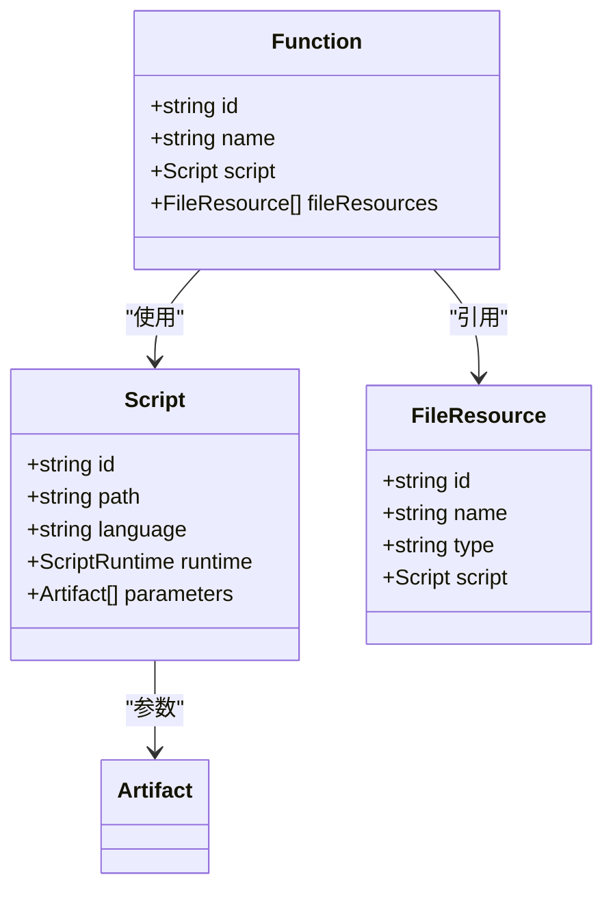
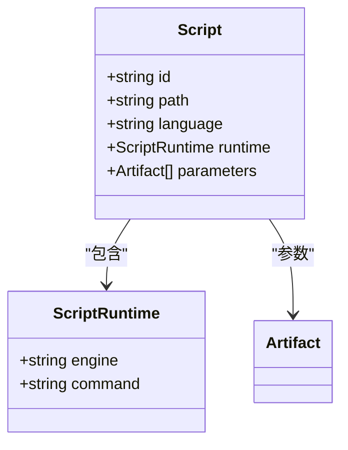
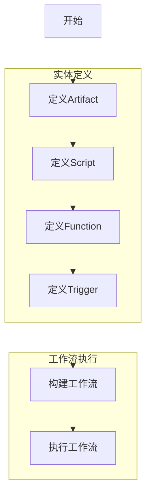
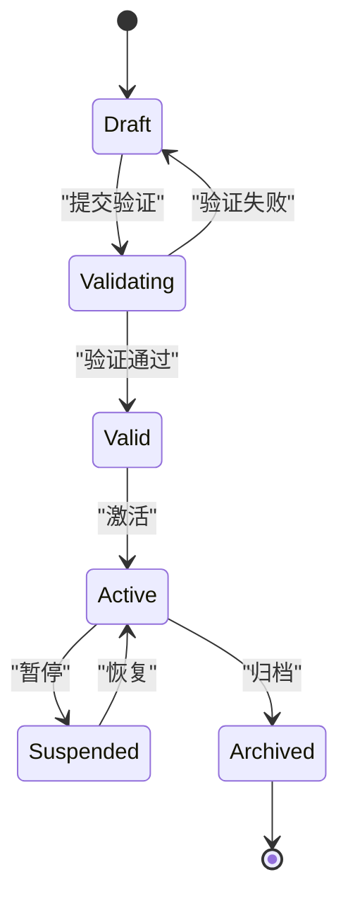
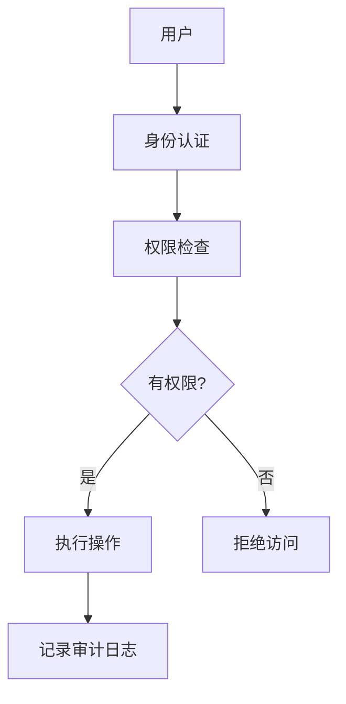
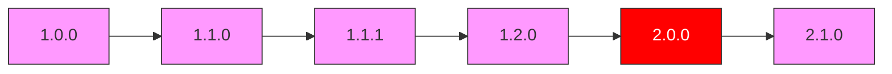

# 核心实体模型

<cite>
**本文档引用的文件**
- [artifact.schema.json](file://schema/artifact.schema.json)
- [function.schema.json](file://schema/function.schema.json)
- [script.schema.json](file://schema/script.schema.json)
- [trigger.schema.json](file://schema/trigger.schema.json)
- [SpecArtifact.schema.json](file://spec/src/main/resources/spec/schema/SpecArtifact.schema.json)
- [SpecFunction.schema.json](file://spec/src/main/resources/spec/schema/SpecFunction.schema.json)
- [SpecScript.schema.json](file://spec/src/main/resources/spec/schema/SpecScript.schema.json)
- [SpecTrigger.schema.json](file://spec/src/main/resources/spec/schema/SpecTrigger.schema.json)
- [SpecVariable.schema.json](file://spec/src/main/resources/spec/schema/SpecVariable.schema.json)
- [SpecTable.schema.json](file://spec/src/main/resources/spec/schema/SpecTable.schema.json)
- [SpecNodeOutput.schema.json](file://spec/src/main/resources/spec/schema/SpecNodeOutput.schema.json)
- [SpecFileResource.schema.json](file://spec/src/main/resources/spec/schema/SpecFileResource.schema.json)
</cite>

## 目录
1. [引言](#引言)
2. [核心实体概述](#核心实体概述)
3. [Artifact实体](#artifact实体)
4. [Function实体](#function实体)
5. [Script实体](#script实体)
6. [Trigger实体](#trigger实体)
7. [实体间关系与访问模式](#实体间关系与访问模式)
8. [数据验证与生命周期管理](#数据验证与生命周期管理)
9. [数据安全与权限控制](#数据安全与权限控制)
10. [版本管理策略](#版本管理策略)
11. [应用案例与最佳实践](#应用案例与最佳实践)

## 引言
dataworks-spec项目定义了一套标准化的工作流规范，用于描述数据工作流中的各种核心实体。本文档详细说明了Artifact、Function、Script和Trigger等核心实体的字段定义、数据类型、约束条件以及它们之间的关系。这些实体构成了数据工作流的基础，支持复杂的数据处理任务的定义和执行。

## 核心实体概述
dataworks-spec项目中的核心实体包括Artifact、Function、Script和Trigger，它们共同构成了数据工作流的基础设施。这些实体通过JSON Schema进行定义，确保了数据结构的一致性和可验证性。



**Diagram sources**
- [artifact.schema.json](file://schema/artifact.schema.json)
- [function.schema.json](file://schema/function.schema.json)
- [script.schema.json](file://schema/script.schema.json)
- [trigger.schema.json](file://schema/trigger.schema.json)

**Section sources**
- [artifact.schema.json](file://schema/artifact.schema.json)
- [function.schema.json](file://schema/function.schema.json)
- [script.schema.json](file://schema/script.schema.json)
- [trigger.schema.json](file://schema/trigger.schema.json)

## Artifact实体
Artifact实体是工作流中的基本数据单元，可以作为工作流节点的输入或输出。根据artifactType的不同，Artifact可分为Table、Variable和NodeOutput三种类型。

### 字段定义与数据类型
| 字段名 | 数据类型 | 必填 | 描述 |
|-------|--------|-----|------|
| artifactType | string | 是 | Artifact类型，枚举值：Table、Variable、NodeOutput |
| guid | string | 否 | 表的唯一标识符（仅当artifactType为Table时） |
| id | string | 否 | 变量的唯一标识符（仅当artifactType为Variable时） |
| name | string | 否 | 变量名称（仅当artifactType为Variable时） |
| scope | string | 否 | 变量作用域（仅当artifactType为Variable时） |
| type | string | 否 | 变量类型（仅当artifactType为Variable时） |
| value | string | 否 | 变量值（仅当artifactType为Variable时） |
| output | string | 否 | 节点调度输出标识（仅当artifactType为NodeOutput时） |

### 约束条件
- artifactType字段必须为Table、Variable或NodeOutput之一
- 当artifactType为Table时，必须提供guid字段
- 当artifactType为Variable时，必须提供id、name、scope、type和value字段
- 当artifactType为NodeOutput时，必须提供output字段

### 业务规则
- Table类型Artifact用于表示上游产出的数据表，通过guid唯一标识
- Variable类型Artifact用于定义工作流变量，支持多种作用域和类型
- NodeOutput类型Artifact用于表示上游节点的预定义输出



**Diagram sources**
- [artifact.schema.json](file://schema/artifact.schema.json)
- [SpecTable.schema.json](file://spec/src/main/resources/spec/schema/SpecTable.schema.json)
- [SpecVariable.schema.json](file://spec/src/main/resources/spec/schema/SpecVariable.schema.json)
- [SpecNodeOutput.schema.json](file://spec/src/main/resources/spec/schema/SpecNodeOutput.schema.json)

**Section sources**
- [artifact.schema.json](file://schema/artifact.schema.json)
- [SpecTable.schema.json](file://spec/src/main/resources/spec/schema/SpecTable.schema.json)
- [SpecVariable.schema.json](file://spec/src/main/resources/spec/schema/SpecVariable.schema.json)
- [SpecNodeOutput.schema.json](file://spec/src/main/resources/spec/schema/SpecNodeOutput.schema.json)

## Function实体
Function实体定义了工作流节点使用的用户自定义函数（UDF），包含函数的基本信息、使用的脚本和相关资源。

### 字段定义与数据类型
| 字段名 | 数据类型 | 必填 | 描述 |
|-------|--------|-----|------|
| id | string | 是 | 唯一标识符 |
| name | string | 是 | 函数名称 |
| script | object | 是 | 使用的脚本 |
| fileResources | array | 否 | 使用的资源列表 |
| type | string | 否 | 函数类型 |
| className | string | 否 | 类名 |
| datasource | object | 否 | 数据源 |
| runtimeResource | object | 否 | 运行时资源 |
| armResource | string | 否 | ARM资源 |
| usageDescription | string | 否 | 使用说明 |
| argumentsDescription | string | 否 | 参数说明 |
| returnValueDescription | string | 否 | 返回值说明 |
| usageExample | string | 否 | 使用示例 |
| embeddedCodeType | string | 否 | 内嵌代码类型 |
| resourceType | string | 否 | 资源类型 |
| embeddedCode | string | 否 | 内嵌代码 |

### 约束条件
- id、name和script字段为必填项
- script字段必须引用有效的Script实体
- type字段必须为math、aggregate、string、date、analytic或other之一
- embeddedCodeType字段必须为python2、python3、java8、java11或java17之一
- resourceType字段必须为file或embedded之一

### 业务规则
- Function实体必须关联一个Script实体来定义其执行逻辑
- 支持通过fileResources字段引用外部资源文件
- 支持内嵌代码和外部文件两种代码存储方式



**Diagram sources**
- [function.schema.json](file://schema/function.schema.json)
- [SpecFunction.schema.json](file://spec/src/main/resources/spec/schema/SpecFunction.schema.json)
- [script.schema.json](file://schema/script.schema.json)
- [SpecScript.schema.json](file://spec/src/main/resources/spec/schema/SpecScript.schema.json)
- [SpecFileResource.schema.json](file://spec/src/main/resources/spec/schema/SpecFileResource.schema.json)

**Section sources**
- [function.schema.json](file://schema/function.schema.json)
- [SpecFunction.schema.json](file://spec/src/main/resources/spec/schema/SpecFunction.schema.json)

## Script实体
Script实体定义了节点所需的脚本，包括脚本路径、语言、运行时环境和参数等信息。

### 字段定义与数据类型
| 字段名 | 数据类型 | 必填 | 描述 |
|-------|--------|-----|------|
| id | string | 是 | 唯一标识符 |
| path | string | 是 | 脚本路径 |
| language | string | 是 | 脚本语言 |
| runtime | object | 是 | 运行时环境 |
| parameters | array | 否 | 脚本参数列表 |

### 运行时环境（runtime）字段
| 字段名 | 数据类型 | 必填 | 描述 |
|-------|--------|-----|------|
| engine | string | 否 | 运行时引擎 |
| command | string | 是 | 运行时环境的命令标识 |

### 约束条件
- id、path和runtime字段为必填项
- runtime字段中的command子字段为必填项
- parameters字段中的每个元素必须是有效的Artifact实体

### 业务规则
- Script实体通过path字段指定脚本文件的存储位置
- runtime字段定义了脚本执行所需的运行时环境
- parameters字段允许脚本引用其他Artifact作为输入参数



**Diagram sources**
- [script.schema.json](file://schema/script.schema.json)
- [SpecScript.schema.json](file://spec/src/main/resources/spec/schema/SpecScript.schema.json)

**Section sources**
- [script.schema.json](file://schema/script.schema.json)
- [SpecScript.schema.json](file://spec/src/main/resources/spec/schema/SpecScript.schema.json)

## Trigger实体
Trigger实体定义了工作流的触发器，控制工作流节点的执行时机和频率。

### 字段定义与数据类型
| 字段名 | 数据类型 | 必填 | 描述 |
|-------|--------|-----|------|
| id | string | 是 | 唯一标识符 |
| type | string | 是 | 触发器类型 |
| cron | string | 否 | 周期调度触发器的定时表达式 |
| startTime | string | 否 | 周期调度的起始生效时间 |
| endTime | string | 否 | 周期调度的结束生效时间 |
| timezone | string | 否 | 周期调度时间的时区 |
| recurrence | string | 否 | 重复模式 |
| delaySeconds | integer | 否 | 延迟秒数 |
| calendarId | integer | 否 | 日历ID |
| identifier | string | 否 | 标识符 |

### 约束条件
- id和type字段为必填项
- type字段必须为Scheduler或Manual之一
- 当type为Scheduler时，建议提供cron字段
- startTime和endTime字段定义了调度的有效时间范围

### 业务规则
- Trigger实体通过type字段区分手动触发和周期调度两种模式
- 周期调度模式使用cron表达式定义执行频率
- startTime和endTime字段限制了周期调度的生效时间范围
- timezone字段确保调度时间的时区一致性

```mermaid
classDiagram
class Trigger {
+string id
+string type
+string cron
+string startTime
+string endTime
+string timezone
+string recurrence
+integer delaySeconds
+integer calendarId
+string identifier
}
Trigger : type枚举 : Scheduler, Manual
```

**Diagram sources**
- [trigger.schema.json](file://schema/trigger.schema.json)
- [SpecTrigger.schema.json](file://spec/src/main/resources/spec/schema/SpecTrigger.schema.json)

**Section sources**
- [trigger.schema.json](file://schema/trigger.schema.json)
- [SpecTrigger.schema.json](file://spec/src/main/resources/spec/schema/SpecTrigger.schema.json)

## 实体间关系与访问模式
核心实体之间通过引用和关联形成复杂的工作流结构，支持各种数据处理场景。

### 主键与外键关系
- Artifact实体没有传统意义上的主键，而是通过artifactType字段区分不同类型，并结合特定字段（如guid、id、output）作为唯一标识
- Function实体的id字段作为主键，script字段引用Script实体的id作为外键
- Script实体的id字段作为主键
- Trigger实体的id字段作为主键

### 访问模式
- **工作流定义模式**：通过组合Artifact、Function、Script和Trigger实体来定义完整的工作流
- **参数传递模式**：使用Artifact作为Function和Script的输入参数，实现数据在节点间的传递
- **触发执行模式**：通过Trigger实体控制Function和Script的执行时机
- **资源引用模式**：Function实体通过fileResources字段引用外部资源文件



**Diagram sources**
- [artifact.schema.json](file://schema/artifact.schema.json)
- [function.schema.json](file://schema/function.schema.json)
- [script.schema.json](file://schema/script.schema.json)
- [trigger.schema.json](file://schema/trigger.schema.json)

**Section sources**
- [artifact.schema.json](file://schema/artifact.schema.json)
- [function.schema.json](file://schema/function.schema.json)
- [script.schema.json](file://schema/script.schema.json)
- [trigger.schema.json](file://schema/trigger.schema.json)

## 数据验证与生命周期管理
系统通过JSON Schema和业务规则对核心实体进行严格的数据验证，并实施生命周期管理策略。

### 数据验证机制
- **JSON Schema验证**：使用JSON Schema对实体的结构、数据类型和约束进行验证
- **枚举值验证**：确保字段值在预定义的枚举范围内
- **必填字段验证**：检查必填字段是否提供
- **引用完整性验证**：确保引用的实体存在且有效

### 生命周期管理策略
- **创建阶段**：通过Schema验证确保实体定义的正确性
- **更新阶段**：支持实体属性的修改，但需保持引用完整性
- **删除阶段**：实施级联删除策略，确保引用关系的一致性
- **版本控制**：通过版本号管理实体的变更历史



**Diagram sources**
- [artifact.schema.json](file://schema/artifact.schema.json)
- [function.schema.json](file://schema/function.schema.json)
- [script.schema.json](file://schema/script.schema.json)
- [trigger.schema.json](file://schema/trigger.schema.json)

**Section sources**
- [artifact.schema.json](file://schema/artifact.schema.json)
- [function.schema.json](file://schema/function.schema.json)
- [script.schema.json](file://schema/script.schema.json)
- [trigger.schema.json](file://schema/trigger.schema.json)

## 数据安全与权限控制
系统实施多层次的数据安全和权限控制机制，确保核心实体的安全性。

### 数据安全要求
- **数据加密**：敏感数据在存储和传输过程中进行加密
- **访问控制**：基于角色的访问控制（RBAC）机制
- **审计日志**：记录所有实体的创建、修改和删除操作
- **数据隔离**：不同租户的数据严格隔离

### 权限控制机制
- **租户级别**：定义租户范围内的全局权限
- **工作空间级别**：控制工作空间内的实体访问权限
- **工作流级别**：管理特定工作流的执行权限
- **节点级别**：细化到单个节点的操作权限



**Diagram sources**
- [artifact.schema.json](file://schema/artifact.schema.json)
- [function.schema.json](file://schema/function.schema.json)

**Section sources**
- [artifact.schema.json](file://schema/artifact.schema.json)
- [function.schema.json](file://schema/function.schema.json)

## 版本管理策略
系统采用语义化版本控制策略，管理核心实体的变更和兼容性。

### 版本号结构
版本号采用MAJOR.MINOR.PATCH格式：
- MAJOR：重大变更，不兼容的API修改
- MINOR：新增功能，向后兼容的改动
- PATCH：bug修复，向后兼容的改动

### 版本兼容性规则
- 同一MAJOR版本内的MINOR和PATCH版本应保持向后兼容
- MAJOR版本升级时，提供迁移工具和文档
- 弃用的实体或字段应标记并保留至少两个MINOR版本

### 版本管理实践
- **版本标识**：每个实体定义包含版本信息
- **变更记录**：维护详细的变更日志
- **向后兼容**：确保旧版本配置能在新版本中正常工作
- **迁移支持**：提供版本升级的自动化迁移工具



**Diagram sources**
- [artifact.schema.json](file://schema/artifact.schema.json)
- [function.schema.json](file://schema/function.schema.json)

**Section sources**
- [artifact.schema.json](file://schema/artifact.schema.json)
- [function.schema.json](file://schema/function.schema.json)

## 应用案例与最佳实践
通过实际应用案例展示核心实体的使用方法和最佳实践。

### 典型应用案例
#### 数据处理工作流
```json
{
  "artifacts": [
    {
      "artifactType": "Table",
      "guid": "tbl_001"
    },
    {
      "artifactType": "Variable",
      "id": "var_001",
      "name": "process_date",
      "scope": "Workflow",
      "type": "System",
      "value": "$[yyyymmdd-1]"
    }
  ],
  "functions": [
    {
      "id": "func_001",
      "name": "data_cleaning",
      "script": {
        "id": "script_001",
        "path": "/scripts/clean.py",
        "language": "python",
        "runtime": {
          "command": "python3"
        }
      }
    }
  ],
  "triggers": [
    {
      "id": "trigger_001",
      "type": "Scheduler",
      "cron": "0 0 2 * * ?",
      "timezone": "Asia/Shanghai"
    }
  ]
}
```

#### 实时数据同步
```json
{
  "artifacts": [
    {
      "artifactType": "NodeOutput",
      "output": "sync_result"
    }
  ],
  "scripts": [
    {
      "id": "script_002",
      "path": "/scripts/sync.js",
      "language": "javascript",
      "runtime": {
        "engine": "nodejs",
        "command": "node"
      }
    }
  ],
  "triggers": [
    {
      "id": "trigger_002",
      "type": "Manual"
    }
  ]
}
```

### 最佳实践
1. **命名规范**：使用有意义的命名约定，便于理解和维护
2. **模块化设计**：将复杂工作流分解为可重用的模块
3. **参数化配置**：使用变量替代硬编码值，提高灵活性
4. **错误处理**：定义完善的错误处理机制，确保工作流的健壮性
5. **性能优化**：合理设置调度频率和资源分配，避免资源浪费

**Section sources**
- [artifact.schema.json](file://schema/artifact.schema.json)
- [function.schema.json](file://schema/function.schema.json)
- [script.schema.json](file://schema/script.schema.json)
- [trigger.schema.json](file://schema/trigger.schema.json)