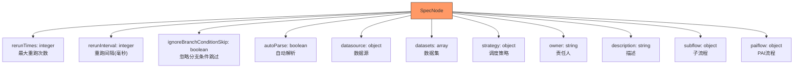
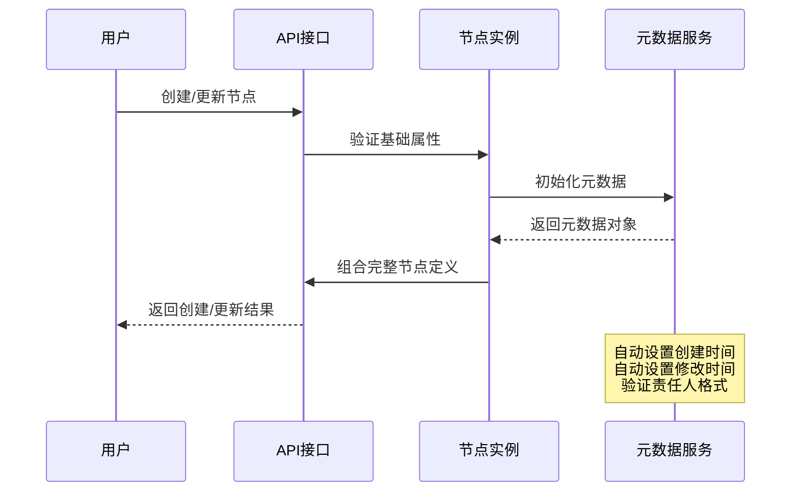
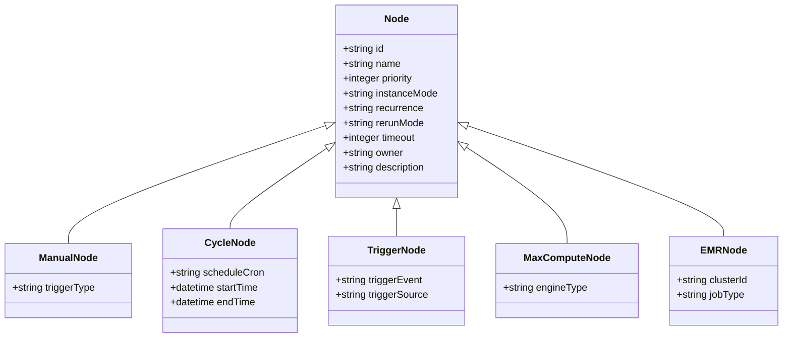
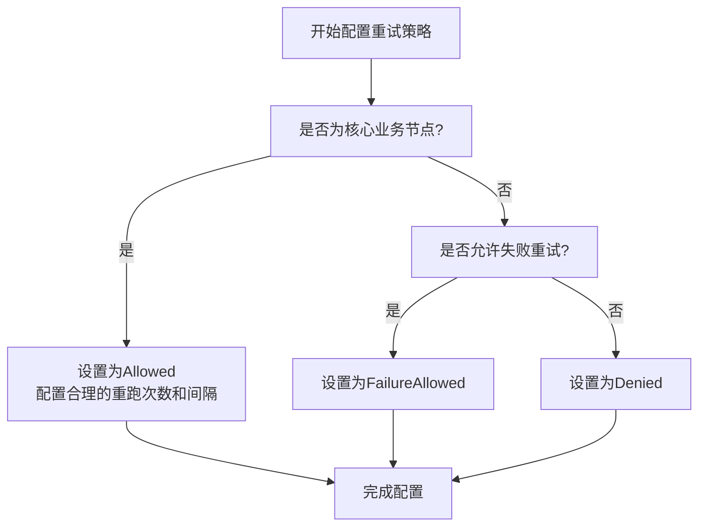

# 节点基础属性

<cite>
**本文档引用的文件**  
- [node.schema.json](file://schema/node.schema.json)
- [SpecNode.schema.json](file://spec/src/main/resources/spec/schema/SpecNode.schema.json)
- [manual.json](file://spec/src/test/resources/nodemodel/manual.json)
- [manual_workflow_spec_with_priority.json](file://spec/src/test/resources/spec/manual_workflow_spec_with_priority.json)
- [flow-properties-flowmetedata-properties-owner.md](file://schema/docs/flow-properties-flowmetedata-properties-owner.md)
- [flow-properties-flowmetedata-properties-description.md](file://schema/docs/flow-properties-flowmetedata-properties-description.md)
</cite>

## 目录
1. [引言](#引言)
2. [节点基础属性定义](#节点基础属性定义)
3. [通用字段与数据类型](#通用字段与数据类型)
4. [节点元数据管理机制](#节点元数据管理机制)
5. [节点标签系统与分类机制](#节点标签系统与分类机制)
6. [基础属性配置最佳实践](#基础属性配置最佳实践)
7. [常见错误示例](#常见错误示例)
8. [结论](#结论)

## 引言
本文档旨在详细说明dataworks-spec项目中工作流节点的基础属性配置规范。通过分析`node.schema.json`和`SpecNode.schema.json`等核心定义文件，全面阐述节点ID、名称、优先级、实例模式等关键属性的语义、数据类型及配置方式。同时，文档将深入解析节点元数据管理机制，包括创建时间、修改时间、所有者等信息的处理逻辑，并介绍标签系统与分类机制的实现方式。最后提供配置最佳实践和典型错误示例，帮助用户正确使用节点基础属性。

## 节点基础属性定义

### ID
节点ID是节点在Spec中的唯一标识符，用于在工作流中精确引用特定节点。该属性为字符串类型，且为必填项，在`node.schema.json`中定义。

### 名称
节点名称是用户可读的节点标识，用于在可视化界面中显示节点信息。该属性为字符串类型，同样为必填项。

### 优先级
节点优先级定义了节点的执行优先顺序，数值越大优先级越高。该属性为整数类型，用于调度器在资源竞争时决定执行顺序。

### 实例模式
实例模式决定了节点配置变更的生效时机，包含两种模式：
- **T+1**：配置修改将在T+1天后生效
- **Immediately**：配置修改将立即生效

### 重试模式
重试模式定义了节点失败后的处理策略，包含三种选项：
- **Allowed**：任何情况下都允许重跑
- **Denied**：任何情况下都不允许重跑
- **FailureAllowed**：仅在失败情况下允许重跑

### 调度状态
调度状态定义了周期调度节点的运行状态，包含：
- **Normal**：节点正常按周期调度运行
- **Skip**：节点实例化但代码不执行，直接标记为成功
- **Pause**：节点实例化但直接标记为失败

### 超时时间
超时时间定义了节点的最大运行时长（单位为秒），超过该时间后节点将被终止。

**Section sources**
- [node.schema.json](file://schema/node.schema.json#L7-L159)

## 通用字段与数据类型

### node.schema.json中的通用字段
`node.schema.json`文件定义了节点的核心结构，其主要通用字段包括：

```mermaid
flowchart TD
Node["节点 (Node)"] --> Id["id: string<br/>唯一标识"]
Node --> Name["name: string<br/>节点名称"]
Node --> Priority["priority: integer<br/>优先级"]
Node --> InstanceMode["instanceMode: string<br/>实例化模式"]
Node --> Recurrence["recurrence: string<br/>调度状态"]
Node --> RerunMode["rerunMode: string<br/>重试策略"]
Node --> Timeout["timeout: integer<br/>超时时间(秒)"]
Node --> Script["script: object<br/>脚本定义"]
Node --> Trigger["trigger: object<br/>触发器"]
Node --> Inputs["inputs: object<br/>输入定义"]
Node --> Outputs["outputs: object<br/>输出定义"]
Node --> Functions["functions: array<br/>函数引用"]
Node --> FileResources["fileResources: array<br/>文件资源"]
Node --> RuntimeResource["runtimeResource: object<br/>运行时资源"]
style Node fill:#f9f,stroke:#333
```



**Diagram sources**
- [node.schema.json](file://schema/node.schema.json#L6-L159)

### SpecNode.schema.json中的扩展字段
`SpecNode.schema.json`在基础属性之上扩展了更多配置选项：



**Diagram sources**
- [SpecNode.schema.json](file://spec/src/main/resources/spec/schema/SpecNode.schema.json#L5-L113)

## 节点元数据管理机制

### 元数据字段
节点元数据管理主要通过以下字段实现：
- **owner**：责任人，字符串类型，标识节点的负责人
- **description**：描述，字符串类型，提供节点功能说明
- **创建时间**：系统自动生成的时间戳
- **修改时间**：系统自动更新的时间戳

### 元数据处理流程


**Diagram sources**
- [SpecNode.schema.json](file://spec/src/main/resources/spec/schema/SpecNode.schema.json#L93-L97)
- [flow-properties-flowmetedata-properties-owner.md](file://schema/docs/flow-properties-flowmetedata-properties-owner.md)
- [flow-properties-flowmetedata-properties-description.md](file://schema/docs/flow-properties-flowmetedata-properties-description.md)

**Section sources**
- [SpecNode.schema.json](file://spec/src/main/resources/spec/schema/SpecNode.schema.json#L93-L97)
- [flow.schema.json](file://schema/flow.schema.json)

## 节点标签系统与分类机制

### 标签系统实现
虽然在提供的文件中未直接看到标签系统的具体实现，但从架构设计角度，标签系统通常通过以下方式实现：
- 在节点定义中添加`tags`字段，类型为字符串数组
- 支持通过API进行标签的增删改查操作
- 提供基于标签的查询和过滤功能

### 分类机制
节点分类主要通过以下维度实现：
1. **按执行模式分类**：周期节点、手动节点、触发节点
2. **按计算引擎分类**：MaxCompute、EMR、Hologres等
3. **按功能类型分类**：数据同步、数据开发、机器学习



**Diagram sources**
- [node.schema.json](file://schema/node.schema.json)
- [SpecNode.schema.json](file://spec/src/main/resources/spec/schema/SpecNode.schema.json)

## 基础属性配置最佳实践

### ID命名规范
- 使用UUID或业务语义化ID
- 保持全局唯一性
- 避免使用特殊字符

### 优先级设置建议
- 核心业务节点：优先级设置为5-10
- 普通业务节点：优先级设置为3-4
- 辅助节点：优先级设置为1-2

### 实例模式选择
- **T+1模式**：适用于生产环境的重要节点，确保变更经过充分验证
- **Immediately模式**：适用于开发环境或紧急修复场景

### 重试策略配置


**Diagram sources**
- [node.schema.json](file://schema/node.schema.json#L140-L153)

**Section sources**
- [node.schema.json](file://schema/node.schema.json#L140-L153)

## 常见错误示例

### 必填字段缺失
```json
{
  "name": "test_node"
  // 错误：缺少必填的id和script字段
}
```

### 数据类型错误
```json
{
  "id": "test_node",
  "name": "test_node",
  "script": {},
  "priority": "high" // 错误：priority应为整数类型
}
```

### 枚举值错误
```json
{
  "id": "test_node",
  "name": "test_node",
  "script": {},
  "instanceMode": "Immediate" // 错误：应为"Immediately"
}
```

### 优先级配置不当
```json
{
  "id": "core_node",
  "name": "核心业务节点",
  "script": {},
  "priority": 1 // 警告：核心节点优先级过低
}
```

**Section sources**
- [node.schema.json](file://schema/node.schema.json)
- [manual.json](file://spec/src/test/resources/nodemodel/manual.json)

## 结论
本文档全面解析了dataworks-spec项目中节点基础属性的定义、配置方式和管理机制。通过`node.schema.json`和`SpecNode.schema.json`两个核心文件，系统地定义了节点的ID、名称、优先级、实例模式等关键属性。元数据管理机制确保了节点的责任人、描述等信息的有效维护。虽然标签系统在当前文件中未直接体现，但分类机制已通过多种维度实现。遵循本文档的最佳实践，可以有效避免常见配置错误，确保工作流节点的正确性和可靠性。