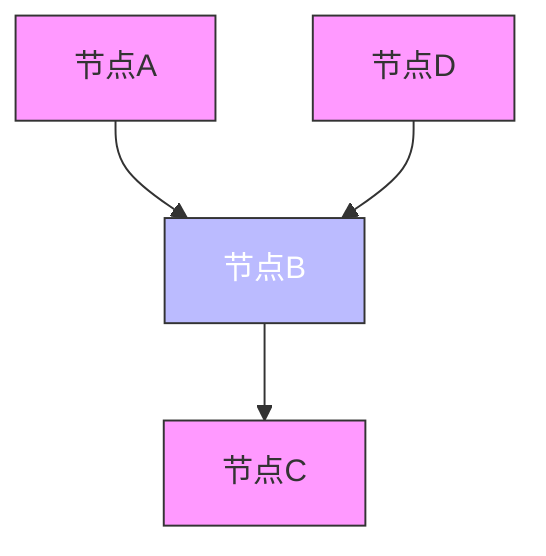
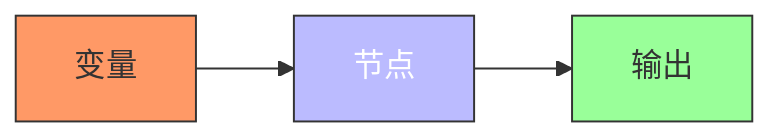
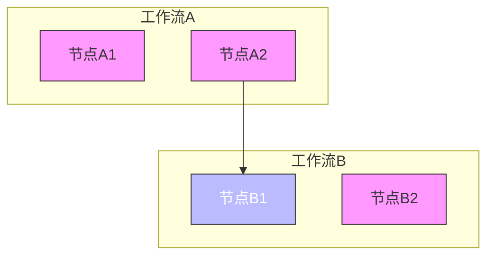
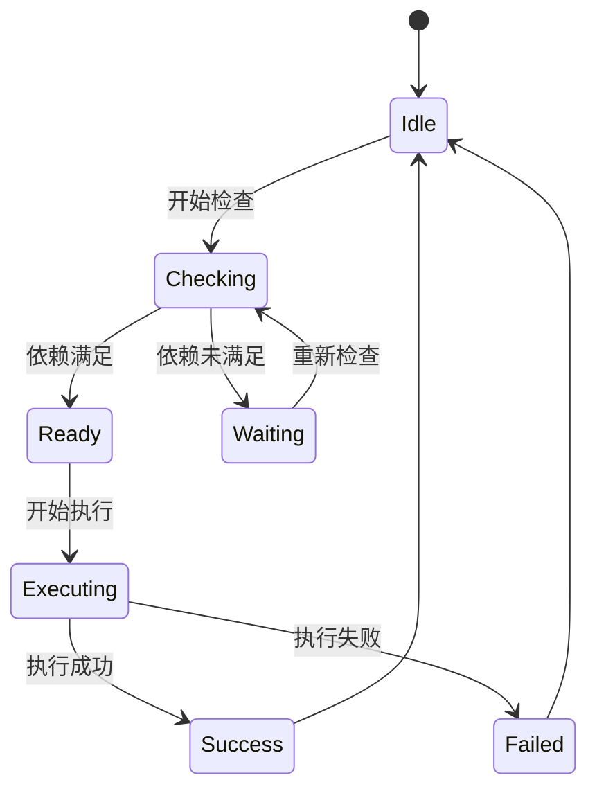
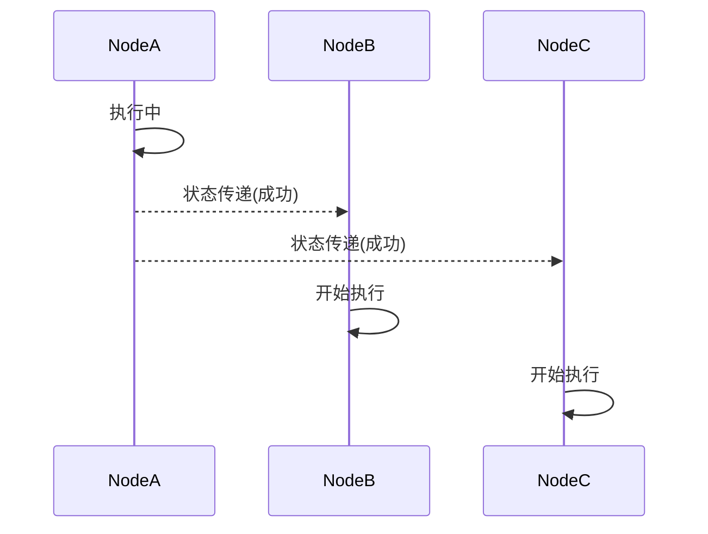
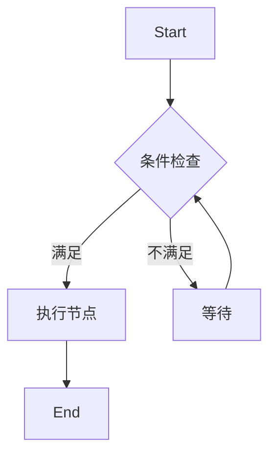
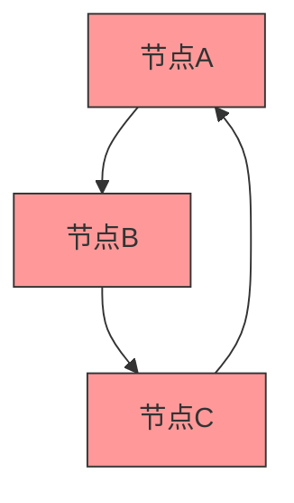
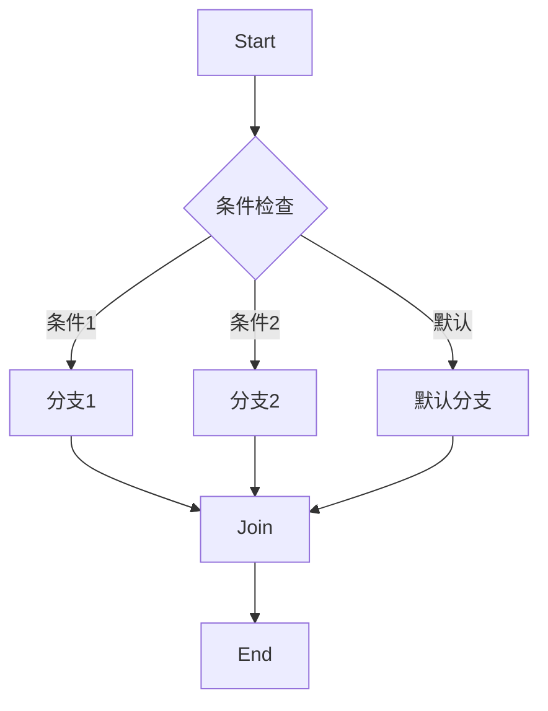

# 依赖管理

<cite>
**本文档引用的文件**
- [node.schema.json](file://schema/node.schema.json)
- [flow.schema.json](file://schema/flow.schema.json)
- [SpecDepend.schema.json](file://spec/src/main/resources/spec/schema/SpecDepend.schema.json)
- [SpecFlowDepend.schema.json](file://spec/src/main/resources/spec/schema/SpecFlowDepend.schema.json)
- [SpecVariableDepend.schema.json](file://spec/src/main/resources/spec/schema/SpecVariableDepend.schema.json)
- [SpecVariableFlowDepend.schema.json](file://spec/src/main/resources/spec/schema/SpecVariableFlowDepend.schema.json)
- [all_depend_types.json](file://spec/src/test/resources/nodemodel/all_depend_types.json)
- [DependencyType.java](file://spec/src/main/java/com/aliyun/dataworks/common/spec/domain/enums/DependencyType.java)
- [SpecDepend.java](file://spec/src/main/java/com/aliyun/dataworks/common/spec/domain/noref/SpecDepend.java)
- [SpecNode.java](file://spec/src/main/java/com/aliyun/dataworks/common/spec/domain/ref/SpecNode.java)
- [SpecFlowDepend.java](file://spec/src/main/java/com/aliyun/dataworks/common/spec/domain/noref/SpecFlowDepend.java)
</cite>

## 目录
1. [简介](#简介)
2. [依赖类型](#依赖类型)
3. [DAG调度中的依赖作用](#dag调度中的依赖作用)
4. [SpecNode中的依赖配置](#specnode中的依赖配置)
5. [复杂依赖场景处理](#复杂依赖场景处理)
6. [最佳实践与性能优化](#最佳实践与性能优化)

## 简介
dataworks-spec项目提供了一套完整的节点依赖管理机制，用于定义和管理数据工作流中节点之间的依赖关系。该系统支持多种依赖类型，包括前置依赖、变量依赖和跨工作流依赖，确保工作流能够按照正确的顺序和条件执行。依赖管理是DAG（有向无环图）调度的核心组成部分，它决定了节点的执行顺序、触发条件和状态传递。

**Section sources**
- [flow.schema.json](file://schema/flow.schema.json#L1-L202)
- [node.schema.json](file://schema/node.schema.json#L1-L160)

## 依赖类型
dataworks-spec项目支持三种主要的依赖类型：前置依赖、变量依赖和跨工作流依赖。每种依赖类型都有其特定的配置方法和应用场景。

### 前置依赖
前置依赖是最常见的依赖类型，用于定义节点之间的执行顺序。在dataworks-spec中，前置依赖通过`flow`字段中的`depends`数组来配置。每个依赖项包含`nodeId`和`type`字段，其中`type`字段定义了依赖的具体类型。



**Diagram sources**
- [flow.schema.json](file://schema/flow.schema.json#L86-L148)
- [SpecDepend.schema.json](file://spec/src/main/resources/spec/schema/SpecDepend.schema.json#L1-L52)

**Section sources**
- [flow.schema.json](file://schema/flow.schema.json#L86-L148)
- [SpecDepend.schema.json](file://spec/src/main/resources/spec/schema/SpecDepend.schema.json#L1-L52)

### 变量依赖
变量依赖用于定义节点对特定变量的依赖关系。这种依赖类型允许节点根据变量的值来决定是否执行或如何执行。在dataworks-spec中，变量依赖通过`inputs.variables`字段来配置。



**Diagram sources**
- [node.schema.json](file://schema/node.schema.json#L36-L43)
- [SpecVariableDepend.schema.json](file://spec/src/main/resources/spec/schema/SpecVariableDepend.schema.json#L1-L40)

**Section sources**
- [node.schema.json](file://schema/node.schema.json#L36-L43)
- [SpecVariableDepend.schema.json](file://spec/src/main/resources/spec/schema/SpecVariableDepend.schema.json#L1-L40)

### 跨工作流依赖
跨工作流依赖用于定义不同工作流之间的依赖关系。这种依赖类型允许一个工作流的节点依赖于另一个工作流的节点或变量。在dataworks-spec中，跨工作流依赖通过`variableDepends`字段来配置。



**Diagram sources**
- [SpecFlowDepend.schema.json](file://spec/src/main/resources/spec/schema/SpecFlowDepend.schema.json#L1-L26)
- [SpecVariableFlowDepend.schema.json](file://spec/src/main/resources/spec/schema/SpecVariableFlowDepend.schema.json#L1-L20)

**Section sources**
- [SpecFlowDepend.schema.json](file://spec/src/main/resources/spec/schema/SpecFlowDepend.schema.json#L1-L26)
- [SpecVariableFlowDepend.schema.json](file://spec/src/main/resources/spec/schema/SpecVariableFlowDepend.schema.json#L1-L20)

## DAG调度中的依赖作用
在DAG调度中，依赖关系起着至关重要的作用，主要包括依赖检查、状态传递和触发条件三个方面。

### 依赖检查
依赖检查是DAG调度的第一步，用于确定哪些节点可以被执行。调度器会遍历所有节点，检查其依赖条件是否满足。只有当所有前置依赖都完成后，节点才能进入可执行状态。



**Diagram sources**
- [SpecNode.java](file://spec/src/main/java/com/aliyun/dataworks/common/spec/domain/ref/SpecNode.java#L53-L192)
- [SpecFlowDepend.java](file://spec/src/main/java/com/aliyun/dataworks/common/spec/domain/noref/SpecFlowDepend.java#L33-L54)

**Section sources**
- [SpecNode.java](file://spec/src/main/java/com/aliyun/dataworks/common/spec/domain/ref/SpecNode.java#L53-L192)
- [SpecFlowDepend.java](file://spec/src/main/java/com/aliyun/dataworks/common/spec/domain/noref/SpecFlowDepend.java#L33-L54)

### 状态传递
状态传递是指节点执行完成后，将其状态（成功或失败）传递给依赖它的后续节点。这种机制确保了错误能够及时被发现和处理，避免了无效的执行。



**Diagram sources**
- [SpecNode.java](file://spec/src/main/java/com/aliyun/dataworks/common/spec/domain/ref/SpecNode.java#L53-L192)
- [SpecFlowDepend.java](file://spec/src/main/java/com/aliyun/dataworks/common/spec/domain/noref/SpecFlowDepend.java#L33-L54)

**Section sources**
- [SpecNode.java](file://spec/src/main/java/com/aliyun/dataworks/common/spec/domain/ref/SpecNode.java#L53-L192)
- [SpecFlowDepend.java](file://spec/src/main/java/com/aliyun/dataworks/common/spec/domain/noref/SpecFlowDepend.java#L33-L54)

### 触发条件
触发条件定义了节点在什么情况下会被触发执行。除了基本的依赖完成条件外，还可以设置更复杂的触发条件，如时间条件、变量条件等。



**Diagram sources**
- [SpecNode.java](file://spec/src/main/java/com/aliyun/dataworks/common/spec/domain/ref/SpecNode.java#L53-L192)
- [SpecFlowDepend.java](file://spec/src/main/java/com/aliyun/dataworks/common/spec/domain/noref/SpecFlowDepend.java#L33-L54)

**Section sources**
- [SpecNode.java](file://spec/src/main/java/com/aliyun/dataworks/common/spec/domain/ref/SpecNode.java#L53-L192)
- [SpecFlowDepend.java](file://spec/src/main/java/com/aliyun/dataworks/common/spec/domain/noref/SpecFlowDepend.java#L33-L54)

## SpecNode中的依赖配置
在SpecNode中，依赖配置主要通过`flow`字段和`inputs`字段来实现。`flow`字段用于配置前置依赖，而`inputs`字段用于配置变量依赖。

### 前置依赖配置
前置依赖配置在`flow`字段中，通过`depends`数组来定义。每个依赖项包含`nodeId`和`type`字段，其中`type`字段可以是`Normal`、`CrossCycleDependsOnSelf`、`CrossCycleDependsOnChildren`或`CrossCycleDependsOnOtherNode`。

```json
{
  "flow": [
    {
      "nodeId": "node1",
      "depends": [
        {
          "type": "Normal",
          "output": "node2"
        },
        {
          "type": "CrossCycleDependsOnSelf",
          "output": "node1"
        }
      ]
    }
  ]
}
```

**Section sources**
- [flow.schema.json](file://schema/flow.schema.json#L86-L148)
- [SpecDepend.schema.json](file://spec/src/main/resources/spec/schema/SpecDepend.schema.json#L1-L52)

### 变量依赖配置
变量依赖配置在`inputs.variables`字段中，通过`variables`数组来定义。每个变量依赖项包含`name`、`type`和`value`字段，其中`type`字段定义了变量的类型。

```json
{
  "inputs": {
    "variables": [
      {
        "name": "region",
        "type": "NodeOutput",
        "value": "${outputs}"
      },
      {
        "name": "bizdate",
        "type": "System",
        "value": "$[yyyymmdd-1]"
      }
    ]
  }
}
```

**Section sources**
- [node.schema.json](file://schema/node.schema.json#L36-L43)
- [SpecVariableDepend.schema.json](file://spec/src/main/resources/spec/schema/SpecVariableDepend.schema.json#L1-L40)

### 跨工作流依赖配置
跨工作流依赖配置在`variableDepends`字段中，通过`variableDepends`数组来定义。每个跨工作流依赖项包含`variableName`和`depends`字段，其中`depends`字段定义了具体的依赖关系。

```json
{
  "variableDepends": [
    {
      "variableName": "region",
      "depends": [
        {
          "nodeId": "node1",
          "type": "Normal",
          "output": "node2"
        }
      ]
    }
  ]
}
```

**Section sources**
- [SpecFlowDepend.schema.json](file://spec/src/main/resources/spec/schema/SpecFlowDepend.schema.json#L1-L26)
- [SpecVariableFlowDepend.schema.json](file://spec/src/main/resources/spec/schema/SpecVariableFlowDepend.schema.json#L1-L20)

## 复杂依赖场景处理
在实际应用中，可能会遇到一些复杂的依赖场景，如循环依赖检测和条件依赖。dataworks-spec项目提供了一些机制来处理这些复杂场景。

### 循环依赖检测
循环依赖是指两个或多个节点相互依赖，形成一个闭环。这种依赖关系会导致调度器无法确定执行顺序，从而引发死锁。dataworks-spec项目通过图遍历算法来检测循环依赖，并在发现循环依赖时抛出异常。



**Diagram sources**
- [SpecNode.java](file://spec/src/main/java/com/aliyun/dataworks/common/spec/domain/ref/SpecNode.java#L53-L192)
- [SpecFlowDepend.java](file://spec/src/main/java/com/aliyun/dataworks/common/spec/domain/noref/SpecFlowDepend.java#L33-L54)

**Section sources**
- [SpecNode.java](file://spec/src/main/java/com/aliyun/dataworks/common/spec/domain/ref/SpecNode.java#L53-L192)
- [SpecFlowDepend.java](file://spec/src/main/java/com/aliyun/dataworks/common/spec/domain/noref/SpecFlowDepend.java#L33-L54)

### 条件依赖
条件依赖是指节点的执行依赖于某些条件的满足。这些条件可以是变量的值、时间条件或其他外部条件。dataworks-spec项目通过`branch`和`join`节点来实现条件依赖。



**Diagram sources**
- [SpecNode.java](file://spec/src/main/java/com/aliyun/dataworks/common/spec/domain/ref/SpecNode.java#L112-L115)
- [SpecBranch.java](file://spec/src/main/java/com/aliyun/dataworks/common/spec/domain/noref/SpecBranch.java)

**Section sources**
- [SpecNode.java](file://spec/src/main/java/com/aliyun/dataworks/common/spec/domain/ref/SpecNode.java#L112-L115)
- [SpecBranch.java](file://spec/src/main/java/com/aliyun/dataworks/common/spec/domain/noref/SpecBranch.java)

## 最佳实践与性能优化
为了确保依赖管理的有效性和性能，以下是一些最佳实践和性能优化建议。

### 最佳实践
1. **避免循环依赖**：确保工作流中不存在循环依赖，以免导致调度器死锁。
2. **合理设置依赖**：只设置必要的依赖关系，避免过度依赖导致调度复杂性增加。
3. **使用清晰的命名**：为节点和变量使用清晰、有意义的名称，便于理解和维护。
4. **定期审查依赖关系**：定期审查和优化依赖关系，确保其符合业务需求。

### 常见配置错误
1. **循环依赖**：两个或多个节点相互依赖，形成闭环。
2. **缺失依赖**：忘记配置必要的依赖关系，导致节点执行顺序错误。
3. **错误的依赖类型**：使用了错误的依赖类型，导致节点无法正确执行。
4. **变量名称错误**：变量名称拼写错误或大小写不匹配，导致变量依赖失败。

### 性能优化建议
1. **减少依赖数量**：尽量减少节点之间的依赖数量，降低调度复杂性。
2. **并行执行**：尽可能将可以并行执行的节点配置为无依赖关系，提高执行效率。
3. **缓存依赖检查结果**：对于频繁检查的依赖关系，可以考虑缓存检查结果，减少重复计算。
4. **优化依赖检查算法**：使用高效的图遍历算法来检查依赖关系，提高检查速度。

**Section sources**
- [SpecNode.java](file://spec/src/main/java/com/aliyun/dataworks/common/spec/domain/ref/SpecNode.java#L53-L192)
- [SpecFlowDepend.java](file://spec/src/main/java/com/aliyun/dataworks/common/spec/domain/noref/SpecFlowDepend.java#L33-L54)
- [DependencyType.java](file://spec/src/main/java/com/aliyun/dataworks/common/spec/domain/enums/DependencyType.java#L24-L45)