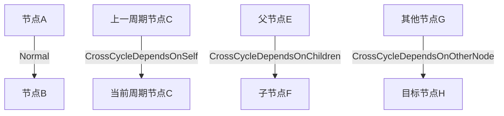

# 节点执行配置

<cite>
**本文档引用的文件**
- [node.schema.json](file://schema/node.schema.json)
- [SpecNode.schema.json](file://spec/src/main/resources/spec/schema/SpecNode.schema.json)
- [flow.schema.json](file://schema/flow.schema.json)
- [SpecFlowDepend.schema.json](file://spec/src/main/resources/spec/schema/SpecFlowDepend.schema.json)
- [SpecVariableDepend.schema.json](file://spec/src/main/resources/spec/schema/SpecVariableDepend.schema.json)
- [spec-fields.md](file://docs/spec/spec-fields.md)
- [odps-sql.md](file://docs/spec-templates/nodes/odps-sql.md)
- [pai-flow.md](file://docs/spec-templates/nodes/pai-flow.md)
- [test_integration.py](file://dwcli/tests/test_integration.py)
- [DependencyType.java](file://spec/src/main/java/com/aliyun/dataworks/common/spec/domain/enums/DependencyType.java)
- [TaskTimeoutParameter.java](file://client/migrationx/migrationx-domain/migrationx-domain-dolphinscheduler/src/main/java/com/aliyun/dataworks/migrationx/domain/dataworks/dolphinscheduler/v1/v139/task/TaskTimeoutParameter.java)
</cite>

## 目录
1. [重试策略配置](#重试策略配置)
2. [超时控制机制](#超时控制机制)
3. [执行参数与资源需求](#执行参数与资源需求)
4. [运行时环境设置](#运行时环境设置)
5. [节点依赖关系配置](#节点依赖关系配置)
6. [最佳实践与性能调优](#最佳实践与性能调优)
7. [常见问题解决方案](#常见问题解决方案)

## 重试策略配置

在dataworks-spec项目中，节点的重试策略通过`rerunMode`属性进行配置，该属性定义了节点在不同情况下的重跑权限。根据`node.schema.json`文件中的定义，`rerunMode`支持三种模式：

- **Allowed**：任何情况下都允许重跑
- **Denied**：任何情况下都不允许重跑  
- **FailureAllowed**：仅在失败的情况下允许重跑

此外，`SpecNode.schema.json`中还定义了`rerunTimes`和`rerunInterval`属性，分别用于设置最大重试次数和重试间隔时间。这些配置共同构成了完整的失败重试机制。

对于周期性任务，系统还支持周期重试模式，通过调度触发器的配置实现周期性的任务执行。在`flow.schema.json`中，`triggers`数组可以定义周期性调度的cron表达式、开始时间和结束时间。

**Section sources**
- [node.schema.json](file://schema/node.schema.json#L140-L153)
- [SpecNode.schema.json](file://spec/src/main/resources/spec/schema/SpecNode.schema.json#L21-L29)

## 超时控制机制

节点的超时控制机制通过`timeout`属性进行配置，该属性定义了节点运行的最大允许时间，单位为秒。当节点运行超过指定时间后，系统将自动终止该节点的执行。

在`node.schema.json`中，`timeout`被定义为整数类型，用于设置节点的超时时间。同时，在`TaskTimeoutParameter.java`类中，还定义了更详细的超时控制参数，包括：
- **enable**：是否启用超时控制
- **strategy**：超时处理策略
- **interval**：超时检查间隔

这些参数共同构成了完整的超时控制机制，确保长时间运行的任务不会无限期占用系统资源。

通过`test_integration.py`中的测试用例可以看出，超时配置可以通过命令行工具进行动态设置和验证，例如将超时时间从3600秒修改为7200秒。

**Section sources**
- [node.schema.json](file://schema/node.schema.json#L124-L127)
- [TaskTimeoutParameter.java](file://client/migrationx/migrationx-domain/migrationx-domain-dolphinscheduler/src/main/java/com/aliyun/dataworks/migrationx/domain/dataworks/dolphinscheduler/v1/v139/task/TaskTimeoutParameter.java#L50-L79)
- [test_integration.py](file://dwcli/tests/test_integration.py#L43-L70)

## 执行参数与资源需求

节点的执行参数和资源需求通过多个属性进行配置，确保任务能够在正确的环境中执行并获得必要的资源支持。

### 执行参数配置

执行参数主要通过`script`对象中的`parameters`数组进行配置。每个参数可以引用工作流中定义的变量，实现动态参数传递。在`spec-fields.md`文档中，详细说明了参数的配置方式，包括参数名称和值的引用。

### 资源需求配置

资源需求主要通过以下方式配置：
- **runtimeResource**：定义节点的运行时资源组，确保任务在指定的计算资源上执行
- **functions**：声明节点所需的UDF函数列表
- **fileResources**：声明节点所需的文件资源列表

在`flow.schema.json`中，`runtimeResources`数组定义了运行时资源的列表，每个资源包含`resourceGroup`标识符，用于指定具体的资源组。

**Section sources**
- [flow.schema.json](file://schema/flow.schema.json#L62-L68)
- [spec-fields.md](file://docs/spec/spec-fields.md#L110-L146)

## 运行时环境设置

运行时环境的设置是确保节点正确执行的关键，主要包括计算引擎、执行命令和环境变量等配置。

### 计算引擎配置

通过`script.runtime`对象配置运行时环境，主要包含：
- **engine**：运行时引擎类型，如MaxCompute、EMR、Hologres等
- **command**：在引擎上执行的命令或命令代号，如ODPS_SQL、EMR_HIVE等

在`odps-sql.md`文档中，提供了MaxCompute SQL节点的完整配置示例，展示了如何配置MaxCompute相关的参数，如`odps.sql.mapper.split.size`和`odps.sql.reducer.instances`等。

### 环境变量配置

环境变量可以通过`maxComputeConf`等特定配置项进行设置，用于调整计算引擎的行为。这些配置直接影响任务的执行性能和资源利用率。

**Section sources**
- [spec-fields.md](file://docs/spec/spec-fields.md#L160-L186)
- [odps-sql.md](file://docs/spec-templates/nodes/odps-sql.md#L93-L128)

## 节点依赖关系配置

节点依赖关系的配置是工作流编排的核心，决定了任务的执行顺序和条件。在dataworks-spec中，依赖关系通过`flow`数组进行定义。

### 前置依赖配置

前置依赖通过`flow`数组中的`depends`属性配置，支持多种依赖类型：
- **Normal**：同周期节点依赖
- **CrossCycleDependsOnSelf**：跨周期自依赖
- **CrossCycleDependsOnChildren**：跨周期依赖子节点
- **CrossCycleDependsOnOtherNode**：跨周期依赖其他节点

在`DependencyType.java`枚举类中，明确定义了这些依赖类型，确保类型安全和代码可读性。

### 变量依赖配置

变量依赖通过`inputs.variables`数组配置，允许节点依赖于其他节点输出的变量值。在`SpecVariableDepend.schema.json`中，定义了变量依赖的结构，包括`variableName`、`nodeId`和`type`等属性。

### 跨工作流依赖

跨工作流依赖通过引用其他工作流的输出实现，使用`nodeOutputs`配置项。在`flow.schema.json`中，`inputs.nodeOutputs`数组允许节点使用上游节点的预定义输出。

**Diagram sources**
- [flow.schema.json](file://schema/flow.schema.json#L114-L124)
- [DependencyType.java](file://spec/src/main/java/com/aliyun/dataworks/common/spec/domain/enums/DependencyType.java#L24-L45)

**Section sources**
- [flow.schema.json](file://schema/flow.schema.json#L86-L148)
- [SpecFlowDepend.schema.json](file://spec/src/main/resources/spec/schema/SpecFlowDepend.schema.json#L1-L26)
- [SpecVariableDepend.schema.json](file://spec/src/main/resources/spec/schema/SpecVariableDepend.schema.json#L1-L40)

## 最佳实践与性能调优

### 配置最佳实践

1. **合理设置超时时间**：根据任务复杂度设置合理的超时时间，建议范围为3600-7200秒
2. **资源隔离**：生产环境使用专用资源组，避免资源争用
3. **参数化设计**：使用变量参数化日期、区域等动态值，提高配置灵活性
4. **分区管理**：输出表使用分区，在SQL中使用`INSERT OVERWRITE TABLE ... PARTITION`

### 性能调优建议

1. **MaxCompute参数优化**：
   - 合理设置`odps.sql.mapper.split.size`和`odps.sql.reducer.instances`
   - 启用PPD(谓词下推)优化：`odps.optimizer.enable.ppd=true`
   - 大表关联使用MapJoin hint：`/*+ MAPJOIN(small_table) */`

2. **计算资源规划**：
   - 为不同类型的节点分配合适的CU资源
   - 监控资源使用情况，及时调整资源配置

3. **依赖关系优化**：
   - 避免不必要的跨周期依赖
   - 合理设计工作流结构，减少依赖层级

**Section sources**
- [odps-sql.md](file://docs/spec-templates/nodes/odps-sql.md#L218-L227)
- [pai-flow.md](file://docs/spec-templates/nodes/pai-flow.md#L214-L218)

## 常见问题解决方案

### 重试策略问题

**问题**：节点重试次数过多导致资源浪费
**解决方案**：合理设置`rerunTimes`和`rerunInterval`参数，避免频繁重试

**问题**：需要重试时却无法重试
**解决方案**：检查`rerunMode`配置是否为`Denied`，应设置为`Allowed`或`FailureAllowed`

### 超时控制问题

**问题**：任务频繁超时被终止
**解决方案**：
1. 检查`timeout`设置是否过短
2. 优化任务逻辑，减少执行时间
3. 考虑拆分大任务为多个小任务

### 依赖配置问题

**问题**：依赖关系配置错误导致执行顺序混乱
**解决方案**：
1. 仔细检查`flow`数组中的依赖配置
2. 使用`Normal`依赖确保同周期节点顺序执行
3. 正确使用跨周期依赖类型

**问题**：变量依赖无法正确传递
**解决方案**：
1. 检查变量名称是否匹配
2. 确保上游节点正确输出了变量
3. 验证变量作用域配置是否正确

**Section sources**
- [test_integration.py](file://dwcli/tests/test_integration.py#L43-L92)
- [odps-sql.md](file://docs/spec-templates/nodes/odps-sql.md#L228-L234)