# 节点模型

<cite>
**本文档引用的文件**   
- [node.schema.json](file://schema/node.schema.json)
- [SpecNode.schema.json](file://spec/src/main/resources/spec/schema/SpecNode.schema.json)
- [CodeModel.java](file://spec/src/main/java/com/aliyun/dataworks/common/spec/domain/dw/codemodel/CodeModel.java)
- [CodeModelFactory.java](file://spec/src/main/java/com/aliyun/dataworks/common/spec/domain/dw/codemodel/CodeModelFactory.java)
- [emr-spark.md](file://docs/spec-templates/nodes/emr-spark.md)
- [odps-sql.md](file://docs/spec-templates/nodes/odps-sql.md)
- [pai-flow.md](file://docs/spec-templates/nodes/pai-flow.md)
- [pai-studio.md](file://docs/spec-templates/nodes/pai-studio.md)
- [component-sql.md](file://docs/spec-templates/nodes/component-sql.md)
- [xlab.md](file://docs/spec-templates/nodes/xlab.md)
- [SpecScriptRuntime.java](file://spec/src/main/java/com/aliyun/dataworks/common/spec/domain/ref/runtime/SpecScriptRuntime.java)
</cite>

## 目录
1. [引言](#引言)
2. [节点结构定义](#节点结构定义)
3. [节点类型系统](#节点类型系统)
4. [执行参数与资源需求](#执行参数与资源需求)
5. [依赖关系配置](#依赖关系配置)
6. [代码模型实现机制](#代码模型实现机制)
7. [具体节点配置示例](#具体节点配置示例)
8. [输入输出管理](#输入输出管理)
9. [重试策略与超时控制](#重试策略与超时控制)
10. [性能调优建议](#性能调优建议)
11. [常见问题解决方案](#常见问题解决方案)

## 引言
本文档详细说明dataworks-spec项目中节点模型的定义和实现，重点分析Node.schema.json和SpecNode.schema.json两个核心文件所定义的节点结构。文档涵盖了节点类型系统、执行参数、资源需求、依赖关系配置等关键方面，并深入解释了节点代码模型（CodeModel）的实现机制和扩展方式。通过提供SQL节点、EMR节点、PAI节点等各类节点的具体配置示例，帮助用户理解和使用节点模型。同时，文档阐述了节点输入输出管理、重试策略和超时控制机制，并提供性能调优建议和常见问题解决方案。

## 节点结构定义

### Node.schema.json 结构分析
Node.schema.json 定义了工作流节点的基本结构，包含节点的唯一标识、名称、脚本、触发器、输入输出等核心属性。该文件作为节点定义的JSON Schema，确保了节点配置的规范性和一致性。

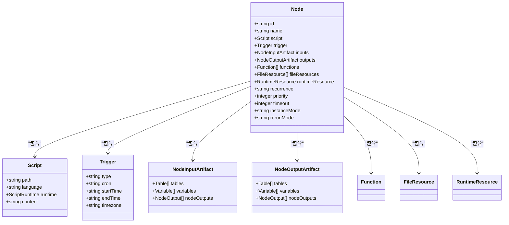

**图源**
- [node.schema.json](file://schema/node.schema.json#L1-L160)

**本节来源**
- [node.schema.json](file://schema/node.schema.json#L1-L160)

### SpecNode.schema.json 结构分析
SpecNode.schema.json 定义了节点的详细规范，包含了更丰富的配置选项，如数据源、数据集、分支、循环等复杂工作流控制结构。该文件作为节点规范的JSON Schema，支持更复杂的节点配置需求。

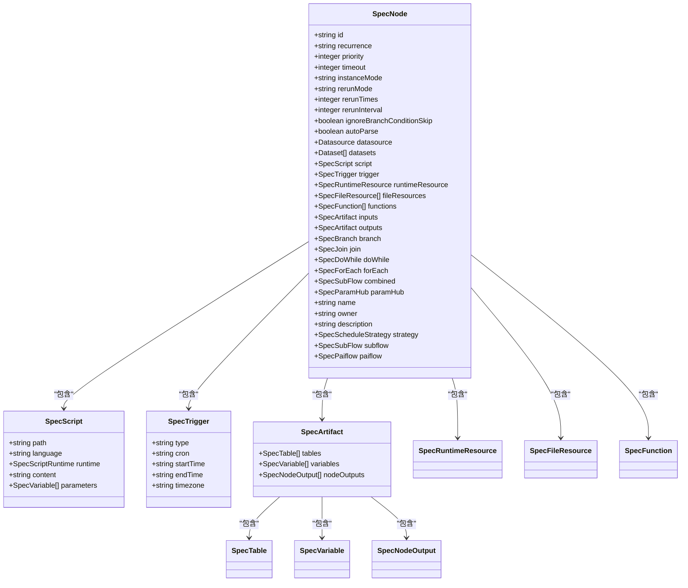

**图源**
- [SpecNode.schema.json](file://spec/src/main/resources/spec/schema/SpecNode.schema.json#L1-L114)

**本节来源**
- [SpecNode.schema.json](file://spec/src/main/resources/spec/schema/SpecNode.schema.json#L1-L114)

## 节点类型系统

### 核心节点类型
dataworks-spec项目定义了多种节点类型，每种类型对应不同的计算引擎和执行场景。主要节点类型包括：

| 节点类型 | CodeProgramType | CalcEngineType | 说明 |
|--------|----------------|---------------|------|
| ODPS_SQL | ODPS_SQL | ODPS (MaxCompute) | MaxCompute SQL节点，用于执行SQL语句 |
| EMR_SPARK | EMR_SPARK | EMR | EMR Spark节点，用于提交Spark作业 |
| PAI_FLOW | PAI_FLOW | PAI | PAI Flow节点，用于执行机器学习工作流 |
| PAI_STUDIO | PAI_STUDIO | PAI | PAI Studio节点，用于执行机器学习任务 |
| COMPONENT_SQL | COMPONENT_SQL | GENERAL | 组件SQL节点，用于执行预定义组件的SQL查询 |
| XLAB | XLAB | PAI | Xlab节点，用于执行AI实验任务 |

**本节来源**
- [emr-spark.md](file://docs/spec-templates/nodes/emr-spark.md#L9-L11)
- [odps-sql.md](file://docs/spec-templates/nodes/odps-sql.md#L9-L11)
- [pai-flow.md](file://docs/spec-templates/nodes/pai-flow.md#L9-L11)
- [pai-studio.md](file://docs/spec-templates/nodes/pai-studio.md#L9-L11)
- [component-sql.md](file://docs/spec-templates/nodes/component-sql.md#L9-L11)
- [xlab.md](file://docs/spec-templates/nodes/xlab.md#L9-L11)

### 节点类型扩展机制
节点类型系统通过CodeProgramType枚举和CalcEngineType枚举实现扩展。新的节点类型可以通过添加新的枚举值来支持，同时需要在代码模型中实现相应的解析和执行逻辑。

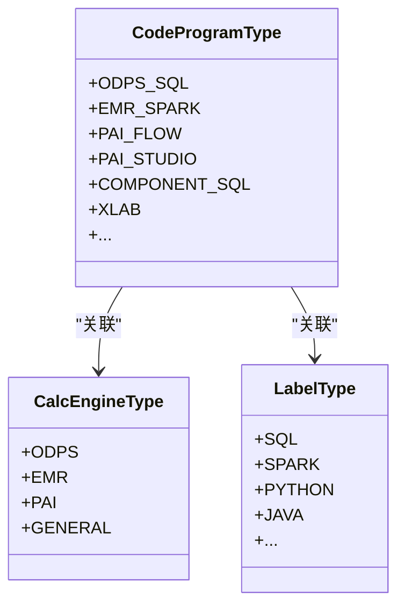

**图源**
- [DataWorksSpecPackageFileService.java](file://client/migrationx/migrationx-domain/migrationx-domain-dataworks/src/main/java/com/aliyun/dataworks/migrationx/domain/dataworks/service/impl/DataWorksSpecPackageFileService.java#L430-L438)

**本节来源**
- [DataWorksSpecPackageFileService.java](file://client/migrationx/migrationx-domain/migrationx-domain-dataworks/src/main/java/com/aliyun/dataworks/migrationx/domain/dataworks/service/impl/DataWorksSpecPackageFileService.java#L430-L438)

## 执行参数与资源需求

### 脚本运行时配置
节点的执行参数主要通过SpecScriptRuntime类进行配置，支持多种计算引擎的特定配置。不同类型的节点可以配置不同的运行时参数。

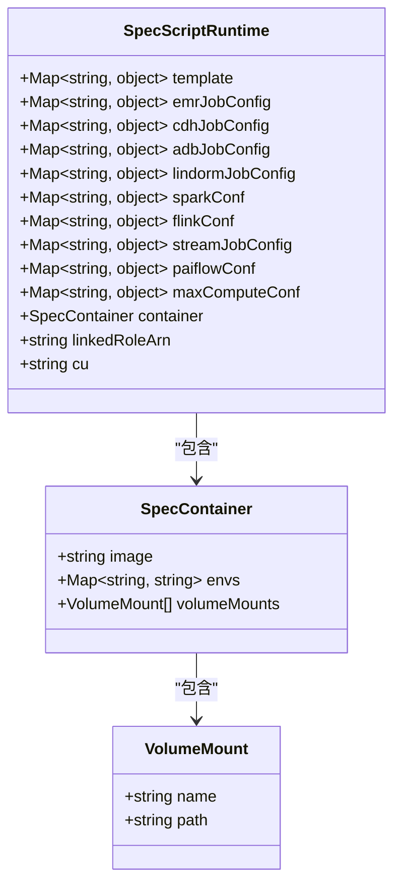

**图源**
- [SpecScriptRuntime.java](file://spec/src/main/java/com/aliyun/dataworks/common/spec/domain/ref/runtime/SpecScriptRuntime.java#L47-L99)

**本节来源**
- [SpecScriptRuntime.java](file://spec/src/main/java/com/aliyun/dataworks/common/spec/domain/ref/runtime/SpecScriptRuntime.java#L47-L99)

### 资源需求配置
节点的资源需求通过runtimeResource属性进行配置，指定节点执行所需的资源组和计算资源。不同的节点类型可能需要不同的资源配置。

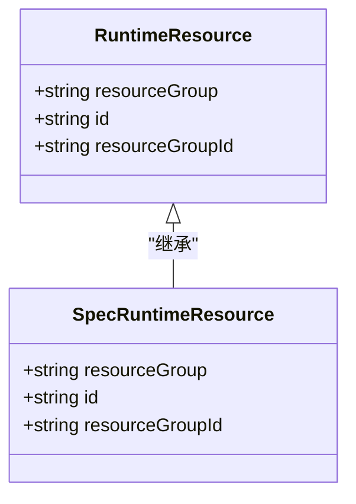

**本节来源**
- [node.schema.json](file://schema/node.schema.json#L101-L105)
- [SpecNode.schema.json](file://spec/src/main/resources/spec/schema/SpecNode.schema.json#L51-L53)

## 依赖关系配置

### 输入依赖配置
节点的输入依赖通过inputs属性进行配置，支持表、变量和节点输出三种类型的输入依赖。这些依赖定义了节点执行前需要满足的前置条件。

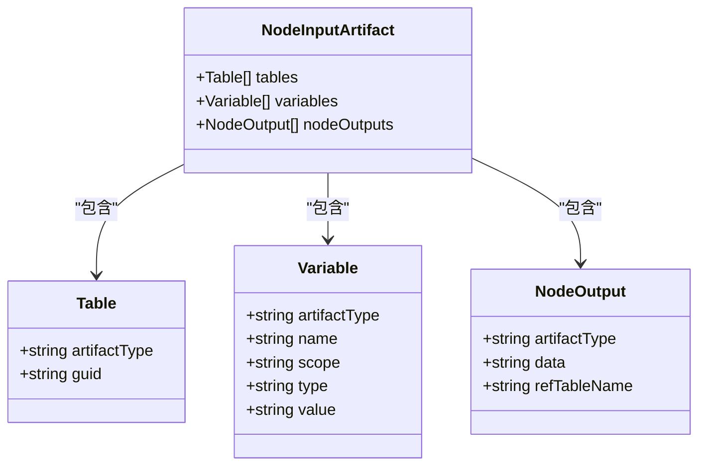

**本节来源**
- [node.schema.json](file://schema/node.schema.json#L23-L53)

### 输出依赖配置
节点的输出依赖通过outputs属性进行配置，定义了节点执行后产生的输出结果。这些输出可以被后续节点作为输入依赖使用。


**本节来源**
- [node.schema.json](file://schema/node.schema.json#L54-L84)

### 依赖关系管理
节点间的依赖关系通过SpecDepend类进行管理，支持多种依赖类型，包括正常依赖、变量依赖等。依赖关系的配置确保了工作流的正确执行顺序。

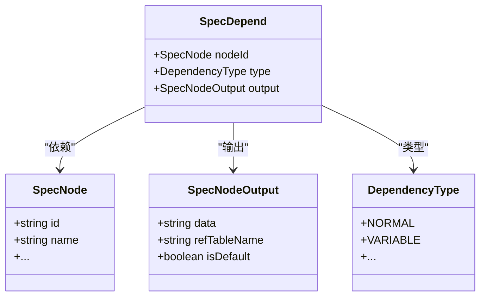

**本节来源**
- [SpecDepend.java](file://spec/src/main/java/com/aliyun/dataworks/common/spec/domain/noref/SpecDepend.java#L43-L54)

## 代码模型实现机制

### CodeModel 类结构
CodeModel类是节点代码模型的核心实现，负责管理节点代码的解析、生成和执行。它通过泛型支持不同类型的代码实体，并提供统一的接口。

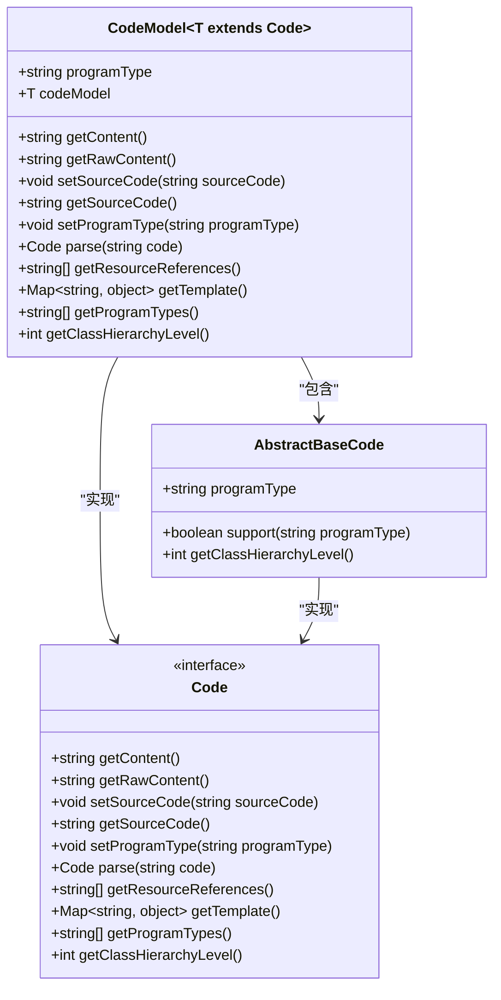

**图源**
- [CodeModel.java](file://spec/src/main/java/com/aliyun/dataworks/common/spec/domain/dw/codemodel/CodeModel.java#L37-L98)

**本节来源**
- [CodeModel.java](file://spec/src/main/java/com/aliyun/dataworks/common/spec/domain/dw/codemodel/CodeModel.java#L37-L98)

### CodeModelFactory 创建机制
CodeModelFactory类负责创建和管理CodeModel实例，通过反射机制动态加载和实例化不同类型的代码模型。这种设计支持了代码模型的扩展性和灵活性。

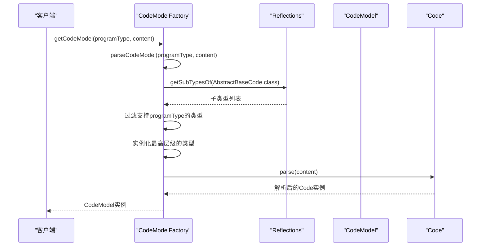

**图源**
- [CodeModelFactory.java](file://spec/src/main/java/com/aliyun/dataworks/common/spec/domain/dw/codemodel/CodeModelFactory.java#L44-L71)

**本节来源**
- [CodeModelFactory.java](file://spec/src/main/java/com/aliyun/dataworks/common/spec/domain/dw/codemodel/CodeModelFactory.java#L44-L71)

## 具体节点配置示例

### SQL节点配置示例
MaxCompute SQL节点（ODPS_SQL）是最常用的节点类型之一，用于在MaxCompute计算引擎上执行SQL语句。

```json
{
  "id": "node_odps_sql_001",
  "name": "daily_data_aggregation",
  "recurrence": "Normal",
  "priority": 5,
  "timeout": 3600,
  "instanceMode": "T+1",
  "rerunMode": "Allowed",
  "datasource": {
    "name": "odps_first",
    "type": "odps"
  },
  "script": {
    "path": "/业务流程/数据开发/daily_aggregation.sql",
    "language": "odps-sql",
    "runtime": {
      "engine": "MaxCompute",
      "command": "ODPS_SQL",
      "maxComputeConf": {
        "odps.sql.mapper.split.size": "256",
        "odps.sql.reducer.instances": "100"
      }
    }
  },
  "runtimeResource": {
    "resourceGroup": "group_524257424564736",
    "resourceGroupId": "310003"
  },
  "inputs": {
    "tables": [
      {
        "artifactType": "Table",
        "guid": "odps.project_name.source_table_001"
      }
    ],
    "variables": [
      {
        "artifactType": "Variable",
        "name": "bizdate",
        "scope": "NodeParameter",
        "type": "System",
        "value": "${yyyymmdd}"
      }
    ]
  },
  "outputs": {
    "tables": [
      {
        "artifactType": "Table",
        "guid": "odps.project_name.target_table_001"
      }
    ]
  }
}
```

**本节来源**
- [odps-sql.md](file://docs/spec-templates/nodes/odps-sql.md#L16-L94)

### EMR节点配置示例
EMR Spark节点（EMR_SPARK）用于在EMR集群上提交Spark作业，支持Jar包或Python脚本的执行。

```json
{
  "id": "node_emr_spark_001",
  "name": "spark_batch_processing",
  "recurrence": "Normal",
  "priority": 3,
  "timeout": 7200,
  "instanceMode": "T+1",
  "rerunMode": "Allowed",
  "script": {
    "path": "/emr/spark_jobs/batch_processing.sh",
    "language": "shell",
    "runtime": {
      "engine": "EMR",
      "command": "EMR_SPARK",
      "emrJobConfig": {
        "jobMode": "LOCAL",
        "jobType": "SPARK",
        "executeMode": "Single",
        "clusterId": "C-ABC123DEF456",
        "args": [
          "--date",
          "${bizdate}",
          "--input",
          "oss://bucket/input/",
          "--output",
          "oss://bucket/output/"
        ],
        "sparkConf": {
          "spark.executor.memory": "4g",
          "spark.executor.cores": "2",
          "spark.driver.memory": "2g",
          "spark.sql.shuffle.partitions": "200"
        },
        "files": [
          "oss://bucket/conf/application.conf"
        ],
        "jars": [
          "oss://bucket/libs/spark-job.jar"
        ],
        "mainClass": "com.example.SparkBatchJob",
        "mainJar": "oss://bucket/libs/spark-job.jar"
      }
    }
  },
  "runtimeResource": {
    "resourceGroup": "group_emr",
    "resourceGroupId": "310004"
  },
  "inputs": {
    "variables": [
      {
        "artifactType": "Variable",
        "name": "bizdate",
        "scope": "NodeParameter",
        "type": "System",
        "value": "${yyyymmdd}"
      }
    ]
  }
}
```

**本节来源**
- [emr-spark.md](file://docs/spec-templates/nodes/emr-spark.md#L16-L94)

### PAI节点配置示例
PAI Flow节点（PAI_FLOW）用于执行PAI平台的复杂机器学习工作流，支持多步骤的AI任务编排。

```json
{
  "id": "paiflow_1",
  "name": "test_create_paiflow_1739519049",
  "timeout": 10000,
  "instanceMode": "T+1",
  "rerunMode": "Allowed",
  "script": {
    "path": "paiflows/test_create_paiflow_1739519049",
    "runtime": {
      "command": "PAI_FLOW",
      "cu": "0.25"
    }
  },
  "runtimeResource": {
    "resourceGroup": "group_56152229",
    "resourceGroupId": "1"
  },
  "paiflow": {
    "nodes": [
      {
        "id": "8245048540225720582",
        "name": "rag_sync_index",
        "script": {
          "path": "paiflows/test_create_paiflow_1739519049/rag_sync_index",
          "runtime": {
            "engine": "General",
            "command": "PAI_FLOW_RAG_GENERATE_EMBEDDING"
          }
        }
      }
    ],
    "flow": [
      {
        "nodeId": "8245048540225720582",
        "depends": [
          {
            "type": "Normal",
            "output": "8170100874044141528",
            "refTableName": "rag_parse_chunk"
          }
        ]
      }
    ]
  }
}
```

**本节来源**
- [pai-flow.md](file://docs/spec-templates/nodes/pai-flow.md#L15-L191)

## 输入输出管理

### 输入管理机制
节点的输入管理通过inputs属性实现，支持多种类型的输入依赖。系统会根据输入依赖的配置，在节点执行前验证所有依赖是否满足。

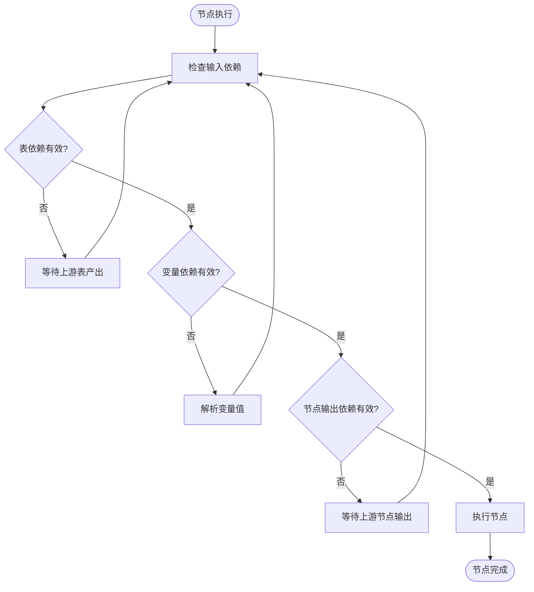

**本节来源**
- [node.schema.json](file://schema/node.schema.json#L23-L53)

### 输出管理机制
节点的输出管理通过outputs属性实现，定义了节点执行后产生的输出结果。这些输出结果可以被后续节点作为输入依赖使用。

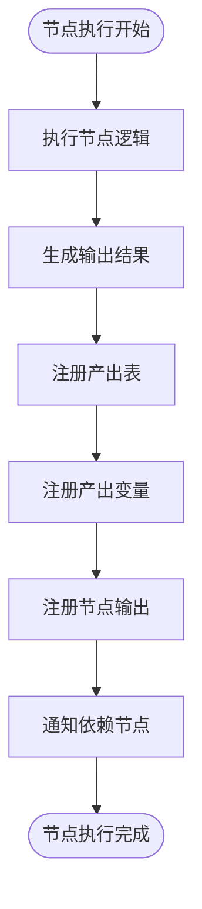

**本节来源**
- [node.schema.json](file://schema/node.schema.json#L54-L84)

## 重试策略与超时控制

### 重试策略配置
节点的重试策略通过rerunMode属性进行配置，支持三种重试模式：允许重试、禁止重试和仅失败时重试。

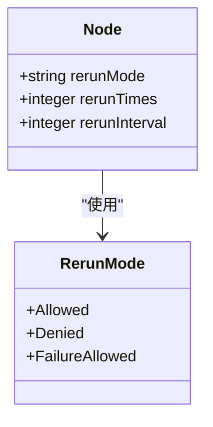

**本节来源**
- [node.schema.json](file://schema/node.schema.json#L140-L153)

### 超时控制机制
节点的超时控制通过timeout属性进行配置，单位为秒。当节点执行时间超过指定的超时时间后，系统会自动终止节点执行。

```mermaid
sequenceDiagram
participant Node as "节点"
participant Monitor as "监控器"
participant System as "系统"
Node->>Monitor : 开始执行
Monitor->>Monitor : 记录开始时间
loop 每秒检查
Monitor->>Monitor : 检查执行时间
Monitor->>Monitor : 当前时间 - 开始时间 > timeout?
alt 超时
Monitor->>System : 发送终止信号
System->>Node : 终止节点执行
Node->>Monitor : 执行被终止
Monitor->>Monitor : 记录超时事件
break
end
end
alt 正常完成
Node->>Monitor : 执行完成
Monitor->>Monitor : 记录完成时间
end
```

**本节来源**
- [node.schema.json](file://schema/node.schema.json#L124-L127)
- [SpecScheduleStrategy.java](file://spec/src/main/java/com/aliyun/dataworks/common/spec/domain/ref/SpecScheduleStrategy.java#L46-L48)

## 性能调优建议

### SQL节点性能调优
对于MaxCompute SQL节点，可以通过以下方式优化性能：

1. **合理设置Mapper Split大小**：根据数据量调整`odps.sql.mapper.split.size`参数
2. **优化Reducer实例数**：根据数据量和复杂度调整`odps.sql.reducer.instances`参数
3. **启用PDD优化**：设置`odps.optimizer.enable.ppd`为true，启用谓词下推优化
4. **使用MapJoin**：对于小表关联，使用MapJoin hint优化性能
5. **分区管理**：输出表使用分区，避免全表扫描

**本节来源**
- [odps-sql.md](file://docs/spec-templates/nodes/odps-sql.md#L219-L225)

### EMR节点性能调优
对于EMR Spark节点，可以通过以下方式优化性能：

1. **合理配置Executor内存**：根据数据量调整`spark.executor.memory`参数
2. **优化Executor CPU核数**：根据任务类型调整`spark.executor.cores`参数
3. **设置合适的Shuffle分区数**：根据数据量调整`spark.sql.shuffle.partitions`参数
4. **启用动态资源分配**：设置`spark.dynamicAllocation.enabled`为true
5. **选择合适的序列化器**：使用KryoSerializer提高序列化性能

**本节来源**
- [emr-spark.md](file://docs/spec-templates/nodes/emr-spark.md#L174-L185)

## 常见问题解决方案

### 节点执行超时问题
当节点执行超时时，可以采取以下解决方案：

1. **增加超时时间**：根据任务复杂度适当增加timeout配置
2. **优化任务逻辑**：简化SQL查询或Spark作业逻辑
3. **增加计算资源**：为节点分配更多的计算资源
4. **分批处理数据**：将大数据量处理任务拆分为多个小任务
5. **检查数据倾斜**：分析是否存在数据倾斜问题并进行优化

**本节来源**
- [node.schema.json](file://schema/node.schema.json#L124-L127)
- [SpecScheduleStrategy.java](file://spec/src/main/java/com/aliyun/dataworks/common/spec/domain/ref/SpecScheduleStrategy.java#L46-L48)

### 节点依赖不满足问题
当节点依赖不满足时，可以采取以下解决方案：

1. **检查上游节点状态**：确认上游节点是否正常执行完成
2. **验证输入配置**：检查inputs配置中的表、变量和节点输出是否正确
3. **检查数据产出时间**：确认上游数据是否按时产出
4. **调整调度时间**：适当调整节点的调度时间以确保依赖满足
5. **设置合理的重试策略**：配置适当的重试次数和间隔

**本节来源**
- [node.schema.json](file://schema/node.schema.json#L23-L53)
- [SpecDepend.java](file://spec/src/main/java/com/aliyun/dataworks/common/spec/domain/noref/SpecDepend.java#L43-L54)

### 资源不足问题
当节点执行时遇到资源不足问题，可以采取以下解决方案：

1. **检查资源组配置**：确认runtimeResource配置是否正确
2. **增加资源配额**：为资源组申请更多的计算资源
3. **优化资源使用**：调整任务的资源需求配置
4. **错峰执行**：调整节点的执行时间以避开资源使用高峰
5. **使用专用资源组**：为关键任务配置专用资源组

**本节来源**
- [node.schema.json](file://schema/node.schema.json#L101-L105)
- [SpecNode.schema.json](file://spec/src/main/resources/spec/schema/SpecNode.schema.json#L51-L53)