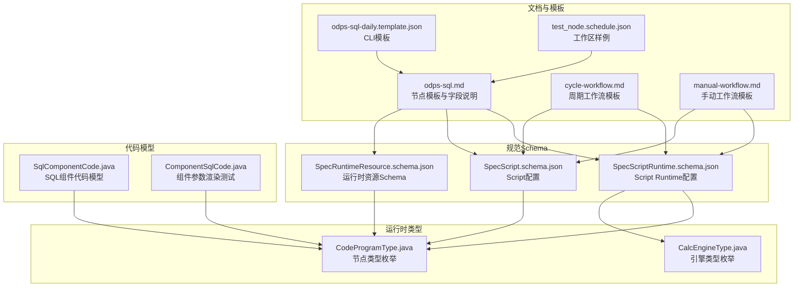
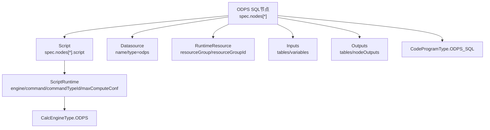
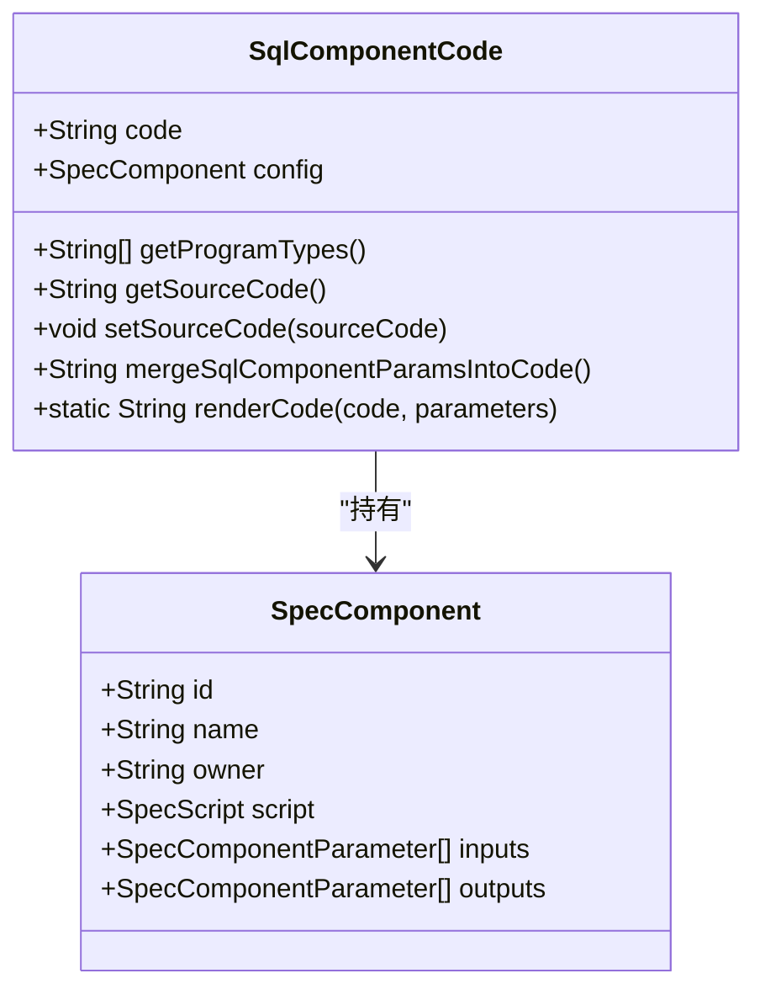
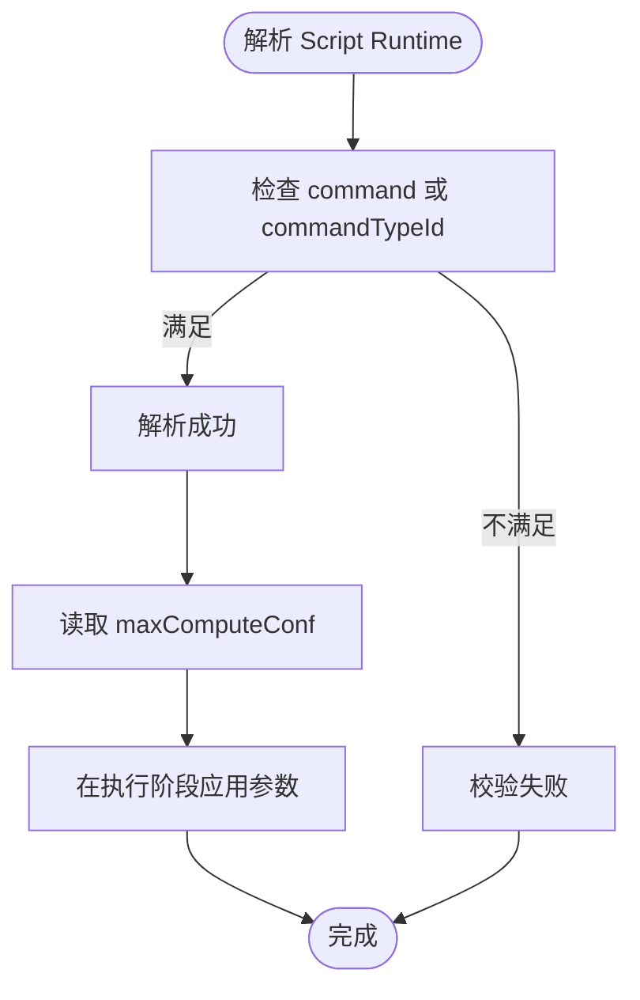
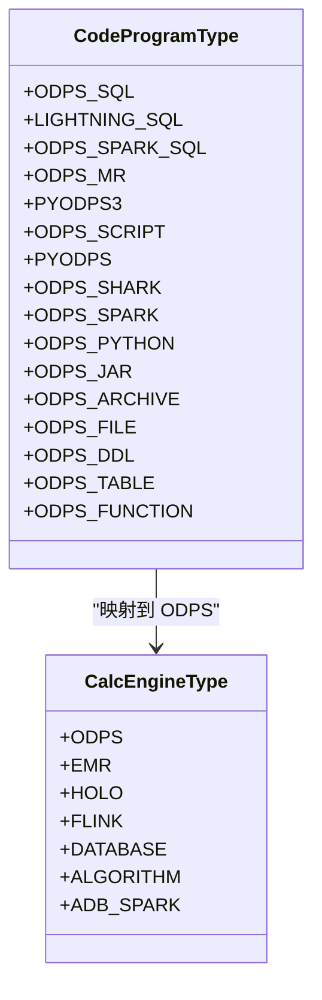
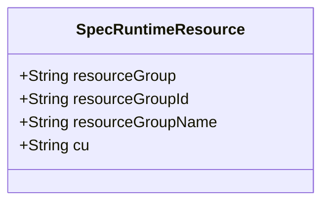
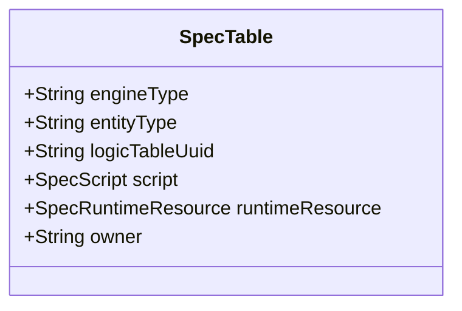
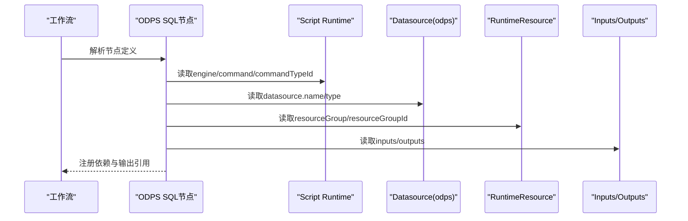
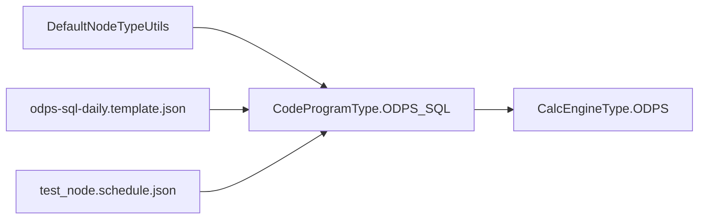

# ODPS SQL节点

<cite>
**本文引用的文件列表**
- [odps-sql.md](file://docs/spec-templates/nodes/odps-sql.md)
- [cycle-workflow.md](file://docs/spec-templates/workflows/cycle-workflow.md)
- [manual-workflow.md](file://docs/spec-templates/workflows/manual-workflow.md)
- [SpecScriptRuntime.schema.json](file://spec/src/main/resources/spec/schema/SpecScriptRuntime.schema.json)
- [SpecScript.schema.json](file://spec/src/main/resources/spec/schema/SpecScript.schema.json)
- [SpecRuntimeResource.schema.json](file://spec/src/main/resources/spec/schema/runtimeResource.schema.json)
- [SpecRuntimeResource.java](file://spec/src/main/java/com/aliyun/dataworks/common/spec/domain/ref/SpecRuntimeResource.java)
- [SpecTable.java](file://spec/src/main/java/com/aliyun/dataworks/common/spec/domain/ref/SpecTable.java)
- [CodeProgramType.java](file://spec/src/main/java/com/aliyun/dataworks/common/spec/domain/dw/types/CodeProgramType.java)
- [CalcEngineType.java](file://spec/src/main/java/com/aliyun/dataworks/common/spec/domain/dw/types/CalcEngineType.java)
- [SqlComponentCode.java](file://spec/src/main/java/com/aliyun/dataworks/common/spec/domain/dw/codemodel/SqlComponentCode.java)
- [ComponentSqlCode.java](file://spec/src/test/java/com/aliyun/dataworks/common/spec/domain/dw/codemodel/ComponentSqlCodeTest.java)
- [odps-sql-daily.template.json](file://dwcli/dwcli/templates/odps-sql-daily.template.json)
- [test_node.schedule.json](file://dwcli/myworkspace/test_node/test_node.schedule.json)
- [DefaultNodeTypeUtils.java](file://client/migrationx/migrationx-domain/migrationx-domain-dataworks/src/main/java/com/aliyun/dataworks/migrationx/domain/dataworks/utils/DefaultNodeTypeUtils.java)
</cite>

## 目录
1. [简介](#简介)
2. [项目结构](#项目结构)
3. [核心组件](#核心组件)
4. [架构总览](#架构总览)
5. [详细组件分析](#详细组件分析)
6. [依赖分析](#依赖分析)
7. [性能考虑](#性能考虑)
8. [故障排查指南](#故障排查指南)
9. [结论](#结论)
10. [附录](#附录)

## 简介
本文件面向DataWorks工作流规范中的ODPS SQL节点（即“MaxCompute SQL”节点），系统性说明其在DataWorks Spec中的实现机制与配置要点。重点覆盖：
- 计算引擎类型标识与节点类型映射
- Script Runtime中的ODPS相关执行参数（如maxComputeConf）
- 资源引用（runtimeResource）、数据源（datasource）、输入输出（inputs/outputs）等关键属性
- 完整配置示例（含SQL脚本、参数绑定、资源依赖）
- 周期性工作流与手动工作流中的应用差异
- 与数据表、资源文件等DataWorks组件的集成方式

## 项目结构
围绕ODPS SQL节点的关键文件分布如下：
- 文档模板：ODPS SQL节点、周期工作流、手动工作流的配置模板与字段说明
- 规范Schema：Script Runtime、Script、RuntimeResource等JSON Schema
- 运行时类型枚举：CodeProgramType（节点类型）、CalcEngineType（引擎类型）
- 代码模型：SqlComponentCode、ComponentSqlCode（组件化SQL节点的参数渲染）
- CLI模板与样例：ODPS SQL节点的日常模板、工作区样例

图表来源
- [odps-sql.md](file://docs/spec-templates/nodes/odps-sql.md#L1-L234)
- [cycle-workflow.md](file://docs/spec-templates/workflows/cycle-workflow.md#L1-L199)
- [manual-workflow.md](file://docs/spec-templates/workflows/manual-workflow.md#L1-L236)
- [odps-sql-daily.template.json](file://dwcli/dwcli/templates/odps-sql-daily.template.json#L1-L28)
- [test_node.schedule.json](file://dwcli/myworkspace/test_node/test_node.schedule.json#L1-L22)
- [SpecScriptRuntime.schema.json](file://spec/src/main/resources/spec/schema/SpecScriptRuntime.schema.json#L1-L75)
- [SpecScript.schema.json](file://spec/src/main/resources/spec/schema/SpecScript.schema.json#L1-L35)
- [SpecRuntimeResource.schema.json](file://spec/src/main/resources/spec/schema/runtimeResource.schema.json#L1-L200)
- [CodeProgramType.java](file://spec/src/main/java/com/aliyun/dataworks/common/spec/domain/dw/types/CodeProgramType.java#L64-L89)
- [CalcEngineType.java](file://spec/src/main/java/com/aliyun/dataworks/common/spec/domain/dw/types/CalcEngineType.java#L27-L73)
- [SqlComponentCode.java](file://spec/src/main/java/com/aliyun/dataworks/common/spec/domain/dw/codemodel/SqlComponentCode.java#L1-L108)
- [ComponentSqlCode.java](file://spec/src/test/java/com/aliyun/dataworks/common/spec/domain/dw/codemodel/ComponentSqlCodeTest.java#L24-L52)

章节来源
- [odps-sql.md](file://docs/spec-templates/nodes/odps-sql.md#L1-L234)
- [SpecScriptRuntime.schema.json](file://spec/src/main/resources/spec/schema/SpecScriptRuntime.schema.json#L1-L75)
- [SpecScript.schema.json](file://spec/src/main/resources/spec/schema/SpecScript.schema.json#L1-L35)
- [SpecRuntimeResource.schema.json](file://spec/src/main/resources/spec/schema/runtimeResource.schema.json#L1-L200)
- [CodeProgramType.java](file://spec/src/main/java/com/aliyun/dataworks/common/spec/domain/dw/types/CodeProgramType.java#L64-L89)
- [CalcEngineType.java](file://spec/src/main/java/com/aliyun/dataworks/common/spec/domain/dw/types/CalcEngineType.java#L27-L73)
- [SqlComponentCode.java](file://spec/src/main/java/com/aliyun/dataworks/common/spec/domain/dw/codemodel/SqlComponentCode.java#L1-L108)
- [ComponentSqlCode.java](file://spec/src/test/java/com/aliyun/dataworks/common/spec/domain/dw/codemodel/ComponentSqlCodeTest.java#L24-L52)
- [odps-sql-daily.template.json](file://dwcli/dwcli/templates/odps-sql-daily.template.json#L1-L28)
- [test_node.schedule.json](file://dwcli/myworkspace/test_node/test_node.schedule.json#L1-L22)

## 核心组件
- 计算引擎类型标识
  - 引擎类型：ODPS（MaxCompute）
  - 节点类型：ODPS_SQL（commandTypeId: 10）
  - 语言：odps-sql/sql
- Script Runtime配置
  - engine: MaxCompute
  - command: ODPS_SQL
  - commandTypeId: 10
  - maxComputeConf: MaxCompute SQL参数集合
- 资源引用
  - runtimeResource: 指定资源组与CU等运行时资源
- 数据源
  - datasource: name/type（type固定为odps）
- 输入输出
  - inputs.tables/inputs.variables
  - outputs.tables/outputs.nodeOutputs

章节来源
- [odps-sql.md](file://docs/spec-templates/nodes/odps-sql.md#L9-L14)
- [SpecScriptRuntime.schema.json](file://spec/src/main/resources/spec/schema/SpecScriptRuntime.schema.json#L1-L75)
- [SpecScript.schema.json](file://spec/src/main/resources/spec/schema/SpecScript.schema.json#L1-L35)
- [SpecRuntimeResource.schema.json](file://spec/src/main/resources/spec/schema/runtimeResource.schema.json#L1-L200)

## 架构总览
ODPS SQL节点在DataWorks Spec中的整体交互如下：
- 节点定义包含script.runtime（引擎、命令、参数）、datasource（odps）、runtimeResource（资源组）、inputs/outputs（表与变量）
- CLI模板与工作区样例展示了节点在周期工作流中的典型形态
- CodeProgramType与CalcEngineType定义了节点类型与引擎类型的映射关系

图表来源
- [odps-sql.md](file://docs/spec-templates/nodes/odps-sql.md#L16-L90)
- [SpecScriptRuntime.schema.json](file://spec/src/main/resources/spec/schema/SpecScriptRuntime.schema.json#L1-L75)
- [SpecScript.schema.json](file://spec/src/main/resources/spec/schema/SpecScript.schema.json#L1-L35)
- [SpecRuntimeResource.schema.json](file://spec/src/main/resources/spec/schema/runtimeResource.schema.json#L1-L200)
- [CodeProgramType.java](file://spec/src/main/java/com/aliyun/dataworks/common/spec/domain/dw/types/CodeProgramType.java#L64-L89)
- [CalcEngineType.java](file://spec/src/main/java/com/aliyun/dataworks/common/spec/domain/dw/types/CalcEngineType.java#L27-L73)

## 详细组件分析

### 组件：SqlComponentCode（组件化SQL代码模型）
- 作用
  - 将组件节点的参数（inputs/outputs）注入到SQL代码中，生成最终可执行代码
- 关键点
  - programTypes包含SQL_COMPONENT
  - 提供mergeSqlComponentParamsIntoCode，按inputs/outputs顺序进行占位符替换
  - renderCode对单个参数集进行占位符替换
- 适用场景
  - 组件化SQL节点（COMPONENT_SQL/SQL_COMPONENT）的参数绑定与渲染

图表来源
- [SqlComponentCode.java](file://spec/src/main/java/com/aliyun/dataworks/common/spec/domain/dw/codemodel/SqlComponentCode.java#L1-L108)
- [SpecComponent.schema.json](file://spec/src/main/resources/spec/schema/SpecComponent.schema.json#L1-L39)

章节来源
- [SqlComponentCode.java](file://spec/src/main/java/com/aliyun/dataworks/common/spec/domain/dw/codemodel/SqlComponentCode.java#L74-L108)
- [ComponentSqlCode.java](file://spec/src/test/java/com/aliyun/dataworks/common/spec/domain/dw/codemodel/ComponentSqlCodeTest.java#L24-L52)

### 组件：Script Runtime（ODPS相关执行参数）
- 关键字段
  - engine: MaxCompute
  - command: ODPS_SQL
  - commandTypeId: 10
  - maxComputeConf: MaxCompute SQL参数对象（如mapper/reducer实例数、兼容性开关等）
- Schema约束
  - runtime必需包含command或commandTypeId之一
  - 支持多引擎的扩展配置（如sparkConf/flinkConf等）

图表来源
- [SpecScriptRuntime.schema.json](file://spec/src/main/resources/spec/schema/SpecScriptRuntime.schema.json#L1-L75)
- [SpecScript.schema.json](file://spec/src/main/resources/spec/schema/SpecScript.schema.json#L1-L35)

章节来源
- [SpecScriptRuntime.schema.json](file://spec/src/main/resources/spec/schema/SpecScriptRuntime.schema.json#L1-L75)
- [SpecScript.schema.json](file://spec/src/main/resources/spec/schema/SpecScript.schema.json#L1-L35)

### 组件：节点类型与引擎类型映射
- CodeProgramType.ODPS_SQL
  - 引擎类型：ODPS
  - 语言：.sql
  - 常见变体：ODPS_SQL、LIGHTNING_SQL、ODPS_SPARK_SQL、ODPS_MR、PYODPS3、ODPS_SCRIPT、PYODPS、ODPS_SHARK、ODPS_SPARK、ODPS_PYTHON、ODPS_JAR、ODPS_ARCHIVE、ODPS_FILE、ODPS_DDL、ODPS_TABLE、ODPS_FUNCTION
- CalcEngineType.ODPS
  - 代表MaxCompute引擎

图表来源
- [CodeProgramType.java](file://spec/src/main/java/com/aliyun/dataworks/common/spec/domain/dw/types/CodeProgramType.java#L64-L89)
- [CalcEngineType.java](file://spec/src/main/java/com/aliyun/dataworks/common/spec/domain/dw/types/CalcEngineType.java#L27-L73)

章节来源
- [CodeProgramType.java](file://spec/src/main/java/com/aliyun/dataworks/common/spec/domain/dw/types/CodeProgramType.java#L64-L89)
- [CalcEngineType.java](file://spec/src/main/java/com/aliyun/dataworks/common/spec/domain/dw/types/CalcEngineType.java#L27-L73)

### 组件：资源引用（runtimeResource）
- 字段
  - resourceGroup：资源组标识
  - resourceGroupId：调度侧资源组ID
  - resourceGroupName：资源组名称
  - cu：已废弃字段（保留兼容）
- 用途
  - 指定ODPS SQL节点运行时使用的资源组，实现资源隔离与配额控制

图表来源
- [SpecRuntimeResource.java](file://spec/src/main/java/com/aliyun/dataworks/common/spec/domain/ref/SpecRuntimeResource.java#L1-L50)
- [SpecRuntimeResource.schema.json](file://spec/src/main/resources/spec/schema/runtimeResource.schema.json#L1-L200)

章节来源
- [SpecRuntimeResource.java](file://spec/src/main/java/com/aliyun/dataworks/common/spec/domain/ref/SpecRuntimeResource.java#L1-L50)
- [SpecRuntimeResource.schema.json](file://spec/src/main/resources/spec/schema/runtimeResource.schema.json#L1-L200)

### 组件：输入输出与数据表集成
- 输入
  - tables：引用ODPS表（artifactType: Table，guid格式为odps.project.table）
  - variables：节点参数（如系统变量${yyyymmdd}）
- 输出
  - tables：目标ODPS表
  - nodeOutputs：节点输出引用，便于下游节点依赖
- 表实体
  - SpecTable包含engineType、entityType、logicTableUuid等字段，用于表级元数据管理

图表来源
- [SpecTable.java](file://spec/src/main/java/com/aliyun/dataworks/common/spec/domain/ref/SpecTable.java#L45-L71)

章节来源
- [odps-sql.md](file://docs/spec-templates/nodes/odps-sql.md#L158-L200)
- [SpecTable.java](file://spec/src/main/java/com/aliyun/dataworks/common/spec/domain/ref/SpecTable.java#L45-L71)

### 序列图：ODPS SQL节点在工作流中的执行路径

图表来源
- [odps-sql.md](file://docs/spec-templates/nodes/odps-sql.md#L16-L90)
- [SpecScriptRuntime.schema.json](file://spec/src/main/resources/spec/schema/SpecScriptRuntime.schema.json#L1-L75)
- [SpecScript.schema.json](file://spec/src/main/resources/spec/schema/SpecScript.schema.json#L1-L35)
- [SpecRuntimeResource.schema.json](file://spec/src/main/resources/spec/schema/runtimeResource.schema.json#L1-L200)

## 依赖分析
- 节点类型与引擎类型
  - CodeProgramType.ODPS_SQL映射到CalcEngineType.ODPS
- 节点类型工具
  - DefaultNodeTypeUtils中ODPS SQL节点集合包含ODPS_SQL等
- CLI模板与样例
  - odps-sql-daily.template.json展示周期工作流中的ODPS_SQL节点
  - test_node.schedule.json展示工作区样例中的ODPS_SQL节点

图表来源
- [CodeProgramType.java](file://spec/src/main/java/com/aliyun/dataworks/common/spec/domain/dw/types/CodeProgramType.java#L64-L89)
- [CalcEngineType.java](file://spec/src/main/java/com/aliyun/dataworks/common/spec/domain/dw/types/CalcEngineType.java#L27-L73)
- [DefaultNodeTypeUtils.java](file://client/migrationx/migrationx-domain/migrationx-domain-dataworks/src/main/java/com/aliyun/dataworks/migrationx/domain/dataworks/utils/DefaultNodeTypeUtils.java#L51-L78)
- [odps-sql-daily.template.json](file://dwcli/dwcli/templates/odps-sql-daily.template.json#L1-L28)
- [test_node.schedule.json](file://dwcli/myworkspace/test_node/test_node.schedule.json#L1-L22)

章节来源
- [DefaultNodeTypeUtils.java](file://client/migrationx/migrationx-domain/migrationx-domain-dataworks/src/main/java/com/aliyun/dataworks/migrationx/domain/dataworks/utils/DefaultNodeTypeUtils.java#L51-L78)
- [odps-sql-daily.template.json](file://dwcli/dwcli/templates/odps-sql-daily.template.json#L1-L28)
- [test_node.schedule.json](file://dwcli/myworkspace/test_node/test_node.schedule.json#L1-L22)

## 性能考虑
- MaxCompute参数调优
  - mapper/reducer实例数：根据数据规模与集群能力调整
  - 兼容性开关：如odps.sql.jobconf.odps2、odps.sql.hive.compatible等
  - 优化开关：如odps.optimizer.enable.ppd
- 资源隔离
  - 使用runtimeResource指定资源组，避免资源争抢
- 超时设置
  - 根据SQL复杂度合理设置timeout，避免长时间占用资源

章节来源
- [odps-sql.md](file://docs/spec-templates/nodes/odps-sql.md#L108-L140)
- [SpecRuntimeResource.schema.json](file://spec/src/main/resources/spec/schema/runtimeResource.schema.json#L1-L200)

## 故障排查指南
- 常见问题定位
  - Script Runtime缺失command或commandTypeId导致解析失败
  - datasource.type非odps导致引擎类型不匹配
  - inputs/outputs未正确引用ODPS表或变量
  - runtimeResource未配置或资源组不可用
- 参数渲染问题
  - 组件化SQL节点参数未正确替换，检查inputs/outputs名称与占位符一致
- 调度与触发
  - 周期工作流需配置triggers；手动工作流trigger.type应为Manual

章节来源
- [SpecScriptRuntime.schema.json](file://spec/src/main/resources/spec/schema/SpecScriptRuntime.schema.json#L62-L74)
- [odps-sql.md](file://docs/spec-templates/nodes/odps-sql.md#L14-L90)
- [cycle-workflow.md](file://docs/spec-templates/workflows/cycle-workflow.md#L136-L145)
- [manual-workflow.md](file://docs/spec-templates/workflows/manual-workflow.md#L144-L161)
- [SqlComponentCode.java](file://spec/src/main/java/com/aliyun/dataworks/common/spec/domain/dw/codemodel/SqlComponentCode.java#L98-L107)

## 结论
ODPS SQL节点在DataWorks Spec中通过明确的节点类型（ODPS_SQL）、引擎类型（ODPS）、Script Runtime（engine/command/commandTypeId/maxComputeConf）以及资源与数据源配置，实现了对MaxCompute SQL的标准化描述与执行。配合CLI模板与工作区样例，用户可在周期性与手动工作流中快速落地ODPS SQL节点，并通过inputs/outputs与runtimeResource实现数据与资源的清晰治理。

## 附录

### 完整配置示例（摘自模板）
- 节点基础与Script Runtime
  - engine: MaxCompute
  - command: ODPS_SQL
  - commandTypeId: 10
  - maxComputeConf: 包含mapper/reducer实例数与兼容性开关等
- 数据源
  - name: odps_first
  - type: odps
- 输入输出
  - inputs.tables: 引用ODPS表
  - inputs.variables: 变量参数（如系统变量${yyyymmdd}）
  - outputs.tables: 目标表
  - outputs.nodeOutputs: 节点输出引用
- 运行时资源
  - resourceGroup/resourceGroupId

章节来源
- [odps-sql.md](file://docs/spec-templates/nodes/odps-sql.md#L16-L90)

### 周期性工作流与手动工作流的应用差异
- 触发方式
  - 周期工作流：Scheduler触发器，需配置spec.triggers
  - 手动工作流：Manual触发器，无需spec.triggers
- 节点触发器
  - 周期工作流：trigger.type为Scheduler
  - 手动工作流：trigger.type为Manual
- 使用场景
  - 周期工作流：日常数据处理、定时任务
  - 手动工作流：临时任务、测试、一次性任务

章节来源
- [cycle-workflow.md](file://docs/spec-templates/workflows/cycle-workflow.md#L1-L199)
- [manual-workflow.md](file://docs/spec-templates/workflows/manual-workflow.md#L1-L236)

### CLI模板与工作区样例
- CLI模板：odps-sql-daily.template.json
  - 节点类型：ODPS_SQL
  - 默认timeout：3600
  - 脚本路径：{{ name }}.sql
- 工作区样例：test_node.schedule.json
  - 节点类型：ODPS_SQL
  - 脚本路径：test_node.sql
  - timeout：111

章节来源
- [odps-sql-daily.template.json](file://dwcli/dwcli/templates/odps-sql-daily.template.json#L1-L28)
- [test_node.schedule.json](file://dwcli/myworkspace/test_node/test_node.schedule.json#L1-L22)