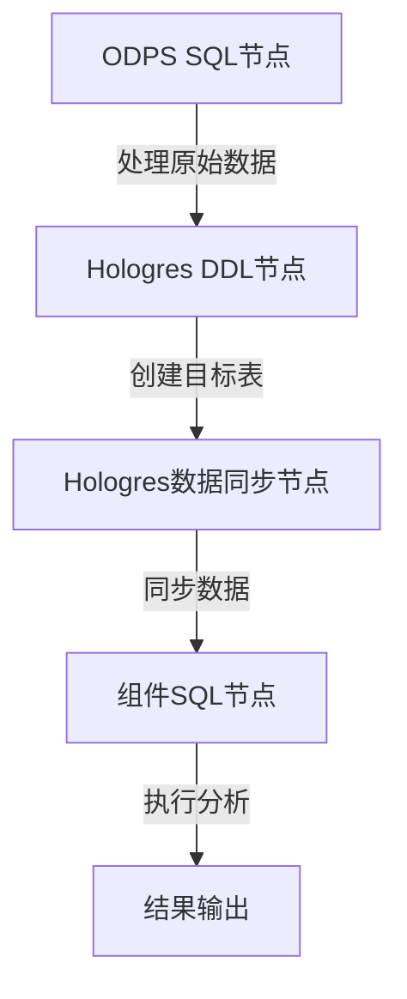

# SQL节点

<cite>
**本文档引用的文件**
- [odps-sql.md](file://docs/spec-templates/nodes/odps-sql.md)
- [component-sql.md](file://docs/spec-templates/nodes/component-sql.md)
- [hologres-sync-data.md](file://docs/spec-templates/nodes/hologres-sync-data.md)
- [hologres-sync-ddl.md](file://docs/spec-templates/nodes/hologres-sync-ddl.md)
- [SqlComponentCode.java](file://spec/src/main/java/com/aliyun/dataworks/common/spec/domain/dw/codemodel/SqlComponentCode.java)
- [ComponentSqlCode.java](file://spec/src/main/java/com/aliyun/dataworks/common/spec/domain/dw/codemodel/ComponentSqlCode.java)
- [CodeProgramType.java](file://spec/src/main/java/com/aliyun/dataworks/common/spec/domain/dw/types/CodeProgramType.java)
- [DefaultNodeTypeUtils.java](file://client/migrationx/migrationx-domain/migrationx-domain-dataworks/src/main/java/com/aliyun/dataworks/migrationx/domain/dataworks/utils/DefaultNodeTypeUtils.java)
- [dataworks-transformer-config-hologres-sample.json](file://client/migrationx/migrationx-transformer/src/main/conf/dataworks-transformer-config-hologres-sample.json)
</cite>

## 目录
1. [SQL节点概述](#sql节点概述)
2. [SQL节点类型体系](#sql节点类型体系)
3. [SqlComponentCode与ComponentSqlCode机制](#sqlcomponentcode与componentsqlcode机制)
4. [SQL节点特有属性](#sql节点特有属性)
5. [典型配置示例](#典型配置示例)
6. [使用场景](#使用场景)
7. [最佳实践与注意事项](#最佳实践与注意事项)

## SQL节点概述

SQL节点是DataWorks平台中用于执行SQL语句的核心组件，支持多种计算引擎和执行模式。这些节点在数据开发、数据处理和数据分析场景中扮演着关键角色，能够连接不同的数据源并执行相应的SQL操作。SQL节点不仅支持标准的SQL执行，还提供了组件化SQL执行能力，允许用户通过预定义的组件来执行复杂的SQL操作。

**本节来源**
- [odps-sql.md](file://docs/spec-templates/nodes/odps-sql.md)
- [component-sql.md](file://docs/spec-templates/nodes/component-sql.md)

## SQL节点类型体系

SQL节点根据不同的计算引擎和功能需求分为多种类型，每种类型对应特定的计算引擎和使用场景。

### ODPS SQL节点

ODPS SQL节点（CodeProgramType: ODPS_SQL, commandTypeId: 10）用于在MaxCompute计算引擎上执行SQL语句。这是DataWorks中最常用的节点类型之一，适用于大规模数据处理和分析任务。

- **计算引擎类型**: ODPS (MaxCompute)
- **语言**: odps-sql, sql
- **文件后缀**: .sql

### Hologres SQL节点

Hologres SQL节点支持在Hologres实例上执行SQL操作，主要分为两种类型：

#### Hologres数据同步节点 (HOLOGRES_SYNC_DATA)
- **CodeProgramType**: HOLOGRES_SYNC_DATA (commandTypeId: 800)
- **计算引擎类型**: HOLOGRES
- **用途**: 将数据从源端同步到Hologres实例，支持结构化和非结构化数据同步

#### Hologres DDL节点 (HOLOGRES_SYNC_DDL)
- **CodeProgramType**: HOLOGRES_SYNC_DDL (commandTypeId: 801)
- **计算引擎类型**: HOLOGRES
- **用途**: 在Hologres实例中执行数据定义语言(DDL)操作，如创建、修改或删除表结构

### 组件SQL节点

组件SQL节点(COMPONENT_SQL)是一种特殊类型的节点，通过预定义的组件来执行SQL查询，通常用于数据处理和分析场景。

- **CodeProgramType**: COMPONENT_SQL (commandTypeId: 1200)
- **计算引擎类型**: GENERAL
- **语言**: sql
- **文件后缀**: .sql

### 其他SQL相关节点类型

根据CodeProgramType枚举定义，系统还支持其他SQL相关的节点类型，包括：
- EMR_HIVE: 在EMR上执行Hive SQL
- CLICK_SQL: ClickHouse SQL执行
- FLINK_SQL: Flink SQL执行

**本节来源**
- [odps-sql.md](file://docs/spec-templates/nodes/odps-sql.md)
- [hologres-sync-data.md](file://docs/spec-templates/nodes/hologres-sync-data.md)
- [hologres-sync-ddl.md](file://docs/spec-templates/nodes/hologres-sync-ddl.md)
- [CodeProgramType.java](file://spec/src/main/java/com/aliyun/dataworks/common/spec/domain/dw/types/CodeProgramType.java)
- [DefaultNodeTypeUtils.java](file://client/migrationx/migrationx-domain/migrationx-domain-dataworks/src/main/java/com/aliyun/dataworks/migrationx/domain/dataworks/utils/DefaultNodeTypeUtils.java)

## SqlComponentCode与ComponentSqlCode机制

### SqlComponentCode

SqlComponentCode是用于表示组件SQL代码的模型类，负责解析和处理组件SQL节点的配置和代码内容。

- **主要功能**:
  - 解析JSON格式的组件配置
  - 管理组件的输入输出参数
  - 存储SQL代码内容
  - 处理资源引用

- **核心方法**:
  - `parse(String content)`: 解析JSON字符串并创建SqlComponentCode对象
  - `getSourceCode()`: 获取源代码内容
  - `setSourceCode(String sourceCode)`: 设置源代码内容

### ComponentSqlCode

ComponentSqlCode是用于处理组件SQL节点的代码模型，它在SqlComponentCode的基础上增加了参数替换功能。

- **主要功能**:
  - 继承SqlComponentCode的所有功能
  - 实现参数化SQL的动态替换
  - 将组件参数合并到SQL代码中

- **核心方法**:
  - `mergeSqlComponentParamsIntoCode()`: 将组件节点的参数合并到SQL代码中，并返回最终的代码内容
  - `renderCode(String code, List<SpecComponentParameter> parameters)`: 执行参数替换，将`@@{param}`格式的占位符替换为实际参数值

- **参数替换机制**:
  - 使用`@@{param_name}`语法在SQL代码中定义参数占位符
  - 在执行时，系统会自动将配置中的参数值替换到相应位置
  - 支持输入参数和输出参数的双向绑定

**本节来源**
- [SqlComponentCode.java](file://spec/src/main/java/com/aliyun/dataworks/common/spec/domain/dw/codemodel/SqlComponentCode.java)
- [ComponentSqlCode.java](file://spec/src/main/java/com/aliyun/dataworks/common/spec/domain/dw/codemodel/ComponentSqlCode.java)
- [component-sql.md](file://docs/spec-templates/nodes/component-sql.md)

## SQL节点特有属性

### 计算引擎类型

SQL节点通过CalcEngineType指定其运行的计算引擎，不同引擎对应不同的执行环境和能力。

- **ODPS**: MaxCompute计算引擎，适用于大规模批处理
- **HOLO**: Hologres计算引擎，适用于实时分析
- **EMR**: EMR计算引擎，支持Hive、Spark等
- **BLINK**: Flink计算引擎，适用于流式计算

### SQL脚本内容

SQL脚本内容是SQL节点的核心，包含实际要执行的SQL语句。

- **script.path**: SQL脚本的存储路径
- **script.content**: SQL脚本的直接内容
- **language**: 脚本语言类型，如odps-sql、sql等

### 参数配置

SQL节点支持丰富的参数配置，以实现灵活的执行控制。

#### 通用参数
- **recurrence**: 调度周期类型
- **priority**: 执行优先级
- **timeout**: 超时时间（秒）
- **instanceMode**: 实例模式（如T+1）
- **rerunMode**: 重跑模式

#### 引擎特定参数
- **MaxCompute参数**:
  - odps.sql.mapper.split.size: Mapper split大小
  - odps.sql.reducer.instances: Reducer实例数
  - odps.sql.jobconf.odps2: 启用MaxCompute 2.0
  - odps.optimizer.enable.ppd: 启用谓词下推优化

- **Hologres参数**:
  - connectionId: 连接ID
  - databaseName: 数据库名称
  - syncType: 同步类型

#### 组件参数
- **输入参数**: 定义组件的输入参数，包括名称、类型和默认值
- **输出参数**: 定义组件的输出参数，包括名称和类型
- **参数替换**: 使用`@@{param}`语法在SQL中引用参数

### 输入输出配置

SQL节点支持明确的输入输出定义，以实现数据依赖管理。

- **inputs.tables**: 输入表列表，定义数据源
- **outputs.tables**: 输出表列表，定义数据目标
- **inputs.variables**: 输入变量，用于参数传递
- **outputs.nodeOutputs**: 节点输出，用于下游依赖

**本节来源**
- [odps-sql.md](file://docs/spec-templates/nodes/odps-sql.md)
- [hologres-sync-data.md](file://docs/spec-templates/nodes/hologres-sync-data.md)
- [hologres-sync-ddl.md](file://docs/spec-templates/nodes/hologres-sync-ddl.md)
- [component-sql.md](file://docs/spec-templates/nodes/component-sql.md)

## 典型配置示例

### ODPS SQL节点配置

```json
{
  "id": "node_odps_sql_001",
  "name": "daily_data_aggregation",
  "recurrence": "Normal",
  "priority": 5,
  "timeout": 3600,
  "instanceMode": "T+1",
  "rerunMode": "Allowed",
  "script": {
    "path": "/业务流程/数据开发/daily_aggregation.sql",
    "language": "odps-sql",
    "runtime": {
      "engine": "MaxCompute",
      "command": "ODPS_SQL",
      "commandTypeId": 10,
      "maxComputeConf": {
        "odps.sql.mapper.split.size": "256",
        "odps.sql.reducer.instances": "100"
      }
    },
    "parameters": [
      "{{variables.bizdate}}",
      "{{variables.region}}"
    ]
  },
  "datasource": {
    "name": "odps_first",
    "type": "odps"
  }
}
```

### 组件SQL节点配置

```json
{
  "version": "1.1.0",
  "kind": "CycleWorkflow",
  "spec": {
    "nodes": [
      {
        "recurrence": "Normal",
        "id": "component_sql_1",
        "instanceMode": "T+1",
        "rerunMode": "Allowed",
        "component": {
          "id": "121212",
          "inputs": [
            {
              "name": "in1",
              "value": "va1"
            }
          ],
          "outputs": [
            {
              "name": "out1",
              "value": "va1"
            }
          ]
        },
        "script": {
          "path": "path/to/component_sql",
          "runtime": {
            "command": "COMPONENT_SQL"
          },
          "content": "select @@{in1}"
        },
        "name": "Component SQL Node"
      }
    ]
  }
}
```

### Hologres数据同步节点配置

```json
{
  "version": "1.1.0",
  "kind": "CycleWorkflow",
  "spec": {
    "nodes": [
      {
        "recurrence": "Normal",
        "id": "hologres_sync_1",
        "instanceMode": "T+1",
        "script": {
          "runtime": {
            "command": "HOLOGRES_SYNC_DATA"
          },
          "content": {
            "content": "IMPORT FOREIGN SCHEMA...",
            "extraContent": "{\"connId\":\"yongxunqa_holo_shanghai\",\"dbName\":\"yongxunqa_hologres_db\"}"
          }
        },
        "name": "Hologres Sync Node"
      }
    ]
  }
}
```

**本节来源**
- [odps-sql.md](file://docs/spec-templates/nodes/odps-sql.md)
- [component-sql.md](file://docs/spec-templates/nodes/component-sql.md)
- [hologres-sync-data.md](file://docs/spec-templates/nodes/hologres-sync-data.md)

## 使用场景

### 日常调度工作流

在日常调度工作流中，SQL节点通常用于周期性数据处理任务。

- **ODPS SQL节点**: 执行每日数据聚合、报表生成等批处理任务
- **Hologres DDL节点**: 在工作流开始前创建或修改表结构
- **Hologres数据同步节点**: 将处理后的数据从ODPS同步到Hologres进行实时分析

### 手动执行工作流

手动执行工作流适用于临时数据处理或调试场景。

- **组件SQL节点**: 执行预定义的数据处理组件，支持参数化输入
- **ODPS SQL节点**: 执行临时查询或数据修复操作
- **Hologres DDL节点**: 执行紧急的表结构变更

### 混合工作流

在复杂的混合工作流中，多种SQL节点协同工作。



**图示来源**
- [odps-sql.md](file://docs/spec-templates/nodes/odps-sql.md)
- [hologres-sync-data.md](file://docs/spec-templates/nodes/hologres-sync-data.md)
- [hologres-sync-ddl.md](file://docs/spec-templates/nodes/hologres-sync-ddl.md)
- [component-sql.md](file://docs/spec-templates/nodes/component-sql.md)

**本节来源**
- [odps-sql.md](file://docs/spec-templates/nodes/odps-sql.md)
- [hologres-sync-data.md](file://docs/spec-templates/nodes/hologres-sync-data.md)
- [hologres-sync-ddl.md](file://docs/spec-templates/nodes/hologres-sync-ddl.md)
- [component-sql.md](file://docs/spec-templates/nodes/component-sql.md)

## 最佳实践与注意事项

### 最佳实践

1. **参数化设计**: 使用变量参数化日期、区域等动态值，提高SQL的复用性
2. **性能优化**:
   - 合理设置`odps.sql.mapper.split.size`和`odps.sql.reducer.instances`
   - 启用PPD(谓词下推)优化
   - 使用MapJoin优化小表关联
3. **资源隔离**: 生产环境使用专用资源组(runtimeResource)
4. **超时设置**: 根据SQL复杂度合理设置timeout，建议3600-7200秒
5. **组件复用**: 设计通用的组件以在多个工作流中复用

### 注意事项

1. **语法差异**: MaxCompute SQL语法与标准SQL有差异，需参考官方文档
2. **分区管理**: 分区字段不能在SELECT列表中
3. **数据类型兼容性**: `odps.sql.jobconf.odps2`开启后需注意数据类型兼容性
4. **权限管理**: DDL操作可能需要较高的权限
5. **执行时机**: DDL操作可能影响正在运行的查询，需要在低峰期执行
6. **参数引用**: 组件SQL节点的SQL语句中使用`@@{param}`语法来引用输入参数
7. **配置一致性**: 确保组件的输入输出参数定义与实际使用的一致

**本节来源**
- [odps-sql.md](file://docs/spec-templates/nodes/odps-sql.md)
- [hologres-sync-data.md](file://docs/spec-templates/nodes/hologres-sync-data.md)
- [hologres-sync-ddl.md](file://docs/spec-templates/nodes/hologres-sync-ddl.md)
- [component-sql.md](file://docs/spec-templates/nodes/component-sql.md)