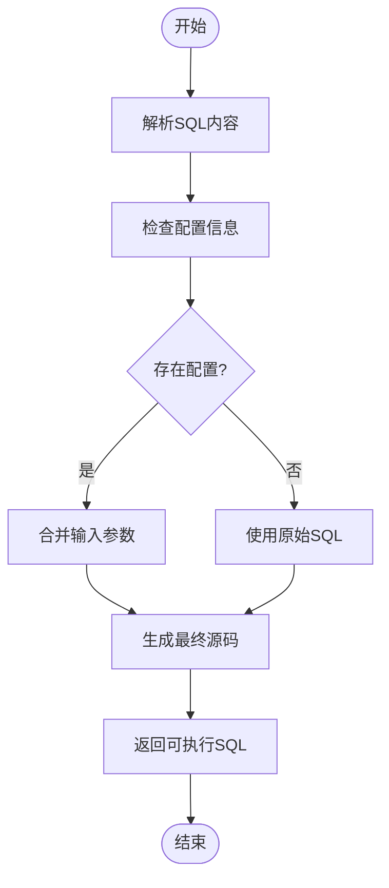
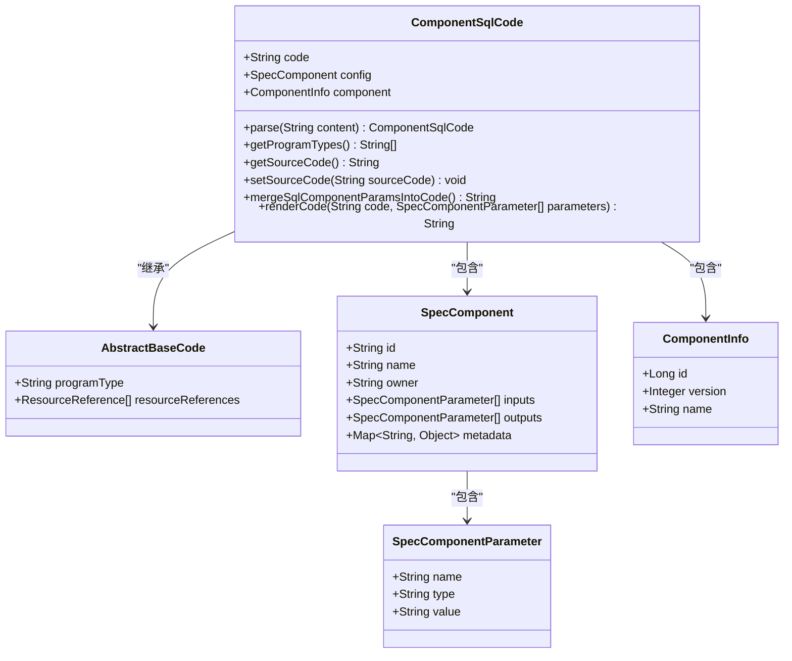
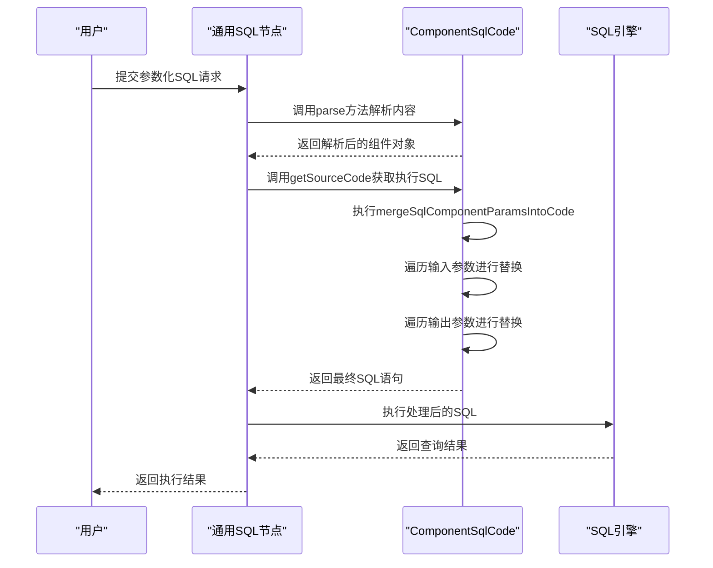

# 通用SQL节点

<cite>
**本文档引用的文件**  
- [ComponentSqlCode.java](file://spec/src/main/java/com/aliyun/dataworks/common/spec/domain/dw/codemodel/ComponentSqlCode.java)
- [SqlComponentCode.java](file://spec/src/main/java/com/aliyun/dataworks/common/spec/domain/dw/codemodel/SqlComponentCode.java)
- [component-sql.md](file://docs/spec-templates/nodes/component-sql.md)
- [node.schema.json](file://schema/node.schema.json)
- [CodeProgramType.java](file://spec/src/main/java/com/aliyun/dataworks/common/spec/domain/dw/types/CodeProgramType.java)
</cite>

## 目录
1. [概述](#概述)
2. [核心实现机制](#核心实现机制)
3. [ComponentSqlCode类详解](#componentsqlcode类详解)
4. [参数化查询支持](#参数化查询支持)
5. [配置示例](#配置示例)
6. [安全考虑](#安全考虑)
7. [最佳实践](#最佳实践)

## 概述

通用SQL节点（COMPONENT_SQL）是一种特殊类型的工作流节点，用于执行SQL查询操作。该节点通过预定义的组件机制实现SQL执行，支持多种数据库类型的SQL执行，包括MySQL、PostgreSQL等。通用SQL节点在数据处理和分析场景中广泛应用，能够简化复杂SQL查询的参数化配置，并支持在多个工作流中复用标准化的数据处理组件。

通用SQL节点的关键特性包括：
- 支持参数化SQL查询
- 可扩展的组件框架设计
- 多数据库类型支持
- 安全的SQL执行环境
- 灵活的连接配置管理

**Section sources**
- [component-sql.md](file://docs/spec-templates/nodes/component-sql.md#L1-L118)

## 核心实现机制

通用SQL节点的核心实现基于ComponentSqlCode类构建的通用SQL执行框架。该框架采用组件化设计，通过CodeModelFactory工厂模式创建和管理SQL组件实例。执行流程主要包括代码解析、参数合并和源码生成三个阶段。

当通用SQL节点被触发执行时，系统首先通过CodeModelFactory根据COMPONENT_SQL类型标识获取对应的CodeModel实例。然后，框架调用ComponentSqlCode的parse方法解析SQL内容，将JSON格式的配置信息转换为Java对象模型。最后，通过getSourceCode方法获取最终执行的SQL源码，该方法会自动将配置中的输入参数值替换到SQL语句中的占位符位置。



**Diagram sources**
- [ComponentSqlCode.java](file://spec/src/main/java/com/aliyun/dataworks/common/spec/domain/dw/codemodel/ComponentSqlCode.java#L80-L125)

**Section sources**
- [ComponentSqlCode.java](file://spec/src/main/java/com/aliyun/dataworks/common/spec/domain/dw/codemodel/ComponentSqlCode.java#L1-L126)

## ComponentSqlCode类详解

ComponentSqlCode类是通用SQL节点的核心实现类，继承自AbstractBaseCode，提供了完整的SQL组件功能。该类的设计体现了高度的可扩展性，通过接口抽象和工厂模式支持未来新增的SQL组件类型。

类的主要属性包括：
- `code`: 存储原始SQL语句
- `config`: 包含输入输出参数配置的SpecComponent对象
- `component`: 组件元信息，包含组件ID、版本和名称

ComponentSqlCode类实现了关键的参数合并功能，通过mergeSqlComponentParamsIntoCode方法将配置中的参数值替换到SQL语句的占位符中。占位符采用`@@{param}`语法格式，系统会遍历输入和输出参数列表，逐个进行字符串替换。该实现使用了Apache Commons库的StringUtils工具类，确保替换操作的高效性和安全性。



**Diagram sources**
- [ComponentSqlCode.java](file://spec/src/main/java/com/aliyun/dataworks/common/spec/domain/dw/codemodel/ComponentSqlCode.java#L44-L125)

**Section sources**
- [ComponentSqlCode.java](file://spec/src/main/java/com/aliyun/dataworks/common/spec/domain/dw/codemodel/ComponentSqlCode.java#L44-L125)

## 参数化查询支持

通用SQL节点通过ComponentSqlCode类的参数化机制支持动态SQL查询。参数化查询的核心是`@@{param}`占位符语法，允许在SQL语句中定义可变参数。系统在执行前会自动将配置中的参数值替换到对应位置，实现SQL语句的动态化。

参数化查询支持两种类型的参数：输入参数（input）和输出参数（output）。输入参数用于向SQL语句传递值，通常用于WHERE条件、INSERT VALUES等场景；输出参数用于定义查询结果的处理方式，可用于后续节点的数据传递。

参数替换的执行流程如下：
1. 获取原始SQL语句
2. 遍历输入参数列表，逐个替换`@@{paramName}`占位符
3. 遍历输出参数列表，替换相应的占位符
4. 返回合并参数后的最终SQL语句

该机制不仅提高了SQL语句的灵活性，还增强了安全性，通过预定义的参数替换避免了直接字符串拼接可能带来的SQL注入风险。



**Diagram sources**
- [ComponentSqlCode.java](file://spec/src/main/java/com/aliyun/dataworks/common/spec/domain/dw/codemodel/ComponentSqlCode.java#L101-L124)
- [SqlComponentCode.java](file://spec/src/main/java/com/aliyun/dataworks/common/spec/domain/dw/codemodel/SqlComponentCode.java#L74-L107)

**Section sources**
- [ComponentSqlCode.java](file://spec/src/main/java/com/aliyun/dataworks/common/spec/domain/dw/codemodel/ComponentSqlCode.java#L101-L124)
- [component-sql.md](file://docs/spec-templates/nodes/component-sql.md#L114-L118)

## 配置示例

以下是一个完整的通用SQL节点配置示例，展示了不同数据库类型的连接配置和预编译语句的使用方法。

```json
{
  "version": "1.1.0",
  "kind": "CycleWorkflow",
  "spec": {
    "nodes": [
      {
        "recurrence": "Normal",
        "id": "mysql_sql_node",
        "instanceMode": "T+1",
        "rerunMode": "Allowed",
        "script": {
          "path": "path/to/mysql_query.sql",
          "runtime": {
            "command": "COMPONENT_SQL"
          },
          "content": "SELECT * FROM users WHERE status = @@{status} AND created_date >= @@{start_date}"
        },
        "component": {
          "id": "121212",
          "inputs": [
            {
              "name": "status",
              "value": "active"
            },
            {
              "name": "start_date",
              "value": "2024-01-01"
            }
          ]
        },
        "name": "MySQL查询节点",
        "owner": "owner_id"
      },
      {
        "recurrence": "Normal",
        "id": "postgresql_sql_node",
        "instanceMode": "T+1",
        "rerunMode": "Allowed",
        "script": {
          "path": "path/to/postgresql_query.sql",
          "runtime": {
            "command": "COMPONENT_SQL"
          },
          "content": "WITH recent_orders AS (SELECT * FROM orders WHERE order_date >= @@{from_date}) SELECT u.name, COUNT(o.id) FROM users u JOIN recent_orders o ON u.id = o.user_id GROUP BY u.name"
        },
        "component": {
          "id": "121213",
          "inputs": [
            {
              "name": "from_date",
              "value": "2024-01-01"
            }
          ]
        },
        "name": "PostgreSQL查询节点",
        "owner": "owner_id"
      }
    ]
  }
}
```

在上述示例中，MySQL节点使用简单的WHERE条件参数化查询，而PostgreSQL节点展示了更复杂的CTE（公用表表达式）与参数化结合的用法。两个节点都通过component.inputs配置定义了参数名称和值，系统会自动将这些值替换到SQL语句中的`@@{param}`占位符位置。

**Section sources**
- [component-sql.md](file://docs/spec-templates/nodes/component-sql.md#L14-L75)

## 安全考虑

通用SQL节点在设计时充分考虑了安全性，特别是在防止SQL注入攻击方面采取了多项措施。首先，系统采用参数化查询机制，通过预定义的参数替换而非字符串拼接来构建SQL语句，从根本上避免了SQL注入的风险。

其次，ComponentSqlCode类在实现参数替换时使用了安全的字符串处理方法，确保特殊字符被正确处理。系统还限制了占位符的语法格式为`@@{param}`，不允许其他形式的动态内容插入，进一步增强了安全性。

连接池管理方面，通用SQL节点通过标准化的连接配置机制实现资源的有效管理。系统支持连接超时设置、最大连接数限制等配置选项，防止资源耗尽问题。同时，连接信息采用加密存储，确保敏感数据的安全性。

此外，系统还实现了错误处理机制，在参数替换过程中捕获异常并记录错误日志，避免因配置错误导致系统崩溃。所有SQL执行操作都在受控的环境中进行，确保即使出现异常也不会影响整个工作流的稳定性。

**Section sources**
- [ComponentSqlCode.java](file://spec/src/main/java/com/aliyun/dataworks/common/spec/domain/dw/codemodel/ComponentSqlCode.java#L120-L124)
- [component-sql.md](file://docs/spec-templates/nodes/component-sql.md#L114-L118)

## 最佳实践

使用通用SQL节点时，建议遵循以下最佳实践以确保高效、安全的SQL执行：

1. **参数化设计**：始终使用`@@{param}`语法进行参数化查询，避免直接在SQL语句中硬编码值。这不仅提高了SQL的可重用性，还增强了安全性。

2. **组件复用**：设计通用的SQL组件以便在多个工作流中复用。通过定义标准化的输入输出参数，可以创建可复用的数据处理组件。

3. **错误处理**：在组件配置中考虑潜在的数据异常情况，合理设置默认值和边界条件。建议在关键节点添加适当的错误处理逻辑。

4. **性能优化**：对于复杂的SQL查询，建议使用EXPLAIN分析执行计划，优化查询性能。合理使用索引和适当的查询结构可以显著提升执行效率。

5. **连接管理**：合理配置连接池参数，根据实际负载情况设置合适的最大连接数和超时时间。避免创建过多的数据库连接导致资源浪费。

6. **版本控制**：为SQL组件设置明确的版本号，便于追踪变更历史和回滚操作。建议在生产环境中使用经过充分测试的稳定版本。

7. **文档化**：为每个SQL组件编写清晰的文档，说明其功能、输入输出参数含义以及使用场景。良好的文档有助于团队协作和知识传承。

遵循这些最佳实践可以帮助用户更有效地利用通用SQL节点的功能，构建稳定、高效的数据处理工作流。

**Section sources**
- [component-sql.md](file://docs/spec-templates/nodes/component-sql.md#L108-L113)