# 节点类型系统

<cite>
**本文档引用的文件**  
- [node.schema.json](file://schema/node.schema.json)
- [SpecNode.schema.json](file://spec/src/main/resources/spec/schema/SpecNode.schema.json)
- [CodeProgramType.java](file://spec/src/main/java/com/aliyun/dataworks/common/spec/domain/dw/types/CodeProgramType.java)
- [CalcEngineType.java](file://spec/src/main/java/com/aliyun/dataworks/common/spec/domain/dw/types/CalcEngineType.java)
- [CodeModel.java](file://spec/src/main/java/com/aliyun/dataworks/common/spec/domain/dw/codemodel/CodeModel.java)
- [CodeModelFactory.java](file://spec/src/main/java/com/aliyun/dataworks/common/spec/domain/dw/codemodel/CodeModelFactory.java)
- [EmrCode.java](file://spec/src/main/java/com/aliyun/dataworks/common/spec/domain/dw/codemodel/EmrCode.java)
- [PaiCode.java](file://spec/src/main/java/com/aliyun/dataworks/common/spec/domain/dw/codemodel/PaiCode.java)
- [SqlComponentCode.java](file://spec/src/main/java/com/aliyun/dataworks/common/spec/domain/dw/codemodel/SqlComponentCode.java)
- [DataIntegrationCode.java](file://spec/src/main/java/com/aliyun/dataworks/common/spec/domain/dw/codemodel/DataIntegrationCode.java)
- [DefaultNodeTypeUtils.java](file://client/migrationx/migrationx-domain/migrationx-domain-dataworks/src/main/java/com/aliyun/dataworks/migrationx/domain/dataworks/utils/DefaultNodeTypeUtils.java)
- [EmrNodeSpecHandler.java](file://client/migrationx/migrationx-domain/migrationx-domain-dataworks/src/main/java/com/aliyun/dataworks/migrationx/domain/dataworks/service/spec/handler/EmrNodeSpecHandler.java)
- [BasicNodeSpecHandler.java](file://client/migrationx/migrationx-domain/migrationx-domain-dataworks/src/main/java/com/aliyun/dataworks/migrationx/domain/dataworks/service/spec/handler/BasicNodeSpecHandler.java)
- [NodeSpecAdapter.java](file://client/migrationx/migrationx-domain/migrationx-domain-dataworks/src/main/java/com/aliyun/dataworks/migrationx/domain/dataworks/service/spec/NodeSpecAdapter.java)
</cite>

## 目录
1. [节点类型系统概述](#节点类型系统概述)
2. [节点类型分类体系](#节点类型分类体系)
3. [CodeModel抽象在节点类型实现中的核心作用](#codemodel抽象在节点类型实现中的核心作用)
4. [通过代码模型扩展新的节点类型](#通过代码模型扩展新的节点类型)
5. [不同节点类型的特有属性和配置要求](#不同节点类型的特有属性和配置要求)
6. [各类节点的典型配置示例和使用场景](#各类节点的典型配置示例和使用场景)

## 节点类型系统概述

dataworks-spec项目的节点类型系统是一个基于CodeModel抽象的可扩展架构，用于定义和管理各种数据处理节点。该系统通过CodeProgramType枚举定义了所有支持的节点类型，并通过CodeModel工厂模式实现节点类型的动态解析和处理。节点类型系统不仅支持SQL、EMR、PAI、DataX等核心数据处理节点，还支持各种控制流节点和资源节点。

**节点类型系统的核心特点包括**：
- 基于CodeModel抽象的统一接口
- 通过反射机制实现的动态节点类型发现
- 支持多种计算引擎和程序类型的灵活配置
- 可扩展的架构设计，便于添加新的节点类型

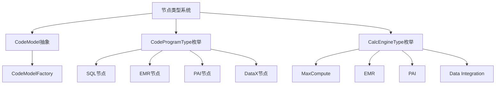

**图表来源**
- [CodeModel.java](file://spec/src/main/java/com/aliyun/dataworks/common/spec/domain/dw/codemodel/CodeModel.java)
- [CodeProgramType.java](file://spec/src/main/java/com/aliyun/dataworks/common/spec/domain/dw/types/CodeProgramType.java)
- [CalcEngineType.java](file://spec/src/main/java/com/aliyun/dataworks/common/spec/domain/dw/types/CalcEngineType.java)

**本节来源**
- [CodeModel.java](file://spec/src/main/java/com/aliyun/dataworks/common/spec/domain/dw/codemodel/CodeModel.java)
- [CodeProgramType.java](file://spec/src/main/java/com/aliyun/dataworks/common/spec/domain/dw/types/CodeProgramType.java)

## 节点类型分类体系

dataworks-spec项目的节点类型系统通过CodeProgramType枚举实现了完整的分类体系。该分类体系基于计算引擎类型、程序类型和语言类型三个维度进行组织，确保了节点类型的清晰分类和高效识别。

### 计算引擎类型分类

节点类型首先按照计算引擎类型进行分类，主要计算引擎类型包括：

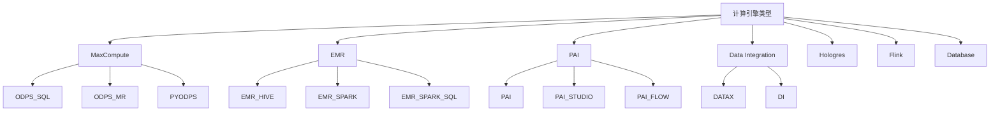

**图表来源**
- [CalcEngineType.java](file://spec/src/main/java/com/aliyun/dataworks/common/spec/domain/dw/types/CalcEngineType.java)
- [CodeProgramType.java](file://spec/src/main/java/com/aliyun/dataworks/common/spec/domain/dw/types/CodeProgramType.java)

### 程序类型分类

在计算引擎类型的基础上，节点类型进一步按照程序类型进行分类。程序类型主要分为数据处理、资源、函数、表等类别：

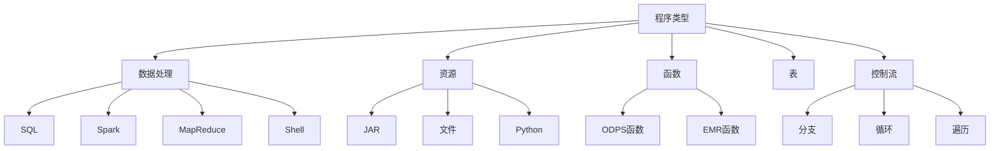

**图表来源**
- [CodeProgramType.java](file://spec/src/main/java/com/aliyun/dataworks/common/spec/domain/dw/types/CodeProgramType.java)
- [DefaultNodeTypeUtils.java](file://client/migrationx/migrationx-domain/migrationx-domain-dataworks/src/main/java/com/aliyun/dataworks/migrationx/domain/dataworks/utils/DefaultNodeTypeUtils.java)

### 节点类型识别机制

节点类型的识别机制主要通过CodeProgramType枚举的静态方法实现。系统提供了多种识别方式，包括按名称识别、按代码识别和按计算引擎识别：

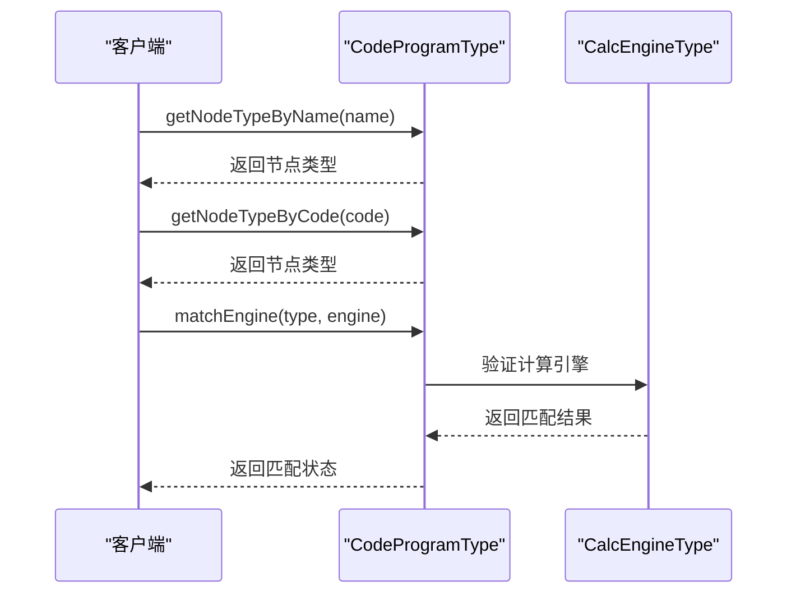

**图表来源**
- [CodeProgramType.java](file://spec/src/main/java/com/aliyun/dataworks/common/spec/domain/dw/types/CodeProgramType.java)
- [CalcEngineType.java](file://spec/src/main/java/com/aliyun/dataworks/common/spec/domain/dw/types/CalcEngineType.java)

**本节来源**
- [CodeProgramType.java](file://spec/src/main/java/com/aliyun/dataworks/common/spec/domain/dw/types/CodeProgramType.java)
- [CalcEngineType.java](file://spec/src/main/java/com/aliyun/dataworks/common/spec/domain/dw/types/CalcEngineType.java)
- [DefaultNodeTypeUtils.java](file://client/migrationx/migrationx-domain/migrationx-domain-dataworks/src/main/java/com/aliyun/dataworks/migrationx/domain/dataworks/utils/DefaultNodeTypeUtils.java)

## CodeModel抽象在节点类型实现中的核心作用

CodeModel抽象是dataworks-spec项目节点类型系统的核心，它提供了一个统一的接口来处理各种不同类型的节点。通过CodeModel抽象，系统能够以一致的方式解析、处理和序列化各种节点类型，实现了节点类型处理的解耦和可扩展性。

### CodeModel抽象的架构设计

CodeModel抽象的架构设计基于模板方法模式和策略模式，通过继承和组合的方式实现不同节点类型的处理：

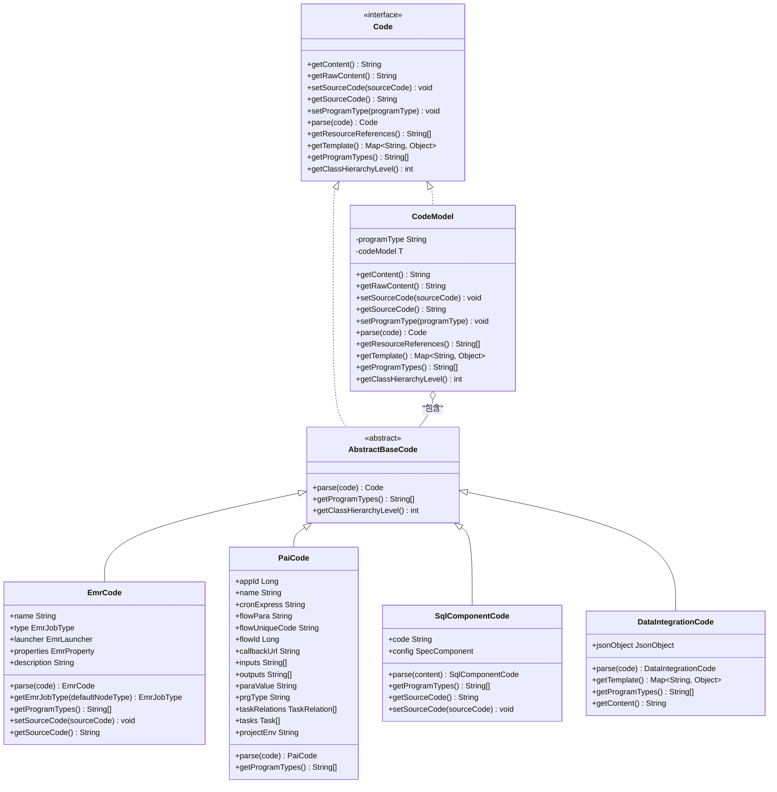

**图表来源**
- [Code.java](file://spec/src/main/java/com/aliyun/dataworks/common/spec/domain/dw/codemodel/Code.java)
- [CodeModel.java](file://spec/src/main/java/com/aliyun/dataworks/common/spec/domain/dw/codemodel/CodeModel.java)
- [AbstractBaseCode.java](file://spec/src/main/java/com/aliyun/dataworks/common/spec/domain/dw/codemodel/AbstractBaseCode.java)
- [EmrCode.java](file://spec/src/main/java/com/aliyun/dataworks/common/spec/domain/dw/codemodel/EmrCode.java)
- [PaiCode.java](file://spec/src/main/java/com/aliyun/dataworks/common/spec/domain/dw/codemodel/PaiCode.java)
- [SqlComponentCode.java](file://spec/src/main/java/com/aliyun/dataworks/common/spec/domain/dw/codemodel/SqlComponentCode.java)
- [DataIntegrationCode.java](file://spec/src/main/java/com/aliyun/dataworks/common/spec/domain/dw/codemodel/DataIntegrationCode.java)

### CodeModel抽象的核心功能

CodeModel抽象提供了以下核心功能：

1. **统一的接口定义**：通过Code接口定义了所有节点类型必须实现的通用方法
2. **类型安全的封装**：通过泛型T实现了类型安全的代码模型封装
3. **委托模式**：通过codeModel字段将具体操作委托给具体的代码实现类
4. **空值安全**：通过Optional.ofNullable确保空值安全的操作

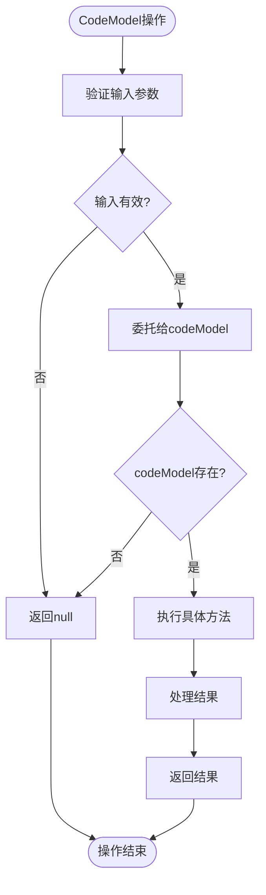

**图表来源**
- [CodeModel.java](file://spec/src/main/java/com/aliyun/dataworks/common/spec/domain/dw/codemodel/CodeModel.java)

**本节来源**
- [CodeModel.java](file://spec/src/main/java/com/aliyun/dataworks/common/spec/domain/dw/codemodel/CodeModel.java)
- [Code.java](file://spec/src/main/java/com/aliyun/dataworks/common/spec/domain/dw/codemodel/Code.java)

## 通过代码模型扩展新的节点类型

dataworks-spec项目提供了灵活的机制来扩展新的节点类型。通过CodeModelFactory和反射机制，系统能够自动发现和注册新的节点类型实现，实现了高度可扩展的架构设计。

### 节点类型扩展机制

节点类型扩展机制的核心是CodeModelFactory类，它使用反射机制扫描所有Code的子类，并根据支持的程序类型进行注册：

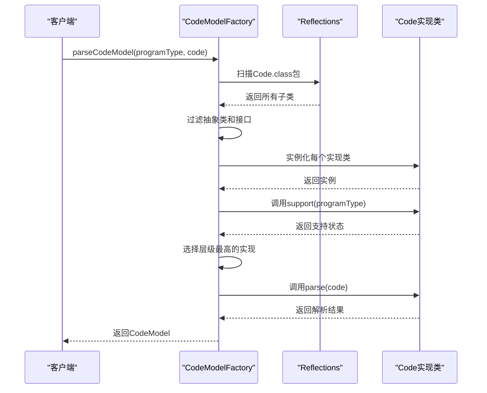

**图表来源**
- [CodeModelFactory.java](file://spec/src/main/java/com/aliyun/dataworks/common/spec/domain/dw/codemodel/CodeModelFactory.java)

### 扩展新节点类型的步骤

要扩展新的节点类型，需要遵循以下步骤：

1. **创建新的Code实现类**：继承AbstractBaseCode或实现Code接口
2. **实现parse方法**：定义如何解析该节点类型的代码内容
3. **实现getProgramTypes方法**：返回该实现支持的程序类型
4. **实现support方法**：定义该实现支持的程序类型判断逻辑

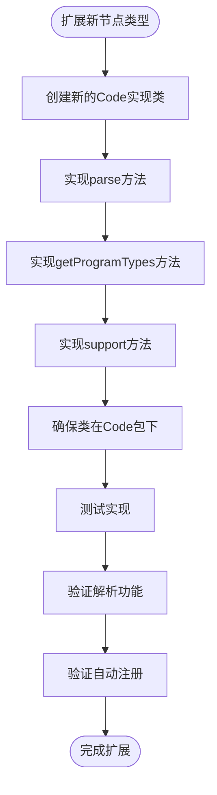

**图表来源**
- [CodeModelFactory.java](file://spec/src/main/java/com/aliyun/dataworks/common/spec/domain/dw/codemodel/CodeModelFactory.java)
- [AbstractBaseCode.java](file://spec/src/main/java/com/aliyun/dataworks/common/spec/domain/dw/codemodel/AbstractBaseCode.java)

### 节点类型处理器机制

除了CodeModel扩展机制，系统还提供了NodeSpecAdapter和BasicNodeSpecHandler机制来处理节点类型的业务逻辑：

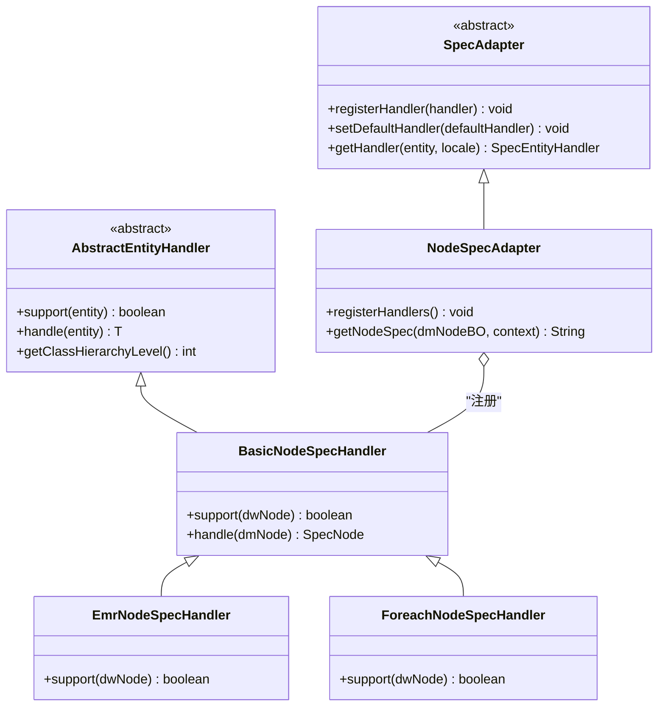

**图表来源**
- [NodeSpecAdapter.java](file://client/migrationx/migrationx-domain/migrationx-domain-dataworks/src/main/java/com/aliyun/dataworks/migrationx/domain/dataworks/service/spec/NodeSpecAdapter.java)
- [BasicNodeSpecHandler.java](file://client/migrationx/migrationx-domain/migrationx-domain-dataworks/src/main/java/com/aliyun/dataworks/migrationx/domain/dataworks/service/spec/handler/BasicNodeSpecHandler.java)
- [EmrNodeSpecHandler.java](file://client/migrationx/migrationx-domain/migrationx-domain-dataworks/src/main/java/com/aliyun/dataworks/migrationx/domain/dataworks/service/spec/handler/EmrNodeSpecHandler.java)

**本节来源**
- [CodeModelFactory.java](file://spec/src/main/java/com/aliyun/dataworks/common/spec/domain/dw/codemodel/CodeModelFactory.java)
- [NodeSpecAdapter.java](file://client/migrationx/migrationx-domain/migrationx-domain-dataworks/src/main/java/com/aliyun/dataworks/migrationx/domain/dataworks/service/spec/NodeSpecAdapter.java)
- [BasicNodeSpecHandler.java](file://client/migrationx/migrationx-domain/migrationx-domain-dataworks/src/main/java/com/aliyun/dataworks/migrationx/domain/dataworks/service/spec/handler/BasicNodeSpecHandler.java)

## 不同节点类型的特有属性和配置要求

dataworks-spec项目中的不同节点类型具有各自的特有属性和配置要求。这些属性和要求通过CodeProgramType枚举和相应的Code实现类来定义和管理。

### SQL节点的特有属性

SQL节点是dataworks-spec中最常用的节点类型之一，主要包括ODPS SQL、EMR SQL、CDH SQL等。这些节点的特有属性包括：

```mermaid
erDiagram
SQL_NODE {
string programType PK
string calcEngineType FK
string labelType
string extension
string code
string datasource
string database
string schema
}
CALC_ENGINE_TYPE {
int value PK
string name
string nameCn
}
SQL_NODE ||--o{ CALC_ENGINE_TYPE : "使用"
class SQL_NODE "SQL节点"
class CALC_ENGINE_TYPE "计算引擎类型"
```

**图表来源**
- [CodeProgramType.java](file://spec/src/main/java/com/aliyun/dataworks/common/spec/domain/dw/types/CodeProgramType.java)
- [CalcEngineType.java](file://spec/src/main/java/com/aliyun/dataworks/common/spec/domain/dw/types/CalcEngineType.java)

### EMR节点的特有属性

EMR节点用于处理EMR集群上的各种作业，包括Hive、Spark、MapReduce等。这些节点的特有属性通过EmrCode类来定义：

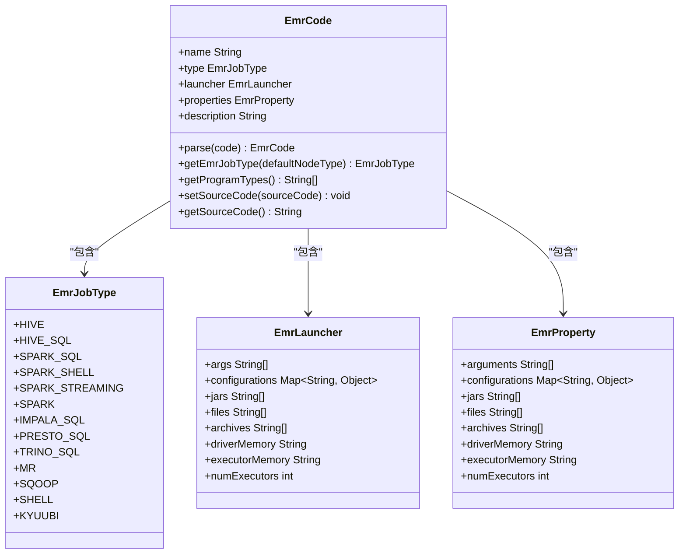

**图表来源**
- [EmrCode.java](file://spec/src/main/java/com/aliyun/dataworks/common/spec/domain/dw/codemodel/EmrCode.java)
- [EmrJobType.java](file://spec/src/main/java/com/aliyun/dataworks/common/spec/domain/dw/codemodel/EmrJobType.java)
- [EmrLauncher.java](file://spec/src/main/java/com/aliyun/dataworks/common/spec/domain/dw/codemodel/EmrLauncher.java)
- [EmrProperty.java](file://spec/src/main/java/com/aliyun/dataworks/common/spec/domain/dw/codemodel/EmrProperty.java)

### PAI节点的特有属性

PAI节点用于处理机器学习和算法相关的作业，包括PAI、PAI_STUDIO、PAI_FLOW等。这些节点的特有属性通过PaiCode类来定义：

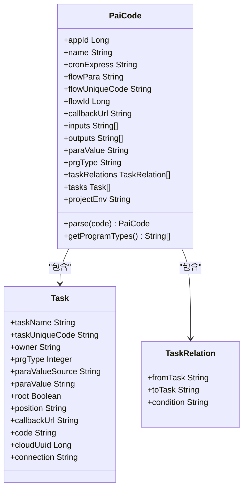

**图表来源**
- [PaiCode.java](file://spec/src/main/java/com/aliyun/dataworks/common/spec/domain/dw/codemodel/PaiCode.java)

### DataX节点的特有属性

DataX节点用于处理数据集成任务，其特有属性通过DataIntegrationCode类来定义：

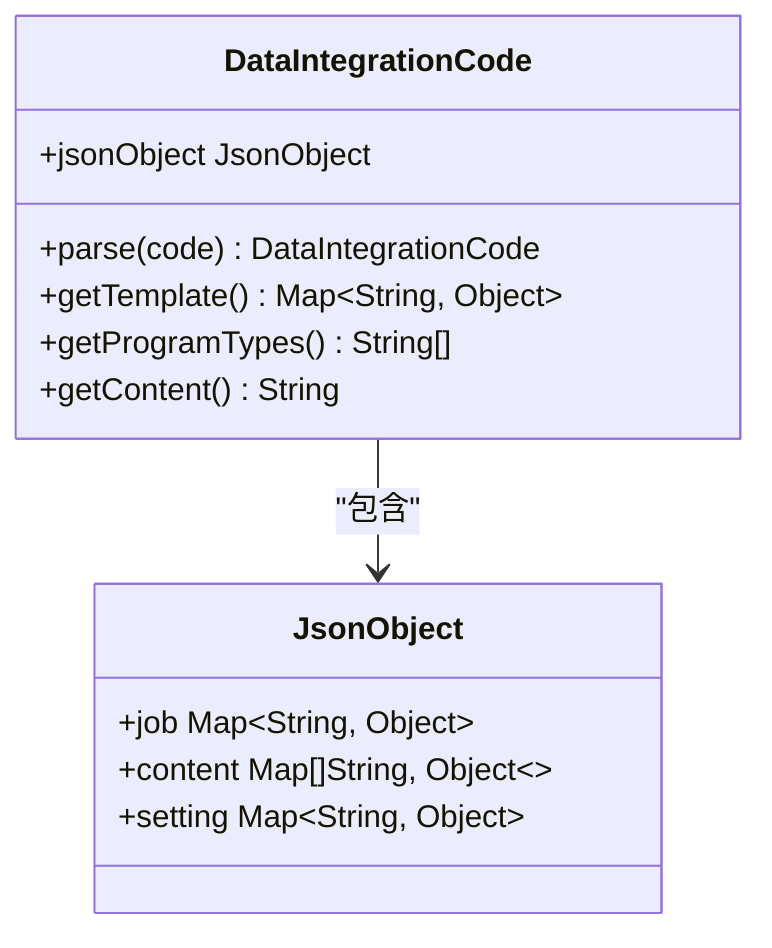

**图表来源**
- [DataIntegrationCode.java](file://spec/src/main/java/com/aliyun/dataworks/common/spec/domain/dw/codemodel/DataIntegrationCode.java)

**本节来源**
- [EmrCode.java](file://spec/src/main/java/com/aliyun/dataworks/common/spec/domain/dw/codemodel/EmrCode.java)
- [PaiCode.java](file://spec/src/main/java/com/aliyun/dataworks/common/spec/domain/dw/codemodel/PaiCode.java)
- [SqlComponentCode.java](file://spec/src/main/java/com/aliyun/dataworks/common/spec/domain/dw/codemodel/SqlComponentCode.java)
- [DataIntegrationCode.java](file://spec/src/main/java/com/aliyun/dataworks/common/spec/domain/dw/codemodel/DataIntegrationCode.java)

## 各类节点的典型配置示例和使用场景

dataworks-spec项目中的各类节点在实际使用中有不同的配置要求和使用场景。本节将详细介绍SQL节点、EMR节点、PAI节点和DataX节点的典型配置示例和使用场景。

### SQL节点的典型配置和使用场景

SQL节点是最常用的数据处理节点，主要用于执行各种SQL查询和数据处理任务。

#### ODPS SQL节点

ODPS SQL节点用于在MaxCompute上执行SQL查询，典型配置如下：

```json
{
  "id": "odps_sql_node_001",
  "name": "ODPS SQL节点示例",
  "script": {
    "language": "sql",
    "content": "SELECT * FROM table_a WHERE dt='${bdp.system.bizdate}'"
  },
  "runtimeResource": {
    "engine": "odps"
  }
}
```

**使用场景**：
- 数据仓库的ETL处理
- 大规模数据的聚合分析
- 定期数据报表生成

#### EMR SQL节点

EMR SQL节点用于在EMR集群上执行SQL查询，支持Hive、Spark SQL、Presto等多种SQL引擎：

```json
{
  "id": "emr_sql_node_001",
  "name": "EMR SQL节点示例",
  "script": {
    "language": "sql",
    "content": "INSERT INTO TABLE table_b SELECT * FROM table_a WHERE dt='${yyyy-MM-dd}'"
  },
  "runtimeResource": {
    "engine": "emr",
    "clusterId": "C-1234567890ABCDEF"
  }
}
```

**使用场景**：
- EMR集群上的数据处理
- 实时数据仓库的查询分析
- 多数据源的联合查询

### EMR节点的典型配置和使用场景

EMR节点用于在EMR集群上执行各种大数据处理任务。

#### EMR Spark节点

EMR Spark节点用于提交Spark作业到EMR集群：

```json
{
  "id": "emr_spark_node_001",
  "name": "EMR Spark节点示例",
  "script": {
    "language": "json",
    "content": {
      "name": "Spark作业",
      "type": "SPARK",
      "launcher": {
        "args": ["--class", "com.example.Main", "s3://bucket/jar/spark-job.jar"],
        "driverMemory": "4g",
        "executorMemory": "8g",
        "numExecutors": 10
      },
      "properties": {
        "spark.sql.adaptive.enabled": "true"
      }
    }
  },
  "runtimeResource": {
    "engine": "emr",
    "clusterId": "C-1234567890ABCDEF"
  }
}
```

**使用场景**：
- 大规模数据处理和分析
- 机器学习模型训练
- 实时流处理任务

#### EMR Hive节点

EMR Hive节点用于在EMR集群上执行Hive查询：

```json
{
  "id": "emr_hive_node_001",
  "name": "EMR Hive节点示例",
  "script": {
    "language": "sql",
    "content": "CREATE TABLE IF NOT EXISTS table_c AS SELECT * FROM table_a JOIN table_b ON table_a.id = table_b.id"
  },
  "runtimeResource": {
    "engine": "emr",
    "clusterId": "C-1234567890ABCDEF"
  }
}
```

**使用场景**：
- 数据仓库的构建和维护
- 复杂的数据关联分析
- 数据清洗和转换

### PAI节点的典型配置和使用场景

PAI节点用于执行机器学习和算法相关的任务。

#### PAI节点

PAI节点用于提交PAI算法作业：

```json
{
  "id": "pai_node_001",
  "name": "PAI节点示例",
  "script": {
    "language": "json",
    "content": {
      "appId": 12345,
      "name": "机器学习模型训练",
      "prgType": "PAI",
      "tasks": [
        {
          "taskName": "数据预处理",
          "prgType": 100,
          "code": "SELECT * FROM input_table"
        },
        {
          "taskName": "模型训练",
          "prgType": 200,
          "code": "pai -name xlab -project algo_public -DinputTable=input_table -DoutputTable=output_table"
        }
      ],
      "taskRelations": [
        {
          "fromTask": "数据预处理",
          "toTask": "模型训练"
        }
      ]
    }
  },
  "runtimeResource": {
    "engine": "algorithm"
  }
}
```

**使用场景**：
- 机器学习模型的训练和评估
- 数据挖掘和分析
- 智能推荐系统的构建

#### PAI Flow节点

PAI Flow节点用于定义复杂的机器学习工作流：

```json
{
  "id": "pai_flow_node_001",
  "name": "PAI Flow节点示例",
  "script": {
    "language": "yaml",
    "content": "apiVersion: pai.aliyun.com/v1\nkind: Flow\nmetadata:\n  name: ml-pipeline\nspec:\n  tasks:\n    - name: data-preprocess\n      template: sql-template\n      arguments:\n        parameters:\n          - name: sql\n            value: \"SELECT * FROM raw_data\"\n    - name: model-train\n      depends: [data-preprocess]\n      template: pai-template\n      arguments:\n        parameters:\n          - name: algorithm\n            value: \"xgboost\""
  },
  "runtimeResource": {
    "engine": "algorithm"
  }
}
```

**使用场景**：
- 复杂的机器学习流水线
- 多步骤的数据处理和分析
- 自动化模型训练流程

### DataX节点的典型配置和使用场景

DataX节点用于执行数据集成任务，实现不同数据源之间的数据同步。

#### DataX节点

DataX节点用于配置数据同步任务：

```json
{
  "id": "datax_node_001",
  "name": "DataX节点示例",
  "script": {
    "language": "json",
    "content": {
      "job": {
        "content": [
          {
            "reader": {
              "name": "mysqlreader",
              "parameter": {
                "username": "user",
                "password": "password",
                "connection": [
                  {
                    "table": ["table_a"],
                    "jdbcUrl": ["jdbc:mysql://localhost:3306/database"]
                  }
                ]
              }
            },
            "writer": {
              "name": "odpswriter",
              "parameter": {
                "project": "my_project",
                "table": "table_b",
                "partition": "dt=${bdp.system.bizdate}"
              }
            }
          }
        ],
        "setting": {
          "speed": {
            "channel": 5
          }
        }
      }
    }
  },
  "runtimeResource": {
    "engine": "di"
  }
}
```

**使用场景**：
- 不同数据库之间的数据同步
- 数据仓库的数据导入导出
- 实时数据的ETL处理

### 节点类型配置的通用原则

在配置各类节点时，需要遵循以下通用原则：

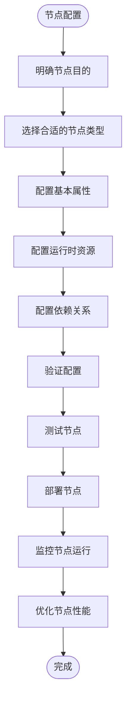

**图表来源**
- [node.schema.json](file://schema/node.schema.json)
- [SpecNode.schema.json](file://spec/src/main/resources/spec/schema/SpecNode.schema.json)

**本节来源**
- [node.schema.json](file://schema/node.schema.json)
- [SpecNode.schema.json](file://spec/src/main/resources/spec/schema/SpecNode.schema.json)
- [CodeProgramType.java](file://spec/src/main/java/com/aliyun/dataworks/common/spec/domain/dw/types/CodeProgramType.java)