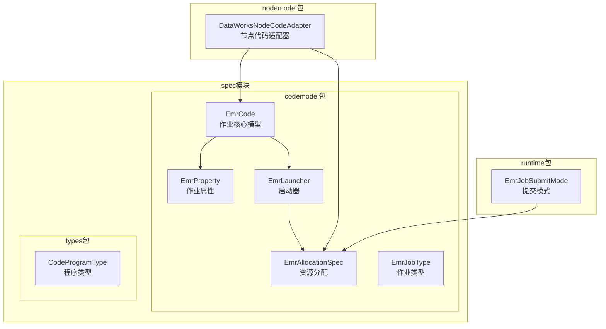
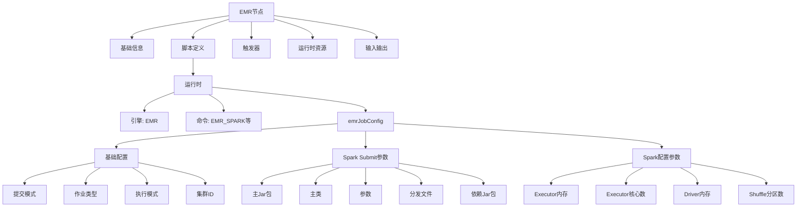
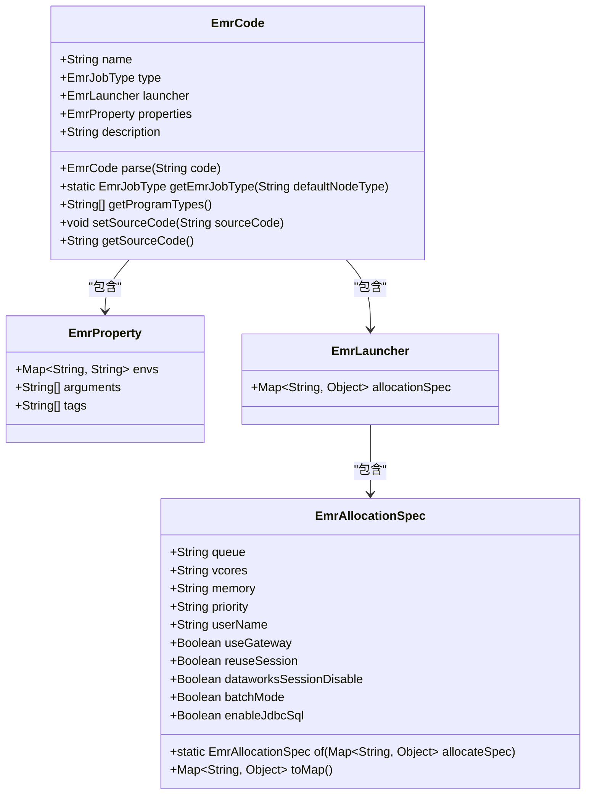
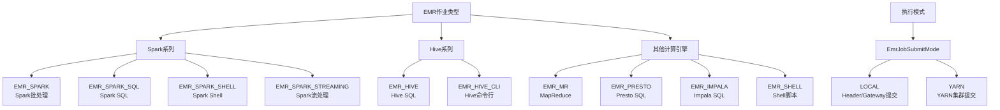
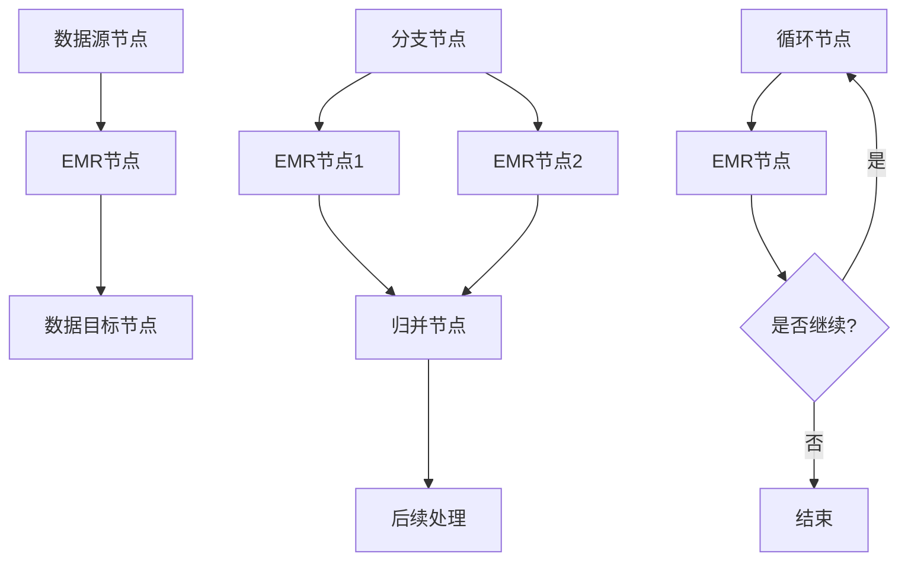
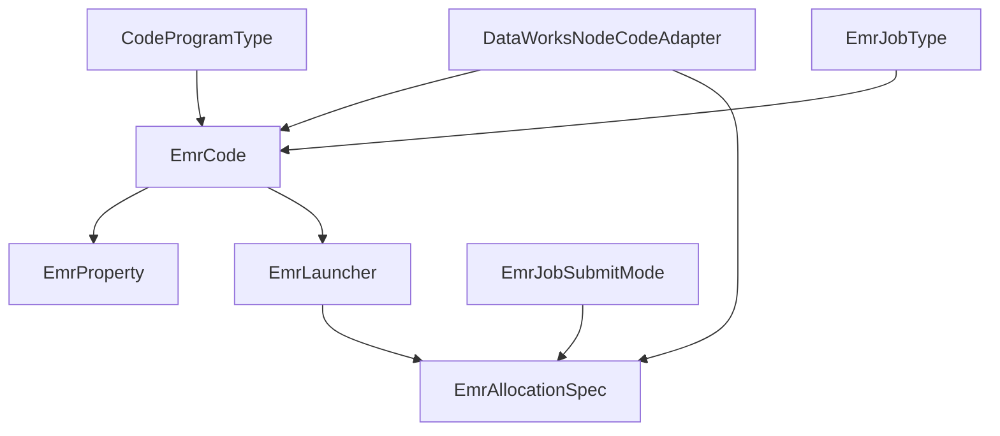

# EMR节点

<cite>
**本文档引用的文件**  
- [EmrCode.java](file://spec/src/main/java/com/aliyun/dataworks/common/spec/domain/dw/codemodel/EmrCode.java)
- [EmrProperty.java](file://spec/src/main/java/com/aliyun/dataworks/common/spec/domain/dw/codemodel/EmrProperty.java)
- [EmrLauncher.java](file://spec/src/main/java/com/aliyun/dataworks/common/spec/domain/dw/codemodel/EmrLauncher.java)
- [EmrAllocationSpec.java](file://spec/src/main/java/com/aliyun/dataworks/common/spec/domain/dw/codemodel/EmrAllocationSpec.java)
- [EmrJobType.java](file://spec/src/main/java/com/aliyun/dataworks/common/spec/domain/dw/codemodel/EmrJobType.java)
- [CodeProgramType.java](file://spec/src/main/java/com/aliyun/dataworks/common/spec/domain/dw/types/CodeProgramType.java)
- [emr-spark.md](file://docs/spec-templates/nodes/emr-spark.md)
- [DataWorksNodeCodeAdapter.java](file://spec/src/main/java/com/aliyun/dataworks/common/spec/domain/dw/nodemodel/DataWorksNodeCodeAdapter.java)
- [EmrJobSubmitMode.java](file://spec/src/main/java/com/aliyun/dataworks/common/spec/domain/ref/runtime/emr/EmrJobSubmitMode.java)
</cite>

## 目录
1. [简介](#简介)
2. [项目结构](#项目结构)
3. [核心组件](#核心组件)
4. [架构概述](#架构概述)
5. [详细组件分析](#详细组件分析)
6. [依赖分析](#依赖分析)
7. [性能考虑](#性能考虑)
8. [故障排除指南](#故障排除指南)
9. [结论](#结论)

## 简介
EMR节点是DataWorks平台中用于在EMR（Elastic MapReduce）集群上执行大数据处理作业的核心组件。该文档深入解析了EMR节点的技术实现，包括其核心类EmrCode的结构、支持的作业类型、执行模式、资源配置策略以及与其他DataWorks组件的集成方式。文档详细说明了如何通过FlowSpec规范定义复杂的EMR工作流，并提供了不同场景下的配置示例。

## 项目结构
EMR节点相关的代码主要分布在DataWorks规范（spec）模块的codemodel包中，该包定义了EMR作业的代码模型、属性配置和资源分配规范。EMR节点的实现与DataWorks的节点模型和运行时环境紧密集成，通过统一的规范定义来管理不同类型的EMR作业。



**图源**
- [EmrCode.java](file://spec/src/main/java/com/aliyun/dataworks/common/spec/domain/dw/codemodel/EmrCode.java)
- [EmrProperty.java](file://spec/src/main/java/com/aliyun/dataworks/common/spec/domain/dw/codemodel/EmrProperty.java)
- [EmrLauncher.java](file://spec/src/main/java/com/aliyun/dataworks/common/spec/domain/dw/codemodel/EmrLauncher.java)
- [EmrAllocationSpec.java](file://spec/src/main/java/com/aliyun/dataworks/common/spec/domain/dw/codemodel/EmrAllocationSpec.java)
- [DataWorksNodeCodeAdapter.java](file://spec/src/main/java/com/aliyun/dataworks/common/spec/domain/dw/nodemodel/DataWorksNodeCodeAdapter.java)

**节源**
- [EmrCode.java](file://spec/src/main/java/com/aliyun/dataworks/common/spec/domain/dw/codemodel/EmrCode.java)
- [EmrProperty.java](file://spec/src/main/java/com/aliyun/dataworks/common/spec/domain/dw/codemodel/EmrProperty.java)
- [EmrLauncher.java](file://spec/src/main/java/com/aliyun/dataworks/common/spec/domain/dw/codemodel/EmrLauncher.java)
- [EmrAllocationSpec.java](file://spec/src/main/java/com/aliyun/dataworks/common/spec/domain/dw/codemodel/EmrAllocationSpec.java)
- [CodeProgramType.java](file://spec/src/main/java/com/aliyun/dataworks/common/spec/domain/dw/types/CodeProgramType.java)

## 核心组件
EMR节点的核心组件包括EmrCode类，它是EMR作业的代码模型，包含了作业的名称、类型、启动器配置和属性配置。EmrProperty类定义了作业的环境变量、参数和标签。EmrLauncher类通过EmrAllocationSpec封装了作业的资源分配策略，包括队列、内存、CPU核心数等。这些组件共同构成了EMR节点的配置体系，支持多种作业类型和执行模式。

**节源**
- [EmrCode.java](file://spec/src/main/java/com/aliyun/dataworks/common/spec/domain/dw/codemodel/EmrCode.java)
- [EmrProperty.java](file://spec/src/main/java/com/aliyun/dataworks/common/spec/domain/dw/codemodel/EmrProperty.java)
- [EmrLauncher.java](file://spec/src/main/java/com/aliyun/dataworks/common/spec/domain/dw/codemodel/EmrLauncher.java)

## 架构概述
EMR节点的架构基于DataWorks的FlowSpec规范，通过JSON格式的配置文件定义作业的元数据和运行时参数。作业配置分为多个层次：基础信息（如ID、名称）、脚本定义（包含运行时命令和EMR特定配置）、触发器、运行时资源和输入输出依赖。EMR特定的配置通过emrJobConfig字段进行定义，包含了作业类型、执行模式、集群ID、Spark参数等。



**图源**
- [emr-spark.md](file://docs/spec-templates/nodes/emr-spark.md)
- [DataWorksNodeCodeAdapter.java](file://spec/src/main/java/com/aliyun/dataworks/common/spec/domain/dw/nodemodel/DataWorksNodeCodeAdapter.java)

## 详细组件分析

### EmrCode类分析
EmrCode类是EMR节点的核心实现，它继承自AbstractBaseCode并实现了EMR作业的特定功能。该类通过Lombok注解简化了代码，提供了getter、setter、toString和equals方法。EmrCode包含作业名称、类型、启动器、属性和描述等字段，其中启动器和属性都有默认实例化，确保了配置的完整性。



**图源**
- [EmrCode.java](file://spec/src/main/java/com/aliyun/dataworks/common/spec/domain/dw/codemodel/EmrCode.java)
- [EmrProperty.java](file://spec/src/main/java/com/aliyun/dataworks/common/spec/domain/dw/codemodel/EmrProperty.java)
- [EmrLauncher.java](file://spec/src/main/java/com/aliyun/dataworks/common/spec/domain/dw/codemodel/EmrLauncher.java)
- [EmrAllocationSpec.java](file://spec/src/main/java/com/aliyun/dataworks/common/spec/domain/dw/codemodel/EmrAllocationSpec.java)

**节源**
- [EmrCode.java](file://spec/src/main/java/com/aliyun/dataworks/common/spec/domain/dw/codemodel/EmrCode.java)

### 作业类型与执行模式
EMR节点支持多种作业类型，通过CodeProgramType和EmrJobType枚举进行定义。作业类型包括Spark、Hive、MapReduce、Presto、Impala等，每种类型都有对应的命令和配置参数。执行模式分为客户端模式（Client）和集群模式（Cluster），通过EmrJobSubmitMode枚举定义，其中LOCAL模式对应Header/Gateway提交，YARN模式对应YARN集群提交。



**图源**
- [CodeProgramType.java](file://spec/src/main/java/com/aliyun/dataworks/common/spec/domain/dw/types/CodeProgramType.java)
- [EmrJobType.java](file://spec/src/main/java/com/aliyun/dataworks/common/spec/domain/dw/codemodel/EmrJobType.java)
- [EmrJobSubmitMode.java](file://spec/src/main/java/com/aliyun/dataworks/common/spec/domain/ref/runtime/emr/EmrJobSubmitMode.java)

**节源**
- [CodeProgramType.java](file://spec/src/main/java/com/aliyun/dataworks/common/spec/domain/dw/types/CodeProgramType.java)
- [EmrJobType.java](file://spec/src/main/java/com/aliyun/dataworks/common/spec/domain/dw/codemodel/EmrJobType.java)
- [EmrJobSubmitMode.java](file://spec/src/main/java/com/aliyun/dataworks/common/spec/domain/ref/runtime/emr/EmrJobSubmitMode.java)

### 配置项详解
EmrProperty类定义了EMR作业的关键配置项，包括环境变量、参数和标签。环境变量（envs）用于设置作业运行时的环境，参数（arguments）是传递给应用程序的命令行参数，标签（tags）用于作业的分类和管理。EmrAllocationSpec则定义了更详细的资源分配配置，如队列名称、内存、CPU核心数、优先级等。

```mermaid
flowchart TD
A[EmrProperty配置] --> B[环境变量(envs)]
A --> C[参数(arguments)]
A --> D[标签(tags)]
B --> B1["FLOW_SKIP_SQL_ANALYZE: 跳过SQL分析"]
C --> C1["应用程序参数"]
D --> D1["作业标签"]
E[EmrAllocationSpec配置] --> F[基础资源]
E --> G[高级选项]
F --> F1[queue: 队列名称]
F --> F2[memory: 内存(MB)]
F --> F3[vcores: CPU核心数]
F --> F4[priority: 优先级]
G --> G1[useGateway: 是否使用Gateway]
G --> G2[reuseSession: 是否复用会话]
G --> G3[dataworksSessionDisable: 禁用DataWorks会话]
G --> G4[batchMode: 批处理模式]
G --> G5[enableJdbcSql: 启用JDBC SQL]
```

**图源**
- [EmrProperty.java](file://spec/src/main/java/com/aliyun/dataworks/common/spec/domain/dw/codemodel/EmrProperty.java)
- [EmrAllocationSpec.java](file://spec/src/main/java/com/aliyun/dataworks/common/spec/domain/dw/codemodel/EmrAllocationSpec.java)

**节源**
- [EmrProperty.java](file://spec/src/main/java/com/aliyun/dataworks/common/spec/domain/dw/codemodel/EmrProperty.java)
- [EmrAllocationSpec.java](file://spec/src/main/java/com/aliyun/dataworks/common/spec/domain/dw/codemodel/EmrAllocationSpec.java)

### 配置示例
EMR节点支持多种场景的配置，包括批处理作业、流式计算作业和交互式查询。批处理作业通常使用EMR_SPARK或EMR_MR类型，配置固定的资源和参数。流式计算作业使用EMR_SPARK_STREAMING类型，需要配置Kafka等流数据源和背压机制。交互式查询使用EMR_SPARK_SQL或EMR_PRESTO类型，强调快速响应和资源复用。

```mermaid
graph TD
A[EMR节点配置示例] --> B[批处理作业]
A --> C[流式计算作业]
A --> D[交互式查询]
B --> B1[作业类型: SPARK]
B --> B2[执行模式: Single]
B --> B3[资源: 4g内存, 2核CPU]
B --> B4[参数: --date ${bizdate}]
C --> C1[作业类型: SPARK_STREAMING]
C --> C2[执行模式: Continuous]
C --> C3[参数: kafka.maxRatePerPartition=10000]
C --> C4[配置: backpressure.enabled=true]
D --> D1[作业类型: SPARK_SQL]
D --> D2[执行模式: Interactive]
D --> D3[资源: 复用会话]
D --> D4[参数: SQL查询语句]
```

**图源**
- [emr-spark.md](file://docs/spec-templates/nodes/emr-spark.md)

**节源**
- [emr-spark.md](file://docs/spec-templates/nodes/emr-spark.md)

### 集成与工作流定义
EMR节点通过FlowSpec规范与其他DataWorks组件集成，可以在工作流中作为数据处理节点使用。通过Node的inputs和outputs字段，EMR节点可以与上游的数据源节点和下游的数据目标节点建立依赖关系。复杂的EMR工作流可以通过分支、归并、循环等控制节点来定义，实现数据处理的条件分支和迭代计算。



**图源**
- [emr-spark.md](file://docs/spec-templates/nodes/emr-spark.md)

**节源**
- [emr-spark.md](file://docs/spec-templates/nodes/emr-spark.md)

## 依赖分析
EMR节点的实现依赖于DataWorks规范模块中的多个组件，包括代码模型、节点模型和运行时环境。EmrCode类依赖于EmrProperty、EmrLauncher和EmrAllocationSpec来构建完整的作业配置。DataWorksNodeCodeAdapter作为适配器，将EMR节点的配置转换为DataWorks的内部表示。这些依赖关系确保了EMR节点能够无缝集成到DataWorks平台中。



**图源**
- [EmrCode.java](file://spec/src/main/java/com/aliyun/dataworks/common/spec/domain/dw/codemodel/EmrCode.java)
- [EmrProperty.java](file://spec/src/main/java/com/aliyun/dataworks/common/spec/domain/dw/codemodel/EmrProperty.java)
- [EmrLauncher.java](file://spec/src/main/java/com/aliyun/dataworks/common/spec/domain/dw/codemodel/EmrLauncher.java)
- [EmrAllocationSpec.java](file://spec/src/main/java/com/aliyun/dataworks/common/spec/domain/dw/codemodel/EmrAllocationSpec.java)
- [DataWorksNodeCodeAdapter.java](file://spec/src/main/java/com/aliyun/dataworks/common/spec/domain/dw/nodemodel/DataWorksNodeCodeAdapter.java)
- [CodeProgramType.java](file://spec/src/main/java/com/aliyun/dataworks/common/spec/domain/dw/types/CodeProgramType.java)
- [EmrJobType.java](file://spec/src/main/java/com/aliyun/dataworks/common/spec/domain/dw/codemodel/EmrJobType.java)
- [EmrJobSubmitMode.java](file://spec/src/main/java/com/aliyun/dataworks/common/spec/domain/ref/runtime/emr/EmrJobSubmitMode.java)

**节源**
- [EmrCode.java](file://spec/src/main/java/com/aliyun/dataworks/common/spec/domain/dw/codemodel/EmrCode.java)
- [EmrProperty.java](file://spec/src/main/java/com/aliyun/dataworks/common/spec/domain/dw/codemodel/EmrProperty.java)
- [EmrLauncher.java](file://spec/src/main/java/com/aliyun/dataworks/common/spec/domain/dw/codemodel/EmrLauncher.java)
- [EmrAllocationSpec.java](file://spec/src/main/java/com/aliyun/dataworks/common/spec/domain/dw/codemodel/EmrAllocationSpec.java)
- [DataWorksNodeCodeAdapter.java](file://spec/src/main/java/com/aliyun/dataworks/common/spec/domain/dw/nodemodel/DataWorksNodeCodeAdapter.java)

## 性能考虑
在配置EMR节点时，需要考虑作业的性能优化。对于批处理作业，应合理设置Executor的内存和CPU核心数，避免资源浪费或不足。启用动态资源分配可以提高集群资源的利用率。对于流式计算作业，应配置背压机制来控制数据处理速率，防止系统过载。使用Kryo序列化器可以提升Spark作业的序列化性能。

## 故障排除指南
当EMR节点执行失败时，应首先检查集群状态和资源可用性。确认EMR集群处于运行状态，并且有足够的资源来执行作业。检查OSS路径的访问权限，确保作业所需的Jar包和配置文件可以被正确访问。对于PySpark作业，需要确保集群中的Python版本与作业要求一致。查看Spark UI和日志输出，可以帮助定位作业执行中的具体问题。

**节源**
- [emr-spark.md](file://docs/spec-templates/nodes/emr-spark.md)

## 结论
EMR节点是DataWorks平台中强大的大数据处理组件，通过灵活的配置和丰富的功能支持多种计算引擎和作业类型。其基于FlowSpec规范的设计使得作业配置标准化和可复用，便于在复杂的数据工作流中使用。通过深入理解EmrCode类的实现机制和配置选项，用户可以有效地利用EMR节点来处理各种大数据场景，从批处理到流式计算，从交互式查询到机器学习任务。