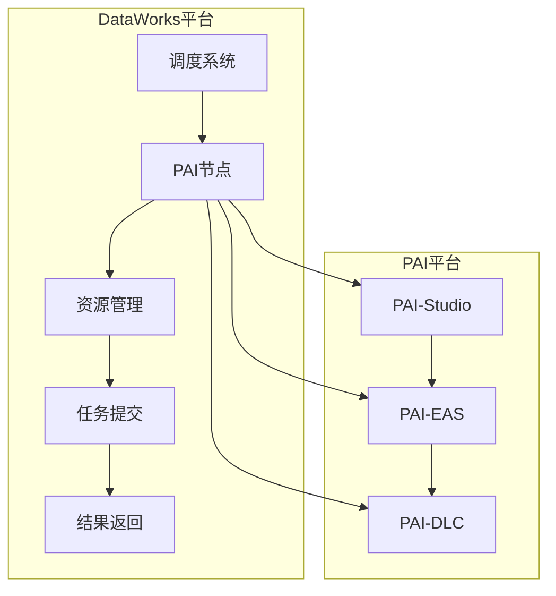
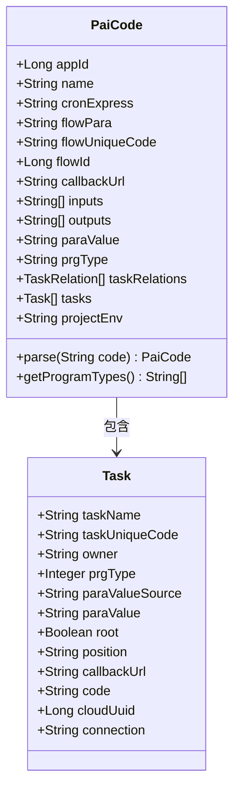
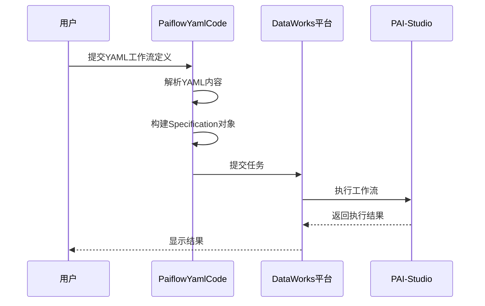
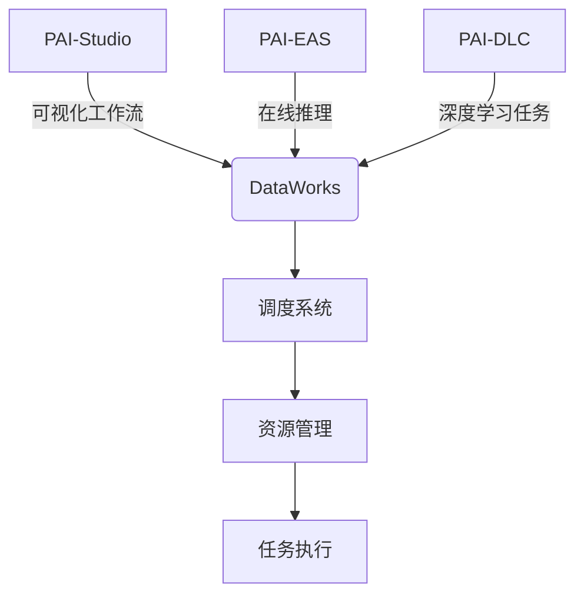
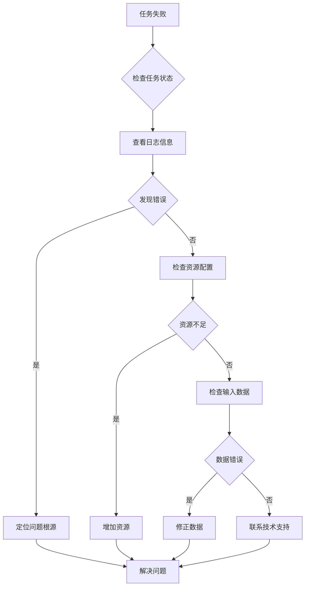

# PAI节点

<cite>
**本文档引用的文件**   
- [PaiCode.java](file://spec/src/main/java/com/aliyun/dataworks/common/spec/domain/dw/codemodel/PaiCode.java)
- [PaiflowYamlCode.java](file://spec/src/main/java/com/aliyun/dataworks/common/spec/domain/dw/codemodel/PaiflowYamlCode.java)
- [pai_code_sample_1.json](file://spec/src/test/resources/codemodel/pai_code_sample_1.json)
- [pai-flow.md](file://docs/spec-templates/nodes/pai-flow.md)
- [pai-studio.md](file://docs/spec-templates/nodes/pai-studio.md)
- [CodeProgramType.java](file://spec/src/main/java/com/aliyun/dataworks/common/spec/domain/dw/types/CodeProgramType.java)
- [DefaultJsonFormCode.java](file://spec/src/main/java/com/aliyun/dataworks/common/spec/domain/dw/codemodel/DefaultJsonFormCode.java)
- [PaiflowArguments.java](file://spec/src/main/java/com/aliyun/dataworks/common/spec/domain/paiflow/PaiflowArguments.java)
- [PaiflowParameter.java](file://spec/src/main/java/com/aliyun/dataworks/common/spec/domain/paiflow/PaiflowParameter.java)
- [PaiflowScriptContent.java](file://spec/src/main/java/com/aliyun/dataworks/common/spec/domain/paiflow/PaiflowScriptContent.java)
</cite>

## 目录
1. [引言](#引言)
2. [PAI节点架构概述](#pai节点架构概述)
3. [PaiCode类设计与实现](#paicode类设计与实现)
4. [PaiflowYamlCode在PAI-Studio工作流中的作用](#paiflowyamlcode在pai-studio工作流中的作用)
5. [PAI节点支持的产品形态及配置方式](#pai节点支持的产品形态及配置方式)
6. [典型机器学习场景配置示例](#典型机器学习场景配置示例)
7. [监控指标、日志查看与故障排查](#监控指标日志查看与故障排查)
8. [结论](#结论)

## 引言

PAI（Platform of Artificial Intelligence）节点是DataWorks平台中用于执行机器学习和深度学习任务的核心组件。它支持多种AI产品形态，包括PAI-Studio、PAI-EAS和PAI-DLC，能够满足从数据预处理到模型训练、评估和预测的全流程需求。本文档旨在全面解析PAI节点的技术细节，涵盖PaiCode类的设计原理、PaiflowYamlCode在PAI-Studio工作流中的作用、不同产品形态的配置方式以及典型应用场景的配置示例。此外，还将介绍PAI节点的监控指标、日志查看方法和常见故障排查策略，帮助用户更好地理解和使用PAI节点。

**本文档引用的文件**
- [PaiCode.java](file://spec/src/main/java/com/aliyun/dataworks/common/spec/domain/dw/codemodel/PaiCode.java#L1-L77)
- [PaiflowYamlCode.java](file://spec/src/main/java/com/aliyun/dataworks/common/spec/domain/dw/codemodel/PaiflowYamlCode.java#L1-L373)
- [pai_code_sample_1.json](file://spec/src/test/resources/codemodel/pai_code_sample_1.json#L1-L281)

## PAI节点架构概述

PAI节点的架构设计基于模块化和可扩展的原则，旨在支持多种AI产品形态和复杂的机器学习工作流。其核心组件包括PaiCode类和PaiflowYamlCode类，分别负责处理PAI任务的JSON配置和YAML格式的工作流定义。PaiCode类继承自DefaultJsonFormCode，提供了对PAI任务的基本支持，而PaiflowYamlCode类则实现了对PAI-Studio工作流的解析和生成。

PAI节点通过DataWorks平台的调度系统进行管理，支持定时触发和手动触发两种执行模式。在执行过程中，PAI节点会根据配置的资源类型（如MaxCompute、DLC等）申请相应的计算资源，并通过PAI平台的API提交任务。任务执行完成后，PAI节点会将结果返回给DataWorks平台，并记录详细的日志信息，便于后续的监控和分析。



**图来源**
- [PaiCode.java](file://spec/src/main/java/com/aliyun/dataworks/common/spec/domain/dw/codemodel/PaiCode.java#L1-L77)
- [PaiflowYamlCode.java](file://spec/src/main/java/com/aliyun/dataworks/common/spec/domain/dw/codemodel/PaiflowYamlCode.java#L1-L373)

**本文档引用的文件**
- [PaiCode.java](file://spec/src/main/java/com/aliyun/dataworks/common/spec/domain/dw/codemodel/PaiCode.java#L1-L77)
- [PaiflowYamlCode.java](file://spec/src/main/java/com/aliyun/dataworks/common/spec/domain/dw/codemodel/PaiflowYamlCode.java#L1-L373)

## PaiCode类设计与实现

PaiCode类是PAI节点的核心实现之一，负责处理PAI任务的JSON配置。该类继承自DefaultJsonFormCode，提供了对PAI任务的基本支持。PaiCode类的主要属性包括任务列表（tasks）、任务关系（taskRelations）、流程参数（flowPara）和连接信息（connection）。每个任务对象包含任务名称（taskName）、唯一编码（taskUniqueCode）、所有者（owner）、程序类型（prgType）、参数值（paraValue）和代码内容（code）等字段。

PaiCode类的设计遵循了面向对象的原则，通过嵌套类Task来封装任务的详细信息，提高了代码的可读性和可维护性。此外，PaiCode类还重写了getProgramTypes方法，返回PAI任务的程序类型列表，确保任务能够被正确识别和处理。



**图来源**
- [PaiCode.java](file://spec/src/main/java/com/aliyun/dataworks/common/spec/domain/dw/codemodel/PaiCode.java#L1-L77)

**本文档引用的文件**
- [PaiCode.java](file://spec/src/main/java/com/aliyun/dataworks/common/spec/domain/dw/codemodel/PaiCode.java#L1-L77)
- [DefaultJsonFormCode.java](file://spec/src/main/java/com/aliyun/dataworks/common/spec/domain/dw/codemodel/DefaultJsonFormCode.java#L1-L151)

## PaiflowYamlCode在PAI-Studio工作流中的作用

PaiflowYamlCode类是PAI-Studio工作流的核心实现，负责解析和生成YAML格式的工作流定义。该类实现了YamlFormCode接口，提供了对YAML内容的解析和序列化功能。PaiflowYamlCode类的主要属性包括paiflowScriptContent，它包含了工作流的详细配置信息，如paiflowPipeline、paiflowArguments和computeResource等。

PaiflowYamlCode类通过getSpec方法将YAML格式的工作流定义转换为DataWorks平台的Specification对象，从而实现工作流的执行。在转换过程中，PaiflowYamlCode类会解析paiflowPipeline中的节点和依赖关系，并根据paiflowArguments中的参数信息构建出完整的任务配置。此外，PaiflowYamlCode类还支持对工作流的动态参数化，允许用户在运行时传递不同的参数值，提高了工作流的灵活性和复用性。



**图来源**
- [PaiflowYamlCode.java](file://spec/src/main/java/com/aliyun/dataworks/common/spec/domain/dw/codemodel/PaiflowYamlCode.java#L1-L373)
- [PaiflowScriptContent.java](file://spec/src/main/java/com/aliyun/dataworks/common/spec/domain/paiflow/PaiflowScriptContent.java#L1-L41)

**本文档引用的文件**
- [PaiflowYamlCode.java](file://spec/src/main/java/com/aliyun/dataworks/common/spec/domain/dw/codemodel/PaiflowYamlCode.java#L1-L373)
- [PaiflowScriptContent.java](file://spec/src/main/java/com/aliyun/dataworks/common/spec/domain/paiflow/PaiflowScriptContent.java#L1-L41)
- [PaiflowArguments.java](file://spec/src/main/java/com/aliyun/dataworks/common/spec/domain/paiflow/PaiflowArguments.java#L1-L16)

## PAI节点支持的产品形态及配置方式

PAI节点支持多种产品形态，包括PAI-Studio、PAI-EAS和PAI-DLC，每种形态都有其特定的应用场景和配置方式。

### PAI-Studio

PAI-Studio是PAI平台的可视化开发环境，支持拖拽式构建机器学习工作流。在DataWorks中，PAI-Studio节点通过PaiCode类进行配置，主要参数包括appId、flowUniqueCode、tasks和taskRelations。用户可以在PAI-Studio中设计工作流，然后将其导出为JSON格式的配置文件，再通过DataWorks平台提交执行。

### PAI-EAS

PAI-EAS（Elastic Algorithm Service）是PAI平台的弹性算法服务，支持模型的在线推理。PAI-EAS节点的配置主要包括模型路径、服务端口和资源规格等。用户可以通过PAI-EAS的API或控制台创建和管理服务实例，并在DataWorks中通过PAI节点调用这些服务。

### PAI-DLC

PAI-DLC（Deep Learning Container）是PAI平台的深度学习容器服务，支持自定义镜像和复杂的深度学习任务。PAI-DLC节点的配置较为复杂，需要指定容器镜像、启动命令、环境变量和挂载卷等。用户可以通过Dockerfile构建自定义镜像，并在PAI-DLC中部署和运行深度学习任务。



**图来源**
- [CodeProgramType.java](file://spec/src/main/java/com/aliyun/dataworks/common/spec/domain/dw/types/CodeProgramType.java#L1-L229)
- [pai-studio.md](file://docs/spec-templates/nodes/pai-studio.md#L1-L99)

**本文档引用的文件**
- [CodeProgramType.java](file://spec/src/main/java/com/aliyun/dataworks/common/spec/domain/dw/types/CodeProgramType.java#L1-L229)
- [pai-studio.md](file://docs/spec-templates/nodes/pai-studio.md#L1-L99)
- [PaiCode.java](file://spec/src/main/java/com/aliyun/dataworks/common/spec/domain/dw/codemodel/PaiCode.java#L1-L77)

## 典型机器学习场景配置示例

### 数据预处理

在数据预处理阶段，PAI节点可以用于执行数据清洗、特征工程和数据转换等任务。以下是一个使用PAI-Studio节点进行数据预处理的配置示例：

```json
{
  "appId": 23620,
  "flowUniqueCode": "ee1b1797-9f7c-4937-b672-028c4ced649b",
  "tasks": [
    {
      "taskName": "SQL脚本-1",
      "taskUniqueCode": "id-fdb222dd-1396-4cdc-baf8",
      "code": "select 1;"
    },
    {
      "taskName": "SQL脚本-2",
      "taskUniqueCode": "id-c541f1eb-81b8-4e10-921b",
      "code": "SELECT 2;"
    }
  ],
  "taskRelations": [
    {
      "childTaskUniqueCode": "id-c541f1eb-81b8-4e10-921b",
      "parentTaskUniqueCode": "id-fdb222dd-1396-4cdc-baf8"
    }
  ]
}
```

### 模型训练

在模型训练阶段，PAI节点可以用于执行机器学习算法的训练任务。以下是一个使用PAI-DLC节点进行模型训练的配置示例：

```yaml
computeResource:
  DLC,Optional: execution_dlc_optional
connectionType: dlc
paraValue: --paiflow_endpoint=paiflow-pre.cn-hangzhou.aliyuncs.com --ai_workspace_endpoint=aiworkspace-pre.cn-hangzhou.aliyuncs.com --region=cn-hangzhou
paiflowPipeline:
  apiVersion: core/v1
  metadata:
    provider: '1326689413376250'
    version: v1
    identifier: rag_sync_index
    uuid: k9wbjh70610s550m8w
    annotations: {}
    labels: {}
  spec:
    arguments:
      artifacts: []
      parameters: []
    container:
      image: pai-official-cn-hangzhou-registry-vpc.cn-hangzhou.cr.aliyuncs.com/official/max-compute-executor:v20241210134900
      command:
        - bash
        - /paiflow-bin/start.sh
      envs: {}
      volumeMounts:
        - name: pai-volume
          path: /pai
    initContainers:
      - image: pai-official-cn-hangzhou-registry-vpc.cn-hangzhou.cr.aliyuncs.com/official/paiflow-init:v1.0.0
        command:
          - /bin/sh
          - -c
          - paiflow-init download --source 'oss://pai-studio-cn-hangzhou-prod/algorithm/pai/rag_sync_index/v1/afb415fb780f5cd50ca65d91b0e4d90e43972afd/working?endpoint=oss-cn-hangzhou-internal.aliyuncs.com&roleARN=acs:ram::1326689413376250:role/pai-studio-algo-download-role&ownerId=1326689413376250'
          --destination /pai/main/resource
        name: paiflow-init
        envs: {}
        volumeMounts:
          - name: pai-volume
            path: /pai/main
    inputs:
      artifacts:
        - desc: Input Data
          metadata:
            type:
              DataSet:
                locationType: OSS
          name: input_data
          repeated: false
          required: false
      parameters:
        - desc: role_arn
          name: role_arn
          type: String
          value: ''
        - desc: The ID of the registered index in PAI (Dataset, DataType=INDEX).
          name: target_index
          type: String
        - desc: Training service config
          name: training_service_config
          type: Map
          value: ''
        - name: execution
          type: Map
    outputs:
      artifacts:
        - desc: Output Data
          metadata:
            type:
              DataSet:
                locationType: OSS
          name: output_data
          repeated: false
          required: false
          value: {}
      parameters: []
    pipelines: []
    sideCarContainers: []
    volumes:
      - name: pai-volume
        emptyDir: {}
pipelineId: pipeline-tvxe0krijvvmps4ksr
```

### 模型评估与预测

在模型评估与预测阶段，PAI节点可以用于执行模型的性能评估和在线推理。以下是一个使用PAI-EAS节点进行模型预测的配置示例：

```json
{
  "modelPath": "oss://pai-models/my-model",
  "servicePort": 8080,
  "resourceSpec": "ecs.c5.xlarge"
}
```

**本文档引用的文件**
- [pai_code_sample_1.json](file://spec/src/test/resources/codemodel/pai_code_sample_1.json#L1-L281)
- [pai-flow.md](file://docs/spec-templates/nodes/pai-flow.md#L1-L223)
- [PaiflowYamlCode.java](file://spec/src/main/java/com/aliyun/dataworks/common/spec/domain/dw/codemodel/PaiflowYamlCode.java#L1-L373)

## 监控指标、日志查看与故障排查

### 监控指标

PAI节点提供了丰富的监控指标，帮助用户了解任务的执行状态和性能表现。主要监控指标包括：
- **任务状态**：任务的当前状态，如运行中、成功、失败等。
- **资源使用情况**：CPU、内存和GPU的使用率。
- **执行时间**：任务的开始时间、结束时间和总执行时间。
- **错误信息**：任务执行过程中产生的错误日志。

### 日志查看

PAI节点的日志信息可以通过DataWorks平台的控制台进行查看。用户可以在任务详情页面找到日志查看入口，点击后可以查看详细的日志内容。日志信息包括任务的启动日志、执行日志和结束日志，帮助用户了解任务的执行过程。

### 故障排查

当PAI节点出现故障时，用户可以通过以下步骤进行排查：
1. **检查任务状态**：确认任务是否处于失败状态，并查看失败原因。
2. **查看日志信息**：通过日志查看功能，查找错误日志，定位问题根源。
3. **检查资源配置**：确认任务的资源配置是否合理，如CPU、内存和GPU等。
4. **检查输入数据**：确认输入数据的格式和内容是否符合要求。
5. **联系技术支持**：如果问题无法解决，可以联系PAI平台的技术支持团队获取帮助。



**图来源**
- [PaiCode.java](file://spec/src/main/java/com/aliyun/dataworks/common/spec/domain/dw/codemodel/PaiCode.java#L1-L77)
- [PaiflowYamlCode.java](file://spec/src/main/java/com/aliyun/dataworks/common/spec/domain/dw/codemodel/PaiflowYamlCode.java#L1-L373)

**本文档引用的文件**
- [PaiCode.java](file://spec/src/main/java/com/aliyun/dataworks/common/spec/domain/dw/codemodel/PaiCode.java#L1-L77)
- [PaiflowYamlCode.java](file://spec/src/main/java/com/aliyun/dataworks/common/spec/domain/dw/codemodel/PaiflowYamlCode.java#L1-L373)

## 结论

PAI节点是DataWorks平台中用于执行机器学习和深度学习任务的重要组件，支持多种AI产品形态和复杂的机器学习工作流。通过PaiCode类和PaiflowYamlCode类的设计与实现，PAI节点能够灵活地处理不同类型的PAI任务，并提供丰富的监控指标和日志信息，帮助用户更好地管理和优化任务执行。本文档详细介绍了PAI节点的架构设计、核心类的实现、产品形态的配置方式以及典型应用场景的配置示例，为用户提供了全面的技术参考。未来，PAI节点将继续优化性能和功能，支持更多AI产品形态和应用场景，助力用户实现更高效的机器学习开发和部署。

**本文档引用的文件**
- [PaiCode.java](file://spec/src/main/java/com/aliyun/dataworks/common/spec/domain/dw/codemodel/PaiCode.java#L1-L77)
- [PaiflowYamlCode.java](file://spec/src/main/java/com/aliyun/dataworks/common/spec/domain/dw/codemodel/PaiflowYamlCode.java#L1-L373)
- [pai_code_sample_1.json](file://spec/src/test/resources/codemodel/pai_code_sample_1.json#L1-L281)
- [pai-flow.md](file://docs/spec-templates/nodes/pai-flow.md#L1-L223)
- [pai-studio.md](file://docs/spec-templates/nodes/pai-studio.md#L1-L99)