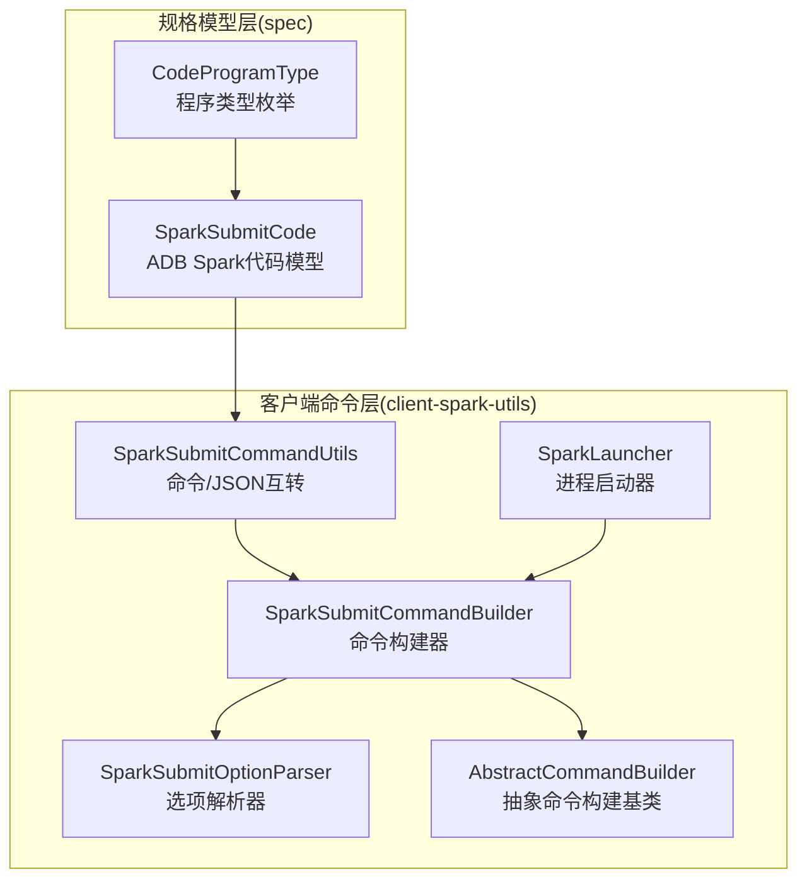
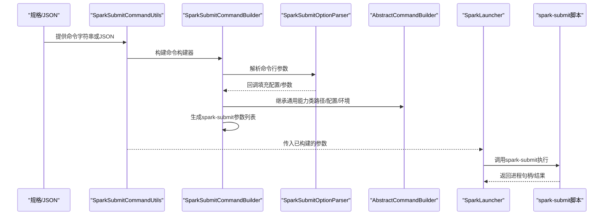
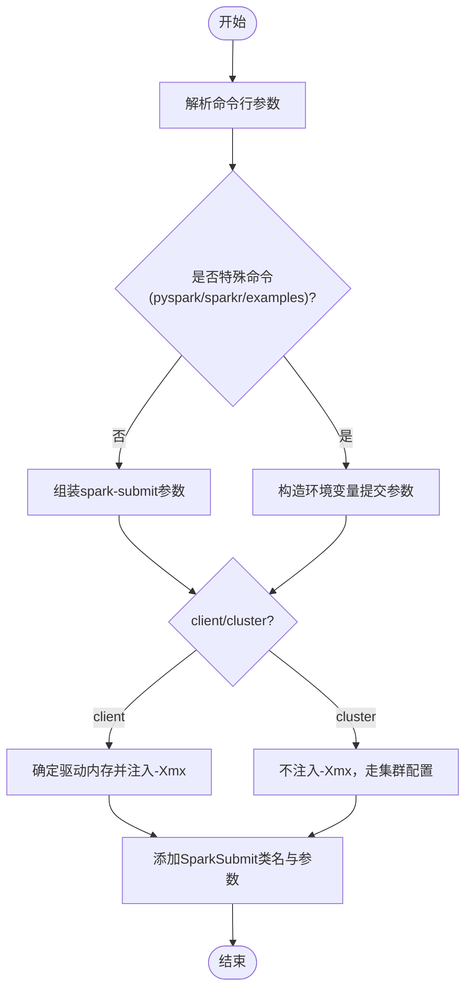
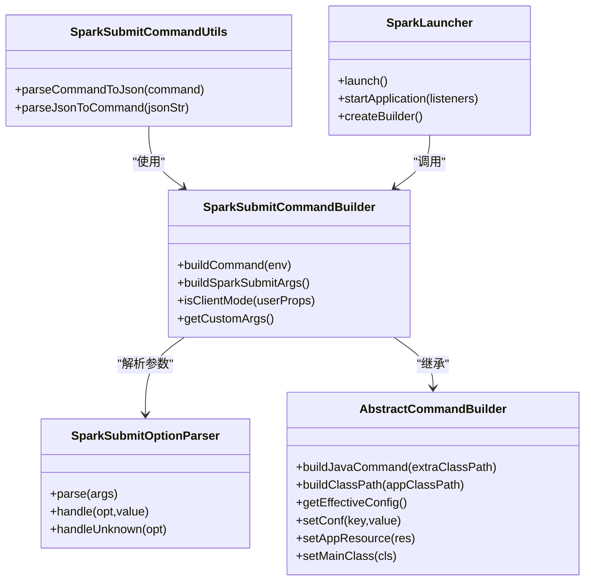

# Spark节点

<cite>
**本文引用的文件**
- [SparkSubmitCode.java](file://spec/src/main/java/com/aliyun/dataworks/common/spec/domain/dw/codemodel/SparkSubmitCode.java)
- [SparkSubmitCommandBuilder.java](file://client/client-spark-utils/src/main/java/com/aliyun/dataworks/client/utils/spark/command/SparkSubmitCommandBuilder.java)
- [SparkSubmitOptionParser.java](file://client/client-spark-utils/src/main/java/com/aliyun/dataworks/client/utils/spark/command/SparkSubmitOptionParser.java)
- [AbstractCommandBuilder.java](file://client/client-spark-utils/src/main/java/com/aliyun/dataworks/client/utils/spark/command/AbstractCommandBuilder.java)
- [SparkSubmitCommandUtils.java](file://client/client-spark-utils/src/main/java/com/aliyun/dataworks/client/utils/spark/command/SparkSubmitCommandUtils.java)
- [SparkLauncher.java](file://client/client-spark-utils/src/main/java/com/aliyun/dataworks/client/utils/spark/command/SparkLauncher.java)
- [SparkSubmitCommandUtilsTest.java](file://client/client-spark-utils/src/test/java/com/aliyun/dataworks/client/utils/spark/command/SparkSubmitCommandUtilsTest.java)
- [CodeProgramType.java](file://spec/src/main/java/com/aliyun/dataworks/common/spec/domain/dw/types/CodeProgramType.java)
</cite>

## 目录
1. [简介](#简介)
2. [项目结构](#项目结构)
3. [核心组件](#核心组件)
4. [架构总览](#架构总览)
5. [详细组件分析](#详细组件分析)
6. [依赖关系分析](#依赖关系分析)
7. [性能考量](#性能考量)
8. [故障排查指南](#故障排查指南)
9. [结论](#结论)
10. [附录](#附录)

## 简介
本文件面向数据开发与运维工程师，系统化阐述Spark节点在本仓库中的实现与使用方式，重点围绕SparkSubmitCode类与其在客户端侧的命令生成与执行链路展开，覆盖如下主题：
- SparkSubmitCode与spark-submit命令行工具的映射关系
- 参数构造逻辑与执行流程
- 部署模式（client/cluster）与资源（executor数量、内存、CPU核数）配置
- 依赖管理（JAR/PY文件、自定义配置）
- SparkSubmitCommandBuilder如何依据FlowSpec定义生成完整spark-submit命令
- SparkSubmitOptionParser如何验证与解析命令行参数
- 不同场景（批处理、流式、交互式）的配置示例
- 性能调优建议与常见问题解决方案

## 项目结构
围绕Spark节点的关键代码位于以下模块：
- 规格模型层：spec模块中的SparkSubmitCode，承载“ADB Spark”类型的代码模型
- 客户端命令生成与执行：client-spark-utils模块中的命令构建、选项解析、启动器等

图表来源
- [SparkSubmitCode.java](file://spec/src/main/java/com/aliyun/dataworks/common/spec/domain/dw/codemodel/SparkSubmitCode.java#L1-L51)
- [CodeProgramType.java](file://spec/src/main/java/com/aliyun/dataworks/common/spec/domain/dw/types/CodeProgramType.java#L170-L176)
- [SparkSubmitCommandBuilder.java](file://client/client-spark-utils/src/main/java/com/aliyun/dataworks/client/utils/spark/command/SparkSubmitCommandBuilder.java#L1-L593)
- [SparkSubmitOptionParser.java](file://client/client-spark-utils/src/main/java/com/aliyun/dataworks/client/utils/spark/command/SparkSubmitOptionParser.java#L1-L239)
- [AbstractCommandBuilder.java](file://client/client-spark-utils/src/main/java/com/aliyun/dataworks/client/utils/spark/command/AbstractCommandBuilder.java#L1-L407)
- [SparkSubmitCommandUtils.java](file://client/client-spark-utils/src/main/java/com/aliyun/dataworks/client/utils/spark/command/SparkSubmitCommandUtils.java#L1-L115)
- [SparkLauncher.java](file://client/client-spark-utils/src/main/java/com/aliyun/dataworks/client/utils/spark/command/SparkLauncher.java#L1-L499)

章节来源
- [SparkSubmitCode.java](file://spec/src/main/java/com/aliyun/dataworks/common/spec/domain/dw/codemodel/SparkSubmitCode.java#L1-L51)
- [SparkSubmitCommandBuilder.java](file://client/client-spark-utils/src/main/java/com/aliyun/dataworks/client/utils/spark/command/SparkSubmitCommandBuilder.java#L1-L593)
- [SparkSubmitOptionParser.java](file://client/client-spark-utils/src/main/java/com/aliyun/dataworks/client/utils/spark/command/SparkSubmitOptionParser.java#L1-L239)
- [AbstractCommandBuilder.java](file://client/client-spark-utils/src/main/java/com/aliyun/dataworks/client/utils/spark/command/AbstractCommandBuilder.java#L1-L407)
- [SparkSubmitCommandUtils.java](file://client/client-spark-utils/src/main/java/com/aliyun/dataworks/client/utils/spark/command/SparkSubmitCommandUtils.java#L1-L115)
- [SparkLauncher.java](file://client/client-spark-utils/src/main/java/com/aliyun/dataworks/client/utils/spark/command/SparkLauncher.java#L1-L499)
- [CodeProgramType.java](file://spec/src/main/java/com/aliyun/dataworks/common/spec/domain/dw/types/CodeProgramType.java#L170-L176)

## 核心组件
- SparkSubmitCode：ADB Spark类型的代码模型载体，继承自JsonObjectCode，提供解析与程序类型声明
- SparkSubmitCommandBuilder：面向spark-submit的命令构建器，负责解析与拼装参数、区分特殊命令（如pyspark/sparkr、examples），并按client/cluster模式生成最终命令
- SparkSubmitOptionParser：统一的spark-submit选项解析器，维护官方选项清单与开关项，提供回调扩展点
- AbstractCommandBuilder：通用命令构建基类，封装类路径、配置合并、环境变量、JVM参数加载等
- SparkSubmitCommandUtils：提供spark-submit命令与ADB Spark JSON之间的双向转换
- SparkLauncher：将构建好的命令交由外部spark-submit脚本执行，支持日志重定向、工作目录、输出重定向等

章节来源
- [SparkSubmitCode.java](file://spec/src/main/java/com/aliyun/dataworks/common/spec/domain/dw/codemodel/SparkSubmitCode.java#L1-L51)
- [SparkSubmitCommandBuilder.java](file://client/client-spark-utils/src/main/java/com/aliyun/dataworks/client/utils/spark/command/SparkSubmitCommandBuilder.java#L1-L593)
- [SparkSubmitOptionParser.java](file://client/client-spark-utils/src/main/java/com/aliyun/dataworks/client/utils/spark/command/SparkSubmitOptionParser.java#L1-L239)
- [AbstractCommandBuilder.java](file://client/client-spark-utils/src/main/java/com/aliyun/dataworks/client/utils/spark/command/AbstractCommandBuilder.java#L1-L407)
- [SparkSubmitCommandUtils.java](file://client/client-spark-utils/src/main/java/com/aliyun/dataworks/client/utils/spark/command/SparkSubmitCommandUtils.java#L1-L115)
- [SparkLauncher.java](file://client/client-spark-utils/src/main/java/com/aliyun/dataworks/client/utils/spark/command/SparkLauncher.java#L1-L499)

## 架构总览
从“规格定义”到“命令执行”的整体流程如下：

图表来源
- [SparkSubmitCommandUtils.java](file://client/client-spark-utils/src/main/java/com/aliyun/dataworks/client/utils/spark/command/SparkSubmitCommandUtils.java#L72-L114)
- [SparkSubmitCommandBuilder.java](file://client/client-spark-utils/src/main/java/com/aliyun/dataworks/client/utils/spark/command/SparkSubmitCommandBuilder.java#L132-L171)
- [SparkSubmitOptionParser.java](file://client/client-spark-utils/src/main/java/com/aliyun/dataworks/client/utils/spark/command/SparkSubmitOptionParser.java#L128-L193)
- [AbstractCommandBuilder.java](file://client/client-spark-utils/src/main/java/com/aliyun/dataworks/client/utils/spark/command/AbstractCommandBuilder.java#L267-L304)
- [SparkLauncher.java](file://client/client-spark-utils/src/main/java/com/aliyun/dataworks/client/utils/spark/command/SparkLauncher.java#L437-L498)

## 详细组件分析

### SparkSubmitCode：ADB Spark代码模型
- 角色定位：承载“ADB Spark”类型的代码模型，提供JSON解析与程序类型标识
- 关键点：
  - 继承JsonObjectCode，复用JSON解析能力
  - getProgramTypes返回ADB_SPARK，与CodeProgramType枚举一致
- 与FlowSpec的关系：通过SparkSubmitCommandUtils在命令/JSON之间互转，从而将FlowSpec中的spark-submit配置映射到代码模型

章节来源
- [SparkSubmitCode.java](file://spec/src/main/java/com/aliyun/dataworks/common/spec/domain/dw/codemodel/SparkSubmitCode.java#L1-L51)
- [CodeProgramType.java](file://spec/src/main/java/com/aliyun/dataworks/common/spec/domain/dw/types/CodeProgramType.java#L170-L176)

### SparkSubmitCommandBuilder：命令构建与参数解析
- 主要职责
  - 解析spark-submit命令行，识别特殊命令（pyspark-shell、sparkr-shell、run-example）
  - 将参数映射到内部配置（主类、应用名、部署模式、驱动/执行器资源、JAR/PY文件、自定义参数等）
  - 生成最终的spark-submit参数列表
  - 区分client/cluster模式，按模式设置JVM参数与类路径
- 关键实现要点
  - OptionParser内部类：覆盖handle与handleUnknown，完成参数到conf/appResource/mainClass等的映射；支持混合参数（如spark-shell允许混参）
  - buildSparkSubmitArgs：按顺序组装--master/--deploy-mode/--name/--conf/--properties-file/--jars/--files/--py-files/--class等
  - isClientMode：综合master/deployMode判断是否client模式，决定是否注入-Xmx与额外类路径
  - buildSparkSubmitCommand：构建java命令（含类路径与JVM参数），再添加org.apache.spark.deploy.SparkSubmit与参数
  - pyspark/sparkr：通过环境变量传递提交参数，避免直接透传敏感参数
  - examples：自动扫描examples/jars并注入

图表来源
- [SparkSubmitCommandBuilder.java](file://client/client-spark-utils/src/main/java/com/aliyun/dataworks/client/utils/spark/command/SparkSubmitCommandBuilder.java#L132-L171)
- [SparkSubmitCommandBuilder.java](file://client/client-spark-utils/src/main/java/com/aliyun/dataworks/client/utils/spark/command/SparkSubmitCommandBuilder.java#L185-L267)
- [SparkSubmitCommandBuilder.java](file://client/client-spark-utils/src/main/java/com/aliyun/dataworks/client/utils/spark/command/SparkSubmitCommandBuilder.java#L269-L317)
- [SparkSubmitCommandBuilder.java](file://client/client-spark-utils/src/main/java/com/aliyun/dataworks/client/utils/spark/command/SparkSubmitCommandBuilder.java#L319-L381)
- [SparkSubmitCommandBuilder.java](file://client/client-spark-utils/src/main/java/com/aliyun/dataworks/client/utils/spark/command/SparkSubmitCommandBuilder.java#L383-L397)
- [SparkSubmitCommandBuilder.java](file://client/client-spark-utils/src/main/java/com/aliyun/dataworks/client/utils/spark/command/SparkSubmitCommandBuilder.java#L399-L406)

章节来源
- [SparkSubmitCommandBuilder.java](file://client/client-spark-utils/src/main/java/com/aliyun/dataworks/client/utils/spark/command/SparkSubmitCommandBuilder.java#L1-L593)

### SparkSubmitOptionParser：选项解析与验证
- 维护官方spark-submit选项清单与开关项
- 解析流程
  - 支持形如--option=value的等号形式
  - 逐个匹配opts与switches，未知选项进入handleUnknown
  - 对带值选项，若缺少值抛出异常
  - handle与handleUnknown为扩展点，子类可覆盖行为
- 与AbstractLauncher/CommandBuilder的协作
  - AbstractLauncher.addSparkArg通过ArgumentValidator委托解析，确保已知参数确实带值或不带值
  - SparkSubmitCommandBuilder.OptionParser覆盖handle，将参数写入conf/appResource/mainClass等

章节来源
- [SparkSubmitOptionParser.java](file://client/client-spark-utils/src/main/java/com/aliyun/dataworks/client/utils/spark/command/SparkSubmitOptionParser.java#L1-L239)
- [AbstractCommandBuilder.java](file://client/client-spark-utils/src/main/java/com/aliyun/dataworks/client/utils/spark/command/AbstractCommandBuilder.java#L267-L304)
- [SparkSubmitCommandBuilder.java](file://client/client-spark-utils/src/main/java/com/aliyun/dataworks/client/utils/spark/command/SparkSubmitCommandBuilder.java#L441-L588)

### AbstractCommandBuilder：通用构建基类
- 职责
  - 统一管理appArgs、jars、files、pyFiles、conf、childEnv等
  - 合并用户属性文件与显式conf，缓存有效配置
  - 构建类路径（含SPARK_HOME/conf、JARs、HADOOP/YARN配置、Dist Classpath等）
  - 生成java命令（含JAVA_OPTS/java-opts文件）
- 与SparkSubmitCommandBuilder的协作
  - SparkSubmitCommandBuilder继承该基类，复用类路径与配置合并能力

章节来源
- [AbstractCommandBuilder.java](file://client/client-spark-utils/src/main/java/com/aliyun/dataworks/client/utils/spark/command/AbstractCommandBuilder.java#L1-L407)

### SparkSubmitCommandUtils：命令与JSON互转
- parseCommandToJson：将spark-submit命令解析为JSON，提取args、file、name、className、conf、jars、pyFiles、customArgs
- parseJsonToCommand：将JSON还原为spark-submit命令字符串，支持customArgs原样透传
- 测试用例验证了典型参数（如--executor-memory、--conf、--jars、--class、--deploy-mode等）的映射正确性

章节来源
- [SparkSubmitCommandUtils.java](file://client/client-spark-utils/src/main/java/com/aliyun/dataworks/client/utils/spark/command/SparkSubmitCommandUtils.java#L1-L115)
- [SparkSubmitCommandUtilsTest.java](file://client/client-spark-utils/src/test/java/com/aliyun/dataworks/client/utils/spark/command/SparkSubmitCommandUtilsTest.java#L1-L136)

### SparkLauncher：进程启动与输出重定向
- 作用
  - 通过findSparkSubmit定位spark-submit脚本
  - 将构建好的命令交由ProcessBuilder执行
  - 支持输出/错误流重定向至日志或文件
  - 与LauncherServer配合，提供更精细的应用生命周期管理
- 与命令构建链路衔接
  - SparkLauncher.createBuilder调用SparkSubmitCommandBuilder.buildSparkSubmitArgs生成参数
  - Windows环境下对参数进行批处理脚本安全转义

章节来源
- [SparkLauncher.java](file://client/client-spark-utils/src/main/java/com/aliyun/dataworks/client/utils/spark/command/SparkLauncher.java#L437-L498)

## 依赖关系分析

图表来源
- [SparkSubmitCommandBuilder.java](file://client/client-spark-utils/src/main/java/com/aliyun/dataworks/client/utils/spark/command/SparkSubmitCommandBuilder.java#L1-L593)
- [SparkSubmitOptionParser.java](file://client/client-spark-utils/src/main/java/com/aliyun/dataworks/client/utils/spark/command/SparkSubmitOptionParser.java#L1-L239)
- [AbstractCommandBuilder.java](file://client/client-spark-utils/src/main/java/com/aliyun/dataworks/client/utils/spark/command/AbstractCommandBuilder.java#L1-L407)
- [SparkSubmitCommandUtils.java](file://client/client-spark-utils/src/main/java/com/aliyun/dataworks/client/utils/spark/command/SparkSubmitCommandUtils.java#L1-L115)
- [SparkLauncher.java](file://client/client-spark-utils/src/main/java/com/aliyun/dataworks/client/utils/spark/command/SparkLauncher.java#L437-L498)

章节来源
- [SparkSubmitCommandBuilder.java](file://client/client-spark-utils/src/main/java/com/aliyun/dataworks/client/utils/spark/command/SparkSubmitCommandBuilder.java#L1-L593)
- [SparkSubmitOptionParser.java](file://client/client-spark-utils/src/main/java/com/aliyun/dataworks/client/utils/spark/command/SparkSubmitOptionParser.java#L1-L239)
- [AbstractCommandBuilder.java](file://client/client-spark-utils/src/main/java/com/aliyun/dataworks/client/utils/spark/command/AbstractCommandBuilder.java#L1-L407)
- [SparkSubmitCommandUtils.java](file://client/client-spark-utils/src/main/java/com/aliyun/dataworks/client/utils/spark/command/SparkSubmitCommandUtils.java#L1-L115)
- [SparkLauncher.java](file://client/client-spark-utils/src/main/java/com/aliyun/dataworks/client/utils/spark/command/SparkLauncher.java#L437-L498)

## 性能考量
- 驱动内存与-Xmx限制
  - client模式下会注入-Xmx，应通过--driver-memory或spark.driver.memory配置，避免在driver-java-options中直接指定Xmx
- 执行器资源配置
  - 通过--executor-memory、--executor-cores、--num-executors控制执行器实例数与资源
  - 与spark.executor.memory/spark.executor.cores/spark.executor.instances保持一致
- 类路径与JAR管理
  - 优先使用--jars与--py-files集中管理依赖，减少动态下载开销
  - examples模式会自动扫描examples/jars，生产环境建议明确指定JAR位置
- 日志与输出重定向
  - 使用redirectToLog或redirectOutput/redirectError减少stdout/stderr阻塞，提升吞吐
- 并发与队列
  - YARN队列通过--queue指定，避免默认队列争抢

[本节为通用指导，无需列出具体文件来源]

## 故障排查指南
- “缺少参数值”异常
  - 现象：解析--option但未提供值
  - 处理：确认命令行中--option=value或--option与值在同一位置
  - 参考：[SparkSubmitOptionParser.java](file://client/client-spark-utils/src/main/java/com/aliyun/dataworks/client/utils/spark/command/SparkSubmitOptionParser.java#L135-L171)
- “未知选项”异常
  - 现象：出现未识别的--option
  - 处理：确认是否为自定义参数，必要时通过customArgs透传；或修正为官方选项
  - 参考：[SparkSubmitCommandBuilder.java](file://client/client-spark-utils/src/main/java/com/aliyun/dataworks/client/utils/spark/command/SparkSubmitCommandBuilder.java#L545-L580)
- “Xmx冲突”异常
  - 现象：在driver-java-options中设置了最大堆
  - 处理：改用--driver-memory或spark.driver.memory
  - 参考：[SparkSubmitCommandBuilder.java](file://client/client-spark-utils/src/main/java/com/aliyun/dataworks/client/utils/spark/command/SparkSubmitCommandBuilder.java#L285-L293)
- “缺少应用资源/主类”
  - 现象：普通模式下未提供appResource或mainClass
  - 处理：确保--class与应用资源文件存在；examples模式下需提供示例类名
  - 参考：[SparkSubmitCommandBuilder.java](file://client/client-spark-utils/src/main/java/com/aliyun/dataworks/client/utils/spark/command/SparkSubmitCommandBuilder.java#L251-L266)
- “pyspark/sparkr参数透传”
  - 现象：直接运行python/R脚本被拒绝
  - 处理：通过环境变量传递提交参数，而非直接透传
  - 参考：[SparkSubmitCommandBuilder.java](file://client/client-spark-utils/src/main/java/com/aliyun/dataworks/client/utils/spark/command/SparkSubmitCommandBuilder.java#L319-L381)

章节来源
- [SparkSubmitOptionParser.java](file://client/client-spark-utils/src/main/java/com/aliyun/dataworks/client/utils/spark/command/SparkSubmitOptionParser.java#L135-L171)
- [SparkSubmitCommandBuilder.java](file://client/client-spark-utils/src/main/java/com/aliyun/dataworks/client/utils/spark/command/SparkSubmitCommandBuilder.java#L251-L293)
- [SparkSubmitCommandBuilder.java](file://client/client-spark-utils/src/main/java/com/aliyun/dataworks/client/utils/spark/command/SparkSubmitCommandBuilder.java#L319-L381)

## 结论
本仓库通过SparkSubmitCode与SparkSubmitCommandBuilder/OptionParser/AbstractCommandBuilder/SparkSubmitCommandUtils/SparkLauncher等组件，形成从“规格/JSON到命令行再到进程执行”的完整闭环。其优势在于：
- 统一的选项解析与参数映射，保证与spark-submit语义一致
- 对client/cluster模式的差异化处理，确保驱动内存与类路径正确注入
- 对pyspark/sparkr/examples等特殊场景的适配
- JSON与命令互转能力，便于FlowSpec落地与调试

[本节为总结，无需列出具体文件来源]

## 附录

### 部署模式与资源配置
- 部署模式
  - client：driver在提交客户端运行，适合交互式分析与小规模任务
  - cluster：driver在集群节点运行，适合大规模批处理
  - 通过--deploy-mode或spark.submit.deployMode配置
- 资源配置
  - 驱动：--driver-memory、--driver-cores、--driver-java-options、--driver-class-path、--driver-library-path
  - 执行器：--executor-memory、--executor-cores、--num-executors、--total-executor-cores
  - 队列：--queue（YARN）
  - 应用元信息：--name、--class、--files、--jars、--py-files

章节来源
- [SparkSubmitCommandBuilder.java](file://client/client-spark-utils/src/main/java/com/aliyun/dataworks/client/utils/spark/command/SparkSubmitCommandBuilder.java#L185-L267)
- [SparkSubmitOptionParser.java](file://client/client-spark-utils/src/main/java/com/aliyun/dataworks/client/utils/spark/command/SparkSubmitOptionParser.java#L31-L115)

### 依赖管理方式
- JAR/PY文件
  - 使用--jars与--py-files集中管理，避免分散依赖
  - examples模式自动扫描examples/jars
- 自定义配置
  - 使用--conf key=value注入spark配置
  - 使用--properties-file加载配置文件

章节来源
- [SparkSubmitCommandBuilder.java](file://client/client-spark-utils/src/main/java/com/aliyun/dataworks/client/utils/spark/command/SparkSubmitCommandBuilder.java#L222-L249)
- [AbstractCommandBuilder.java](file://client/client-spark-utils/src/main/java/com/aliyun/dataworks/client/utils/spark/command/AbstractCommandBuilder.java#L267-L304)

### 不同应用场景配置示例（基于命令/JSON互转）
- 常规批处理作业
  - 关键参数：--class、--executor-memory、--executor-cores、--num-executors、--name
  - 参考测试用例：[SparkSubmitCommandUtilsTest.java](file://client/client-spark-utils/src/test/java/com/aliyun/dataworks/client/utils/spark/command/SparkSubmitCommandUtilsTest.java#L30-L86)
- 流式计算作业
  - 关键参数：--class、--driver-memory、--executor-memory、--supervise、--queue（YARN）
  - 参考测试用例：[SparkSubmitCommandUtilsTest.java](file://client/client-spark-utils/src/test/java/com/aliyun/dataworks/client/utils/spark/command/SparkSubmitCommandUtilsTest.java#L88-L135)
- 交互式分析
  - 关键参数：--class、--driver-memory、--driver-cores、--name、--deploy-mode client
  - 参考实现：[SparkSubmitCommandBuilder.java](file://client/client-spark-utils/src/main/java/com/aliyun/dataworks/client/utils/spark/command/SparkSubmitCommandBuilder.java#L399-L406)

章节来源
- [SparkSubmitCommandUtilsTest.java](file://client/client-spark-utils/src/test/java/com/aliyun/dataworks/client/utils/spark/command/SparkSubmitCommandUtilsTest.java#L30-L135)
- [SparkSubmitCommandBuilder.java](file://client/client-spark-utils/src/main/java/com/aliyun/dataworks/client/utils/spark/command/SparkSubmitCommandBuilder.java#L399-L406)