# 计算节点

<cite>
**本文档引用的文件**
- [emr-spark.md](file://docs/spec-templates/nodes/emr-spark.md)
- [pai-studio.md](file://docs/spec-templates/nodes/pai-studio.md)
- [pai-flow.md](file://docs/spec-templates/nodes/pai-flow.md)
- [EmrCode.java](file://spec/src/main/java/com/aliyun/dataworks/common/spec/domain/dw/codemodel/EmrCode.java)
- [PaiCode.java](file://spec/src/main/java/com/aliyun/dataworks/common/spec/domain/dw/codemodel/PaiCode.java)
- [SparkSubmitCode.java](file://spec/src/main/java/com/aliyun/dataworks/common/spec/domain/dw/codemodel/SparkSubmitCode.java)
- [CalcEngineType.java](file://spec/src/main/java/com/aliyun/dataworks/common/spec/domain/dw/types/CalcEngineType.java)
- [CodeProgramType.java](file://spec/src/main/java/com/aliyun/dataworks/common/spec/domain/dw/types/CodeProgramType.java)
- [CodeModelFactory.java](file://spec/src/main/java/com/aliyun/dataworks/common/spec/domain/dw/codemodel/CodeModelFactory.java)
- [node.schema.json](file://schema/node.schema.json)
</cite>

## 目录
1. [引言](#引言)
2. [计算节点类型体系](#计算节点类型体系)
3. [核心代码模型](#核心代码模型)
4. [计算引擎类型](#计算引擎类型)
5. [EMR节点详解](#emr节点详解)
6. [PAI节点详解](#pai节点详解)
7. [Spark节点详解](#spark节点详解)
8. [典型配置示例](#典型配置示例)
9. [使用场景分析](#使用场景分析)
10. [总结](#总结)

## 引言

计算节点是dataworks-spec项目中的核心组件，用于定义和执行各种数据处理任务。本文档详细说明EMR节点、PAI节点、Spark节点等各种计算节点的类型体系和实现机制，解释EmrCode、PaiCode和SparkSubmitCode在计算节点中的核心作用，以及如何通过代码模型配置不同的计算资源和执行参数。

## 计算节点类型体系

计算节点在dataworks-spec项目中通过`CodeProgramType`枚举进行分类，每个类型对应特定的计算引擎和执行模式。计算节点的类型体系基于`CodeProgramType`和`CalcEngineType`两个核心枚举构建，形成了层次化的分类结构。

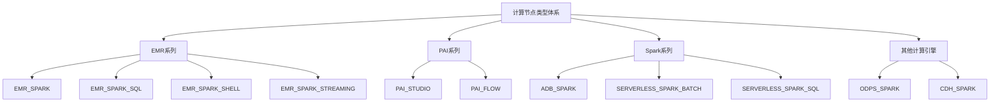

**图源**
- [CodeProgramType.java](file://spec/src/main/java/com/aliyun/dataworks/common/spec/domain/dw/types/CodeProgramType.java)
- [CalcEngineType.java](file://spec/src/main/java/com/aliyun/dataworks/common/spec/domain/dw/types/CalcEngineType.java)

**本节来源**
- [CodeProgramType.java](file://spec/src/main/java/com/aliyun/dataworks/common/spec/domain/dw/types/CodeProgramType.java)
- [CalcEngineType.java](file://spec/src/main/java/com/aliyun/dataworks/common/spec/domain/dw/types/CalcEngineType.java)

## 核心代码模型

计算节点的核心实现依赖于三个关键的代码模型类：EmrCode、PaiCode和SparkSubmitCode。这些模型类负责解析和序列化计算节点的配置信息，是计算节点功能实现的基础。

### EmrCode模型

EmrCode是EMR系列计算节点的核心代码模型，继承自AbstractBaseCode，用于处理EMR集群上的各种作业类型。该模型通过EmrJobType枚举定义了不同的作业类型，包括SPARK、SPARK_SQL、SPARK_SHELL等。

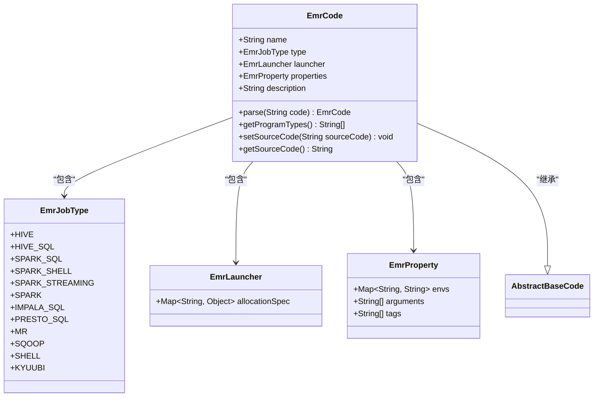

**图源**
- [EmrCode.java](file://spec/src/main/java/com/aliyun/dataworks/common/spec/domain/dw/codemodel/EmrCode.java)
- [EmrJobType.java](file://spec/src/main/java/com/aliyun/dataworks/common/spec/domain/dw/codemodel/EmrJobType.java)

**本节来源**
- [EmrCode.java](file://spec/src/main/java/com/aliyun/dataworks/common/spec/domain/dw/codemodel/EmrCode.java)

### PaiCode模型

PaiCode是PAI系列计算节点的核心代码模型，用于处理机器学习和深度学习任务。该模型支持PAI Studio和PAI Flow等复杂的工作流编排。

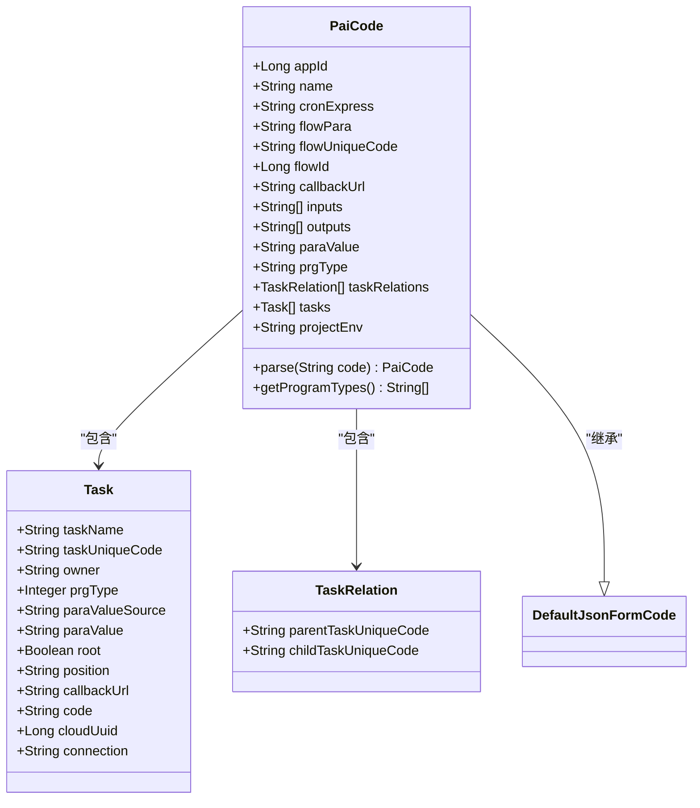

**图源**
- [PaiCode.java](file://spec/src/main/java/com/aliyun/dataworks/common/spec/domain/dw/codemodel/PaiCode.java)

**本节来源**
- [PaiCode.java](file://spec/src/main/java/com/aliyun/dataworks/common/spec/domain/dw/codemodel/PaiCode.java)

### SparkSubmitCode模型

SparkSubmitCode是Spark系列计算节点的核心代码模型，专门用于处理Spark Submit作业。该模型相对简单，主要包含命令和JSON配置。

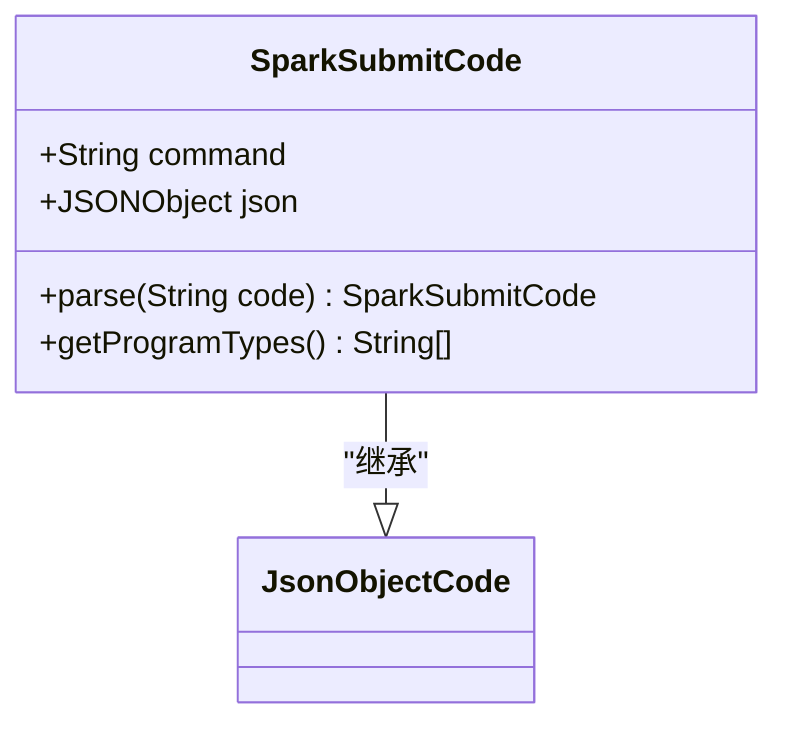

**图源**
- [SparkSubmitCode.java](file://spec/src/main/java/com/aliyun/dataworks/common/spec/domain/dw/codemodel/SparkSubmitCode.java)

**本节来源**
- [SparkSubmitCode.java](file://spec/src/main/java/com/aliyun/dataworks/common/spec/domain/dw/codemodel/SparkSubmitCode.java)

## 计算引擎类型

计算引擎类型通过`CalcEngineType`枚举定义，是计算节点分类的基础。每个计算引擎类型对应特定的计算平台和资源管理方式。

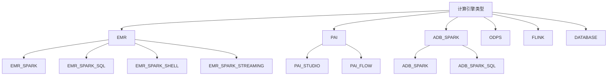

**图源**
- [CalcEngineType.java](file://spec/src/main/java/com/aliyun/dataworks/common/spec/domain/dw/types/CalcEngineType.java)

**本节来源**
- [CalcEngineType.java](file://spec/src/main/java/com/aliyun/dataworks/common/spec/domain/dw/types/CalcEngineType.java)

## EMR节点详解

EMR节点是基于EMR（Elastic MapReduce）集群的计算节点，支持多种作业类型和执行模式。EMR节点通过EmrCode模型进行配置和管理。

### EMR节点类型

EMR节点支持多种作业类型，通过`CodeProgramType`枚举定义：

- **EMR_SPARK**: 用于提交Spark作业，支持Jar包和Python脚本
- **EMR_SPARK_SQL**: 用于执行Spark SQL查询
- **EMR_SPARK_SHELL**: 用于执行Spark Shell命令
- **EMR_SPARK_STREAMING**: 用于执行Spark Streaming流式计算
- **EMR_HIVE**: 用于执行Hive SQL查询
- **EMR_PRESTO**: 用于执行Presto SQL查询
- **EMR_SHELL**: 用于执行Shell脚本

### EMR节点配置

EMR节点的配置主要通过`emrJobConfig`对象进行，包含以下关键属性：

- **jobMode**: 作业模式，如LOCAL
- **jobType**: 作业类型，如SPARK
- **executeMode**: 执行模式，如Single
- **clusterId**: EMR集群ID
- **args**: 命令行参数
- **sparkConf**: Spark配置参数
- **files**: 依赖文件
- **jars**: 依赖Jar包
- **mainClass**: 主类名
- **mainJar**: 主Jar包

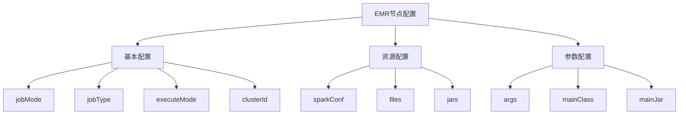

**图源**
- [emr-spark.md](file://docs/spec-templates/nodes/emr-spark.md)
- [EmrCode.java](file://spec/src/main/java/com/aliyun/dataworks/common/spec/domain/dw/codemodel/EmrCode.java)

**本节来源**
- [emr-spark.md](file://docs/spec-templates/nodes/emr-spark.md)
- [EmrCode.java](file://spec/src/main/java/com/aliyun/dataworks/common/spec/domain/dw/codemodel/EmrCode.java)

## PAI节点详解

PAI节点是基于PAI（Platform of Artificial Intelligence）平台的计算节点，专门用于机器学习和深度学习任务。PAI节点支持PAI Studio和PAI Flow两种主要类型。

### PAI节点类型

PAI节点主要分为两种类型：

- **PAI_STUDIO**: 用于执行PAI Studio中的机器学习任务
- **PAI_FLOW**: 用于执行复杂的AI工作流编排

### PAI节点配置

PAI节点的配置相对复杂，包含多个关键属性：

- **appId**: 应用ID
- **name**: 任务名称
- **cronExpress**: Cron表达式
- **flowPara**: 流程参数
- **flowUniqueCode**: 流程唯一代码
- **flowId**: 流程ID
- **callbackUrl**: 回调URL
- **inputs**: 输入参数
- **outputs**: 输出参数
- **paraValue**: 参数值
- **prgType**: 程序类型
- **taskRelations**: 任务关系
- **tasks**: 任务列表
- **projectEnv**: 项目环境

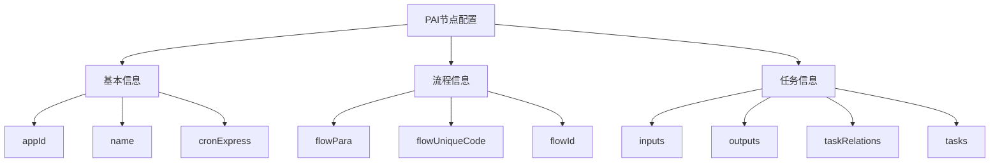

**图源**
- [pai-studio.md](file://docs/spec-templates/nodes/pai-studio.md)
- [pai-flow.md](file://docs/spec-templates/nodes/pai-flow.md)
- [PaiCode.java](file://spec/src/main/java/com/aliyun/dataworks/common/spec/domain/dw/codemodel/PaiCode.java)

**本节来源**
- [pai-studio.md](file://docs/spec-templates/nodes/pai-studio.md)
- [pai-flow.md](file://docs/spec-templates/nodes/pai-flow.md)
- [PaiCode.java](file://spec/src/main/java/com/aliyun/dataworks/common/spec/domain/dw/codemodel/PaiCode.java)

## Spark节点详解

Spark节点是专门用于执行Spark作业的计算节点，支持多种Spark作业类型和执行模式。

### Spark节点类型

Spark节点支持以下类型：

- **EMR_SPARK**: 在EMR集群上执行Spark作业
- **ODPS_SPARK**: 在ODPS平台上执行Spark作业
- **ADB_SPARK**: 在ADB Spark上执行Spark作业
- **SERVERLESS_SPARK_BATCH**: 无服务器模式的批处理Spark作业
- **SERVERLESS_SPARK_SQL**: 无服务器模式的Spark SQL作业

### Spark节点配置

Spark节点的配置主要通过`sparkConf`参数进行，包含以下常用配置：

| 参数 | 说明 | 推荐值 |
|------|------|--------|
| spark.executor.memory | Executor内存 | 4g-8g |
| spark.executor.cores | Executor CPU核数 | 2-4 |
| spark.executor.instances | Executor实例数 | 根据数据量调整 |
| spark.driver.memory | Driver内存 | 1g-2g |
| spark.sql.shuffle.partitions | Shuffle分区数 | 200-500 |
| spark.dynamicAllocation.enabled | 动态资源分配 | true |
| spark.serializer | 序列化器 | KryoSerializer |

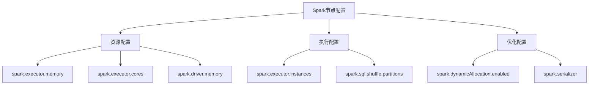

**图源**
- [emr-spark.md](file://docs/spec-templates/nodes/emr-spark.md)
- [SparkSubmitCode.java](file://spec/src/main/java/com/aliyun/dataworks/common/spec/domain/dw/codemodel/SparkSubmitCode.java)

**本节来源**
- [emr-spark.md](file://docs/spec-templates/nodes/emr-spark.md)
- [SparkSubmitCode.java](file://spec/src/main/java/com/aliyun/dataworks/common/spec/domain/dw/codemodel/SparkSubmitCode.java)

## 典型配置示例

### EMR Spark批处理作业

```json
{
  "id": "node_emr_spark_001",
  "name": "spark_batch_processing",
  "recurrence": "Normal",
  "priority": 3,
  "timeout": 7200,
  "instanceMode": "T+1",
  "rerunMode": "Allowed",
  "script": {
    "path": "/emr/spark_jobs/batch_processing.sh",
    "language": "shell",
    "runtime": {
      "engine": "EMR",
      "command": "EMR_SPARK",
      "emrJobConfig": {
        "jobMode": "LOCAL",
        "jobType": "SPARK",
        "executeMode": "Single",
        "clusterId": "C-ABC123DEF456",
        "args": [
          "--date",
          "${bizdate}",
          "--input",
          "oss://bucket/input/",
          "--output",
          "oss://bucket/output/"
        ],
        "sparkConf": {
          "spark.executor.memory": "4g",
          "spark.executor.cores": "2",
          "spark.driver.memory": "2g",
          "spark.sql.shuffle.partitions": "200"
        },
        "files": [
          "oss://bucket/conf/application.conf"
        ],
        "jars": [
          "oss://bucket/libs/spark-job.jar"
        ],
        "mainClass": "com.example.SparkBatchJob",
        "mainJar": "oss://bucket/libs/spark-job.jar"
      }
    }
  }
}
```

**本节来源**
- [emr-spark.md](file://docs/spec-templates/nodes/emr-spark.md)

### PAI Studio机器学习任务

```json
{
  "script": {
    "path": "path/to/pai_studio",
    "runtime": {
      "command": "PAI_STUDIO"
    },
    "content": {
      "content": "{\"appId\":23620,\"computeResource\":{\"MaxCompute\":\"execution_maxcompute\"},\"connectionType\":\"MaxCompute\",\"description\":\"\",\"flowUniqueCode\":\"ee1b1797-9f7c-4937-b672-028c4ced649b\",\"inputs\":[],\"name\":\"haozhen-designer-001\",\"outputs\":[],\"paiflowArguments\":\"---\\\\narguments:\\\\n  parameters:\\\\n  - name: \\\\\\\"execution_maxcompute\\\\\\\"\\\\n    value:\\\\n      endpoint: \\\\\\\"http://service.odps.aliyun-inc.com/api\\\\\\\"\\\\n     odpsProject: \\\\\\\"dw_scheduler_pre_dev\\\\\\\"\\\\n      spec:\\\\n        endpoint: \\\\\\\"http://service.odps.aliyun-inc.com/api\\\\\\\"\\\\n        odpsProject: \\\\\\\"dw_scheduler_pre_dev\\\\\\\"\\\\n      resourceType: \\\\\\\"MaxCompute\\\\\\\"\\\\n\",\"paiflowParameters\":{},\"paiflowPipeline\":\"---\\\\napiVersion: \\\\\\\"core/v1\\\\\\\"\\\\nmetadata:\\\\n  provider: \\\\\\\"067848\\\\\\\"\\\\n  version: \\\\\\\"v1\\\\\\\"\\\\n  identifier: \\\\\\\"job-root-pipeline-identifier\\\\\\\"\\\\n  annotations: {}\\\\nspec:\\\\n  inputs:\\\\n    artifacts: []\\\\n    parameters:\\\\n    - name: \\\\\\\"execution_maxcompute\\\\\\\"\\\\n      type: \\\\\\\"Map\\\\\\\"\\\\n  arguments:\\\\n    artifacts: []\\\\n    parameters: []\\\\n  dependencies: []\\\\n  initContainers: []\\\\n  sideCarContainers: []\\\\n  pipelines:\\\\n  - apiVersion: \\\\\\\"core/v1\\\\\\\"\\\\n    metadata:\\\\n      provider: \\\\\\\"pai\\\\\\\"\\\\n      version: \\\\\\\"v1\\\\\\\"\\\\n      identifier: \\\\\\\"sql\\\\\\\"\\\\n      name: \\\\\\\"id-fdb222dd-1396-4cdc-baf8\\\\\\\"\\\\n      displayName: \\\\\\\"SQL脚本-1\\\\\\\"\\\\n      annotations: {}\\\\n    spec:\\\\n      arguments:\\\\n        artifacts: []\\\\n        parameters:\\\\n        - name: \\\\\\\"scriptMode\\\\\\\"\\\\n          value: false\\\\n        - name: \\\\\\\"addCreateTableStatement\\\\\\\"\\\\n          value: true\\\\n        - name: \\\\\\\"sql\\\\\\\"\\\\n          value: \\\\\\\"select 1;\\\\\\\"\\\\n        - name: \\\\\\\"execution\\\\\\\"\\\\n          from: \\\\\\\"{{inputs.parameters.execution_maxcompute}}\\\\\\\"\\\\n      dependencies: []\\\\n      initContainers: []\\\\n      sideCarContainers: []\\\\n      pipelines: []\\\\n      volumes: []\\\\n  - apiVersion: \\\\\\\"core/v1\\\\\\\"\\\\n    metadata:\\\\n      provider: \\\\\\\"pai\\\\\\\"\\\\n      version: \\\\\\\"v1\\\\\\\"\\\\n      identifier: \\\\\\\"sql\\\\\\\"\\\\n      name: \\\\\\\"id-c541f1eb-81b8-4e10-921b\\\\\\\"\\\\n      displayName: \\\\\\\"SQL脚本-2\\\\\\\"\\\\n      annotations: {}\\\\n    spec:\\\\n      arguments:\\\\n        artifacts:\\\\n        - name: \\\\\\\"inputTable3\\\\\\\"\\\\n          from: \\\\\\\"{{pipelines.id-fdb222dd-1396-4cdc-baf8.outputs.artifacts.outputTable}}\\\\\\\"\\\\n        parameters:\\\\n        - name: \\\\\\\"scriptMode\\\\\\\"\\\\n          value: false\\\\n        - name: \\\\\\\"addCreateTableStatement\\\\\\\"\\\\n          value: true\\\\n        - name: \\\\\\\"sql\\\\\\\"\\\\n          value: \\\\\\\"SELECT 2;\\\\\\\"\\\\n        - name: \\\\\\\"execution\\\\\\\"\\\\n          from: \\\\\\\"{{inputs.parameters.execution_maxcompute}}\\\\\\\"\\\\n      dependencies:\\\\n      - \\\\\\\"id-fdb222dd-1396-4cdc-baf8\\\\\\\"\\\\n      initContainers: []\\\\n      sideCarContainers: []\\\\n      pipelines: []\\\\n      volumes: []\\\\n  - apiVersion: \\\\\\\"core/v1\\\\\\\"\\\\n    metadata:\\\\n      provider: \\\\\\\"pai\\\\\\\"\\\\n      version: \\\\\\\"v1\\\\\\\"\\\\n      identifier: \\\\\\\"data_source\\\\\\\"\\\\n      name: \\\\\\\"id-151c5da3-ad9c-4be7-8ac3\\\\\\\"\\\\n      displayName: \\\\\\\"读数据表-1\\\\\\\"\\\\n      annotations: {}\\\\n    spec:\\\\n      arguments:\\\\n        artifacts: []\\\\n        parameters:\\\\n        - name: \\\\\\\"hasPartition\\\\\\\"\\\\n          value: \\\\\\\"false\\\\\\\"\\\\n        - name: \\\\\\\"execution\\\\\\\"\\\\n          from: \\\\\\\"{{inputs.parameters.execution_maxcompute}}\\\\\\\"\\\\n      dependencies: []\\\\n      initContainers: []\\\\n      sideCarContainers: []\\\\n      pipelines: []\\\\n      volumes: []\\\\n  volumes: []\\\\n\",\"paraValue\":\"--paiflow_endpoint=paiflowinner-share.aliyuncs.com --region=inner\",\"prgType\":\"1000138\",\"requestId\":\"7A497B66-62ED-52A3-A64D-F1EC7B61052A\",\"taskRelations\":[{\"childTaskUniqueCode\":\"id-c541f1eb-81b8-4e10-921b\",\"parentTaskUniqueCode\":\"id-fdb222dd-1396-4cdc-baf8\"}],\"tasks\":[{\"root\":true,\"taskName\":\"SQL脚本-1\",\"taskUniqueCode\":\"id-fdb222dd-1396-4cdc-baf8\"},{\"root\":false,\"taskName\":\"SQL脚本-2\",\"taskUniqueCode\":\"id-c541f1eb-81b8-4e10-921b\"},{\"root\":true,\"taskName\":\"读数据表-1\",\"taskUniqueCode\":\"id-151c5da3-ad9c-4be7-8ac3\"}],\"workspaceId\":\"23620\"}"
    }
  }
}
```

**本节来源**
- [pai-studio.md](file://docs/spec-templates/nodes/pai-studio.md)

### Spark Streaming流式计算

```json
{
  "script": {
    "runtime": {
      "command": "EMR_SPARK_STREAMING",
      "emrJobConfig": {
        "jobType": "SPARK_STREAMING",
        "sparkConf": {
          "spark.streaming.kafka.maxRatePerPartition": "10000",
          "spark.streaming.backpressure.enabled": "true",
          "spark.streaming.receiver.maxRate": "10000"
        }
      }
    }
  }
}
```

**本节来源**
- [emr-spark.md](file://docs/spec-templates/nodes/emr-spark.md)

### PySpark作业

```json
{
  "script": {
    "path": "/emr/pyspark/data_processing.py",
    "language": "python",
    "runtime": {
      "command": "EMR_SPARK",
      "emrJobConfig": {
        "mainJar": "local:///opt/spark/python/lib/pyspark.zip",
        "args": [
          "oss://bucket/scripts/data_processing.py",
          "--date", "${bizdate}"
        ],
        "files": [
          "oss://bucket/scripts/utils.py"
        ],
        "sparkConf": {
          "spark.pyspark.python": "/usr/bin/python3",
          "spark.pyspark.driver.python": "/usr/bin/python3"
        }
      }
    }
  }
}
```

**本节来源**
- [emr-spark.md](file://docs/spec-templates/nodes/emr-spark.md)

## 使用场景分析

### 批处理场景

批处理场景适用于处理大量静态数据，通常在固定时间点执行。EMR_SPARK节点是批处理场景的理想选择，可以处理TB级别的数据。

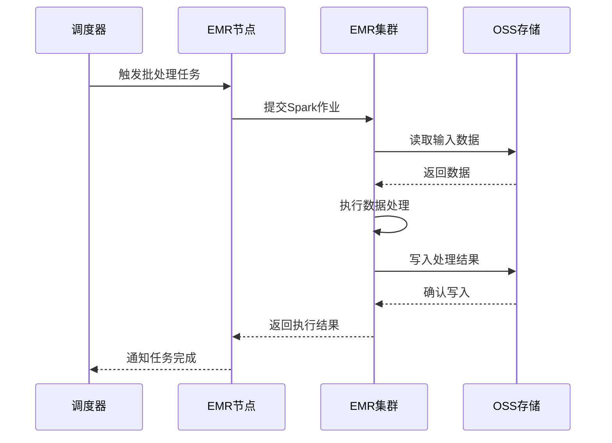

**图源**
- [emr-spark.md](file://docs/spec-templates/nodes/emr-spark.md)

**本节来源**
- [emr-spark.md](file://docs/spec-templates/nodes/emr-spark.md)

### 流式计算场景

流式计算场景适用于实时数据处理，需要低延迟和高吞吐量。EMR_SPARK_STREAMING节点是流式计算场景的理想选择。

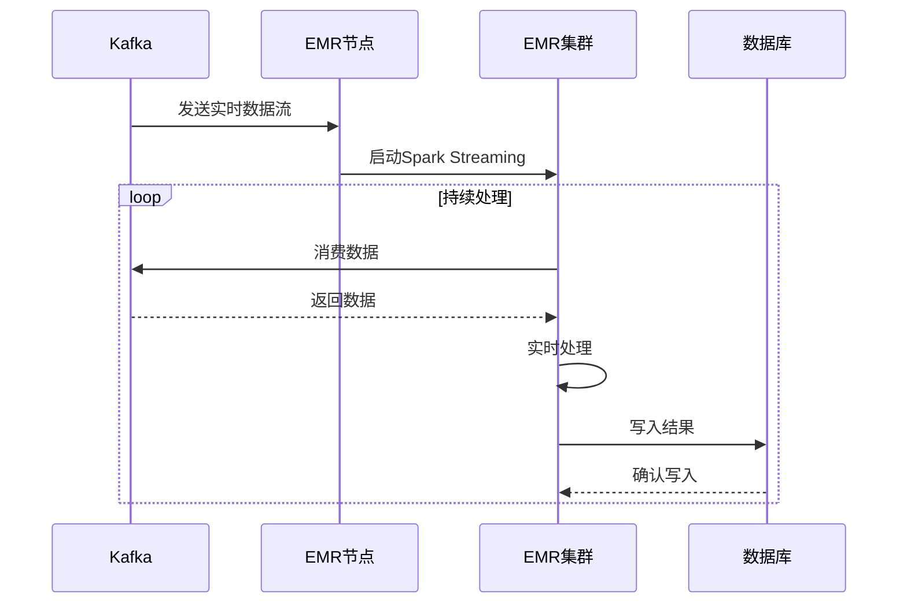

**图源**
- [emr-spark.md](file://docs/spec-templates/nodes/emr-spark.md)

**本节来源**
- [emr-spark.md](file://docs/spec-templates/nodes/emr-spark.md)

### 机器学习场景

机器学习场景适用于训练和部署机器学习模型。PAI_STUDIO和PAI_FLOW节点是机器学习场景的理想选择。

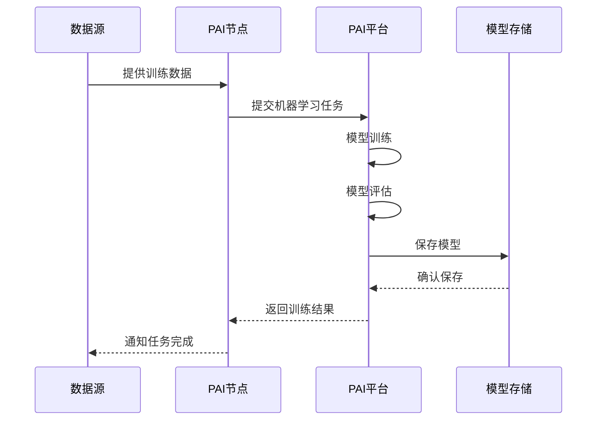

**图源**
- [pai-studio.md](file://docs/spec-templates/nodes/pai-studio.md)
- [pai-flow.md](file://docs/spec-templates/nodes/pai-flow.md)

**本节来源**
- [pai-studio.md](file://docs/spec-templates/nodes/pai-studio.md)
- [pai-flow.md](file://docs/spec-templates/nodes/pai-flow.md)

## 总结

本文档详细介绍了dataworks-spec项目中计算节点的类型体系和实现机制。通过分析EMR节点、PAI节点、Spark节点等各种计算节点，我们了解了EmrCode、PaiCode和SparkSubmitCode在计算节点中的核心作用。

计算节点的类型体系基于`CodeProgramType`和`CalcEngineType`两个核心枚举构建，形成了层次化的分类结构。每个计算节点类型都有其特定的使用场景和配置方式。

在实际应用中，应根据具体的业务需求选择合适的计算节点类型：
- 对于批处理任务，推荐使用EMR_SPARK节点
- 对于流式计算任务，推荐使用EMR_SPARK_STREAMING节点
- 对于机器学习任务，推荐使用PAI_STUDIO或PAI_FLOW节点

通过合理配置计算资源和执行参数，可以充分发挥各种计算节点的性能优势，满足不同场景下的数据处理需求。