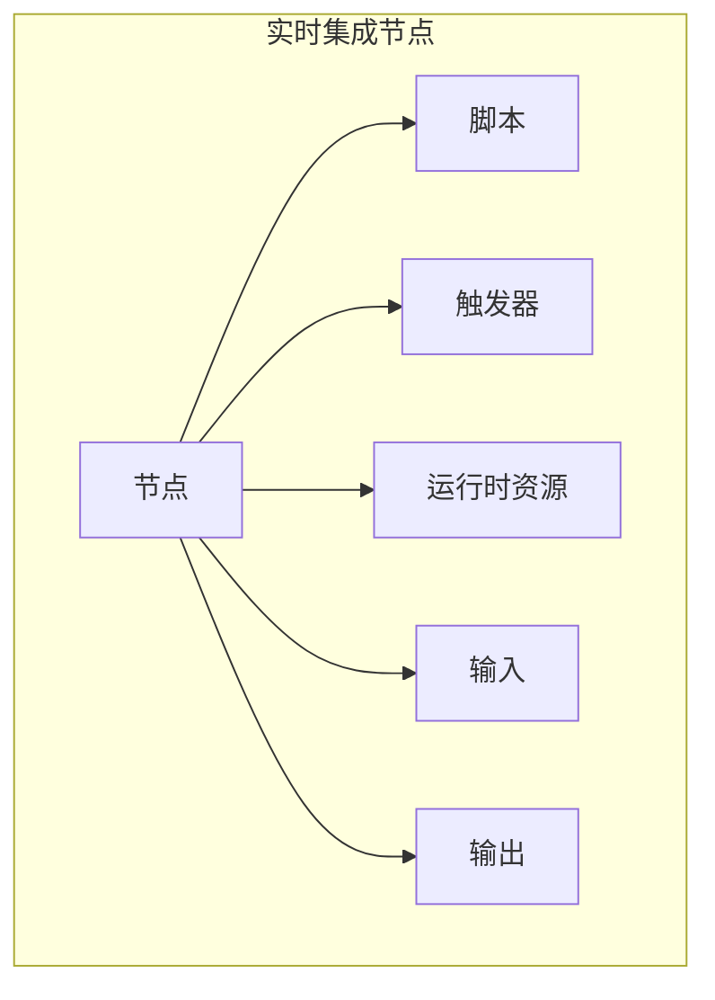
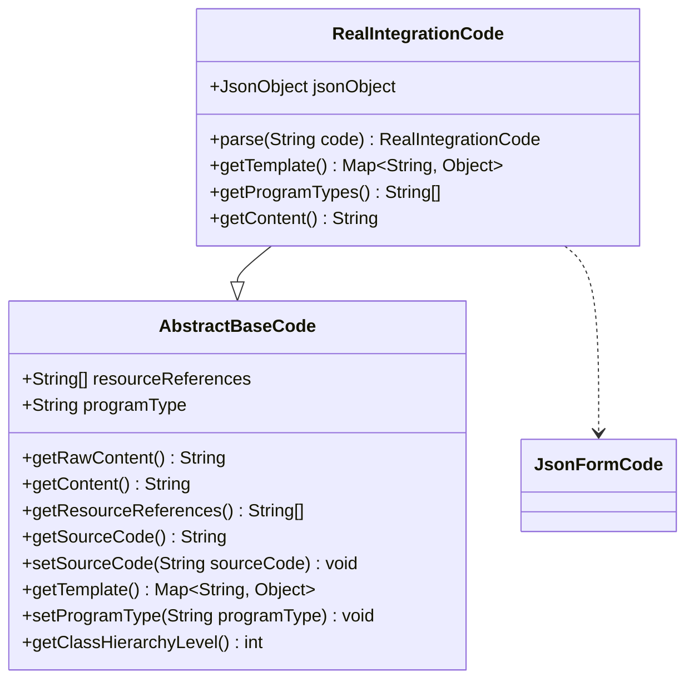
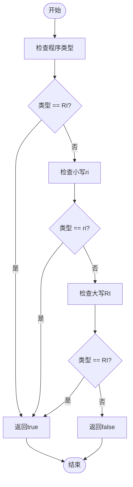
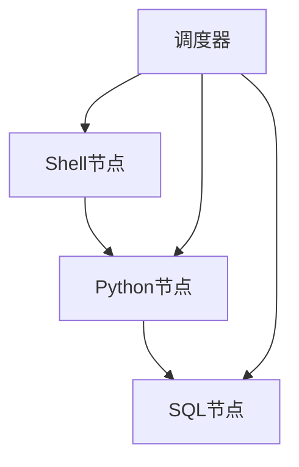
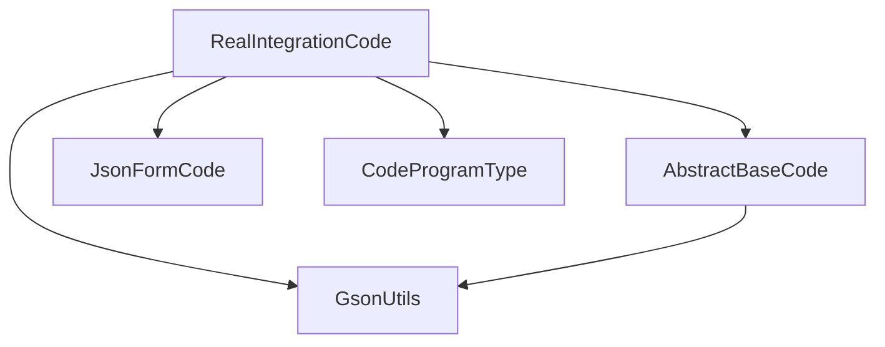

# 实时集成节点

<cite>
**本文档引用的文件**
- [RealIntegrationCode.java](file://spec/src/main/java/com/aliyun/dataworks/common/spec/domain/dw/codemodel/RealIntegrationCode.java)
- [AbstractBaseCode.java](file://spec/src/main/java/com/aliyun/dataworks/common/spec/domain/dw/codemodel/AbstractBaseCode.java)
- [JsonFormCode.java](file://spec/src/main/java/com/aliyun/dataworks/common/spec/domain/dw/codemodel/JsonFormCode.java)
- [CodeProgramType.java](file://spec/src/main/java/com/aliyun/dataworks/common/spec/domain/dw/types/CodeProgramType.java)
- [SpecNode.schema.json](file://spec/src/main/resources/spec/schema/SpecNode.schema.json)
- [real-case-shell-python-sql-spec.json](file://client/migrationx/migrationx-transformer/src/test/resources/json/spec/real-case-shell-python-sql-spec.json)
- [real-case-single-python-spec.json](file://client/migrationx/migrationx-transformer/src/test/resources/json/spec/real-case-single-python-spec.json)
- [real-case-single-sql-spec.json](file://client/migrationx/migrationx-transformer/src/test/resources/json/spec/real-case-single-sql-spec.json)
</cite>

## 目录
1. [简介](#简介)
2. [核心组件](#核心组件)
3. [架构概述](#架构概述)
4. [详细组件分析](#详细组件分析)
5. [依赖分析](#依赖分析)
6. [性能考虑](#性能考虑)
7. [故障排除指南](#故障排除指南)
8. [结论](#结论)

## 简介
实时集成节点是dataworks-spec项目中的关键组件，用于定义和管理实时数据同步任务。该文档详细说明了RealIntegrationCode类的实现机制和核心属性，包括实时数据源配置、流式处理逻辑、事件触发机制和容错策略。通过JSON配置，用户可以定义实时数据同步任务，涵盖流式数据源类型、实时处理模式、窗口配置和状态管理等关键配置项。

## 核心组件
实时集成节点的核心组件包括RealIntegrationCode类，该类继承自AbstractBaseCode并实现了JsonFormCode接口。RealIntegrationCode类负责解析和处理实时集成任务的JSON配置，支持RI（Real Integration）程序类型。该类通过Gson库将JSON字符串解析为JsonObject，并提供getContent方法以获取格式化的JSON内容。

**本节来源**
- [RealIntegrationCode.java](file://spec/src/main/java/com/aliyun/dataworks/common/spec/domain/dw/codemodel/RealIntegrationCode.java)
- [AbstractBaseCode.java](file://spec/src/main/java/com/aliyun/dataworks/common/spec/domain/dw/codemodel/AbstractBaseCode.java)
- [JsonFormCode.java](file://spec/src/main/java/com/aliyun/dataworks/common/spec/domain/dw/codemodel/JsonFormCode.java)

## 架构概述
实时集成节点的架构基于JSON配置驱动，通过SpecNode.schema.json定义节点的结构和属性。节点配置包括ID、重复模式、优先级、超时、实例模式、重试模式等核心属性。每个节点包含脚本、触发器、运行时资源、输入输出等子组件，形成一个完整的任务定义。

**图表来源**
- [SpecNode.schema.json](file://spec/src/main/resources/spec/schema/SpecNode.schema.json)

## 详细组件分析

### RealIntegrationCode类分析
RealIntegrationCode类是实时集成节点的核心实现，负责处理JSON格式的配置数据。该类通过parse方法将JSON字符串解析为JsonObject，并通过getContent方法返回格式化的JSON内容。getProgramTypes方法返回支持的程序类型，目前仅支持RI类型。

#### 类图

**图表来源**
- [RealIntegrationCode.java](file://spec/src/main/java/com/aliyun/dataworks/common/spec/domain/dw/codemodel/RealIntegrationCode.java)
- [AbstractBaseCode.java](file://spec/src/main/java/com/aliyun/dataworks/common/spec/domain/dw/codemodel/AbstractBaseCode.java)
- [JsonFormCode.java](file://spec/src/main/java/com/aliyun/dataworks/common/spec/domain/dw/codemodel/JsonFormCode.java)

#### 程序类型支持

**图表来源**
- [RealIntegrationCode.java](file://spec/src/main/java/com/aliyun/dataworks/common/spec/domain/dw/codemodel/RealIntegrationCode.java)

### 配置示例分析
通过实际的JSON配置示例，可以更好地理解实时集成节点的使用方式。以下是一个包含Shell、Python和SQL节点的完整工作流配置。

#### 工作流配置示例

**图表来源**
- [real-case-shell-python-sql-spec.json](file://client/migrationx/migrationx-transformer/src/test/resources/json/spec/real-case-shell-python-sql-spec.json)

**本节来源**
- [real-case-shell-python-sql-spec.json](file://client/migrationx/migrationx-transformer/src/test/resources/json/spec/real-case-shell-python-sql-spec.json)
- [real-case-single-python-spec.json](file://client/migrationx/migrationx-transformer/src/test/resources/json/spec/real-case-single-python-spec.json)
- [real-case-single-sql-spec.json](file://client/migrationx/migrationx-transformer/src/test/resources/json/spec/real-case-single-sql-spec.json)

## 依赖分析
实时集成节点依赖于多个核心组件和枚举类型。CodeProgramType枚举定义了所有支持的程序类型，其中RI类型专门用于实时集成任务。RealIntegrationCode类依赖于Gson库进行JSON解析，并通过继承AbstractBaseCode获得基本的功能实现。

**图表来源**
- [CodeProgramType.java](file://spec/src/main/java/com/aliyun/dataworks/common/spec/domain/dw/types/CodeProgramType.java)
- [RealIntegrationCode.java](file://spec/src/main/java/com/aliyun/dataworks/common/spec/domain/dw/codemodel/RealIntegrationCode.java)
- [AbstractBaseCode.java](file://spec/src/main/java/com/aliyun/dataworks/common/spec/domain/dw/codemodel/AbstractBaseCode.java)

**本节来源**
- [CodeProgramType.java](file://spec/src/main/java/com/aliyun/dataworks/common/spec/domain/dw/types/CodeProgramType.java)

## 性能考虑
实时集成节点的设计考虑了性能和可扩展性。通过使用轻量级的JSON格式进行配置，减少了序列化和反序列化的开销。RealIntegrationCode类的parse方法直接使用Gson库进行JSON解析，确保了高效的处理性能。此外，通过将配置数据存储在transient字段中，避免了不必要的序列化操作。

## 故障排除指南
在使用实时集成节点时，可能会遇到配置解析错误或程序类型不匹配的问题。确保JSON配置格式正确，并使用支持的程序类型（RI）。如果遇到解析错误，检查JSON字符串是否符合预期格式，并确保所有必需的字段都已正确设置。

**本节来源**
- [RealIntegrationCodeTest.java](file://spec/src/test/java/com/aliyun/dataworks/common/spec/domain/dw/codemodel/RealIntegrationCodeTest.java)

## 结论
实时集成节点通过RealIntegrationCode类提供了强大的实时数据同步功能。通过JSON配置，用户可以灵活地定义各种实时处理任务，包括数据源配置、流式处理逻辑、事件触发机制和容错策略。该设计具有良好的可扩展性和高性能，适用于各种复杂的实时数据处理场景。