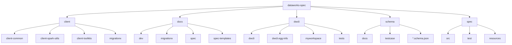
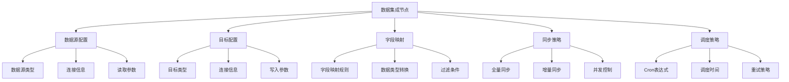
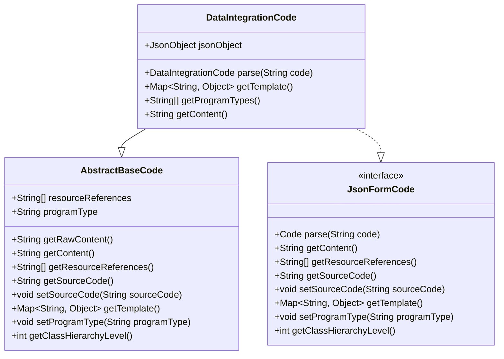
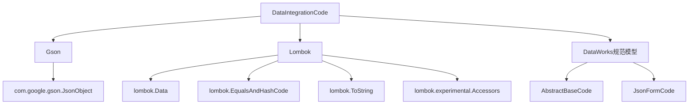

# 数据集成节点

<cite>
**本文档引用的文件**  
- [DataIntegrationCode.java](file://spec/src/main/java/com/aliyun/dataworks/common/spec/domain/dw/codemodel/DataIntegrationCode.java)
- [AbstractBaseCode.java](file://spec/src/main/java/com/aliyun/dataworks/common/spec/domain/dw/codemodel/AbstractBaseCode.java)
- [CodeProgramType.java](file://spec/src/main/java/com/aliyun/dataworks/common/spec/domain/dw/types/CodeProgramType.java)
- [hologres-sync-data.md](file://docs/spec-templates/nodes/hologres-sync-data.md)
- [odps-sql.md](file://docs/spec-templates/nodes/odps-sql.md)
- [hologres-sync-ddl.md](file://docs/spec-templates/nodes/hologres-sync-ddl.md)
- [DwNodeEntity.java](file://client/migrationx/migrationx-domain/migrationx-domain-dataworks/src/main/java/com/aliyun/dataworks/migrationx/domain/dataworks/service/spec/entity/DwNodeEntity.java)
- [DataxParameters.java](file://client/migrationx/migrationx-domain/migrationx-domain-dolphinscheduler/src/main/java/com/aliyun/dataworks/migrationx/domain/dataworks/dolphinscheduler/v2/task/datax/DataxParameters.java)
- [OldDataX2DI.java](file://client/migrationx/migrationx-domain/migrationx-domain-datago/src/main/java/com/aliyun/dataworks/migrationx/domain/dataworks/datago/model/OldDataX2DI.java)
</cite>

## 目录
1. [简介](#简介)
2. [项目结构](#项目结构)
3. [核心组件](#核心组件)
4. [架构概述](#架构概述)
5. [详细组件分析](#详细组件分析)
6. [依赖分析](#依赖分析)
7. [性能考虑](#性能考虑)
8. [故障排除指南](#故障排除指南)
9. [结论](#结论)

## 简介
数据集成节点是DataWorks平台中用于实现离线数据同步任务的核心组件。该文档详细说明了DataIntegrationCode类的实现机制和核心属性，包括数据源配置、目标配置、字段映射、同步策略等。通过JSON配置定义数据同步任务，支持多种数据源类型（如Hologres、MaxCompute等）、同步模式（全量/增量）、调度策略和数据质量检查等关键配置项。文档还提供了典型的数据集成节点配置示例，展示从不同数据源到目标的数据同步场景，包括字段转换、过滤条件、并发控制等高级特性，并阐述了数据集成节点在工作流中的使用模式和最佳实践。

## 项目结构
dataworks-spec项目是一个用于定义和管理DataWorks工作流规范的代码库，其结构清晰地划分了客户端工具、文档、命令行接口和核心规范等模块。项目主要包含以下几个部分：

- **client/**: 包含各种客户端工具和迁移工具，如client-common、client-spark-utils、client-toolkits和migrationx等，用于支持不同场景下的数据处理和迁移任务。
- **docs/**: 包含开发指南、使用说明和规范模板等文档，为开发者提供详细的参考和指导。
- **dwcli/**: 提供命令行接口工具，支持工作流的创建、验证和管理。
- **schema/**: 定义了工作流、节点、脚本等实体的JSON Schema，确保配置的规范性和一致性。
- **spec/**: 核心规范模块，包含数据集成节点的代码模型、枚举类型和解析器等，是数据集成功能的核心实现。



**Diagram sources**
- [dataworks-spec](file://)
- [client](file://client/)
- [docs](file://docs/)
- [dwcli](file://dwcli/)
- [schema](file://schema/)
- [spec](file://spec/)

**Section sources**
- [dataworks-spec](file://)
- [client](file://client/)
- [docs](file://docs/)
- [dwcli](file://dwcli/)
- [schema](file://schema/)
- [spec](file://spec/)

## 核心组件
数据集成节点的核心组件主要包括DataIntegrationCode类、CodeProgramType枚举和相关的配置模型。DataIntegrationCode类是数据集成任务的代码模型，负责解析和生成JSON格式的配置内容。CodeProgramType枚举定义了各种数据集成任务的类型，如DI、DATAX等。这些组件共同构成了数据集成节点的基础，支持从不同数据源到目标的数据同步任务。

**Section sources**
- [DataIntegrationCode.java](file://spec/src/main/java/com/aliyun/dataworks/common/spec/domain/dw/codemodel/DataIntegrationCode.java)
- [CodeProgramType.java](file://spec/src/main/java/com/aliyun/dataworks/common/spec/domain/dw/types/CodeProgramType.java)

## 架构概述
数据集成节点的架构基于DataWorks的规范模型，通过JSON配置定义任务的各个方面。核心架构包括数据源配置、目标配置、字段映射、同步策略和调度策略等。数据集成节点通过DataIntegrationCode类解析JSON配置，生成相应的任务执行计划。任务执行计划包括数据读取、转换和写入等步骤，支持全量和增量同步模式。此外，数据集成节点还支持数据质量检查、并发控制和错误处理等高级特性。



**Diagram sources**
- [DataIntegrationCode.java](file://spec/src/main/java/com/aliyun/dataworks/common/spec/domain/dw/codemodel/DataIntegrationCode.java)
- [DwNodeEntity.java](file://client/migrationx/migrationx-domain/migrationx-domain-dataworks/src/main/java/com/aliyun/dataworks/migrationx/domain/dataworks/service/spec/entity/DwNodeEntity.java)
- [DataxParameters.java](file://client/migrationx/migrationx-domain/migrationx-domain-dolphinscheduler/src/main/java/com/aliyun/dataworks/migrationx/domain/dataworks/dolphinscheduler/v2/task/datax/DataxParameters.java)

## 详细组件分析

### DataIntegrationCode类分析
DataIntegrationCode类是数据集成任务的核心实现，继承自AbstractBaseCode并实现了JsonFormCode接口。该类的主要功能是解析和生成JSON格式的配置内容，支持数据集成任务的定义和执行。

#### 类图


**Diagram sources**
- [DataIntegrationCode.java](file://spec/src/main/java/com/aliyun/dataworks/common/spec/domain/dw/codemodel/DataIntegrationCode.java)
- [AbstractBaseCode.java](file://spec/src/main/java/com/aliyun/dataworks/common/spec/domain/dw/codemodel/AbstractBaseCode.java)

#### 核心方法
- **parse(String code)**: 解析JSON格式的配置字符串，将其转换为JsonObject对象，存储在jsonObject字段中。
- **getContent()**: 将jsonObject对象转换为JSON字符串，返回配置内容。
- **getProgramTypes()**: 返回程序类型列表，对于DataIntegrationCode，返回["DI"]。
- **getTemplate()**: 返回配置模板，当前实现返回null。

**Section sources**
- [DataIntegrationCode.java](file://spec/src/main/java/com/aliyun/dataworks/common/spec/domain/dw/codemodel/DataIntegrationCode.java)
- [AbstractBaseCode.java](file://spec/src/main/java/com/aliyun/dataworks/common/spec/domain/dw/codemodel/AbstractBaseCode.java)

### 数据源配置分析
数据集成节点支持多种数据源类型，包括Hologres、MaxCompute、MySQL、PostgreSQL等。数据源配置主要包括数据源类型、连接信息和读取参数等。

#### 配置示例
```json
{
  "script": {
    "runtime": {
      "command": "HOLOGRES_SYNC_DATA"
    },
    "content": {
      "content": "IMPORT FOREIGN SCHEMA...",
      "extraContent": "{\"connId\":\"yongxunqa_holo_shanghai\",\"dbName\":\"yongxunqa_hologres_db\",\"syncType\":1,\"extendProjectName\":\"shanghai_onlineTest_simple\",\"schemaName\":\"public\",\"tableName\":\"wqtest\",\"partitionColumn\":\"\",\"orientation\":\"column\",\"columns\":[{\"name\":\"f1\",\"comment\":\"\",\"type\":\"STRING\",\"allowNull\":false,\"holoName\":\"f1\",\"holoType\":\"text\"},{\"name\":\"f2\",\"comment\":\"\",\"type\":\"STRING\",\"allowNull\":false,\"holoName\":\"f2\",\"holoType\":\"text\"},{\"name\":\"f4\",\"comment\":\"\",\"type\":\"STRING\",\"allowNull\":false,\"holoName\":\"f4\",\"holoType\":\"text\"},{\"name\":\"f5\",\"comment\":\"\",\"type\":\"STRING\",\"allowNull\":false,\"holoName\":\"f5\",\"holoType\":\"text\"},{\"name\":\"f3\",\"comment\":\"\",\"type\":\"STRING\",\"allowNull\":false,\"holoName\":\"f3\",\"holoType\":\"text\"},{\"name\":\"f6\",\"comment\":\"\",\"type\":\"STRING\",\"allowNull\":false,\"holoName\":\"f6\",\"holoType\":\"text\"},{\"name\":\"f7\",\"comment\":\"\",\"type\":\"STRING\",\"allowNull\":false,\"holoName\":\"f7\",\"holoType\":\"text\"},{\"name\":\"f10\",\"comment\":\"\",\"type\":\"STRING\",\"allowNull\":false,\"holoName\":\"f10\",\"holoType\":\"text\"},{\"name\":\"ds\",\"comment\":\"\",\"type\":\"BIGINT\",\"allowNull\":false,\"holoName\":\"ds\",\"holoType\":\"bigint\"},{\"name\":\"pt\",\"comment\":\"分区字段\",\"type\":\"STRING\",\"allowNull\":false,\"holoName\":\"pt\",\"holoType\":\"text\"}],\"serverName\":\"odps_server\",\"extendTableName\":\"wq_test_dataworks_pt_001\",\"foreignSchemaName\":\"public\",\"foreignTableName\":\"\",\"instanceId\":\"yongxunqa_holo_shanghai\",\"engineType\":\"Hologres\",\"clusteringKey\":[],\"bitmapIndexKey\":[],\"segmentKey\":[],\"dictionaryEncoding\":[]}"
    }
  }
}
```

**Section sources**
- [hologres-sync-data.md](file://docs/spec-templates/nodes/hologres-sync-data.md)
- [DataxParameters.java](file://client/migrationx/migrationx-domain/migrationx-domain-dolphinscheduler/src/main/java/com/aliyun/dataworks/migrationx/domain/dataworks/dolphinscheduler/v2/task/datax/DataxParameters.java)

### 同步策略分析
数据集成节点支持全量和增量同步模式，通过配置syncType字段来指定同步类型。全量同步模式会同步所有数据，而增量同步模式只同步新增或修改的数据。

#### 同步模式配置
- **全量同步**: syncType设置为0，同步所有数据。
- **增量同步**: syncType设置为1，通过分区字段或时间戳字段实现增量同步。

**Section sources**
- [hologres-sync-data.md](file://docs/spec-templates/nodes/hologres-sync-data.md)
- [OldDataX2DI.java](file://client/migrationx/migrationx-domain/migrationx-domain-datago/src/main/java/com/aliyun/dataworks/migrationx/domain/dataworks/datago/model/OldDataX2DI.java)

## 依赖分析
数据集成节点的实现依赖于多个核心组件和外部库。主要依赖包括Gson用于JSON解析、Lombok用于简化代码、以及DataWorks的规范模型等。



**Diagram sources**
- [DataIntegrationCode.java](file://spec/src/main/java/com/aliyun/dataworks/common/spec/domain/dw/codemodel/DataIntegrationCode.java)
- [AbstractBaseCode.java](file://spec/src/main/java/com/aliyun/dataworks/common/spec/domain/dw/codemodel/AbstractBaseCode.java)
- [CodeProgramType.java](file://spec/src/main/java/com/aliyun/dataworks/common/spec/domain/dw/types/CodeProgramType.java)

**Section sources**
- [DataIntegrationCode.java](file://spec/src/main/java/com/aliyun/dataworks/common/spec/domain/dw/codemodel/DataIntegrationCode.java)
- [AbstractBaseCode.java](file://spec/src/main/java/com/aliyun/dataworks/common/spec/domain/dw/codemodel/AbstractBaseCode.java)
- [CodeProgramType.java](file://spec/src/main/java/com/aliyun/dataworks/common/spec/domain/dw/types/CodeProgramType.java)

## 性能考虑
在设计和使用数据集成节点时，需要考虑以下几个性能因素：
- **并发控制**: 通过配置jobSpeedRecord和jobSpeedByte参数来控制同步任务的并发度，避免对源系统和目标系统造成过大压力。
- **资源隔离**: 使用专用的资源组(runtimeResource)来执行数据集成任务，避免与其他任务争抢资源。
- **超时设置**: 根据任务的复杂度和数据量合理设置timeout参数，避免任务长时间运行影响整体调度。
- **数据类型转换**: 在字段映射时，尽量选择兼容的数据类型，减少数据转换的开销。

## 故障排除指南
在使用数据集成节点时，可能会遇到以下常见问题：
- **连接失败**: 检查数据源和目标的连接信息是否正确，包括主机名、端口、用户名和密码等。
- **数据类型不匹配**: 确保源表和目标表的字段类型正确映射，特别是时间类型和特殊字符。
- **同步失败**: 检查同步任务的日志，定位具体的错误原因，如网络问题、权限问题等。
- **性能问题**: 通过调整并发度、资源组和超时设置来优化任务性能。

**Section sources**
- [hologres-sync-data.md](file://docs/spec-templates/nodes/hologres-sync-data.md)
- [odps-sql.md](file://docs/spec-templates/nodes/odps-sql.md)
- [hologres-sync-ddl.md](file://docs/spec-templates/nodes/hologres-sync-ddl.md)

## 结论
数据集成节点是DataWorks平台中实现离线数据同步任务的关键组件。通过DataIntegrationCode类和相关的配置模型，支持从不同数据源到目标的数据同步任务，包括数据源配置、目标配置、字段映射、同步策略和调度策略等。文档详细说明了DataIntegrationCode类的实现机制和核心属性，并提供了典型的数据集成节点配置示例，展示了从不同数据源到目标的数据同步场景。通过合理配置和使用数据集成节点，可以高效地实现数据同步任务，支持数据仓库到分析型数据库的数据流转。