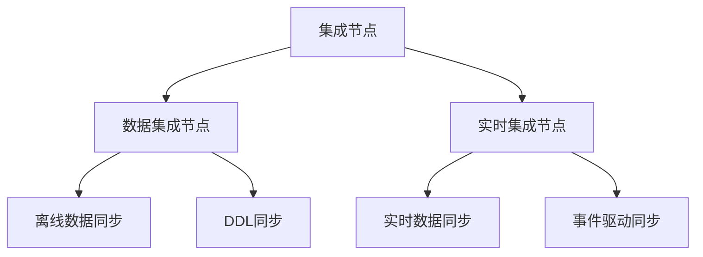
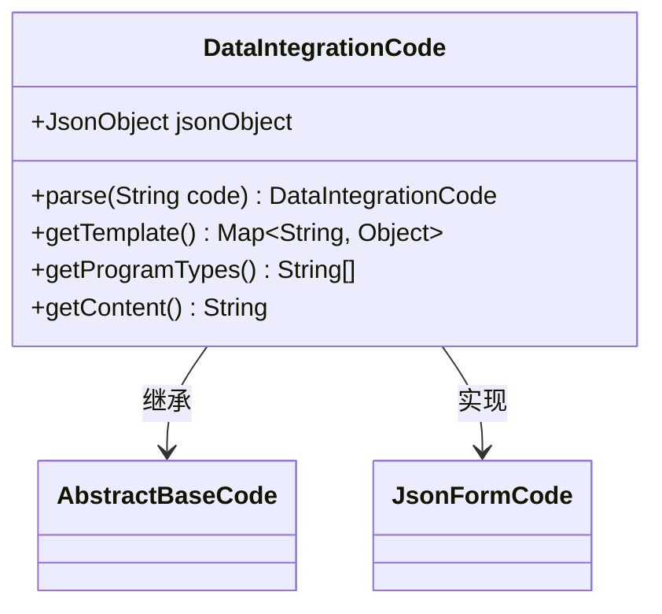
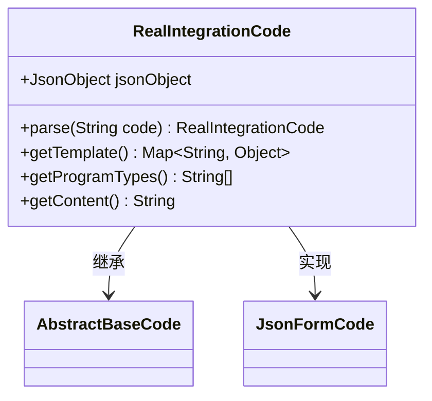
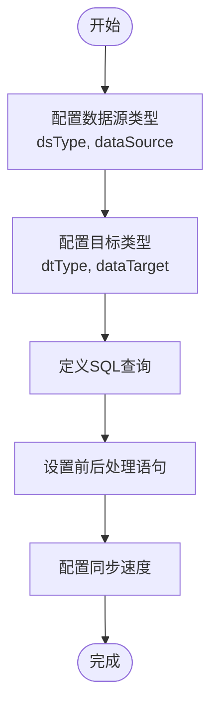

# 集成节点

<cite>
**本文档引用的文件**  
- [DataIntegrationCode.java](file://spec/src/main/java/com/aliyun/dataworks/common/spec/domain/dw/codemodel/DataIntegrationCode.java)
- [RealIntegrationCode.java](file://spec/src/main/java/com/aliyun/dataworks/common/spec/domain/dw/codemodel/RealIntegrationCode.java)
- [SpecDataIntegrationJob.java](file://spec/src/main/java/com/aliyun/dataworks/common/spec/domain/ref/SpecDataIntegrationJob.java)
- [SpecDataIntegrationJobParser.java](file://spec/src/main/java/com/aliyun/dataworks/common/spec/parser/impl/SpecDataIntegrationJobParser.java)
- [SpecDataIntegrationJobWriter.java](file://spec/src/main/java/com/aliyun/dataworks/common/spec/writer/impl/SpecDataIntegrationJobWriter.java)
- [node.schema.json](file://schema/node.schema.json)
- [RealIntegrationCodeTest.java](file://spec/src/test/java/com/aliyun/dataworks/common/spec/domain/dw/codemodel/RealIntegrationCodeTest.java)
- [all_depend_types.json](file://spec/src/test/resources/nodemodel/all_depend_types.json)
- [assignment.json](file://spec/src/test/resources/nodemodel/assignment.json)
</cite>

## 目录
1. [简介](#简介)
2. [集成节点类型体系](#集成节点类型体系)
3. [核心代码模型](#核心代码模型)
4. [数据源与同步策略配置](#数据源与同步策略配置)
5. [集成节点特有属性](#集成节点特有属性)
6. [典型配置示例与使用场景](#典型配置示例与使用场景)
7. [结论](#结论)

## 简介
集成节点是dataworks-spec项目中用于实现数据集成任务的核心组件，支持离线数据同步、实时数据同步和DDL同步等多种数据集成需求。本文档详细说明了集成节点的类型体系、实现机制以及核心代码模型DataIntegrationCode和RealIntegrationCode的作用。

## 集成节点类型体系
集成节点主要分为两大类：数据集成节点（Data Integration Node）和实时集成节点（Real-time Integration Node）。数据集成节点适用于批量数据迁移和定时同步任务，而实时集成节点则专注于流式数据处理和近实时同步场景。



**图示来源**  
- [SpecDataIntegrationJob.java](file://spec/src/main/java/com/aliyun/dataworks/common/spec/domain/ref/SpecDataIntegrationJob.java#L14-L23)

**本节来源**  
- [SpecDataIntegrationJob.java](file://spec/src/main/java/com/aliyun/dataworks/common/spec/domain/ref/SpecDataIntegrationJob.java#L14-L23)

## 核心代码模型
### DataIntegrationCode分析
DataIntegrationCode是数据集成节点的核心代码模型，实现了JsonFormCode接口，用于处理JSON格式的配置数据。该类通过GsonUtils工具类解析和序列化JSON内容，支持DI（Data Integration）程序类型。



**图示来源**  
- [DataIntegrationCode.java](file://spec/src/main/java/com/aliyun/dataworks/common/spec/domain/dw/codemodel/DataIntegrationCode.java#L36-L67)

### RealIntegrationCode分析
RealIntegrationCode是实时集成节点的核心代码模型，同样实现了JsonFormCode接口。与DataIntegrationCode类似，它也使用GsonUtils处理JSON数据，但支持RI（Real-time Integration）程序类型。



**图示来源**  
- [RealIntegrationCode.java](file://spec/src/main/java/com/aliyun/dataworks/common/spec/domain/dw/codemodel/RealIntegrationCode.java#L21-L52)

**本节来源**  
- [DataIntegrationCode.java](file://spec/src/main/java/com/aliyun/dataworks/common/spec/domain/dw/codemodel/DataIntegrationCode.java#L36-L67)
- [RealIntegrationCode.java](file://spec/src/main/java/com/aliyun/dataworks/common/spec/domain/dw/codemodel/RealIntegrationCode.java#L21-L52)

## 数据源与同步策略配置
集成节点通过SpecDataIntegrationJob类来定义数据源、目标和同步策略。配置主要包括源数据源类型、目标数据源类型、SQL查询语句、预处理和后处理语句、速度控制参数等。



**图示来源**  
- [DataxParameters.java](file://client/migrationx/migrationx-domain/migrationx-domain-dolphinscheduler/src/main/java/com/aliyun/dataworks/migrationx/domain/dataworks/dolphinscheduler/v1/v139/task/datax/DataxParameters.java#L42-L80)

**本节来源**  
- [DataxParameters.java](file://client/migrationx/migrationx-domain/migrationx-domain-dolphinscheduler/src/main/java/com/aliyun/dataworks/migrationx/domain/dataworks/dolphinscheduler/v1/v139/task/datax/DataxParameters.java#L42-L80)

## 集成节点特有属性
集成节点具有多种特有属性，包括数据源类型、同步模式、调度策略和数据质量检查等。这些属性在node.schema.json中定义，通过inputs和outputs属性管理节点的输入输出依赖关系。

```mermaid
erDiagram
NODE ||--o{ INPUT : has
NODE ||--o{ OUTPUT : produces
INPUT }|--|| DATASOURCE : uses
OUTPUT }|--|| DATATARGET : writes_to
class NODE {
string id
string name
string recurrence
int timeout
string instanceMode
}
class INPUT {
array tables
array variables
array nodeOutputs
}
class OUTPUT {
array tables
array variables
array nodeOutputs
}
```

**图示来源**  
- [node.schema.json](file://schema/node.schema.json)
- [node-properties-nodeinputartifact.md](file://schema/docs/node-properties-nodeinputartifact.md)
- [node-properties-nodeoutputartifact.md](file://schema/docs/node-properties-nodeoutputartifact.md)

**本节来源**  
- [node.schema.json](file://schema/node.schema.json)
- [node-properties-nodeinputartifact.md](file://schema/docs/node-properties-nodeinputartifact.md)
- [node-properties-nodeoutputartifact.md](file://schema/docs/node-properties-nodeoutputartifact.md)

## 典型配置示例与使用场景
### 离线数据同步配置
离线数据同步场景通常使用DataIntegrationCode模型，配置周期性调度策略和批量处理参数。

```json
{
  "version": "1.1.0",
  "kind": "CycleWorkflow",
  "spec": {
    "nodes": [
      {
        "id": "di-node-001",
        "recurrence": "Daily",
        "script": {
          "language": "di",
          "content": "{\"dsType\":\"MYSQL\",\"dtType\":\"MAXCOMPUTE\",\"sql\":\"SELECT * FROM source_table\"}"
        },
        "trigger": {
          "type": "Scheduler",
          "cron": "00 00 00 * * ?"
        }
      }
    ]
  }
}
```

### 实时数据同步配置
实时数据同步场景使用RealIntegrationCode模型，配置事件触发器和流处理参数。

```json
{
  "version": "1.1.0",
  "kind": "RealtimeWorkflow",
  "spec": {
    "nodes": [
      {
        "id": "ri-node-001",
        "recurrence": "Continuous",
        "script": {
          "language": "ri",
          "content": "{\"sourceType\":\"KAFKA\",\"targetType\":\"HBASE\",\"topic\":\"data_topic\"}"
        },
        "trigger": {
          "type": "Event",
          "eventSource": "kafka-cluster"
        }
      }
    ]
  }
}
```

**本节来源**  
- [all_depend_types.json](file://spec/src/test/resources/nodemodel/all_depend_types.json)
- [assignment.json](file://spec/src/test/resources/nodemodel/assignment.json)

## 结论
集成节点作为dataworks-spec项目的核心功能组件，通过DataIntegrationCode和RealIntegrationCode两个核心代码模型，实现了对离线和实时数据集成任务的全面支持。通过灵活的配置体系，可以满足各种复杂的数据同步需求，包括离线数据同步、实时数据同步和DDL同步等场景。