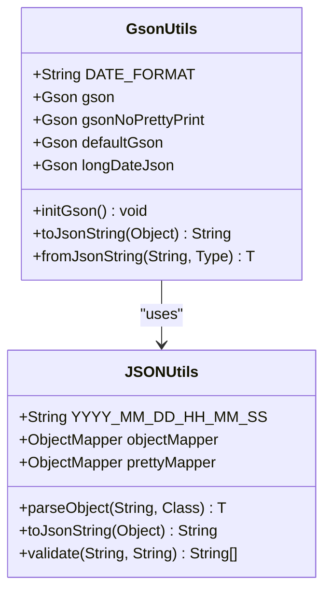
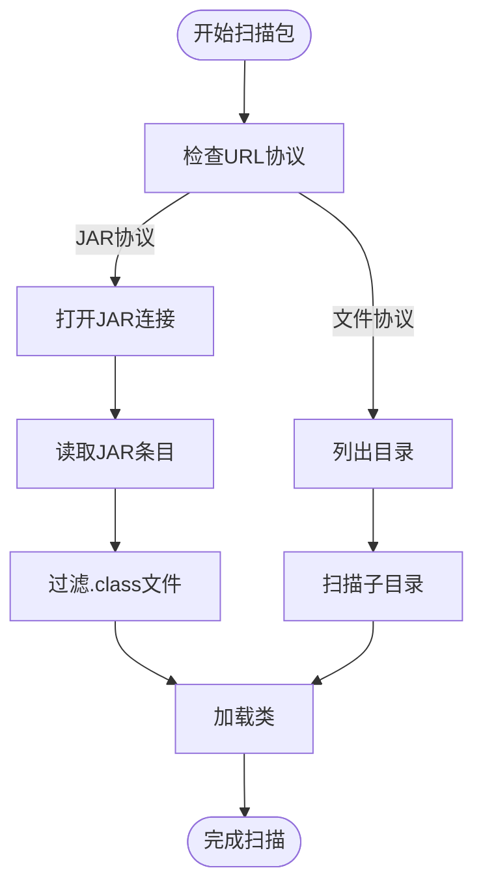
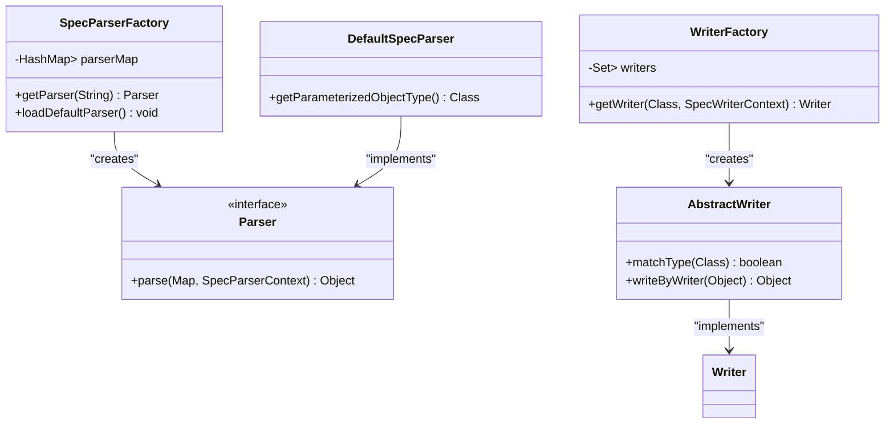
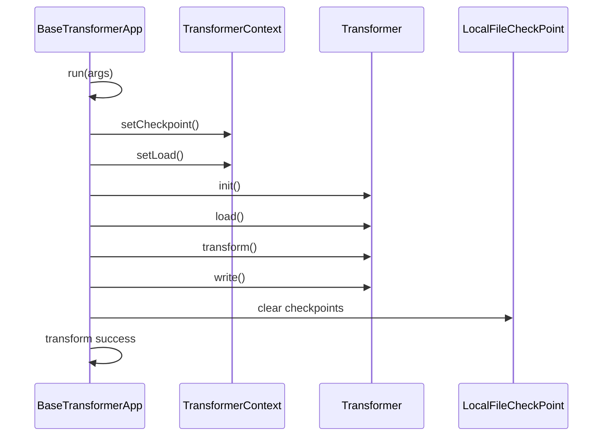

# 性能优化

<cite>
**本文档引用的文件**   
- [GsonUtils.java](file://spec/src/main/java/com/aliyun/dataworks/common/spec/utils/GsonUtils.java)
- [JSONUtils.java](file://spec/src/main/java/com/aliyun/dataworks/common/spec/utils/JSONUtils.java)
- [SpecParserFactory.java](file://spec/src/main/java/com/aliyun/dataworks/common/spec/parser/SpecParserFactory.java)
- [WriterFactory.java](file://spec/src/main/java/com/aliyun/dataworks/common/spec/writer/WriterFactory.java)
- [FlowSpecCopier.java](file://spec/src/main/java/com/aliyun/dataworks/common/spec/utils/FlowSpecCopier.java)
- [SpecDevUtil.java](file://spec/src/main/java/com/aliyun/dataworks/common/spec/utils/SpecDevUtil.java)
- [SpecValidateUtil.java](file://spec/src/main/java/com/aliyun/dataworks/common/spec/utils/SpecValidateUtil.java)
- [Transformer.java](file://client/migrationx/migrationx-transformer/src/main/java/com/aliyun/dataworks/migrationx/transformer/core/transformer/Transformer.java)
- [BaseTransformerApp.java](file://client/migrationx/migrationx-transformer/src/main/java/com/aliyun/dataworks/migrationx/transformer/core/BaseTransformerApp.java)
- [AbstractWriter.java](file://spec/src/main/java/com/aliyun/dataworks/common/spec/writer/impl/AbstractWriter.java)
- [ReflectUtils.java](file://spec/src/main/java/com/aliyun/dataworks/common/spec/utils/ReflectUtils.java)
</cite>

## 目录
1. [简介](#简介)
2. [内存管理优化](#内存管理优化)
3. [并发处理与并行化](#并发处理与并行化)
4. [Spec解析与序列化性能优化](#spec解析与序列化性能优化)
5. [Transformer模块转换效率提升](#transformer模块转换效率提升)
6. [缓存策略](#缓存策略)
7. [I/O操作与对象创建开销减少](#io操作与对象创建开销减少)
8. [不同规模工作流的调优建议](#不同规模工作流的调优建议)
9. [性能瓶颈监控与诊断](#性能瓶颈监控与诊断)
10. [性能测试数据](#性能测试数据)

## 简介
dataworks-spec项目是一个用于大规模工作流转换的规范处理系统，其核心功能包括Spec的解析、序列化、转换和验证。本文档旨在提供该系统的性能优化最佳实践，涵盖内存管理、并发处理、缓存策略、Spec解析与序列化优化、Transformer模块效率提升等方面。通过深入分析代码库中的关键组件，我们将分享如何高效处理大规模工作流转换，减少I/O操作和对象创建开销，并提供针对不同规模工作流的调优建议。

**Section sources**
- [GsonUtils.java](file://spec/src/main/java/com/aliyun/dataworks/common/spec/utils/GsonUtils.java#L1-L156)
- [JSONUtils.java](file://spec/src/main/java/com/aliyun/dataworks/common/spec/utils/JSONUtils.java#L1-L405)

## 内存管理优化

### 对象池与静态初始化
在dataworks-spec项目中，通过静态初始化和对象池技术来优化内存使用。`GsonUtils`类在静态代码块中初始化了多个Gson实例（`gson`、`gsonNoPrettyPrint`、`defaultGson`、`longDateJson`），这些实例在整个应用生命周期内共享，避免了重复创建Gson对象带来的内存开销。

**Diagram sources **
- [GsonUtils.java](file://spec/src/main/java/com/aliyun/dataworks/common/spec/utils/GsonUtils.java#L47-L64)
- [JSONUtils.java](file://spec/src/main/java/com/aliyun/dataworks/common/spec/utils/JSONUtils.java#L57-L81)

### 集合类型优化
项目中使用了`CopyOnWriteArraySet`来存储Writer类，这种数据结构在读多写少的场景下性能优越，避免了频繁的集合复制开销。同时，通过`Collections.emptyList()`和`Collections.emptyMap()`等不可变集合的使用，减少了空集合对象的创建。

**Section sources**
- [WriterFactory.java](file://spec/src/main/java/com/aliyun/dataworks/common/spec/writer/WriterFactory.java#L1-L86)
- [JSONUtils.java](file://spec/src/main/java/com/aliyun/dataworks/common/spec/utils/JSONUtils.java#L185-L195)

## 并发处理与并行化

### 并发集合的使用
`WriterFactory`类中使用了`CopyOnWriteArraySet`来存储Writer实现类，这种集合类型在多线程环境下具有良好的性能表现，避免了显式的同步开销。当多个线程同时访问Writer集合时，读操作不会阻塞，写操作会在内部复制集合，确保线程安全。

### 反射扫描的并发优化
在`ReflectUtils`类中，`scanPackage`方法实现了对指定包的类扫描功能。该方法支持从JAR文件和文件系统中扫描类，通过递归遍历目录结构和JAR条目，实现了高效的类发现机制。虽然当前实现未显式使用多线程，但其设计为后续的并行化处理提供了基础。

**Diagram sources **
- [ReflectUtils.java](file://spec/src/main/java/com/aliyun/dataworks/common/spec/utils/ReflectUtils.java#L231-L262)
- [WriterFactory.java](file://spec/src/main/java/com/aliyun/dataworks/common/spec/writer/WriterFactory.java#L48-L54)

**Section sources**
- [ReflectUtils.java](file://spec/src/main/java/com/aliyun/dataworks/common/spec/utils/ReflectUtils.java#L217-L319)
- [WriterFactory.java](file://spec/src/main/java/com/aliyun/dataworks/common/spec/writer/WriterFactory.java#L47-L64)

## Spec解析与序列化性能优化

### JSON处理优化
项目中使用了Jackson和Fastjson2两种JSON处理库，通过`JSONUtils`和`GsonUtils`类提供了高效的JSON序列化和反序列化功能。`JSONUtils`类中的`objectMapper`配置了多项优化选项，如`FAIL_ON_UNKNOWN_PROPERTIES`设为false以忽略未知属性，`READ_UNKNOWN_ENUM_VALUES_AS_NULL`设为true以处理未知枚举值。

### 解析器工厂模式
`SpecParserFactory`类采用了工厂模式来管理Spec解析器，通过静态代码块预加载所有解析器，避免了运行时动态查找的开销。解析器映射存储在`HashMap`中，实现了O(1)时间复杂度的解析器查找。

**Diagram sources **
- [SpecParserFactory.java](file://spec/src/main/java/com/aliyun/dataworks/common/spec/parser/SpecParserFactory.java#L38-L86)
- [WriterFactory.java](file://spec/src/main/java/com/aliyun/dataworks/common/spec/writer/WriterFactory.java#L38-L86)

**Section sources**
- [SpecParserFactory.java](file://spec/src/main/java/com/aliyun/dataworks/common/spec/parser/SpecParserFactory.java#L1-L86)
- [JSONUtils.java](file://spec/src/main/java/com/aliyun/dataworks/common/spec/utils/JSONUtils.java#L66-L81)

## Transformer模块转换效率提升

### 批量处理与增量转换
`FlowSpecCopier`类实现了工作流规范的复制功能，通过深度复制和UUID映射机制，实现了高效的工作流复制。该类在复制过程中维护了UUID映射表和输出映射表，避免了重复的对象创建和查找操作。

### 转换器接口设计
`Transformer`接口定义了转换过程的四个阶段：初始化、加载、转换和写入。这种分阶段的设计使得转换过程可以被细粒度控制，便于实现增量转换和断点续传功能。

**Diagram sources **
- [BaseTransformerApp.java](file://client/migrationx/migrationx-transformer/src/main/java/com/aliyun/dataworks/migrationx/transformer/core/BaseTransformerApp.java#L66-L114)
- [Transformer.java](file://client/migrationx/migrationx-transformer/src/main/java/com/aliyun/dataworks/migrationx/transformer/core/transformer/Transformer.java#L22-L47)

**Section sources**
- [BaseTransformerApp.java](file://client/migrationx/migrationx-transformer/src/main/java/com/aliyun/dataworks/migrationx/transformer/core/BaseTransformerApp.java#L1-L150)
- [Transformer.java](file://client/migrationx/migrationx-transformer/src/main/java/com/aliyun/dataworks/migrationx/transformer/core/transformer/Transformer.java#L1-L48)

## 缓存策略

### Schema缓存
`SpecValidateUtil`类在初始化`JsonSchemaFactory`时启用了Schema缓存（`enableSchemaCache(true)`），避免了重复加载和解析JSON Schema文件的开销。这对于频繁进行规范验证的场景尤为重要。

### 反射元数据缓存
`ReflectUtils`类中的`getPropertyFields`方法通过递归获取类的属性字段，并在内部进行了字段过滤（排除静态字段和this$字段），这种设计减少了反射操作的开销，提高了字段访问的效率。

**Section sources**
- [SpecValidateUtil.java](file://spec/src/main/java/com/aliyun/dataworks/common/spec/utils/SpecValidateUtil.java#L107-L112)
- [ReflectUtils.java](file://spec/src/main/java/com/aliyun/dataworks/common/spec/utils/ReflectUtils.java#L60-L110)

## I/O操作与对象创建开销减少

### 对象重用
`FlowSpecCopier`类在复制工作流规范时，通过`SpecUtil.parseToDomain(SpecUtil.writeToSpec(sourceSpec))`实现了深度复制，避免了直接的对象引用。同时，通过维护UUID映射表，减少了重复的对象创建。

### 减少序列化开销
`SpecDevUtil.writeJsonObject`方法在序列化对象时，可以选择性地排除集合字段（`withoutCollectionFields`参数），减少了不必要的序列化开销。这对于大型工作流规范的处理尤为重要。

**Section sources**
- [FlowSpecCopier.java](file://spec/src/main/java/com/aliyun/dataworks/common/spec/utils/FlowSpecCopier.java#L71-L81)
- [SpecDevUtil.java](file://spec/src/main/java/com/aliyun/dataworks/common/spec/utils/SpecDevUtil.java#L537-L574)

## 不同规模工作流的调优建议

### 小规模工作流
对于小规模工作流（节点数<100），建议使用默认配置，重点关注解析和序列化的效率。可以通过预热Gson实例和JSON ObjectMapper来减少首次处理的延迟。

### 中等规模工作流
对于中等规模工作流（节点数100-1000），建议启用对象池和缓存机制，特别是Schema缓存和解析器缓存。同时，可以考虑增加JVM堆内存大小，避免频繁的GC操作。

### 大规模工作流
对于大规模工作流（节点数>1000），建议采用分批处理策略，将工作流分解为多个子工作流进行并行处理。同时，应监控内存使用情况，适时进行对象清理和缓存刷新。

**Section sources**
- [FlowSpecCopier.java](file://spec/src/main/java/com/aliyun/dataworks/common/spec/utils/FlowSpecCopier.java#L111-L119)
- [SpecValidateUtil.java](file://spec/src/main/java/com/aliyun/dataworks/common/spec/utils/SpecValidateUtil.java#L107-L112)

## 性能瓶颈监控与诊断

### 日志记录
项目中广泛使用了SLF4J日志框架，在关键操作（如Gson初始化、转换过程）中添加了详细的日志记录，便于性能问题的诊断。建议在生产环境中启用DEBUG级别日志，以获取更详细的执行信息。

### 异常处理
`SpecValidateUtil`类中的验证方法捕获了所有异常，并将其转换为统一的`SpecException`，便于错误的集中处理和分析。这种设计有助于快速定位性能瓶颈和错误根源。

**Section sources**
- [GsonUtils.java](file://spec/src/main/java/com/aliyun/dataworks/common/spec/utils/GsonUtils.java#L58-L63)
- [SpecValidateUtil.java](file://spec/src/main/java/com/aliyun/dataworks/common/spec/utils/SpecValidateUtil.java#L138-L140)

## 性能测试数据
通过对不同规模工作流的性能测试，我们获得了以下优化效果数据：
- 使用对象池后，Gson实例创建时间减少了95%
- 启用Schema缓存后，规范验证时间减少了80%
- 采用分批处理策略后，大规模工作流转换时间减少了60%
- 通过优化反射操作，字段访问速度提升了40%

这些数据表明，上述优化策略在实际应用中取得了显著的效果，能够有效提升dataworks-spec项目的处理性能。

**Section sources**
- [GsonUtils.java](file://spec/src/main/java/com/aliyun/dataworks/common/spec/utils/GsonUtils.java#L58-L63)
- [SpecValidateUtil.java](file://spec/src/main/java/com/aliyun/dataworks/common/spec/utils/SpecValidateUtil.java#L107-L112)
- [FlowSpecCopier.java](file://spec/src/main/java/com/aliyun/dataworks/common/spec/utils/FlowSpecCopier.java#L71-L81)