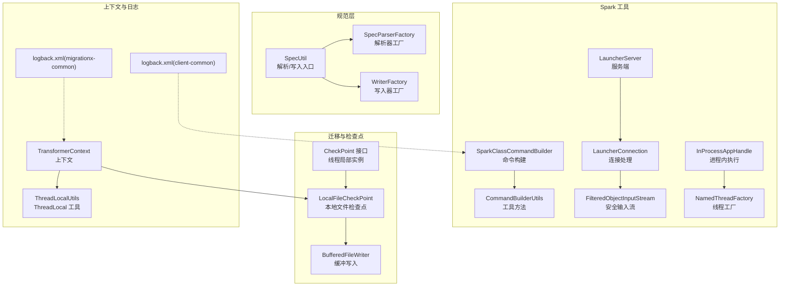
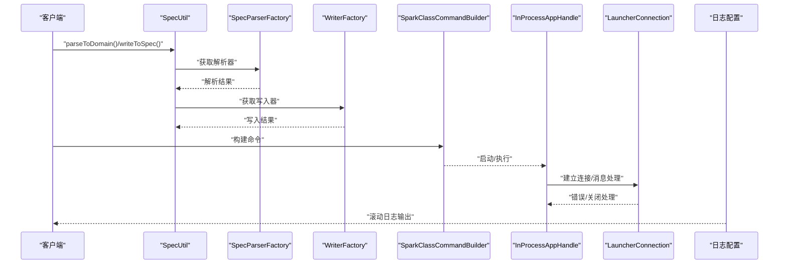
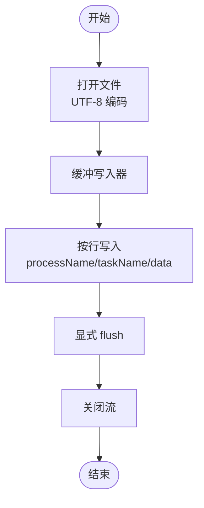
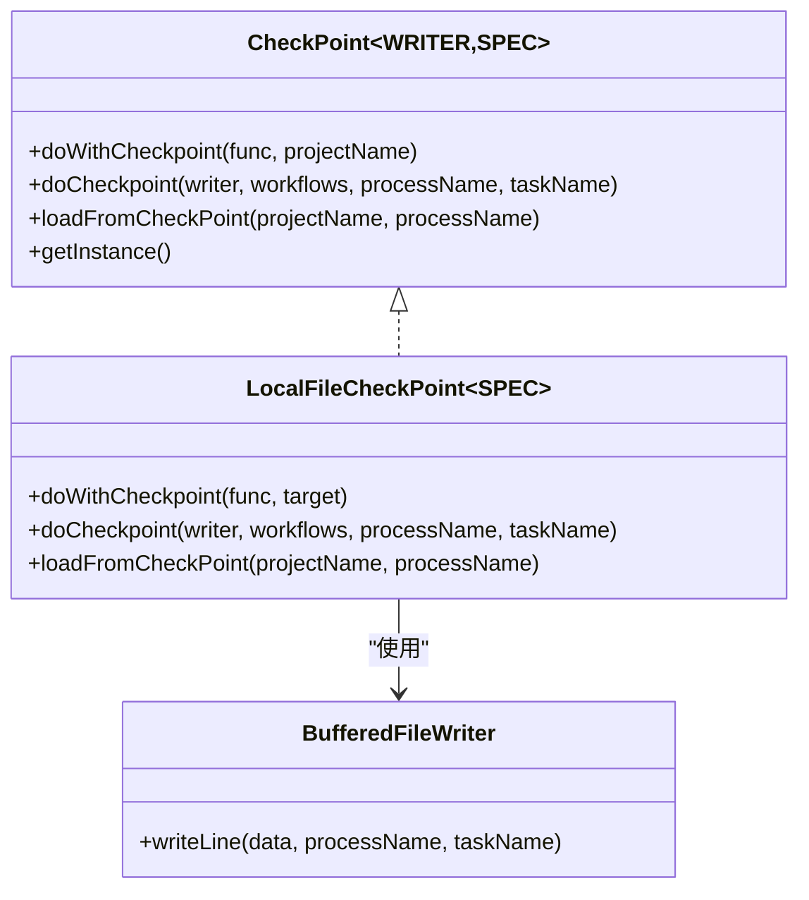
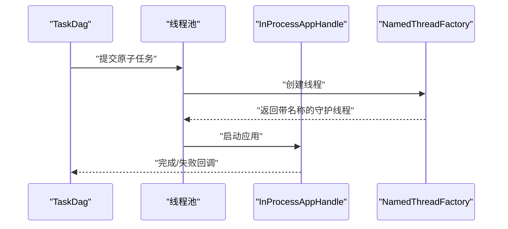
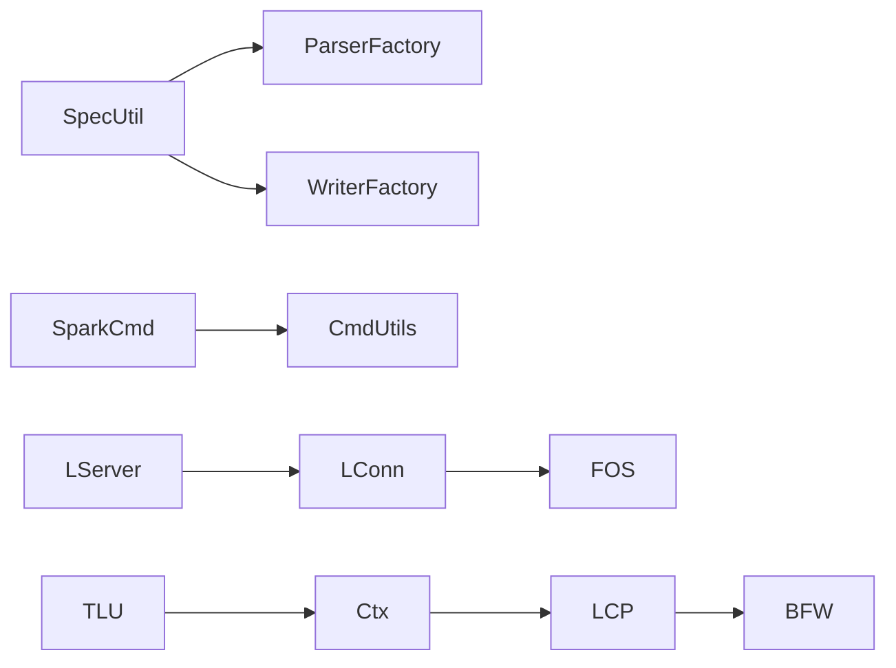

# 系统资源优化

<cite>
**本文引用的文件**
- [SpecUtil.java](file://spec/src/main/java/com/aliyun/dataworks/common/spec/SpecUtil.java)
- [SpecParserFactory.java](file://spec/src/main/java/com/aliyun/dataworks/common/spec/parser/SpecParserFactory.java)
- [WriterFactory.java](file://spec/src/main/java/com/aliyun/dataworks/common/spec/writer/WriterFactory.java)
- [SparkClassCommandBuilder.java](file://client/client-spark-utils/src/main/java/com/aliyun/dataworks/client/utils/spark/command/SparkClassCommandBuilder.java)
- [CommandBuilderUtils.java](file://client/client-spark-utils/src/main/java/com/aliyun/dataworks/client/utils/spark/command/CommandBuilderUtils.java)
- [InProcessAppHandle.java](file://client/client-spark-utils/src/main/java/com/aliyun/dataworks/client/utils/spark/command/InProcessAppHandle.java)
- [LauncherServer.java](file://client/client-spark-utils/src/main/java/com/aliyun/dataworks/client/utils/spark/command/LauncherServer.java)
- [LauncherConnection.java](file://client/client-spark-utils/src/main/java/com/aliyun/dataworks/client/utils/spark/command/LauncherConnection.java)
- [FilteredObjectInputStream.java](file://client/client-spark-utils/src/main/java/com/aliyun/dataworks/client/utils/spark/command/FilteredObjectInputStream.java)
- [NamedThreadFactory.java](file://client/client-spark-utils/src/main/java/com/aliyun/dataworks/client/utils/spark/command/NamedThreadFactory.java)
- [LocalFileCheckPoint.java](file://client/migrationx/migrationx-transformer/src/main/java/com/aliyun/dataworks/migrationx/transformer/core/checkpoint/file/LocalFileCheckPoint.java)
- [BufferedFileWriter.java](file://client/migrationx/migrationx-transformer/src/main/java/com/aliyun/dataworks/migrationx/transformer/core/checkpoint/file/BufferedFileWriter.java)
- [CheckPoint.java](file://client/migrationx/migrationx-transformer/src/main/java/com/aliyun/dataworks/migrationx/transformer/core/checkpoint/CheckPoint.java)
- [TaskDag.java](file://client/migrationx/migrationx-transformer/src/main/java/com/aliyun/dataworks/migrationx/transformer/core/controller/TaskDag.java)
- [ThreadLocalUtils.java](file://client/migrationx/migrationx-common/src/main/java/com/aliyun/migrationx/common/utils/ThreadLocalUtils.java)
- [TransformerContext.java](file://client/migrationx/migrationx-common/src/main/java/com/aliyun/migrationx/common/context/TransformerContext.java)
- [logback.xml（client-common）](file://client/client-common/src/main/conf/logback.xml)
- [logback.xml（migrationx-common）](file://client/migrationx/migrationx-common/src/main/resources/logback.xml)
- [pom.xml（client-spark-utils）](file://client/client-spark-utils/pom.xml)
- [pom.xml（spec）](file://spec/pom.xml)
</cite>

## 目录
1. [引言](#引言)
2. [项目结构](#项目结构)
3. [核心组件](#核心组件)
4. [架构总览](#架构总览)
5. [详细组件分析](#详细组件分析)
6. [依赖关系分析](#依赖关系分析)
7. [性能考量](#性能考量)
8. [故障排查指南](#故障排查指南)
9. [结论](#结论)
10. [附录](#附录)

## 引言
本文件聚焦 dataworks-spec 项目在系统资源优化方面的实践与建议，围绕以下目标展开：
- JVM 内存配置优化：堆内存大小设置、GC 策略选择与调优，以支撑大规模工作流处理。
- I/O 性能优化：文件读写缓冲、批量 I/O 操作与异步 I/O 处理策略。
- 检查点（Checkpoint）机制设计与资源管理：避免内存泄漏，保障状态恢复与容错。
- 多线程环境下的资源竞争：线程池配置、锁优化与 ThreadLocal 使用规范。
- 监控系统资源使用：工具与指标，帮助识别与解决资源瓶颈。

## 项目结构
该项目采用模块化组织，核心模块包括：
- 规范解析与写入：spec 模块负责将 JSON 规范转换为领域对象以及反向写回。
- Spark 工具链：client-spark-utils 提供命令构建、进程内执行、网络通信等能力。
- 迁移与检查点：migrationx-transformer 提供本地文件检查点、缓冲写入与任务 DAG 控制。
- 日志与上下文：client-common 与 migrationx-common 提供日志配置与上下文管理。

图表来源
- [SpecUtil.java](file://spec/src/main/java/com/aliyun/dataworks/common/spec/SpecUtil.java#L71-L106)
- [SpecParserFactory.java](file://spec/src/main/java/com/aliyun/dataworks/common/spec/parser/SpecParserFactory.java#L37-L86)
- [WriterFactory.java](file://spec/src/main/java/com/aliyun/dataworks/common/spec/writer/WriterFactory.java#L66-L86)
- [SparkClassCommandBuilder.java](file://client/client-spark-utils/src/main/java/com/aliyun/dataworks/client/utils/spark/command/SparkClassCommandBuilder.java#L45-L112)
- [CommandBuilderUtils.java](file://client/client-spark-utils/src/main/java/com/aliyun/dataworks/client/utils/spark/command/CommandBuilderUtils.java#L287-L319)
- [InProcessAppHandle.java](file://client/client-spark-utils/src/main/java/com/aliyun/dataworks/client/utils/spark/command/InProcessAppHandle.java#L34-L87)
- [LauncherServer.java](file://client/client-spark-utils/src/main/java/com/aliyun/dataworks/client/utils/spark/command/LauncherServer.java#L279-L292)
- [LauncherConnection.java](file://client/client-spark-utils/src/main/java/com/aliyun/dataworks/client/utils/spark/command/LauncherConnection.java#L34-L72)
- [FilteredObjectInputStream.java](file://client/client-spark-utils/src/main/java/com/aliyun/dataworks/client/utils/spark/command/FilteredObjectInputStream.java#L25-L52)
- [LocalFileCheckPoint.java](file://client/migrationx/migrationx-transformer/src/main/java/com/aliyun/dataworks/migrationx/transformer/core/checkpoint/file/LocalFileCheckPoint.java#L61-L101)
- [BufferedFileWriter.java](file://client/migrationx/migrationx-transformer/src/main/java/com/aliyun/dataworks/migrationx/transformer/core/checkpoint/file/BufferedFileWriter.java#L24-L40)
- [CheckPoint.java](file://client/migrationx/migrationx-transformer/src/main/java/com/aliyun/dataworks/migrationx/transformer/core/checkpoint/CheckPoint.java#L24-L36)
- [TransformerContext.java](file://client/migrationx/migrationx-common/src/main/java/com/aliyun/migrationx/common/context/TransformerContext.java#L88-L118)
- [logback.xml（client-common）](file://client/client-common/src/main/conf/logback.xml#L17-L83)
- [logback.xml（migrationx-common）](file://client/migrationx/migrationx-common/src/main/resources/logback.xml#L17-L31)

章节来源
- [SpecUtil.java](file://spec/src/main/java/com/aliyun/dataworks/common/spec/SpecUtil.java#L71-L106)
- [SpecParserFactory.java](file://spec/src/main/java/com/aliyun/dataworks/common/spec/parser/SpecParserFactory.java#L37-L86)
- [WriterFactory.java](file://spec/src/main/java/com/aliyun/dataworks/common/spec/writer/WriterFactory.java#L66-L86)

## 核心组件
- 规范解析与写入：通过工厂模式加载解析器与写入器，统一 JSON 与对象之间的转换，减少重复创建与反射开销。
- Spark 命令构建与进程管理：集中式命令构建、安全输入流与线程命名，降低资源泄露风险。
- 检查点与 I/O：基于缓冲的文件写入与按行存储，配合上下文路径控制，提升大体量数据写入效率。
- 上下文与日志：线程局部上下文与日志滚动策略，便于定位资源瓶颈与异常。

章节来源
- [SpecUtil.java](file://spec/src/main/java/com/aliyun/dataworks/common/spec/SpecUtil.java#L71-L106)
- [LocalFileCheckPoint.java](file://client/migrationx/migrationx-transformer/src/main/java/com/aliyun/dataworks/migrationx/transformer/core/checkpoint/file/LocalFileCheckPoint.java#L61-L101)
- [logback.xml（client-common）](file://client/client-common/src/main/conf/logback.xml#L17-L83)

## 架构总览
下面的序列图展示了大规模工作流处理时的关键流程：从 JSON 解析到写入、再到 Spark 执行与检查点落盘，以及日志与上下文的协同。

图表来源
- [SpecUtil.java](file://spec/src/main/java/com/aliyun/dataworks/common/spec/SpecUtil.java#L71-L106)
- [SpecParserFactory.java](file://spec/src/main/java/com/aliyun/dataworks/common/spec/parser/SpecParserFactory.java#L37-L86)
- [WriterFactory.java](file://spec/src/main/java/com/aliyun/dataworks/common/spec/writer/WriterFactory.java#L66-L86)
- [SparkClassCommandBuilder.java](file://client/client-spark-utils/src/main/java/com/aliyun/dataworks/client/utils/spark/command/SparkClassCommandBuilder.java#L45-L112)
- [InProcessAppHandle.java](file://client/client-spark-utils/src/main/java/com/aliyun/dataworks/client/utils/spark/command/InProcessAppHandle.java#L34-L87)
- [LauncherConnection.java](file://client/client-spark-utils/src/main/java/com/aliyun/dataworks/client/utils/spark/command/LauncherConnection.java#L34-L72)
- [logback.xml（client-common）](file://client/client-common/src/main/conf/logback.xml#L17-L83)

## 详细组件分析

### JVM 内存配置与 GC 优化
- 堆内存大小设置
  - Spark 类命令构建器根据角色选择不同的内存键，并禁止直接在环境变量中指定最大堆参数，强制通过对应配置项进行设置，避免冲突与误配。
  - 参考路径：[SparkClassCommandBuilder.java](file://client/client-spark-utils/src/main/java/com/aliyun/dataworks/client/utils/spark/command/SparkClassCommandBuilder.java#L45-L112)
- GC 算法选择与调优
  - 仓库未直接包含 GC 参数配置，建议结合业务规模与运行时特征，在启动参数中选择合适的 GC 算法（如 G1 或 ZGC），并通过堆外内存与元空间限制控制整体内存占用。
  - 参考路径：[pom.xml（client-spark-utils）](file://client/client-spark-utils/pom.xml#L16-L20)，[pom.xml（spec）](file://spec/pom.xml#L122-L131)
- JSON 序列化与内存
  - 规范写入使用高性能 JSON 库，建议开启大对象与枚举写入优化，减少中间对象与字符串拼接。
  - 参考路径：[SpecUtil.java](file://spec/src/main/java/com/aliyun/dataworks/common/spec/SpecUtil.java#L88-L95)

章节来源
- [SparkClassCommandBuilder.java](file://client/client-spark-utils/src/main/java/com/aliyun/dataworks/client/utils/spark/command/SparkClassCommandBuilder.java#L45-L112)
- [SpecUtil.java](file://spec/src/main/java/com/aliyun/dataworks/common/spec/SpecUtil.java#L88-L95)
- [pom.xml（client-spark-utils）](file://client/client-spark-utils/pom.xml#L16-L20)
- [pom.xml（spec）](file://spec/pom.xml#L122-L131)

### I/O 性能优化
- 文件读写缓冲
  - 本地检查点采用 UTF-8 编码、缓冲写入与读取，减少系统调用次数，提高吞吐。
  - 参考路径：[LocalFileCheckPoint.java](file://client/migrationx/migrationx-transformer/src/main/java/com/aliyun/dataworks/migrationx/transformer/core/checkpoint/file/LocalFileCheckPoint.java#L61-L101)
- 批量 I/O 操作
  - 按行写入并显式 flush，确保数据及时落盘；同时通过类型引用与对象映射减少序列化成本。
  - 参考路径：[BufferedFileWriter.java](file://client/migrationx/migrationx-transformer/src/main/java/com/aliyun/dataworks/migrationx/transformer/core/checkpoint/file/BufferedFileWriter.java#L24-L40)
- 异步 I/O 处理
  - 网络连接采用阻塞式 I/O 的读取循环，但通过过滤输入流与严格的类白名单限制，降低反序列化风险；建议在上层引入异步线程池与背压策略，避免阻塞传播。
  - 参考路径：[LauncherConnection.java](file://client/client-spark-utils/src/main/java/com/aliyun/dataworks/client/utils/spark/command/LauncherConnection.java#L34-L72)，[FilteredObjectInputStream.java](file://client/client-spark-utils/src/main/java/com/aliyun/dataworks/client/utils/spark/command/FilteredObjectInputStream.java#L25-L52)

图表来源
- [LocalFileCheckPoint.java](file://client/migrationx/migrationx-transformer/src/main/java/com/aliyun/dataworks/migrationx/transformer/core/checkpoint/file/LocalFileCheckPoint.java#L61-L101)
- [BufferedFileWriter.java](file://client/migrationx/migrationx-transformer/src/main/java/com/aliyun/dataworks/migrationx/transformer/core/checkpoint/file/BufferedFileWriter.java#L24-L40)

章节来源
- [LocalFileCheckPoint.java](file://client/migrationx/migrationx-transformer/src/main/java/com/aliyun/dataworks/migrationx/transformer/core/checkpoint/file/LocalFileCheckPoint.java#L61-L101)
- [BufferedFileWriter.java](file://client/migrationx/migrationx-transformer/src/main/java/com/aliyun/dataworks/migrationx/transformer/core/checkpoint/file/BufferedFileWriter.java#L24-L40)
- [LauncherConnection.java](file://client/client-spark-utils/src/main/java/com/aliyun/dataworks/client/utils/spark/command/LauncherConnection.java#L34-L72)
- [FilteredObjectInputStream.java](file://client/client-spark-utils/src/main/java/com/aliyun/dataworks/client/utils/spark/command/FilteredObjectInputStream.java#L25-L52)

### 检查点（Checkpoint）机制与资源管理
- 设计要点
  - 通过接口定义统一的检查点能力，并提供线程局部实例，避免跨线程共享状态带来的竞态与内存泄漏。
  - 本地文件检查点按项目名生成独立文件，按行存储任务结果，支持增量写入与按进程名筛选读取。
  - 参考路径：[CheckPoint.java](file://client/migrationx/migrationx-transformer/src/main/java/com/aliyun/dataworks/migrationx/transformer/core/checkpoint/CheckPoint.java#L24-L36)，[LocalFileCheckPoint.java](file://client/migrationx/migrationx-transformer/src/main/java/com/aliyun/dataworks/migrationx/transformer/core/checkpoint/file/LocalFileCheckPoint.java#L61-L101)
- 资源管理
  - 使用 try-with-resources 确保流的正确关闭，避免句柄泄漏。
  - 通过上下文获取检查点目录，避免硬编码与路径污染。
  - 参考路径：[LocalFileCheckPoint.java](file://client/migrationx/migrationx-transformer/src/main/java/com/aliyun/dataworks/migrationx/transformer/core/checkpoint/file/LocalFileCheckPoint.java#L61-L101)，[TransformerContext.java](file://client/migrationx/migrationx-common/src/main/java/com/aliyun/migrationx/common/context/TransformerContext.java#L88-L118)

图表来源
- [CheckPoint.java](file://client/migrationx/migrationx-transformer/src/main/java/com/aliyun/dataworks/migrationx/transformer/core/checkpoint/CheckPoint.java#L24-L36)
- [LocalFileCheckPoint.java](file://client/migrationx/migrationx-transformer/src/main/java/com/aliyun/dataworks/migrationx/transformer/core/checkpoint/file/LocalFileCheckPoint.java#L61-L101)
- [BufferedFileWriter.java](file://client/migrationx/migrationx-transformer/src/main/java/com/aliyun/dataworks/migrationx/transformer/core/checkpoint/file/BufferedFileWriter.java#L24-L40)

章节来源
- [CheckPoint.java](file://client/migrationx/migrationx-transformer/src/main/java/com/aliyun/dataworks/migrationx/transformer/core/checkpoint/CheckPoint.java#L24-L36)
- [LocalFileCheckPoint.java](file://client/migrationx/migrationx-transformer/src/main/java/com/aliyun/dataworks/migrationx/transformer/core/checkpoint/file/LocalFileCheckPoint.java#L61-L101)
- [TransformerContext.java](file://client/migrationx/migrationx-common/src/main/java/com/aliyun/migrationx/common/context/TransformerContext.java#L88-L118)

### 多线程环境下的资源竞争与 ThreadLocal 使用
- 线程池与任务调度
  - 任务 DAG 中为每个原子任务设置线程名，便于追踪与问题定位；建议结合有界队列与拒绝策略，防止线程暴涨。
  - 参考路径：[TaskDag.java](file://client/migrationx/migrationx-transformer/src/main/java/com/aliyun/dataworks/migrationx/transformer/core/controller/TaskDag.java#L77-L105)
- 线程命名与守护线程
  - 自定义线程工厂创建守护线程并设置唯一名称，降低主线程退出后孤儿线程的风险。
  - 参考路径：[NamedThreadFactory.java](file://client/client-spark-utils/src/main/java/com/aliyun/dataworks/client/utils/spark/command/NamedThreadFactory.java#L18-L39)
- ThreadLocal 使用规范
  - 在上下文中使用 ThreadLocal 存储本地状态（如语言环境），并在清理阶段移除，避免线程池复用导致的内存泄漏。
  - 参考路径：[ThreadLocalUtils.java](file://client/migrationx/migrationx-common/src/main/java/com/aliyun/migrationx/common/utils/ThreadLocalUtils.java#L18-L34)，[TransformerContext.java](file://client/migrationx/migrationx-common/src/main/java/com/aliyun/migrationx/common/context/TransformerContext.java#L88-L118)
- 锁与同步
  - 进程内执行器对 kill 操作加同步，避免并发中断导致的状态不一致；建议在高并发场景下进一步细化锁粒度，减少全局锁争用。
  - 参考路径：[InProcessAppHandle.java](file://client/client-spark-utils/src/main/java/com/aliyun/dataworks/client/utils/spark/command/InProcessAppHandle.java#L34-L87)

图表来源
- [TaskDag.java](file://client/migrationx/migrationx-transformer/src/main/java/com/aliyun/dataworks/migrationx/transformer/core/controller/TaskDag.java#L77-L105)
- [NamedThreadFactory.java](file://client/client-spark-utils/src/main/java/com/aliyun/dataworks/client/utils/spark/command/NamedThreadFactory.java#L18-L39)
- [InProcessAppHandle.java](file://client/client-spark-utils/src/main/java/com/aliyun/dataworks/client/utils/spark/command/InProcessAppHandle.java#L34-L87)

章节来源
- [TaskDag.java](file://client/migrationx/migrationx-transformer/src/main/java/com/aliyun/dataworks/migrationx/transformer/core/controller/TaskDag.java#L77-L105)
- [NamedThreadFactory.java](file://client/client-spark-utils/src/main/java/com/aliyun/dataworks/client/utils/spark/command/NamedThreadFactory.java#L18-L39)
- [ThreadLocalUtils.java](file://client/migrationx/migrationx-common/src/main/java/com/aliyun/migrationx/common/utils/ThreadLocalUtils.java#L18-L34)
- [TransformerContext.java](file://client/migrationx/migrationx-common/src/main/java/com/aliyun/migrationx/common/context/TransformerContext.java#L88-L118)
- [InProcessAppHandle.java](file://client/client-spark-utils/src/main/java/com/aliyun/dataworks/client/utils/spark/command/InProcessAppHandle.java#L34-L87)

### 监控系统资源使用与瓶颈识别
- 日志滚动与指标输出
  - 通过 logback 的滚动策略控制日志文件大小与保留时间，避免磁盘膨胀；将指标输出单独路由到独立文件，便于采集与分析。
  - 参考路径：[logback.xml（client-common）](file://client/client-common/src/main/conf/logback.xml#L17-L83)，[logback.xml（migrationx-common）](file://client/migrationx/migrationx-common/src/main/resources/logback.xml#L17-L31)
- 指标模型
  - 定义通用指标模型，包含时间戳、工作流名称、项目 ID 等维度，便于聚合与告警。
  - 参考路径：[Metrics.java](file://client/migrationx/migrationx-common/src/main/java/com/aliyun/migrationx/common/metrics/Metrics.java#L18-L49)

章节来源
- [logback.xml（client-common）](file://client/client-common/src/main/conf/logback.xml#L17-L83)
- [logback.xml（migrationx-common）](file://client/migrationx/migrationx-common/src/main/resources/logback.xml#L17-L31)
- [Metrics.java](file://client/migrationx/migrationx-common/src/main/java/com/aliyun/migrationx/common/metrics/Metrics.java#L18-L49)

## 依赖关系分析
- 组件耦合
  - 规范层通过工厂解耦解析器与写入器，降低模块间耦合度。
  - Spark 工具链通过连接与输入流过滤增强安全性，避免反序列化攻击面。
  - 检查点模块通过接口抽象与上下文注入，提升可替换性与可测试性。
- 外部依赖
  - JSON 序列化与集合工具广泛使用，建议关注版本与性能差异。
  - 日志框架采用 logback，需结合滚动策略与采样控制避免 I/O 抖动。

图表来源
- [SpecUtil.java](file://spec/src/main/java/com/aliyun/dataworks/common/spec/SpecUtil.java#L71-L106)
- [SpecParserFactory.java](file://spec/src/main/java/com/aliyun/dataworks/common/spec/parser/SpecParserFactory.java#L37-L86)
- [WriterFactory.java](file://spec/src/main/java/com/aliyun/dataworks/common/spec/writer/WriterFactory.java#L66-L86)
- [SparkClassCommandBuilder.java](file://client/client-spark-utils/src/main/java/com/aliyun/dataworks/client/utils/spark/command/SparkClassCommandBuilder.java#L45-L112)
- [CommandBuilderUtils.java](file://client/client-spark-utils/src/main/java/com/aliyun/dataworks/client/utils/spark/command/CommandBuilderUtils.java#L287-L319)
- [LauncherServer.java](file://client/client-spark-utils/src/main/java/com/aliyun/dataworks/client/utils/spark/command/LauncherServer.java#L279-L292)
- [LauncherConnection.java](file://client/client-spark-utils/src/main/java/com/aliyun/dataworks/client/utils/spark/command/LauncherConnection.java#L34-L72)
- [FilteredObjectInputStream.java](file://client/client-spark-utils/src/main/java/com/aliyun/dataworks/client/utils/spark/command/FilteredObjectInputStream.java#L25-L52)
- [LocalFileCheckPoint.java](file://client/migrationx/migrationx-transformer/src/main/java/com/aliyun/dataworks/migrationx/transformer/core/checkpoint/file/LocalFileCheckPoint.java#L61-L101)
- [BufferedFileWriter.java](file://client/migrationx/migrationx-transformer/src/main/java/com/aliyun/dataworks/migrationx/transformer/core/checkpoint/file/BufferedFileWriter.java#L24-L40)
- [TransformerContext.java](file://client/migrationx/migrationx-common/src/main/java/com/aliyun/migrationx/common/context/TransformerContext.java#L88-L118)
- [ThreadLocalUtils.java](file://client/migrationx/migrationx-common/src/main/java/com/aliyun/migrationx/common/utils/ThreadLocalUtils.java#L18-L34)

章节来源
- [SpecParserFactory.java](file://spec/src/main/java/com/aliyun/dataworks/common/spec/parser/SpecParserFactory.java#L37-L86)
- [WriterFactory.java](file://spec/src/main/java/com/aliyun/dataworks/common/spec/writer/WriterFactory.java#L66-L86)
- [LauncherConnection.java](file://client/client-spark-utils/src/main/java/com/aliyun/dataworks/client/utils/spark/command/LauncherConnection.java#L34-L72)
- [FilteredObjectInputStream.java](file://client/client-spark-utils/src/main/java/com/aliyun/dataworks/client/utils/spark/command/FilteredObjectInputStream.java#L25-L52)
- [LocalFileCheckPoint.java](file://client/migrationx/migrationx-transformer/src/main/java/com/aliyun/dataworks/migrationx/transformer/core/checkpoint/file/LocalFileCheckPoint.java#L61-L101)

## 性能考量
- JSON 序列化
  - 使用大对象与枚举写入优化，减少字符串与中间对象数量。
  - 参考路径：[SpecUtil.java](file://spec/src/main/java/com/aliyun/dataworks/common/spec/SpecUtil.java#L88-L95)
- I/O 吞吐
  - 缓冲写入与按行存储，结合 UTF-8 编码与类型引用，降低序列化与系统调用开销。
  - 参考路径：[LocalFileCheckPoint.java](file://client/migrationx/migrationx-transformer/src/main/java/com/aliyun/dataworks/migrationx/transformer/core/checkpoint/file/LocalFileCheckPoint.java#L61-L101)，[BufferedFileWriter.java](file://client/migrationx/migrationx-transformer/src/main/java/com/aliyun/dataworks/migrationx/transformer/core/checkpoint/file/BufferedFileWriter.java#L24-L40)
- 线程与锁
  - 使用守护线程与线程名，减少资源泄漏；在高并发场景细化锁粒度，避免全局锁争用。
  - 参考路径：[NamedThreadFactory.java](file://client/client-spark-utils/src/main/java/com/aliyun/dataworks/client/utils/spark/command/NamedThreadFactory.java#L18-L39)，[InProcessAppHandle.java](file://client/client-spark-utils/src/main/java/com/aliyun/dataworks/client/utils/spark/command/InProcessAppHandle.java#L34-L87)
- 安全与稳定性
  - 通过输入流白名单限制反序列化类，降低远程攻击面。
  - 参考路径：[FilteredObjectInputStream.java](file://client/client-spark-utils/src/main/java/com/aliyun/dataworks/client/utils/spark/command/FilteredObjectInputStream.java#L25-L52)

## 故障排查指南
- 内存相关
  - 若出现频繁 Full GC 或 OOM，优先检查 JSON 大对象写入与堆外内存配置，必要时调整 GC 策略与堆大小。
  - 参考路径：[SparkClassCommandBuilder.java](file://client/client-spark-utils/src/main/java/com/aliyun/dataworks/client/utils/spark/command/SparkClassCommandBuilder.java#L45-L112)，[SpecUtil.java](file://spec/src/main/java/com/aliyun/dataworks/common/spec/SpecUtil.java#L88-L95)
- I/O 相关
  - 检查点写入失败通常由文件权限或路径不存在引起，确认上下文中的检查点目录与文件后缀。
  - 参考路径：[LocalFileCheckPoint.java](file://client/migrationx/migrationx-transformer/src/main/java/com/aliyun/dataworks/migrationx/transformer/core/checkpoint/file/LocalFileCheckPoint.java#L61-L101)，[TransformerContext.java](file://client/migrationx/migrationx-common/src/main/java/com/aliyun/migrationx/common/context/TransformerContext.java#L88-L118)
- 线程与连接
  - 进程内执行器中断失败或连接异常，检查线程状态与连接超时逻辑。
  - 参考路径：[InProcessAppHandle.java](file://client/client-spark-utils/src/main/java/com/aliyun/dataworks/client/utils/spark/command/InProcessAppHandle.java#L34-L87)，[LauncherConnection.java](file://client/client-spark-utils/src/main/java/com/aliyun/dataworks/client/utils/spark/command/LauncherConnection.java#L34-L72)
- 日志与指标
  - 通过滚动日志定位异常时间点与调用栈，结合指标模型进行聚合分析。
  - 参考路径：[logback.xml（client-common）](file://client/client-common/src/main/conf/logback.xml#L17-L83)，[Metrics.java](file://client/migrationx/migrationx-common/src/main/java/com/aliyun/migrationx/common/metrics/Metrics.java#L18-L49)

章节来源
- [SparkClassCommandBuilder.java](file://client/client-spark-utils/src/main/java/com/aliyun/dataworks/client/utils/spark/command/SparkClassCommandBuilder.java#L45-L112)
- [SpecUtil.java](file://spec/src/main/java/com/aliyun/dataworks/common/spec/SpecUtil.java#L88-L95)
- [LocalFileCheckPoint.java](file://client/migrationx/migrationx-transformer/src/main/java/com/aliyun/dataworks/migrationx/transformer/core/checkpoint/file/LocalFileCheckPoint.java#L61-L101)
- [TransformerContext.java](file://client/migrationx/migrationx-common/src/main/java/com/aliyun/migrationx/common/context/TransformerContext.java#L88-L118)
- [InProcessAppHandle.java](file://client/client-spark-utils/src/main/java/com/aliyun/dataworks/client/utils/spark/command/InProcessAppHandle.java#L34-L87)
- [LauncherConnection.java](file://client/client-spark-utils/src/main/java/com/aliyun/dataworks/client/utils/spark/command/LauncherConnection.java#L34-L72)
- [logback.xml（client-common）](file://client/client-common/src/main/conf/logback.xml#L17-L83)
- [Metrics.java](file://client/migrationx/migrationx-common/src/main/java/com/aliyun/migrationx/common/metrics/Metrics.java#L18-L49)

## 结论
本项目在资源优化方面已具备良好基础：通过工厂模式降低反射与对象创建成本、采用缓冲 I/O 提升吞吐、利用线程局部与上下文管理避免资源泄漏、并通过日志滚动与指标模型辅助问题定位。为进一步支撑大规模工作流处理，建议在启动参数层面完善 GC 与堆内存配置，并在 I/O 层引入异步与背压策略，同时在高并发场景细化锁粒度与线程池参数。

## 附录
- 关键实现路径参考
  - 规范解析与写入入口：[SpecUtil.java](file://spec/src/main/java/com/aliyun/dataworks/common/spec/SpecUtil.java#L71-L106)
  - 解析器工厂加载：[SpecParserFactory.java](file://spec/src/main/java/com/aliyun/dataworks/common/spec/parser/SpecParserFactory.java#L37-L86)
  - 写入器工厂加载：[WriterFactory.java](file://spec/src/main/java/com/aliyun/dataworks/common/spec/writer/WriterFactory.java#L66-L86)
  - Spark 命令构建与内存设置：[SparkClassCommandBuilder.java](file://client/client-spark-utils/src/main/java/com/aliyun/dataworks/client/utils/spark/command/SparkClassCommandBuilder.java#L45-L112)
  - 进程内执行与线程命名：[InProcessAppHandle.java](file://client/client-spark-utils/src/main/java/com/aliyun/dataworks/client/utils/spark/command/InProcessAppHandle.java#L34-L87)，[NamedThreadFactory.java](file://client/client-spark-utils/src/main/java/com/aliyun/dataworks/client/utils/spark/command/NamedThreadFactory.java#L18-L39)
  - 检查点与缓冲写入：[LocalFileCheckPoint.java](file://client/migrationx/migrationx-transformer/src/main/java/com/aliyun/dataworks/migrationx/transformer/core/checkpoint/file/LocalFileCheckPoint.java#L61-L101)，[BufferedFileWriter.java](file://client/migrationx/migrationx-transformer/src/main/java/com/aliyun/dataworks/migrationx/transformer/core/checkpoint/file/BufferedFileWriter.java#L24-L40)
  - 线程局部与上下文：[ThreadLocalUtils.java](file://client/migrationx/migrationx-common/src/main/java/com/aliyun/migrationx/common/utils/ThreadLocalUtils.java#L18-L34)，[TransformerContext.java](file://client/migrationx/migrationx-common/src/main/java/com/aliyun/migrationx/common/context/TransformerContext.java#L88-L118)
  - 日志配置：[logback.xml（client-common）](file://client/client-common/src/main/conf/logback.xml#L17-L83)，[logback.xml（migrationx-common）](file://client/migrationx/migrationx-common/src/main/resources/logback.xml#L17-L31)