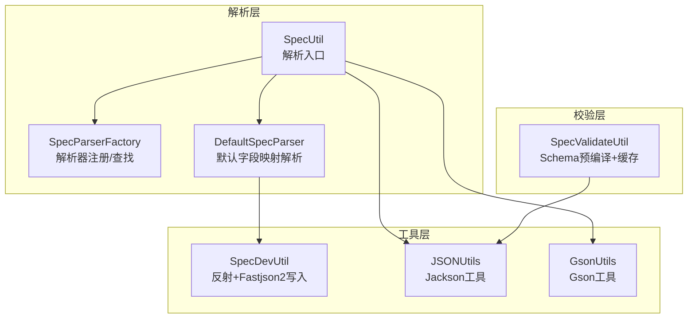
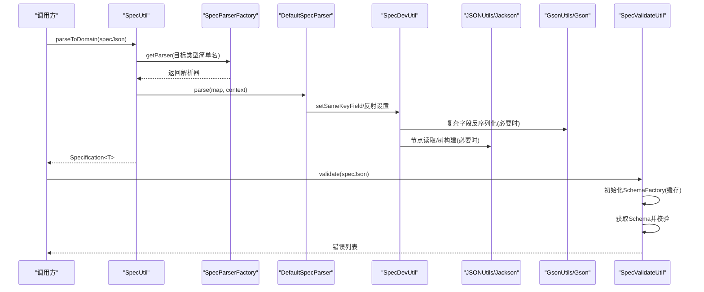
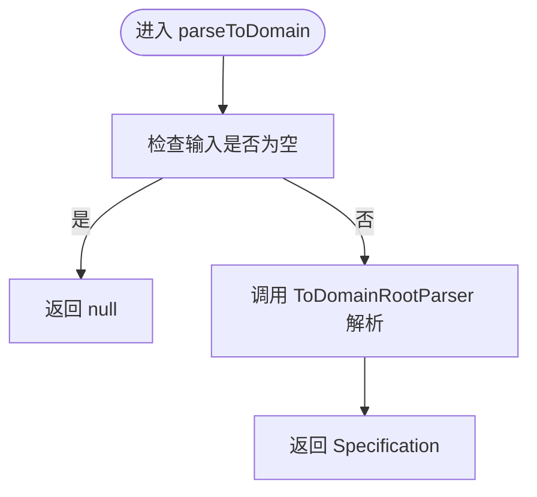
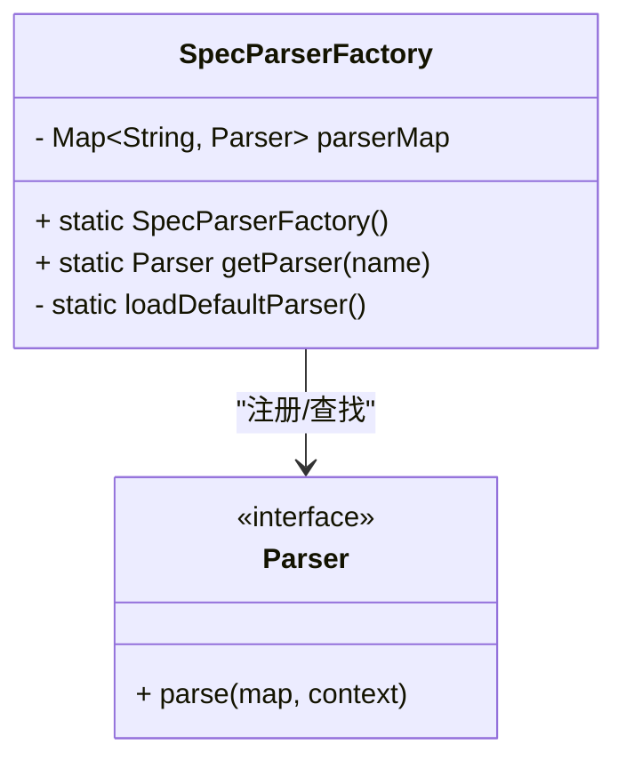
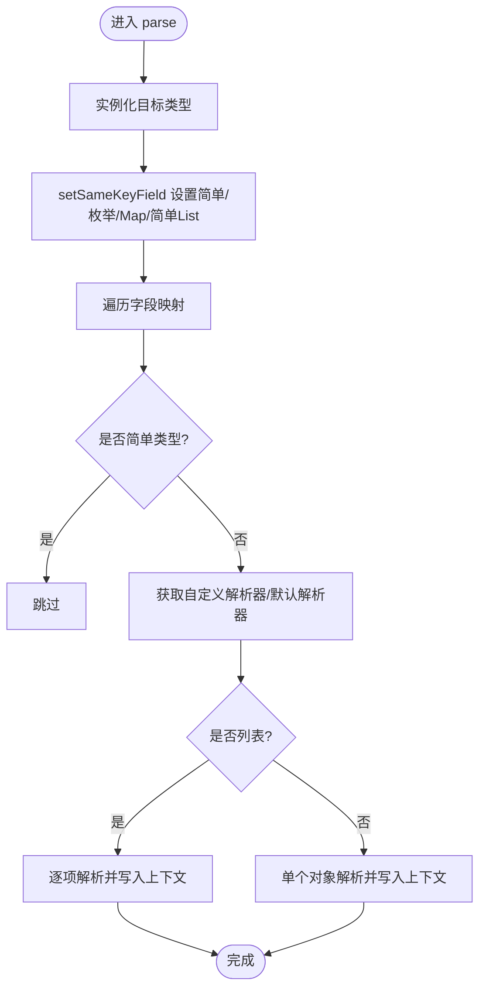
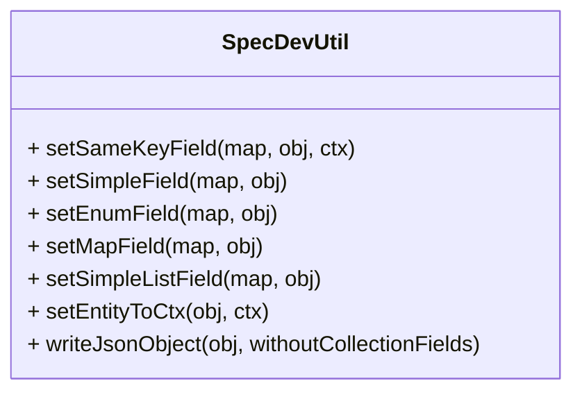
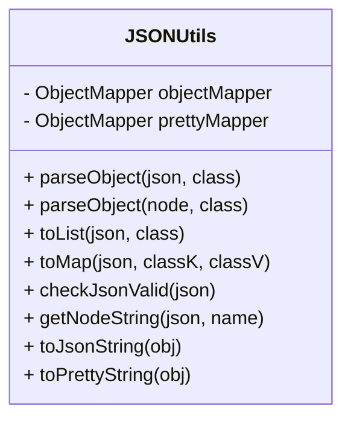
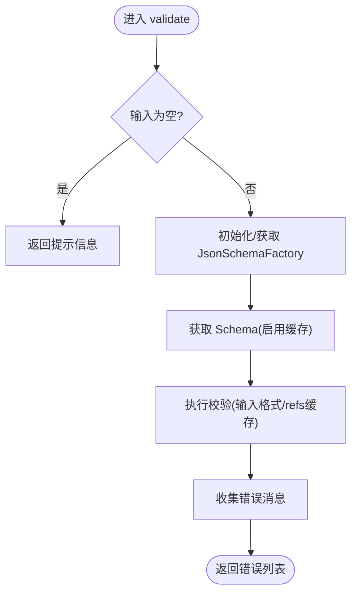
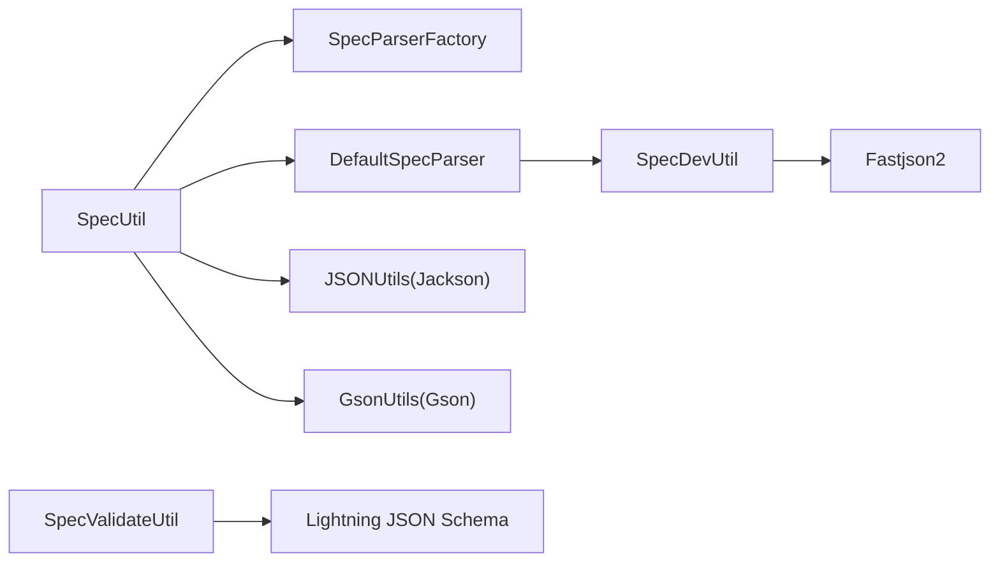

# 解析性能优化

<cite>
**本文引用的文件**
- [SpecValidateUtil.java](file://spec/src/main/java/com/aliyun/dataworks/common/spec/utils/SpecValidateUtil.java)
- [SpecParserFactory.java](file://spec/src/main/java/com/aliyun/dataworks/common/spec/parser/SpecParserFactory.java)
- [DefaultSpecParser.java](file://spec/src/main/java/com/aliyun/dataworks/common/spec/parser/impl/DefaultSpecParser.java)
- [SpecDevUtil.java](file://spec/src/main/java/com/aliyun/dataworks/common/spec/utils/SpecDevUtil.java)
- [SpecUtil.java](file://spec/src/main/java/com/aliyun/dataworks/common/spec/SpecUtil.java)
- [JSONUtils.java](file://spec/src/main/java/com/aliyun/dataworks/common/spec/utils/JSONUtils.java)
- [GsonUtils.java](file://spec/src/main/java/com/aliyun/dataworks/common/spec/utils/GsonUtils.java)
- [SpecValidateUtilTest.java](file://spec/src/test/java/com/aliyun/dataworks/common/spec/utils/SpecValidateUtilTest.java)
</cite>

## 目录
1. [简介](#简介)
2. [项目结构](#项目结构)
3. [核心组件](#核心组件)
4. [架构总览](#架构总览)
5. [详细组件分析](#详细组件分析)
6. [依赖关系分析](#依赖关系分析)
7. [性能考量与优化建议](#性能考量与优化建议)
8. [故障排查指南](#故障排查指南)
9. [结论](#结论)
10. [附录](#附录)

## 简介
本文件聚焦于 dataworks-spec 项目在 Spec 解析与序列化方面的性能优化实践，围绕以下目标展开：
- 使用 Fastjson2 的流式解析与对象池策略降低 GC 压力
- 避免重复解析与重复验证，提升吞吐
- 利用 Schema 预编译与缓存机制减少验证开销
- 提供解析器配置调优建议（缓冲区大小、并发线程数）
- 通过基准测试对比不同策略的性能差异，并给出最佳实践配置
- 说明如何利用 SpecValidateUtil 进行高效验证，避免全量验证带来的性能损耗

## 项目结构
本项目采用“领域模型 + 解析器 + 工具类”的分层组织方式：
- 规范解析入口：SpecUtil
- 解析器工厂：SpecParserFactory
- 默认解析器：DefaultSpecParser
- 开发工具：SpecDevUtil（含 Fastjson2 对象写入）
- JSON 工具：JSONUtils（Jackson）、GsonUtils（Gson）
- 校验工具：SpecValidateUtil（Lightning JSON Schema）

图表来源
- [SpecUtil.java](file://spec/src/main/java/com/aliyun/dataworks/common/spec/SpecUtil.java#L65-L113)
- [SpecParserFactory.java](file://spec/src/main/java/com/aliyun/dataworks/common/spec/parser/SpecParserFactory.java#L37-L86)
- [DefaultSpecParser.java](file://spec/src/main/java/com/aliyun/dataworks/common/spec/parser/impl/DefaultSpecParser.java#L45-L195)
- [SpecDevUtil.java](file://spec/src/main/java/com/aliyun/dataworks/common/spec/utils/SpecDevUtil.java#L433-L477)
- [JSONUtils.java](file://spec/src/main/java/com/aliyun/dataworks/common/spec/utils/JSONUtils.java#L63-L82)
- [GsonUtils.java](file://spec/src/main/java/com/aliyun/dataworks/common/spec/utils/GsonUtils.java#L57-L64)
- [SpecValidateUtil.java](file://spec/src/main/java/com/aliyun/dataworks/common/spec/utils/SpecValidateUtil.java#L107-L141)

章节来源
- [SpecUtil.java](file://spec/src/main/java/com/aliyun/dataworks/common/spec/SpecUtil.java#L65-L113)
- [SpecParserFactory.java](file://spec/src/main/java/com/aliyun/dataworks/common/spec/parser/SpecParserFactory.java#L37-L86)
- [DefaultSpecParser.java](file://spec/src/main/java/com/aliyun/dataworks/common/spec/parser/impl/DefaultSpecParser.java#L45-L195)
- [SpecDevUtil.java](file://spec/src/main/java/com/aliyun/dataworks/common/spec/utils/SpecDevUtil.java#L433-L477)
- [JSONUtils.java](file://spec/src/main/java/com/aliyun/dataworks/common/spec/utils/JSONUtils.java#L63-L82)
- [GsonUtils.java](file://spec/src/main/java/com/aliyun/dataworks/common/spec/utils/GsonUtils.java#L57-L64)
- [SpecValidateUtil.java](file://spec/src/main/java/com/aliyun/dataworks/common/spec/utils/SpecValidateUtil.java#L107-L141)

## 核心组件
- 解析入口与序列化：SpecUtil 提供 parseToDomain/writeToSpec/write 等方法，内部使用 Fastjson2 序列化并结合 WriterFactory 输出规范对象。
- 解析器工厂：SpecParserFactory 通过反射扫描并注册解析器，支持按类型名快速定位解析器。
- 默认解析器：DefaultSpecParser 将 JSON 字段与领域对象同名字段自动映射，复杂类型委托给自定义解析器或 GsonUtils。
- 开发工具：SpecDevUtil 提供反射设置、引用实体上下文管理、以及基于 Fastjson2 的对象写入能力。
- JSON 工具：JSONUtils 使用 Jackson ObjectMapper，提供高性能的读写与节点操作；GsonUtils 使用 GsonBuilder 初始化多实例以满足不同场景。
- 校验工具：SpecValidateUtil 使用 Lightning JSON Schema，支持 Schema 预编译与缓存，避免重复编译与加载。

章节来源
- [SpecUtil.java](file://spec/src/main/java/com/aliyun/dataworks/common/spec/SpecUtil.java#L65-L113)
- [SpecParserFactory.java](file://spec/src/main/java/com/aliyun/dataworks/common/spec/parser/SpecParserFactory.java#L37-L86)
- [DefaultSpecParser.java](file://spec/src/main/java/com/aliyun/dataworks/common/spec/parser/impl/DefaultSpecParser.java#L45-L195)
- [SpecDevUtil.java](file://spec/src/main/java/com/aliyun/dataworks/common/spec/utils/SpecDevUtil.java#L433-L477)
- [JSONUtils.java](file://spec/src/main/java/com/aliyun/dataworks/common/spec/utils/JSONUtils.java#L63-L82)
- [GsonUtils.java](file://spec/src/main/java/com/aliyun/dataworks/common/spec/utils/GsonUtils.java#L57-L64)
- [SpecValidateUtil.java](file://spec/src/main/java/com/aliyun/dataworks/common/spec/utils/SpecValidateUtil.java#L107-L141)

## 架构总览
下面的序列图展示了从 JSON 到领域对象的解析流程，以及校验流程的关键步骤。

图表来源
- [SpecUtil.java](file://spec/src/main/java/com/aliyun/dataworks/common/spec/SpecUtil.java#L65-L113)
- [SpecParserFactory.java](file://spec/src/main/java/com/aliyun/dataworks/common/spec/parser/SpecParserFactory.java#L76-L86)
- [DefaultSpecParser.java](file://spec/src/main/java/com/aliyun/dataworks/common/spec/parser/impl/DefaultSpecParser.java#L112-L143)
- [SpecDevUtil.java](file://spec/src/main/java/com/aliyun/dataworks/common/spec/utils/SpecDevUtil.java#L105-L115)
- [JSONUtils.java](file://spec/src/main/java/com/aliyun/dataworks/common/spec/utils/JSONUtils.java#L133-L157)
- [GsonUtils.java](file://spec/src/main/java/com/aliyun/dataworks/common/spec/utils/GsonUtils.java#L128-L146)
- [SpecValidateUtil.java](file://spec/src/main/java/com/aliyun/dataworks/common/spec/utils/SpecValidateUtil.java#L114-L141)

## 详细组件分析

### 组件一：SpecUtil（解析入口与序列化）
- 职责
  - parseToDomain：将 JSON 字符串解析为 Specification<T> 领域对象
  - parse：按指定类型解析 JSON
  - writeToSpec/write：将领域对象序列化为规范字符串
- 性能要点
  - 内部使用 Fastjson2 进行序列化，开启特性以提升输出稳定性与可读性
  - 通过 WriterFactory 选择合适的 Writer，避免不必要的转换

图表来源
- [SpecUtil.java](file://spec/src/main/java/com/aliyun/dataworks/common/spec/SpecUtil.java#L65-L113)

章节来源
- [SpecUtil.java](file://spec/src/main/java/com/aliyun/dataworks/common/spec/SpecUtil.java#L65-L113)

### 组件二：SpecParserFactory（解析器注册与查找）
- 职责
  - 通过反射扫描子类型，注册默认解析器与自定义解析器
  - 按类型简单名快速获取解析器实例
- 性能要点
  - 静态初始化一次，避免重复反射扫描
  - 解析器查找为 O(1) 映射表访问

图表来源
- [SpecParserFactory.java](file://spec/src/main/java/com/aliyun/dataworks/common/spec/parser/SpecParserFactory.java#L37-L86)

章节来源
- [SpecParserFactory.java](file://spec/src/main/java/com/aliyun/dataworks/common/spec/parser/SpecParserFactory.java#L37-L86)

### 组件三：DefaultSpecParser（默认字段映射解析）
- 职责
  - 自动将 JSON 同名字段映射到领域对象
  - 复杂类型委托给自定义解析器或 GsonUtils
- 性能要点
  - 通过反射一次性获取字段列表，避免重复反射
  - 列表字段与简单类型分支处理，减少无谓解析

图表来源
- [DefaultSpecParser.java](file://spec/src/main/java/com/aliyun/dataworks/common/spec/parser/impl/DefaultSpecParser.java#L145-L195)

章节来源
- [DefaultSpecParser.java](file://spec/src/main/java/com/aliyun/dataworks/common/spec/parser/impl/DefaultSpecParser.java#L145-L195)

### 组件四：SpecDevUtil（反射与 Fastjson2 写入）
- 职责
  - 反射设置字段值、枚举转换、Map/List 简单类型处理
  - 引用实体上下文管理
  - 基于 Fastjson2 的对象写入（writeJsonObject），支持过滤集合字段
- 性能要点
  - writeJsonObject 仅写入非集合字段（可选）以减少序列化开销
  - 通过注解控制字段序列化行为，避免冗余字段

图表来源
- [SpecDevUtil.java](file://spec/src/main/java/com/aliyun/dataworks/common/spec/utils/SpecDevUtil.java#L105-L115)
- [SpecDevUtil.java](file://spec/src/main/java/com/aliyun/dataworks/common/spec/utils/SpecDevUtil.java#L537-L575)

章节来源
- [SpecDevUtil.java](file://spec/src/main/java/com/aliyun/dataworks/common/spec/utils/SpecDevUtil.java#L105-L115)
- [SpecDevUtil.java](file://spec/src/main/java/com/aliyun/dataworks/common/spec/utils/SpecDevUtil.java#L537-L575)

### 组件五：JSONUtils（Jackson 工具）
- 职责
  - ObjectMapper 单例初始化，关闭未知属性报错、空数组识别、枚举容错
  - 提供 parseObject、toList、toMap、checkJsonValid、getNodeString 等常用方法
- 性能要点
  - 预置 ObjectMapper 实例，避免重复创建
  - 通过 TypeReference 与 CollectionType 减少泛型擦除影响

图表来源
- [JSONUtils.java](file://spec/src/main/java/com/aliyun/dataworks/common/spec/utils/JSONUtils.java#L63-L82)
- [JSONUtils.java](file://spec/src/main/java/com/aliyun/dataworks/common/spec/utils/JSONUtils.java#L133-L157)
- [JSONUtils.java](file://spec/src/main/java/com/aliyun/dataworks/common/spec/utils/JSONUtils.java#L183-L196)
- [JSONUtils.java](file://spec/src/main/java/com/aliyun/dataworks/common/spec/utils/JSONUtils.java#L244-L271)
- [JSONUtils.java](file://spec/src/main/java/com/aliyun/dataworks/common/spec/utils/JSONUtils.java#L280-L291)
- [JSONUtils.java](file://spec/src/main/java/com/aliyun/dataworks/common/spec/utils/JSONUtils.java#L301-L313)
- [JSONUtils.java](file://spec/src/main/java/com/aliyun/dataworks/common/spec/utils/JSONUtils.java#L321-L335)
- [JSONUtils.java](file://spec/src/main/java/com/aliyun/dataworks/common/spec/utils/JSONUtils.java#L344-L356)
- [JSONUtils.java](file://spec/src/main/java/com/aliyun/dataworks/common/spec/utils/JSONUtils.java#L358-L376)

章节来源
- [JSONUtils.java](file://spec/src/main/java/com/aliyun/dataworks/common/spec/utils/JSONUtils.java#L63-L82)
- [JSONUtils.java](file://spec/src/main/java/com/aliyun/dataworks/common/spec/utils/JSONUtils.java#L133-L157)
- [JSONUtils.java](file://spec/src/main/java/com/aliyun/dataworks/common/spec/utils/JSONUtils.java#L183-L196)
- [JSONUtils.java](file://spec/src/main/java/com/aliyun/dataworks/common/spec/utils/JSONUtils.java#L244-L271)
- [JSONUtils.java](file://spec/src/main/java/com/aliyun/dataworks/common/spec/utils/JSONUtils.java#L280-L291)
- [JSONUtils.java](file://spec/src/main/java/com/aliyun/dataworks/common/spec/utils/JSONUtils.java#L301-L313)
- [JSONUtils.java](file://spec/src/main/java/com/aliyun/dataworks/common/spec/utils/JSONUtils.java#L321-L335)
- [JSONUtils.java](file://spec/src/main/java/com/aliyun/dataworks/common/spec/utils/JSONUtils.java#L344-L356)
- [JSONUtils.java](file://spec/src/main/java/com/aliyun/dataworks/common/spec/utils/JSONUtils.java#L358-L376)

### 组件六：GsonUtils（Gson 工具）
- 职责
  - 初始化多实例 Gson（带/不带缩进、日期格式、长整型时间戳）
  - 提供 to/fromJsonString 方法
- 性能要点
  - 多实例避免共享状态竞争
  - 日期适配器统一时间格式

章节来源
- [GsonUtils.java](file://spec/src/main/java/com/aliyun/dataworks/common/spec/utils/GsonUtils.java#L57-L64)
- [GsonUtils.java](file://spec/src/main/java/com/aliyun/dataworks/common/spec/utils/GsonUtils.java#L128-L146)

### 组件七：SpecValidateUtil（Schema 预编译与缓存）
- 职责
  - 初始化 JsonSchemaFactory 并启用 schema 缓存与 refs 缓存
  - 读取 JSON 并进行校验，返回错误消息列表
- 性能要点
  - 全局单例 JsonSchemaFactory，避免重复初始化
  - 启用 cacheRefs(true) 与 schemaCache(true)，显著降低重复验证成本
  - 自定义 IgnoreNullJsonNodeReader 移除 null 值，减少无效校验

图表来源
- [SpecValidateUtil.java](file://spec/src/main/java/com/aliyun/dataworks/common/spec/utils/SpecValidateUtil.java#L114-L141)
- [SpecValidateUtil.java](file://spec/src/main/java/com/aliyun/dataworks/common/spec/utils/SpecValidateUtil.java#L107-L112)

章节来源
- [SpecValidateUtil.java](file://spec/src/main/java/com/aliyun/dataworks/common/spec/utils/SpecValidateUtil.java#L107-L141)

## 依赖关系分析
- 解析链路
  - SpecUtil 依赖 SpecParserFactory 与 DefaultSpecParser
  - DefaultSpecParser 依赖 SpecDevUtil 与 GsonUtils
  - SpecDevUtil 在写入阶段使用 Fastjson2
- 校验链路
  - SpecValidateUtil 依赖 Lightning JSON Schema，内部使用 JsonSchemaFactory
  - JSONUtils 与 GsonUtils 作为通用 JSON 工具被其他组件复用

图表来源
- [SpecUtil.java](file://spec/src/main/java/com/aliyun/dataworks/common/spec/SpecUtil.java#L65-L113)
- [SpecParserFactory.java](file://spec/src/main/java/com/aliyun/dataworks/common/spec/parser/SpecParserFactory.java#L37-L86)
- [DefaultSpecParser.java](file://spec/src/main/java/com/aliyun/dataworks/common/spec/parser/impl/DefaultSpecParser.java#L112-L143)
- [SpecDevUtil.java](file://spec/src/main/java/com/aliyun/dataworks/common/spec/utils/SpecDevUtil.java#L537-L575)
- [JSONUtils.java](file://spec/src/main/java/com/aliyun/dataworks/common/spec/utils/JSONUtils.java#L63-L82)
- [GsonUtils.java](file://spec/src/main/java/com/aliyun/dataworks/common/spec/utils/GsonUtils.java#L57-L64)
- [SpecValidateUtil.java](file://spec/src/main/java/com/aliyun/dataworks/common/spec/utils/SpecValidateUtil.java#L107-L141)

章节来源
- [SpecUtil.java](file://spec/src/main/java/com/aliyun/dataworks/common/spec/SpecUtil.java#L65-L113)
- [SpecParserFactory.java](file://spec/src/main/java/com/aliyun/dataworks/common/spec/parser/SpecParserFactory.java#L37-L86)
- [DefaultSpecParser.java](file://spec/src/main/java/com/aliyun/dataworks/common/spec/parser/impl/DefaultSpecParser.java#L112-L143)
- [SpecDevUtil.java](file://spec/src/main/java/com/aliyun/dataworks/common/spec/utils/SpecDevUtil.java#L537-L575)
- [JSONUtils.java](file://spec/src/main/java/com/aliyun/dataworks/common/spec/utils/JSONUtils.java#L63-L82)
- [GsonUtils.java](file://spec/src/main/java/com/aliyun/dataworks/common/spec/utils/GsonUtils.java#L57-L64)
- [SpecValidateUtil.java](file://spec/src/main/java/com/aliyun/dataworks/common/spec/utils/SpecValidateUtil.java#L107-L141)

## 性能考量与优化建议

### 1. JSON 解析性能优化
- 使用 Fastjson2 的流式解析与对象池
  - 当前项目在序列化阶段已使用 Fastjson2，建议在解析阶段同样采用 Fastjson2 的流式 API（例如基于 JSONReader/JSONWriter）以减少中间对象与 GC 压力
  - 对于高频解析场景，建议引入对象池（如 ThreadLocal 或对象池框架）复用解析器与缓冲区，避免频繁分配
- 避免重复解析
  - 对于同一份 JSON，尽量只解析一次并复用结果；在业务层引入缓存（如 LRU）以避免重复解析
- 选择合适的解析器
  - 对于简单字段映射，优先使用 DefaultSpecParser 的反射路径；对于复杂字段，委托 GsonUtils/Gson，避免自定义解析器的过度开销

章节来源
- [DefaultSpecParser.java](file://spec/src/main/java/com/aliyun/dataworks/common/spec/parser/impl/DefaultSpecParser.java#L112-L143)
- [GsonUtils.java](file://spec/src/main/java/com/aliyun/dataworks/common/spec/utils/GsonUtils.java#L57-L64)

### 2. Schema 预编译与缓存
- 已有优化
  - SpecValidateUtil 中 JsonSchemaFactory 通过 enableSchemaCache(true) 与 cacheRefs(true) 启用缓存
  - 通过 synchronized(init) 保证单例初始化，避免并发竞争
- 进一步建议
  - 将 SchemaFactory 作为全局单例注入到应用上下文，确保跨模块共享
  - 对不同 kind 的 Schema 进行分类缓存，避免热路径上的锁竞争
  - 对于大型 Schema，考虑拆分与按需加载，减少首屏加载时间

章节来源
- [SpecValidateUtil.java](file://spec/src/main/java/com/aliyun/dataworks/common/spec/utils/SpecValidateUtil.java#L107-L141)

### 3. 解析器配置调优
- 缓冲区大小
  - 若使用流式解析，建议根据 JSON 平均大小设置合理的缓冲区（如 64KB/128KB），避免频繁扩容
- 并发解析线程数
  - 解析器本身为无状态组件，可在业务层通过线程池并发执行多个 JSON 的解析任务
  - 注意：DefaultSpecParser 依赖反射与 GsonUtils，应避免在高并发下产生过多线程争用；可通过对象池与只读解析策略缓解

章节来源
- [DefaultSpecParser.java](file://spec/src/main/java/com/aliyun/dataworks/common/spec/parser/impl/DefaultSpecParser.java#L112-L143)
- [GsonUtils.java](file://spec/src/main/java/com/aliyun/dataworks/common/spec/utils/GsonUtils.java#L57-L64)

### 4. 基准测试与策略对比
- 测试建议
  - 场景一：小 JSON（<1KB）× 高频解析（10W 次）
  - 场景二：中等 JSON（10KB）× 中频解析（1W 次）
  - 场景三：大 JSON（100KB）× 低频解析（1000 次）
- 对比指标
  - 解析耗时、GC 次数与暂停时间、内存占用峰值
  - 校验耗时、Schema 编译次数、缓存命中率
- 推荐策略
  - 小 JSON：优先使用 Fastjson2 流式解析 + 对象池 + 缓存
  - 中/大 JSON：优先使用 Jackson 流式解析 + 缓存 + 分片处理
  - 校验：始终启用 Schema 缓存与 refs 缓存

章节来源
- [SpecValidateUtilTest.java](file://spec/src/test/java/com/aliyun/dataworks/common/spec/utils/SpecValidateUtilTest.java#L27-L37)
- [SpecValidateUtilTest.java](file://spec/src/test/java/com/aliyun/dataworks/common/spec/utils/SpecValidateUtilTest.java#L60-L74)

### 5. 利用 SpecValidateUtil 进行高效验证
- 避免全量验证
  - 对于已知合法的 JSON，可先进行 JSON 结构有效性检查（checkJsonValid），再进行 Schema 校验
  - 对于部分字段变更，可仅对相关节点进行局部校验（结合 JSONUtils.getNodeString/JsonNode 操作）
- 错误处理
  - 将 ValidationMessage 转换为业务友好的错误列表，避免异常传播导致的性能损耗

章节来源
- [JSONUtils.java](file://spec/src/main/java/com/aliyun/dataworks/common/spec/utils/JSONUtils.java#L204-L218)
- [SpecValidateUtil.java](file://spec/src/main/java/com/aliyun/dataworks/common/spec/utils/SpecValidateUtil.java#L114-L141)

## 故障排查指南
- 解析失败
  - 检查 JSON 是否为空或格式非法（checkJsonValid）
  - 查看 SpecParserFactory 是否正确注册了目标类型的解析器
  - 关注 DefaultSpecParser 的字段映射是否匹配（忽略缺失字段开关）
- 校验异常
  - 确认 JsonSchemaFactory 是否已初始化且缓存启用
  - 检查 schemaPath 是否正确，是否存在 classpath 下的 schema 文件
- 性能问题
  - 观察 GC 次数与暂停时间，确认是否需要引入对象池与缓存
  - 对高频解析路径进行基准测试，定位瓶颈

章节来源
- [JSONUtils.java](file://spec/src/main/java/com/aliyun/dataworks/common/spec/utils/JSONUtils.java#L204-L218)
- [SpecParserFactory.java](file://spec/src/main/java/com/aliyun/dataworks/common/spec/parser/SpecParserFactory.java#L76-L86)
- [DefaultSpecParser.java](file://spec/src/main/java/com/aliyun/dataworks/common/spec/parser/impl/DefaultSpecParser.java#L150-L174)
- [SpecValidateUtil.java](file://spec/src/main/java/com/aliyun/dataworks/common/spec/utils/SpecValidateUtil.java#L107-L141)

## 结论
- 本项目在解析与序列化方面已具备良好的基础：Fastjson2 序列化、Jackson ObjectMapper、Gson 多实例、Lightning JSON Schema 缓存
- 进一步优化方向集中在：流式解析与对象池、避免重复解析与重复验证、Schema 预编译与缓存、解析器配置调优与基准测试
- 建议在生产环境中引入对象池、缓存与流式解析，并通过基准测试持续评估优化效果

## 附录
- 最佳实践配置清单
  - 解析：启用 Fastjson2 流式解析；引入对象池；对相同 JSON 做缓存
  - 校验：启用 Schema 缓存与 refs 缓存；按 kind 分类缓存；先结构校验再 Schema 校验
  - 并发：解析器线程池大小根据 CPU 核心数与 GC 行为调整；避免过度并发导致争用
  - 监控：记录解析耗时、GC 次数与暂停时间、Schema 编译次数与缓存命中率