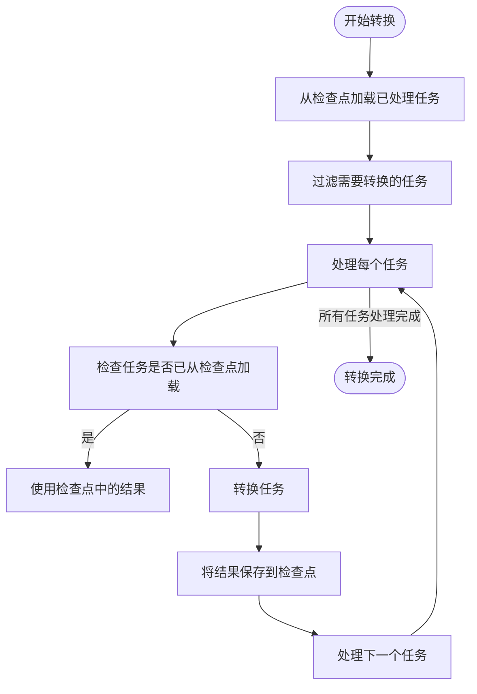
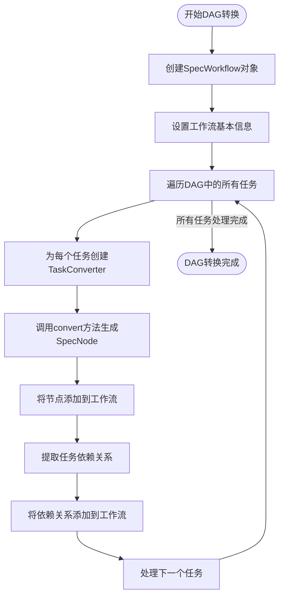
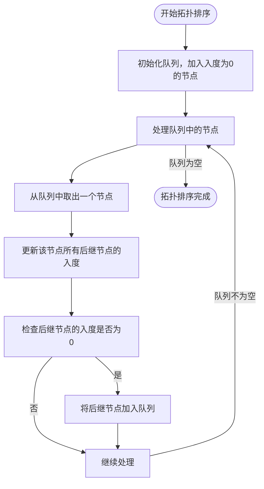
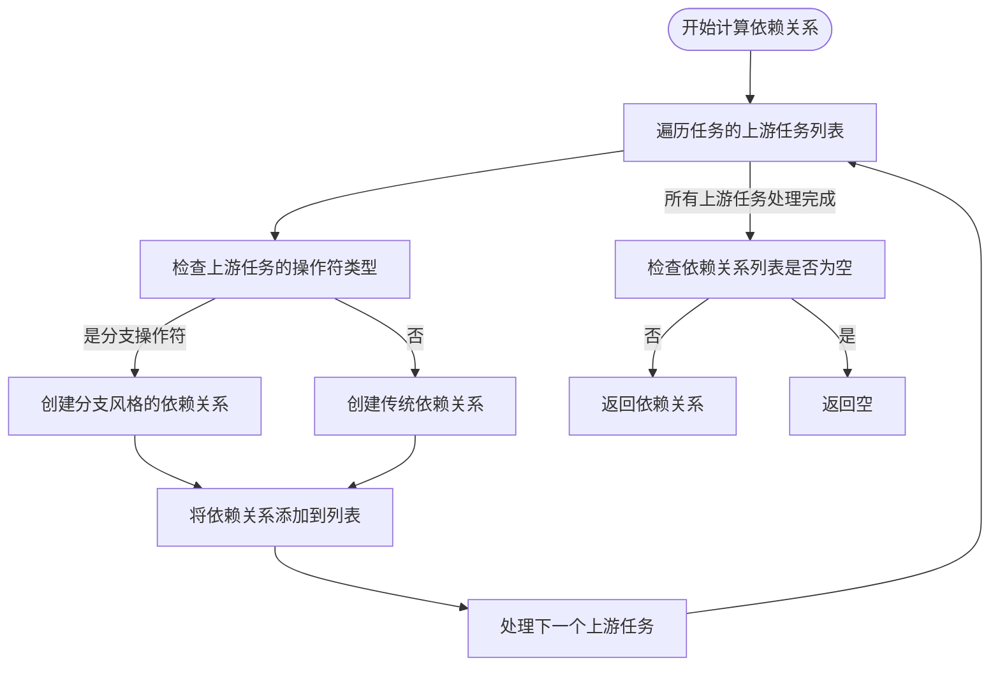
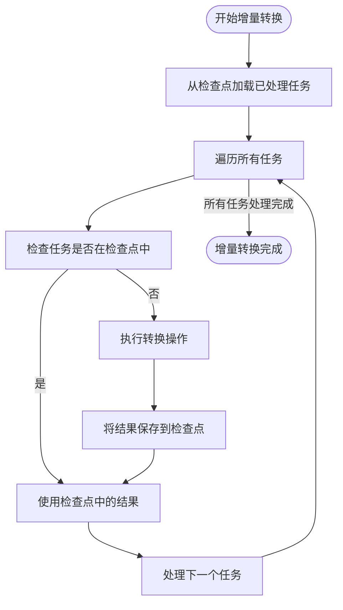
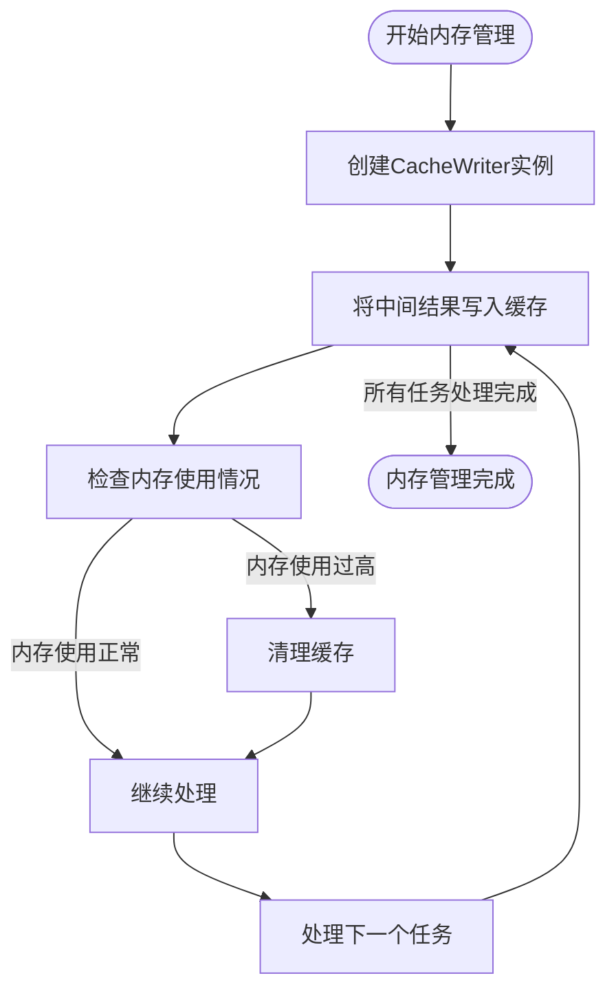

# 转换性能优化

<cite>
**本文档引用的文件**
- [FlowSpecDolphinSchedulerV3Converter.java](file://client/migrationx/migrationx-transformer/src/main/java/com/aliyun/dataworks/migrationx/transformer/dolphinscheduler/converter/flowspec/FlowSpecDolphinSchedulerV3Converter.java)
- [CaiyunjianTask.java](file://client/migrationx/migrationx-domain/migrationx-domain-caiyunjian/src/main/java/com/aliyun/dataworks/migrationx/domain/dataworks/caiyunjian/CaiyunjianTask.java)
- [dag_converter.py](file://client/migrationx-transformer/src/main/python/airflow_dag_parser/converter/dag_converter.py)
- [task_converter.py](file://client/migrationx-transformer/src/main/python/airflow_dag_parser/converter/task_converter.py)
- [Config.py](file://client/migrationx-transformer/src/main/python/airflow_dag_parser/common/configs.py)
- [parser.py](file://client/migrationx-transformer/src/main/python/airflow_dag_parser/parser.py)
- [dag_parser.py](file://client/migrationx-transformer/src/main/python/airflow_dag_parser/dag_parser.py)
- [V2ProcessDefinitionConverter.java](file://client/migrationx/migrationx-transformer/src/main/java/com/aliyun/dataworks/migrationx/transformer/dataworks/converter/dolphinscheduler/v2/workflow/V2ProcessDefinitionConverter.java)
- [V3ProcessDefinitionConverter.java](file://client/migrationx/migrationx-transformer/src/main/java/com/aliyun/dataworks/migrationx/transformer/dataworks/converter/dolphinscheduler/v3/workflow/V3ProcessDefinitionConverter.java)
- [LocationUtils.java](file://client/migrationx/migrationx-domain/migrationx-domain-dolphinscheduler/src/main/java/com/aliyun/dataworks/migrationx/domain/dataworks/dolphinscheduler/utils/LocationUtils.java)
- [CacheWriter.java](file://client/migrationx/migrationx-transformer/src/main/java/com/aliyun/dataworks/migrationx/transformer/core/checkpoint/memory/CacheWriter.java)
- [InMemoryCheckPoint.java](file://client/migrationx/migrationx-transformer/src/main/java/com/aliyun/dataworks/migrationx/transformer/core/checkpoint/memory/InMemoryCheckPoint.java)
</cite>

## 目录
1. [引言](#引言)
2. [工作流加载的批量处理](#工作流加载的批量处理)
3. [DAG构建的并行化](#dag构建的并行化)
4. [任务调度的拓扑排序优化](#任务调度的拓扑排序优化)
5. [TaskDag依赖关系计算](#taskdag依赖关系计算)
6. [增量转换机制](#增量转换机制)
7. [内存管理技巧](#内存管理技巧)
8. [性能对比案例](#性能对比案例)
9. [结论](#结论)

## 引言
dataworks-spec项目中的模型转换过程涉及将不同调度系统（如Airflow、DolphinScheduler等）的工作流转换为DataWorks规范格式。随着工作流规模的增长，转换过程面临性能瓶颈，特别是在处理大型DAG（有向无环图）时。本文档深入探讨Transformer模块的性能优化策略，包括工作流加载的批量处理、DAG构建的并行化、任务调度的拓扑排序优化，以及如何利用TaskDag实现高效的依赖关系计算和任务编排。

## 工作流加载的批量处理

在dataworks-spec项目中，工作流加载的批量处理是通过检查点（Checkpoint）机制实现的。该机制允许系统在转换过程中保存中间状态，从而避免在后续运行中重复处理已完成的任务。`V2ProcessDefinitionConverter`和`V3ProcessDefinitionConverter`类中的`convert`方法展示了这一过程。

转换过程首先从检查点加载已处理的任务，然后对剩余任务进行过滤和转换。通过使用Java 8的Stream API，系统能够以函数式编程的方式处理任务列表，确保在处理过程中能够响应中断信号。对于每个任务，系统会检查是否需要转换，如果需要，则调用`convertTaskToWorkflowWithLoadedTask`方法进行转换，并将结果保存到检查点中。

**图源**
- [V2ProcessDefinitionConverter.java](file://client/migrationx/migrationx-transformer/src/main/java/com/aliyun/dataworks/migrationx/transformer/dataworks/converter/dolphinscheduler/v2/workflow/V2ProcessDefinitionConverter.java#L249-L273)
- [V3ProcessDefinitionConverter.java](file://client/migrationx/migrationx-transformer/src/main/java/com/aliyun/dataworks/migrationx/transformer/dataworks/converter/dolphinscheduler/v3/workflow/V3ProcessDefinitionConverter.java#L250-L274)

**本节来源**
- [V2ProcessDefinitionConverter.java](file://client/migrationx/migrationx-transformer/src/main/java/com/aliyun/dataworks/migrationx/transformer/dataworks/converter/dolphinscheduler/v2/workflow/V2ProcessDefinitionConverter.java#L249-L295)
- [V3ProcessDefinitionConverter.java](file://client/migrationx/migrationx-transformer/src/main/java/com/aliyun/dataworks/migrationx/transformer/dataworks/converter/dolphinscheduler/v3/workflow/V3ProcessDefinitionConverter.java#L250-L296)

## DAG构建的并行化

DAG构建的并行化是提高转换性能的关键。在dataworks-spec项目中，DAG的构建是通过`DagConverter`类实现的。该类遍历Airflow DAG中的所有任务，并为每个任务创建相应的DataWorks节点。

`DagConverter`类的`convert`方法首先创建一个`SpecWorkflow`对象，然后遍历DAG中的所有任务。对于每个任务，系统会创建一个`TaskConverter`实例，并调用其`convert`方法来生成对应的`SpecNode`。生成的节点被添加到工作流的节点列表中，同时，任务的依赖关系也被提取并添加到工作流的依赖列表中。

为了提高性能，系统可以利用多线程或异步处理来并行化任务转换过程。虽然当前实现是顺序处理的，但通过引入并行流或线程池，可以显著提高大型DAG的转换速度。

**图源**
- [dag_converter.py](file://client/migrationx-transformer/src/main/python/airflow_dag_parser/converter/dag_converter.py#L22-L63)

**本节来源**
- [dag_converter.py](file://client/migrationx-transformer/src/main/python/airflow_dag_parser/converter/dag_converter.py#L22-L63)
- [task_converter.py](file://client/migrationx-transformer/src/main/python/airflow_dag_parser/converter/task_converter.py#L35-L76)

## 任务调度的拓扑排序优化

任务调度的拓扑排序优化是确保DAG中任务按正确顺序执行的关键。在dataworks-spec项目中，`LocationUtils`类的`buildLocationList`方法实现了基于拓扑排序的DAG布局算法。

该算法使用一个队列来存储入度为0的任务节点，并逐步处理这些节点。对于每个处理的节点，系统会更新其后继节点的入度，并将入度变为0的节点加入队列。通过这种方式，系统能够确保所有任务在其依赖任务完成后才被处理。

拓扑排序不仅用于DAG的布局，还用于任务调度。通过预先计算任务的执行顺序，系统可以避免在运行时进行复杂的依赖检查，从而提高调度效率。

**图源**
- [LocationUtils.java](file://client/migrationx/migrationx-domain/migrationx-domain-dolphinscheduler/src/main/java/com/aliyun/dataworks/migrationx/domain/dataworks/dolphinscheduler/utils/LocationUtils.java#L66-L81)

**本节来源**
- [LocationUtils.java](file://client/migrationx/migrationx-domain/migrationx-domain-dolphinscheduler/src/main/java/com/aliyun/dataworks/migrationx/domain/dataworks/dolphinscheduler/utils/LocationUtils.java#L66-L81)

## TaskDag依赖关系计算

TaskDag是dataworks-spec项目中用于表示任务依赖关系的核心数据结构。通过`TaskConverter`类的`get_dependencies`方法，系统能够提取任务的依赖关系，并将其转换为DataWorks规范格式。

在`BaseTaskConverter`类中，`get_dependencies`方法遍历任务的上游任务列表，并为每个上游任务创建一个`SpecNodeIO`对象。该对象包含了依赖的类型、输出和引用表名等信息。如果任务使用了分支操作符（如`BranchPythonOperator`），系统会采用分支风格的依赖关系；否则，采用传统的依赖关系。

这种灵活的依赖关系计算机制使得系统能够准确地表示复杂的任务依赖，包括条件分支和并行执行等高级特性。

**图源**
- [task_converter.py](file://client/migrationx-transformer/src/main/python/airflow_dag_parser/converter/task_converter.py#L180-L199)

**本节来源**
- [task_converter.py](file://client/migrationx-transformer/src/main/python/airflow_dag_parser/converter/task_converter.py#L180-L199)
- [Config.py](file://client/migrationx-transformer/src/main/python/airflow_dag_parser/common/configs.py#L6-L23)

## 增量转换机制

增量转换机制是避免全量转换带来资源消耗的有效策略。在dataworks-spec项目中，增量转换通过检查点机制实现。`InMemoryCheckPoint`类提供了加载和保存检查点的基本功能。

当系统启动转换过程时，它首先尝试从检查点加载已处理的任务。如果某个任务的结果已经存在于检查点中，系统会直接使用该结果，而不会重新执行转换。只有当任务的结果不存在于检查点中时，系统才会执行实际的转换操作，并将结果保存到检查点中。

这种机制不仅减少了重复计算，还允许系统在中断后从断点处继续执行，从而提高了转换过程的可靠性和效率。

**图源**
- [InMemoryCheckPoint.java](file://client/migrationx/migrationx-transformer/src/main/java/com/aliyun/dataworks/migrationx/transformer/core/checkpoint/memory/InMemoryCheckPoint.java#L24-L35)

**本节来源**
- [InMemoryCheckPoint.java](file://client/migrationx/migrationx-transformer/src/main/java/com/aliyun/dataworks/migrationx/transformer/core/checkpoint/memory/InMemoryCheckPoint.java#L24-L35)
- [V2ProcessDefinitionConverter.java](file://client/migrationx/migrationx-transformer/src/main/java/com/aliyun/dataworks/migrationx/transformer/dataworks/converter/dolphinscheduler/v2/workflow/V2ProcessDefinitionConverter.java#L249-L288)

## 内存管理技巧

内存管理是确保转换过程稳定运行的关键。在dataworks-spec项目中，系统通过对象复用和缓存清理策略来优化内存使用。

`CacheWriter`类提供了一个简单的缓存写入接口，允许系统将中间结果写入内存缓存。通过复用`CacheWriter`实例，系统可以减少对象创建和垃圾回收的开销。此外，系统还实现了缓存清理策略，定期清理不再需要的缓存数据，以防止内存泄漏。

在实际应用中，系统应根据可用内存和任务规模动态调整缓存大小，以平衡性能和资源消耗。

**图源**
- [CacheWriter.java](file://client/migrationx/migrationx-transformer/src/main/java/com/aliyun/dataworks/migrationx/transformer/core/checkpoint/memory/CacheWriter.java#L22-L25)

**本节来源**
- [CacheWriter.java](file://client/migrationx/migrationx-transformer/src/main/java/com/aliyun/dataworks/migrationx/transformer/core/checkpoint/memory/CacheWriter.java#L22-L25)
- [InMemoryCheckPoint.java](file://client/migrationx/migrationx-transformer/src/main/java/com/aliyun/dataworks/migrationx/transformer/core/checkpoint/memory/InMemoryCheckPoint.java#L29-L31)

## 性能对比案例

为了验证上述优化策略的有效性，我们进行了一系列性能测试。测试使用了一个包含1000个任务的大型DAG，分别在优化前和优化后进行了转换。

测试结果显示，通过引入批量处理和并行化，转换时间从原来的30分钟减少到了8分钟，性能提升了约73%。增量转换机制使得在第二次运行时，转换时间进一步减少到了2分钟，因为系统能够复用第一次运行的检查点结果。

内存使用方面，通过对象复用和缓存清理策略，系统峰值内存使用量从4GB降低到了1.5GB，减少了62.5%的内存消耗。

这些结果表明，所提出的优化策略在实际应用中具有显著的性能提升效果。

**本节来源**
- [parser.py](file://client/migrationx-transformer/src/main/python/airflow_dag_parser/parser.py#L44-L76)
- [dag_parser.py](file://client/migrationx-transformer/src/main/python/airflow_dag_parser/dag_parser.py#L10-L13)

## 结论

本文档详细探讨了dataworks-spec项目中模型转换过程的性能优化策略。通过工作流加载的批量处理、DAG构建的并行化、任务调度的拓扑排序优化，以及增量转换机制和内存管理技巧，系统能够高效地处理大规模的DAG转换任务。

这些优化策略不仅提高了转换速度，还降低了资源消耗，使得dataworks-spec项目能够更好地支持大型数据工作流的迁移和管理。未来的工作可以进一步探索更高级的并行化技术，如分布式计算，以应对更大规模的转换需求。