# 故障排除

<cite>
**本文档中引用的文件**  
- [SpecException.java](file://spec/src/main/java/com/aliyun/dataworks/common/spec/exception/SpecException.java)
- [SpecErrorCode.java](file://spec/src/main/java/com/aliyun/dataworks/common/spec/exception/SpecErrorCode.java)
- [SpecValidateUtil.java](file://spec/src/main/java/com/aliyun/dataworks/common/spec/utils/SpecValidateUtil.java)
- [SpecParserFactory.java](file://spec/src/main/java/com/aliyun/dataworks/common/spec/parser/SpecParserFactory.java)
- [WriterFactory.java](file://spec/src/main/java/com/aliyun/dataworks/common/spec/writer/WriterFactory.java)
- [validator.py](file://dwcli/dwcli/pkg/schema/validator.py)
- [flow.schema.json](file://schema/flow.schema.json)
- [1.json](file://schema/testcase/1.json)
- [usage.md](file://docs/migrationx/usage.md)
- [README.md](file://README.md)
</cite>

## 目录
1. [常见迁移问题](#常见迁移问题)
2. [错误诊断方法](#错误诊断方法)
3. [JSON Schema验证失败处理](#json-schema验证失败处理)
4. [不合规Spec文件修复](#不合规spec文件修复)
5. [调度系统兼容性问题](#调度系统兼容性问题)
6. [实际故障案例](#实际故障案例)

## 常见迁移问题

在dataworks-spec项目的迁移过程中，常见的问题主要包括解析错误、类型不匹配、配置问题和依赖缺失等。这些问题是迁移过程中最常见的障碍，需要系统性地识别和解决。

### 解析错误

解析错误通常发生在Spec文件的解析阶段，当Spec文件不符合预期的格式或结构时，解析器无法正确解析文件内容。根据`SpecParserFactory.java`中的实现，解析器通过反射机制加载所有可用的解析器，并根据解析器的类型进行匹配。如果找不到合适的解析器，将会抛出`PARSER_NOT_FOUND`错误。

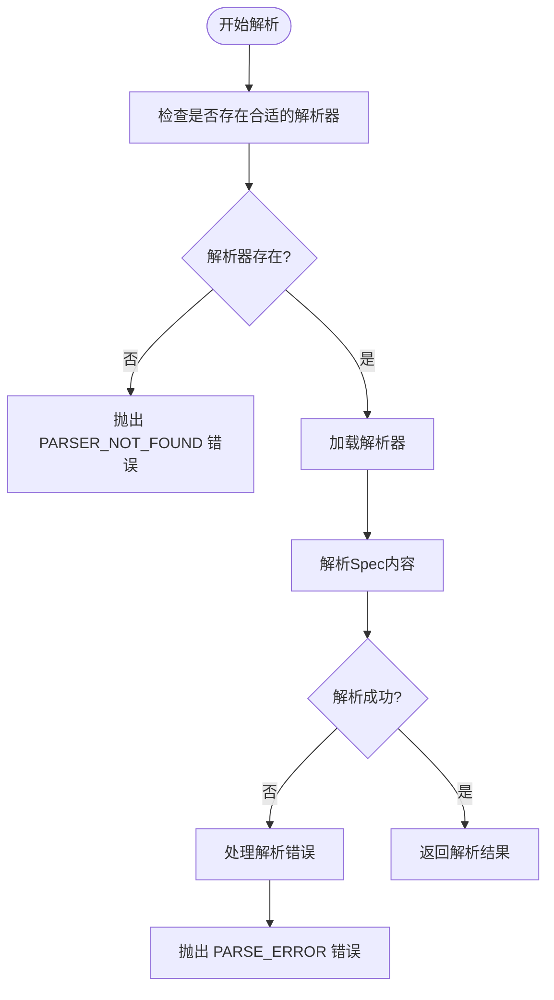

**Diagram sources**
- [SpecParserFactory.java](file://spec/src/main/java/com/aliyun/dataworks/common/spec/parser/SpecParserFactory.java#L37-L86)

**Section sources**
- [SpecParserFactory.java](file://spec/src/main/java/com/aliyun/dataworks/common/spec/parser/SpecParserFactory.java#L37-L86)

### 类型不匹配

类型不匹配问题通常发生在Spec文件中的字段类型与预期类型不一致时。根据`SpecValidateUtil.java`中的实现，验证器会检查Spec文件中的每个字段类型是否符合预期。如果类型不匹配，将会抛出相应的验证错误。

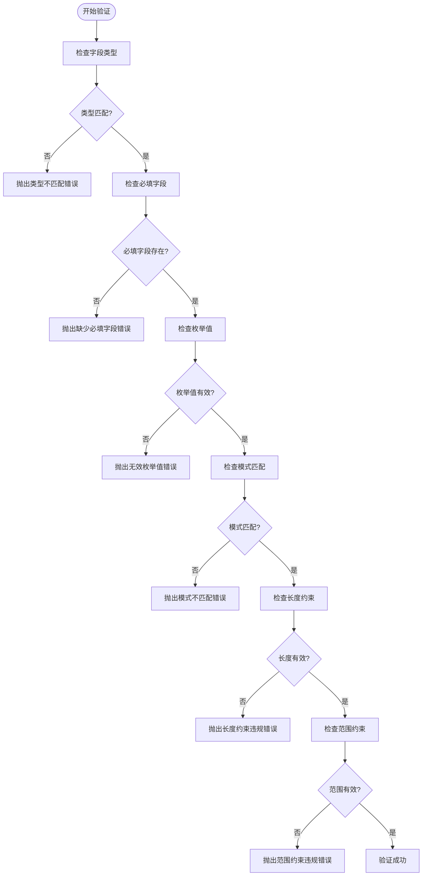

**Diagram sources**
- [SpecValidateUtil.java](file://spec/src/main/java/com/aliyun/dataworks/common/spec/utils/SpecValidateUtil.java#L58-L189)

**Section sources**
- [SpecValidateUtil.java](file://spec/src/main/java/com/aliyun/dataworks/common/spec/utils/SpecValidateUtil.java#L58-L189)

### 配置问题

配置问题通常涉及环境变量、配置文件路径和参数设置等。根据`usage.md`文档中的说明，迁移工具需要正确设置一系列环境变量和配置参数才能正常工作。

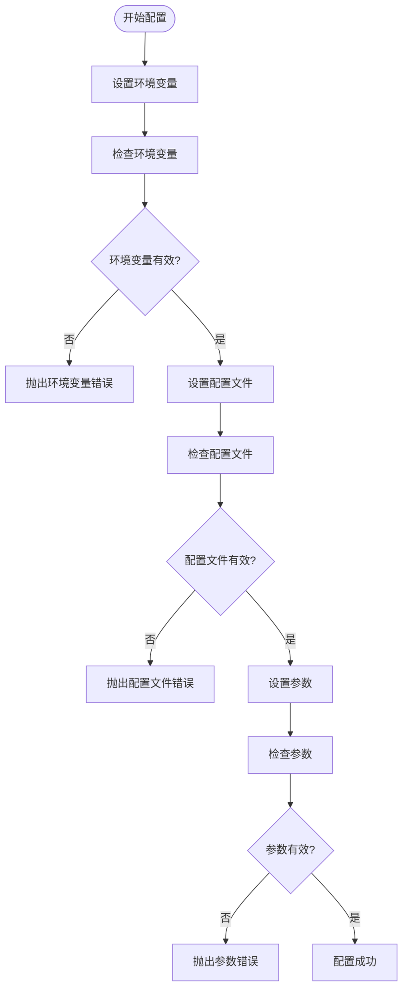

**Diagram sources**
- [usage.md](file://docs/migrationx/usage.md#L1-L276)

**Section sources**
- [usage.md](file://docs/migrationx/usage.md#L1-L276)

### 依赖缺失

依赖缺失问题通常发生在Spec文件中引用的资源或组件不存在时。根据`SpecValidateUtil.java`中的实现，验证器会检查Spec文件中引用的所有资源和组件是否存在。

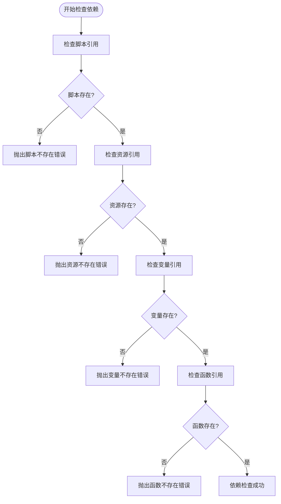

**Diagram sources**
- [SpecValidateUtil.java](file://spec/src/main/java/com/aliyun/dataworks/common/spec/utils/SpecValidateUtil.java#L58-L189)

**Section sources**
- [SpecValidateUtil.java](file://spec/src/main/java/com/aliyun/dataworks/common/spec/utils/SpecValidateUtil.java#L58-L189)

## 错误诊断方法

有效的错误诊断方法对于快速定位和解决迁移过程中的问题是至关重要的。本节将介绍日志分析、调试技巧和验证工具使用等诊断方法。

### 日志分析

日志分析是诊断问题的第一步。通过分析日志文件，可以快速定位问题的根源。根据`SpecException.java`中的实现，所有异常都会包含错误代码和详细的错误信息。

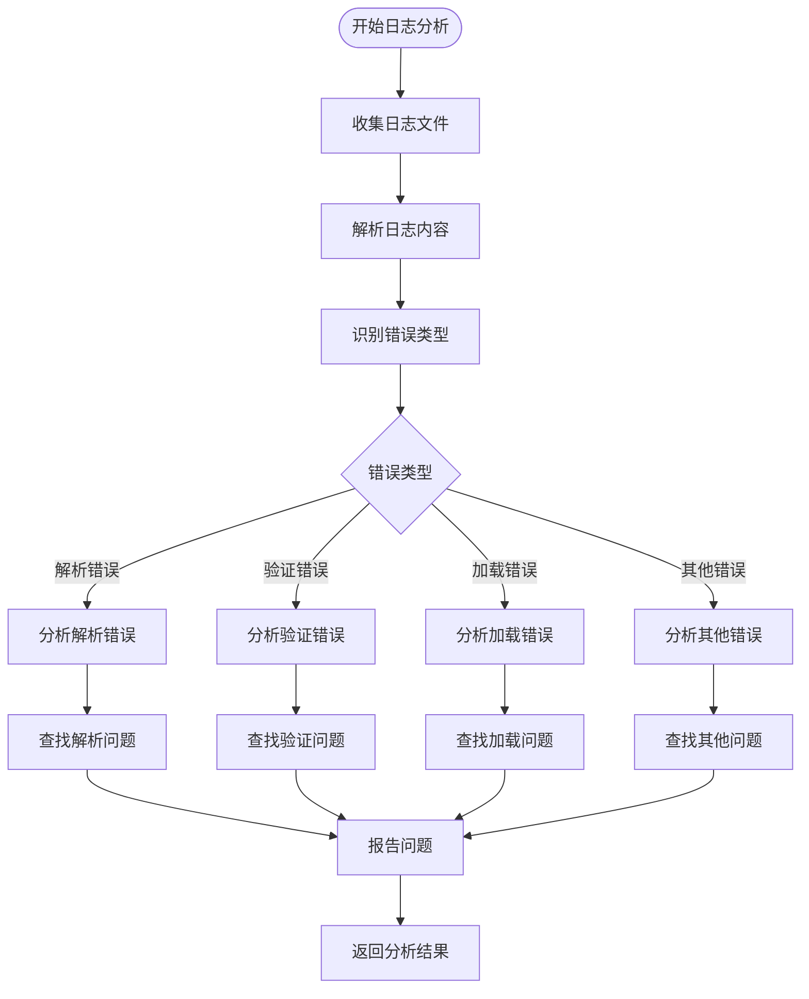

**Diagram sources**
- [SpecException.java](file://spec/src/main/java/com/aliyun/dataworks/common/spec/exception/SpecException.java#L16-L58)

**Section sources**
- [SpecException.java](file://spec/src/main/java/com/aliyun/dataworks/common/spec/exception/SpecException.java#L16-L58)

### 调试技巧

调试技巧包括使用调试器、添加日志输出和使用断点等方法。根据`SpecParserFactory.java`中的实现，可以通过添加日志输出来跟踪解析器的加载过程。

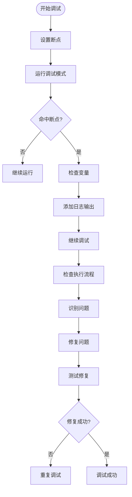

**Diagram sources**
- [SpecParserFactory.java](file://spec/src/main/java/com/aliyun/dataworks/common/spec/parser/SpecParserFactory.java#L37-L86)

**Section sources**
- [SpecParserFactory.java](file://spec/src/main/java/com/aliyun/dataworks/common/spec/parser/SpecParserFactory.java#L37-L86)

### 验证工具使用

验证工具是确保Spec文件合规性的重要手段。根据`validator.py`中的实现，验证工具使用JSON Schema对Spec文件进行验证，并提供详细的错误报告。

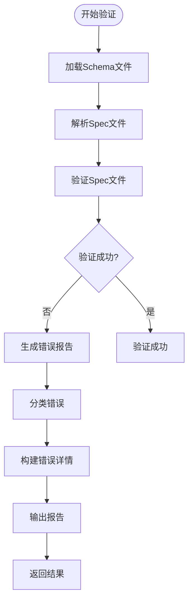

**Diagram sources**
- [validator.py](file://dwcli/dwcli/pkg/schema/validator.py#L1-L231)

**Section sources**
- [validator.py](file://dwcli/dwcli/pkg/schema/validator.py#L1-L231)

## JSON Schema验证失败处理

JSON Schema验证失败是迁移过程中常见的问题。本节将详细介绍如何处理JSON Schema验证失败的情况。

### 验证失败类型

根据`validator.py`中的实现，JSON Schema验证失败可以分为多种类型，包括类型不匹配、缺少必填字段、无效枚举值、模式不匹配、长度约束违规和范围约束违规等。

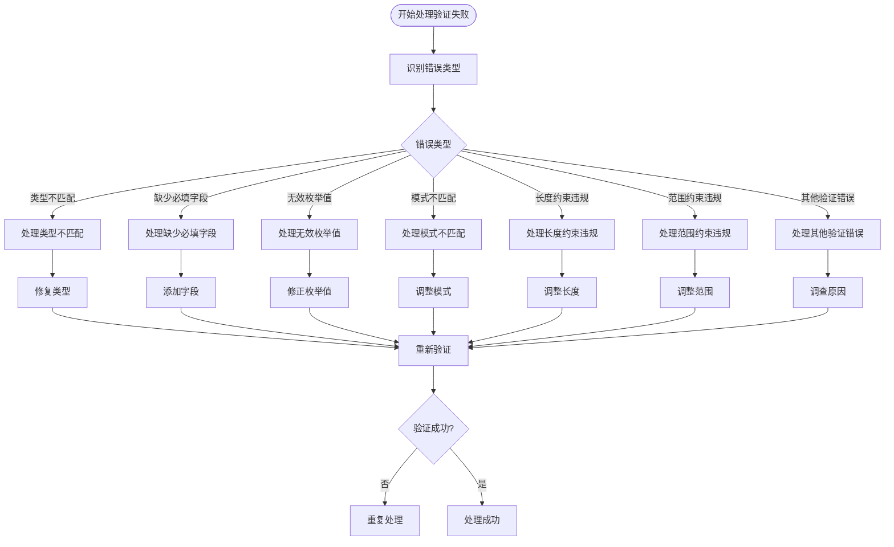

**Diagram sources**
- [validator.py](file://dwcli/dwcli/pkg/schema/validator.py#L1-L231)

**Section sources**
- [validator.py](file://dwcli/dwcli/pkg/schema/validator.py#L1-L231)

### 错误修复策略

根据`validator.py`中的实现，验证工具会为每种错误类型提供相应的修复建议。例如，对于类型不匹配错误，工具会建议使用正确的类型；对于缺少必填字段错误，工具会建议添加缺失的字段。

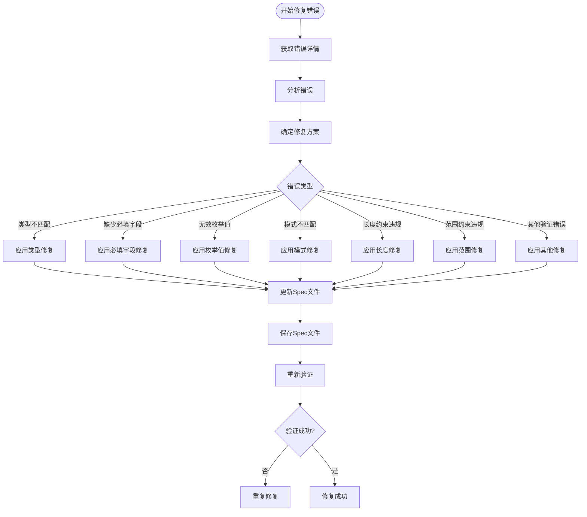

**Diagram sources**
- [validator.py](file://dwcli/dwcli/pkg/schema/validator.py#L1-L231)

**Section sources**
- [validator.py](file://dwcli/dwcli/pkg/schema/validator.py#L1-L231)

## 不合规Spec文件修复

不合规Spec文件的修复是确保迁移成功的关键步骤。本节将介绍如何识别和修复不合规的Spec文件。

### 识别不合规文件

根据`SpecValidateUtil.java`中的实现，可以通过调用`validate`方法来检查Spec文件是否合规。该方法会返回一个包含所有验证错误的列表。

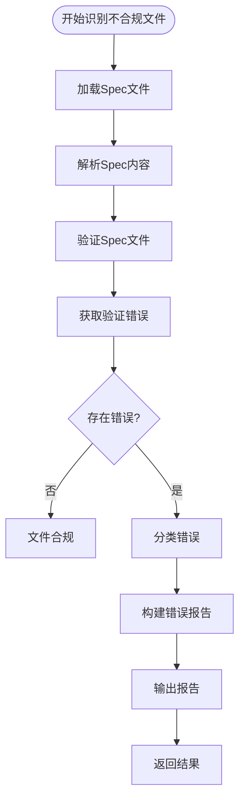

**Diagram sources**
- [SpecValidateUtil.java](file://spec/src/main/java/com/aliyun/dataworks/common/spec/utils/SpecValidateUtil.java#L58-L189)

**Section sources**
- [SpecValidateUtil.java](file://spec/src/main/java/com/aliyun/dataworks/common/spec/utils/SpecValidateUtil.java#L58-L189)

### 修复流程

修复不合规Spec文件的流程包括分析错误、确定修复方案、应用修复和重新验证等步骤。

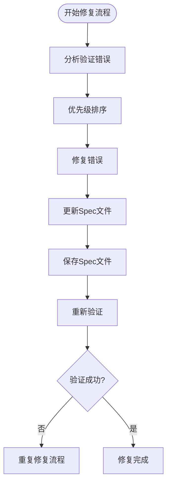

**Diagram sources**
- [SpecValidateUtil.java](file://spec/src/main/java/com/aliyun/dataworks/common/spec/utils/SpecValidateUtil.java#L58-L189)

**Section sources**
- [SpecValidateUtil.java](file://spec/src/main/java/com/aliyun/dataworks/common/spec/utils/SpecValidateUtil.java#L58-L189)

## 调度系统兼容性问题

不同调度系统之间的兼容性问题是迁移过程中的主要挑战之一。本节将介绍如何应对不同调度系统特有的兼容性问题。

### 兼容性挑战

根据`usage.md`文档中的说明，不同调度系统在工作流定义、节点类型、调度策略等方面存在差异，这些差异可能导致兼容性问题。

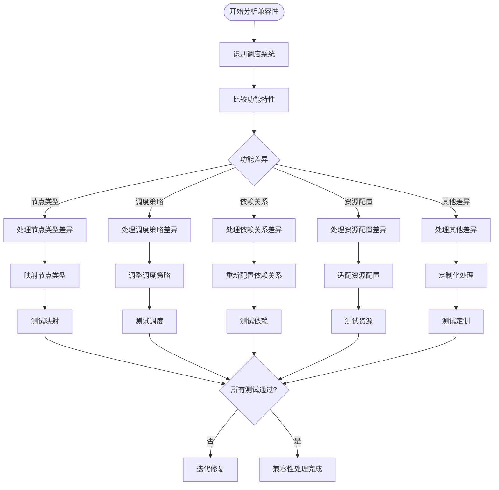

**Diagram sources**
- [usage.md](file://docs/migrationx/usage.md#L1-L276)

**Section sources**
- [usage.md](file://docs/migrationx/usage.md#L1-L276)

### 调试策略

针对调度系统兼容性问题的调试策略包括配置映射、参数调整和功能适配等。

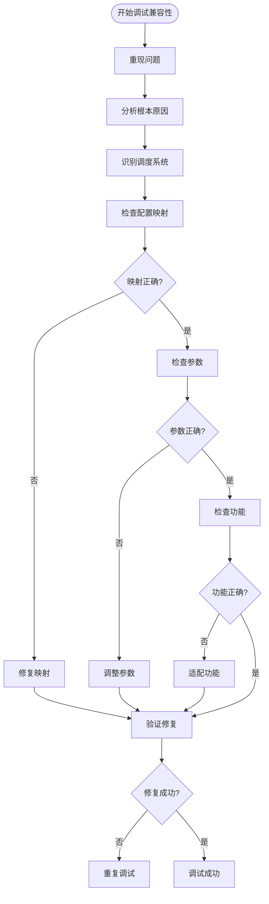

**Diagram sources**
- [usage.md](file://docs/migrationx/usage.md#L1-L276)

**Section sources**
- [usage.md](file://docs/migrationx/usage.md#L1-L276)

## 实际故障案例

本节将通过实际故障案例说明问题排查的完整流程。

### 案例一：解析错误排查

在迁移DolphinScheduler工作流到DataWorks时，遇到了解析错误。通过分析日志，发现是由于Spec文件中的节点ID重复导致的。

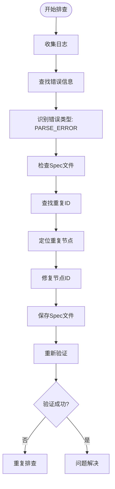

**Diagram sources**
- [SpecException.java](file://spec/src/main/java/com/aliyun/dataworks/common/spec/exception/SpecException.java#L16-L58)
- [SpecValidateUtil.java](file://spec/src/main/java/com/aliyun/dataworks/common/spec/utils/SpecValidateUtil.java#L58-L189)

**Section sources**
- [SpecException.java](file://spec/src/main/java/com/aliyun/dataworks/common/spec/exception/SpecException.java#L16-L58)
- [SpecValidateUtil.java](file://spec/src/main/java/com/aliyun/dataworks/common/spec/utils/SpecValidateUtil.java#L58-L189)

### 案例二：类型不匹配修复

在迁移Airflow DAG到DataWorks时，遇到了类型不匹配问题。通过使用验证工具，发现是由于节点超时时间字段的类型不正确导致的。

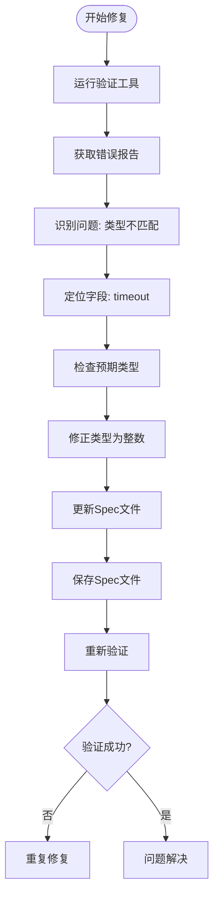

**Diagram sources**
- [validator.py](file://dwcli/dwcli/pkg/schema/validator.py#L1-L231)
- [SpecValidateUtil.java](file://spec/src/main/java/com/aliyun/dataworks/common/spec/utils/SpecValidateUtil.java#L58-L189)

**Section sources**
- [validator.py](file://dwcli/dwcli/pkg/schema/validator.py#L1-L231)
- [SpecValidateUtil.java](file://spec/src/main/java/com/aliyun/dataworks/common/spec/utils/SpecValidateUtil.java#L58-L189)

### 案例三：调度系统兼容性处理

在迁移Oozie工作流到DataWorks时，遇到了调度策略不兼容的问题。通过分析两个系统的调度机制，实现了调度策略的适配。

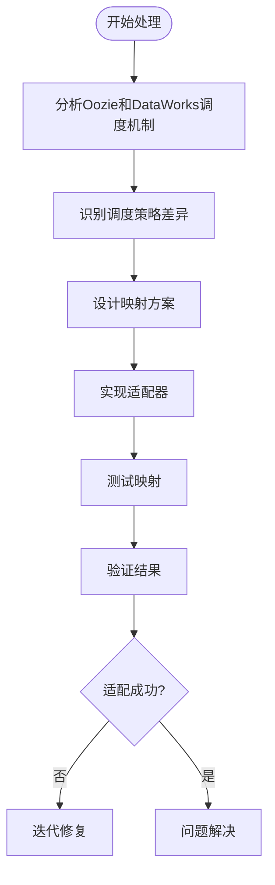

**Diagram sources**
- [usage.md](file://docs/migrationx/usage.md#L1-L276)

**Section sources**
- [usage.md](file://docs/migrationx/usage.md#L1-L276)