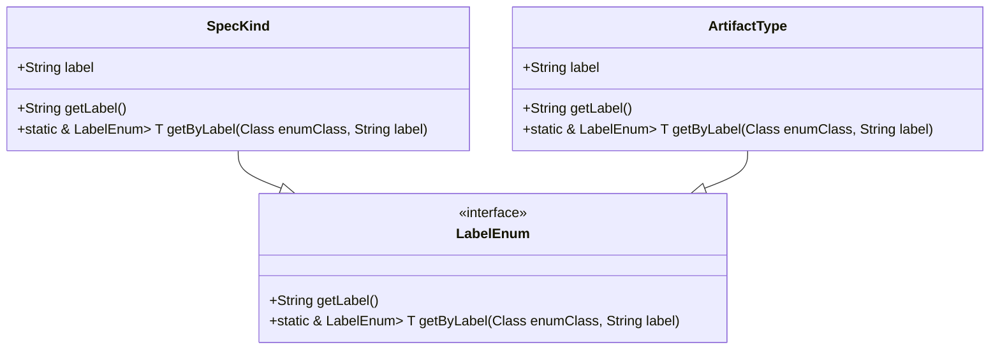
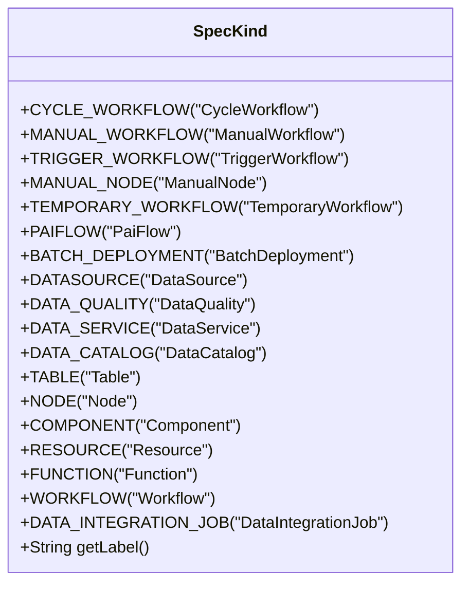
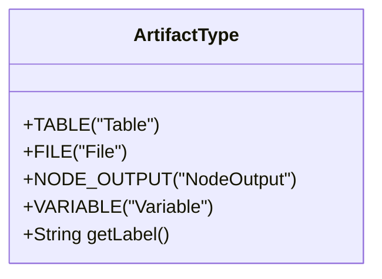
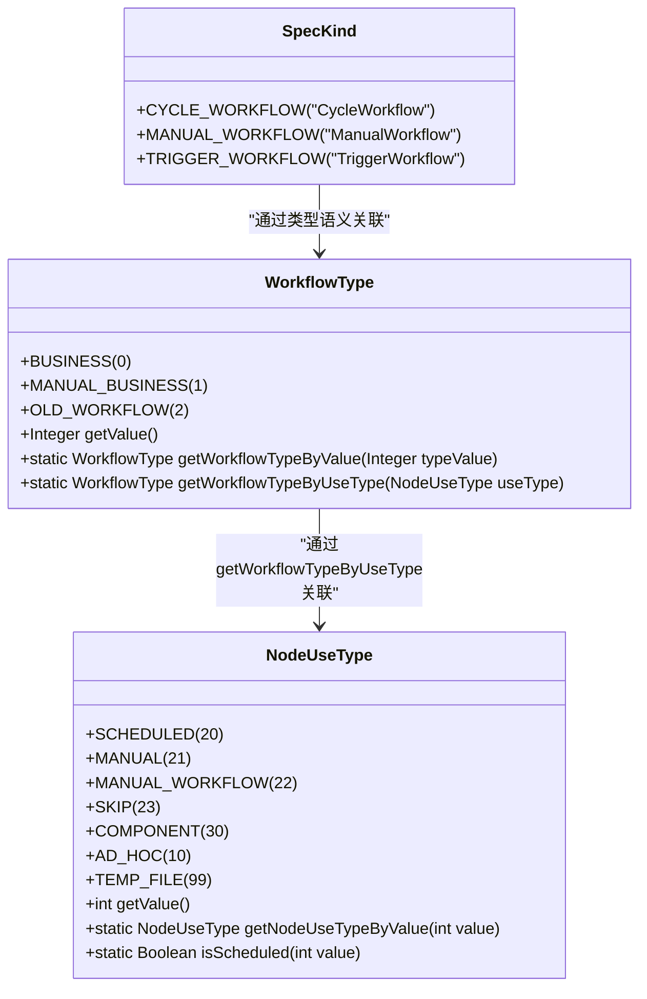
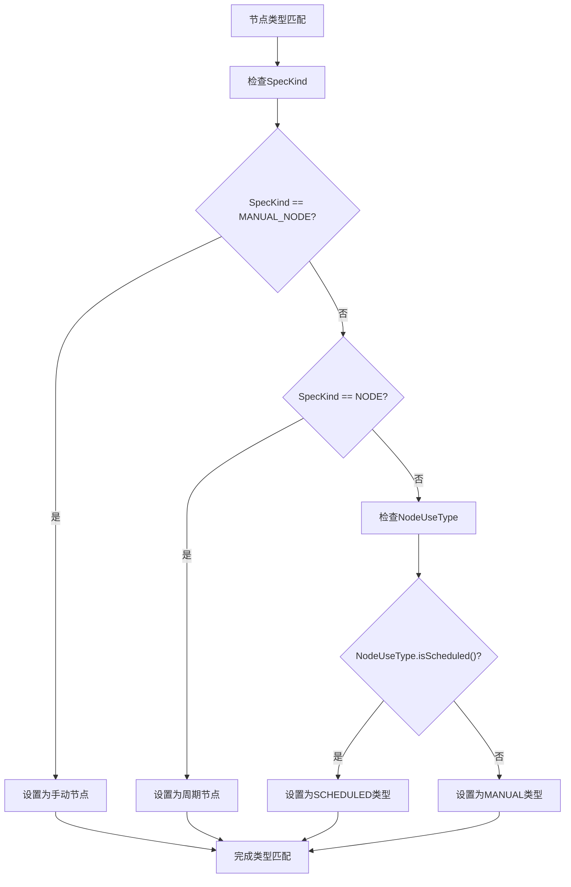
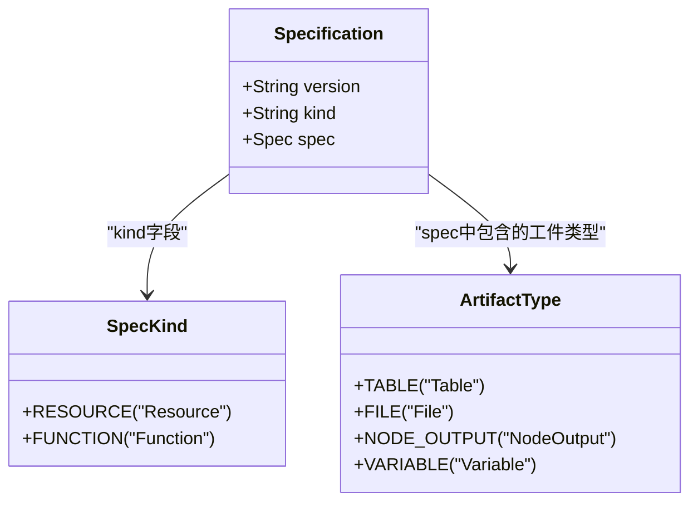
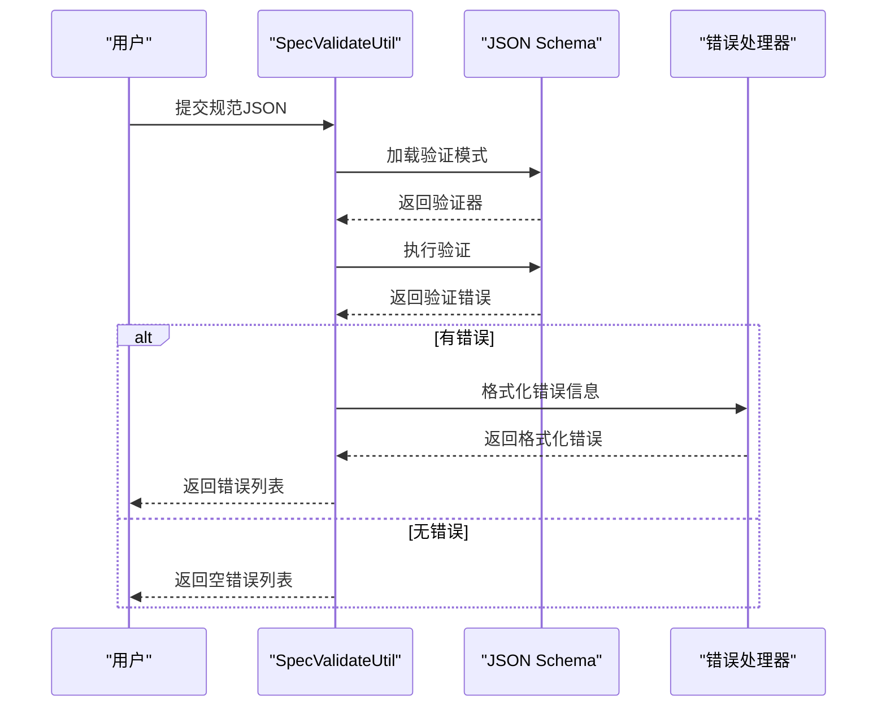
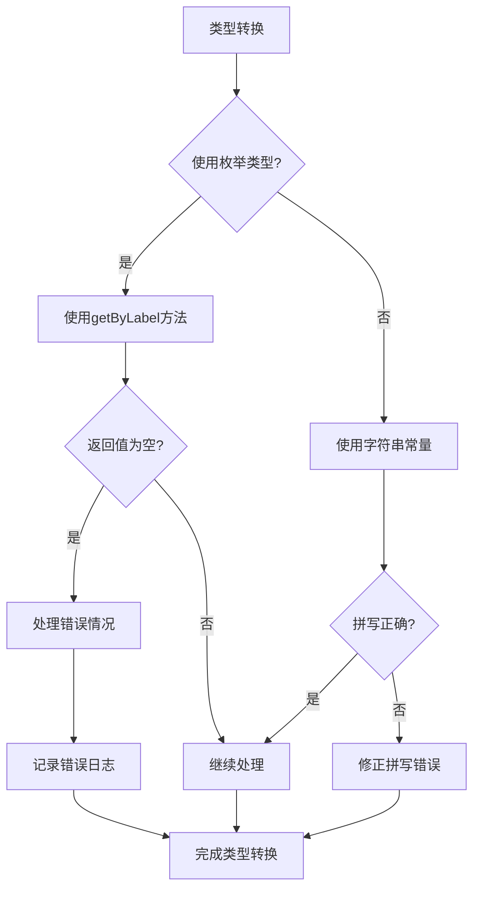
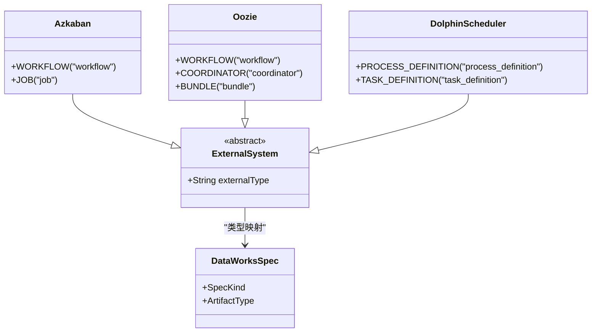
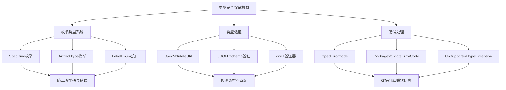

# 类型匹配问题

<cite>
**本文档引用的文件**
- [SpecKind.java](file://spec/src/main/java/com/aliyun/dataworks/common/spec/domain/enums/SpecKind.java)
- [ArtifactType.java](file://spec/src/main/java/com/aliyun/dataworks/common/spec/domain/enums/ArtifactType.java)
- [Specification.java](file://spec/src/main/java/com/aliyun/dataworks/common/spec/domain/Specification.java)
- [SpecValidateUtil.java](file://spec/src/main/java/com/aliyun/dataworks/common/spec/utils/SpecValidateUtil.java)
- [WorkflowType.java](file://client/migrationx/migrationx-domain/migrationx-domain-dataworks/src/main/java/com/aliyun/dataworks/migrationx/domain/dataworks/objects/types/WorkflowType.java)
- [NodeUseType.java](file://client/migrationx/migrationx-domain/migrationx-domain-dataworks/src/main/java/com/aliyun/dataworks/migrationx/domain/dataworks/objects/types/NodeUseType.java)
- [validator.py](file://dwcli/dwcli/pkg/schema/validator.py)
- [SpecErrorCode.java](file://spec/src/main/java/com/aliyun/dataworks/common/spec/exception/SpecErrorCode.java)
</cite>

## 目录
1. [简介](#简介)
2. [核心类型系统](#核心类型系统)
3. [SpecKind枚举类型详解](#speckind枚举类型详解)
4. [ArtifactType枚举类型详解](#artifacttype枚举类型详解)
5. [工作流类型匹配](#工作流类型匹配)
6. [节点类型匹配](#节点类型匹配)
7. [资源类型匹配](#资源类型匹配)
8. [类型验证与错误处理](#类型验证与错误处理)
9. [类型转换最佳实践](#类型转换最佳实践)
10. [外部系统迁移类型映射](#外部系统迁移类型映射)
11. [类型安全保证机制](#类型安全保证机制)

## 简介
dataworks-spec项目通过严格的类型系统确保数据工作流规范的正确性和一致性。本文档深入分析SpecKind、ArtifactType等核心枚举类型在不同上下文中的正确使用方式，解释如何识别和修复节点类型、工作流类型和资源类型的不匹配问题。通过具体示例说明类型验证失败的错误信息解读和修复方法，介绍如何利用枚举类型系统确保类型安全，并避免常见的类型错误。

## 核心类型系统
dataworks-spec项目采用基于枚举的类型系统来确保数据工作流规范的类型安全。该系统主要由SpecKind、ArtifactType等核心枚举类型构成，通过严格的类型定义和验证机制来防止类型不匹配问题。

**图表来源**
- [SpecKind.java](file://spec/src/main/java/com/aliyun/dataworks/common/spec/domain/enums/SpecKind.java)
- [ArtifactType.java](file://spec/src/main/java/com/aliyun/dataworks/common/spec/domain/enums/ArtifactType.java)
- [LabelEnum.java](file://spec/src/main/java/com/aliyun/dataworks/common/spec/domain/interfaces/LabelEnum.java)

**本节来源**
- [SpecKind.java](file://spec/src/main/java/com/aliyun/dataworks/common/spec/domain/enums/SpecKind.java)
- [ArtifactType.java](file://spec/src/main/java/com/aliyun/dataworks/common/spec/domain/enums/ArtifactType.java)

## SpecKind枚举类型详解
SpecKind枚举定义了数据工作流规范的核心类型，是区分不同工作流和节点类型的关键。每个SpecKind值都有对应的标签字符串，用于JSON序列化和反序列化。

**图表来源**
- [SpecKind.java](file://spec/src/main/java/com/aliyun/dataworks/common/spec/domain/enums/SpecKind.java)

**本节来源**
- [SpecKind.java](file://spec/src/main/java/com/aliyun/dataworks/common/spec/domain/enums/SpecKind.java)

## ArtifactType枚举类型详解
ArtifactType枚举定义了工作流中各种工件的类型，包括表、文件、节点输出和变量等。这些类型用于描述工作流中数据的来源和去向。

**图表来源**
- [ArtifactType.java](file://spec/src/main/java/com/aliyun/dataworks/common/spec/domain/enums/ArtifactType.java)

**本节来源**
- [ArtifactType.java](file://spec/src/main/java/com/aliyun/dataworks/common/spec/domain/enums/ArtifactType.java)

## 工作流类型匹配
工作流类型匹配涉及SpecKind、WorkflowType和NodeUseType等多个枚举类型的协调使用。这些类型在不同层次上定义了工作流的特性和行为。

**图表来源**
- [WorkflowType.java](file://client/migrationx/migrationx-domain/migrationx-domain-dataworks/src/main/java/com/aliyun/dataworks/migrationx/domain/dataworks/objects/types/WorkflowType.java)
- [NodeUseType.java](file://client/migrationx/migrationx-domain/migrationx-domain-dataworks/src/main/java/com/aliyun/dataworks/migrationx/domain/dataworks/objects/types/NodeUseType.java)
- [SpecKind.java](file://spec/src/main/java/com/aliyun/dataworks/common/spec/domain/enums/SpecKind.java)

**本节来源**
- [WorkflowType.java](file://client/migrationx/migrationx-domain/migrationx-domain-dataworks/src/main/java/com/aliyun/dataworks/migrationx/domain/dataworks/objects/types/WorkflowType.java)
- [NodeUseType.java](file://client/migrationx/migrationx-domain/migrationx-domain-dataworks/src/main/java/com/aliyun/dataworks/migrationx/domain/dataworks/objects/types/NodeUseType.java)

## 节点类型匹配
节点类型匹配主要涉及SpecKind枚举中的节点相关类型，如MANUAL_NODE、NODE等。这些类型定义了节点的执行模式和调度特性。

**图表来源**
- [SpecKind.java](file://spec/src/main/java/com/aliyun/dataworks/common/spec/domain/enums/SpecKind.java)
- [NodeUseType.java](file://client/migrationx/migrationx-domain/migrationx-domain-dataworks/src/main/java/com/aliyun/dataworks/migrationx/domain/dataworks/objects/types/NodeUseType.java)

**本节来源**
- [SpecKind.java](file://spec/src/main/java/com/aliyun/dataworks/common/spec/domain/enums/SpecKind.java)
- [NodeUseType.java](file://client/migrationx/migrationx-domain/migrationx-domain-dataworks/src/main/java/com/aliyun/dataworks/migrationx/domain/dataworks/objects/types/NodeUseType.java)

## 资源类型匹配
资源类型匹配涉及ArtifactType枚举中的各种资源类型，以及SpecKind中的RESOURCE类型。这些类型用于描述工作流中使用的各种资源。

**图表来源**
- [ArtifactType.java](file://spec/src/main/java/com/aliyun/dataworks/common/spec/domain/enums/ArtifactType.java)
- [SpecKind.java](file://spec/src/main/java/com/aliyun/dataworks/common/spec/domain/enums/SpecKind.java)
- [Specification.java](file://spec/src/main/java/com/aliyun/dataworks/common/spec/domain/Specification.java)

**本节来源**
- [ArtifactType.java](file://spec/src/main/java/com/aliyun/dataworks/common/spec/domain/enums/ArtifactType.java)
- [SpecKind.java](file://spec/src/main/java/com/aliyun/dataworks/common/spec/domain/enums/SpecKind.java)

## 类型验证与错误处理
类型验证是确保数据工作流规范正确性的关键环节。dataworks-spec项目通过SpecValidateUtil类提供强大的类型验证功能，并通过详细的错误信息帮助用户识别和修复问题。

**图表来源**
- [SpecValidateUtil.java](file://spec/src/main/java/com/aliyun/dataworks/common/spec/utils/SpecValidateUtil.java)
- [validator.py](file://dwcli/dwcli/pkg/schema/validator.py)

**本节来源**
- [SpecValidateUtil.java](file://spec/src/main/java/com/aliyun/dataworks/common/spec/utils/SpecValidateUtil.java)
- [SpecErrorCode.java](file://spec/src/main/java/com/aliyun/dataworks/common/spec/exception/SpecErrorCode.java)

## 类型转换最佳实践
类型转换最佳实践包括正确使用枚举类型、遵循类型转换规则和利用类型安全机制。这些实践有助于避免常见的类型错误。

**图表来源**
- [LabelEnum.java](file://spec/src/main/java/com/aliyun/dataworks/common/spec/domain/interfaces/LabelEnum.java)
- [SpecKind.java](file://spec/src/main/java/com/aliyun/dataworks/common/spec/domain/enums/SpecKind.java)

**本节来源**
- [LabelEnum.java](file://spec/src/main/java/com/aliyun/dataworks/common/spec/domain/interfaces/LabelEnum.java)
- [SpecKind.java](file://spec/src/main/java/com/aliyun/dataworks/common/spec/domain/enums/SpecKind.java)

## 外部系统迁移类型映射
在从外部系统迁移时，需要建立正确的类型映射策略，将外部系统的类型转换为dataworks-spec的类型系统。

**图表来源**
- [SpecKind.java](file://spec/src/main/java/com/aliyun/dataworks/common/spec/domain/enums/SpecKind.java)
- [ArtifactType.java](file://spec/src/main/java/com/aliyun/dataworks/common/spec/domain/enums/ArtifactType.java)

**本节来源**
- [SpecKind.java](file://spec/src/main/java/com/aliyun/dataworks/common/spec/domain/enums/SpecKind.java)
- [ArtifactType.java](file://spec/src/main/java/com/aliyun/dataworks/common/spec/domain/enums/ArtifactType.java)

## 类型安全保证机制
类型安全保证机制通过枚举类型、类型验证和错误处理等多重手段确保数据工作流规范的类型安全。

**图表来源**
- [SpecKind.java](file://spec/src/main/java/com/aliyun/dataworks/common/spec/domain/enums/SpecKind.java)
- [ArtifactType.java](file://spec/src/main/java/com/aliyun/dataworks/common/spec/domain/enums/ArtifactType.java)
- [SpecValidateUtil.java](file://spec/src/main/java/com/aliyun/dataworks/common/spec/utils/SpecValidateUtil.java)
- [SpecErrorCode.java](file://spec/src/main/java/com/aliyun/dataworks/common/spec/exception/SpecErrorCode.java)
- [PackageValidateErrorCode.java](file://client/migrationx/migrationx-domain/migrationx-domain-dataworks/src/main/java/com/aliyun/dataworks/migrationx/domain/dataworks/packages/enums/PackageValidateErrorCode.java)
- [UnSupportedTypeException.java](file://client/migrationx/migrationx-common/src/main/java/com/aliyun/migrationx/common/exception/UnSupportedTypeException.java)

**本节来源**
- [SpecKind.java](file://spec/src/main/java/com/aliyun/dataworks/common/spec/domain/enums/SpecKind.java)
- [ArtifactType.java](file://spec/src/main/java/com/aliyun/dataworks/common/spec/domain/enums/ArtifactType.java)
- [SpecValidateUtil.java](file://spec/src/main/java/com/aliyun/dataworks/common/spec/utils/SpecValidateUtil.java)
- [SpecErrorCode.java](file://spec/src/main/java/com/aliyun/dataworks/common/spec/exception/SpecErrorCode.java)