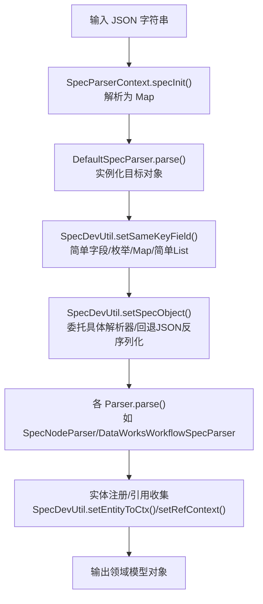
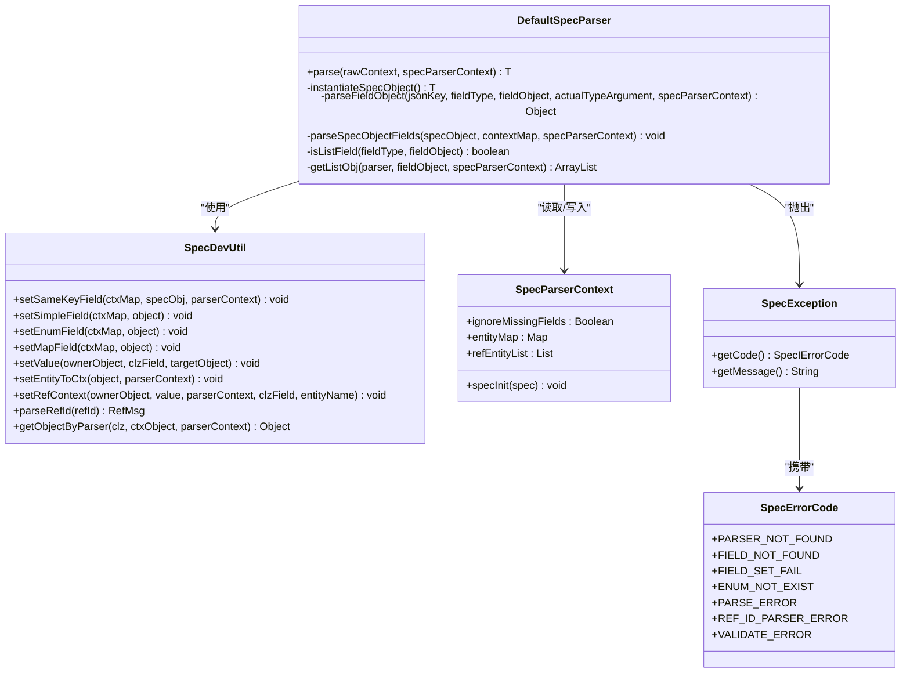

# 解析错误

<cite>
**本文引用的文件列表**
- [DefaultSpecParser.java](file://spec/src/main/java/com/aliyun/dataworks/common/spec/parser/impl/DefaultSpecParser.java)
- [SpecParserContext.java](file://spec/src/main/java/com/aliyun/dataworks/common/spec/parser/SpecParserContext.java)
- [SpecDevUtil.java](file://spec/src/main/java/com/aliyun/dataworks/common/spec/utils/SpecDevUtil.java)
- [SpecException.java](file://spec/src/main/java/com/aliyun/dataworks/common/spec/exception/SpecException.java)
- [SpecErrorCode.java](file://spec/src/main/java/com/aliyun/dataworks/common/spec/exception/SpecErrorCode.java)
- [GsonUtils.java](file://spec/src/main/java/com/aliyun/dataworks/common/spec/utils/GsonUtils.java)
- [SpecValidateUtil.java](file://spec/src/main/java/com/aliyun/dataworks/common/spec/utils/SpecValidateUtil.java)
- [DataWorksWorkflowSpecParser.java](file://spec/src/main/java/com/aliyun/dataworks/common/spec/parser/impl/DataWorksWorkflowSpecParser.java)
- [SpecNodeParser.java](file://spec/src/main/java/com/aliyun/dataworks/common/spec/parser/impl/SpecNodeParser.java)
- [assignment.json](file://spec/src/test/resources/nodemodel/assignment.json)
- [dowhile.json](file://spec/src/test/resources/nodemodel/dowhile.json)
- [foreach.json](file://spec/src/test/resources/nodemodel/foreach.json)
- [validator.py](file://dwcli/dwcli/pkg/schema/validator.py)
- [test_jsonpath.py](file://dwcli/tests/test_jsonpath.py)
</cite>

## 目录
1. [简介](#简介)
2. [项目结构与解析流程概览](#项目结构与解析流程概览)
3. [核心组件与错误码体系](#核心组件与错误码体系)
4. [常见解析错误类型与根因分析](#常见解析错误类型与根因分析)
5. [DefaultSpecParser 的验证机制与失败处理策略](#defaultspecparser-的验证机制与失败处理策略)
6. [典型错误案例与修复步骤](#典型错误案例与修复步骤)
7. [日志定位与调试技巧](#日志定位与调试技巧)
8. [依赖关系与数据流图](#依赖关系与数据流图)
9. [性能与健壮性建议](#性能与健壮性建议)
10. [故障排查清单](#故障排查清单)
11. [结论](#结论)

## 简介
本章节聚焦 dataworks-spec 项目在解析 Spec JSON 时的常见错误类型与定位修复方法，覆盖 JSON 格式错误、字段缺失、语法错误、类型转换失败、枚举值不匹配、引用格式错误等，并结合 DefaultSpecParser 的验证机制与失败处理策略，给出可操作的排障步骤与最佳实践。

## 项目结构与解析流程概览
解析流程自上而下分为三层：
- 规范层：SpecParserContext 负责将原始 JSON 字符串解析为上下文映射，并提供忽略缺失字段等控制开关。
- 工具层：SpecDevUtil 提供统一的字段设置、类型转换、枚举解析、引用解析与实体注册能力。
- 解析器层：DefaultSpecParser 作为默认解析器，负责按泛型推断目标类型、调用具体解析器或回退到 JSON 序列化；DataWorksWorkflowSpecParser 等业务解析器在关键键位上定制解析策略。

图表来源
- [SpecParserContext.java](file://spec/src/main/java/com/aliyun/dataworks/common/spec/parser/SpecParserContext.java#L71-L78)
- [DefaultSpecParser.java](file://spec/src/main/java/com/aliyun/dataworks/common/spec/parser/impl/DefaultSpecParser.java#L55-L60)
- [SpecDevUtil.java](file://spec/src/main/java/com/aliyun/dataworks/common/spec/utils/SpecDevUtil.java#L105-L115)
- [SpecNodeParser.java](file://spec/src/main/java/com/aliyun/dataworks/common/spec/parser/impl/SpecNodeParser.java#L52-L78)
- [DataWorksWorkflowSpecParser.java](file://spec/src/main/java/com/aliyun/dataworks/common/spec/parser/impl/DataWorksWorkflowSpecParser.java#L33-L40)

章节来源
- [SpecParserContext.java](file://spec/src/main/java/com/aliyun/dataworks/common/spec/parser/SpecParserContext.java#L71-L78)
- [DefaultSpecParser.java](file://spec/src/main/java/com/aliyun/dataworks/common/spec/parser/impl/DefaultSpecParser.java#L55-L60)
- [SpecDevUtil.java](file://spec/src/main/java/com/aliyun/dataworks/common/spec/utils/SpecDevUtil.java#L105-L115)
- [SpecNodeParser.java](file://spec/src/main/java/com/aliyun/dataworks/common/spec/parser/impl/SpecNodeParser.java#L52-L78)
- [DataWorksWorkflowSpecParser.java](file://spec/src/main/java/com/aliyun/dataworks/common/spec/parser/impl/DataWorksWorkflowSpecParser.java#L33-L40)

## 核心组件与错误码体系
- 错误码定义：SpecErrorCode 提供统一的错误码常量，涵盖解析器未找到、字段不存在、字段赋值失败、枚举不存在、引用ID格式错误、校验失败等。
- 异常封装：SpecException 将错误码与消息组合，便于上层捕获与统一处理。
- JSON 工具：GsonUtils 提供 JSON 字符串与对象互转，包含异常抛出与日志记录。
- 规范校验：SpecValidateUtil 基于 JSON Schema 进行结构与字段约束校验，返回错误信息列表。
- 上下文控制：SpecParserContext 提供 ignoreMissingFields 控制是否忽略缺失字段，以及 JSON 初始化失败时的统一错误提示。

章节来源
- [SpecErrorCode.java](file://spec/src/main/java/com/aliyun/dataworks/common/spec/exception/SpecErrorCode.java#L22-L110)
- [SpecException.java](file://spec/src/main/java/com/aliyun/dataworks/common/spec/exception/SpecException.java#L22-L58)
- [GsonUtils.java](file://spec/src/main/java/com/aliyun/dataworks/common/spec/utils/GsonUtils.java#L128-L146)
- [SpecValidateUtil.java](file://spec/src/main/java/com/aliyun/dataworks/common/spec/utils/SpecValidateUtil.java#L114-L141)
- [SpecParserContext.java](file://spec/src/main/java/com/aliyun/dataworks/common/spec/parser/SpecParserContext.java#L64-L64)

## 常见解析错误类型与根因分析
- JSON 格式错误
  - 表现：初始化阶段直接抛出解析异常，提示 JSON 格式不合法。
  - 根因：字符串非合法 JSON、包含非法字符、编码不一致、缺少逗号/括号闭合等。
  - 定位：查看初始化处的异常消息与堆栈，确认 JSON 字符串来源与编码。
- 字段缺失
  - 表现：当 ignoreMissingFields 为 false 时，找不到对应字段会抛出“字段不存在”异常；为 true 时忽略缺失字段。
  - 根因：JSON 中缺少必要键，或键名与领域模型字段不一致。
  - 定位：检查 SpecParserContext 的 ignoreMissingFields 设置，核对 JSON 键与模型字段映射。
- 类型转换失败
  - 表现：简单类型（整数、长整型、浮点、布尔、字符、字符串、BigDecimal）转换时抛出“字段赋值失败”异常。
  - 根因：JSON 值与期望类型不匹配，或值无法被安全转换。
  - 定位：根据异常消息中的期望类型与实际值进行修正。
- 枚举值不匹配
  - 表现：枚举解析失败抛出“枚举不存在”异常；大小写不敏感的枚举尝试忽略大小写匹配。
  - 根因：枚举标签与 JSON 值不一致，或值不在枚举集合内。
  - 定位：核对枚举定义与 JSON 值，确保大小写与标签一致。
- 引用格式错误
  - 表现：引用ID格式不正确时抛出“引用ID解析错误”异常。
  - 根因：引用字符串不符合 {{type.id}} 或 id 格式。
  - 定位：检查引用字符串是否以 {{ 开头/结尾，或仅包含 id。
- 解析器未找到
  - 表现：无法找到对应类型的解析器时抛出“解析器未找到”异常。
  - 根因：缺少特定类型的解析器实现或工厂未注册。
  - 定位：确认工厂注册与类型名称匹配。
- 校验失败
  - 表现：JSON Schema 校验返回错误信息列表。
  - 根因：字段类型不符、必填字段缺失、枚举值不在允许集合、范围/长度约束不满足等。
  - 定位：结合 dwcli 的 JSON Path 映射与错误分类，快速定位字段路径。

章节来源
- [SpecParserContext.java](file://spec/src/main/java/com/aliyun/dataworks/common/spec/parser/SpecParserContext.java#L71-L78)
- [DefaultSpecParser.java](file://spec/src/main/java/com/aliyun/dataworks/common/spec/parser/impl/DefaultSpecParser.java#L112-L133)
- [SpecDevUtil.java](file://spec/src/main/java/com/aliyun/dataworks/common/spec/utils/SpecDevUtil.java#L142-L166)
- [SpecDevUtil.java](file://spec/src/main/java/com/aliyun/dataworks/common/spec/utils/SpecDevUtil.java#L203-L214)
- [SpecDevUtil.java](file://spec/src/main/java/com/aliyun/dataworks/common/spec/utils/SpecDevUtil.java#L242-L261)
- [SpecDevUtil.java](file://spec/src/main/java/com/aliyun/dataworks/common/spec/utils/SpecDevUtil.java#L337-L340)
- [SpecValidateUtil.java](file://spec/src/main/java/com/aliyun/dataworks/common/spec/utils/SpecValidateUtil.java#L114-L141)
- [validator.py](file://dwcli/dwcli/pkg/schema/validator.py#L146-L196)

## DefaultSpecParser 的验证机制与失败处理策略
DefaultSpecParser 的职责是：
- 通过泛型参数推断目标类型，若无法推断则抛出“解析错误”异常。
- 实例化目标对象，实例化失败时抛出“解析错误”异常并记录详细错误信息。
- 遍历上下文键，尝试在领域模型中查找同名字段；若字段不存在且未开启忽略缺失字段，则抛出“字段不存在”异常；否则忽略该键。
- 对复杂字段，优先通过 SpecParserFactory 获取自定义解析器；若无自定义解析器，则尝试通过 GsonUtils 回退 JSON 反序列化；若仍失败，记录警告并返回空值。
- 列表字段采用 getListObj 逐项解析，并将解析结果注册到上下文以便后续引用解析。

失败处理策略要点：
- 统一通过 SpecException 抛出，携带 SpecErrorCode 与详细消息，便于上层识别与处理。
- 在关键分支记录 warn/info 日志，辅助定位问题。
- 对缺失字段提供 ignoreMissingFields 控制，避免因少量字段缺失导致整体解析中断。

章节来源
- [DefaultSpecParser.java](file://spec/src/main/java/com/aliyun/dataworks/common/spec/parser/impl/DefaultSpecParser.java#L55-L60)
- [DefaultSpecParser.java](file://spec/src/main/java/com/aliyun/dataworks/common/spec/parser/impl/DefaultSpecParser.java#L62-L79)
- [DefaultSpecParser.java](file://spec/src/main/java/com/aliyun/dataworks/common/spec/parser/impl/DefaultSpecParser.java#L112-L133)
- [DefaultSpecParser.java](file://spec/src/main/java/com/aliyun/dataworks/common/spec/parser/impl/DefaultSpecParser.java#L145-L174)
- [DefaultSpecParser.java](file://spec/src/main/java/com/aliyun/dataworks/common/spec/parser/impl/DefaultSpecParser.java#L180-L193)

## 典型错误案例与修复步骤
以下案例基于仓库中的测试样例与解析器行为，提供可复现与修复思路。

- 案例一：JSON 格式错误
  - 现象：初始化阶段抛出“规范 JSON 解析失败，请检查 JSON 格式”。
  - 根因：JSON 字符串包含非法字符或未闭合。
  - 修复：使用 dwcli 的 schema 校验工具生成 JSON Path，定位到具体字段；修正拼写、逗号、引号与括号。
  - 参考：初始化失败路径与 dwcli 的 JSON Path 映射。
  
  章节来源
  - [SpecParserContext.java](file://spec/src/main/java/com/aliyun/dataworks/common/spec/parser/SpecParserContext.java#L71-L78)
  - [validator.py](file://dwcli/dwcli/pkg/schema/validator.py#L112-L144)
  - [validator.py](file://dwcli/dwcli/pkg/schema/validator.py#L146-L196)

- 案例二：字段缺失
  - 现象：抛出“无法在规范中找到字段”异常。
  - 根因：JSON 缺少必要键，或键名与模型字段不一致。
  - 修复：开启 ignoreMissingFields 后重试，或补充缺失键；核对模型字段与 JSON 键的映射关系。
  
  章节来源
  - [DefaultSpecParser.java](file://spec/src/main/java/com/aliyun/dataworks/common/spec/parser/impl/DefaultSpecParser.java#L145-L160)
  - [DataWorksWorkflowSpecParser.java](file://spec/src/main/java/com/aliyun/dataworks/common/spec/parser/impl/DataWorksWorkflowSpecParser.java#L33-L40)

- 案例三：类型转换失败
  - 现象：抛出“字段赋值失败”异常，包含期望类型与实际值。
  - 根因：数值型字段传入字符串或布尔型传入非布尔值。
  - 修复：将值改为期望类型；对于 BigDecimal 使用字符串形式。
  
  章节来源
  - [SpecDevUtil.java](file://spec/src/main/java/com/aliyun/dataworks/common/spec/utils/SpecDevUtil.java#L203-L214)
  - [SpecDevUtil.java](file://spec/src/main/java/com/aliyun/dataworks/common/spec/utils/SpecDevUtil.java#L489-L522)

- 案例四：枚举值不匹配
  - 现象：抛出“枚举不存在”异常。
  - 根因：枚举标签与 JSON 值不一致。
  - 修复：使用枚举标签或大小写不敏感匹配；确保值在枚举集合内。
  
  章节来源
  - [SpecDevUtil.java](file://spec/src/main/java/com/aliyun/dataworks/common/spec/utils/SpecDevUtil.java#L142-L166)

- 案例五：引用格式错误
  - 现象：抛出“引用ID格式不正确”异常。
  - 根因：引用字符串不符合 {{type.id}} 或 id 格式。
  - 修复：修正引用字符串格式，确保以 {{ 开头/结尾或仅包含 id。
  
  章节来源
  - [SpecDevUtil.java](file://spec/src/main/java/com/aliyun/dataworks/common/spec/utils/SpecDevUtil.java#L242-L261)

- 案例六：解析器未找到
  - 现象：抛出“无法找到解析器”异常。
  - 根因：缺少对应类型的解析器实现或工厂未注册。
  - 修复：实现对应解析器并在工厂中注册；或调整 JSON 结构使其走回退路径。
  
  章节来源
  - [DefaultSpecParser.java](file://spec/src/main/java/com/aliyun/dataworks/common/spec/parser/impl/DefaultSpecParser.java#L112-L133)
  - [SpecDevUtil.java](file://spec/src/main/java/com/aliyun/dataworks/common/spec/utils/SpecDevUtil.java#L337-L340)

- 案例七：嵌套结构不正确
  - 现象：节点 inputs/outputs 或 do-while/for-each 结构不满足预期。
  - 根因：嵌套层级或键名不正确。
  - 修复：参考测试样例 assignment.json、dowhile.json、foreach.json 的结构，逐层核对键名与类型。
  
  章节来源
  - [assignment.json](file://spec/src/test/resources/nodemodel/assignment.json#L1-L113)
  - [dowhile.json](file://spec/src/test/resources/nodemodel/dowhile.json#L1-L209)
  - [foreach.json](file://spec/src/test/resources/nodemodel/foreach.json#L1-L205)
  - [SpecNodeParser.java](file://spec/src/main/java/com/aliyun/dataworks/common/spec/parser/impl/SpecNodeParser.java#L52-L78)

## 日志定位与调试技巧
- 使用 dwcli 的 schema 校验工具
  - 将 JSON Path 映射为标准格式（$.spec.nodes[0].timeout），并生成修复命令，快速定位字段与修复方向。
  - 参考：JSON Path 构建与错误分类逻辑。
- 在 DefaultSpecParser 中启用忽略缺失字段
  - 当存在大量可选字段时，可在 DataWorksWorkflowSpecParser 中设置 ignoreMissingFields=true，先完成基本解析，再逐步补齐缺失字段。
- 利用 GsonUtils 的异常日志
  - 当回退 JSON 反序列化失败时，GsonUtils 会记录异常详情，便于定位具体类型与字符串内容。
- 通过 SpecDevUtil 的反射字段扫描
  - 若字段不存在，可通过 getPropertyFields 打印字段列表，辅助核对 JSON 键与模型字段映射。

章节来源
- [validator.py](file://dwcli/dwcli/pkg/schema/validator.py#L112-L144)
- [validator.py](file://dwcli/dwcli/pkg/schema/validator.py#L146-L196)
- [DataWorksWorkflowSpecParser.java](file://spec/src/main/java/com/aliyun/dataworks/common/spec/parser/impl/DataWorksWorkflowSpecParser.java#L33-L40)
- [GsonUtils.java](file://spec/src/main/java/com/aliyun/dataworks/common/spec/utils/GsonUtils.java#L128-L146)
- [SpecDevUtil.java](file://spec/src/main/java/com/aliyun/dataworks/common/spec/utils/SpecDevUtil.java#L269-L293)

## 依赖关系与数据流图
下面以 DefaultSpecParser 为核心，展示解析链路中的关键依赖与数据流向。

图表来源
- [DefaultSpecParser.java](file://spec/src/main/java/com/aliyun/dataworks/common/spec/parser/impl/DefaultSpecParser.java#L55-L60)
- [SpecDevUtil.java](file://spec/src/main/java/com/aliyun/dataworks/common/spec/utils/SpecDevUtil.java#L105-L115)
- [SpecParserContext.java](file://spec/src/main/java/com/aliyun/dataworks/common/spec/parser/SpecParserContext.java#L64-L64)
- [SpecException.java](file://spec/src/main/java/com/aliyun/dataworks/common/spec/exception/SpecException.java#L22-L58)
- [SpecErrorCode.java](file://spec/src/main/java/com/aliyun/dataworks/common/spec/exception/SpecErrorCode.java#L22-L110)

## 性能与健壮性建议
- 优先使用强类型解析器而非回退 JSON 反序列化，减少反射与字符串转换开销。
- 对大型 JSON，建议先进行 Schema 校验，剔除明显不合规数据，降低后续解析成本。
- 在批量解析场景中，合理设置 ignoreMissingFields，避免因少量字段缺失导致整体失败。
- 对枚举与引用解析，尽量在上游保证值域正确，减少运行期异常。

[本节为通用建议，无需列出章节来源]

## 故障排查清单
- JSON 格式
  - 使用 dwcli 的 schema 校验与 JSON Path 定位；确认编码与引号闭合。
- 字段缺失
  - 检查 ignoreMissingFields 设置；核对 JSON 键与模型字段映射。
- 类型转换
  - 按异常消息修正类型；注意 BigDecimal 使用字符串。
- 枚举值
  - 使用枚举标签；确保值在枚举集合内。
- 引用格式
  - 修正 {{type.id}} 或 id 格式。
- 解析器
  - 注册缺失的解析器；或调整 JSON 结构走回退路径。
- 校验失败
  - 根据 dwcli 的错误分类与修复命令，逐项修正。

[本节为通用指南，无需列出章节来源]

## 结论
通过统一的错误码体系、完善的异常封装与解析器链路，dataworks-spec 能够在复杂 JSON 规范解析中提供清晰的错误定位与修复路径。结合 dwcli 的 schema 校验与 JSON Path 工具，用户可以快速定位字段、类型与引用问题，并依据 DefaultSpecParser 的验证机制与失败处理策略高效修复。