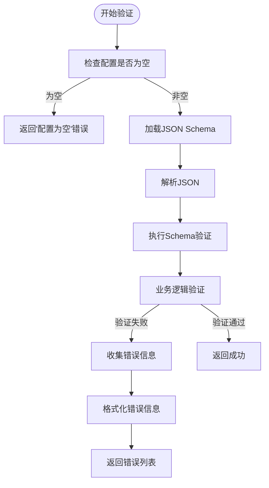
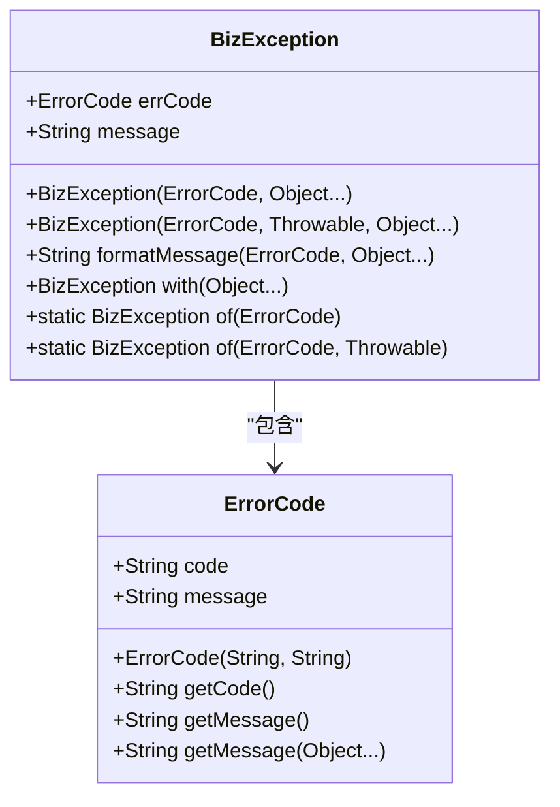
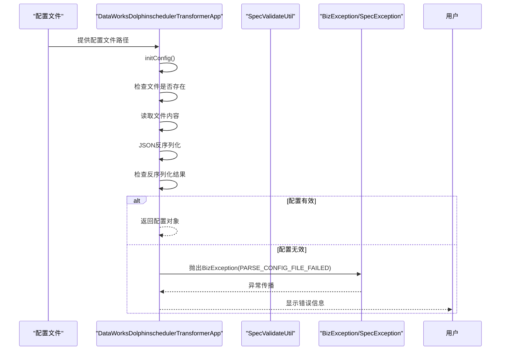
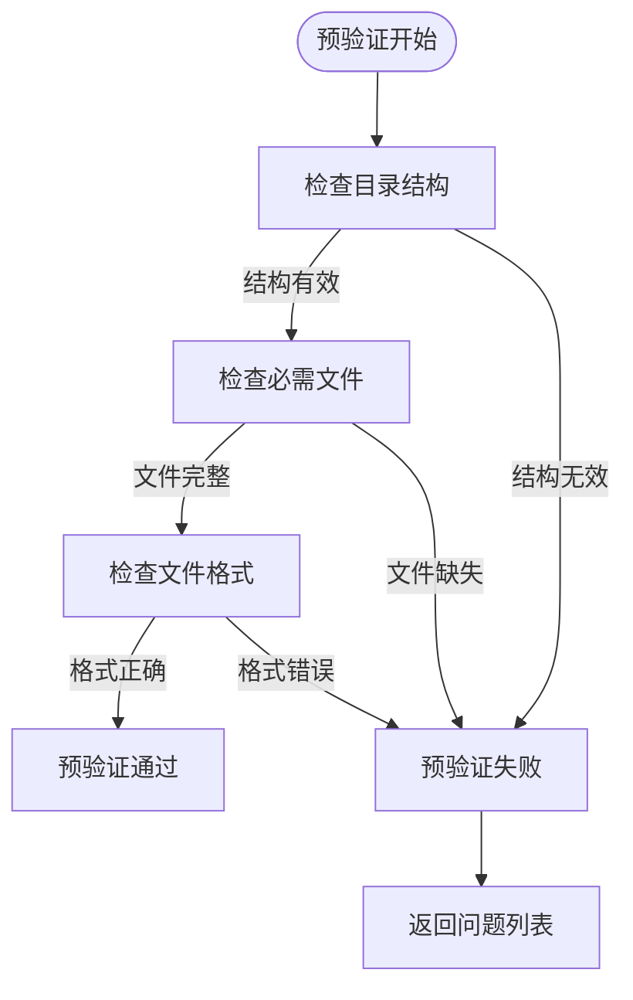

# 配置问题

<cite>
**本文档引用的文件**   
- [dataworks-transformer-config.json](file://client/migrationx/migrationx-transformer/src/main/conf/dataworks-transformer-config.json)
- [DataWorksTransformerConfig.java](file://client/migrationx/migrationx-transformer/src/main/java/com/aliyun/dataworks/migrationx/transformer/dataworks/transformer/DataWorksTransformerConfig.java)
- [DataWorksDolphinschedulerTransformerApp.java](file://client/migrationx/migrationx-transformer/src/main/java/com/aliyun/dataworks/migrationx/transformer/dataworks/apps/DataWorksDolphinschedulerTransformerApp.java)
- [BizException.java](file://client/migrationx/migrationx-common/src/main/java/com/aliyun/migrationx/common/exception/BizException.java)
- [SpecException.java](file://spec/src/main/java/com/aliyun/dataworks/common/spec/exception/SpecException.java)
- [SpecErrorCode.java](file://spec/src/main/java/com/aliyun/dataworks/common/spec/exception/SpecErrorCode.java)
- [ErrorCode.java](file://client/migrationx/migrationx-common/src/main/java/com/aliyun/migrationx/common/exception/ErrorCode.java)
- [SpecValidateUtil.java](file://spec/src/main/java/com/aliyun/dataworks/common/spec/utils/SpecValidateUtil.java)
- [PackageValidateErrorCode.java](file://client/migrationx/migrationx-domain/migrationx-domain-dataworks/src/main/java/com/aliyun/dataworks/migrationx/domain/dataworks/packages/enums/PackageValidateErrorCode.java)
- [validator.py](file://dwcli/dwcli/pkg/schema/validator.py)
</cite>

## 目录
1. [配置文件结构与必需字段](#配置文件结构与必需字段)
2. [常见配置问题及解决方案](#常见配置问题及解决方案)
3. [配置验证机制与错误处理](#配置验证机制与错误处理)
4. [配置验证工具使用方法](#配置验证工具使用方法)
5. [预验证与错误预防最佳实践](#预验证与错误预防最佳实践)
6. [配置问题诊断与修复案例](#配置问题诊断与修复案例)

## 配置文件结构与必需字段

dataworks-spec项目中的核心配置文件`dataworks-transformer-config.json`定义了数据迁移和转换过程中的关键参数。该配置文件采用JSON格式，包含多个必需字段和可选设置。

配置文件的主要结构包括：
- `format`: 指定配置格式，如"SPEC"等
- `locale`: 设置本地化语言环境，如"zh_CN"
- `skipUnSupportType`: 布尔值，指示是否跳过不支持的类型
- `transformContinueWithError`: 布尔值，指定转换过程中遇到错误时是否继续
- `specContinueWithError`: 布尔值，指定SPEC处理过程中遇到错误时是否继续
- `filterTasks`: 任务过滤器数组
- `settings`: 包含各种转换器设置的嵌套对象

在Java代码层面，`DataWorksTransformerConfig`类定义了这些配置的结构，使用Lombok注解简化代码。该类通过ThreadLocal模式管理配置实例，确保线程安全。

**Section sources**
- [dataworks-transformer-config.json](file://client/migrationx/migrationx-transformer/src/main/conf/dataworks-transformer-config.json)
- [DataWorksTransformerConfig.java](file://client/migrationx/migrationx-transformer/src/main/java/com/aliyun/dataworks/migrationx/transformer/dataworks/transformer/DataWorksTransformerConfig.java)

## 常见配置问题及解决方案

在dataworks-spec项目中，常见的配置问题主要包括配置文件格式错误、参数缺失和值范围不正确等。

### 配置文件格式错误
配置文件必须遵循严格的JSON格式规范。常见的格式错误包括：
- 缺少必要的引号或括号
- 逗号使用不当（如末尾多余的逗号）
- 特殊字符未正确转义

### 参数缺失问题
必需参数的缺失会导致配置验证失败。根据`PackageValidateErrorCode`枚举，系统定义了多种与缺失相关的错误码：
- `SPEC_PACKAGE_MISSING_FILE`: 缺少必需的文件
- `SUBPACKAGE_MISSING_START_FOLDER`: 缺少必需的子包起始文件夹
- `SUBPACKAGE_MISSING_END_FOLDER`: 缺少必需的子包结束文件夹

### 值范围不正确
某些配置参数有特定的取值范围要求。例如，超时时间必须为非负整数，资源组ID不能为空字符串等。

解决方案包括：
1. 使用预定义的配置模板确保结构正确
2. 在配置前进行语法验证
3. 使用配置验证工具进行完整性检查
4. 参考文档中的示例配置

**Section sources**
- [PackageValidateErrorCode.java](file://client/migrationx/migrationx-domain/migrationx-domain-dataworks/src/main/java/com/aliyun/dataworks/migrationx/domain/dataworks/packages/enums/PackageValidateErrorCode.java)
- [dataworks-transformer-config.json](file://client/migrationx/migrationx-transformer/src/main/conf/dataworks-transformer-config.json)

## 配置验证机制与错误处理

dataworks-spec项目采用多层次的配置验证机制，确保配置的正确性和完整性。

### 配置验证流程
配置验证主要通过`SpecValidateUtil`类实现，该类提供了静态方法进行配置验证。验证过程包括：
1. 检查配置JSON是否为空
2. 使用JSON Schema进行结构验证
3. 对特定字段进行业务逻辑验证
4. 返回详细的验证错误信息



**Diagram sources **
- [SpecValidateUtil.java](file://spec/src/main/java/com/aliyun/dataworks/common/spec/utils/SpecValidateUtil.java)

### BizException异常机制
当配置验证失败时，系统会抛出`BizException`异常。这种异常是已知的业务异常，不需要重试。`BizException`的处理机制包括：

1. **异常创建**: 通过`ErrorCode`枚举创建特定的业务异常
2. **错误信息格式化**: 使用`formatMessage`方法生成用户友好的错误信息
3. **上下文信息附加**: 使用`with`方法添加额外的上下文信息

`ErrorCode`枚举定义了多种配置相关的错误类型，如：
- `PARSE_CONFIG_FILE_FAILED`: 解析配置文件失败
- `CONFIG_ITEM_INVALID`: 配置项无效
- `FILE_NOT_FOUND`: 文件未找到



**Diagram sources **
- [BizException.java](file://client/migrationx/migrationx-common/src/main/java/com/aliyun/migrationx/common/exception/BizException.java)
- [ErrorCode.java](file://client/migrationx/migrationx-common/src/main/java/com/aliyun/migrationx/common/exception/ErrorCode.java)

### SpecException异常处理
对于SPEC规范相关的验证错误，系统使用`SpecException`异常。该异常继承自`RuntimeException`，包含错误代码和详细消息。

`SpecErrorCode`枚举定义了SPEC验证相关的错误类型：
- `VALIDATE_ERROR`: 验证错误
- `DUPLICATE_ID`: ID重复
- `REF_ID_PARSER_ERROR`: 引用ID解析错误



**Diagram sources **
- [DataWorksDolphinschedulerTransformerApp.java](file://client/migrationx/migrationx-transformer/src/main/java/com/aliyun/dataworks/migrationx/transformer/dataworks/apps/DataWorksDolphinschedulerTransformerApp.java)
- [SpecException.java](file://spec/src/main/java/com/aliyun/dataworks/common/spec/exception/SpecException.java)
- [SpecErrorCode.java](file://spec/src/main/java/com/aliyun/dataworks/common/spec/exception/SpecErrorCode.java)

**Section sources**
- [SpecValidateUtil.java](file://spec/src/main/java/com/aliyun/dataworks/common/spec/utils/SpecValidateUtil.java)
- [BizException.java](file://client/migrationx/migrationx-common/src/main/java/com/aliyun/migrationx/common/exception/BizException.java)
- [SpecException.java](file://spec/src/main/java/com/aliyun/dataworks/common/spec/exception/SpecException.java)

## 配置验证工具使用方法

dataworks-spec项目提供了多种配置验证工具，帮助用户确保配置的正确性。

### dwcli验证工具
`dwcli`工具包中的`validator.py`模块提供了配置验证功能。使用方法如下：

1. **安装dwcli工具**:
```bash
pip install dwcli
```

2. **验证配置文件**:
```python
from dwcli.pkg.schema.validator import SchemaValidator

validator = SchemaValidator()
is_valid, errors, schema_key = validator.validate(data, spec_file_path)
```

3. **处理验证结果**:
- `is_valid`: 布尔值，表示配置是否有效
- `errors`: 错误详情列表
- `schema_key`: 使用的schema键

### Java验证API
项目提供了Java API进行配置验证：

```java
List<String> validationErrors = SpecValidateUtil.validate(schemaPath, specJson);
if (!validationErrors.isEmpty()) {
    // 处理验证错误
    for (String error : validationErrors) {
        System.err.println("验证错误: " + error);
    }
}
```

### 命令行验证
可以通过命令行工具直接验证配置文件：

```bash
java -cp dataworks-spec.jar com.aliyun.dataworks.common.spec.utils.SpecValidateUtil validate config.json
```

**Section sources**
- [validator.py](file://dwcli/dwcli/pkg/schema/validator.py)
- [SpecValidateUtil.java](file://spec/src/main/java/com/aliyun/dataworks/common/spec/utils/SpecValidateUtil.java)

## 预验证与错误预防最佳实践

为了提高配置的可靠性和减少错误，建议采用以下预验证和错误预防的最佳实践。

### 预验证策略
预验证是在正式处理前对配置进行初步检查的过程。`ValidateMode.PRE_VALIDATE`模式支持以下预验证功能：

1. **结构检查**: 验证配置包的基本目录结构
2. **文件存在性检查**: 确保必需的文件都存在
3. **格式初步检查**: 检查文件格式是否符合预期



**Diagram sources **
- [SpecPackageValidateUtilTest.java](file://client/migrationx/migrationx-domain/migrationx-domain-dataworks/src/test/java/com/aliyun/dataworks/migrationx/domain/dataworks/utils/SpecPackageValidateUtilTest.java)

### 错误预防措施
1. **使用配置模板**: 基于提供的配置模板创建新配置，确保结构正确
2. **分阶段验证**: 先进行语法验证，再进行语义验证
3. **自动化测试**: 为配置文件编写单元测试
4. **版本控制**: 将配置文件纳入版本控制系统
5. **文档参考**: 严格遵循官方文档中的配置说明

### 配置管理最佳实践
1. **配置分离**: 将不同环境的配置分离管理
2. **参数化配置**: 使用变量代替硬编码值
3. **配置审计**: 记录配置变更历史
4. **权限控制**: 限制配置修改权限
5. **备份机制**: 定期备份重要配置

**Section sources**
- [SpecPackageValidateUtilTest.java](file://client/migrationx/migrationx-domain/migrationx-domain-dataworks/src/test/java/com/aliyun/dataworks/migrationx/domain/dataworks/utils/SpecPackageValidateUtilTest.java)
- [DoWhileSubPackageValidationStrategyTest.java](file://client/migrationx/migrationx-domain/migrationx-domain-dataworks/src/test/java/com/aliyun/dataworks/migrationx/domain/dataworks/packages/validator/strategy/DoWhileSubPackageValidationStrategyTest.java)
- [ForeachSubPackageValidationStrategyTest.java](file://client/migrationx/migrationx-domain/migrationx-domain-dataworks/src/test/java/com/aliyun/dataworks/migrationx/domain/dataworks/packages/validator/strategy/ForeachSubPackageValidationStrategyTest.java)

## 配置问题诊断与修复案例

本节通过实际案例展示配置问题的诊断流程和修复步骤。

### 案例1: 配置文件缺失
**问题现象**: 系统报错"config file not exists"
**诊断步骤**:
1. 检查配置文件路径是否正确
2. 验证文件是否存在
3. 检查文件权限

**修复方法**:
```java
File configFile = new File("path/to/config.json");
if (!configFile.exists()) {
    throw new RuntimeException("配置文件不存在: " + configFile.getAbsolutePath());
}
```

### 案例2: JSON解析失败
**问题现象**: 抛出`BizException`，错误码`PARSE_CONFIG_FILE_FAILED`
**诊断步骤**:
1. 使用JSON验证工具检查配置文件语法
2. 检查特殊字符是否正确转义
3. 验证编码格式是否为UTF-8

**修复方法**:
1. 使用在线JSON验证器检查语法
2. 确保所有字符串都用双引号包围
3. 避免末尾多余的逗号

### 案例3: 必需字段缺失
**问题现象**: 抛出`SpecException`，提示"resourceGroupId not config"
**诊断步骤**:
1. 检查`runtimeResource`配置
2. 验证`resourceGroupId`字段是否存在
3. 确认值不为空

**修复方法**:
```json
{
  "runtimeResource": {
    "resourceGroupId": "your-resource-group-id"
  }
}
```

### 案例4: 值范围错误
**问题现象**: 验证失败，提示超时时间必须为非负数
**诊断步骤**:
1. 检查`timeout`字段的值
2. 验证是否为数字类型
3. 确认值大于等于0

**修复方法**:
```json
{
  "nodes": [
    {
      "id": "node1",
      "name": "示例节点",
      "timeout": 3600
    }
  ]
}
```

通过以上案例可以看出，配置问题的诊断和修复需要系统性的方法：首先识别错误类型，然后定位具体问题，最后应用适当的修复措施。建议在生产环境中建立配置验证的标准化流程，以预防此类问题的发生。

**Section sources**
- [DataWorksDolphinschedulerTransformerApp.java](file://client/migrationx/migrationx-transformer/src/main/java/com/aliyun/dataworks/migrationx/transformer/dataworks/apps/DataWorksDolphinschedulerTransformerApp.java)
- [SpecValidateUtil.java](file://spec/src/main/java/com/aliyun/dataworks/common/spec/utils/SpecValidateUtil.java)
- [PackageValidateErrorCode.java](file://client/migrationx/migrationx-domain/migrationx-domain-dataworks/src/main/java/com/aliyun/dataworks/migrationx/domain/dataworks/packages/enums/PackageValidateErrorCode.java)