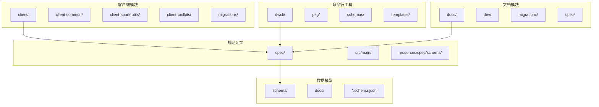
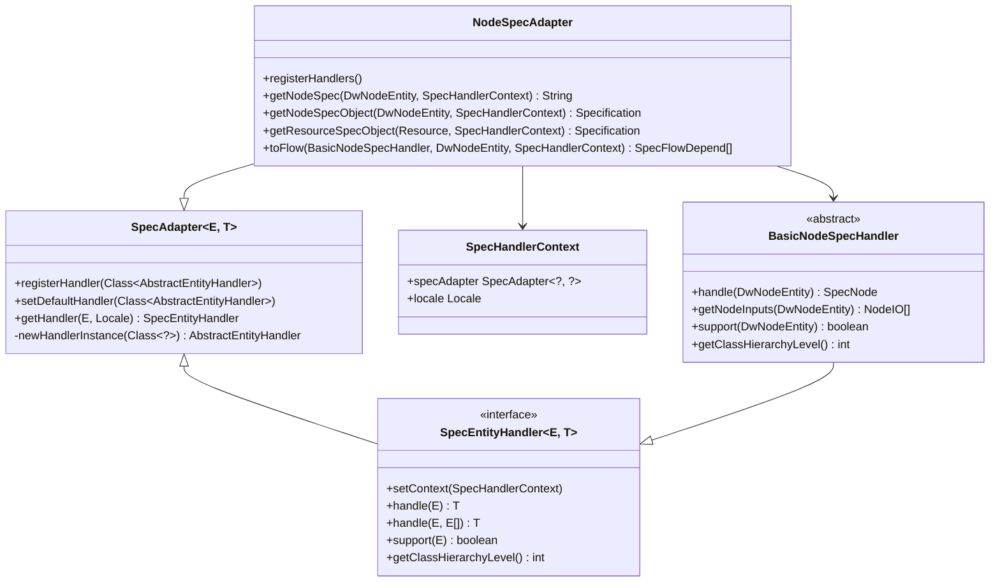
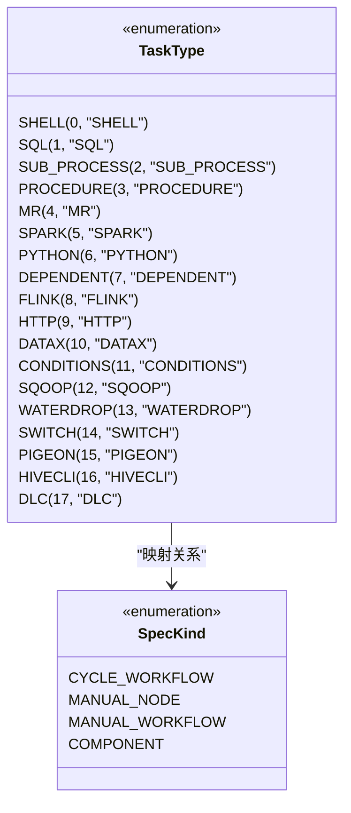
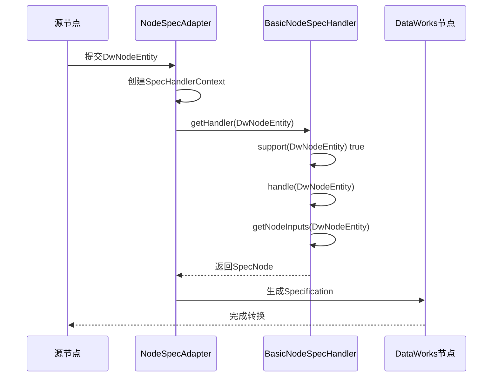
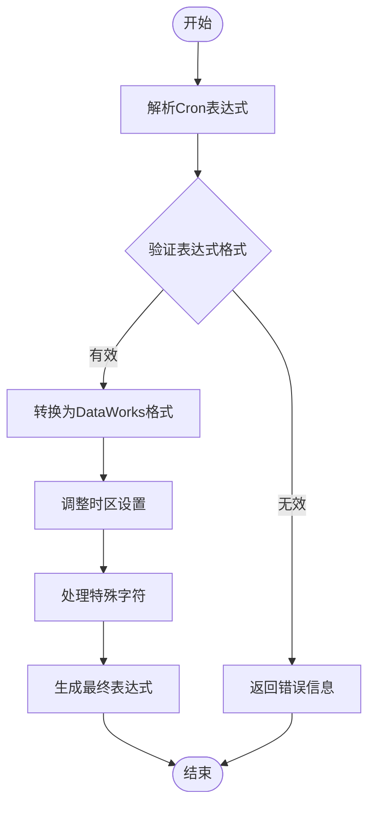
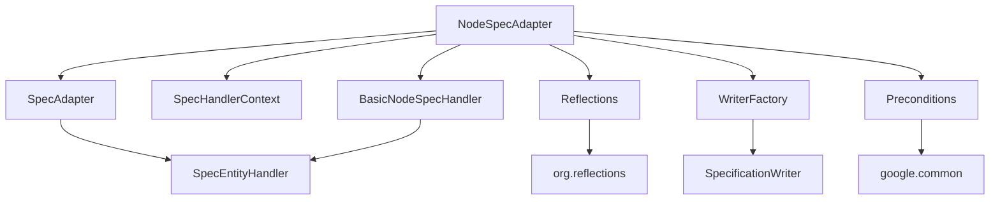

# 兼容性评估

<cite>
**本文档中引用的文件**  
- [SpecAdapter.java](file://spec/src/main/java/com/aliyun/dataworks/common/spec/adapter/SpecAdapter.java)
- [SpecEntityHandler.java](file://spec/src/main/java/com/aliyun/dataworks/common/spec/adapter/SpecEntityHandler.java)
- [SpecHandlerContext.java](file://spec/src/main/java/com/aliyun/dataworks/common/spec/adapter/SpecHandlerContext.java)
- [NodeSpecAdapter.java](file://client/migrationx/migrationx-domain/migrationx-domain-dataworks/src/main/java/com/aliyun/dataworks/migrationx/domain/dataworks/service/spec/NodeSpecAdapter.java)
- [TaskType.java](file://client/migrationx/migrationx-domain/migrationx-domain-dolphinscheduler/src/main/java/com/aliyun/dataworks/migrationx/domain/dataworks/dolphinscheduler/v2/enums/TaskType.java)
- [CronExpression.java](file://client/migrationx/migrationx-domain/migrationx-domain-dataworks/src/main/java/com/aliyun/dataworks/migrationx/domain/dataworks/utils/quartz/CronExpression.java)
</cite>

## 目录
1. [引言](#引言)
2. [项目结构](#项目结构)
3. [核心组件](#核心组件)
4. [架构概述](#架构概述)
5. [详细组件分析](#详细组件分析)
6. [依赖分析](#依赖分析)
7. [性能考虑](#性能考虑)
8. [故障排除指南](#故障排除指南)
9. [结论](#结论)

## 引言
本文档深入分析源调度系统与DataWorks之间的技术兼容性差距，重点评估节点类型映射关系、参数传递机制差异、调度表达式转换以及安全模型的匹配度。通过分析NodeSpecAdapter等适配器类和transformer-config.json配置文件，提供兼容性检查清单和自动化检测脚本示例，帮助用户识别不支持的特性并规划替代方案。

## 项目结构
本项目采用模块化设计，主要包含客户端、迁移工具、规范定义等核心模块。项目结构清晰地分离了不同功能域，便于维护和扩展。

**图示来源**  
- [NodeSpecAdapter.java](file://client/migrationx/migrationx-domain/migrationx-domain-dataworks/src/main/java/com/aliyun/dataworks/migrationx/domain/dataworks/service/spec/NodeSpecAdapter.java)
- [SpecAdapter.java](file://spec/src/main/java/com/aliyun/dataworks/common/spec/adapter/SpecAdapter.java)

**本节来源**  
- [NodeSpecAdapter.java](file://client/migrationx/migrationx-domain/migrationx-domain-dataworks/src/main/java/com/aliyun/dataworks/migrationx/domain/dataworks/service/spec/NodeSpecAdapter.java)
- [SpecAdapter.java](file://spec/src/main/java/com/aliyun/dataworks/common/spec/adapter/SpecAdapter.java)

## 核心组件
系统的核心组件包括适配器模式实现的NodeSpecAdapter、规范实体处理器SpecEntityHandler以及上下文管理器SpecHandlerContext。这些组件共同构成了调度系统兼容性转换的基础框架。

**本节来源**  
- [SpecAdapter.java](file://spec/src/main/java/com/aliyun/dataworks/common/spec/adapter/SpecAdapter.java)
- [SpecEntityHandler.java](file://spec/src/main/java/com/aliyun/dataworks/common/spec/adapter/SpecEntityHandler.java)
- [SpecHandlerContext.java](file://spec/src/main/java/com/aliyun/dataworks/common/spec/adapter/SpecHandlerContext.java)

## 架构概述
系统采用适配器模式实现不同调度系统之间的兼容性转换，通过注册处理器机制动态处理各种节点类型，实现了灵活的扩展能力。

**图示来源**  
- [NodeSpecAdapter.java](file://client/migrationx/migrationx-domain/migrationx-domain-dataworks/src/main/java/com/aliyun/dataworks/migrationx/domain/dataworks/service/spec/NodeSpecAdapter.java)
- [SpecAdapter.java](file://spec/src/main/java/com/aliyun/dataworks/common/spec/adapter/SpecAdapter.java)
- [SpecEntityHandler.java](file://spec/src/main/java/com/aliyun/dataworks/common/spec/adapter/SpecEntityHandler.java)
- [SpecHandlerContext.java](file://spec/src/main/java/com/aliyun/dataworks/common/spec/adapter/SpecHandlerContext.java)

## 详细组件分析

### 节点类型映射分析
系统通过TaskType枚举定义了DolphinScheduler与DataWorks之间的节点类型映射关系，确保不同类型的任务能够正确转换。

**图示来源**  
- [TaskType.java](file://client/migrationx/migrationx-domain/migrationx-domain-dolphinscheduler/src/main/java/com/aliyun/dataworks/migrationx/domain/dataworks/dolphinscheduler/v2/enums/TaskType.java)
- [NodeSpecAdapter.java](file://client/migrationx/migrationx-domain/migrationx-domain-dataworks/src/main/java/com/aliyun/dataworks/migrationx/domain/dataworks/service/spec/NodeSpecAdapter.java)

### 参数传递机制分析
系统通过SpecVariable和SpecScript等组件实现参数传递机制的转换，支持不同作用域和引用语法的参数映射。

**图示来源**  
- [NodeSpecAdapter.java](file://client/migrationx/migrationx-domain/migrationx-domain-dataworks/src/main/java/com/aliyun/dataworks/migrationx/domain/dataworks/service/spec/NodeSpecAdapter.java)
- [SpecEntityHandler.java](file://spec/src/main/java/com/aliyun/dataworks/common/spec/adapter/SpecEntityHandler.java)

### 调度表达式转换分析
系统通过CronExpression组件实现调度表达式的转换，确保Cron表达式在不同系统间的兼容性。

**图示来源**  
- [CronExpression.java](file://client/migrationx/migrationx-domain/migrationx-domain-dataworks/src/main/java/com/aliyun/dataworks/migrationx/domain/dataworks/utils/quartz/CronExpression.java)
- [NodeSpecAdapter.java](file://client/migrationx/migrationx-domain/migrationx-domain-dataworks/src/main/java/com/aliyun/dataworks/migrationx/domain/dataworks/service/spec/NodeSpecAdapter.java)

**本节来源**  
- [TaskType.java](file://client/migrationx/migrationx-domain/migrationx-domain-dolphinscheduler/src/main/java/com/aliyun/dataworks/migrationx/domain/dataworks/dolphinscheduler/v2/enums/TaskType.java)
- [CronExpression.java](file://client/migrationx/migrationx-domain/migrationx-domain-dataworks/src/main/java/com/aliyun/dataworks/migrationx/domain/dataworks/utils/quartz/CronExpression.java)

## 依赖分析
系统通过Maven依赖管理确保各模块间的正确依赖关系，同时通过适配器模式降低模块间的耦合度。

**图示来源**  
- [NodeSpecAdapter.java](file://client/migrationx/migrationx-domain/migrationx-domain-dataworks/src/main/java/com/aliyun/dataworks/migrationx/domain/dataworks/service/spec/NodeSpecAdapter.java)
- [pom.xml](file://pom.xml)

**本节来源**  
- [NodeSpecAdapter.java](file://client/migrationx/migrationx-domain/migrationx-domain-dataworks/src/main/java/com/aliyun/dataworks/migrationx/domain/dataworks/service/spec/NodeSpecAdapter.java)
- [pom.xml](file://pom.xml)

## 性能考虑
系统在设计时考虑了性能优化，通过缓存处理器实例、批量处理节点转换等方式提高转换效率。适配器模式的使用也确保了系统具有良好的扩展性和维护性。

## 故障排除指南
当遇到兼容性问题时，建议按照以下步骤进行排查：
1. 检查节点类型是否在TaskType枚举中定义
2. 验证Cron表达式格式是否正确
3. 确认参数作用域和引用语法是否匹配
4. 检查安全模型配置是否一致

**本节来源**  
- [NodeSpecAdapter.java](file://client/migrationx/migrationx-domain/migrationx-domain-dataworks/src/main/java/com/aliyun/dataworks/migrationx/domain/dataworks/service/spec/NodeSpecAdapter.java)
- [TaskType.java](file://client/migrationx/migrationx-domain/migrationx-domain-dolphinscheduler/src/main/java/com/aliyun/dataworks/migrationx/domain/dataworks/dolphinscheduler/v2/enums/TaskType.java)

## 结论
本文档详细分析了源调度系统与DataWorks之间的技术兼容性差距，重点阐述了节点类型映射、参数传递机制、调度表达式转换等方面的技术细节。通过适配器模式和规范化的转换流程，系统能够有效地实现不同调度系统间的兼容性转换，为用户提供了可靠的迁移解决方案。